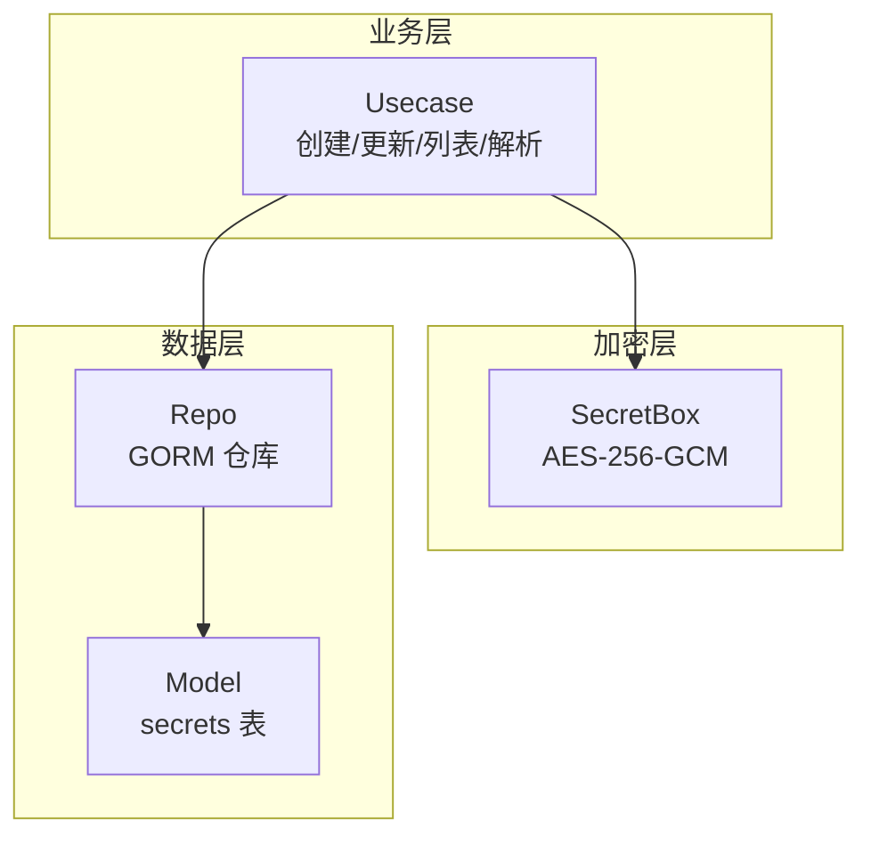
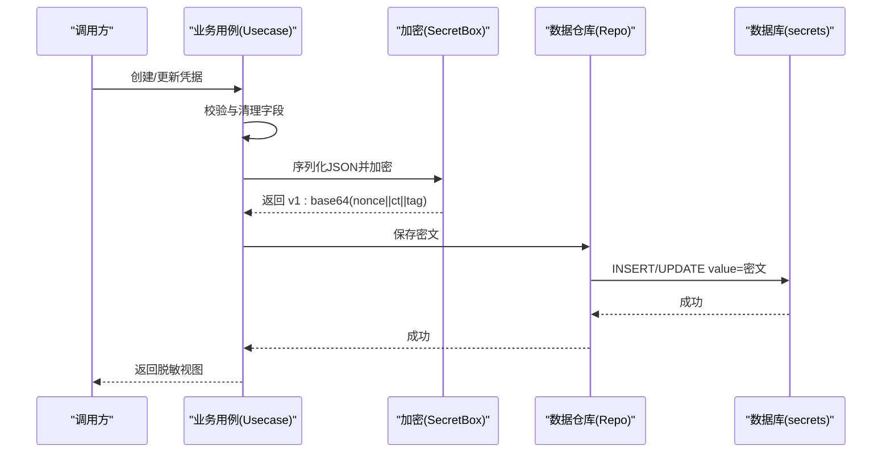
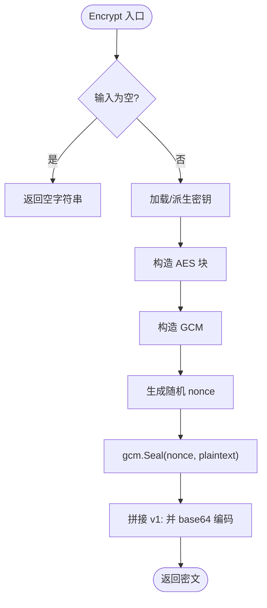
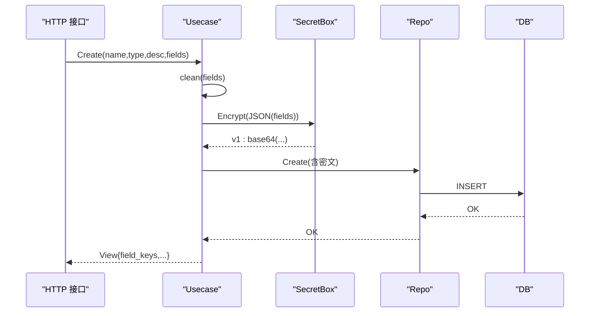
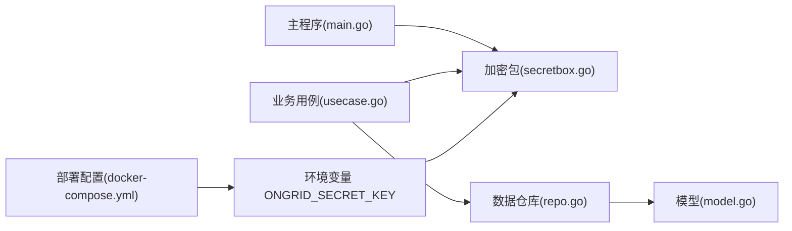

# 加密存储机制

<cite>
**本文引用的文件**
- [secretbox.go](file://internal/pkg/secretbox/secretbox.go)
- [secretbox_test.go](file://internal/pkg/secretbox/secretbox_test.go)
- [usecase.go](file://internal/manager/biz/secret/usecase.go)
- [model.go](file://internal/manager/model/secret/model.go)
- [repo.go](file://internal/manager/data/secret/store/repo.go)
- [migrate.go](file://internal/manager/data/secret/store/migrate.go)
- [main.go](file://cmd/ongrid/main.go)
- [docker-compose.yml](file://deploy/install/docker-compose.yml)
</cite>

## 目录
1. [简介](#简介)
2. [项目结构](#项目结构)
3. [核心组件](#核心组件)
4. [架构总览](#架构总览)
5. [详细组件分析](#详细组件分析)
6. [依赖关系分析](#依赖关系分析)
7. [性能考虑](#性能考虑)
8. [故障排查指南](#故障排查指南)
9. [结论](#结论)
10. [附录：使用示例与调优建议](#附录使用示例与调优建议)

## 简介
本文件系统性阐述敏感数据的加密存储机制，覆盖算法选择、密钥派生、数据格式、加解密流程、错误恢复、密钥管理与版本迁移，以及性能优化与批量策略。重点说明 AES-256-GCM 的实现细节、nonce 生成与 GCM tag 验证过程，并给出可操作的部署与调优建议。

## 项目结构
敏感数据存储围绕“业务层封装 + 通用加密包 + 持久化仓库”的分层设计：
- 通用加密包：提供 AES-256-GCM 的密封/解封能力与密钥管理。
- 业务层：负责字段映射、序列化、调用加密包、对外暴露只读视图（不返回明文）。
- 数据层：仅存储密文，不感知明文；通过迁移脚本保证表结构演进。

**图表来源**
- [usecase.go:48-145](file://internal/manager/biz/secret/usecase.go#L48-L145)
- [secretbox.go:53-109](file://internal/pkg/secretbox/secretbox.go#L53-L109)
- [repo.go:24-88](file://internal/manager/data/secret/store/repo.go#L24-L88)
- [model.go:17-45](file://internal/manager/model/secret/model.go#L17-L45)

**章节来源**
- [usecase.go:1-231](file://internal/manager/biz/secret/usecase.go#L1-L231)
- [secretbox.go:1-110](file://internal/pkg/secretbox/secretbox.go#L1-L110)
- [repo.go:1-100](file://internal/manager/data/secret/store/repo.go#L1-L100)
- [model.go:1-46](file://internal/manager/model/secret/model.go#L1-L46)

## 核心组件
- SecretBox（通用加密）：基于 AES-256-GCM，密钥由环境变量派生，输出带版本前缀的 base64 密文。
- 业务用例（Usecase）：将字段映射序列化为 JSON，调用 SecretBox 加密后落库；读取时按需解密并做红黑处理。
- 数据仓库（Repo）：纯存储接口，不接触明文；支持增删改查与唯一性约束。
- 模型（Model）：定义 secrets 表结构，Data 列存储密文。

**章节来源**
- [secretbox.go:1-110](file://internal/pkg/secretbox/secretbox.go#L1-L110)
- [usecase.go:48-145](file://internal/manager/biz/secret/usecase.go#L48-L145)
- [repo.go:24-88](file://internal/manager/data/secret/store/repo.go#L24-L88)
- [model.go:17-45](file://internal/manager/model/secret/model.go#L17-L45)

## 架构总览
下图展示从 API 到数据库的完整写入路径，突出加密边界与数据流向。

**图表来源**
- [usecase.go:48-89](file://internal/manager/biz/secret/usecase.go#L48-L89)
- [secretbox.go:53-75](file://internal/pkg/secretbox/secretbox.go#L53-L75)
- [repo.go:24-53](file://internal/manager/data/secret/store/repo.go#L24-L53)
- [model.go:32-35](file://internal/manager/model/secret/model.go#L32-L35)

## 详细组件分析

### SecretBox 加密实现与数据格式
- 算法：AES-256-GCM，提供认证加密（AEAD），同时保证机密性与完整性。
- 密钥派生：从环境变量 ONGRID_SECRET_KEY 经 SHA-256 得到 32 字节密钥；若未设置则回退到固定默认值并标记为弱密钥，启动时可告警。
- Nonce 生成：每次加密随机生成与 GCM 要求等长的 nonce，使用系统安全随机源。
- 密文格式：v1:base64(nonce || ciphertext+tag)。版本前缀便于未来方案升级与兼容。
- 解密流程：去除版本前缀 → base64 解码 → 分割 nonce 与密文+tag → GCM.Open 验证 tag 并还原明文；无版本前缀视为历史明文以支持向前迁移。

**图表来源**
- [secretbox.go:53-75](file://internal/pkg/secretbox/secretbox.go#L53-L75)

**章节来源**
- [secretbox.go:23-51](file://internal/pkg/secretbox/secretbox.go#L23-L51)
- [secretbox.go:53-109](file://internal/pkg/secretbox/secretbox.go#L53-L109)

### 业务用例：序列化、加密与脱敏
- 写入：将字段 map 序列化为 JSON，调用 SecretBox 加密后存入 Data 列；对外 API 仅返回字段名集合，不返回值。
- 读取：按名称获取密文，尝试解密；列表接口对解密失败采用“尽力而为”，仍返回元数据但不包含字段值。
- 注入：根据凭据类型与注入规则，将解密后的字段映射为进程内环境变量或文件内容，供技能/外部服务使用。

**图表来源**
- [usecase.go:48-89](file://internal/manager/biz/secret/usecase.go#L48-L89)
- [secretbox.go:53-75](file://internal/pkg/secretbox/secretbox.go#L53-L75)
- [repo.go:24-36](file://internal/manager/data/secret/store/repo.go#L24-L36)

**章节来源**
- [usecase.go:48-145](file://internal/manager/biz/secret/usecase.go#L48-L145)
- [repo.go:24-88](file://internal/manager/data/secret/store/repo.go#L24-L88)

### 数据模型与迁移
- 模型：secrets 表包含 name、type、description、value（存储密文）、时间戳等字段。
- 迁移：通过 AutoMigrate 注册 secrets 表结构变更，确保 schema 演进可控。

**章节来源**
- [model.go:17-45](file://internal/manager/model/secret/model.go#L17-L45)
- [migrate.go:9-13](file://internal/manager/data/secret/store/migrate.go#L9-L13)

### 密钥管理与版本控制
- 密钥来源：环境变量 ONGRID_SECRET_KEY；缺失时使用内置默认值并标记弱密钥，启动时可告警。
- 版本前缀：密文以 v1: 开头，便于后续升级加密方案或密钥派生方式时保持向后兼容。
- 迁移策略：
  - 读取时若无版本前缀，视为历史明文直接返回，允许在运行期逐步重加密。
  - 建议在写路径中检测明文并自动重写为密文，完成平滑迁移。

**章节来源**
- [secretbox.go:23-51](file://internal/pkg/secretbox/secretbox.go#L23-L51)
- [secretbox.go:77-109](file://internal/pkg/secretbox/secretbox.go#L77-L109)

### 错误恢复与健壮性
- 解密失败：当 key 错误或密文损坏时，Open 会报错；列表接口对解密失败采取降级策略，仍返回元数据。
- 历史明文兼容：无前缀的密文串被当作明文透传，避免迁移期间阻断读取。
- 平台差异：边缘侧 DPAPI 仅在 Windows 可用，非 Windows 平台返回不支持错误，避免编译期耦合。

**章节来源**
- [secretbox.go:77-109](file://internal/pkg/secretbox/secretbox.go#L77-L109)
- [usecase.go:123-135](file://internal/manager/biz/secret/usecase.go#L123-L135)

## 依赖关系分析
- 业务层依赖加密层与数据层，数据层仅依赖 ORM 与模型。
- 主程序在启动时引入加密包，用于密钥强度检查与日志告警。
- 部署配置通过环境变量注入密钥，确保密钥不在数据库中。

**图表来源**
- [main.go:53](file://cmd/ongrid/main.go#L53)
- [secretbox.go:23-51](file://internal/pkg/secretbox/secretbox.go#L23-L51)
- [usecase.go:15-19](file://internal/manager/biz/secret/usecase.go#L15-L19)
- [repo.go:6-16](file://internal/manager/data/secret/store/repo.go#L6-L16)
- [model.go:17-45](file://internal/manager/model/secret/model.go#L17-L45)
- [docker-compose.yml:69-72](file://deploy/install/docker-compose.yml#L69-L72)

**章节来源**
- [main.go:53](file://cmd/ongrid/main.go#L53)
- [docker-compose.yml:69-72](file://deploy/install/docker-compose.yml#L69-L72)

## 性能考虑
- 单次加解密开销：AES-GCM 在 Go 标准库中高效，适合小对象（凭据字段 JSON）频繁加解密。
- 并发与批处理：
  - 当前实现为逐条加解密；在高吞吐场景可结合并发扇出与信号量限制并发度，参考项目中已有的 runBatch 模式进行扩展。
  - 注意结果顺序保持与错误聚合，避免丢失失败项。
- 缓存策略：
  - 密钥派生使用一次性初始化，避免重复计算。
  - 对于高频读取的凭据，可在内存中缓存解密结果并设置合理 TTL，减少重复解密。
- I/O 优化：
  - 列表接口对解密失败采用降级，避免阻塞整体响应。
  - 批量写入时合并事务，减少数据库往返。

[本节为通用性能指导，不直接分析具体代码文件]

## 故障排查指南
- 解密失败提示“open (wrong KEY?)”：检查环境变量是否正确设置且未被篡改；确认密文是否来自同一密钥环境。
- 列表接口部分记录无字段值：可能该记录为历史明文或解密失败；可通过写路径触发重加密修复。
- 启动警告弱密钥：当未设置密钥时，系统将使用内置默认值并标记弱密钥；生产环境务必设置强密钥。
- 平台不支持：边缘侧 DPAPI 在非 Windows 平台不可用，需通过其他机制管理令牌。

**章节来源**
- [secretbox.go:77-109](file://internal/pkg/secretbox/secretbox.go#L77-L109)
- [usecase.go:123-135](file://internal/manager/biz/secret/usecase.go#L123-L135)
- [secretbox.go:23-51](file://internal/pkg/secretbox/secretbox.go#L23-L51)

## 结论
本项目采用 AES-256-GCM 对敏感数据进行认证加密，密钥来源于环境变量并通过哈希派生，密文携带版本前缀以支持平滑升级。业务层严格隔离明文与密文，对外仅暴露脱敏视图。通过历史明文兼容与写路径重加密策略，实现无感迁移。配合合理的并发与缓存策略，可在保障安全性的同时满足性能需求。

[本节为总结性内容，不直接分析具体代码文件]

## 附录：使用示例与调优建议
- 部署配置
  - 在环境变量中设置强密钥：ONGRID_SECRET_KEY 应为足够长度的随机字符串，避免默认弱密钥。
  - 参考部署模板中的环境变量注入方式。

- 使用示例（概念性步骤）
  - 创建凭据：提交 name、type、description 与字段映射；系统将其序列化为 JSON 并加密后存储。
  - 读取列表：返回凭据元信息与字段键集合，不包含值。
  - 解析注入：按类型规则将字段映射为进程内环境变量或文件内容，供下游使用。

- 性能调优建议
  - 高并发场景：对批量加解密任务使用并发扇出与并发上限控制，保持结果顺序与错误聚合。
  - 缓存热点：对频繁访问的凭据解密结果进行短期缓存，降低重复解密成本。
  - 监控指标：统计加解密耗时、失败率与缓存命中率，定位瓶颈。

**章节来源**
- [docker-compose.yml:69-72](file://deploy/install/docker-compose.yml#L69-L72)
- [usecase.go:48-145](file://internal/manager/biz/secret/usecase.go#L48-L145)