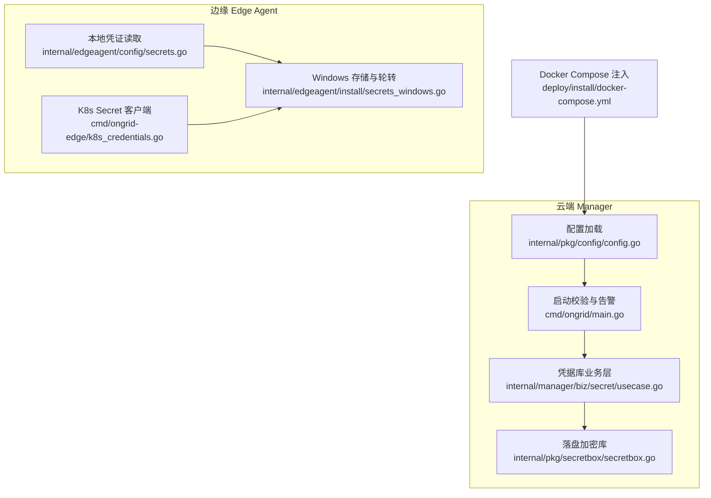
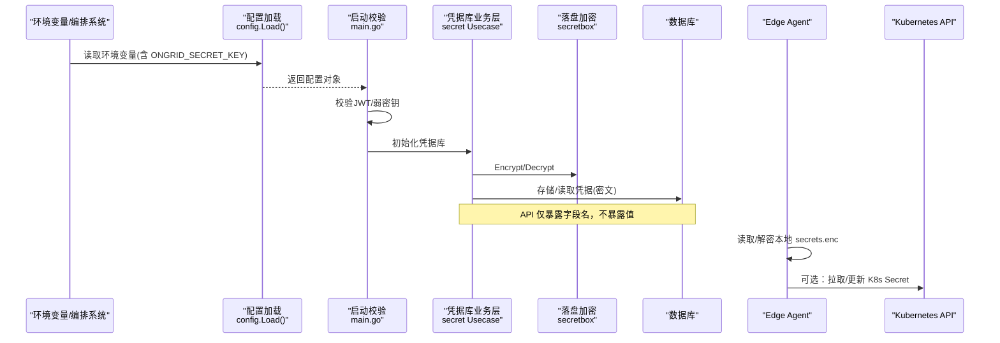
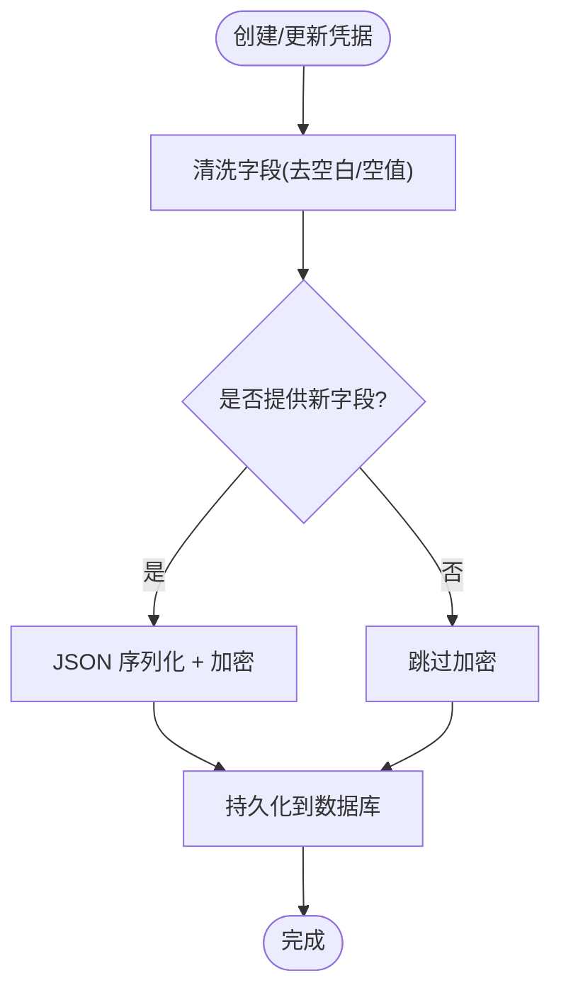
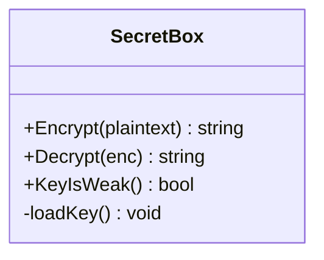
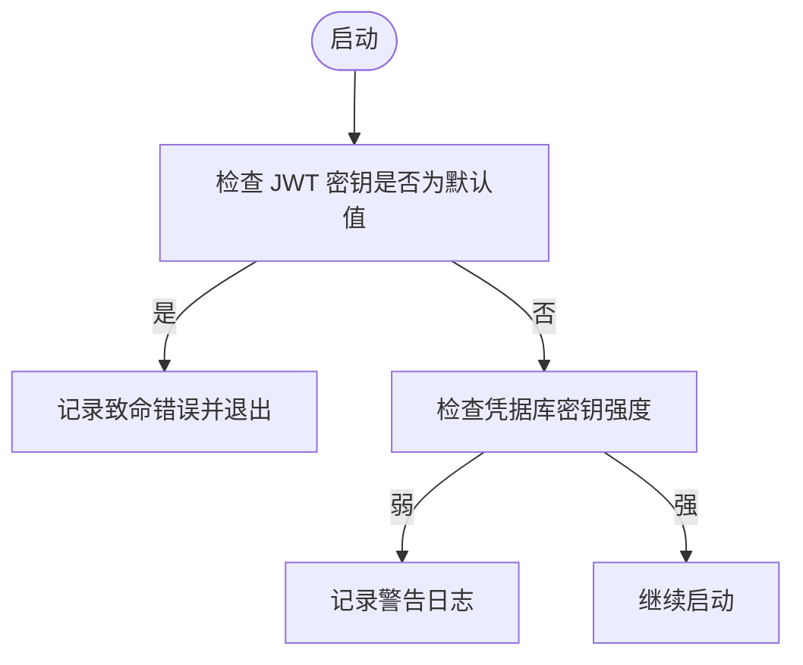
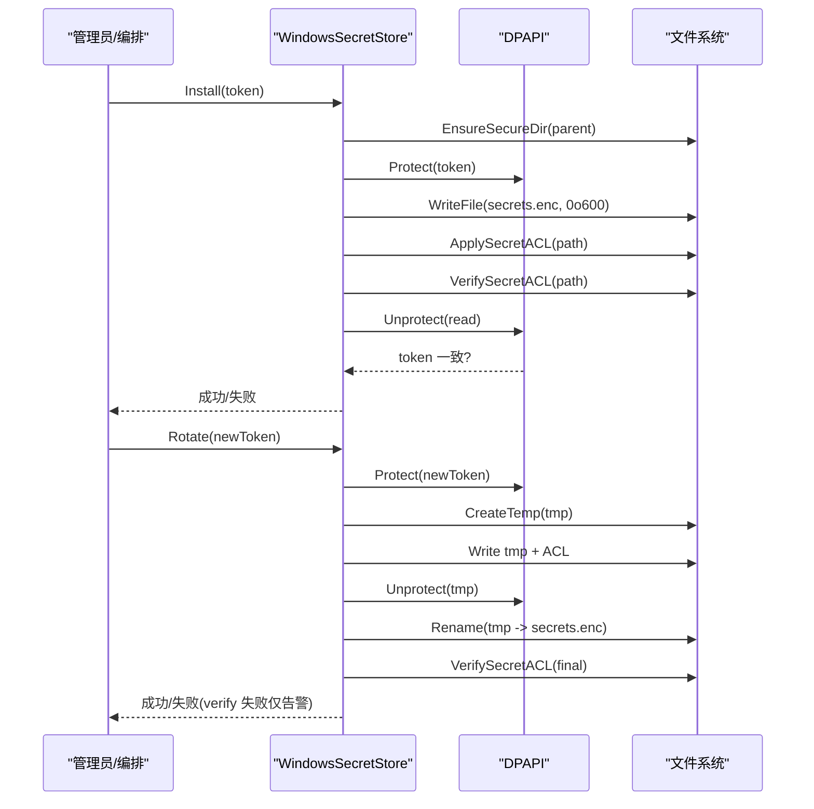
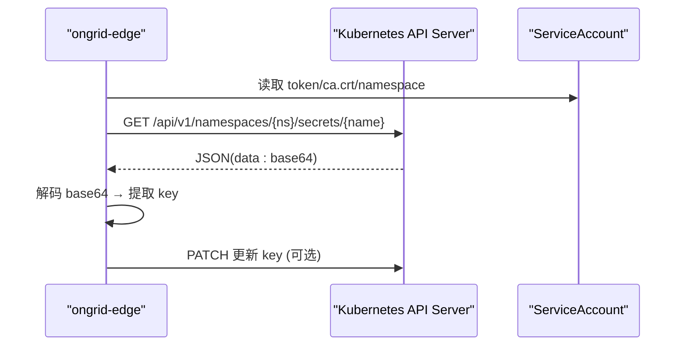
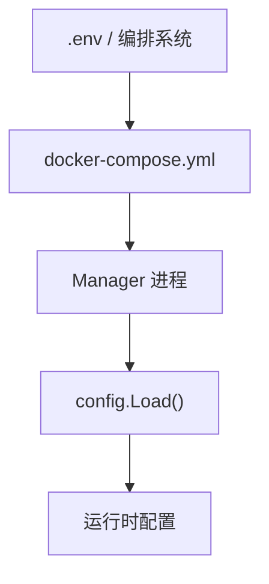
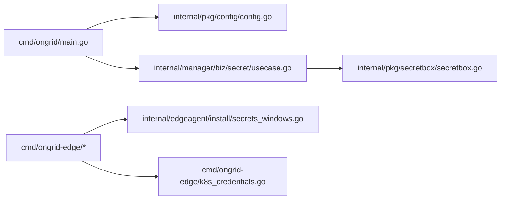

# 密钥管理策略

<cite>
**本文引用的文件**
- [secretbox.go](file://internal/pkg/secretbox/secretbox.go)
- [usecase.go](file://internal/manager/biz/secret/usecase.go)
- [main.go](file://cmd/ongrid/main.go)
- [config.go](file://internal/pkg/config/config.go)
- [docker-compose.yml](file://deploy/install/docker-compose.yml)
- [secrets_windows.go](file://internal/edgeagent/install/secrets_windows.go)
- [secrets.go](file://internal/edgeagent/config/secrets.go)
- [k8s_credentials.go](file://cmd/ongrid-edge/k8s_credentials.go)
</cite>

## 目录
1. [简介](#简介)
2. [项目结构](#项目结构)
3. [核心组件](#核心组件)
4. [架构总览](#架构总览)
5. [详细组件分析](#详细组件分析)
6. [依赖关系分析](#依赖关系分析)
7. [性能与安全考量](#性能与安全考量)
8. [故障排查指南](#故障排查指南)
9. [结论](#结论)
10. [附录](#附录)

## 简介
本文件系统性阐述 ONGRID 的密钥管理策略与安全最佳实践，覆盖以下主题：
- 环境配置：ONGRID_SECRET_KEY 的作用、强度要求与启动期检测
- 数据保护：凭据库（Credential Vault）的落盘加密、字段级脱敏与注入路径
- 密钥轮换：边缘端 secrets.enc 的原子轮转与权限加固；云端凭据引用隔离与清理
- 备份恢复：数据库导出与密钥分离原则、迁移兼容性与回滚注意事项
- 多环境与容器化：Compose 环境变量注入、Kubernetes Secrets 集成与边车读取
- 自动化与监控：弱密钥告警、健康检查与可观测性建议

## 项目结构
本项目将“密钥”分为两类：
- 云端凭据库（Manager）：使用 AES-256-GCM 对 JSON 字段进行落盘加密，密钥由环境变量派生，API 仅暴露字段名不暴露值。
- 边缘端本地凭证（Edge Agent）：Windows 平台使用 DPAPI 加密存储 secrets.enc，并提供原子 Rotate 与 ACL 校验。

**图示来源**
- [config.go:417-549](file://internal/pkg/config/config.go#L417-L549)
- [main.go:300-315](file://cmd/ongrid/main.go#L300-L315)
- [usecase.go:48-175](file://internal/manager/biz/secret/usecase.go#L48-L175)
- [secretbox.go:31-109](file://internal/pkg/secretbox/secretbox.go#L31-L109)
- [secrets.go:12-38](file://internal/edgeagent/config/secrets.go#L12-L38)
- [secrets_windows.go:36-169](file://internal/edgeagent/install/secrets_windows.go#L36-L169)
- [k8s_credentials.go:314-415](file://cmd/ongrid-edge/k8s_credentials.go#L314-L415)
- [docker-compose.yml:52-77](file://deploy/install/docker-compose.yml#L52-L77)

**章节来源**
- [config.go:417-549](file://internal/pkg/config/config.go#L417-L549)
- [main.go:300-315](file://cmd/ongrid/main.go#L300-L315)
- [usecase.go:48-175](file://internal/manager/biz/secret/usecase.go#L48-L175)
- [secretbox.go:31-109](file://internal/pkg/secretbox/secretbox.go#L31-L109)
- [secrets.go:12-38](file://internal/edgeagent/config/secrets.go#L12-L38)
- [secrets_windows.go:36-169](file://internal/edgeagent/install/secrets_windows.go#L36-L169)
- [k8s_credentials.go:314-415](file://cmd/ongrid-edge/k8s_credentials.go#L314-L415)
- [docker-compose.yml:52-77](file://deploy/install/docker-compose.yml#L52-L77)

## 核心组件
- 落盘加密库（secretbox）
  - 算法：AES-256-GCM，密文格式 v1:base64(nonce||ciphertext+tag)，支持向后兼容明文行。
  - 密钥派生：从环境变量 ONGRID_SECRET_KEY 经 SHA-256 得到 32 字节密钥；未设置时启用内置弱密钥并标记 KeyIsWeak。
- 凭据库业务层（secret usecase）
  - 创建/更新/删除凭据，落盘前对字段 JSON 进行密封（加密），列表/获取 API 仅返回字段名（脱敏）。
  - 提供 ResolveFields/ResolveInjection 用于进程内注入环境变量，遵循类型映射规则。
- 启动期安全校验
  - JWT 默认密钥强制拒绝启动；凭据库弱密钥在启动期记录警告日志。
- 边缘端本地凭证
  - Windows 平台通过 DPAPI 加密 secrets.enc，Install/Rotate 包含目录 ACL 限制、临时文件写入、原子替换与轮转后验证。
  - 非 Windows 平台通过 config.LoadSecrets 读取并解密 broker token，失败时回退到环境变量。
- Kubernetes 集成
  - ongrid-edge 可通过 K8s Secret 拉取/更新遥测密钥等凭据，使用 ServiceAccount 认证访问 API Server。

**章节来源**
- [secretbox.go:31-109](file://internal/pkg/secretbox/secretbox.go#L31-L109)
- [usecase.go:48-175](file://internal/manager/biz/secret/usecase.go#L48-L175)
- [main.go:300-315](file://cmd/ongrid/main.go#L300-L315)
- [secrets_windows.go:36-169](file://internal/edgeagent/install/secrets_windows.go#L36-L169)
- [secrets.go:12-38](file://internal/edgeagent/config/secrets.go#L12-L38)
- [k8s_credentials.go:314-415](file://cmd/ongrid-edge/k8s_credentials.go#L314-L415)

## 架构总览
下图展示密钥在系统中的流转：配置加载 → 启动校验 → 凭据库加密/解密 → 注入目标服务；以及边缘端本地凭证的读写与轮转。

**图示来源**
- [config.go:417-549](file://internal/pkg/config/config.go#L417-L549)
- [main.go:300-315](file://cmd/ongrid/main.go#L300-L315)
- [usecase.go:48-175](file://internal/manager/biz/secret/usecase.go#L48-L175)
- [secretbox.go:31-109](file://internal/pkg/secretbox/secretbox.go#L31-L109)
- [secrets_windows.go:36-169](file://internal/edgeagent/install/secrets_windows.go#L36-L169)
- [k8s_credentials.go:314-415](file://cmd/ongrid-edge/k8s_credentials.go#L314-L415)

## 详细组件分析

### 云端凭据库（HLD-017）
- 设计要点
  - 落盘加密：字段 JSON 经 secretbox.Encrypt 后存入数据库，避免明文泄露。
  - 脱敏输出：List/Get 接口仅返回字段键名，不返回值。
  - 进程内注入：ResolveFields/ResolveInjection 仅在进程内解密并注入环境变量，不序列化传输。
- 关键流程
  - Create/Update：清洗字段 → 密封 → 持久化。
  - List：读取所有凭据 → 尝试解密以提取字段键 → 构造 View（不含值）。
  - ResolveInjection：按类型映射生成环境变量计划，缺失字段会返回提示。

**图示来源**
- [usecase.go:48-89](file://internal/manager/biz/secret/usecase.go#L48-L89)
- [usecase.go:179-199](file://internal/manager/biz/secret/usecase.go#L179-L199)

**章节来源**
- [usecase.go:48-175](file://internal/manager/biz/secret/usecase.go#L48-L175)

### 落盘加密库（secretbox）
- 算法与格式
  - AES-256-GCM，密文前缀 v1:base64(...)，便于未来方案升级。
- 密钥派生与强度检测
  - 从 ONGRID_SECRET_KEY 派生 32 字节密钥；未设置时使用固定派生密钥并标记弱密钥。
  - KeyIsWeak() 供启动期告警使用。
- 兼容性
  - 无前缀的旧明文行可被 Decrypt 直接透传，便于平滑迁移。

**图示来源**
- [secretbox.go:31-109](file://internal/pkg/secretbox/secretbox.go#L31-L109)

**章节来源**
- [secretbox.go:31-109](file://internal/pkg/secretbox/secretbox.go#L31-L109)

### 启动期安全校验与告警
- JWT 密钥强制策略
  - 若仍为内置默认值，则记录致命错误并退出，防止弱密钥上线。
- 凭据库弱密钥告警
  - 启动期调用 KeyIsWeak()，若为真则记录警告日志，提示设置强随机密钥。

**图示来源**
- [main.go:300-315](file://cmd/ongrid/main.go#L300-L315)
- [main.go:2405-2406](file://cmd/ongrid/main.go#L2405-L2406)
- [secretbox.go:46-51](file://internal/pkg/secretbox/secretbox.go#L46-L51)

**章节来源**
- [main.go:300-315](file://cmd/ongrid/main.go#L300-L315)
- [main.go:2405-2406](file://cmd/ongrid/main.go#L2405-L2406)
- [secretbox.go:46-51](file://internal/pkg/secretbox/secretbox.go#L46-L51)

### 边缘端本地凭证（Windows DPAPI）
- Install
  - 确保父目录 ACL 受限 → DPAPI 加密 → 写入 secrets.enc → 应用/验证 ACL → round-trip 校验。
- Rotate
  - 临时文件写入 → 应用 ACL → round-trip 校验 → 原子 rename 替换 → 轮转后再次验证 ACL（失败仅告警，因新 token 已生效）。
- 安全性
  - 临时文件名随机，避免并发竞态；ACL 限制 SYSTEM/Administrators 完全控制。

**图示来源**
- [secrets_windows.go:36-169](file://internal/edgeagent/install/secrets_windows.go#L36-L169)

**章节来源**
- [secrets_windows.go:36-169](file://internal/edgeagent/install/secrets_windows.go#L36-L169)

### Kubernetes Secrets 集成（Edge）
- 能力
  - ongrid-edge 通过环境变量指定 Secret 名称，使用 Pod 的 ServiceAccount 访问 API Server，读取/更新遥测密钥等凭据。
- 流程
  - 构建 HTTP 客户端（TLS 根证书可选）→ GET Secret → 解码 base64 data → 解析 key 值。
  - PATCH 操作用于更新特定 key，便于滚动轮换。

**图示来源**
- [k8s_credentials.go:314-415](file://cmd/ongrid-edge/k8s_credentials.go#L314-L415)

**章节来源**
- [k8s_credentials.go:314-415](file://cmd/ongrid-edge/k8s_credentials.go#L314-L415)

### 多环境与容器化部署
- Docker Compose
  - 通过环境变量注入 JWT、凭据库密钥、数据库连接等敏感信息；强调凭据库密钥应来自 .env，避免随数据库导出泄露。
- 环境变量加载
  - 统一通过 config.Load() 读取，提供合理默认值与开关。

**图示来源**
- [docker-compose.yml:52-77](file://deploy/install/docker-compose.yml#L52-L77)
- [config.go:417-549](file://internal/pkg/config/config.go#L417-L549)

**章节来源**
- [docker-compose.yml:52-77](file://deploy/install/docker-compose.yml#L52-L77)
- [config.go:417-549](file://internal/pkg/config/config.go#L417-L549)

## 依赖关系分析
- 组件耦合
  - main.go 依赖 config 加载与 secretbox 强度检测，组装 secret Usecase。
  - secret Usecase 依赖 secretbox 加解密与 repo 持久化。
  - Edge Agent 依赖 dpapi（Windows）或 config.LoadSecrets（跨平台）与 K8s API。
- 外部依赖
  - MySQL/SQLite（凭据库存储）、Kubernetes API（Edge 侧）、文件系统（Edge 本地凭证）。

**图示来源**
- [main.go:300-315](file://cmd/ongrid/main.go#L300-L315)
- [usecase.go:48-175](file://internal/manager/biz/secret/usecase.go#L48-L175)
- [secretbox.go:31-109](file://internal/pkg/secretbox/secretbox.go#L31-L109)
- [secrets_windows.go:36-169](file://internal/edgeagent/install/secrets_windows.go#L36-L169)
- [k8s_credentials.go:314-415](file://cmd/ongrid-edge/k8s_credentials.go#L314-L415)

**章节来源**
- [main.go:300-315](file://cmd/ongrid/main.go#L300-L315)
- [usecase.go:48-175](file://internal/manager/biz/secret/usecase.go#L48-L175)
- [secretbox.go:31-109](file://internal/pkg/secretbox/secretbox.go#L31-L109)
- [secrets_windows.go:36-169](file://internal/edgeagent/install/secrets_windows.go#L36-L169)
- [k8s_credentials.go:314-415](file://cmd/ongrid-edge/k8s_credentials.go#L314-L415)

## 性能与安全考量
- 性能
  - 加密/解密为轻量对称操作；GCM 模式提供完整性校验，适合高频小对象（字段 JSON）。
  - 列表接口解密失败不影响列出凭据元数据，提升可用性。
- 安全
  - 密钥与数据分离：数据库导出不包含明文凭据。
  - 启动期强制策略：JWT 默认密钥禁止运行；弱密钥告警。
  - 边缘端最小权限：Windows ACL 限制仅 SYSTEM/Administrators 可读写。
  - 原子轮转：临时文件 + 原子 rename，降低并发风险。
- 合规建议
  - 使用强随机密钥（如 openssl rand -base64 32），定期轮换。
  - 通过 CI/CD 注入敏感变量，避免进入代码仓库。
  - 审计日志保留策略与访问控制配合，追踪密钥变更。

[本节为通用指导，无需具体文件来源]

## 故障排查指南
- 启动失败（JWT 默认密钥）
  - 现象：记录致命错误并退出。
  - 处理：设置强随机 JWT 密钥。
- 启动警告（凭据库弱密钥）
  - 现象：记录警告日志，提示设置强密钥。
  - 处理：设置 ONGRID_SECRET_KEY。
- 解密失败（wrong key）
  - 现象：Decrypt 报错提示密钥不正确。
  - 处理：确认当前实例使用的密钥与数据生成时一致；必要时重新加密或迁移。
- 边缘端 secrets.enc 轮转异常
  - 现象：Rotate 失败或 verify 失败。
  - 处理：检查文件系统权限、GPO/AV 影响；关注 warn 日志中路径与错误信息。
- K8s Secret 读取失败
  - 现象：HTTP 状态码非 2xx 或 base64 解码失败。
  - 处理：检查 ServiceAccount 权限、Secret 命名空间与 key 是否存在。

**章节来源**
- [main.go:300-315](file://cmd/ongrid/main.go#L300-L315)
- [main.go:2405-2406](file://cmd/ongrid/main.go#L2405-L2406)
- [secretbox.go:80-109](file://internal/pkg/secretbox/secretbox.go#L80-L109)
- [secrets_windows.go:111-169](file://internal/edgeagent/install/secrets_windows.go#L111-L169)
- [k8s_credentials.go:378-415](file://cmd/ongrid-edge/k8s_credentials.go#L378-L415)

## 结论
ONGRID 采用“密钥与数据分离”的设计，结合强加密、启动期强制校验、边缘端原子轮转与权限加固，形成端到端的密钥管理体系。建议在多环境中严格通过编排系统注入密钥，结合监控告警与审计日志，实现可观测、可追溯、可回滚的密钥生命周期管理。

[本节为总结性内容，无需具体文件来源]

## 附录
- 环境变量参考（部分）
  - ONGRID_SECRET_KEY：凭据库落盘加密密钥（建议 32+ 随机字符）
  - ONGRID_JWT_SECRET：JWT 签名密钥（禁止使用默认值）
  - ONGRID_DB_DSN：数据库连接串
  - ONGRID_EDGE_*：边缘端相关配置
- 建议的自动化脚本思路
  - 密钥生成：openssl rand -base64 32
  - 密钥轮换：调用 Edge Rotate 或更新 K8s Secret；云端凭据通过业务层 Update/CreateManaged 隔离引用
  - 健康检查：读取启动日志关键字（弱密钥警告、JWT 默认密钥错误）
  - 审计：记录密钥变更事件与操作人

[本节为补充信息，无需具体文件来源]