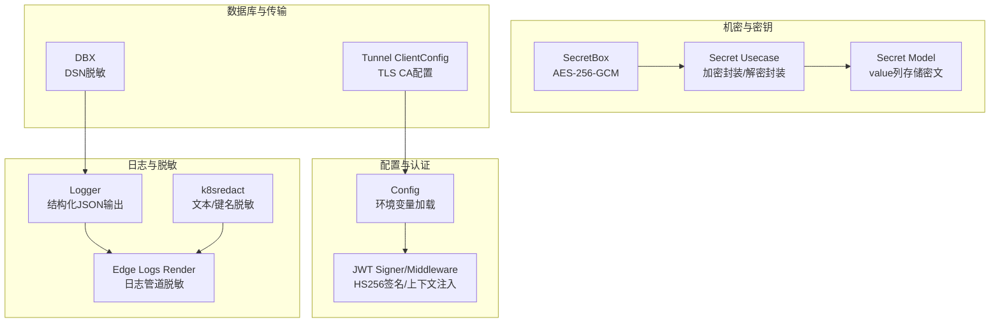
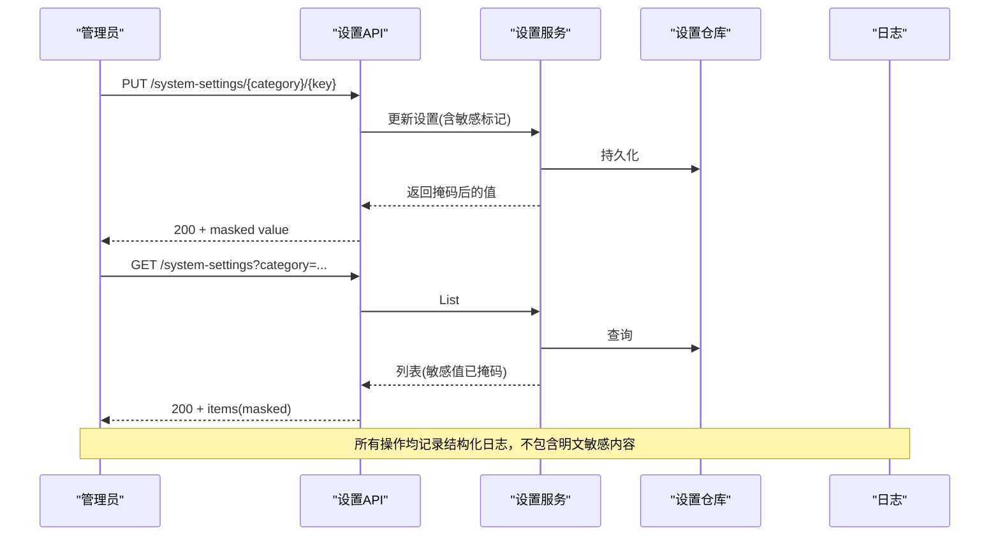
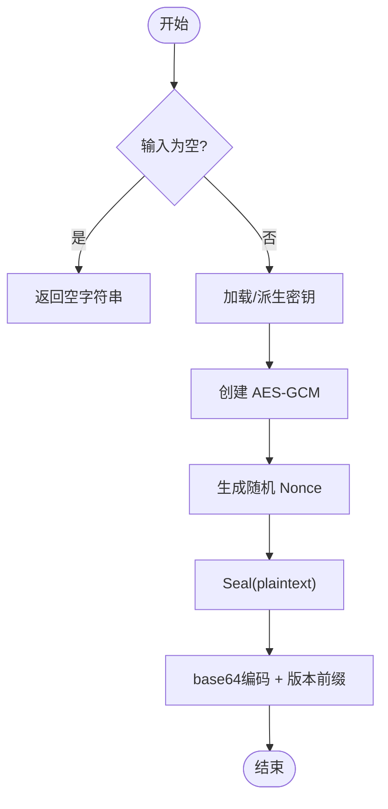
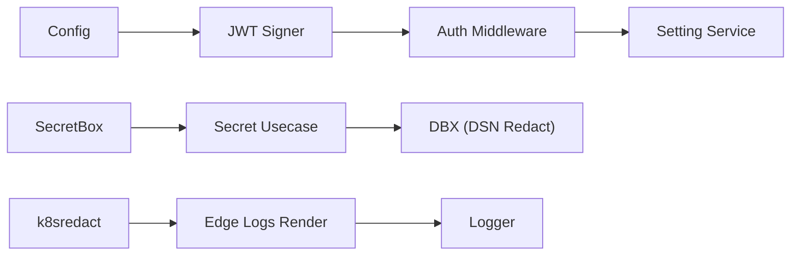

# 数据安全保护

<cite>
**本文引用的文件**
- [internal/pkg/secretbox/secretbox.go](file://internal/pkg/secretbox/secretbox.go)
- [internal/manager/biz/secret/usecase.go](file://internal/manager/biz/secret/usecase.go)
- [internal/manager/model/secret/model.go](file://internal/manager/model/secret/model.go)
- [internal/manager/data/secret/store/migrate.go](file://internal/manager/data/secret/store/migrate.go)
- [internal/pkg/config/config.go](file://internal/pkg/config/config.go)
- [internal/pkg/auth/jwt.go](file://internal/pkg/auth/jwt.go)
- [internal/pkg/auth/middleware.go](file://internal/pkg/auth/middleware.go)
- [internal/pkg/dbx/dbx.go](file://internal/pkg/dbx/dbx.go)
- [internal/pkg/k8sredact/redact.go](file://internal/pkg/k8sredact/redact.go)
- [internal/edgeagent/plugins/logs/render.go](file://internal/edgeagent/plugins/logs/render.go)
- [internal/edgeagent/config/secrets.go](file://internal/edgeagent/config/secrets.go)
- [internal/pkg/logger/logger.go](file://internal/pkg/logger/logger.go)
- [internal/manager/server/setting/http.go](file://internal/manager/server/setting/http.go)
- [internal/manager/biz/setting/service.go](file://internal/manager/biz/setting/service.go)
- [tests/e2e/settings_reveal_test.go](file://tests/e2e/settings_reveal_test.go)
- [internal/pkg/passwd/argon2.go](file://internal/pkg/passwd/argon2.go)
- [internal/pkg/tunnel/types.go](file://internal/pkg/tunnel/types.go)
</cite>

## 目录
1. [简介](#简介)
2. [项目结构](#项目结构)
3. [核心组件](#核心组件)
4. [架构总览](#架构总览)
5. [详细组件分析](#详细组件分析)
6. [依赖关系分析](#依赖关系分析)
7. [性能考量](#性能考量)
8. [故障排查指南](#故障排查指南)
9. [结论](#结论)
10. [附录](#附录)

## 简介
本文件面向 Ongrid 的数据安全保护，覆盖敏感数据的加密存储、传输加密、密钥管理、配置项安全处理、环境变量注入与运行时保护、数据库字段加密、API 请求响应脱敏、日志脱敏以及密钥轮换策略。重点说明 SecretBox（AES-256-GCM）的使用方式、数据加解密流程、密钥来源与强度提示、以及在不同组件中的落地实践。

## 项目结构
与安全相关的关键模块分布在以下位置：
- 机密存储与加解密：internal/pkg/secretbox、internal/manager/biz/secret、internal/manager/model/secret
- 配置与环境变量：internal/pkg/config
- 认证与鉴权：internal/pkg/auth、internal/pkg/authzmw
- 日志与脱敏：internal/pkg/logger、internal/pkg/k8sredact、internal/edgeagent/plugins/logs
- 数据库连接与 DSN 脱敏：internal/pkg/dbx
- 边缘端密钥读取：internal/edgeagent/config/secrets.go
- 系统设置值掩码与揭示：internal/manager/server/setting/http.go、internal/manager/biz/setting/service.go
- 密码哈希：internal/pkg/passwd/argon2.go
- 隧道 TLS 配置：internal/pkg/tunnel/types.go

图表来源
- [internal/pkg/secretbox/secretbox.go:1-109](file://internal/pkg/secretbox/secretbox.go#L1-L109)
- [internal/manager/biz/secret/usecase.go:1-145](file://internal/manager/biz/secret/usecase.go#L1-L145)
- [internal/manager/model/secret/model.go:32-45](file://internal/manager/model/secret/model.go#L32-L45)
- [internal/pkg/config/config.go:414-549](file://internal/pkg/config/config.go#L414-L549)
- [internal/pkg/auth/jwt.go:32-99](file://internal/pkg/auth/jwt.go#L32-L99)
- [internal/pkg/k8sredact/redact.go:1-43](file://internal/pkg/k8sredact/redact.go#L1-L43)
- [internal/edgeagent/plugins/logs/render.go:147-165](file://internal/edgeagent/plugins/logs/render.go#L147-L165)
- [internal/pkg/dbx/dbx.go:130-150](file://internal/pkg/dbx/dbx.go#L130-L150)
- [internal/pkg/tunnel/types.go:33-66](file://internal/pkg/tunnel/types.go#L33-L66)

章节来源
- [internal/pkg/secretbox/secretbox.go:1-109](file://internal/pkg/secretbox/secretbox.go#L1-L109)
- [internal/manager/biz/secret/usecase.go:1-145](file://internal/manager/biz/secret/usecase.go#L1-L145)
- [internal/manager/model/secret/model.go:32-45](file://internal/manager/model/secret/model.go#L32-L45)
- [internal/pkg/config/config.go:414-549](file://internal/pkg/config/config.go#L414-L549)
- [internal/pkg/auth/jwt.go:32-99](file://internal/pkg/auth/jwt.go#L32-L99)
- [internal/pkg/k8sredact/redact.go:1-43](file://internal/pkg/k8sredact/redact.go#L1-L43)
- [internal/edgeagent/plugins/logs/render.go:147-165](file://internal/edgeagent/plugins/logs/render.go#L147-L165)
- [internal/pkg/dbx/dbx.go:130-150](file://internal/pkg/dbx/dbx.go#L130-L150)
- [internal/pkg/tunnel/types.go:33-66](file://internal/pkg/tunnel/types.go#L33-L66)

## 核心组件
- SecretBox 加密库：基于 AES-256-GCM，使用环境密钥派生，支持版本前缀与向后兼容明文读取。
- 机密用例（Usecase）：负责将凭证 JSON 对象密封存储，并在进程内注入路径中解封；对外 API 仅返回字段名，不暴露值。
- 配置加载器：从环境变量加载运行时配置，包含数据库、JWT、通知、Prometheus、Grafana、边缘等关键参数。
- 认证中间件：签发和验证 HS256 的 JWT，并将租户上下文注入到请求上下文中。
- 日志与脱敏：结构化日志输出；对 Kubernetes 标签/注解及日志体进行敏感信息匹配替换；边缘侧日志管道在采集阶段即做脱敏。
- 数据库连接与 DSN 脱敏：记录连接字符串时去除密码片段。
- 系统设置值掩码与揭示：列表接口对敏感值进行掩码，管理员可通过专用接口查看明文。
- 密码哈希：统一使用 Argon2id 进行密码哈希与校验。
- 边缘端密钥读取：通过 DPAPI 解密本地 secrets.enc 获取 broker token。
- 隧道 TLS 配置：支持指定 CA 文件以验证服务端证书。

章节来源
- [internal/pkg/secretbox/secretbox.go:1-109](file://internal/pkg/secretbox/secretbox.go#L1-L109)
- [internal/manager/biz/secret/usecase.go:1-145](file://internal/manager/biz/secret/usecase.go#L1-L145)
- [internal/pkg/config/config.go:414-549](file://internal/pkg/config/config.go#L414-L549)
- [internal/pkg/auth/jwt.go:32-99](file://internal/pkg/auth/jwt.go#L32-L99)
- [internal/pkg/k8sredact/redact.go:1-43](file://internal/pkg/k8sredact/redact.go#L1-L43)
- [internal/edgeagent/plugins/logs/render.go:147-165](file://internal/edgeagent/plugins/logs/render.go#L147-L165)
- [internal/pkg/dbx/dbx.go:130-150](file://internal/pkg/dbx/dbx.go#L130-L150)
- [internal/manager/server/setting/http.go:121-167](file://internal/manager/server/setting/http.go#L121-L167)
- [internal/manager/biz/setting/service.go:205-258](file://internal/manager/biz/setting/service.go#L205-L258)
- [internal/pkg/passwd/argon2.go:1-78](file://internal/pkg/passwd/argon2.go#L1-L78)
- [internal/edgeagent/config/secrets.go:1-39](file://internal/edgeagent/config/secrets.go#L1-L39)
- [internal/pkg/tunnel/types.go:33-66](file://internal/pkg/tunnel/types.go#L33-L66)

## 架构总览
Ongrid 的安全架构围绕“密钥外置、最小暴露、全程脱敏”的原则构建：
- 密钥外置：SecretBox 的对称密钥由环境变量派生，不在数据库中保存；JWT 签名密钥同样来自配置。
- 最小暴露：对外 API 只返回必要信息（如字段名），敏感值默认掩码或隐藏；仅在受控的管理员接口可揭示。
- 全程脱敏：日志、Kubernetes 元数据、边缘日志管道均在写入或传输前进行脱敏。
- 传输安全：隧道客户端支持指定 CA 文件验证服务端证书；外部通信建议通过反向代理启用 HTTPS。

图表来源
- [internal/manager/server/setting/http.go:121-167](file://internal/manager/server/setting/http.go#L121-L167)
- [internal/manager/biz/setting/service.go:205-258](file://internal/manager/biz/setting/service.go#L205-L258)
- [internal/pkg/logger/logger.go:1-27](file://internal/pkg/logger/logger.go#L1-L27)

## 详细组件分析

### 机密存储与 SecretBox 加密
- 加密算法与格式：使用 AES-256-GCM，密文格式为版本前缀 + base64(nonce || ciphertext+tag)，便于未来方案升级。
- 密钥来源与强度：从环境变量派生 32 字节密钥；若未设置则回退到固定派生密钥并标记为弱密钥，启动时可告警。
- 数据流：
  - 写入：将凭证 JSON 对象密封后存入 value 列，避免 schema 变更。
  - 读取：对外列表接口不返回值；进程内注入路径才解封。
  - 迁移兼容：无前缀的旧明文按原样读取，便于平滑迁移。

图表来源
- [internal/pkg/secretbox/secretbox.go:53-75](file://internal/pkg/secretbox/secretbox.go#L53-L75)

章节来源
- [internal/pkg/secretbox/secretbox.go:1-109](file://internal/pkg/secretbox/secretbox.go#L1-L109)
- [internal/manager/biz/secret/usecase.go:1-145](file://internal/manager/biz/secret/usecase.go#L1-L145)
- [internal/manager/model/secret/model.go:32-45](file://internal/manager/model/secret/model.go#L32-L45)
- [internal/manager/data/secret/store/migrate.go:1-13](file://internal/manager/data/secret/store/migrate.go#L1-L13)

### 配置项安全与环境变量注入
- 配置加载：集中从环境变量加载运行配置，包括数据库、JWT、通知、Prometheus、Grafana、边缘等。
- 敏感配置：
  - JWT 签名密钥、OpenAI/LLM API Key、边缘 AccessKey/SecretKey、通知渠道 Secret 等均以环境变量形式注入。
  - Grafana 初始引导凭据仅在首次启动时使用，外部部署需手动配置 Token。
- 最佳实践：
  - 生产环境必须设置强密钥（如 JWT Secret、ONGRID_SECRET_KEY）。
  - 避免在日志中打印完整 DSN；使用脱敏工具。
  - 对可选功能（如 Prometheus/TLS 跳过校验）提供开关，默认关闭危险选项。

章节来源
- [internal/pkg/config/config.go:414-549](file://internal/pkg/config/config.go#L414-L549)
- [internal/pkg/dbx/dbx.go:130-150](file://internal/pkg/dbx/dbx.go#L130-L150)

### 认证与令牌安全
- JWT 签发与验证：使用 HS256 签名，访问令牌与刷新令牌 TTL 可配置；Verify 仅做签名与声明校验，不查库。
- 上下文注入：认证中间件解析 Bearer Token，提取用户身份并注入到租户上下文，供后续中间件与处理器使用。
- 安全要点：
  - 生产环境务必设置强 JWT Secret。
  - 限制刷新令牌生命周期，定期轮换。
  - 结合 RBAC 中间件进行细粒度授权。

章节来源
- [internal/pkg/auth/jwt.go:32-99](file://internal/pkg/auth/jwt.go#L32-L99)
- [internal/pkg/auth/middleware.go:40-67](file://internal/pkg/auth/middleware.go#L40-L67)

### 日志脱敏与审计
- 结构化日志：统一使用 JSON 输出，禁止记录原始用户内容与敏感信息。
- Kubernetes 元数据脱敏：对常见敏感键名与 URL 中的凭据进行正则替换。
- 边缘日志管道：在采集阶段对日志体与属性键进行脱敏，限制属性数量与长度，防止泄露。
- 审计增强：审计中间件收集请求上下文（IP、UserAgent、状态码等），用于追踪与合规。

章节来源
- [internal/pkg/logger/logger.go:1-27](file://internal/pkg/logger/logger.go#L1-L27)
- [internal/pkg/k8sredact/redact.go:1-43](file://internal/pkg/k8sredact/redact.go#L1-L43)
- [internal/edgeagent/plugins/logs/render.go:147-165](file://internal/edgeagent/plugins/logs/render.go#L147-L165)
- [internal/manager/server/middleware/audit.go:79-144](file://internal/manager/server/middleware/audit.go#L79-L144)

### 数据库字段加密与 DSN 脱敏
- 字段加密：secrets.value 列存储 AES-GCM 密文；读取时仅在进程内解封，对外 API 不返回值。
- DSN 脱敏：记录数据库连接字符串时移除密码片段，保留主机与数据库信息以便排障。
- 迁移：自动迁移确保 secrets 表存在，支持历史明文行读取。

章节来源
- [internal/manager/model/secret/model.go:32-45](file://internal/manager/model/secret/model.go#L32-L45)
- [internal/manager/data/secret/store/migrate.go:1-13](file://internal/manager/data/secret/store/migrate.go#L1-L13)
- [internal/pkg/dbx/dbx.go:130-150](file://internal/pkg/dbx/dbx.go#L130-L150)

### API 请求响应脱敏与设置值掩码
- 设置列表：敏感值默认掩码（保留首尾若干字符或使用星号），非敏感值直接返回。
- 揭示接口：管理员可通过专用接口查看单条设置的明文，减少 UI 切换成本。
- 测试保障：端到端测试验证 PUT/LIST 的掩码行为，确保明文不会泄漏。

章节来源
- [internal/manager/server/setting/http.go:121-167](file://internal/manager/server/setting/http.go#L121-L167)
- [internal/manager/biz/setting/service.go:205-258](file://internal/manager/biz/setting/service.go#L205-L258)
- [tests/e2e/settings_reveal_test.go:1-68](file://tests/e2e/settings_reveal_test.go#L1-L68)

### 密码哈希与凭证存储
- 密码哈希：统一使用 Argon2id，参数可调，哈希格式包含盐与参数，便于未来升级。
- 校验安全：使用常量时间比较，避免时序侧信道泄露。
- 适用范围：用户密码与边缘 SecretKey 等场景均可复用该工具包。

章节来源
- [internal/pkg/passwd/argon2.go:1-78](file://internal/pkg/passwd/argon2.go#L1-L78)

### 边缘端密钥读取与传输安全
- 本地密钥解密：通过 DPAPI 解密 secrets.enc 获取 broker token，失败时回退到环境变量（向后兼容）。
- 传输安全：隧道客户端支持指定 CA 文件验证服务端证书，避免中间人攻击。
- 建议：生产环境强制启用证书校验，禁用跳过校验选项。

章节来源
- [internal/edgeagent/config/secrets.go:1-39](file://internal/edgeagent/config/secrets.go#L1-L39)
- [internal/pkg/tunnel/types.go:33-66](file://internal/pkg/tunnel/types.go#L33-L66)

## 依赖关系分析
- SecretBox 被机密用例调用，实现数据落库前的密封与进程内解封。
- 配置加载器为 JWT、通知、Prometheus、Grafana、边缘等模块提供运行时参数。
- 认证中间件依赖 JWT 签名器，并将租户上下文注入到请求链。
- 日志与脱敏模块贯穿各层，确保敏感信息不进入日志与外部系统。
- 数据库连接与 DSN 脱敏在初始化与日志记录时生效。

图表来源
- [internal/pkg/config/config.go:414-549](file://internal/pkg/config/config.go#L414-L549)
- [internal/pkg/auth/jwt.go:32-99](file://internal/pkg/auth/jwt.go#L32-L99)
- [internal/pkg/auth/middleware.go:40-67](file://internal/pkg/auth/middleware.go#L40-L67)
- [internal/pkg/secretbox/secretbox.go:1-109](file://internal/pkg/secretbox/secretbox.go#L1-L109)
- [internal/manager/biz/secret/usecase.go:1-145](file://internal/manager/biz/secret/usecase.go#L1-L145)
- [internal/pkg/dbx/dbx.go:130-150](file://internal/pkg/dbx/dbx.go#L130-L150)
- [internal/pkg/k8sredact/redact.go:1-43](file://internal/pkg/k8sredact/redact.go#L1-L43)
- [internal/edgeagent/plugins/logs/render.go:147-165](file://internal/edgeagent/plugins/logs/render.go#L147-L165)
- [internal/pkg/logger/logger.go:1-27](file://internal/pkg/logger/logger.go#L1-L27)

## 性能考量
- SecretBox 使用 AES-GCM，加解密开销低，适合高频小对象（凭证 JSON）。
- 配置加载为一次性过程，不影响运行时性能。
- 日志脱敏采用正则匹配，建议在边缘侧批量处理时控制匹配范围与长度限制，避免过度 CPU 消耗。
- 缓存设置值以减少重复 IO，但需注意缓存失效策略，避免陈旧敏感值长期驻留内存。

## 故障排查指南
- 无法解密机密：检查环境变量是否设置正确；若使用弱密钥回退，请设置强密钥并重新加密历史数据。
- JWT 验证失败：确认签名密钥一致且未过期；检查请求头或查询参数中的 Token 是否正确传递。
- 日志泄露风险：确认日志输出为结构化 JSON，且未直接记录请求体或敏感字段；检查边缘日志管道规则是否生效。
- 数据库连接错误：核对 DSN 脱敏后的日志以定位主机与端口；确认权限与网络连通性。
- 设置值显示异常：确认敏感标记是否正确；通过管理员揭示接口验证明文值。

章节来源
- [internal/pkg/secretbox/secretbox.go:77-109](file://internal/pkg/secretbox/secretbox.go#L77-L109)
- [internal/pkg/auth/jwt.go:81-99](file://internal/pkg/auth/jwt.go#L81-L99)
- [internal/pkg/k8sredact/redact.go:1-43](file://internal/pkg/k8sredact/redact.go#L1-L43)
- [internal/edgeagent/plugins/logs/render.go:147-165](file://internal/edgeagent/plugins/logs/render.go#L147-L165)
- [internal/pkg/dbx/dbx.go:130-150](file://internal/pkg/dbx/dbx.go#L130-L150)
- [internal/manager/server/setting/http.go:121-167](file://internal/manager/server/setting/http.go#L121-L167)

## 结论
Ongrid 通过 SecretBox 实现敏感数据的静态加密，结合环境变量注入与最小暴露原则，确保密钥与凭证在生产环境中得到妥善保护。认证与鉴权机制保障访问安全，日志与管道层面的脱敏降低泄露风险。建议在生产环境严格配置强密钥、启用证书校验、限制敏感信息的可见范围，并建立密钥轮换与监控告警机制，持续提升整体安全性。

## 附录
- 密钥轮换策略建议：
  - 定期更换 JWT Secret 与 ONGRID_SECRET_KEY。
  - 轮换时先部署新密钥，再逐步重加密历史数据，确保兼容期可读。
  - 对边缘端 secrets.enc 与通知渠道 Secret 实施周期性更新与审计。
- 安全配置最佳实践：
  - 生产环境禁用 TLS 跳过校验，使用受信任 CA。
  - 使用反向代理启用 HTTPS，并配置强密码策略与多因素认证。
  - 对敏感配置项启用访问审计与变更告警。