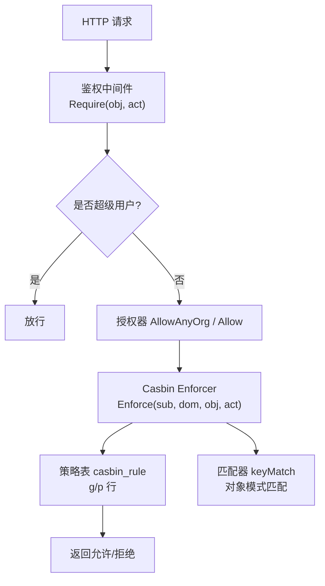
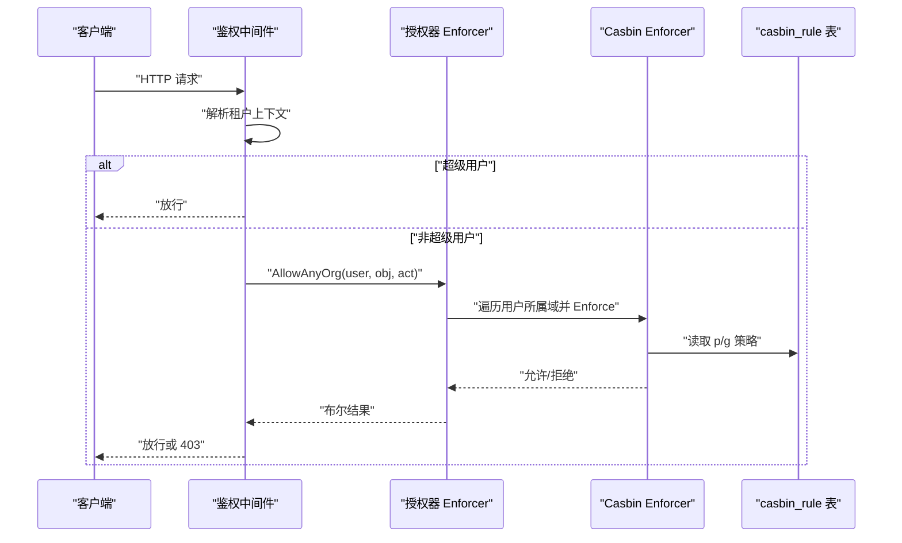
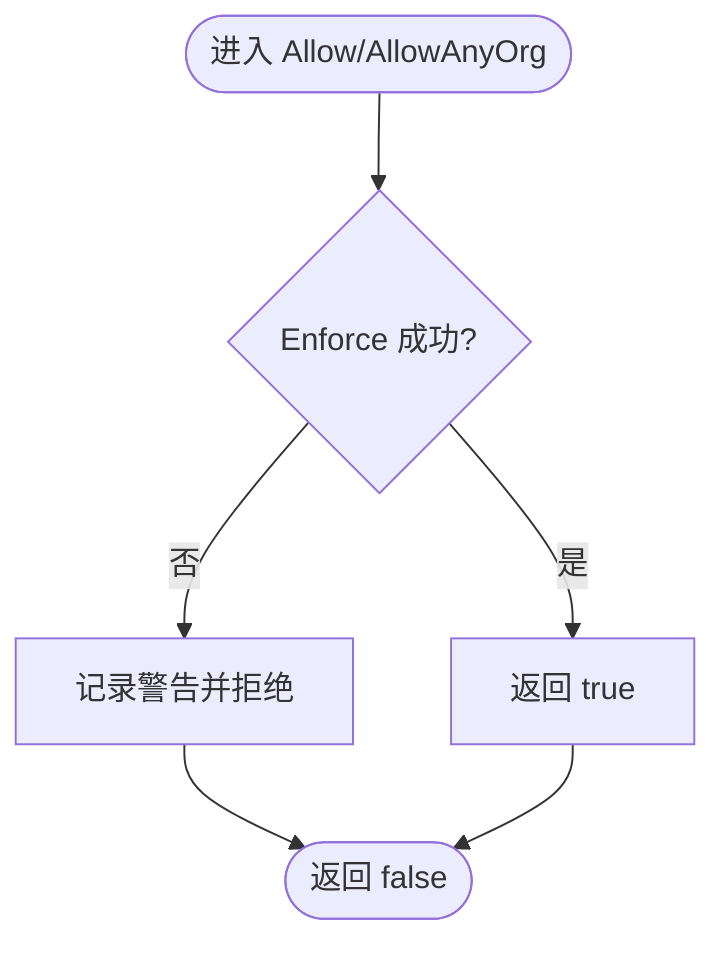
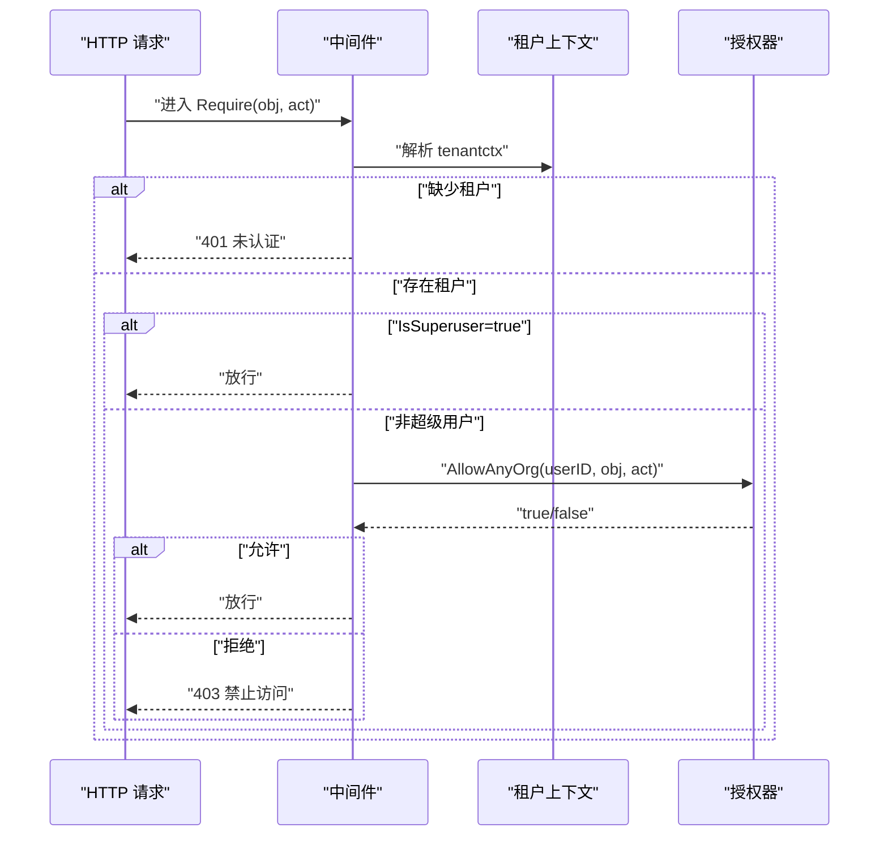
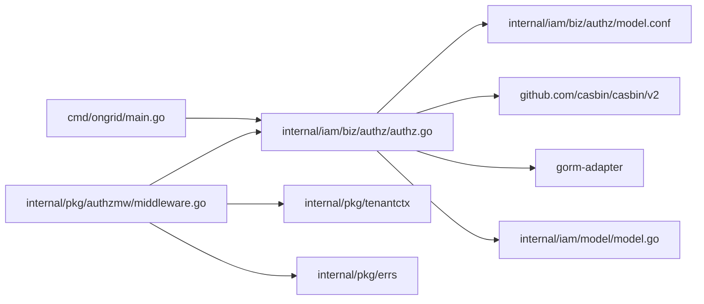

# RBAC 模型实现

<cite>
**本文引用的文件**
- [internal/iam/biz/authz/model.conf](file://internal/iam/biz/authz/model.conf)
- [internal/iam/biz/authz/authz.go](file://internal/iam/biz/authz/authz.go)
- [internal/pkg/authzmw/middleware.go](file://internal/pkg/authzmw/middleware.go)
- [internal/iam/model/model.go](file://internal/iam/model/model.go)
- [cmd/ongrid/main.go](file://cmd/ongrid/main.go)
- [internal/manager/server/knowledge/http.go](file://internal/manager/server/knowledge/http.go)
</cite>

## 目录
1. [简介](#简介)
2. [项目结构](#项目结构)
3. [核心组件](#核心组件)
4. [架构总览](#架构总览)
5. [详细组件分析](#详细组件分析)
6. [依赖关系分析](#依赖关系分析)
7. [性能考量](#性能考量)
8. [故障排查指南](#故障排查指南)
9. [结论](#结论)
10. [附录：权限规则编写指南与最佳实践](#附录：权限规则编写指南与最佳实践)

## 简介
本文件系统性阐述基于 Casbin 的 RBAC 权限模型在系统中的实现，包括角色层次、资源分类与操作类型定义；策略文件的结构与加载机制；预定义角色的权限矩阵、动态权限分配与继承关系；以及 model.conf 中请求/策略/匹配器定义和 authz.go 中的核心检查逻辑。同时提供权限规则的编写指南与最佳实践，帮助读者快速理解并安全扩展该权限体系。

## 项目结构
本项目将权限能力集中在 IAM 业务层（biz）的授权模块，并通过管理器侧中间件在 HTTP 入口进行鉴权拦截。关键位置如下：
- 模型与常量：internal/iam/model/model.go 定义了系统角色、成员角色常量及数据模型。
- 授权引擎封装：internal/iam/biz/authz/authz.go 封装 Casbin Enforcer，负责策略注入、成员同步与权限判定。
- 策略模型配置：internal/iam/biz/authz/model.conf 定义请求、策略、角色、效果与匹配器。
- 鉴权中间件：internal/pkg/authzmw/middleware.go 提供 Require(obj, act) 装饰器，统一拦截并调用授权器。
- 启动装配：cmd/ongrid/main.go 完成数据库迁移、Enforcer 构建、角色策略播种与成员同步。
- 路由使用示例：internal/manager/server/knowledge/http.go 展示如何在处理器上挂载鉴权中间件。

图表来源
- [internal/pkg/authzmw/middleware.go:70-97](file://internal/pkg/authzmw/middleware.go#L70-L97)
- [internal/iam/biz/authz/authz.go:235-271](file://internal/iam/biz/authz/authz.go#L235-L271)
- [internal/iam/biz/authz/model.conf:1-15](file://internal/iam/biz/authz/model.conf#L1-L15)

章节来源
- [internal/iam/model/model.go:61-78](file://internal/iam/model/model.go#L61-L78)
- [internal/iam/biz/authz/authz.go:46-84](file://internal/iam/biz/authz/authz.go#L46-L84)
- [internal/pkg/authzmw/middleware.go:1-24](file://internal/pkg/authzmw/middleware.go#L1-L24)

## 核心组件
- 授权器 Enforcer：封装 Casbin SyncedEnforcer，提供 Allow/AllowAnyOrg 等强类型接口，负责策略加载、成员同步与权限判定。
- 策略模型 model.conf：定义四元组 (sub, dom, obj, act)，支持域隔离与对象模式匹配。
- 鉴权中间件：在 HTTP 层以 Require(obj, act) 形式对写/删/执行等操作进行强制校验，内置超级用户短路保护。
- 角色与成员：系统级角色与组织成员角色分离；成员角色映射为 Casbin 主体，通过 g 规则关联到域（org_id）。

章节来源
- [internal/iam/biz/authz/authz.go:1-21](file://internal/iam/biz/authz/authz.go#L1-L21)
- [internal/iam/biz/authz/model.conf:1-15](file://internal/iam/biz/authz/model.conf#L1-L15)
- [internal/pkg/authzmw/middleware.go:35-41](file://internal/pkg/authzmw/middleware.go#L35-L41)
- [internal/iam/model/model.go:61-78](file://internal/iam/model/model.go#L61-L78)

## 架构总览
整体流程：
- 启动阶段：创建数据库连接 -> 初始化 Casbin Enforcer -> 播种角色策略 -> 从成员表同步 g 规则。
- 请求阶段：中间件提取租户上下文 -> 若为超级用户则放行 -> 否则调用授权器按域或任意域进行权限判定 -> 根据结果放行或拒绝。
- 策略存储：p 行（角色-域-对象-动作）由代码内嵌矩阵在启动时注入；g 行（用户-角色-域）来自成员表，随成员变更动态更新。

图表来源
- [cmd/ongrid/main.go:333-360](file://cmd/ongrid/main.go#L333-L360)
- [internal/pkg/authzmw/middleware.go:70-97](file://internal/pkg/authzmw/middleware.go#L70-L97)
- [internal/iam/biz/authz/authz.go:235-271](file://internal/iam/biz/authz/authz.go#L235-L271)

## 详细组件分析

### 模型与常量：角色与成员
- 系统角色：admin/user/viewer，用于平台级功能开关与工具集限制。
- 成员角色：org_admin/member/viewer，作为 Casbin 主体名称，映射到组织域内的权限。
- 数据模型：users/orgs/org_memberships 三张表，成员角色受约束，确保仅合法值写入。

章节来源
- [internal/iam/model/model.go:23-35](file://internal/iam/model/model.go#L23-L35)
- [internal/iam/model/model.go:61-78](file://internal/iam/model/model.go#L61-L78)
- [internal/iam/model/model.go:126-139](file://internal/iam/model/model.go#L126-L139)

### 策略模型：model.conf
- 请求定义：r = sub, dom, obj, act，其中 dom 为组织 ID 字符串，obj 为资源路径，act 为动作。
- 策略定义：p = sub, dom, obj, act，支持通配符 "*" 表示跨域或全量对象/动作。
- 角色定义：g = _, _, _，三元组 (subject, role, domain)。
- 策略效果：e = some(where (p.eft == allow))，任一允许即放行。
- 匹配器：m = g(r.sub, p.sub, r.dom) && (p.dom == "*" || r.dom == p.dom) && (p.obj == "*" || keyMatch(r.obj, p.obj)) && (p.act == "*" || r.act == p.act)
  - 主体必须通过 g 规则匹配到角色；
  - 域匹配支持精确或通配；
  - 对象匹配支持 keyMatch 模式匹配；
  - 动作匹配支持精确或通配。

章节来源
- [internal/iam/biz/authz/model.conf:1-15](file://internal/iam/biz/authz/model.conf#L1-L15)

### 授权器：authz.go
- 构造与加载：通过 gorm-adapter 连接数据库，嵌入 model.conf 构建模型，加载策略。
- 角色策略播种：rolePolicies 矩阵在启动时幂等注入，覆盖 org_admin/member/viewer/superuser 的默认权限。
- 成员同步：HydrateMemberships/SyncMembership/RevokeMembership/RevokeAllForOrg/RevokeAllForUser 保证 g 规则与成员表一致。
- 权限判定：Allow(ctx, userID, orgID, obj, act) 针对指定域；AllowAnyOrg(ctx, userID, obj, act) 遍历用户所有域，任一允许即放行。
- 错误处理：Enforce 出错记录日志并视为拒绝，避免异常扩散。

图表来源
- [internal/iam/biz/authz/authz.go:235-271](file://internal/iam/biz/authz/authz.go#L235-L271)

章节来源
- [internal/iam/biz/authz/authz.go:46-84](file://internal/iam/biz/authz/authz.go#L46-L84)
- [internal/iam/biz/authz/authz.go:86-125](file://internal/iam/biz/authz/authz.go#L86-L125)
- [internal/iam/biz/authz/authz.go:127-231](file://internal/iam/biz/authz/authz.go#L127-L231)
- [internal/iam/biz/authz/authz.go:235-316](file://internal/iam/biz/authz/authz.go#L235-L316)

### 鉴权中间件：middleware.go
- Require(obj, act)：包装 chi 处理器，先校验租户上下文，再判断是否为超级用户，最后调用授权器进行权限判定。
- 短路保护：超级用户直接放行，防止策略损坏导致管理员被锁死。
- 兼容模式：未注入授权器时放行，保障无 iam Phase-1 部署仍可运行。
- 日志记录：拒绝时记录用户、对象、动作以便审计。

图表来源
- [internal/pkg/authzmw/middleware.go:70-97](file://internal/pkg/authzmw/middleware.go#L70-L97)

章节来源
- [internal/pkg/authzmw/middleware.go:1-24](file://internal/pkg/authzmw/middleware.go#L1-L24)
- [internal/pkg/authzmw/middleware.go:35-41](file://internal/pkg/authzmw/middleware.go#L35-L41)
- [internal/pkg/authzmw/middleware.go:70-97](file://internal/pkg/authzmw/middleware.go#L70-L97)

### 启动装配与生命周期
- 启动顺序：
  1) 执行 iam 迁移，创建 users/orgs/org_memberships；
  2) 构建 Enforcer，加载策略；
  3) 幂等播种角色策略；
  4) 从成员表同步 g 规则。
- 运行时：成员变更触发 SyncMembership/RevokeMembership，保持 g 规则与成员表一致。

章节来源
- [cmd/ongrid/main.go:333-360](file://cmd/ongrid/main.go#L333-L360)
- [internal/iam/biz/authz/authz.go:53-84](file://internal/iam/biz/authz/authz.go#L53-L84)
- [internal/iam/biz/authz/authz.go:112-143](file://internal/iam/biz/authz/authz.go#L112-L143)

### 资源分类与操作类型
- 资源命名约定（Phase 1）：edge:*、knowledge:doc、knowledge:repo、alert:rule、alert:incident、agent:custom、monitor:panel、org:*、user:*。
- 动作词汇：read/write/delete/manage/exec。
- 处理器挂载示例：knowledge 模块通过 writeMW/deleteMW 将 Require("knowledge:doc", "write"/"delete") 应用到写/删接口。

章节来源
- [internal/pkg/authzmw/middleware.go:11-23](file://internal/pkg/authzmw/middleware.go#L11-L23)
- [internal/manager/server/knowledge/http.go:90-107](file://internal/manager/server/knowledge/http.go#L90-L107)

## 依赖关系分析
- 授权器依赖：
  - Casbin v2：提供 Enforcer 与模型解析；
  - gorm-adapter：持久化策略到 casbin_rule 表；
  - IAM 模型：成员角色常量与成员实体。
- 中间件依赖：
  - 租户上下文：tenantctx，用于获取用户与超管标志；
  - 错误包：errs，用于标准化 401/403 响应。
- 启动装配依赖：
  - cmd/ongrid/main.go：编排迁移、Enforcer 构建、策略播种与成员同步。

图表来源
- [cmd/ongrid/main.go:333-360](file://cmd/ongrid/main.go#L333-L360)
- [internal/iam/biz/authz/authz.go:23-38](file://internal/iam/biz/authz/authz.go#L23-L38)
- [internal/pkg/authzmw/middleware.go:26-33](file://internal/pkg/authzmw/middleware.go#L26-L33)

章节来源
- [internal/iam/biz/authz/authz.go:23-38](file://internal/iam/biz/authz/authz.go#L23-L38)
- [internal/pkg/authzmw/middleware.go:26-33](file://internal/pkg/authzmw/middleware.go#L26-L33)
- [cmd/ongrid/main.go:333-360](file://cmd/ongrid/main.go#L333-L360)

## 性能考量
- 策略加载：启动时一次性加载，后续通过 AddPolicy/AddGroupingPolicy 增量更新，避免频繁重建 Enforcer。
- 成员同步：HydrateMemberships 采用幂等插入，重复项由适配器去重；对于大规模成员场景，成本可控。
- 权限判定：AllowAnyOrg 会遍历用户所属域，建议在高频路径尽量传入明确 orgID 并使用 Allow，减少循环。
- 对象匹配：keyMatch 支持模式匹配，注意避免过于宽泛的通配导致误判或性能开销。

[本节为通用指导，不直接分析具体文件]

## 故障排查指南
- 策略加载失败：检查 gorm-adapter 连接与 casbin_rule 表是否存在；查看 New 与 LoadPolicy 的错误日志。
- 权限误拒：确认成员表与 g 规则一致；检查 Require(obj, act) 是否与处理器实际使用的对象/动作匹配。
- 超级用户无法登录：确认中间件的 IsSuperuser 短路逻辑未被绕过；检查租户上下文是否正确注入。
- 对象匹配问题：核对 model.conf 的 keyMatch 模式与实际资源命名约定是否一致。

章节来源
- [internal/iam/biz/authz/authz.go:64-84](file://internal/iam/biz/authz/authz.go#L64-L84)
- [internal/pkg/authzmw/middleware.go:70-97](file://internal/pkg/authzmw/middleware.go#L70-L97)

## 结论
本项目采用 Casbin 实现了基于域的 RBAC 权限模型，通过固定的角色策略矩阵与动态的成员映射，既保证了安全性又具备灵活性。中间件在 HTTP 层统一拦截，结合超级用户短路保护，确保系统在策略异常时仍具备可运维性。建议在生产环境中严格遵循资源命名与动作规范，谨慎使用通配符，并结合审计日志持续优化策略。

[本节为总结性内容，不直接分析具体文件]

## 附录：权限规则编写指南与最佳实践
- 角色与域
  - 使用成员角色 org_admin/member/viewer 作为 Casbin 主体；
  - 域（dom）为组织 ID 字符串，支持 "*" 表示跨域策略（当前主要用于超级用户回退）。
- 资源与动作
  - 资源命名遵循约定：领域前缀 + 冒号 + 资源名（如 knowledge:doc）；
  - 动作使用 read/write/delete/manage/exec，避免自定义动作造成维护困难。
- 策略矩阵
  - 启动时幂等播种角色策略，新增角色需在此处添加对应行；
  - 优先使用最小权限原则，避免过度授予 "*"。
- 动态权限
  - 成员变更通过 SyncMembership/RevokeMembership 更新 g 规则；
  - 删除组织或用户时，调用 RevokeAllForOrg/RevokeAllForUser 清理残留规则。
- 匹配器与模式
  - 利用 keyMatch 进行对象模式匹配，例如 device:shell 精确匹配；
  - 谨慎使用通配符，避免扩大攻击面。
- 中间件使用
  - 在写/删/执行类接口挂载 Require(obj, act)；
  - 确保上游已认证并注入租户上下文。

章节来源
- [internal/iam/biz/authz/authz.go:86-125](file://internal/iam/biz/authz/authz.go#L86-L125)
- [internal/iam/biz/authz/authz.go:145-231](file://internal/iam/biz/authz/authz.go#L145-L231)
- [internal/pkg/authzmw/middleware.go:11-23](file://internal/pkg/authzmw/middleware.go#L11-L23)
- [internal/manager/server/knowledge/http.go:90-107](file://internal/manager/server/knowledge/http.go#L90-L107)