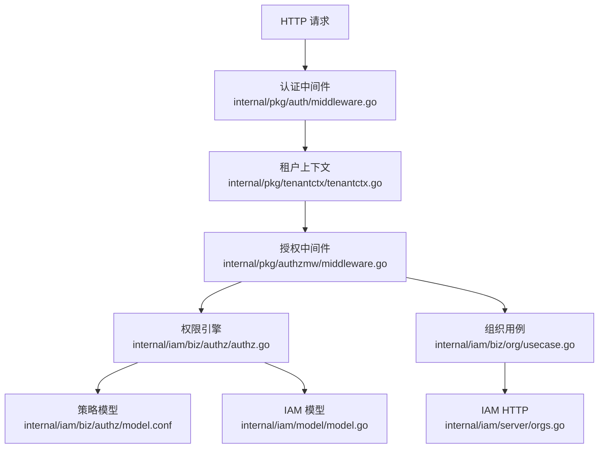
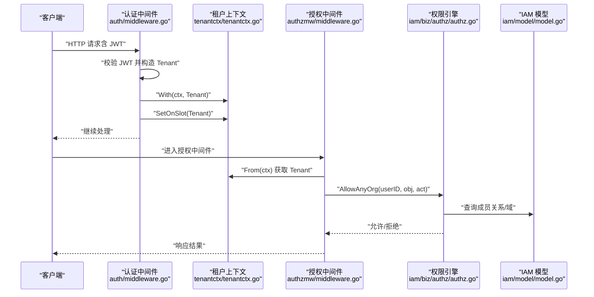
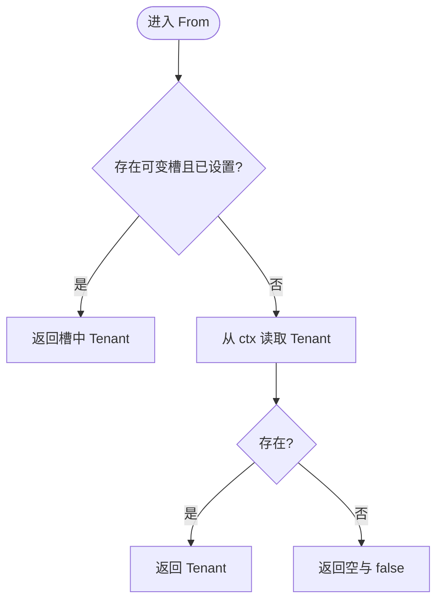
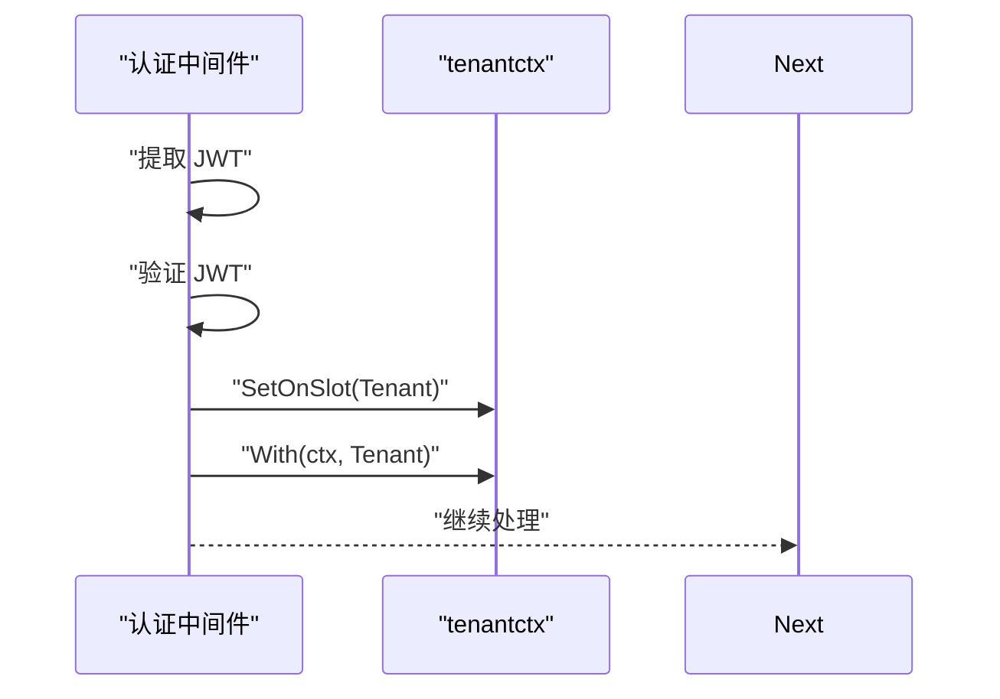
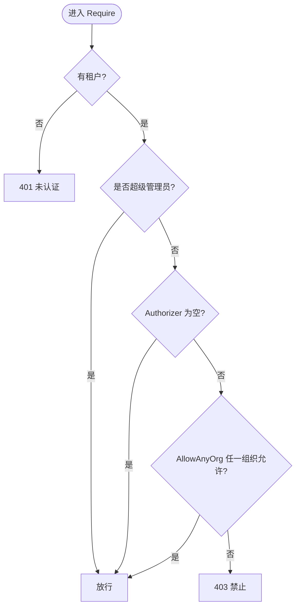
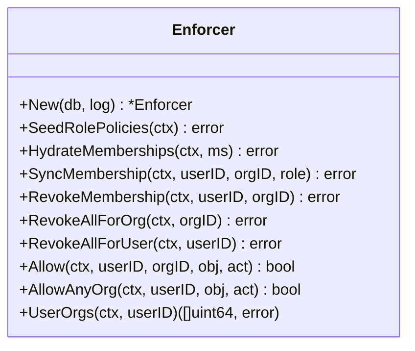
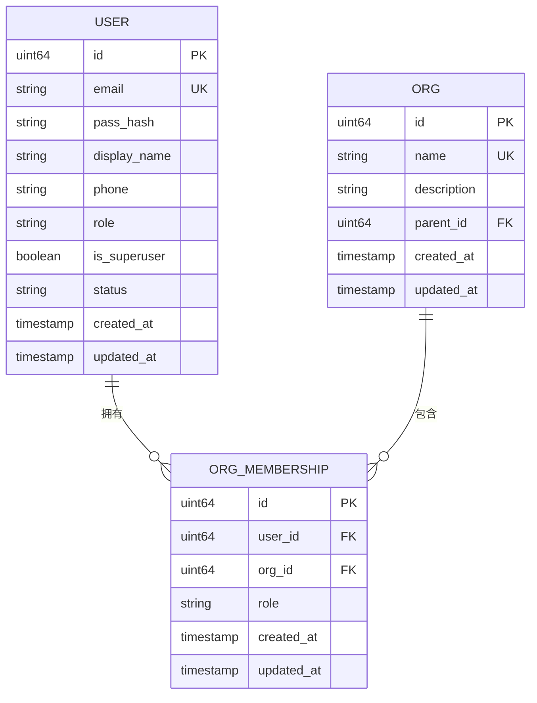
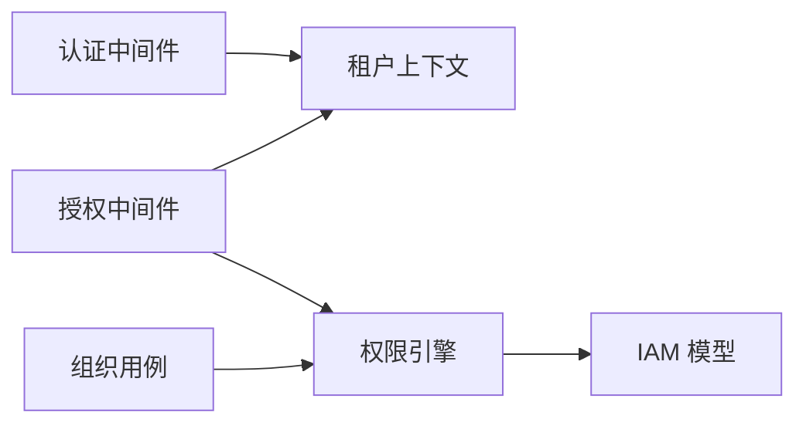

# 多租户权限隔离

<cite>
**本文引用的文件**
- [tenantctx.go](file://internal/pkg/tenantctx/tenantctx.go)
- [middleware.go](file://internal/pkg/auth/middleware.go)
- [authz.go](file://internal/iam/biz/authz/authz.go)
- [model.conf](file://internal/iam/biz/authz/model.conf)
- [middleware.go](file://internal/pkg/authzmw/middleware.go)
- [model.go](file://internal/iam/model/model.go)
- [usecase.go](file://internal/iam/biz/org/usecase.go)
- [orgs.go](file://internal/iam/server/orgs.go)
</cite>

## 目录
1. [简介](#简介)
2. [项目结构](#项目结构)
3. [核心组件](#核心组件)
4. [架构总览](#架构总览)
5. [详细组件分析](#详细组件分析)
6. [依赖关系分析](#依赖关系分析)
7. [性能考虑](#性能考虑)
8. [故障排查指南](#故障排查指南)
9. [结论](#结论)
10. [附录](#附录)

## 简介
本文件系统性阐述在多租户环境下的权限隔离机制，覆盖组织级权限边界、数据隔离策略与跨组织访问控制；说明租户上下文的传递机制、权限检查时的租户标识与默认租户处理；给出租户间资源共享的控制策略与安全边界设计；并提供多租户部署的权限配置示例与常见问题解决方案。重点解析 tenantctx 包如何实现租户上下文管理，以及 authz.go 如何集成租户隔离的权限检查逻辑。

## 项目结构
围绕多租户权限的关键代码分布在以下模块：
- 请求级租户上下文：internal/pkg/tenantctx
- 认证中间件（JWT 校验并注入租户）：internal/pkg/auth
- 授权中间件（基于 casbin 的 RBAC 与域隔离）：internal/pkg/authzmw
- 权限引擎与策略模型：internal/iam/biz/authz
- IAM 领域模型（用户、组织、成员关系）：internal/iam/model
- 组织用例（默认组织、删除清理等）：internal/iam/biz/org
- IAM HTTP 层（读取租户上下文、返回成员关系）：internal/iam/server

图表来源
- [middleware.go:10-53](file://internal/pkg/auth/middleware.go#L10-L53)
- [tenantctx.go:13-49](file://internal/pkg/tenantctx/tenantctx.go#L13-L49)
- [middleware.go:57-97](file://internal/pkg/authzmw/middleware.go#L57-L97)
- [authz.go:46-84](file://internal/iam/biz/authz/authz.go#L46-L84)
- [model.conf:1-15](file://internal/iam/biz/authz/model.conf#L1-L15)
- [model.go:80-140](file://internal/iam/model/model.go#L80-L140)
- [usecase.go:116-220](file://internal/iam/biz/org/usecase.go#L116-L220)
- [orgs.go:174-229](file://internal/iam/server/orgs.go#L174-L229)

章节来源
- [middleware.go:10-53](file://internal/pkg/auth/middleware.go#L10-L53)
- [tenantctx.go:13-49](file://internal/pkg/tenantctx/tenantctx.go#L13-L49)
- [middleware.go:57-97](file://internal/pkg/authzmw/middleware.go#L57-L97)
- [authz.go:46-84](file://internal/iam/biz/authz/authz.go#L46-L84)
- [model.conf:1-15](file://internal/iam/biz/authz/model.conf#L1-L15)
- [model.go:80-140](file://internal/iam/model/model.go#L80-L140)
- [usecase.go:116-220](file://internal/iam/biz/org/usecase.go#L116-L220)
- [orgs.go:174-229](file://internal/iam/server/orgs.go#L174-L229)

## 核心组件
- 租户上下文（tenantctx）：在请求上下文中携带调用者身份（用户ID、邮箱、角色、是否超级管理员），提供 With/From 读写，并通过“可变槽”让外层中间件也能读到内层写入的租户信息。
- 认证中间件（auth）：从请求中提取 JWT，验证后构造 Tenant 并写入上下文，同时写入可变槽供审计等外层中间件使用。
- 授权中间件（authzmw）：从上下文读取租户，若为超级管理员则放行；否则调用 Authorizer.AllowAnyOrg 进行跨组织授权判定；未通过则拒绝。
- 权限引擎（authz）：封装 casbin，维护角色策略矩阵与成员关系映射；支持按组织域（domain=org_id）进行资源访问控制；提供 Allow/AllowAnyOrg/UserOrgs 等方法。
- IAM 模型（model）：定义用户、组织、成员关系及系统角色常量；明确 IsSuperuser 独立于成员关系，用于系统管理员豁免。
- 组织用例（org usecase）：保证默认组织存在、组织树约束、删除时清理成员与 casbin 规则。
- IAM HTTP（orgs.go）：读取租户上下文，返回当前用户及其成员关系列表，便于前端展示与切换组织。

章节来源
- [tenantctx.go:13-49](file://internal/pkg/tenantctx/tenantctx.go#L13-L49)
- [middleware.go:10-53](file://internal/pkg/auth/middleware.go#L10-L53)
- [middleware.go:57-97](file://internal/pkg/authzmw/middleware.go#L57-L97)
- [authz.go:46-84](file://internal/iam/biz/authz/authz.go#L46-L84)
- [model.go:80-140](file://internal/iam/model/model.go#L80-L140)
- [usecase.go:116-220](file://internal/iam/biz/org/usecase.go#L116-L220)
- [orgs.go:174-229](file://internal/iam/server/orgs.go#L174-L229)

## 架构总览
下图展示了从请求进入、认证、租户上下文注入到授权判定的完整链路，以及组织生命周期对权限策略的影响。

图表来源
- [middleware.go:10-53](file://internal/pkg/auth/middleware.go#L10-L53)
- [tenantctx.go:30-49](file://internal/pkg/tenantctx/tenantctx.go#L30-L49)
- [middleware.go:57-97](file://internal/pkg/authzmw/middleware.go#L57-L97)
- [authz.go:233-289](file://internal/iam/biz/authz/authz.go#L233-L289)
- [model.go:80-140](file://internal/iam/model/model.go#L80-L140)

## 详细组件分析

### 租户上下文（tenantctx）
- 职责：在请求上下文中安全地传递调用者身份（用户ID、邮箱、角色、是否超级管理员）。
- 关键能力：
  - With：将 Tenant 附加到 ctx。
  - From：优先读取“可变槽”中的值，再回退到普通 ctx 值，确保外层中间件能感知内层写入。
  - WithSlot/SetOnSlot：为审计等外层中间件提供共享的可变槽，避免 r.WithContext 产生的新 ctx 导致外层无法读取。
- 复杂度：O(1) 读写。
- 错误处理：From 在无租户时返回 ok=false，调用方需据此判断是否为公开接口或缺失中间件。

图表来源
- [tenantctx.go:37-49](file://internal/pkg/tenantctx/tenantctx.go#L37-L49)

章节来源
- [tenantctx.go:13-49](file://internal/pkg/tenantctx/tenantctx.go#L13-L49)

### 认证中间件（auth）
- 职责：提取并验证 JWT，构造 Tenant 并写入上下文；同时写入可变槽以便审计等外层中间件读取。
- 关键点：
  - 支持 Authorization: Bearer 与 ?token 两种来源（兼容 WebSocket）。
  - IsSuperuser 由 JWT claim 决定，旧 token 回退到 Role=="admin"。
  - 失败直接返回 401，不继续后续处理。
- 与 tenantctx 的关系：先 SetOnSlot，再 With，确保外层可读取。

图表来源
- [middleware.go:10-53](file://internal/pkg/auth/middleware.go#L10-L53)
- [tenantctx.go:70-86](file://internal/pkg/tenantctx/tenantctx.go#L70-L86)

章节来源
- [middleware.go:10-53](file://internal/pkg/auth/middleware.go#L10-L53)

### 授权中间件（authzmw）
- 职责：基于租户上下文与 Authorizer 进行资源访问控制。
- 决策流程：
  1) 无租户 → 401
  2) 超级管理员 → 放行
  3) Authorizer 为空（兼容测试/非 iam 部署）→ 放行
  4) AllowAnyOrg 任一组织允许 → 放行
  5) 否则 → 403
- 与 tenantctx 的关系：通过 From 读取租户；与 authz 的 AllowAnyOrg 配合实现跨组织授权。

图表来源
- [middleware.go:57-97](file://internal/pkg/authzmw/middleware.go#L57-L97)

章节来源
- [middleware.go:57-97](file://internal/pkg/authzmw/middleware.go#L57-L97)

### 权限引擎（authz）
- 职责：封装 casbin，维护角色策略矩阵与成员关系映射，提供细粒度资源访问控制。
- 关键能力：
  - SeedRolePolicies：启动时注入角色策略（org_admin/member/viewer/superuser）。
  - HydrateMemberships/SyncMembership/RevokeMembership：将 IAM 的成员关系同步到 casbin 的分组策略（g 规则）。
  - RevokeAllForOrg/RevokeAllForUser：删除组织或用户时清理相关 g 规则。
  - Allow：在指定组织域下执行 Enforce。
  - AllowAnyOrg：遍历用户所属所有组织，任一允许即放行。
  - UserOrgs：解析用户所属组织列表。
- 策略模型（model.conf）：
  - 请求定义：sub, dom, obj, act
  - 匹配器：结合 g 规则与对象/动作匹配，支持通配符与 keyMatch。

图表来源
- [authz.go:46-84](file://internal/iam/biz/authz/authz.go#L46-L84)
- [authz.go:112-231](file://internal/iam/biz/authz/authz.go#L112-L231)
- [authz.go:233-316](file://internal/iam/biz/authz/authz.go#L233-L316)
- [model.conf:1-15](file://internal/iam/biz/authz/model.conf#L1-L15)

章节来源
- [authz.go:46-84](file://internal/iam/biz/authz/authz.go#L46-L84)
- [authz.go:112-231](file://internal/iam/biz/authz/authz.go#L112-L231)
- [authz.go:233-316](file://internal/iam/biz/authz/authz.go#L233-L316)
- [model.conf:1-15](file://internal/iam/biz/authz/model.conf#L1-L15)

### IAM 模型与组织用例
- IAM 模型：
  - 用户：包含系统角色与 IsSuperuser；IsSuperuser 独立于成员关系，用于系统管理员豁免。
  - 组织：扁平一级组织（可扩展层级），名称全局唯一。
  - 成员关系：用户-组织-角色（org_admin/member/viewer），作为 casbin 的分组策略来源。
- 组织用例：
  - EnsureSeed：确保“默认组织”存在，保障非超级管理员始终有归属。
  - Create/Update/Delete：组织树约束（防止环）、删除前清理成员与 casbin 规则。

图表来源
- [model.go:80-140](file://internal/iam/model/model.go#L80-L140)

章节来源
- [model.go:80-140](file://internal/iam/model/model.go#L80-L140)
- [usecase.go:116-220](file://internal/iam/biz/org/usecase.go#L116-L220)

### IAM HTTP 层（组织与成员）
- /v1/me：读取租户上下文，返回用户信息与成员关系列表，便于前端展示与组织切换。
- /v1/orgs：列出所有组织（需认证）。

章节来源
- [orgs.go:174-229](file://internal/iam/server/orgs.go#L174-L229)

## 依赖关系分析
- 认证中间件依赖 tenantctx 以注入租户。
- 授权中间件依赖 tenantctx 读取租户，并依赖 authz.Enforcer 进行授权判定。
- 权限引擎依赖 casbin 与 IAM 模型（成员关系）来构建策略。
- 组织用例在删除组织时回调权限引擎清理策略，形成闭环。

图表来源
- [middleware.go:10-53](file://internal/pkg/auth/middleware.go#L10-L53)
- [middleware.go:57-97](file://internal/pkg/authzmw/middleware.go#L57-L97)
- [authz.go:46-84](file://internal/iam/biz/authz/authz.go#L46-L84)
- [model.go:80-140](file://internal/iam/model/model.go#L80-L140)
- [usecase.go:198-220](file://internal/iam/biz/org/usecase.go#L198-L220)

章节来源
- [middleware.go:10-53](file://internal/pkg/auth/middleware.go#L10-L53)
- [middleware.go:57-97](file://internal/pkg/authzmw/middleware.go#L57-L97)
- [authz.go:46-84](file://internal/iam/biz/authz/authz.go#L46-L84)
- [model.go:80-140](file://internal/iam/model/model.go#L80-L140)
- [usecase.go:198-220](file://internal/iam/biz/org/usecase.go#L198-L220)

## 性能考虑
- 授权判定：AllowAnyOrg 会遍历用户所属组织，组织数量较大时可能产生多次 Enforce 调用。建议：
  - 合理划分组织规模，避免单用户加入过多组织。
  - 在业务层缓存用户组织列表（如会话级），减少重复查询。
- 策略同步：HydrateMemberships/SyncMembership 在成员变更时更新 casbin 规则，属于低频操作，代价可控。
- 上下文读写：tenantctx 的 With/From 为 O(1)，开销极低。

[本节为通用性能指导，无需特定文件引用]

## 故障排查指南
- 现象：请求被 401 拒绝
  - 可能原因：缺少 JWT、JWT 无效、认证中间件未生效。
  - 定位：检查认证中间件是否正确挂载；确认请求头或查询参数携带有效 token。
  - 参考：[middleware.go:10-53](file://internal/pkg/auth/middleware.go#L10-L53)
- 现象：请求被 403 拒绝
  - 可能原因：非超级管理员且未在任一组织中获得所需资源的读/写/执行权限。
  - 定位：检查用户成员关系与角色策略；确认 AllowAnyOrg 是否返回 true。
  - 参考：[middleware.go:57-97](file://internal/pkg/authzmw/middleware.go#L57-L97)、[authz.go:233-289](file://internal/iam/biz/authz/authz.go#L233-L289)
- 现象：删除组织失败
  - 可能原因：组织仍有子组织；成员或策略清理失败。
  - 定位：检查子组织计数与清理回调；确认 RevokeAllForOrg 成功。
  - 参考：[usecase.go:198-220](file://internal/iam/biz/org/usecase.go#L198-L220)
- 现象：审计日志缺少用户字段
  - 可能原因：外层中间件未安装可变槽或未读取 slot。
  - 定位：确认 WithSlot 与 SetOnSlot 正确配对；From 优先读取 slot。
  - 参考：[tenantctx.go:51-86](file://internal/pkg/tenantctx/tenantctx.go#L51-L86)

章节来源
- [middleware.go:10-53](file://internal/pkg/auth/middleware.go#L10-L53)
- [middleware.go:57-97](file://internal/pkg/authzmw/middleware.go#L57-L97)
- [authz.go:233-289](file://internal/iam/biz/authz/authz.go#L233-L289)
- [usecase.go:198-220](file://internal/iam/biz/org/usecase.go#L198-L220)
- [tenantctx.go:51-86](file://internal/pkg/tenantctx/tenantctx.go#L51-L86)

## 结论
本方案通过“认证中间件 + 租户上下文 + 授权中间件 + 权限引擎”的分层设计，实现了清晰的多租户权限隔离：
- 组织级边界：以 org_id 作为域（domain），成员关系映射到 casbin 的分组策略，实现严格的组织内资源访问控制。
- 跨组织访问：通过 AllowAnyOrg 在用户所属的所有组织中尝试授权，满足 Phase 1 的默认行为。
- 租户上下文：tenantctx 提供安全的上下文传递与可变槽机制，确保内外层中间件一致可见。
- 安全边界：超级管理员豁免路径绕过 casbin，但仅在中间件层短路，避免策略损坏导致的管理员锁定。
- 数据隔离：成员关系与策略同步保证“谁在哪个组织、拥有什么角色”，从而驱动数据访问的隔离。

[本节为总结性内容，无需特定文件引用]

## 附录

### 多租户部署的权限配置示例
- 启动阶段
  - 初始化数据库并迁移 IAM 表（users、orgs、org_memberships）。
  - 创建权限引擎实例并加载策略。
  - 注入角色策略矩阵（org_admin/member/viewer/superuser）。
  - 同步现有成员关系到 casbin 分组策略。
  - 确保“默认组织”存在。
- 运行时
  - 认证中间件：验证 JWT，注入租户上下文。
  - 授权中间件：根据资源与动作进行授权判定。
  - 组织变更：新增/修改/删除成员时同步 casbin 规则；删除组织时清理成员与规则。
- 前端交互
  - 通过 /v1/me 获取用户与其成员关系，展示可切换的组织列表。

章节来源
- [authz.go:57-84](file://internal/iam/biz/authz/authz.go#L57-L84)
- [authz.go:112-143](file://internal/iam/biz/authz/authz.go#L112-L143)
- [usecase.go:116-131](file://internal/iam/biz/org/usecase.go#L116-L131)
- [orgs.go:174-229](file://internal/iam/server/orgs.go#L174-L229)

### 常见问题的快速定位清单
- 未认证（401）
  - 检查 JWT 是否存在且有效；确认认证中间件已挂载。
  - 参考：[middleware.go:10-53](file://internal/pkg/auth/middleware.go#L10-L53)
- 未授权（403）
  - 检查用户是否在目标组织具有相应角色；确认 AllowAnyOrg 逻辑。
  - 参考：[middleware.go:57-97](file://internal/pkg/authzmw/middleware.go#L57-L97)、[authz.go:233-289](file://internal/iam/biz/authz/authz.go#L233-L289)
- 组织删除失败
  - 检查是否有子组织；确认成员与策略清理回调。
  - 参考：[usecase.go:198-220](file://internal/iam/biz/org/usecase.go#L198-L220)
- 审计缺失用户信息
  - 确认外层中间件安装了可变槽并读取 slot。
  - 参考：[tenantctx.go:51-86](file://internal/pkg/tenantctx/tenantctx.go#L51-L86)

章节来源
- [middleware.go:10-53](file://internal/pkg/auth/middleware.go#L10-L53)
- [middleware.go:57-97](file://internal/pkg/authzmw/middleware.go#L57-L97)
- [authz.go:233-289](file://internal/iam/biz/authz/authz.go#L233-L289)
- [usecase.go:198-220](file://internal/iam/biz/org/usecase.go#L198-L220)
- [tenantctx.go:51-86](file://internal/pkg/tenantctx/tenantctx.go#L51-L86)