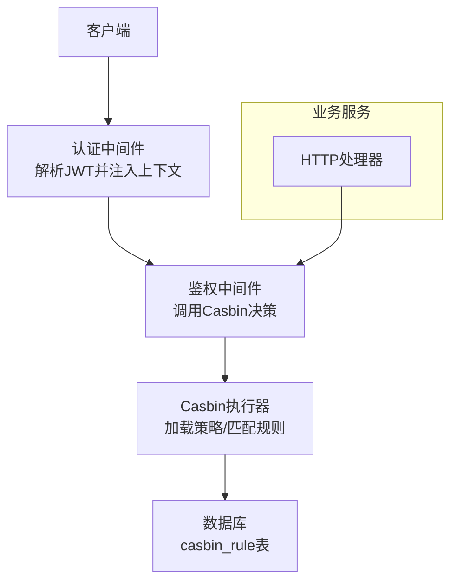
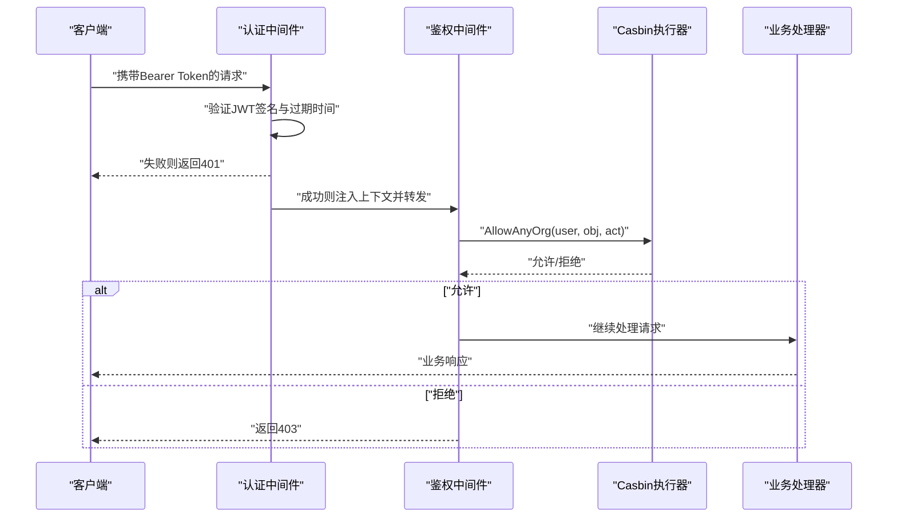
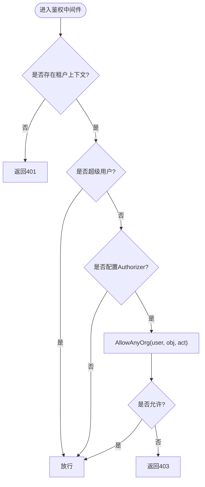
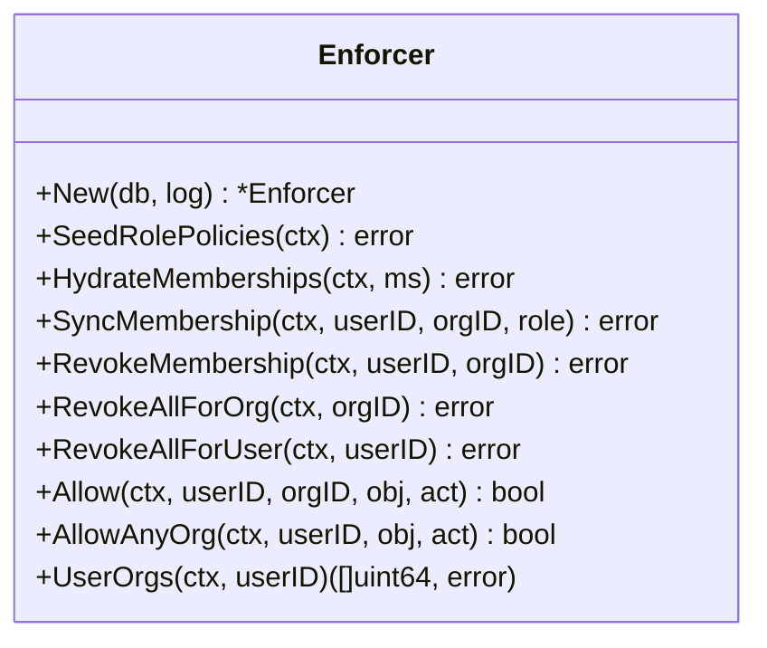
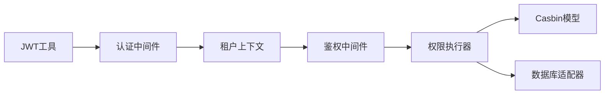
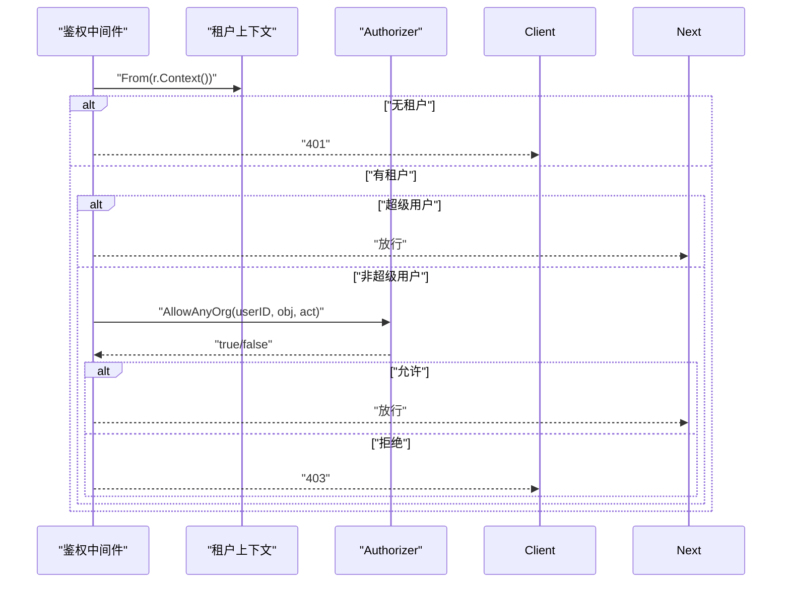

# 权限控制模型

<cite>
**本文引用的文件**
- [internal/iam/biz/authz/authz.go](file://internal/iam/biz/authz/authz.go)
- [internal/iam/biz/authz/model.conf](file://internal/iam/biz/authz/model.conf)
- [internal/pkg/authzmw/middleware.go](file://internal/pkg/authzmw/middleware.go)
- [internal/pkg/auth/middleware.go](file://internal/pkg/auth/middleware.go)
- [internal/pkg/auth/jwt.go](file://internal/pkg/auth/jwt.go)
- [internal/pkg/tenantctx/tenantctx.go](file://internal/pkg/tenantctx/tenantctx.go)
- [internal/manager/server/knowledge/http.go](file://internal/manager/server/knowledge/http.go)
- [internal/manager/server/device/http.go](file://internal/manager/server/device/http.go)
- [internal/manager/server/monitor/http.go](file://internal/manager/server/monitor/http.go)
- [internal/iam/model/model.go](file://internal/iam/model/model.go)
- [internal/iam/data/membership/store/repo.go](file://internal/iam/data/membership/store/repo.go)
- [cmd/ongrid/main.go](file://cmd/ongrid/main.go)
- [tests/e2e/auth_rbac_test.go](file://tests/e2e/auth_rbac_test.go)
</cite>

## 目录
1. [简介](#简介)
2. [项目结构](#项目结构)
3. [核心组件](#核心组件)
4. [架构总览](#架构总览)
5. [详细组件分析](#详细组件分析)
6. [依赖关系分析](#依赖关系分析)
7. [性能考虑](#性能考虑)
8. [故障排查指南](#故障排查指南)
9. [结论](#结论)
10. [附录：配置与场景示例](#附录：配置与场景示例)

## 简介
本文件系统化阐述 Ongrid 的权限控制模型，基于 Casbin 实现 RBAC（基于角色的访问控制），覆盖角色定义、资源访问控制、操作权限管理、组织隔离机制、多租户权限隔离、数据级权限控制思路、权限检查中间件流程、动态权限更新与缓存策略，以及内置角色矩阵与扩展方式。文档同时提供常见权限场景的实现指引与参考路径。

## 项目结构
Ongrid 的权限体系由“认证 + 鉴权”两层组成：
- 认证层：JWT 签发与校验，解析用户身份并注入到请求上下文。
- 鉴权层：基于 Casbin 的 RBAC，结合组织域（domain）进行资源与操作的授权判断；HTTP 中间件将对象与动作映射为 casbin 的 obj/act 并执行决策。

图表来源
- [internal/pkg/auth/middleware.go:1-68](file://internal/pkg/auth/middleware.go#L1-L68)
- [internal/pkg/authzmw/middleware.go:1-98](file://internal/pkg/authzmw/middleware.go#L1-L98)
- [internal/iam/biz/authz/authz.go:64-84](file://internal/iam/biz/authz/authz.go#L64-L84)

章节来源
- [internal/pkg/auth/middleware.go:1-68](file://internal/pkg/auth/middleware.go#L1-L68)
- [internal/pkg/authzmw/middleware.go:1-98](file://internal/pkg/authzmw/middleware.go#L1-L98)
- [internal/iam/biz/authz/authz.go:64-84](file://internal/iam/biz/authz/authz.go#L64-L84)

## 核心组件
- 认证中间件：从请求中提取 JWT，验证签名与有效期，将用户信息写入上下文。
- 鉴权中间件：根据路由声明的对象与动作，调用 Casbin 进行授权判断，支持超级用户短路放行。
- 权限执行器：封装 Casbin，维护角色策略与成员关系，提供 Allow/AllowAnyOrg 等接口。
- 模型与策略：使用 model.conf 定义请求、策略、角色、匹配器；通过 gorm 适配器持久化策略。
- 上下文租户：在请求上下文中携带用户 ID、邮箱、角色、是否超级管理员等元信息。

章节来源
- [internal/pkg/auth/middleware.go:1-68](file://internal/pkg/auth/middleware.go#L1-L68)
- [internal/pkg/authzmw/middleware.go:1-98](file://internal/pkg/authzmw/middleware.go#L1-L98)
- [internal/iam/biz/authz/authz.go:1-110](file://internal/iam/biz/authz/authz.go#L1-L110)
- [internal/iam/biz/authz/model.conf:1-15](file://internal/iam/biz/authz/model.conf#L1-L15)
- [internal/pkg/tenantctx/tenantctx.go:1-87](file://internal/pkg/tenantctx/tenantctx.go#L1-L87)

## 架构总览
下图展示一次受保护的 API 请求从认证到授权的完整链路，包括上下文传递、Casbin 决策与结果返回。

图表来源
- [internal/pkg/auth/middleware.go:21-52](file://internal/pkg/auth/middleware.go#L21-L52)
- [internal/pkg/authzmw/middleware.go:57-97](file://internal/pkg/authzmw/middleware.go#L57-L97)
- [internal/iam/biz/authz/authz.go:233-271](file://internal/iam/biz/authz/authz.go#L233-L271)

## 详细组件分析

### 认证中间件（JWT）
- 职责：提取 Bearer Token 或查询参数 token，验证签名与有效期，将用户信息写入上下文。
- 关键行为：
  - 支持旧版兼容：当 JWT 缺少 is_superuser 字段时，回退到 role=="admin" 视为超级用户。
  - 将 Tenant 写入上下文，供下游中间件与业务层读取。

章节来源
- [internal/pkg/auth/middleware.go:1-68](file://internal/pkg/auth/middleware.go#L1-L68)
- [internal/pkg/auth/jwt.go:16-30](file://internal/pkg/auth/jwt.go#L16-L30)
- [internal/pkg/auth/jwt.go:81-99](file://internal/pkg/auth/jwt.go#L81-L99)

### 鉴权中间件（Casbin 包装）
- 职责：对每个受保护路由声明对象与动作，调用 Authorizer 进行授权判断。
- 决策流程：
  1) 无租户上下文 → 401
  2) 超级用户 → 直接放行
  3) 未配置 Authorizer（测试/遗留）→ 放行
  4) 调用 AllowAnyOrg(user, obj, act) → 任一组织允许即放行
  5) 否则 → 403
- 对象命名约定（Phase 1）：edge:*、knowledge:doc、knowledge:repo、alert:rule、alert:incident、agent:custom、monitor:panel、org:*、user:*。
- 动作词汇：read / write / delete / manage。

图表来源
- [internal/pkg/authzmw/middleware.go:57-97](file://internal/pkg/authzmw/middleware.go#L57-L97)

章节来源
- [internal/pkg/authzmw/middleware.go:1-98](file://internal/pkg/authzmw/middleware.go#L1-L98)

### 权限执行器（Casbin 封装）
- 职责：初始化 Casbin 执行器，加载模型与策略，提供统一的授权接口。
- 启动顺序：
  1) 迁移 IAM 表（users/orgs/org_memberships）
  2) 创建 Casbin Enforcer 并加载策略
  3) 注入内置角色策略（幂等）
  4) 同步成员关系为 Casbin g 规则
- 内置角色策略（部分）：
  - org_admin：在组织域内拥有全部权限，并可管理成员
  - member：读/写资源，特定 exec（如设备 shell）
  - viewer：只读
  - superuser：系统管理员（由中间件短路放行，策略中保留兜底）

图表来源
- [internal/iam/biz/authz/authz.go:64-110](file://internal/iam/biz/authz/authz.go#L64-L110)
- [internal/iam/biz/authz/authz.go:127-210](file://internal/iam/biz/authz/authz.go#L127-L210)
- [internal/iam/biz/authz/authz.go:233-289](file://internal/iam/biz/authz/authz.go#L233-L289)

章节来源
- [internal/iam/biz/authz/authz.go:1-316](file://internal/iam/biz/authz/authz.go#L1-L316)

### 模型与策略（model.conf）
- 请求定义：r = sub, dom, obj, act
- 策略定义：p = sub, dom, obj, act
- 角色定义：g = _, _, _
- 匹配器：支持角色继承、域匹配、对象通配与动作匹配。

章节来源
- [internal/iam/biz/authz/model.conf:1-15](file://internal/iam/biz/authz/model.conf#L1-L15)

### 上下文租户（tenantctx）
- 承载用户 ID、邮箱、角色、是否超级管理员等信息。
- 提供 With/From/SetOnSlot 等方法，确保外层中间件也能读取内层中间件写入的租户信息。

章节来源
- [internal/pkg/tenantctx/tenantctx.go:1-87](file://internal/pkg/tenantctx/tenantctx.go#L1-L87)

### 资源与操作映射（示例）
- 知识文档：write/delete 中间件生成器，按对象名与动作组合进行授权。
- 设备管理：requireAdmin 中间件用于仅管理员可访问的路径。
- 监控面板：统一错误响应与状态码映射。

章节来源
- [internal/manager/server/knowledge/http.go:90-105](file://internal/manager/server/knowledge/http.go#L90-L105)
- [internal/manager/server/device/http.go:68-84](file://internal/manager/server/device/http.go#L68-L84)
- [internal/manager/server/monitor/http.go:153-195](file://internal/manager/server/monitor/http.go#L153-L195)

### 角色与成员关系
- 系统角色常量：admin/user/viewer（用户表 role 列）。
- 成员角色常量：org_admin/member/viewer（用于组织内成员权限矩阵）。
- 成员仓库：提供按用户列出成员关系、全量拉取成员关系以初始化 Casbin g 规则。

章节来源
- [internal/iam/model/model.go:21-67](file://internal/iam/model/model.go#L21-L67)
- [internal/iam/data/membership/store/repo.go:124-163](file://internal/iam/data/membership/store/repo.go#L124-L163)

### 启动与初始化流程
- 主程序启动时：
  1) 确保超级用户迁移
  2) 构建 Casbin Enforcer
  3) 注入内置角色策略
  4) 构建组织与成员服务并注入 Casbin Hook
  5) 从数据库拉取成员关系并同步到 Casbin
  6) 初始化默认组织并回填现有用户成员关系

章节来源
- [cmd/ongrid/main.go:333-391](file://cmd/ongrid/main.go#L333-L391)

## 依赖关系分析
- 认证中间件依赖 JWT 工具与租户上下文。
- 鉴权中间件依赖 Authorizer 接口（由权限执行器实现）。
- 权限执行器依赖 Casbin 模型与数据库适配器。
- 业务处理器通过中间件链获取上下文并进行授权检查。

图表来源
- [internal/pkg/auth/jwt.go:16-30](file://internal/pkg/auth/jwt.go#L16-L30)
- [internal/pkg/auth/middleware.go:21-52](file://internal/pkg/auth/middleware.go#L21-L52)
- [internal/pkg/authzmw/middleware.go:35-41](file://internal/pkg/authzmw/middleware.go#L35-L41)
- [internal/iam/biz/authz/authz.go:64-84](file://internal/iam/biz/authz/authz.go#L64-L84)
- [internal/iam/biz/authz/model.conf:1-15](file://internal/iam/biz/authz/model.conf#L1-L15)

章节来源
- [internal/pkg/auth/jwt.go:16-30](file://internal/pkg/auth/jwt.go#L16-L30)
- [internal/pkg/auth/middleware.go:21-52](file://internal/pkg/auth/middleware.go#L21-L52)
- [internal/pkg/authzmw/middleware.go:35-41](file://internal/pkg/authzmw/middleware.go#L35-L41)
- [internal/iam/biz/authz/authz.go:64-84](file://internal/iam/biz/authz/authz.go#L64-L84)
- [internal/iam/biz/authz/model.conf:1-15](file://internal/iam/biz/authz/model.conf#L1-L15)

## 性能考虑
- 策略加载与同步：
  - 启动时一次性加载策略并同步成员关系，避免每次请求都查库。
  - 成员关系变更通过 SyncMembership/RevokeMembership 增量更新 g 规则。
- 决策开销：
  - AllowAnyOrg 会遍历用户所属组织，但组织数量通常较小，且命中即短路。
- 缓存策略：
  - 当前权限决策主要依赖 Casbin 内存中的策略表；如需更高吞吐，可在上层引入短期缓存（例如按 user+obj+act 键值缓存短 TTL 的结果），但需保证成员关系变更后及时失效。
- 日志与可观测性：
  - 鉴权拒绝会记录日志，便于定位问题与审计。

[本节为通用指导，不直接分析具体文件]

## 故障排查指南
- 常见问题：
  - 401 未认证：检查 JWT 是否有效、是否包含必要字段。
  - 403 未授权：检查路由是否绑定了鉴权中间件、对象与动作是否正确、用户是否属于目标组织。
  - 超级用户无法登录：确认 JWT 中 is_superuser 或 role 是否为 admin。
- 定位步骤：
  1) 查看鉴权中间件的拒绝日志（包含 user、obj、act）。
  2) 检查成员关系是否已同步到 Casbin（g 规则）。
  3) 核对 model.conf 匹配器与对象命名约定。
  4) 验证启动流程是否完成策略注入与成员同步。

章节来源
- [internal/pkg/authzmw/middleware.go:86-97](file://internal/pkg/authzmw/middleware.go#L86-L97)
- [internal/iam/biz/authz/authz.go:233-271](file://internal/iam/biz/authz/authz.go#L233-L271)

## 结论
Ongrid 采用基于 Casbin 的 RBAC 模型，结合 JWT 认证与组织域隔离，实现了细粒度的资源与操作权限控制。通过启动时注入内置角色策略与成员关系，并在运行时动态更新，保证了权限的一致性与可扩展性。鉴权中间件提供了清晰的授权决策流程与安全的超级用户短路机制，便于在复杂场景中保持系统的可用性与安全性。

[本节为总结，不直接分析具体文件]

## 附录：配置与场景示例

### 内置角色权限矩阵（摘要）
- org_admin：在组织域内拥有全部权限，并可管理成员（org:*、member:* 及通配）。
- member：可对资源进行 read/write，特定场景支持 exec（如 device:shell）。
- viewer：仅 read。
- superuser：系统管理员，由中间件短路放行（策略中保留兜底）。

章节来源
- [internal/iam/biz/authz/authz.go:86-110](file://internal/iam/biz/authz/authz.go#L86-L110)

### 常见权限场景
- 仅管理员可创建用户：POST /v1/users 需要 admin 角色（前端与后端均有守卫）。
- 自定义 Agent 创建：viewer 被显式拒绝，admin/user 允许。
- 只读页面：所有已认证角色均可访问 GET /v1/self。

章节来源
- [tests/e2e/auth_rbac_test.go:22-111](file://tests/e2e/auth_rbac_test.go#L22-L111)

### 动态权限更新
- 新增/修改成员角色：调用 SyncMembership，先移除旧 g 规则再添加新规则。
- 移除成员：调用 RevokeMembership，清理该用户在指定组织的 g 规则。
- 删除组织：调用 RevokeAllForOrg，清理所有与该组织相关的 g 规则。
- 删除用户：调用 RevokeAllForUser，清理该用户的所有 g 规则。

章节来源
- [internal/iam/biz/authz/authz.go:145-231](file://internal/iam/biz/authz/authz.go#L145-L231)

### 权限检查中间件工作流程（代码级）

图表来源
- [internal/pkg/authzmw/middleware.go:57-97](file://internal/pkg/authzmw/middleware.go#L57-L97)
- [internal/pkg/tenantctx/tenantctx.go:30-49](file://internal/pkg/tenantctx/tenantctx.go#L30-L49)
- [internal/iam/biz/authz/authz.go:249-271](file://internal/iam/biz/authz/authz.go#L249-L271)

### 组织隔离与多租户权限隔离
- 组织作为 Casbin 的 domain，成员关系通过 g 规则绑定用户与组织。
- 默认组织：启动时创建“默认组织”，并将现有用户回填为成员（管理员为 org_admin）。
- 后续组织必须挂在默认组织之下，避免顶层组织混乱。

章节来源
- [cmd/ongrid/main.go:362-391](file://cmd/ongrid/main.go#L362-L391)

### 数据级权限控制（思路）
- 当前 RBAC 聚焦于资源与操作层面；数据级过滤建议在业务层结合租户上下文与资源归属进行二次限制（例如仅允许访问本组织的数据）。
- 可通过在查询条件中附加 org_id 过滤，并结合权限检查结果确保数据可见范围。

[本节为概念性说明，不直接分析具体文件]