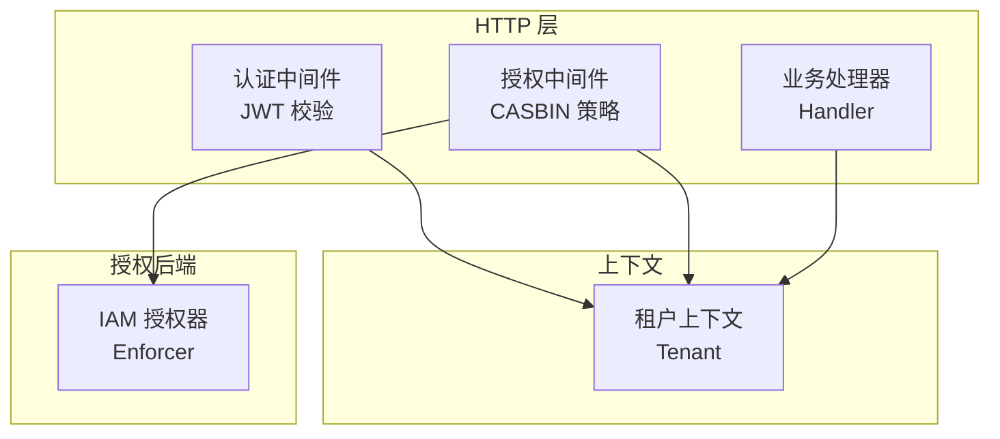
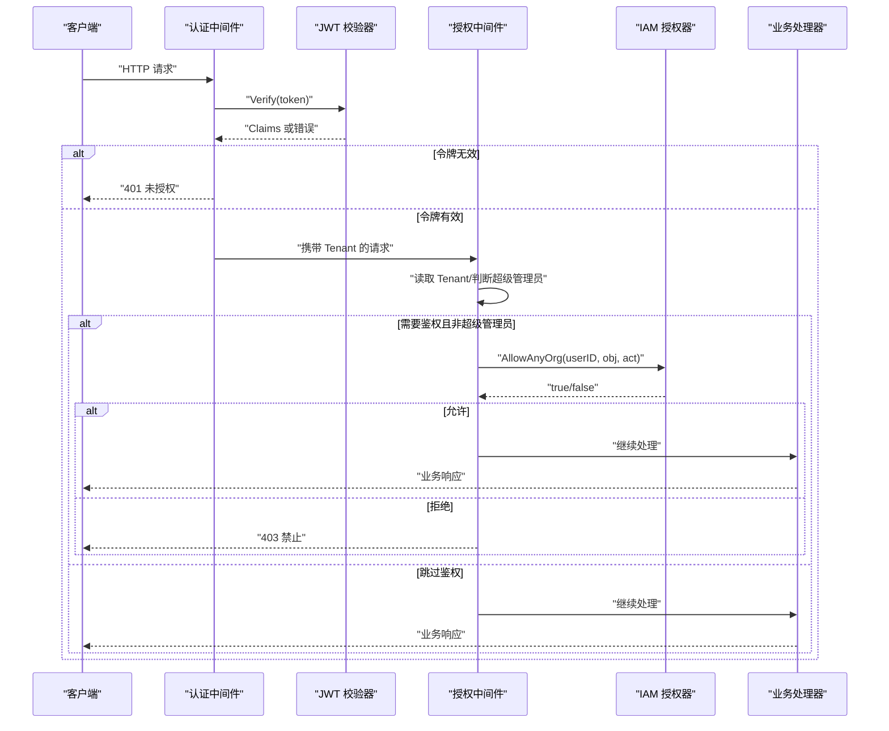
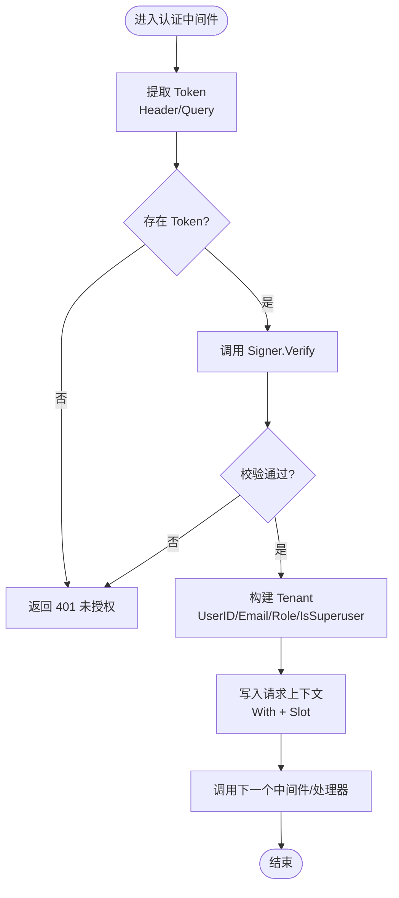
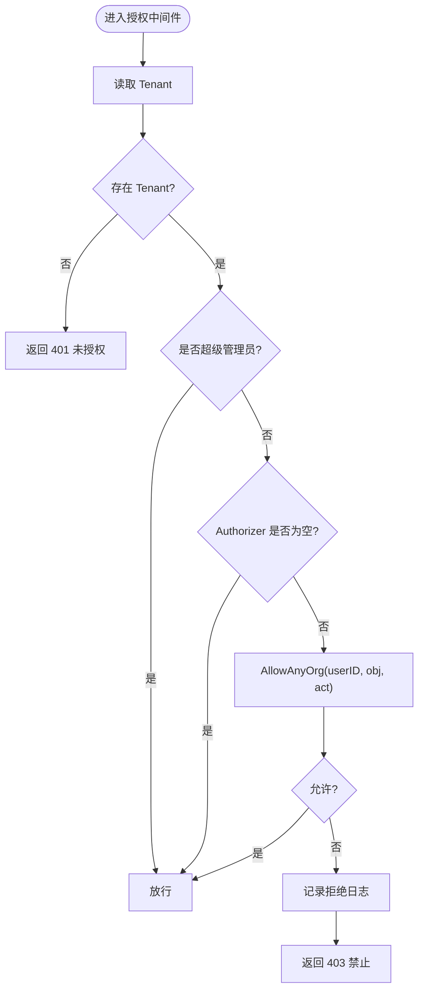
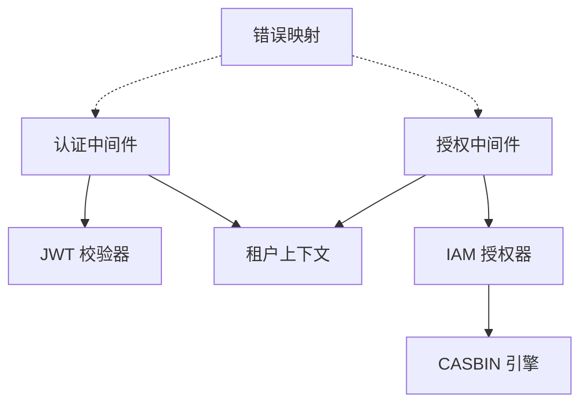

# 权限检查中间件

<cite>
**本文引用的文件**
- [internal/pkg/auth/middleware.go](file://internal/pkg/auth/middleware.go)
- [internal/pkg/auth/jwt.go](file://internal/pkg/auth/jwt.go)
- [internal/pkg/tenantctx/tenantctx.go](file://internal/pkg/tenantctx/tenantctx.go)
- [internal/pkg/authzmw/middleware.go](file://internal/pkg/authzmw/middleware.go)
- [internal/iam/biz/authz/authz.go](file://internal/iam/biz/authz/authz.go)
- [internal/pkg/errs/errs.go](file://internal/pkg/errs/errs.go)
- [internal/manager/server/knowledge/http.go](file://internal/manager/server/knowledge/http.go)
- [internal/manager/server/middleware/metrics.go](file://internal/manager/server/middleware/metrics.go)
</cite>

## 目录
1. [简介](#简介)
2. [项目结构](#项目结构)
3. [核心组件](#核心组件)
4. [架构总览](#架构总览)
5. [详细组件分析](#详细组件分析)
6. [依赖关系分析](#依赖关系分析)
7. [性能与缓存](#性能与缓存)
8. [故障排查指南](#故障排查指南)
9. [结论](#结论)
10. [附录：自定义权限检查器开发指南](#附录自定义权限检查器开发指南)

## 简介
本文件系统性阐述管理器侧的权限检查中间件实现机制，覆盖以下方面：
- HTTP 请求的权限验证流程、上下文信息提取与权限决策过程
- 中间件的注册方式、配置选项与执行顺序
- 权限缓存策略、性能优化与错误处理机制
- 自定义权限检查器的开发指南与集成示例
- middleware.go 中权限中间件的核心逻辑（请求拦截、权限验证、响应处理）

## 项目结构
权限相关代码主要分布在如下位置：
- 认证中间件：负责 JWT 校验并将租户上下文写入请求上下文
- 授权中间件：基于 CASBIN 的策略引擎进行资源与动作的访问控制
- 租户上下文：在请求上下文中传递用户身份与角色等关键信息
- IAM 授权器：封装 CASBIN Enforcer，提供细粒度权限判断能力
- 错误码映射：统一将领域错误映射为 HTTP 状态码
- 业务路由示例：演示如何在具体 Handler 上挂载授权中间件

图表来源
- [internal/pkg/auth/middleware.go:10-53](file://internal/pkg/auth/middleware.go#L10-L53)
- [internal/pkg/authzmw/middleware.go:57-97](file://internal/pkg/authzmw/middleware.go#L57-L97)
- [internal/iam/biz/authz/authz.go:233-271](file://internal/iam/biz/authz/authz.go#L233-L271)
- [internal/pkg/tenantctx/tenantctx.go:13-49](file://internal/pkg/tenantctx/tenantctx.go#L13-L49)

章节来源
- [internal/pkg/auth/middleware.go:10-53](file://internal/pkg/auth/middleware.go#L10-L53)
- [internal/pkg/authzmw/middleware.go:57-97](file://internal/pkg/authzmw/middleware.go#L57-L97)
- [internal/iam/biz/authz/authz.go:233-271](file://internal/iam/biz/authz/authz.go#L233-L271)
- [internal/pkg/tenantctx/tenantctx.go:13-49](file://internal/pkg/tenantctx/tenantctx.go#L13-L49)

## 核心组件
- 认证中间件（auth.Middleware）
  - 从请求头或查询参数提取 JWT
  - 调用 Signer.Verify 校验签名与有效期
  - 将 Tenant（用户ID、邮箱、角色、是否超级管理员）写入请求上下文
  - 失败时直接返回 401，不继续后续链路
- 授权中间件（authzmw.Middleware.Require）
  - 从上下文读取 Tenant
  - 无上下文则返回 401；超级管理员直接放行
  - 若未注入 Authorizer（兼容旧部署），直接放行
  - 否则调用 AllowAnyOrg 进行跨组织权限判定，拒绝则返回 403
- 租户上下文（tenantctx）
  - 提供 With/From 读写上下文中的 Tenant
  - 支持“可变槽位”模式，使外层中间件可读取内层中间件写入的身份
- IAM 授权器（iam/biz/authz.Enforcer）
  - 封装 CASBIN，提供 Allow/AllowAnyOrg 等方法
  - 通过 gorm-adapter 持久化策略，启动时注入角色策略并同步成员关系
- 错误映射（errs）
  - 将 ErrUnauthorized/ErrForbidden 等错误映射为标准 HTTP 状态码

章节来源
- [internal/pkg/auth/middleware.go:10-53](file://internal/pkg/auth/middleware.go#L10-L53)
- [internal/pkg/authzmw/middleware.go:57-97](file://internal/pkg/authzmw/middleware.go#L57-L97)
- [internal/pkg/tenantctx/tenantctx.go:13-49](file://internal/pkg/tenantctx/tenantctx.go#L13-L49)
- [internal/iam/biz/authz/authz.go:233-271](file://internal/iam/biz/authz/authz.go#L233-L271)
- [internal/pkg/errs/errs.go:28-53](file://internal/pkg/errs/errs.go#L28-L53)

## 架构总览
下图展示一次受保护的 HTTP 请求从进入服务器到返回响应的完整流程，包括认证、授权与上下文传递。

图表来源
- [internal/pkg/auth/middleware.go:21-53](file://internal/pkg/auth/middleware.go#L21-L53)
- [internal/pkg/auth/jwt.go:81-99](file://internal/pkg/auth/jwt.go#L81-L99)
- [internal/pkg/authzmw/middleware.go:70-97](file://internal/pkg/authzmw/middleware.go#L70-L97)
- [internal/iam/biz/authz/authz.go:249-271](file://internal/iam/biz/authz/authz.go#L249-L271)

## 详细组件分析

### 认证中间件（auth.Middleware）
- 请求拦截
  - 优先从 Authorization: Bearer 头部提取 token
  - 对 WebSocket 升级场景，回退到查询参数 ?token=
- 权限验证
  - 使用 Signer.Verify 校验签名、过期时间等
  - 解析 Claims，计算 IsSuperuser（兼容旧 token 的 Role=="admin" 回退）
- 上下文信息提取与传播
  - 构造 tenantctx.Tenant 并通过 With 写入请求上下文
  - 同时写入“可变槽位”，供外层中间件（如审计）读取
- 响应处理
  - 任何校验失败均返回 401，不继续调用 next

图表来源
- [internal/pkg/auth/middleware.go:21-53](file://internal/pkg/auth/middleware.go#L21-L53)
- [internal/pkg/auth/jwt.go:81-99](file://internal/pkg/auth/jwt.go#L81-L99)
- [internal/pkg/tenantctx/tenantctx.go:30-49](file://internal/pkg/tenantctx/tenantctx.go#L30-L49)

章节来源
- [internal/pkg/auth/middleware.go:21-53](file://internal/pkg/auth/middleware.go#L21-L53)
- [internal/pkg/auth/jwt.go:81-99](file://internal/pkg/auth/jwt.go#L81-L99)
- [internal/pkg/tenantctx/tenantctx.go:30-49](file://internal/pkg/tenantctx/tenantctx.go#L30-L49)

### 授权中间件（authzmw.Middleware.Require）
- 决策流程
  - 从上下文读取 Tenant；缺失则返回 401
  - 超级管理员直接放行（硬短路，防止策略损坏导致管理员被锁）
  - 若未注入 Authorizer（兼容旧部署），直接放行
  - 调用 AllowAnyOrg 进行跨组织权限判定；允许则放行，否则记录日志并返回 403
- 对象与动作约定
  - 对象命名：edge:*、knowledge:doc/repo、alert:rule/incident、agent:custom、monitor:panel、org:*、user:*
  - 动作词汇：read/write/delete/manage

图表来源
- [internal/pkg/authzmw/middleware.go:70-97](file://internal/pkg/authzmw/middleware.go#L70-L97)
- [internal/iam/biz/authz/authz.go:249-271](file://internal/iam/biz/authz/authz.go#L249-L271)

章节来源
- [internal/pkg/authzmw/middleware.go:70-97](file://internal/pkg/authzmw/middleware.go#L70-L97)
- [internal/iam/biz/authz/authz.go:249-271](file://internal/iam/biz/authz/authz.go#L249-L271)

### 租户上下文（tenantctx）
- 设计要点
  - 提供 With/From 在请求上下文中存取 Tenant
  - 引入“可变槽位”机制，使外层中间件能读取内层中间件写入的身份
- 典型用法
  - 认证中间件在 JWT 校验后写入 Tenant 与槽位
  - 审计中间件在请求前后通过槽位获取用户信息进行审计记录

章节来源
- [internal/pkg/tenantctx/tenantctx.go:13-49](file://internal/pkg/tenantctx/tenantctx.go#L13-L49)
- [internal/pkg/tenantctx/tenantctx.go:51-87](file://internal/pkg/tenantctx/tenantctx.go#L51-L87)

### IAM 授权器（iam/biz/authz.Enforcer）
- 职责
  - 封装 CASBIN，管理模型与策略加载
  - 启动时注入角色策略，同步组织成员关系
  - 提供 Allow/AllowAnyOrg/UserOrgs 等接口
- 关键行为
  - AllowAnyOrg：遍历用户所属组织，任一允许即放行
  - 错误处理：Enforce 出错时记录警告并视为拒绝

章节来源
- [internal/iam/biz/authz/authz.go:46-84](file://internal/iam/biz/authz/authz.go#L46-L84)
- [internal/iam/biz/authz/authz.go:112-143](file://internal/iam/biz/authz/authz.go#L112-L143)
- [internal/iam/biz/authz/authz.go:233-271](file://internal/iam/biz/authz/authz.go#L233-L271)

### 错误处理与 HTTP 映射
- 统一错误定义：ErrUnauthorized、ErrForbidden、ErrNotFound、ErrInvalid 等
- HTTPStatus：将错误映射为标准 HTTP 状态码
- 各 Handler 通过 writeErr 输出结构化 JSON 错误体

章节来源
- [internal/pkg/errs/errs.go:12-53](file://internal/pkg/errs/errs.go#L12-L53)

### 中间件注册与执行顺序
- 典型顺序
  - 指标采集中间件（可选）
  - 认证中间件（JWT 校验）
  - 授权中间件（按资源与动作限定）
  - 业务处理器
- 示例：知识模块在注册路由时为写/删操作附加授权中间件

图表来源
- [internal/manager/server/middleware/metrics.go:18-34](file://internal/manager/server/middleware/metrics.go#L18-L34)
- [internal/manager/server/knowledge/http.go:110-137](file://internal/manager/server/knowledge/http.go#L110-L137)

章节来源
- [internal/manager/server/middleware/metrics.go:18-34](file://internal/manager/server/middleware/metrics.go#L18-L34)
- [internal/manager/server/knowledge/http.go:110-137](file://internal/manager/server/knowledge/http.go#L110-L137)

## 依赖关系分析
- 认证中间件依赖 JWT 校验器与租户上下文
- 授权中间件依赖租户上下文与 IAM 授权器
- IAM 授权器依赖 CASBIN 与数据库适配器
- 错误映射贯穿各层，保证一致的 HTTP 语义

图表来源
- [internal/pkg/auth/middleware.go:21-53](file://internal/pkg/auth/middleware.go#L21-L53)
- [internal/pkg/authzmw/middleware.go:70-97](file://internal/pkg/authzmw/middleware.go#L70-L97)
- [internal/iam/biz/authz/authz.go:64-84](file://internal/iam/biz/authz/authz.go#L64-L84)
- [internal/pkg/errs/errs.go:28-53](file://internal/pkg/errs/errs.go#L28-L53)

章节来源
- [internal/pkg/auth/middleware.go:21-53](file://internal/pkg/auth/middleware.go#L21-L53)
- [internal/pkg/authzmw/middleware.go:70-97](file://internal/pkg/authzmw/middleware.go#L70-L97)
- [internal/iam/biz/authz/authz.go:64-84](file://internal/iam/biz/authz/authz.go#L64-L84)
- [internal/pkg/errs/errs.go:28-53](file://internal/pkg/errs/errs.go#L28-L53)

## 性能与缓存
- 当前实现特点
  - 认证阶段仅做 JWT 签名与有效期校验，不进行数据库查询
  - 授权阶段通过 AllowAnyOrg 遍历用户所属组织并调用 CASBIN 判定
- 潜在瓶颈
  - AllowAnyOrg 每次请求可能多次调用 Enforce，存在一定开销
- 优化建议
  - 在授权中间件或上层路由层增加轻量级缓存（例如基于 userID+obj+act 的结果缓存），设置合理 TTL
  - 对高频读路径（如 read 动作）优先考虑缓存命中
  - 结合指标中间件观测热点路径，评估缓存收益
  - 注意缓存一致性：当成员关系或策略变更时，需失效相关缓存条目

[本节为通用性能讨论，不直接分析具体文件]

## 故障排查指南
- 常见错误与定位
  - 401 未授权：检查是否存在有效的 Bearer Token；确认 JWT 签名与过期时间；确认认证中间件已正确挂载
  - 403 禁止：检查授权中间件是否启用；确认对象与动作匹配；查看授权拒绝日志（包含 user、obj、act）
- 日志与指标
  - 授权拒绝会记录日志，便于快速定位问题
  - 指标中间件可统计请求耗时与状态码分布，辅助发现异常路径
- 调试步骤
  - 确认请求上下文是否包含 Tenant（可通过外层中间件打印）
  - 确认 IAM 授权器是否正确初始化并加载策略
  - 检查策略与成员关系是否与预期一致

章节来源
- [internal/pkg/authzmw/middleware.go:90-94](file://internal/pkg/authzmw/middleware.go#L90-L94)
- [internal/manager/server/middleware/metrics.go:18-34](file://internal/manager/server/middleware/metrics.go#L18-L34)
- [internal/pkg/errs/errs.go:28-53](file://internal/pkg/errs/errs.go#L28-L53)

## 结论
本项目采用“认证+授权”的分层中间件架构：
- 认证中间件负责 JWT 校验与身份注入，确保请求具备可信上下文
- 授权中间件基于 CASBIN 进行细粒度资源与动作控制，并提供超级管理员硬短路保障系统可用性
- 租户上下文贯穿全链路，配合可变槽位机制满足审计等外层中间件需求
- 错误处理统一映射为 HTTP 状态码，便于前端与网关处理
- 建议在高频路径引入结果缓存以提升性能，并结合指标与日志持续优化

[本节为总结性内容，不直接分析具体文件]

## 附录：自定义权限检查器开发指南
- 目标
  - 在不改动现有中间件的前提下，扩展或替换权限决策逻辑
- 步骤
  - 实现 Authorizer 接口（Allow/AllowAnyOrg），封装你的策略引擎或外部服务
  - 在应用启动时创建该实现并注入到授权中间件
  - 在路由注册处按需挂载 Require(obj, act) 中间件
- 集成示例（以知识模块为例）
  - 通过 SetAuthz 注入自定义授权中间件
  - 对写/删路由附加 require("knowledge:doc", "write"/"delete") 等规则
- 注意事项
  - 保持对象与动作命名规范，便于策略管理与审计
  - 对于敏感路径，建议开启更严格的日志与指标采集
  - 如需跨组织权限，确保 AllowAnyOrg 的实现符合业务语义

章节来源
- [internal/pkg/authzmw/middleware.go:35-41](file://internal/pkg/authzmw/middleware.go#L35-L41)
- [internal/manager/server/knowledge/http.go:81-107](file://internal/manager/server/knowledge/http.go#L81-L107)
- [internal/manager/server/knowledge/http.go:110-137](file://internal/manager/server/knowledge/http.go#L110-L137)