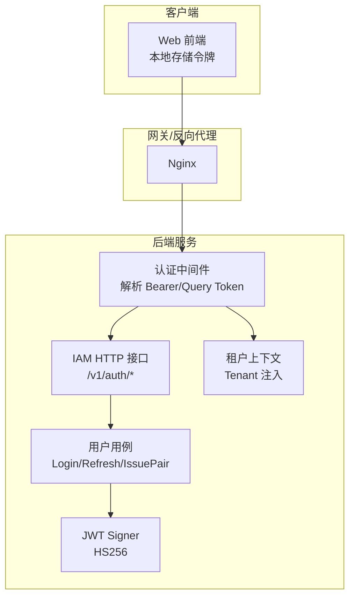
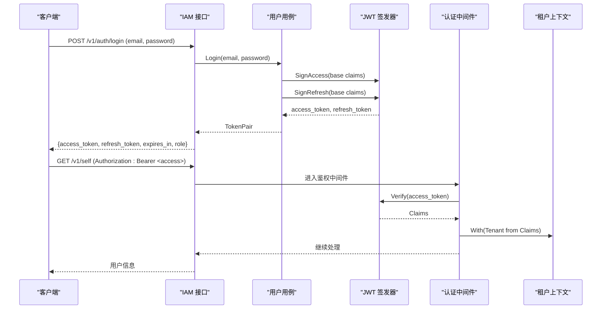
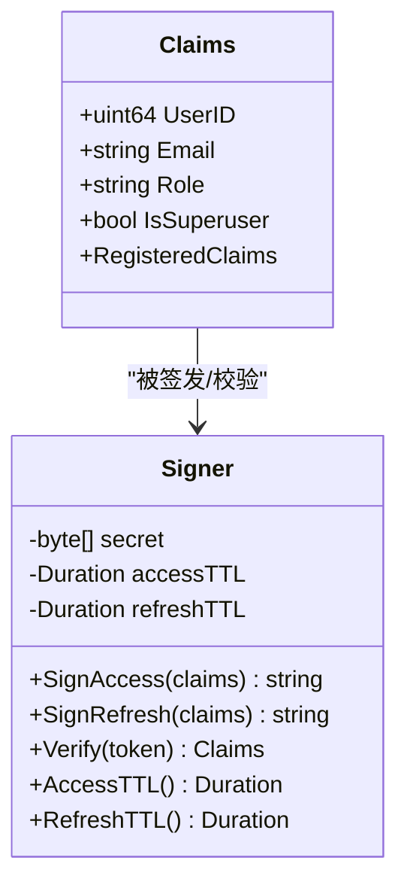
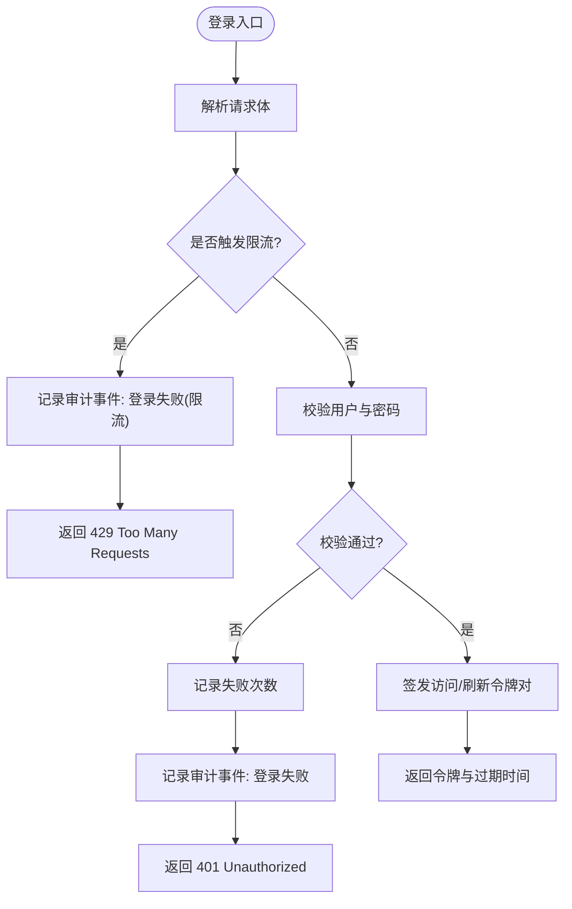
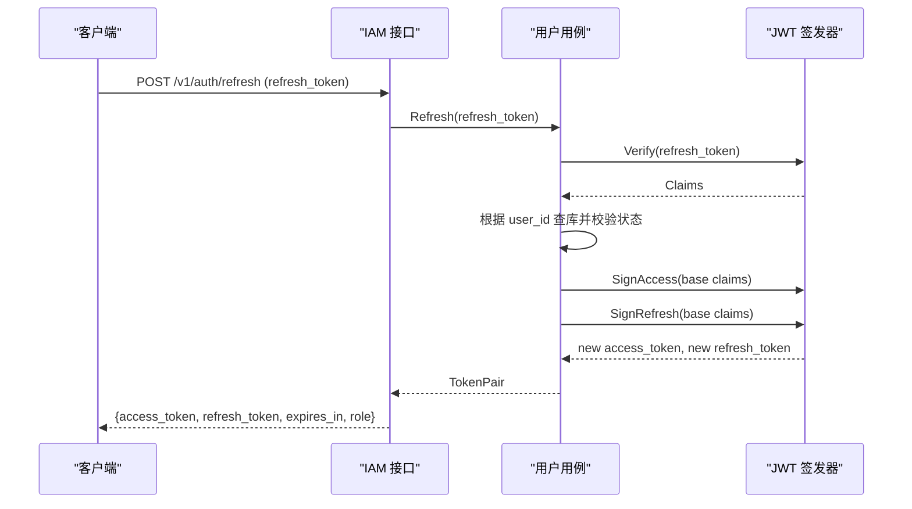
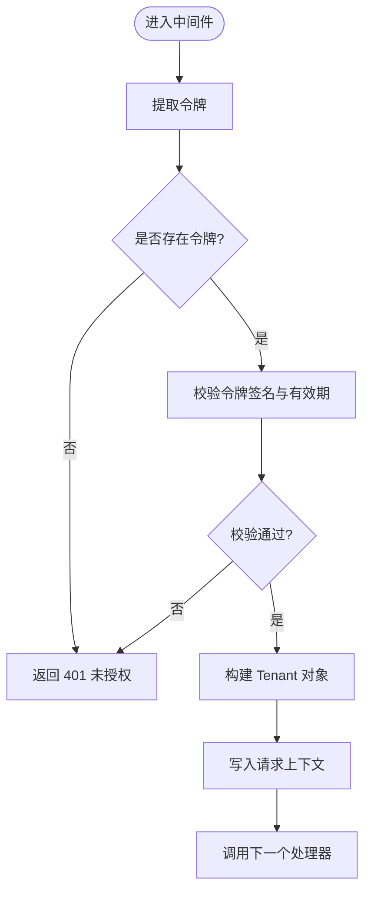
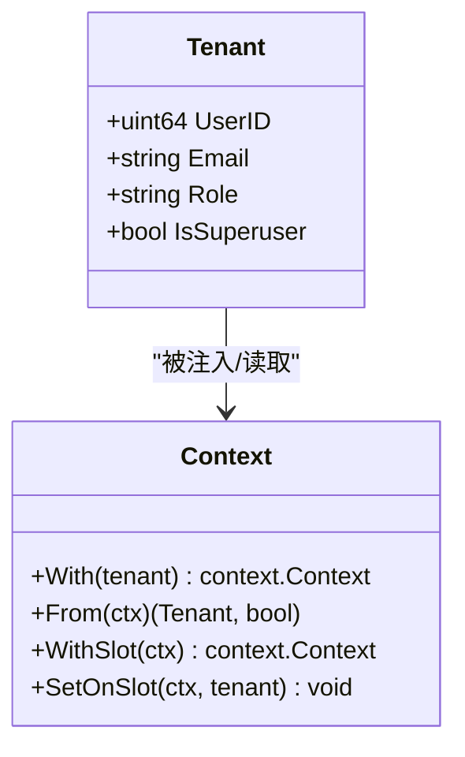
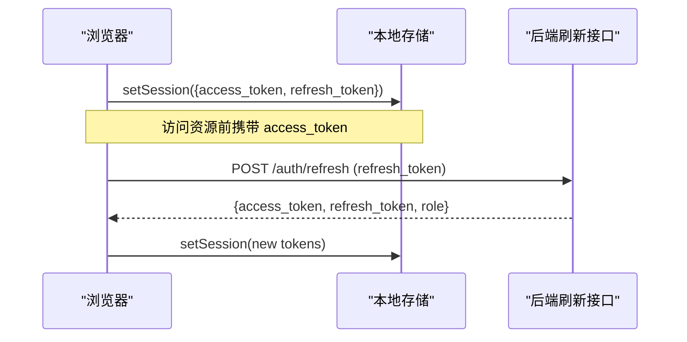
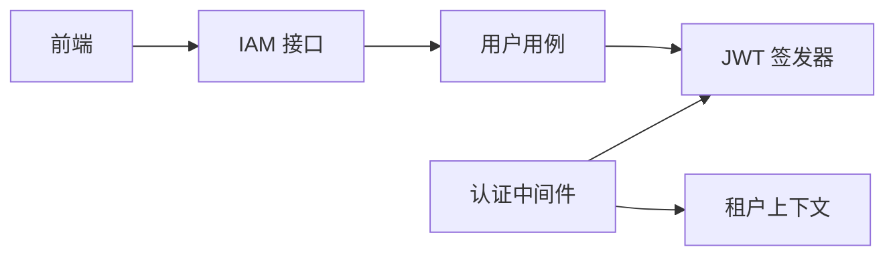

# 身份认证机制

<cite>
**本文引用的文件**
- [internal/pkg/auth/jwt.go](file://internal/pkg/auth/jwt.go)
- [internal/pkg/auth/middleware.go](file://internal/pkg/auth/middleware.go)
- [internal/iam/biz/user/usecase.go](file://internal/iam/biz/user/usecase.go)
- [internal/iam/server/http.go](file://internal/iam/server/http.go)
- [internal/pkg/config/config.go](file://internal/pkg/config/config.go)
- [internal/pkg/tenantctx/tenantctx.go](file://internal/pkg/tenantctx/tenantctx.go)
- [internal/pkg/errs/errs.go](file://internal/pkg/errs/errs.go)
- [api/iam/v1/iam.proto](file://api/iam/v1/iam.proto)
- [web/src/store/auth.ts](file://web/src/store/auth.ts)
- [web/src/api/client.ts](file://web/src/api/client.ts)
- [tests/e2e/auth_login_test.go](file://tests/e2e/auth_login_test.go)
</cite>

## 目录
1. [简介](#简介)
2. [项目结构](#项目结构)
3. [核心组件](#核心组件)
4. [架构总览](#架构总览)
5. [详细组件分析](#详细组件分析)
6. [依赖关系分析](#依赖关系分析)
7. [性能与扩展性](#性能与扩展性)
8. [故障排查指南](#故障排查指南)
9. [结论](#结论)
10. [附录](#附录)

## 简介
本文件系统性阐述 Ongrid 的身份认证机制，覆盖 JWT 令牌生成、验证与刷新流程；令牌结构与过期策略；安全存储与会话维护；多租户上下文管理；认证中间件工作原理与令牌传递机制；以及认证失败错误处理与安全审计日志。当前实现基于无状态 JWT 鉴权，未内置 OAuth2/SSO 集成，但提供了可扩展的上下文与中间件基础，便于后续接入外部身份提供商。

## 项目结构
认证相关代码主要分布在以下模块：
- 通用认证能力：JWT 签发与校验、HTTP 鉴权中间件、请求上下文中的租户信息注入
- IAM 领域服务：登录、注册、刷新、用户管理等业务用例
- HTTP 接口层：公开接口（登录、刷新）与受保护接口的路由与处理器
- 前端会话与自动刷新：浏览器端令牌持久化与自动续期逻辑
- 配置与错误：JWT 参数配置、统一错误码映射
- 测试：端到端认证流程验证

图表来源
- [internal/pkg/auth/middleware.go:10-53](file://internal/pkg/auth/middleware.go#L10-L53)
- [internal/iam/server/http.go:151-155](file://internal/iam/server/http.go#L151-L155)
- [internal/iam/biz/user/usecase.go:80-123](file://internal/iam/biz/user/usecase.go#L80-L123)
- [internal/pkg/auth/jwt.go:32-99](file://internal/pkg/auth/jwt.go#L32-L99)
- [internal/pkg/tenantctx/tenantctx.go:13-49](file://internal/pkg/tenantctx/tenantctx.go#L13-L49)

章节来源
- [internal/pkg/auth/middleware.go:10-67](file://internal/pkg/auth/middleware.go#L10-L67)
- [internal/iam/server/http.go:151-155](file://internal/iam/server/http.go#L151-L155)
- [internal/iam/biz/user/usecase.go:80-123](file://internal/iam/biz/user/usecase.go#L80-L123)
- [internal/pkg/auth/jwt.go:32-99](file://internal/pkg/auth/jwt.go#L32-L99)
- [internal/pkg/tenantctx/tenantctx.go:13-49](file://internal/pkg/tenantctx/tenantctx.go#L13-L49)

## 核心组件
- JWT 签发器：使用 HS256 对称签名，支持访问令牌与刷新令牌两种 TTL，提供签发与校验方法
- 认证中间件：从 Authorization 头或查询参数提取令牌，校验后把调用者身份写入请求上下文
- 用户用例：负责登录校验、刷新令牌、签发令牌对，并返回给上层接口
- HTTP 接口：暴露登录、刷新等公开接口，以及需要鉴权的受保护接口
- 租户上下文：承载用户 ID、邮箱、角色、超级管理员标志，供下游权限控制与审计使用
- 配置：集中管理 JWT 密钥与过期时间
- 错误映射：将领域错误映射为 HTTP 状态码

章节来源
- [internal/pkg/auth/jwt.go:16-99](file://internal/pkg/auth/jwt.go#L16-L99)
- [internal/pkg/auth/middleware.go:10-67](file://internal/pkg/auth/middleware.go#L10-L67)
- [internal/iam/biz/user/usecase.go:18-123](file://internal/iam/biz/user/usecase.go#L18-L123)
- [internal/iam/server/http.go:151-288](file://internal/iam/server/http.go#L151-L288)
- [internal/pkg/tenantctx/tenantctx.go:13-49](file://internal/pkg/tenantctx/tenantctx.go#L13-L49)
- [internal/pkg/config/config.go:321-326](file://internal/pkg/config/config.go#L321-L326)
- [internal/pkg/errs/errs.go:12-53](file://internal/pkg/errs/errs.go#L12-L53)

## 架构总览
Ongrid 采用无状态 JWT 鉴权模型：
- 登录成功后签发一对短生命周期访问令牌与长生命周期刷新令牌
- 后续请求通过中间件校验令牌，无需数据库查询用户信息
- 成功校验后将调用者身份写入请求上下文，供权限与审计使用
- 前端在本地持久化令牌，并在访问令牌过期时自动刷新

图表来源
- [internal/iam/server/http.go:221-269](file://internal/iam/server/http.go#L221-L269)
- [internal/iam/biz/user/usecase.go:80-123](file://internal/iam/biz/user/usecase.go#L80-L123)
- [internal/pkg/auth/jwt.go:56-99](file://internal/pkg/auth/jwt.go#L56-L99)
- [internal/pkg/auth/middleware.go:21-53](file://internal/pkg/auth/middleware.go#L21-L53)
- [internal/pkg/tenantctx/tenantctx.go:30-49](file://internal/pkg/tenantctx/tenantctx.go#L30-L49)

## 详细组件分析

### JWT 令牌结构与签发
- 载荷包含用户 ID、邮箱、角色、是否超级管理员标志，以及标准声明（exp、iat、sub）
- 使用 HS256 对称签名，密钥来自配置；访问令牌与刷新令牌分别设置不同 TTL
- 签发时自动填充 issued_at 与 expires_at，并通过签名保证完整性

图表来源
- [internal/pkg/auth/jwt.go:16-99](file://internal/pkg/auth/jwt.go#L16-L99)

章节来源
- [internal/pkg/auth/jwt.go:16-99](file://internal/pkg/auth/jwt.go#L16-L99)
- [internal/pkg/config/config.go:321-326](file://internal/pkg/config/config.go#L321-L326)

### 登录认证流程
- 公开接口接收邮箱与密码
- 进行速率限制（IP 与邮箱维度），防止暴力破解
- 校验用户存在、状态有效、密码正确
- 签发访问令牌与刷新令牌，返回给客户端

图表来源
- [internal/iam/server/http.go:221-269](file://internal/iam/server/http.go#L221-L269)
- [internal/iam/biz/user/usecase.go:80-123](file://internal/iam/biz/user/usecase.go#L80-L123)
- [internal/pkg/errs/errs.go:28-53](file://internal/pkg/errs/errs.go#L28-L53)

章节来源
- [internal/iam/server/http.go:221-269](file://internal/iam/server/http.go#L221-L269)
- [internal/iam/biz/user/usecase.go:80-123](file://internal/iam/biz/user/usecase.go#L80-L123)
- [internal/pkg/errs/errs.go:28-53](file://internal/pkg/errs/errs.go#L28-L53)

### 令牌刷新流程
- 客户端携带刷新令牌调用刷新接口
- 服务端校验刷新令牌签名与有效期
- 根据令牌中的用户 ID 获取用户并检查状态
- 签发新的访问/刷新令牌对返回

图表来源
- [internal/iam/server/http.go:271-288](file://internal/iam/server/http.go#L271-L288)
- [internal/iam/biz/user/usecase.go:102-123](file://internal/iam/biz/user/usecase.go#L102-L123)
- [internal/pkg/auth/jwt.go:56-99](file://internal/pkg/auth/jwt.go#L56-L99)

章节来源
- [internal/iam/server/http.go:271-288](file://internal/iam/server/http.go#L271-L288)
- [internal/iam/biz/user/usecase.go:102-123](file://internal/iam/biz/user/usecase.go#L102-L123)

### 认证中间件与令牌传递
- 支持从 Authorization: Bearer <token> 或查询参数 ?token=<jwt> 提取令牌（用于 WebSocket 场景）
- 校验失败直接返回 401，不继续处理
- 校验成功后将调用者身份写入请求上下文，供下游权限与审计使用

图表来源
- [internal/pkg/auth/middleware.go:21-67](file://internal/pkg/auth/middleware.go#L21-L67)
- [internal/pkg/tenantctx/tenantctx.go:30-49](file://internal/pkg/tenantctx/tenantctx.go#L30-L49)

章节来源
- [internal/pkg/auth/middleware.go:21-67](file://internal/pkg/auth/middleware.go#L21-L67)
- [internal/pkg/tenantctx/tenantctx.go:30-49](file://internal/pkg/tenantctx/tenantctx.go#L30-L49)

### 多租户上下文与会话状态
- 当前 MVP 为单租户模式，Tenant 实际表示已认证调用者
- 上下文包含用户 ID、邮箱、角色、是否超级管理员标志
- 中间件在鉴权通过后注入上下文，下游可读取以进行权限判断与审计标注
- 会话状态由前端本地存储令牌维持，服务端无状态

图表来源
- [internal/pkg/tenantctx/tenantctx.go:13-87](file://internal/pkg/tenantctx/tenantctx.go#L13-L87)

章节来源
- [internal/pkg/tenantctx/tenantctx.go:13-87](file://internal/pkg/tenantctx/tenantctx.go#L13-L87)

### 前端会话管理与自动刷新
- 前端将访问令牌与刷新令牌持久化到本地存储
- 当访问令牌过期时，前端调用刷新接口获取新令牌对
- 刷新失败则清除本地会话，引导重新登录

图表来源
- [web/src/store/auth.ts:1-49](file://web/src/store/auth.ts#L1-L49)
- [web/src/api/client.ts:117-162](file://web/src/api/client.ts#L117-L162)

章节来源
- [web/src/store/auth.ts:1-49](file://web/src/store/auth.ts#L1-L49)
- [web/src/api/client.ts:117-162](file://web/src/api/client.ts#L117-L162)

### 安全最佳实践
- 使用强随机密钥进行 HS256 签名，密钥应通过安全方式注入
- 访问令牌设置较短 TTL，刷新令牌设置较长 TTL
- 登录接口实施 IP 与邮箱维度的速率限制，抵御暴力破解
- 仅在后端校验令牌签名与有效期，不依赖前端安全
- 敏感字段（如密码哈希）不在响应中回显
- 审计日志记录失败登录尝试，便于检测异常行为

章节来源
- [internal/pkg/config/config.go:321-326](file://internal/pkg/config/config.go#L321-L326)
- [internal/iam/server/http.go:26-114](file://internal/iam/server/http.go#L26-L114)
- [internal/iam/biz/user/usecase.go:40-78](file://internal/iam/biz/user/usecase.go#L40-L78)
- [internal/pkg/errs/errs.go:28-53](file://internal/pkg/errs/errs.go#L28-L53)

### OAuth2 与外部身份提供商对接
- 当前实现未内置 OAuth2/SSO 流程
- 可通过扩展 IAM 服务增加第三方登录入口，复用现有 JWT 签发与中间件机制
- 建议在登录成功后仍签发系统内部 JWT，以便统一鉴权与审计

[本节为概念性说明，不直接分析具体文件]

## 依赖关系分析
- 认证中间件依赖 JWT 签发器进行令牌校验，并将结果写入租户上下文
- IAM 接口层依赖用户用例执行登录与刷新逻辑
- 用户用例依赖 JWT 签发器签发令牌对
- 前端依赖后端刷新接口实现令牌续期

图表来源
- [internal/pkg/auth/middleware.go:21-67](file://internal/pkg/auth/middleware.go#L21-L67)
- [internal/iam/server/http.go:151-288](file://internal/iam/server/http.go#L151-L288)
- [internal/iam/biz/user/usecase.go:80-123](file://internal/iam/biz/user/usecase.go#L80-L123)
- [internal/pkg/auth/jwt.go:56-99](file://internal/pkg/auth/jwt.go#L56-L99)

章节来源
- [internal/pkg/auth/middleware.go:21-67](file://internal/pkg/auth/middleware.go#L21-L67)
- [internal/iam/server/http.go:151-288](file://internal/iam/server/http.go#L151-L288)
- [internal/iam/biz/user/usecase.go:80-123](file://internal/iam/biz/user/usecase.go#L80-L123)
- [internal/pkg/auth/jwt.go:56-99](file://internal/pkg/auth/jwt.go#L56-L99)

## 性能与扩展性
- 无状态鉴权减少数据库查询，提升吞吐
- 中间件快速失败，无效令牌立即返回 401
- 登录限流降低暴力攻击风险，避免资源耗尽
- 可扩展点：在 IAM 服务中增加外部身份提供商登录入口，复用 JWT 签发与中间件

[本节提供一般性指导，不直接分析具体文件]

## 故障排查指南
- 401 未授权：检查令牌是否存在、是否正确传递、签名与有效期是否有效
- 429 过多尝试：检查登录频率是否超过限流阈值，确认 IP 与邮箱维度计数
- 刷新失败：检查刷新令牌是否有效，用户状态是否活跃
- 审计日志：查看失败登录记录，定位异常来源

章节来源
- [internal/pkg/errs/errs.go:28-53](file://internal/pkg/errs/errs.go#L28-L53)
- [internal/iam/server/http.go:221-269](file://internal/iam/server/http.go#L221-L269)
- [internal/iam/biz/user/usecase.go:102-123](file://internal/iam/biz/user/usecase.go#L102-L123)

## 结论
Ongrid 当前采用无状态 JWT 鉴权，具备清晰的令牌签发、校验与刷新流程，结合中间件与租户上下文实现统一的鉴权与审计基础。前端本地存储令牌并提供自动刷新机制，提升用户体验。未来可在 IAM 服务中扩展 OAuth2/SSO 集成，复用现有机制实现外部身份提供商对接。

[本节总结内容，不直接分析具体文件]

## 附录

### API 定义（摘要）
- 登录：POST /v1/auth/login，请求体包含邮箱与密码，返回访问令牌、刷新令牌、过期时间与角色
- 刷新：POST /v1/auth/refresh，请求体包含刷新令牌，返回新的令牌对
- 受保护接口：需携带有效的访问令牌，由认证中间件校验

章节来源
- [internal/iam/server/http.go:151-155](file://internal/iam/server/http.go#L151-L155)
- [internal/iam/server/http.go:221-288](file://internal/iam/server/http.go#L221-L288)
- [api/iam/v1/iam.proto:9-42](file://api/iam/v1/iam.proto#L9-L42)

### 端到端测试要点
- 登录成功后获取令牌对
- 使用访问令牌调用受保护接口返回用户信息
- 使用无效令牌调用受保护接口返回 401

章节来源
- [tests/e2e/auth_login_test.go:15-43](file://tests/e2e/auth_login_test.go#L15-L43)