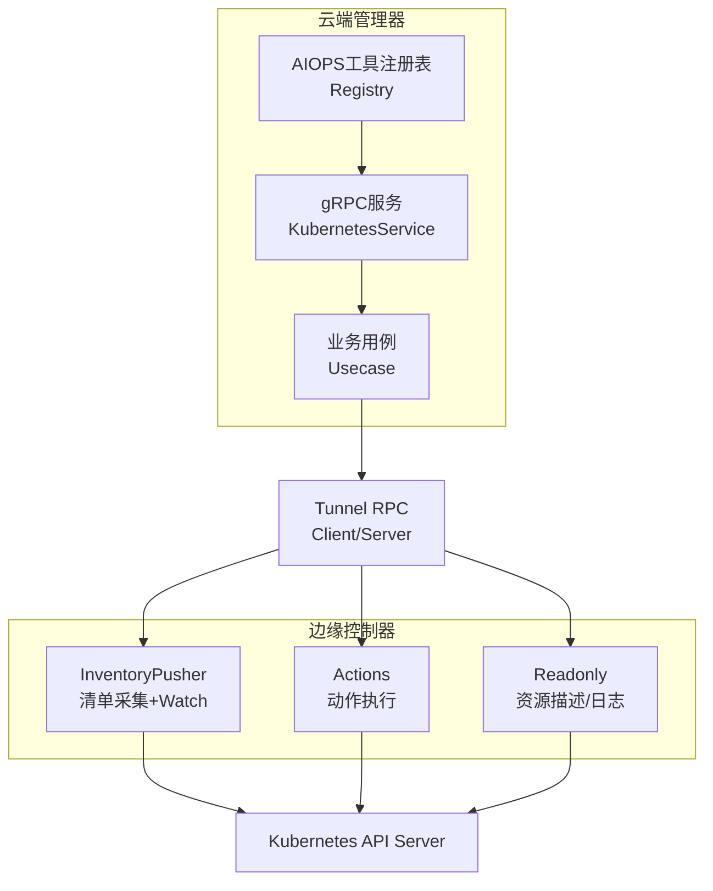
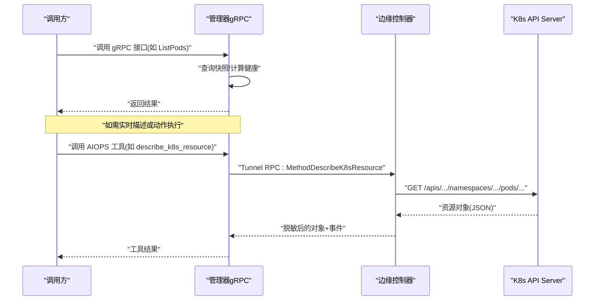
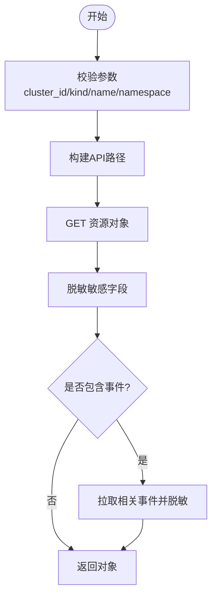
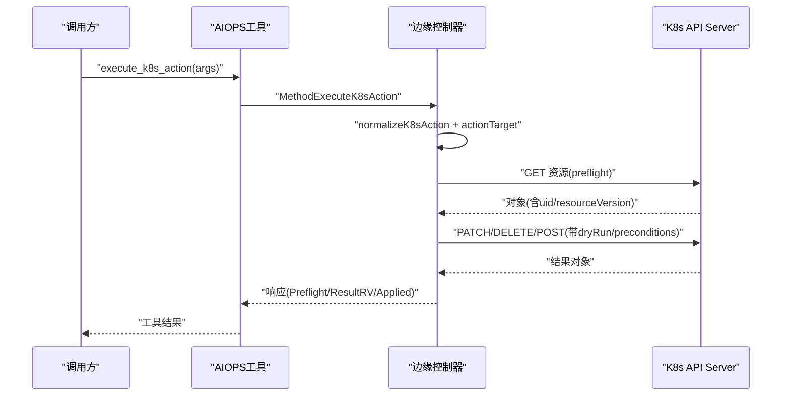
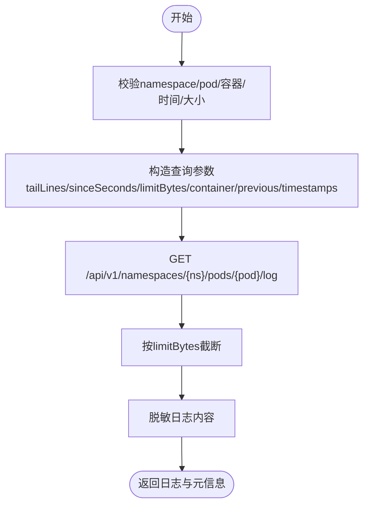
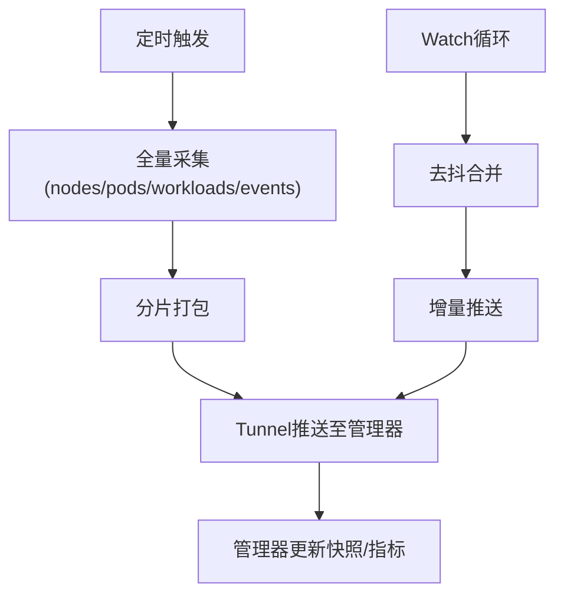
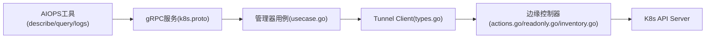

# Kubernetes工具

<cite>
**本文引用的文件**
- [k8s.proto](file://api/manager/k8s/v1/k8s.proto)
- [actions.go](file://internal/edgeagent/k8s/actions.go)
- [readonly.go](file://internal/edgeagent/k8s/readonly.go)
- [inventory.go](file://internal/edgeagent/k8s/inventory.go)
- [types.go](file://internal/pkg/tunnel/types.go)
- [usecase.go](file://internal/manager/biz/k8s/usecase.go)
- [describe_k8s_resource.go](file://internal/manager/biz/aiops/tools/describe_k8s_resource.go)
- [query_k8s_logs.go](file://internal/manager/biz/aiops/tools/query_k8s_logs.go)
- [registry.go](file://internal/manager/biz/aiops/tools/registry.go)
</cite>

## 目录
1. [简介](#简介)
2. [项目结构](#项目结构)
3. [核心组件](#核心组件)
4. [架构总览](#架构总览)
5. [详细组件分析](#详细组件分析)
6. [依赖关系分析](#依赖关系分析)
7. [性能考虑](#性能考虑)
8. [故障排查指南](#故障排查指南)
9. [结论](#结论)
10. [附录：API与参数说明](#附录api与参数说明)

## 简介
本仓库提供一套面向Kubernetes的“资源描述、动作执行、日志查询、集群快照”等能力，通过边缘侧控制器（Edge Agent）与云端管理器（Manager）协作完成。其核心特点包括：
- 资源描述：实时读取指定K8s资源并脱敏返回，支持附带相关事件。
- 动作执行：对Deployment/StatefulSet/DaemonSet/Pod/Node等执行受控变更（重启、扩缩容、删除/驱逐Pod、节点Cordon/Drain等），支持DryRun与资源版本冲突保护。
- Pod日志查询：按命名空间与Pod名称拉取最近日志，支持容器选择、时间窗口与大小限制。
- 集群快照：周期性采集节点、工作负载、Pod、事件等清单，并通过增量Watch机制推送至管理器，形成可查询的集群快照。

这些能力通过Tunnel RPC在边缘与云端之间通信，并由管理器暴露统一的gRPC API供上层调用。

## 项目结构
- API定义：位于 api/manager/k8s/v1/k8s.proto，定义了集群管理、节点/工作负载/Pod/事件列表、操作审计等接口与消息类型。
- 边缘侧实现：
  - internal/edgeagent/k8s：包含资源描述、动作执行、日志查询、清单采集与Watch监听等逻辑。
  - internal/pkg/tunnel：定义边缘与云端之间的Tunnel客户端与服务端契约。
- 管理器侧实现：
  - internal/manager/biz/k8s：集群注册、健康统计、快照入库、拓扑同步等业务用例。
  - internal/manager/biz/aiops/tools：AIOPS工具层封装，将上述能力以工具形式对外暴露（如 describe_k8s_resource、query_k8s_logs、execute_k8s_action）。

图表来源
- [k8s.proto:10-27](file://api/manager/k8s/v1/k8s.proto#L10-L27)
- [types.go:68-105](file://internal/pkg/tunnel/types.go#L68-L105)
- [inventory.go:44-83](file://internal/edgeagent/k8s/inventory.go#L44-L83)
- [actions.go:37-141](file://internal/edgeagent/k8s/actions.go#L37-L141)
- [readonly.go:26-87](file://internal/edgeagent/k8s/readonly.go#L26-L87)

章节来源
- [k8s.proto:10-27](file://api/manager/k8s/v1/k8s.proto#L10-L27)
- [types.go:68-105](file://internal/pkg/tunnel/types.go#L68-L105)

## 核心组件
- 资源描述工具（describe_k8s_resource）：通过Tunnel调用边缘控制器，直接读取K8s资源对象并脱敏返回，可选附带相关事件。
- 动作执行工具（execute_k8s_action）：对K8s资源执行受限的写操作，内置白名单动作、参数校验、DryRun、资源版本预条件与审计。
- Pod日志查询工具（query_k8s_logs）：按命名空间与Pod名称获取最近日志，支持容器、时间窗口、字节上限与时间戳开关。
- 集群快照（inventory）：周期全量采集+增量Watch，聚合节点、工作负载、Pod、事件，推送到管理器持久化，供列表与健康查询使用。

章节来源
- [describe_k8s_resource.go:15-84](file://internal/manager/biz/aiops/tools/describe_k8s_resource.go#L15-L84)
- [registry.go:207-237](file://internal/manager/biz/aiops/tools/registry.go#L207-L237)
- [query_k8s_logs.go:79-106](file://internal/manager/biz/aiops/tools/query_k8s_logs.go#L79-L106)
- [inventory.go:44-83](file://internal/edgeagent/k8s/inventory.go#L44-L83)

## 架构总览
- 云端gRPC服务：定义集群CRUD、节点/工作负载/Pod/事件列表、操作审计等接口。
- 管理器业务层：负责集群注册、健康汇总、快照入库、拓扑同步、事件清理等。
- 边缘侧：
  - InventoryPusher：定时全量采集与Watch增量推送，维护资源版本与范围（cluster/namespace）。
  - Readonly：提供资源描述与Pod日志查询。
  - Actions：统一入口执行K8s动作，内部路由到具体实现（重启、扩缩容、删除/驱逐、节点Cordon/Drain）。
- 安全与权限：
  - 边缘到K8s API使用ServiceAccount Token与CA证书，最小权限原则。
  - 动作执行需经过管理器审批/策略网关（见审计字段与工具类标记为write/MUTATING）。
  - 敏感字段在返回前进行脱敏处理。

图表来源
- [k8s.proto:10-27](file://api/manager/k8s/v1/k8s.proto#L10-L27)
- [readonly.go:26-87](file://internal/edgeagent/k8s/readonly.go#L26-L87)
- [actions.go:37-141](file://internal/edgeagent/k8s/actions.go#L37-L141)

## 详细组件分析

### 资源描述工具（describe_k8s_resource）
- 功能：实时读取单个K8s资源，支持附加相关事件；自动脱敏敏感字段。
- 关键流程：
  - 参数校验（cluster_id、kind、name、可选namespace/api_version）。
  - 构造API路径并GET资源对象。
  - 可选拉取相关事件（按involved_kind/name过滤）。
  - 脱敏后返回对象与事件。
- 返回值要点：包含Kind、APIVersion、Namespace、Name、UID、ResourceVersion、FetchedAt、Object、Events等。
- 典型场景：用户需要某个Pod/Deployment的最新状态或关联事件时。

图表来源
- [readonly.go:89-137](file://internal/edgeagent/k8s/readonly.go#L89-L137)
- [describe_k8s_resource.go:152-183](file://internal/manager/biz/aiops/tools/describe_k8s_resource.go#L152-L183)

章节来源
- [readonly.go:89-137](file://internal/edgeagent/k8s/readonly.go#L89-L137)
- [describe_k8s_resource.go:15-84](file://internal/manager/biz/aiops/tools/describe_k8s_resource.go#L15-L84)

### 动作执行工具（execute_k8s_action）
- 支持动作：rollout_restart、scale、delete_pod、evict_pod、cordon、uncordon、drain。
- 安全与一致性：
  - 白名单校验与参数边界检查（如replicas范围、grace_period_seconds、drain超时/重试）。
  - DryRun模式：仅验证不实际写入。
  - 资源版本冲突保护：preflight GET获取uid/resourceVersion，写入时携带preconditions。
  - 审计：记录tool_name、args_json、decision/status等。
- 典型流程（以rollout_restart为例）：
  - 解析目标（kind/namespace/name）。
  - preflight GET获取元数据。
  - 构造MergePatch并PATCH目标资源。
  - 返回Preflight与ResultResourceVersion。

图表来源
- [actions.go:37-141](file://internal/edgeagent/k8s/actions.go#L37-L141)
- [actions.go:143-265](file://internal/edgeagent/k8s/actions.go#L143-L265)
- [registry.go:207-237](file://internal/manager/biz/aiops/tools/registry.go#L207-L237)

章节来源
- [actions.go:37-141](file://internal/edgeagent/k8s/actions.go#L37-L141)
- [actions.go:143-265](file://internal/edgeagent/k8s/actions.go#L143-L265)
- [registry.go:207-237](file://internal/manager/biz/aiops/tools/registry.go#L207-L237)

### Pod日志查询工具（query_k8s_logs）
- 功能：按命名空间与Pod名称获取最近日志，支持容器、sinceSeconds、tailLines、limitBytes、previous、timestamps。
- 参数校验与默认值：
  - tailLines默认100，最大500。
  - limitBytes默认16KB，最大64KB。
  - sinceSeconds默认3600秒，最大24小时。
- 返回：日志文本、字节数、行数、是否截断、FetchedAt等。
- 典型场景：快速定位Pod启动失败、CrashLoopBackOff等问题。

图表来源
- [readonly.go:139-207](file://internal/edgeagent/k8s/readonly.go#L139-L207)
- [query_k8s_logs.go:79-106](file://internal/manager/biz/aiops/tools/query_k8s_logs.go#L79-L106)

章节来源
- [readonly.go:139-207](file://internal/edgeagent/k8s/readonly.go#L139-L207)
- [query_k8s_logs.go:79-106](file://internal/manager/biz/aiops/tools/query_k8s_logs.go#L79-L106)

### 集群快照（inventory）
- 全量采集：节点、工作负载（Deployment/StatefulSet/DaemonSet/ReplicaSet/Job/CronJob）、Pod、事件。
- 增量Watch：按资源维度建立Watch，去抖合并后推送差异，支持full resync。
- 推送协议：通过Tunnel RPC批量分片上传，管理器持久化并更新集群元数据（resourceVersion、scope、namespace等）。
- 用途：列表查询、健康统计、拓扑同步、事件清理。

图表来源
- [inventory.go:85-170](file://internal/edgeagent/k8s/inventory.go#L85-L170)
- [inventory.go:346-444](file://internal/edgeagent/k8s/inventory.go#L346-L444)
- [inventory.go:536-641](file://internal/edgeagent/k8s/inventory.go#L536-L641)

章节来源
- [inventory.go:85-170](file://internal/edgeagent/k8s/inventory.go#L85-L170)
- [inventory.go:346-444](file://internal/edgeagent/k8s/inventory.go#L346-L444)
- [inventory.go:536-641](file://internal/edgeagent/k8s/inventory.go#L536-L641)

## 依赖关系分析
- 云端gRPC服务依赖管理器业务用例（usecase），后者再根据场景决定直接读库快照或通过Tunnel调用边缘实时能力。
- 边缘侧InventoryPusher依赖Tunnel Client与K8s API Client；Actions与Readonly同样基于K8s API Client。
- AIOPS工具层通过Registry注册工具，调用Tunnel Client转发到边缘控制器。

图表来源
- [k8s.proto:10-27](file://api/manager/k8s/v1/k8s.proto#L10-L27)
- [usecase.go:224-274](file://internal/manager/biz/k8s/usecase.go#L224-L274)
- [types.go:68-105](file://internal/pkg/tunnel/types.go#L68-L105)

章节来源
- [k8s.proto:10-27](file://api/manager/k8s/v1/k8s.proto#L10-L27)
- [usecase.go:224-274](file://internal/manager/biz/k8s/usecase.go#L224-L274)
- [types.go:68-105](file://internal/pkg/tunnel/types.go#L68-L105)

## 性能考虑
- 快照采集采用全量+增量Watch，减少重复传输；Watch失败指数退避重试，避免雪崩。
- 日志查询限制tailLines与limitBytes，防止大流量拖垮链路。
- 动作执行支持DryRun与资源版本预条件，降低并发冲突风险。
- 事件保留策略：按时间与每集群数量阈值清理，控制存储增长。

[本节为通用指导，无需特定文件引用]

## 故障排查指南
- 权限不足（Forbidden/NotFound）：
  - 确认ServiceAccount token与CA配置正确，且RBAC允许对应资源的read/write。
  - 对于Watch，若权限不足会禁用该资源Watch并降级为全量。
- 资源版本冲突：
  - execute_k8s_action会拒绝不一致的ExpectedResourceVersion，请重新preflight获取最新rv。
- Drain失败：
  - 检查PDB阻塞导致的TooManyRequests，工具已自动重试直至超时；必要时调整drain_retry_seconds或放宽PDB。
- 日志为空或截断：
  - 检查sinceSeconds与limitBytes设置；Previous容器日志需显式开启。

章节来源
- [inventory.go:407-444](file://internal/edgeagent/k8s/inventory.go#L407-L444)
- [actions.go:59-62](file://internal/edgeagent/k8s/actions.go#L59-L62)
- [actions.go:519-539](file://internal/edgeagent/k8s/actions.go#L519-L539)
- [readonly.go:139-207](file://internal/edgeagent/k8s/readonly.go#L139-L207)

## 结论
本方案通过“云端统一管理+边缘实时访问K8s”的分层架构，提供了安全的资源描述、可控的动作执行、高效的日志查询与稳定的集群快照能力。借助严格的参数校验、DryRun、资源版本预条件与脱敏机制，既满足运维效率又兼顾安全性与合规性。建议在生产环境中结合审批流与最小权限原则使用写操作，并以快照为主、实时接口为辅的方式保障系统稳定性。

[本节为总结，无需特定文件引用]

## 附录：API与参数说明

### 云端gRPC服务（KubernetesService）
- 主要方法：CreateCluster/ListClusters/GetCluster/GetClusterHealth/ListEdgeAttachments/ListNodes/ListWorkloads/ListPods/ListEvents/ListActionAudits/RotateBootstrapToken/DeleteCluster/Enroll。
- 请求/响应消息：详见proto定义中的各类Request/Response与枚举（如KubernetesClusterStatus、KubernetesMode）。

章节来源
- [k8s.proto:10-27](file://api/manager/k8s/v1/k8s.proto#L10-L27)
- [k8s.proto:29-391](file://api/manager/k8s/v1/k8s.proto#L29-L391)

### 资源描述工具（describe_k8s_resource）
- 必需参数：cluster_id、kind、name；可选：api_version、namespace、include_events、events_limit。
- 返回：对象JSON（已脱敏）、UID、ResourceVersion、FetchedAt、Events（可选）。
- 使用示例（概念性）：
  - 查询default命名空间下名为api的Deployment最新状态与最近20条事件。

章节来源
- [describe_k8s_resource.go:15-84](file://internal/manager/biz/aiops/tools/describe_k8s_resource.go#L15-L84)
- [describe_k8s_resource.go:152-183](file://internal/manager/biz/aiops/tools/describe_k8s_resource.go#L152-L183)

### 动作执行工具（execute_k8s_action）
- 支持动作：rollout_restart、scale、delete_pod、evict_pod、cordon、uncordon、drain。
- 关键参数：action、kind、namespace、name、replicas（scale）、grace_period_seconds、expected_resource_version、dry_run、drain_timeout_seconds、drain_retry_seconds、ignore_daemon_sets、delete_emptydir_data、force、disable_eviction。
- 返回：Preflight（目标元数据）、Applied（是否真正写入）、ResultResourceVersion、EvictedPodCount/DeletedPodCount/SkippedPodCount（drain）等。
- 使用示例（概念性）：
  - 对default命名空间下的Deployment api执行scale到3副本，并启用DryRun验证。

章节来源
- [actions.go:18-35](file://internal/edgeagent/k8s/actions.go#L18-L35)
- [actions.go:37-141](file://internal/edgeagent/k8s/actions.go#L37-L141)
- [actions.go:143-265](file://internal/edgeagent/k8s/actions.go#L143-L265)
- [registry.go:207-237](file://internal/manager/biz/aiops/tools/registry.go#L207-L237)

### Pod日志查询工具（query_k8s_logs）
- 必需参数：cluster_id、namespace、pod；可选：container、tail_lines、limit_bytes、since_seconds、previous、timestamps。
- 返回：Logs、Bytes、LineCount、Truncated、FetchedAt等。
- 使用示例（概念性）：
  - 获取default命名空间下api Pod最近1小时的日志，最多16KB，显示时间戳。

章节来源
- [readonly.go:139-207](file://internal/edgeagent/k8s/readonly.go#L139-L207)
- [query_k8s_logs.go:79-106](file://internal/manager/biz/aiops/tools/query_k8s_logs.go#L79-L106)

### 集群快照（inventory）
- 采集范围：nodes、pods、workloads（apps/batch组）、events；支持cluster或namespace级别。
- 推送方式：全量分片+增量Watch；管理器侧持久化并维护resourceVersion与scope/namespace。
- 使用示例（概念性）：
  - 首次全量采集后，后续仅推送变化项；当资源版本过期时触发full resync。

章节来源
- [inventory.go:85-170](file://internal/edgeagent/k8s/inventory.go#L85-L170)
- [inventory.go:346-444](file://internal/edgeagent/k8s/inventory.go#L346-L444)
- [inventory.go:536-641](file://internal/edgeagent/k8s/inventory.go#L536-L641)

### 权限与安全最佳实践
- 边缘到K8s API：使用ServiceAccount Token与CA，遵循最小权限原则（只读用于描述/日志，写操作仅限必要资源）。
- 写操作审批：execute_k8s_action标记为write/MUTATING，建议结合审批流与审计（ListActionAudits）使用。
- 数据脱敏：所有返回对象与日志均进行敏感字段脱敏，避免泄露密钥与凭证。
- 网络与认证：Tunnel连接使用AccessKey/SecretKey认证，确保链路加密与身份可信。

章节来源
- [inventory.go:707-741](file://internal/edgeagent/k8s/inventory.go#L707-L741)
- [actions.go:605-644](file://internal/edgeagent/k8s/actions.go#L605-L644)
- [readonly.go:264-309](file://internal/edgeagent/k8s/readonly.go#L264-L309)
- [k8s.proto:331-367](file://api/manager/k8s/v1/k8s.proto#L331-L367)