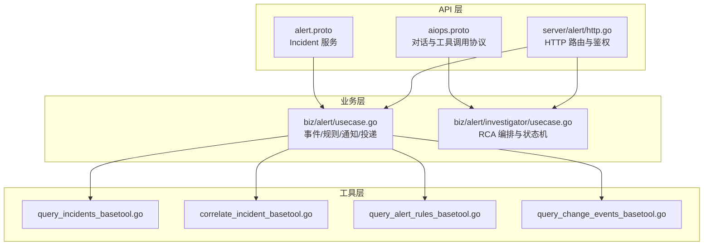
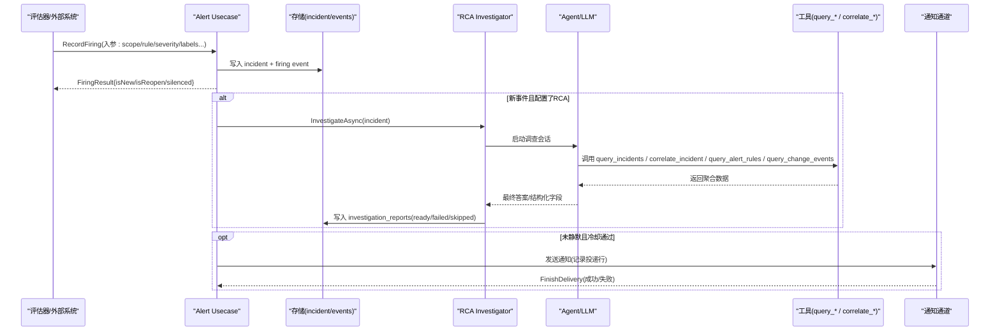
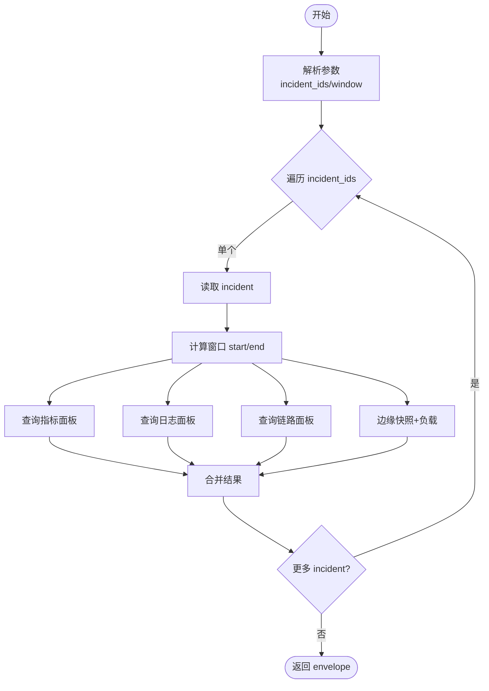
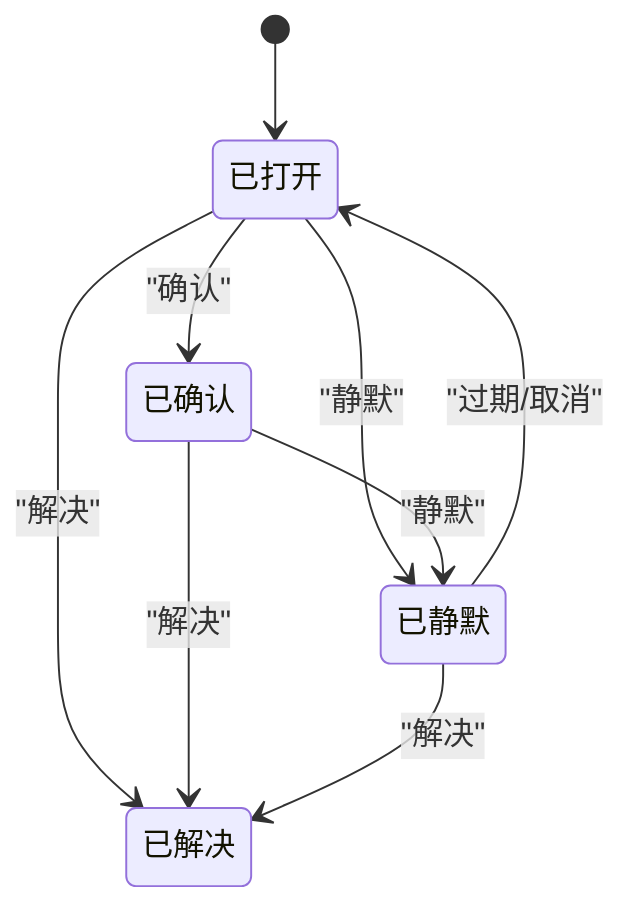
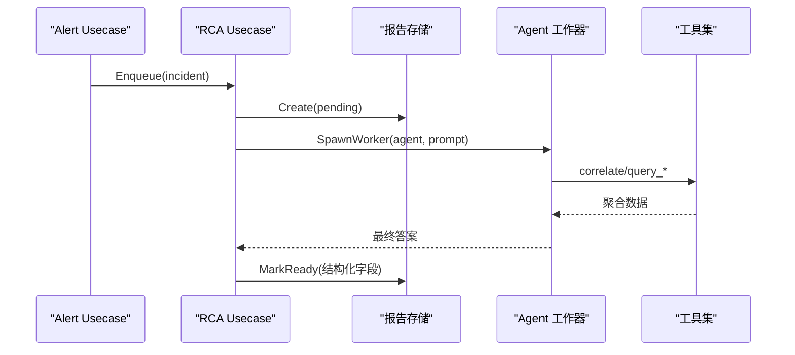
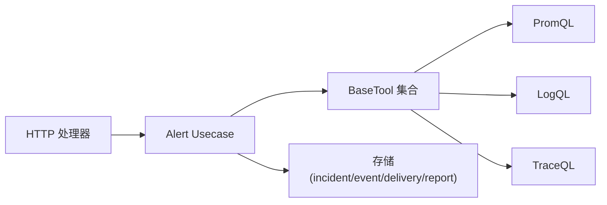

# 事件处理工具

<cite>
**本文引用的文件**
- [alert.proto](file://api/manager/alert/v1/alert.proto)
- [aiops.proto](file://api/manager/aiops/v1/aiops.proto)
- [usecase.go](file://internal/manager/biz/alert/usecase.go)
- [http.go](file://internal/manager/server/alert/http.go)
- [query_incidents_basetool.go](file://internal/manager/biz/aiops/tools/query_incidents_basetool.go)
- [correlate_incident_basetool.go](file://internal/manager/biz/aiops/tools/correlate_incident_basetool.go)
- [query_alert_rules_basetool.go](file://internal/manager/biz/aiops/tools/query_alert_rules_basetool.go)
- [query_change_events_basetool.go](file://internal/manager/biz/aiops/tools/query_change_events_basetool.go)
- [investigator_usecase.go](file://internal/manager/biz/alert/investigator/usecase.go)
</cite>

## 目录
1. [简介](#简介)
2. [项目结构](#项目结构)
3. [核心组件](#核心组件)
4. [架构总览](#架构总览)
5. [详细组件分析](#详细组件分析)
6. [依赖关系分析](#依赖关系分析)
7. [性能考量](#性能考量)
8. [故障排查指南](#故障排查指南)
9. [结论](#结论)
10. [附录](#附录)

## 简介
本文件面向“事件管理与分析”相关工具，覆盖以下能力：
- 事件详情查询与生命周期管理（告警事件、变更事件）
- 事件关联分析（指标、日志、链路、拓扑等聚合诊断）
- 告警规则查询（只读）
- 变更事件查询（审计日志）
- 自动根因分析（RCA）工作流与状态机

文档将说明各工具的参数定义、返回值格式、调用流程、状态管理、数据来源与更新机制，并提供实际案例与排障建议。

## 项目结构
事件处理由三层构成：
- API 层：gRPC/HTTP 接口定义与路由注册
- 业务层（biz）：用例编排、规则与事件生命周期、AI 调查编排
- 工具层（tools）：Agent 可调用的具体工具（查询 incident、关联分析、规则、变更事件等）

图表来源
- [alert.proto:9-14](file://api/manager/alert/v1/alert.proto#L9-L14)
- [aiops.proto:11-29](file://api/manager/aiops/v1/aiops.proto#L11-L29)
- [http.go:154-180](file://internal/manager/server/alert/http.go#L154-L180)
- [usecase.go:141-174](file://internal/manager/biz/alert/usecase.go#L141-L174)
- [investigator_usecase.go:321-439](file://internal/manager/biz/alert/investigator/usecase.go#L321-L439)

章节来源
- [alert.proto:9-14](file://api/manager/alert/v1/alert.proto#L9-L14)
- [aiops.proto:11-29](file://api/manager/aiops/v1/aiops.proto#L11-L29)
- [http.go:154-180](file://internal/manager/server/alert/http.go#L154-L180)

## 核心组件
- 事件与告警用例（Usecase）：负责事件创建、状态转换、静默、重复抑制、通知投递、规则管理等。
- HTTP 处理器：提供 Incident、Channel、Rule 的 CRUD 与运行时信息；支持手动触发 RCA。
- AI 调查（Investigator）：在事件触发后异步启动 RCA 工作流，维护报告状态并产出结构化结果。
- 工具集（BaseTool）：为 Agent 暴露可调用能力，包括查询 incident、关联分析、查询规则、查询变更事件等。

章节来源
- [usecase.go:141-174](file://internal/manager/biz/alert/usecase.go#L141-L174)
- [http.go:154-180](file://internal/manager/server/alert/http.go#L154-L180)
- [investigator_usecase.go:321-439](file://internal/manager/biz/alert/investigator/usecase.go#L321-L439)

## 架构总览
事件从“触发→持久化→可选 RCA→通知→可观测”的完整链路如下：

图表来源
- [usecase.go:349-513](file://internal/manager/biz/alert/usecase.go#L349-L513)
- [investigator_usecase.go:321-439](file://internal/manager/biz/alert/investigator/usecase.go#L321-L439)
- [correlate_incident_basetool.go:245-281](file://internal/manager/biz/aiops/tools/correlate_incident_basetool.go#L245-L281)

## 详细组件分析

### 事件详情查询工具（query_incidents）
- 功能：按时间窗口、严重级别、状态、设备/边缘、规则键等过滤，列出最近的事件。
- 关键参数（JSON Schema 语义）：
  - since_minutes：回溯分钟数（默认 24*60）
  - severity：info/warning/critical
  - status：open/acknowledged/silenced/resolved
  - rule_key：规则键
  - device_id/edge_id：设备或边缘标识
  - limit：上限（默认 50，最大 500）
- 返回值：包含 incidents 列表与 count。
- 使用示例：
  - “过去 24 小时有多少 critical 事件？”
  - “列出 edge X 上 open 的事件”
- 注意事项：
  - 仅用于“列表”，不用于单条事件时间线（用 get_incident_detail）
  - 不用于原始指标/日志/链路查询（用对应 query_* 工具）

章节来源
- [query_incidents_basetool.go:38-140](file://internal/manager/biz/aiops/tools/query_incidents_basetool.go#L38-L140)

### 事件关联分析工具（correlate_incident）
- 功能：对一组 incident_id 进行批量关联诊断，聚合指标面板、日志片段、链路片段与边缘快照。
- 关键参数：
  - incident_ids：数组，最多 16 个（推荐 2-4）
  - window_minutes：围绕 first_fired_at 的时间窗口（默认 30，最大 240）
- 返回值：每个 incident 的 bundle（含 metric/log/trace/edge），以及 success_count/error_count。
- 内部流程要点：
  - 并发查询 PromQL、LogQL、TraceQL，并按量裁剪
  - 获取边缘快照与当前负载（CPU/Mem/Up）
  - 统计近期事件抖动数量
- 使用示例：
  - “对 incident 1001、1002 做关联诊断，窗口 30 分钟”

图表来源
- [correlate_incident_basetool.go:128-243](file://internal/manager/biz/aiops/tools/correlate_incident_basetool.go#L128-L243)
- [correlate_incident_basetool.go:245-281](file://internal/manager/biz/aiops/tools/correlate_incident_basetool.go#L245-L281)

章节来源
- [correlate_incident_basetool.go:128-243](file://internal/manager/biz/aiops/tools/correlate_incident_basetool.go#L128-L243)
- [correlate_incident_basetool.go:245-281](file://internal/manager/biz/aiops/tools/correlate_incident_basetool.go#L245-L281)

### 告警规则查询工具（query_alert_rules）
- 功能：只读查询告警规则定义（模板），支持按 kind、enabled、名称模糊匹配过滤。
- 关键参数：
  - kind：规则类型（需为已知值）
  - enabled：是否启用
  - name_contains：名称或 rule_key 包含子串
  - limit：上限（默认 100，最大 500）
- 返回值：rules 列表与 count。
- 使用示例：
  - “列出所有 metric_threshold 类型的规则”
  - “查找启用了的规则中名称包含 ‘cpu’ 的条目”

章节来源
- [query_alert_rules_basetool.go:37-112](file://internal/manager/biz/aiops/tools/query_alert_rules_basetool.go#L37-L112)

### 变更事件查询工具（query_change_events）
- 功能：查询审计日志中的“产品侧变更事件”（如规则/设置/设备/通道/仓库/技能/用户等），用于 RCA 溯源。
- 关键参数：
  - around_ts：锚点时间（RFC3339，默认当前时间）
  - window_minutes：半窗口分钟数（默认 30，最大 1440）
  - resource_type：资源类型过滤
  - action：动作过滤
  - limit：返回条数上限（默认 50，最大 200）
- 返回值：window[from,to]、changes 列表与 count。
- 使用示例：
  - “以 incident 的 fired_at 为中心，查看前后 30 分钟内是否有规则/设置变更”

章节来源
- [query_change_events_basetool.go:48-170](file://internal/manager/biz/aiops/tools/query_change_events_basetool.go#L48-L170)

### 事件处理流程与状态管理
- 事件生命周期（incident）：
  - open → acknowledged → silenced → resolved
  - 可通过 API 进行确认、静默、解决；静默会创建静音规则并记录事件
- 事件事件（event）：
  - 每次阈值跨越、重开、重复抑制、通知投递都会写入事件，形成时间线
- 通知投递：
  - 记录投递行（pending→success/failed），并写入事件
- 自动化：
  - 新事件可触发 RCA（可选），RCA 报告状态：not_started/pending/running/ready/failed/skipped

图表来源
- [alert.proto:23-29](file://api/manager/alert/v1/alert.proto#L23-L29)
- [usecase.go:168-174](file://internal/manager/biz/alert/usecase.go#L168-L174)
- [usecase.go:176-227](file://internal/manager/biz/alert/usecase.go#L176-L227)

章节来源
- [alert.proto:23-29](file://api/manager/alert/v1/alert.proto#L23-L29)
- [usecase.go:168-174](file://internal/manager/biz/alert/usecase.go#L168-L174)
- [usecase.go:176-227](file://internal/manager/biz/alert/usecase.go#L176-L227)

### 根因定位（RCA）工作流
- 触发时机：新事件首次触发时（避免风暴重复）
- 控制门限：严重级别下限、并发上限、去重窗口、超时限制
- 执行过程：
  - 创建 pending 报告行
  - 启动 Agent 工作器，调用工具（关联分析、规则/变更查询等）
  - 提取结构化字段（根因、影响窗口、目标、证据、建议动作、置信度）
  - 标记 ready/failed/skipped
- 手动触发：POST 接口强制重新排队，覆盖历史报告

图表来源
- [investigator_usecase.go:321-439](file://internal/manager/biz/alert/investigator/usecase.go#L321-L439)
- [investigator_usecase.go:576-693](file://internal/manager/biz/alert/investigator/usecase.go#L576-L693)

章节来源
- [investigator_usecase.go:321-439](file://internal/manager/biz/alert/investigator/usecase.go#L321-L439)
- [investigator_usecase.go:576-693](file://internal/manager/biz/alert/investigator/usecase.go#L576-L693)

## 依赖关系分析
- API 到业务：HTTP/gRPC 路由调用 biz 层用例
- 业务到工具：Usecase 组合 BaseTool 完成数据聚合与分析
- 业务到存储：incident/event/delivery/investigation_reports 等实体
- 外部依赖：Prometheus/Loki/Tempo 等可观测后端（通过工具层查询）

图表来源
- [http.go:154-180](file://internal/manager/server/alert/http.go#L154-L180)
- [correlate_incident_basetool.go:283-373](file://internal/manager/biz/aiops/tools/correlate_incident_basetool.go#L283-L373)

章节来源
- [http.go:154-180](file://internal/manager/server/alert/http.go#L154-L180)
- [correlate_incident_basetool.go:283-373](file://internal/manager/biz/aiops/tools/correlate_incident_basetool.go#L283-L373)

## 性能考量
- 批量关联分析：incident_ids 建议 2-4 个，避免成本爆炸
- 查询窗口与限制：合理设置 window_minutes、limit，避免过大范围
- 并发与超时：RCA 有全局并发上限与工作器超时，防止资源耗尽
- 静默与冷却：利用静默与通知冷却减少重复通知与无效调用

## 故障排查指南
- 事件未生成或无时间线：
  - 检查 RecordFiring 是否成功写入 incident 与 event
  - 关注 createEvent 的指标计数与错误日志
- 通知未送达：
  - 检查 Delivery 行状态与 FinishDelivery 的错误信息
  - 确认通知通道配置与测试
- RCA 未启动或卡住：
  - 检查 Investigator 是否启用、严重级别是否满足下限
  - 查看报告状态（pending/running/ready/failed/skipped）与原因
  - 手动触发 POST 接口重新排队
- 工具调用失败：
  - 检查 PromQL/LogQL/TraceQL 客户端是否配置
  - 关注工具返回的 Skipped/Truncated 字段与错误信息

章节来源
- [usecase.go:121-139](file://internal/manager/biz/alert/usecase.go#L121-L139)
- [usecase.go:547-607](file://internal/manager/biz/alert/usecase.go#L547-L607)
- [http.go:311-408](file://internal/manager/server/alert/http.go#L311-L408)
- [investigator_usecase.go:321-439](file://internal/manager/biz/alert/investigator/usecase.go#L321-L439)

## 结论
本方案提供了从事件触发、状态管理、通知投递到关联分析与根因定位的完整闭环。通过标准化的工具集与清晰的 API，既能支撑日常运维查询，也能驱动智能 RCA 工作流，提升问题定位效率与准确性。

## 附录

### API 端点一览（HTTP）
- 事件
  - GET /v1/alerts/incidents
  - GET /v1/alerts/incidents/{id}
  - GET /v1/alerts/incidents/{id}/events
  - POST /v1/alerts/incidents/{id}/ack
  - POST /v1/alerts/incidents/{id}/resolve
  - POST /v1/alerts/incidents/{id}/silence
  - GET /v1/alerts/incidents/{id}/investigation
  - POST /v1/alerts/incidents/{id}/investigation
- 通知通道
  - GET/POST/PUT/DELETE /v1/notification-channels
  - POST /v1/notification-channels/{id}/test
- 规则
  - GET/POST/PUT/DELETE /v1/alert-rules
  - POST /v1/alert-rules/preview
  - POST /v1/alert-rules/{id}/enabled

章节来源
- [http.go:154-180](file://internal/manager/server/alert/http.go#L154-L180)

### gRPC 服务（Incident）
- ListIncidents / GetIncident / AcknowledgeIncident / ResolveIncident

章节来源
- [alert.proto:9-14](file://api/manager/alert/v1/alert.proto#L9-L14)

### 数据来源与更新机制
- 指标：Prometheus（PromQL）
- 日志：Loki/ES（LogQL）
- 链路：Tempo（TraceQL）
- 审计日志：产品侧变更（规则/设置/设备等）
- 更新机制：
  - 事件由评估器或外部系统触发写入
  - 通知投递逐条记录并更新状态
  - RCA 报告在工作器完成后更新为 ready/failed/skipped

章节来源
- [correlate_incident_basetool.go:283-373](file://internal/manager/biz/aiops/tools/correlate_incident_basetool.go#L283-L373)
- [query_change_events_basetool.go:109-170](file://internal/manager/biz/aiops/tools/query_change_events_basetool.go#L109-L170)
- [investigator_usecase.go:576-693](file://internal/manager/biz/alert/investigator/usecase.go#L576-L693)