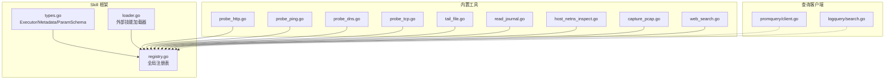
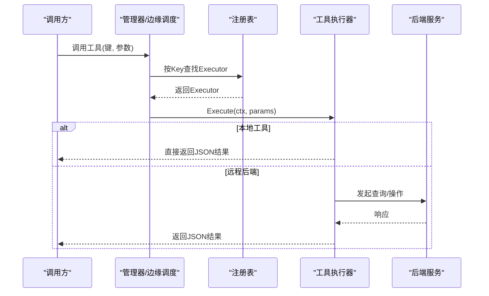
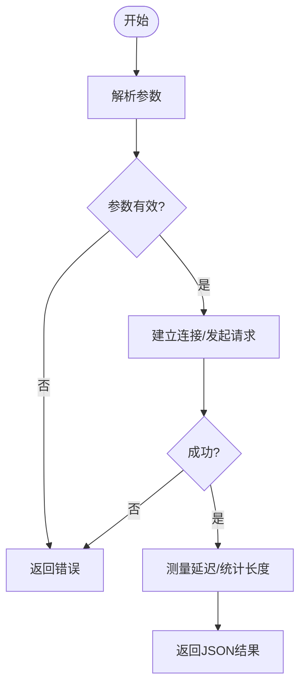
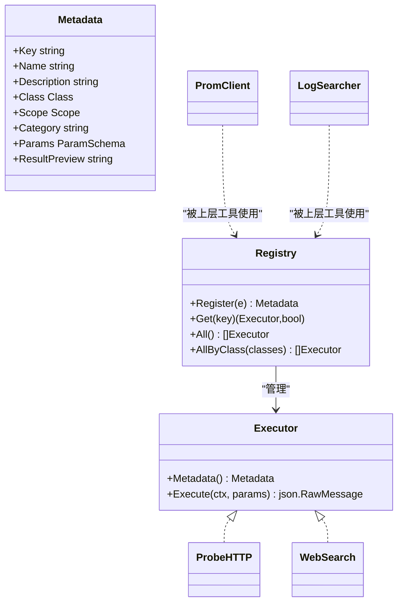

# 内置工具详解

<cite>
**本文引用的文件**
- [internal/skill/types.go](file://internal/skill/types.go)
- [internal/skill/registry.go](file://internal/skill/registry.go)
- [internal/skill/loader.go](file://internal/skill/loader.go)
- [internal/skill/builtin/probe_http.go](file://internal/skill/builtin/probe_http.go)
- [internal/skill/builtin/probe_ping.go](file://internal/skill/builtin/probe_ping.go)
- [internal/skill/builtin/probe_dns.go](file://internal/skill/builtin/probe_dns.go)
- [internal/skill/builtin/probe_tcp.go](file://internal/skill/builtin/probe_tcp.go)
- [internal/skill/builtin/tail_file.go](file://internal/skill/builtin/tail_file.go)
- [internal/skill/builtin/read_journal.go](file://internal/skill/builtin/read_journal.go)
- [internal/skill/builtin/host_netns_inspect.go](file://internal/skill/builtin/host_netns_inspect.go)
- [internal/skill/builtin/capture_pcap.go](file://internal/skill/builtin/capture_pcap.go)
- [internal/skill/builtin/web_search.go](file://internal/skill/builtin/web_search.go)
- [skills/bash/SKILL.md](file://skills/bash/SKILL.md)
- [internal/pkg/promquery/client.go](file://internal/pkg/promquery/client.go)
- [internal/pkg/logquery/search.go](file://internal/pkg/logquery/search.go)
</cite>

## 目录
1. [简介](#简介)
2. [项目结构](#项目结构)
3. [核心组件](#核心组件)
4. [架构总览](#架构总览)
5. [详细组件分析](#详细组件分析)
6. [依赖关系分析](#依赖关系分析)
7. [性能考量](#性能考量)
8. [故障排查指南](#故障排查指南)
9. [结论](#结论)
10. [附录](#附录)

## 简介
本文件系统化梳理并文档化 ongrid 的“内置工具”（Skill）体系，覆盖 Bash 工具、网络探测工具、日志与指标查询工具、抓包工具等。内容包含：
- 工具分类与组织方式（系统、网络、文件系统、Web 搜索、抓包等）
- 每个工具的参数定义、返回值格式与使用示例
- 调用流程、权限与安全边界（safe/mutating/dangerous；host/manager 执行范围）
- 最佳实践与性能优化建议
- 错误处理与异常场景说明

## 项目结构
内置工具基于统一的 Skill 框架实现：
- 元数据与执行器接口：统一描述工具能力、参数、权限类别与执行范围
- 全局注册表：集中管理所有已注册的工具
- 加载器：支持外部子进程工具包动态发现与注册
- 内置工具集合：网络探测、文件系统读取、Journald 读取、网络命名空间探查、抓包、联网搜索等
- 查询客户端：PromQL 查询客户端与 LogQL/结构化日志搜索抽象

**图示来源**
- [internal/skill/types.go:190-203](file://internal/skill/types.go#L190-L203)
- [internal/skill/registry.go:10-47](file://internal/skill/registry.go#L10-L47)
- [internal/skill/loader.go:13-67](file://internal/skill/loader.go#L13-L67)
- [internal/skill/builtin/probe_http.go:15-47](file://internal/skill/builtin/probe_http.go#L15-L47)
- [internal/skill/builtin/web_search.go:161-195](file://internal/skill/builtin/web_search.go#L161-L195)
- [internal/pkg/promquery/client.go:35-82](file://internal/pkg/promquery/client.go#L35-L82)
- [internal/pkg/logquery/search.go:138-152](file://internal/pkg/logquery/search.go#L138-L152)

**章节来源**
- [internal/skill/types.go:1-241](file://internal/skill/types.go#L1-L241)
- [internal/skill/registry.go:1-127](file://internal/skill/registry.go#L1-L127)
- [internal/skill/loader.go:1-274](file://internal/skill/loader.go#L1-L274)

## 核心组件
- 工具元数据与执行器
  - Executor：统一执行入口，接收 JSON 参数并返回 JSON 结果
  - Metadata：声明 Key、Name、Description、Class、Scope、Category、Params、ResultPreview
  - ParamSchema：参数类型、是否必填、默认值、枚举、数组元素类型
- 权限类别与作用域
  - Class：safe（只读）、mutating（可逆修改）、dangerous（不可逆/集群影响）
  - Scope：host（在边缘设备执行）、manager（在管理器进程内执行）
- 注册与发现
  - 全局注册表：线程安全，提供 Get/All/AllByClass
  - 外部技能加载器：扫描指定目录下的 skill.json，构建 SubprocessSkill 并注册

**章节来源**
- [internal/skill/types.go:35-125](file://internal/skill/types.go#L35-L125)
- [internal/skill/registry.go:10-47](file://internal/skill/registry.go#L10-L47)
- [internal/skill/loader.go:69-160](file://internal/skill/loader.go#L69-L160)

## 架构总览
Skill 框架将“工具能力”与“调度执行”解耦：
- 工具通过 init() 注册到全局注册表
- 管理器侧根据 Metadata 自动生成 LLM 工具描述、HTTP 路由与 UI 表单
- 边缘侧通过 execute_skill RPC 按 Key 分发到对应 Executor
- 查询类工具（PromQL/LogQL）以客户端形式被上层服务复用

**图示来源**
- [internal/skill/registry.go:35-47](file://internal/skill/registry.go#L35-L47)
- [internal/skill/types.go:190-203](file://internal/skill/types.go#L190-L203)
- [internal/pkg/promquery/client.go:93-117](file://internal/pkg/promquery/client.go#L93-L117)
- [internal/pkg/logquery/search.go:138-152](file://internal/pkg/logquery/search.go#L138-L152)

## 详细组件分析

### Bash 工具（host_bash）
- 作用：在目标设备上运行沙箱化的只读 shell 命令或管道，用于复杂诊断探索
- 权限类别：受 cmdpolicy 沙箱保护，v1 为只读策略，写操作一律拒绝
- 典型用法：ps/grep/awk/sed/journalctl/ip/iptables/systemctl status 等只读命令
- 限制：不支持重定向写入、嵌套子壳、危险二进制；网络出站默认拒绝，需白名单
- 输出：stdout/stderr 文本，受大小限制；超时控制

使用要点
- 明确仅做只读诊断；如需重启服务请使用专用 mutating 工具
- 被拒绝时阅读 reason 并调整命令重试
- 简单查询优先使用结构化工具，减少 token 消耗

**章节来源**
- [skills/bash/SKILL.md:1-188](file://skills/bash/SKILL.md#L1-L188)

### 网络探测工具
- HTTP 探测（host_probe_http）
  - 功能：对 URL 发起 HEAD/GET，返回状态码、延迟、内容长度
  - 参数：url（必填）、method（GET/HEAD，默认 HEAD）、timeout_ms（默认 5000）
  - 返回：status_code、latency_ms、content_length、error?
  - 注意：TLS 校验跳过，适合内部自签证书环境
- TCP 连通性探测（host_probe_tcp）
  - 功能：拨号目标 host:port，返回连通性与延迟
  - 参数：target（必填）、timeout_ms（默认 3000）
  - 返回：ok、latency_ms、error?
- DNS 解析（host_probe_dns）
  - 功能：系统解析 A/AAAA 记录
  - 参数：host（必填）、timeout_ms（默认 3000）
  - 返回：addrs[]、latency_ms、error?
- Ping 探测（host_probe_ping）
  - 功能：短时 ICMP ping，返回退出码、耗时、原始输出
  - 参数：host（必填）、count（默认 4，最大 10）、timeout_ms（默认 3000，最大 10000）
  - 返回：ok、exit_code、duration_ms、stdout、stderr、error?

**图示来源**
- [internal/skill/builtin/probe_http.go:62-119](file://internal/skill/builtin/probe_http.go#L62-L119)
- [internal/skill/builtin/probe_tcp.go:52-82](file://internal/skill/builtin/probe_tcp.go#L52-L82)
- [internal/skill/builtin/probe_dns.go:52-84](file://internal/skill/builtin/probe_dns.go#L52-L84)
- [internal/skill/builtin/probe_ping.go:60-99](file://internal/skill/builtin/probe_ping.go#L60-L99)

**章节来源**
- [internal/skill/builtin/probe_http.go:15-119](file://internal/skill/builtin/probe_http.go#L15-L119)
- [internal/skill/builtin/probe_tcp.go:13-83](file://internal/skill/builtin/probe_tcp.go#L13-L83)
- [internal/skill/builtin/probe_dns.go:13-85](file://internal/skill/builtin/probe_dns.go#L13-L85)
- [internal/skill/builtin/probe_ping.go:14-125](file://internal/skill/builtin/probe_ping.go#L14-L125)

### 文件系统工具
- 文件尾部读取（host_tail_file）
  - 功能：类似 tail -n，读取文件最后 N 行
  - 参数：path（绝对路径，必填）、lines（默认 100）、max_bytes（默认 1MiB）
  - 返回：lines[]、total_lines_returned、file_size、truncated、error?
  - 安全：禁止相对路径与 .. 穿越
- Journald 日志读取（host_read_journal）
  - 功能：包装 journalctl 读取 systemd-journald 日志（仅 Linux）
  - 参数：unit（可选）、since（默认 10m）、lines（默认 200）
  - 返回：lines[]、total_lines、command、error?
  - 超时：硬限制 30s，防止挂起

**章节来源**
- [internal/skill/builtin/tail_file.go:15-133](file://internal/skill/builtin/tail_file.go#L15-L133)
- [internal/skill/builtin/read_journal.go:16-112](file://internal/skill/builtin/read_journal.go#L16-L112)

### 网络命名空间探查（host_netns_inspect）
- 功能：列出 /var/run/netns 下的 network namespace，并对每个 ns 报告 IP 地址、路由、接口状态
- 参数：namespace（可选，精确匹配）、include_routes（默认 true）、include_links（默认 false）
- 返回：namespaces[{name, addrs[], routes[], links?, error?}]
- 安全：严格校验 namespace 名称，避免注入；非 Linux 返回结构化错误

**章节来源**
- [internal/skill/builtin/host_netns_inspect.go:48-205](file://internal/skill/builtin/host_netns_inspect.go#L48-L205)

### 抓包工具（capture_pcap / get_packet_capture）
- capture_pcap
  - 作用：在 Linux Edge 上启动有界抓包任务，返回任务 ID
  - 参数：interface（必填）、filter（可选）、duration_seconds（默认 30，最大 300）、max_bytes（默认 64MiB，最大 256MiB）、max_packets（默认 100k，最大 500k）、snaplen（默认 1514，最大 65535）、promiscuous（默认 false）
  - 权限：mutating，需在边缘执行
- get_packet_capture
  - 作用：查询抓包任务状态、停止原因、文件大小、错误详情
  - 参数：capture_id（必填）
  - 权限：safe，需在边缘执行

**章节来源**
- [internal/skill/builtin/capture_pcap.go:11-73](file://internal/skill/builtin/capture_pcap.go#L11-L73)

### 联网搜索（web_search）
- 作用：聚合多个搜索引擎（SearXNG/Tavily/Brave），返回标题、URL、摘要，部分 provider 返回 AI 答案
- 参数：query（必填）、max_results（默认 5，上限 10）、include_domains/exclude_domains（Tavily 支持）、provider（空=走系统设置）
- 行为：
  - 未配置 key 或不可达时返回 skipped_reason 而非错误，便于 LLM 提示用户修复
  - 默认 provider 为 SearXNG；可通过设置切换
- 返回：provider、results[]、answer?、skipped_reason?

**章节来源**
- [internal/skill/builtin/web_search.go:161-283](file://internal/skill/builtin/web_search.go#L161-L283)

### PromQL 查询工具
- 客户端能力
  - Query：瞬时查询，返回 resultType 与 result（原始 JSON）
  - QueryRange：区间查询，支持 step
- 超时与限流
  - 默认单次查询超时 30s
  - 响应体限制 8MiB，防止过大响应
- 错误处理
  - 非 2xx 且非 400 视为传输/服务器失败
  - 400 会解码 errorType/error 以便上层展示

**章节来源**
- [internal/pkg/promquery/client.go:93-167](file://internal/pkg/promquery/client.go#L93-L167)

### LogQL/结构化日志查询工具
- 抽象接口 Searcher
  - Search/Count/Fields/FieldValues/Histogram
  - 支持分页 cursor、方向排序、关键词匹配模式
- 约束与校验
  - 时间窗口最大 30 天
  - limit 默认 200，最大 1000
  - group_by 最多 5 个字段，限定允许字段集
  - 过滤字段白名单与长度限制
- 结果模型
  - Record：id、timestamp、message、severity、trace/span id、attributes 等
  - SearchResult：records[]、next_cursor、has_more、took_ms、backends[]

**章节来源**
- [internal/pkg/logquery/search.go:13-152](file://internal/pkg/logquery/search.go#L13-L152)
- [internal/pkg/logquery/search.go:257-338](file://internal/pkg/logquery/search.go#L257-L338)
- [internal/pkg/logquery/search.go:368-420](file://internal/pkg/logquery/search.go#L368-L420)

## 依赖关系分析
- 工具与框架
  - 所有内置工具通过 init() 调用 Register 加入全局注册表
  - 注册表提供按 Key 查找、按类别筛选、全量列举
- 工具与后端
  - 网络探测工具依赖系统网络栈或外部主机
  - web_search 依赖 SearXNG/Tavily/Brave 的 HTTP API
  - PromQL/LogQL 工具依赖 Prometheus/Loki/Elasticsearch 等后端
- 安全与权限
  - Class 决定调用审批策略（safe/mutating/dangerous）
  - Scope 决定执行位置（host/manager）
  - Bash 工具受 cmdpolicy 沙箱保护

**图示来源**
- [internal/skill/types.go:99-203](file://internal/skill/types.go#L99-L203)
- [internal/skill/registry.go:21-47](file://internal/skill/registry.go#L21-L47)
- [internal/skill/builtin/probe_http.go:15-47](file://internal/skill/builtin/probe_http.go#L15-L47)
- [internal/skill/builtin/web_search.go:161-195](file://internal/skill/builtin/web_search.go#L161-L195)
- [internal/pkg/promquery/client.go:35-82](file://internal/pkg/promquery/client.go#L35-L82)
- [internal/pkg/logquery/search.go:138-152](file://internal/pkg/logquery/search.go#L138-L152)

**章节来源**
- [internal/skill/types.go:99-203](file://internal/skill/types.go#L99-L203)
- [internal/skill/registry.go:21-47](file://internal/skill/registry.go#L21-L47)

## 性能考量
- 超时与限流
  - PromQL 单次查询默认 30s，响应体限制 8MiB
  - ReadJournal 硬限制 30s，防止阻塞调度器
  - TailFile 限制 max_bytes，避免大文件内存占用
- 资源保护
  - Ping 探测限制 count 与 timeout，避免风暴
  - Netns 探查限制 include_links 默认关闭，减少大数据量
  - web_search 限制 max_results，避免过多结果
- 并发与缓存
  - 注册表读写分离（RWMutex）
  - web_search 配置解析器可缓存，降低配置读取开销
- 建议
  - 合理设置超时与限制，避免长尾请求拖垮系统
  - 批量查询时分页与游标，避免一次性拉取大量数据
  - 对频繁调用的工具启用结果缓存（如配置、DNS 解析）

[本节为通用指导，不直接分析具体文件]

## 故障排查指南
- Bash 工具被拒绝
  - 现象：response.allowed=false
  - 处理：查看 reason，调整命令（避免写操作、危险二进制、重定向等）
- 网络探测失败
  - 现象：error 字段填充，latency 可能为 0 或非 0
  - 处理：检查目标可达性、防火墙、DNS、TLS 配置
- 抓包任务
  - 现象：get_packet_capture 返回 state 与 error
  - 处理：确认 interface、权限（CAP_NET_ADMIN）、磁盘空间与过滤器语法
- 联网搜索
  - 现象：skipped_reason 提示未配置或未可达
  - 处理：在设置中配置 provider 与 key，或确保 SearXNG 服务可用
- PromQL/LogQL
  - 现象：非 2xx 或 errorType 提示
  - 处理：检查后端可用性、查询语法、时间窗口与 limit

**章节来源**
- [skills/bash/SKILL.md:111-188](file://skills/bash/SKILL.md#L111-L188)
- [internal/skill/builtin/web_search.go:225-283](file://internal/skill/builtin/web_search.go#L225-L283)
- [internal/pkg/promquery/client.go:119-167](file://internal/pkg/promquery/client.go#L119-L167)
- [internal/pkg/logquery/search.go:257-338](file://internal/pkg/logquery/search.go#L257-L338)

## 结论
ongrid 的内置工具以 Skill 框架为核心，提供了统一、安全、可扩展的工具能力：
- 清晰的权限类别与作用域，保障安全与合规
- 丰富的内置工具覆盖网络、文件、日志、抓包与联网搜索
- 查询客户端标准化 PromQL/LogQL 访问，便于上层集成
- 完善的错误处理与性能保护机制，提升稳定性与可观测性

建议在实际使用中遵循只读优先、最小权限、合理超时与限流的最佳实践，并结合业务场景选择合适的工具组合。

[本节为总结性内容，不直接分析具体文件]

## 附录
- 工具分类速查
  - 系统工具：Bash（只读沙箱）、Journald 读取
  - 网络工具：HTTP/TCP/DNS/Ping 探测、网络命名空间探查、抓包
  - 数据库/指标工具：PromQL 查询
  - 日志工具：LogQL/结构化日志搜索
  - Web 工具：联网搜索（多 provider）
- 调用最佳实践
  - 优先使用结构化工具，减少 token 与复杂度
  - 对敏感操作选择合适 Class，必要时走审批流程
  - 合理设置超时与限制，避免资源耗尽
  - 关注 skipped_reason 与 error 字段，快速定位问题

[本节为补充信息，不直接分析具体文件]