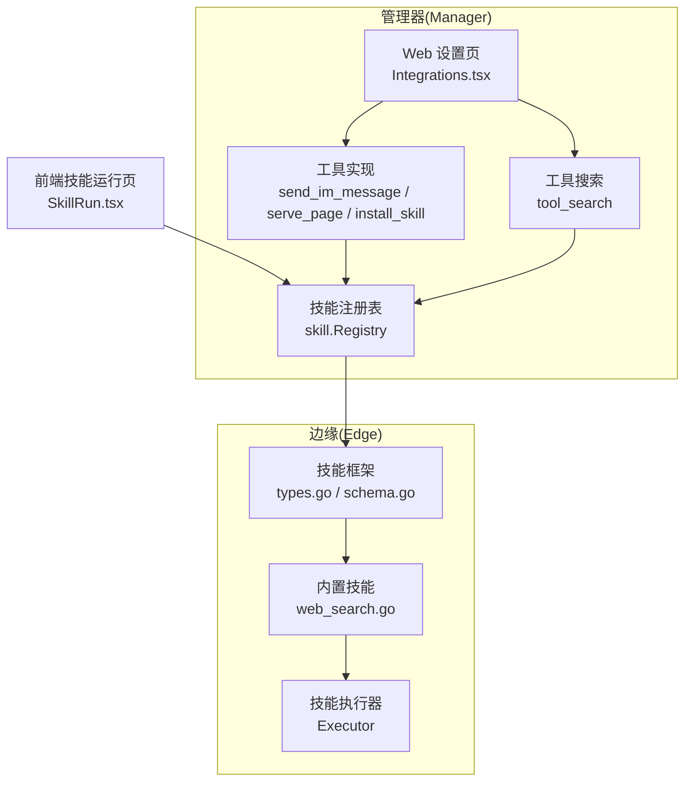
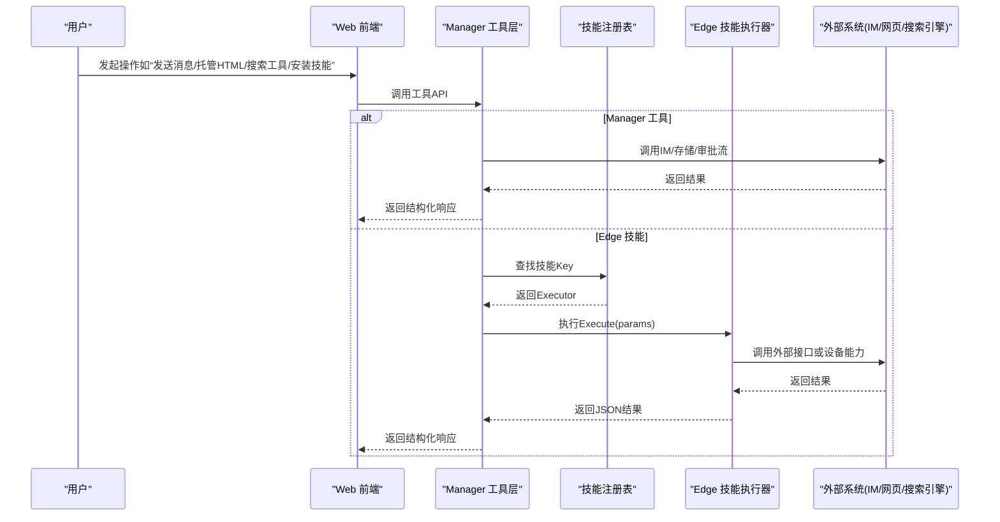
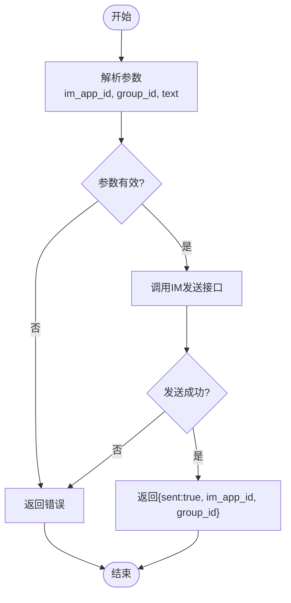
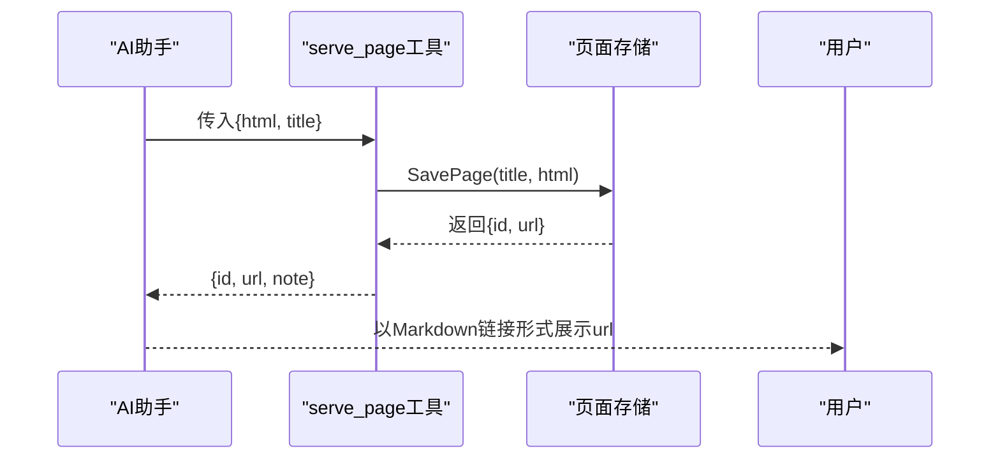
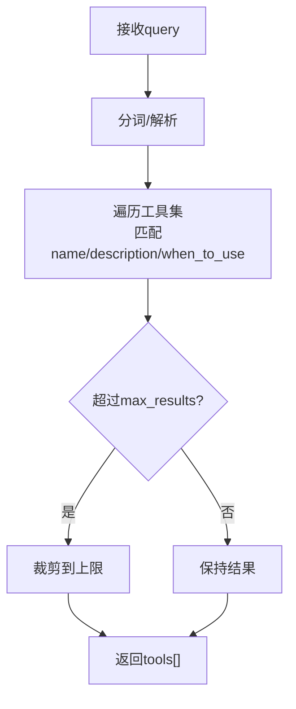
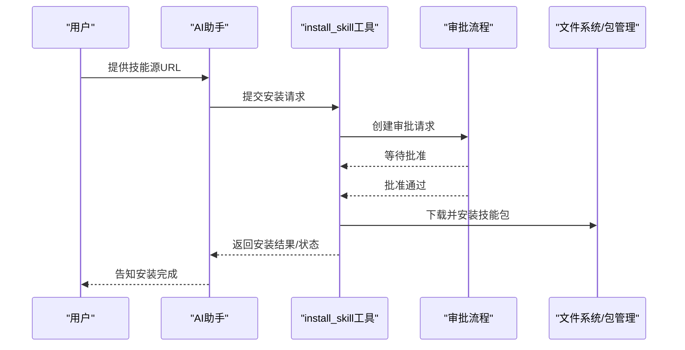
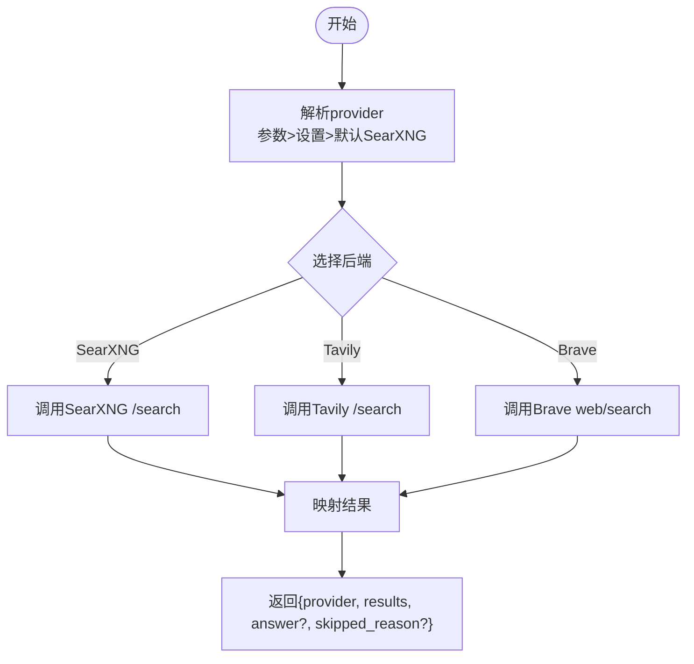
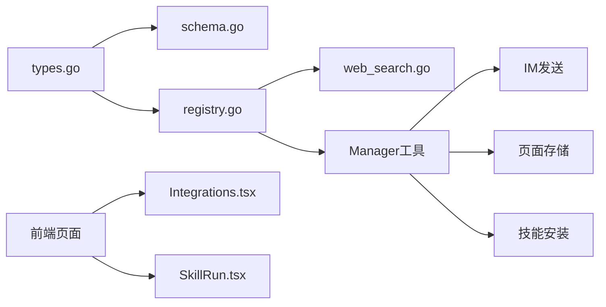

# 实用工具

<cite>
**本文引用的文件**
- [internal/skill/types.go](file://internal/skill/types.go)
- [internal/skill/schema.go](file://internal/skill/schema.go)
- [internal/skill/registry.go](file://internal/skill/registry.go)
- [internal/skill/builtin/web_search.go](file://internal/skill/builtin/web_search.go)
- [internal/manager/biz/aiops/tools/send_im_message_basetool.go](file://internal/manager/biz/aiops/tools/send_im_message_basetool.go)
- [internal/manager/biz/aiops/tools/serve_page_basetool.go](file://internal/manager/biz/aiops/tools/serve_page_basetool.go)
- [internal/manager/biz/aiops/tools/install_skill_basetool.go](file://internal/manager/biz/aiops/tools/install_skill_basetool.go)
- [web/src/pages/settings/Integrations.tsx](file://web/src/pages/settings/Integrations.tsx)
- [web/src/pages/SkillRun.tsx](file://web/src/pages/SkillRun.tsx)
</cite>

## 目录
1. [简介](#简介)
2. [项目结构](#项目结构)
3. [核心组件](#核心组件)
4. [架构总览](#架构总览)
5. [详细组件分析](#详细组件分析)
6. [依赖关系分析](#依赖关系分析)
7. [性能与可靠性](#性能与可靠性)
8. [故障排查指南](#故障排查指南)
9. [结论](#结论)
10. [附录：参数与返回值速查](#附录参数与返回值速查)

## 简介
本章节面向“实用辅助工具”的使用与集成，覆盖以下能力：
- 即时消息发送工具：通过已配置的 IM 应用向指定群组发送消息。
- 页面服务工具：将 AI 生成的 HTML 托管为内部可访问的产物链接。
- 工具搜索工具：在对话中按关键词匹配可用工具（名称、描述、WhenToUse），帮助自动选择合适工具。
- 技能安装工具：从用户提供的源地址安装技能包，并进入人工审批流程。
- 联网搜索工具：支持 SearXNG/Tavily/Brave 三种后端，统一返回结果结构。

这些工具既可作为 LLM 可调用的函数式工具，也可作为边缘侧“技能”被调度执行；Manager 端负责编排、权限控制与审计，Edge 端负责设备直连能力。

## 项目结构
围绕“工具/技能”的核心代码分布在 Manager 与 Edge 两侧：
- Manager 侧提供工具实现、注册、路由与 UI 配置入口。
- Edge 侧提供技能框架、注册表与执行器，统一以“execute_skill”分发。
- Web 前端提供设置页与技能运行页，便于运维人员配置与调试。

图表来源
- [internal/skill/registry.go:1-126](file://internal/skill/registry.go#L1-L126)
- [internal/skill/types.go:1-241](file://internal/skill/types.go#L1-L241)
- [internal/skill/builtin/web_search.go:1-593](file://internal/skill/builtin/web_search.go#L1-L593)
- [internal/manager/biz/aiops/tools/send_im_message_basetool.go:1-202](file://internal/manager/biz/aiops/tools/send_im_message_basetool.go#L1-L202)
- [internal/manager/biz/aiops/tools/serve_page_basetool.go:1-101](file://internal/manager/biz/aiops/tools/serve_page_basetool.go#L1-L101)
- [web/src/pages/settings/Integrations.tsx:1837-1962](file://web/src/pages/settings/Integrations.tsx#L1837-L1962)
- [web/src/pages/SkillRun.tsx:44-89](file://web/src/pages/SkillRun.tsx#L44-L89)

章节来源
- [internal/skill/registry.go:1-126](file://internal/skill/registry.go#L1-L126)
- [internal/skill/types.go:1-241](file://internal/skill/types.go#L1-L241)
- [web/src/pages/settings/Integrations.tsx:1837-1962](file://web/src/pages/settings/Integrations.tsx#L1837-L1962)
- [web/src/pages/SkillRun.tsx:44-89](file://web/src/pages/SkillRun.tsx#L44-L89)

## 核心组件
- 技能框架与元数据
  - 定义技能的权限等级（safe/mutating/dangerous）、作用域（host/manager）、参数 Schema、分类等。
  - 提供 JSON Schema 构建器，兼容 LLM 函数调用格式。
- 技能注册表
  - 进程级全局注册表，维护所有已注册技能，支持按类过滤、排序枚举。
- 内置联网搜索技能
  - 统一封装 SearXNG/Tavily/Brave 三种后端，输出标准化结果。
- Manager 工具
  - send_im_message：向 IM 群组发消息。
  - serve_page：托管 HTML 产物并返回内网访问路径。
  - install_skill：安装用户提供的技能源，进入人工审批。
  - tool_search：根据关键词匹配可用工具（名称、描述、WhenToUse）。

章节来源
- [internal/skill/types.go:1-241](file://internal/skill/types.go#L1-L241)
- [internal/skill/schema.go:1-96](file://internal/skill/schema.go#L1-L96)
- [internal/skill/registry.go:1-126](file://internal/skill/registry.go#L1-L126)
- [internal/skill/builtin/web_search.go:161-194](file://internal/skill/builtin/web_search.go#L161-L194)
- [internal/manager/biz/aiops/tools/send_im_message_basetool.go:1-202](file://internal/manager/biz/aiops/tools/send_im_message_basetool.go#L1-L202)
- [internal/manager/biz/aiops/tools/serve_page_basetool.go:1-101](file://internal/manager/biz/aiops/tools/serve_page_basetool.go#L1-L101)
- [internal/manager/biz/aiops/tools/install_skill_basetool.go:71-89](file://internal/manager/biz/aiops/tools/install_skill_basetool.go#L71-L89)

## 架构总览
下图展示“工具/技能”在系统中的交互：前端触发、Manager 工具或 Edge 技能执行、外部系统调用与结果回传。

图表来源
- [internal/skill/registry.go:1-126](file://internal/skill/registry.go#L1-L126)
- [internal/skill/types.go:1-241](file://internal/skill/types.go#L1-L241)
- [internal/skill/builtin/web_search.go:225-283](file://internal/skill/builtin/web_search.go#L225-L283)
- [internal/manager/biz/aiops/tools/send_im_message_basetool.go:136-158](file://internal/manager/biz/aiops/tools/send_im_message_basetool.go#L136-L158)
- [internal/manager/biz/aiops/tools/serve_page_basetool.go:69-100](file://internal/manager/biz/aiops/tools/serve_page_basetool.go#L69-L100)

## 详细组件分析

### 即时消息发送工具（send_im_message）
- 功能：通过已配置的双向 IM 应用向指定群组发送消息。
- 适用场景：告警通知、诊断结论推送、跨团队协作提醒。
- 参数定义
  - im_app_id：整数，必填。来自“设置→IM”的配置 ID。
  - group_id：字符串，必填。平台群/会话标识（如飞书 open_chat_id、Telegram chat_id、Slack channel ID）。
  - text：字符串，必填。消息正文，Markdown 支持取决于所选 IM 提供商。
- 返回值
  - sent：布尔，表示是否成功发送。
  - im_app_id：整数，实际使用的 IM 应用 ID。
  - group_id：字符串，目标群组 ID。
- 使用示例（概念性）
  - 用户在对话中要求“把诊断结论发到运维群”，AI 提取 IM 应用 ID 与群组 ID，调用该工具发送消息。
- 错误处理
  - 参数缺失或为空时返回错误。
  - 发送失败时返回包含目标群组信息的错误。

图表来源
- [internal/manager/biz/aiops/tools/send_im_message_basetool.go:107-158](file://internal/manager/biz/aiops/tools/send_im_message_basetool.go#L107-L158)

章节来源
- [internal/manager/biz/aiops/tools/send_im_message_basetool.go:1-202](file://internal/manager/biz/aiops/tools/send_im_message_basetool.go#L1-L202)

### 页面服务工具（serve_page）
- 功能：将 AI 生成的 HTML 托管为内部可访问的产物链接，便于分享与查看。
- 适用场景：巡检报告、临时状态面板、诊断结果可视化。
- 参数定义
  - html：字符串，必填。完整 HTML 文档字符串（自带 <html><body>…），会原样托管。
  - title：字符串，可选。用于页面列表展示。
- 返回值
  - id：字符串，托管页面的唯一标识。
  - url：字符串，内网访问路径（如 /pages/<id>），需登录访问。
  - note：提示文本，建议以 Markdown 链接形式呈现给用户。
- 使用示例（概念性）
  - 用户要求“生成一份负载报告网页”，AI 构造 HTML 后调用该工具，返回 URL 供用户点击查看。
- 错误处理
  - 未传入 HTML 或存储未接入时会返回错误。

图表来源
- [internal/manager/biz/aiops/tools/serve_page_basetool.go:39-100](file://internal/manager/biz/aiops/tools/serve_page_basetool.go#L39-L100)

章节来源
- [internal/manager/biz/aiops/tools/serve_page_basetool.go:1-101](file://internal/manager/biz/aiops/tools/serve_page_basetool.go#L1-L101)

### 工具搜索工具（tool_search）
- 功能：根据用户查询关键词，在可用工具集合中检索匹配项（基于工具名、描述、WhenToUse）。
- 适用场景：当用户意图不明确时，先搜索推荐工具，再决定下一步调用。
- 参数定义
  - query：字符串，必填。自然语言或关键词。
  - max_results：整数，可选。默认值受限制，上限有保护。
- 返回值
  - tools：数组，每项包含工具名、描述、必要参数等信息，供上层进一步调用。
- 行为特性
  - 多词查询要求全部 token 匹配，避免过于宽泛的结果。
  - WhenToUse 字段参与匹配，提高语义相关性。
- 使用示例（概念性）
  - 用户输入“查找大文件”，工具搜索返回 host_find_large_files 等候选工具。

图表来源
- [internal/manager/biz/aiops/tools/tool_search_tool_test.go:117-293](file://internal/manager/biz/aiops/tools/tool_search_tool_test.go#L117-L293)

章节来源
- [internal/manager/biz/aiops/tools/tool_search_tool_test.go:117-293](file://internal/manager/biz/aiops/tools/tool_search_tool_test.go#L117-L293)

### 技能安装工具（install_skill）
- 功能：从用户提供的源地址安装技能包（git 仓库、tarball、skills.sh 链接），进入人工审批流程。
- 适用场景：用户希望快速引入第三方或自定义技能，无需手动部署。
- 参数定义
  - source_url：字符串，必填。技能源地址。
  - type：字符串，可选。类型推断（git/tarball/skills.sh），可留空由工具自动判断。
- 返回值
  - 通常返回任务 ID 或审批请求信息，等待人工批准后才真正下载安装。
- 安全策略
  - 属于高危操作，每次调用都会弹出确认卡片，用户当场批准后才执行。
  - 不引导用户跳转页面，审批在对话内完成。

图表来源
- [internal/manager/biz/aiops/tools/install_skill_basetool.go:71-89](file://internal/manager/biz/aiops/tools/install_skill_basetool.go#L71-L89)

章节来源
- [internal/manager/biz/aiops/tools/install_skill_basetool.go:71-89](file://internal/manager/biz/aiops/tools/install_skill_basetool.go#L71-L89)

### 联网搜索技能（web_search）
- 功能：搜索公开网络，返回标题、URL、摘要等结果；部分 provider 支持自动生成答案。
- 支持后端
  - SearXNG：自托管聚合搜索，零 key 零额度。
  - Tavily：需要 API Key，支持 answer 字段。
  - Brave Search：需要 API Key，纯结果链接。
- 参数定义
  - query：字符串，必填。搜索关键词。
  - max_results：整数，可选。默认值，范围受限。
  - include_domains：字符串，可选。限定域名（仅 Tavily 支持）。
  - exclude_domains：字符串，可选。排除域名（仅 Tavily 支持）。
  - provider：枚举，可选。强制指定后端；留空走系统设置。
- 返回值
  - provider：字符串，实际使用的后端。
  - results：数组，每项包含 title、url、snippet、published_date。
  - answer：字符串，可选，Tavily 可能返回。
  - skipped_reason：字符串，可选，当无法运行时给出原因（如不可达或未配置 key）。
- 配置方式
  - 在“设置→集成→联网搜索”中选择 provider 并填写相应密钥或地址。
  - 默认使用 SearXNG；若不可达会返回 skipped_reason 提示。

图表来源
- [internal/skill/builtin/web_search.go:161-194](file://internal/skill/builtin/web_search.go#L161-L194)
- [internal/skill/builtin/web_search.go:225-283](file://internal/skill/builtin/web_search.go#L225-L283)
- [internal/skill/builtin/web_search.go:285-374](file://internal/skill/builtin/web_search.go#L285-L374)
- [internal/skill/builtin/web_search.go:389-455](file://internal/skill/builtin/web_search.go#L389-L455)
- [internal/skill/builtin/web_search.go:480-543](file://internal/skill/builtin/web_search.go#L480-L543)

章节来源
- [internal/skill/builtin/web_search.go:1-593](file://internal/skill/builtin/web_search.go#L1-L593)
- [web/src/pages/settings/Integrations.tsx:1837-1962](file://web/src/pages/settings/Integrations.tsx#L1837-L1962)

## 依赖关系分析
- 技能框架依赖
  - types.go：定义 Metadata、ParamSchema、Executor 等基础类型。
  - schema.go：将 ParamSchema 转换为 JSON Schema，供 LLM 工具调用。
  - registry.go：全局注册表，维护 Executor 集合并提供 All/AllByClass/Get。
- 内置技能依赖
  - web_search.go：依赖 HTTP 客户端与配置解析器，支持多后端切换。
- Manager 工具依赖
  - send_im_message_basetool.go：依赖 IM 消息发送接口。
  - serve_page_basetool.go：依赖页面存储接口。
  - install_skill_basetool.go：依赖审批流程与文件系统/包管理。
- 前端依赖
  - Integrations.tsx：提供联网搜索配置界面。
  - SkillRun.tsx：提供技能运行界面，动态渲染参数表单。

图表来源
- [internal/skill/types.go:1-241](file://internal/skill/types.go#L1-L241)
- [internal/skill/schema.go:1-96](file://internal/skill/schema.go#L1-L96)
- [internal/skill/registry.go:1-126](file://internal/skill/registry.go#L1-L126)
- [internal/skill/builtin/web_search.go:1-593](file://internal/skill/builtin/web_search.go#L1-L593)
- [internal/manager/biz/aiops/tools/send_im_message_basetool.go:1-202](file://internal/manager/biz/aiops/tools/send_im_message_basetool.go#L1-L202)
- [internal/manager/biz/aiops/tools/serve_page_basetool.go:1-101](file://internal/manager/biz/aiops/tools/serve_page_basetool.go#L1-L101)
- [internal/manager/biz/aiops/tools/install_skill_basetool.go:71-89](file://internal/manager/biz/aiops/tools/install_skill_basetool.go#L71-L89)
- [web/src/pages/settings/Integrations.tsx:1837-1962](file://web/src/pages/settings/Integrations.tsx#L1837-L1962)
- [web/src/pages/SkillRun.tsx:44-89](file://web/src/pages/SkillRun.tsx#L44-L89)

章节来源
- [internal/skill/types.go:1-241](file://internal/skill/types.go#L1-L241)
- [internal/skill/schema.go:1-96](file://internal/skill/schema.go#L1-L96)
- [internal/skill/registry.go:1-126](file://internal/skill/registry.go#L1-L126)
- [internal/skill/builtin/web_search.go:1-593](file://internal/skill/builtin/web_search.go#L1-L593)
- [internal/manager/biz/aiops/tools/send_im_message_basetool.go:1-202](file://internal/manager/biz/aiops/tools/send_im_message_basetool.go#L1-L202)
- [internal/manager/biz/aiops/tools/serve_page_basetool.go:1-101](file://internal/manager/biz/aiops/tools/serve_page_basetool.go#L1-L101)
- [internal/manager/biz/aiops/tools/install_skill_basetool.go:71-89](file://internal/manager/biz/aiops/tools/install_skill_basetool.go#L71-L89)
- [web/src/pages/settings/Integrations.tsx:1837-1962](file://web/src/pages/settings/Integrations.tsx#L1837-L1962)
- [web/src/pages/SkillRun.tsx:44-89](file://web/src/pages/SkillRun.tsx#L44-L89)

## 性能与可靠性
- 并发与注册
  - 技能注册表使用读写锁保护，注册阶段单线程，读取阶段并发安全。
- 超时与限流
  - 联网搜索默认 HTTP 客户端超时为 30 秒；响应体读取限制大小，防止内存膨胀。
- 容错与降级
  - 当 SearXNG 不可达或返回非 2xx，返回 skipped_reason 而非直接报错，便于上层提示修复。
  - 当 Tavily/Brave 未配置 key，返回 skipped_reason 指引配置。
- 参数校验
  - 参数 Schema 在注册时验证，执行前进行基本合法性检查，减少无效调用。

[本节为通用指导，不直接分析具体文件]

## 故障排查指南
- 联网搜索无结果或报错
  - 检查“设置→集成→联网搜索”是否正确配置 provider 与 key。
  - 若使用 SearXNG，确认 docker-compose 已启动 searxng 服务。
  - 关注返回中的 skipped_reason，按提示修复。
- 发送 IM 消息失败
  - 确认 im_app_id 与 group_id 正确且对应平台有效。
  - 检查 IM 应用配置与权限。
- 托管页面无法访问
  - 确认页面存储已接入，返回的 url 为内网路径，需登录访问。
  - 如需对外分享，请在“产物”页面使用分享按钮生成公开链接。
- 技能安装未生效
  - 确认审批流程已通过。
  - 检查技能源地址是否有效，权限是否足够。

章节来源
- [internal/skill/builtin/web_search.go:285-374](file://internal/skill/builtin/web_search.go#L285-L374)
- [internal/skill/builtin/web_search.go:389-455](file://internal/skill/builtin/web_search.go#L389-L455)
- [internal/skill/builtin/web_search.go:480-543](file://internal/skill/builtin/web_search.go#L480-L543)
- [internal/manager/biz/aiops/tools/send_im_message_basetool.go:136-158](file://internal/manager/biz/aiops/tools/send_im_message_basetool.go#L136-L158)
- [internal/manager/biz/aiops/tools/serve_page_basetool.go:69-100](file://internal/manager/biz/aiops/tools/serve_page_basetool.go#L69-L100)
- [internal/manager/biz/aiops/tools/install_skill_basetool.go:71-89](file://internal/manager/biz/aiops/tools/install_skill_basetool.go#L71-L89)

## 结论
本套实用工具覆盖了即时消息、页面托管、工具搜索、技能安装与联网搜索等常见运维与协作场景。通过统一的技能框架与工具抽象，系统在权限控制、参数校验、错误处理与用户体验方面具备良好的一致性与可扩展性。建议在实际使用中：
- 优先使用内置技能与工具，减少重复开发。
- 合理配置 provider 与权限，确保稳定与安全。
- 利用工具搜索提升意图识别准确率，降低误调风险。
- 对高危操作（如技能安装）务必遵循审批流程。

[本节为总结，不直接分析具体文件]

## 附录：参数与返回值速查
- send_im_message
  - 参数：im_app_id（整数，必填）、group_id（字符串，必填）、text（字符串，必填）
  - 返回：sent（布尔）、im_app_id（整数）、group_id（字符串）
- serve_page
  - 参数：html（字符串，必填）、title（字符串，可选）
  - 返回：id（字符串）、url（字符串）、note（字符串）
- tool_search
  - 参数：query（字符串，必填）、max_results（整数，可选）
  - 返回：tools（数组）
- install_skill
  - 参数：source_url（字符串，必填）、type（字符串，可选）
  - 返回：审批状态或任务信息
- web_search
  - 参数：query（字符串，必填）、max_results（整数，可选）、include_domains（字符串，可选）、exclude_domains（字符串，可选）、provider（枚举，可选）
  - 返回：provider（字符串）、results（数组）、answer（字符串，可选）、skipped_reason（字符串，可选）

章节来源
- [internal/manager/biz/aiops/tools/send_im_message_basetool.go:107-158](file://internal/manager/biz/aiops/tools/send_im_message_basetool.go#L107-L158)
- [internal/manager/biz/aiops/tools/serve_page_basetool.go:39-100](file://internal/manager/biz/aiops/tools/serve_page_basetool.go#L39-L100)
- [internal/manager/biz/aiops/tools/tool_search_tool_test.go:117-293](file://internal/manager/biz/aiops/tools/tool_search_tool_test.go#L117-L293)
- [internal/manager/biz/aiops/tools/install_skill_basetool.go:71-89](file://internal/manager/biz/aiops/tools/install_skill_basetool.go#L71-L89)
- [internal/skill/builtin/web_search.go:161-194](file://internal/skill/builtin/web_search.go#L161-L194)
- [internal/skill/builtin/web_search.go:225-283](file://internal/skill/builtin/web_search.go#L225-L283)