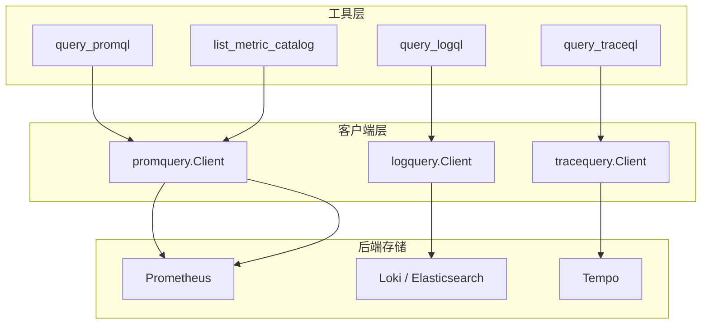
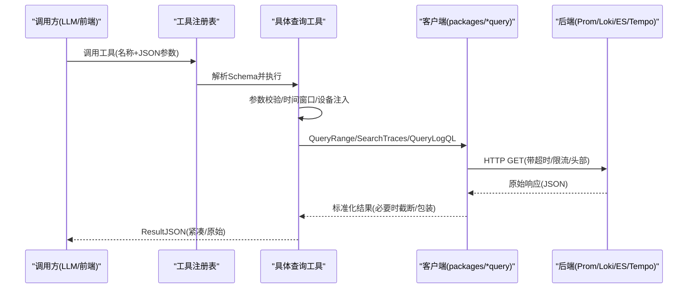
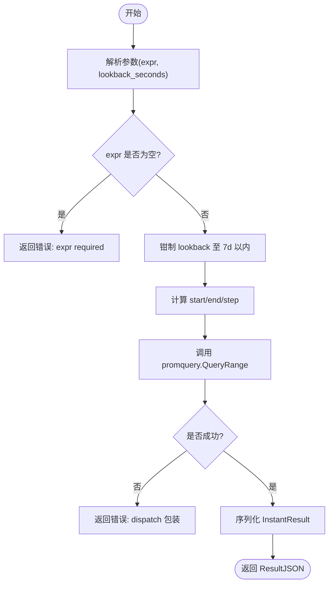
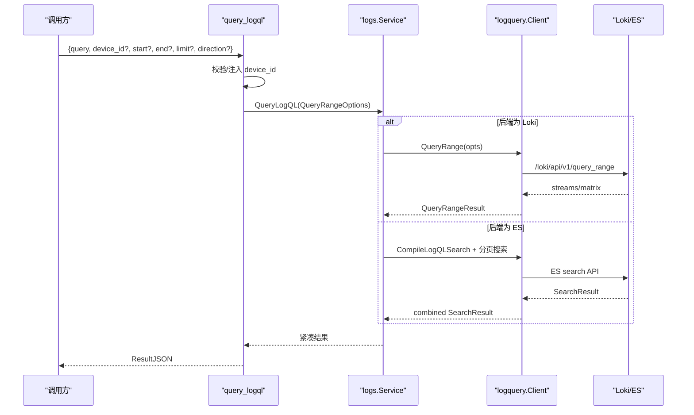
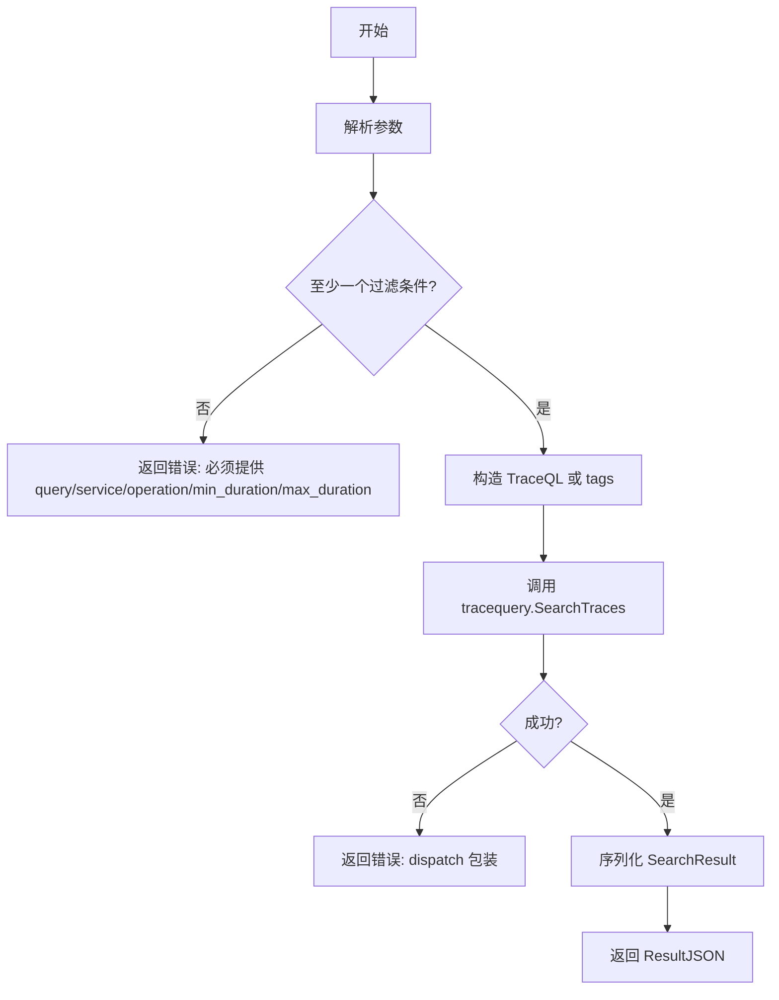
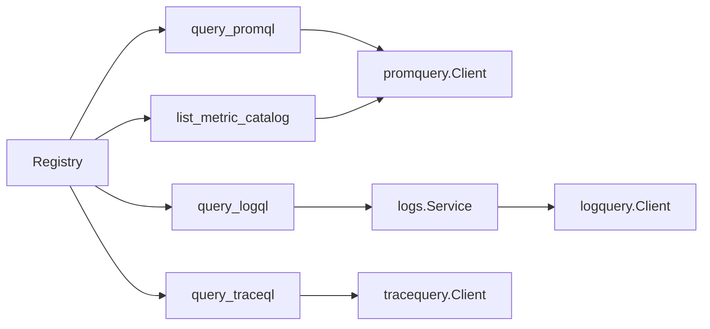

# 监控查询工具

<cite>
**本文引用的文件**
- [README.md](file://README.md)
- [internal/pkg/promquery/client.go](file://internal/pkg/promquery/client.go)
- [internal/pkg/logquery/client.go](file://internal/pkg/logquery/client.go)
- [internal/pkg/tracequery/client.go](file://internal/pkg/tracequery/client.go)
- [internal/manager/biz/aiops/tools/query_promql.go](file://internal/manager/biz/aiops/tools/query_promql.go)
- [internal/manager/biz/aiops/tools/query_logql.go](file://internal/manager/biz/aiops/tools/query_logql.go)
- [internal/manager/biz/aiops/tools/query_traceql.go](file://internal/manager/biz/aiops/tools/query_traceql.go)
- [internal/manager/biz/aiops/tools/metric_catalog_tool.go](file://internal/manager/biz/aiops/tools/metric_catalog_tool.go)
- [internal/manager/biz/aiops/tools/registry.go](file://internal/manager/biz/aiops/tools/registry.go)
- [internal/manager/biz/logs/query_logql.go](file://internal/manager/biz/logs/query_logql.go)
- [internal/manager/biz/knowledge/builtin_vault/systems/observability-stack/tempo.md](file://internal/manager/biz/knowledge/builtin_vault/systems/observability-stack/tempo.md)
</cite>

## 目录
1. [简介](#简介)
2. [项目结构](#项目结构)
3. [核心组件](#核心组件)
4. [架构总览](#架构总览)
5. [详细组件分析](#详细组件分析)
6. [依赖关系分析](#依赖关系分析)
7. [性能与优化](#性能与优化)
8. [故障排查指南](#故障排查指南)
9. [结论](#结论)
10. [附录：常用查询示例](#附录：常用查询示例)

## 简介
本仓库提供一套面向运维的“监控查询工具”，统一封装并暴露三类可观测性数据的查询能力：
- PromQL 指标查询：基于 Prometheus 的指标范围查询，支持自动步长、时间窗口裁剪与超时保护。
- LogQL 日志查询：统一对接 Loki 或 Elasticsearch（通过后端选择），返回紧凑结果集，便于 AI 模型理解与总结。
- TraceQL 追踪查询：基于 Tempo 的分布式追踪搜索，支持按服务、操作、时延等维度过滤，并限制无过滤查询以防昂贵扫描。
此外还提供“指标目录工具”，用于发现可用指标、标签样本与数据库相关指标排序，辅助编写高质量 PromQL。

该工具集以“BaseTool”形式注册到 AI 工具注册表，供上层编排器/工作流调用；同时提供稳定的 JSON Schema 描述参数，便于前端或 LLM 自动生成调用。

**章节来源**
- [README.md:43-56](file://README.md#L43-L56)

## 项目结构
监控查询能力由三层组成：
- 工具层（AI Tools）：定义 query_promql、query_logql、query_traceql、list_metric_catalog 等工具的 JSON Schema、执行逻辑与错误处理。
- 客户端层（pkg/*query）：分别对 Prometheus、Loki/Elasticsearch、Tempo 的 HTTP API 进行封装，统一超时、限流、错误包装与响应体裁剪。
- 路由与注册层：将工具注册到统一的 Registry，并在配置满足条件时启用对应能力。

**图表来源**
- [internal/manager/biz/aiops/tools/query_promql.go:79-117](file://internal/manager/biz/aiops/tools/query_promql.go#L79-L117)
- [internal/manager/biz/aiops/tools/query_logql.go:157-237](file://internal/manager/biz/aiops/tools/query_logql.go#L157-L237)
- [internal/manager/biz/aiops/tools/query_traceql.go:185-274](file://internal/manager/biz/aiops/tools/query_traceql.go#L185-L274)
- [internal/pkg/promquery/client.go:93-117](file://internal/pkg/promquery/client.go#L93-L117)
- [internal/pkg/logquery/client.go:120-171](file://internal/pkg/logquery/client.go#L120-L171)
- [internal/pkg/tracequery/client.go:111-157](file://internal/pkg/tracequery/client.go#L111-L157)

**章节来源**
- [internal/manager/biz/aiops/tools/registry.go:274-352](file://internal/manager/biz/aiops/tools/registry.go#L274-L352)

## 核心组件
- PromQL 查询工具：接收 expr 与可选 lookback_seconds，自动计算 start/end/step，调用 Prometheus 的 range 查询，返回原始 data 块给 LLM。
- LogQL 查询工具：接收 query、device_id、start/end、limit、direction，注入设备标签后调用所选后端（Loki 原生 LogQL 或 Elasticsearch 安全子集），返回紧凑结果。
- TraceQL 查询工具：接收 query/service/operation/duration 等过滤条件，构造 TraceQL 或 tag 模式搜索，限制无过滤查询，返回 trace 摘要。
- 指标目录工具：根据自然语言或前缀/正则筛选指标，返回指标名、系列数与样本标签，辅助构建高质量 PromQL。

**章节来源**
- [internal/manager/biz/aiops/tools/query_promql.go:23-51](file://internal/manager/biz/aiops/tools/query_promql.go#L23-L51)
- [internal/manager/biz/aiops/tools/query_logql.go:50-94](file://internal/manager/biz/aiops/tools/query_logql.go#L50-L94)
- [internal/manager/biz/aiops/tools/query_traceql.go:29-88](file://internal/manager/biz/aiops/tools/query_traceql.go#L29-L88)
- [internal/manager/biz/aiops/tools/metric_catalog_tool.go:70-102](file://internal/manager/biz/aiops/tools/metric_catalog_tool.go#L70-L102)

## 架构总览
下图展示了从工具调用到底层后端的完整链路，包括参数校验、时间窗口计算、后端选择与结果压缩。

**图表来源**
- [internal/manager/biz/aiops/tools/query_promql.go:79-117](file://internal/manager/biz/aiops/tools/query_promql.go#L79-L117)
- [internal/manager/biz/aiops/tools/query_logql.go:157-237](file://internal/manager/biz/aiops/tools/query_logql.go#L157-L237)
- [internal/manager/biz/aiops/tools/query_traceql.go:185-274](file://internal/manager/biz/aiops/tools/query_traceql.go#L185-L274)
- [internal/pkg/promquery/client.go:119-167](file://internal/pkg/promquery/client.go#L119-L167)
- [internal/pkg/logquery/client.go:232-271](file://internal/pkg/logquery/client.go#L232-L271)
- [internal/pkg/tracequery/client.go:203-243](file://internal/pkg/tracequery/client.go#L203-L243)

## 详细组件分析

### PromQL 查询工具
- 输入参数
  - expr：必填，PromQL 表达式。建议用向量化表达式一次查询多设备/多标签。
  - lookback_seconds：可选，默认 300 秒，最大 604800 秒（7天）。超出会被钳制。
- 行为
  - 自动计算 start/end 与 step（根据 lookback 分段选择 15s/1m/5m/15m/1h）。
  - 调用 Prometheus 的 /api/v1/query_range，返回 InstantResult（resultType + result 原始 JSON）。
  - 单次调用超时 30 秒。
- 返回值
  - ResultJSON 为 InstantResult 的 JSON 序列化，包含 resultType 与 result（matrix/vector/scalar）。
- 典型用法
  - 主机 CPU 使用率趋势、跨设备聚合、文件系统占用百分比等。

**图表来源**
- [internal/manager/biz/aiops/tools/query_promql.go:79-117](file://internal/manager/biz/aiops/tools/query_promql.go#L79-L117)
- [internal/pkg/promquery/client.go:93-117](file://internal/pkg/promquery/client.go#L93-L117)

**章节来源**
- [internal/manager/biz/aiops/tools/query_promql.go:23-51](file://internal/manager/biz/aiops/tools/query_promql.go#L23-L51)
- [internal/pkg/promquery/client.go:17-25](file://internal/pkg/promquery/client.go#L17-L25)

### LogQL 查询工具
- 输入参数
  - query：必填，LogQL 表达式。
  - device_id：可选，稳定设备 ID，会注入到 stream selector，若冲突则报错。
  - start/end：RFC3339 或 now±duration，默认过去 1 小时。
  - limit：默认 200，最大 5000。
  - direction：backward/forward，默认 backward。
- 行为
  - 解析时间、注入设备标签、选择后端（Loki 原生 LogQL 或 Elasticsearch 安全子集）。
  - 调用后端 QueryLogQL，返回紧凑结果（Loki 保持 resultType/result；Elasticsearch 返回 key log fields 与元数据）。
  - 单次调用超时 30 秒。
- 返回值
  - ResultJSON 为后端特定紧凑格式，便于模型总结。
- 典型用法
  - 按设备/单元/命名空间检索错误日志、统计错误数量、定位异常时间点。

**图表来源**
- [internal/manager/biz/aiops/tools/query_logql.go:157-237](file://internal/manager/biz/aiops/tools/query_logql.go#L157-L237)
- [internal/manager/biz/logs/query_logql.go:16-49](file://internal/manager/biz/logs/query_logql.go#L16-L49)
- [internal/pkg/logquery/client.go:120-171](file://internal/pkg/logquery/client.go#L120-L171)

**章节来源**
- [internal/manager/biz/aiops/tools/query_logql.go:50-94](file://internal/manager/biz/aiops/tools/query_logql.go#L50-L94)
- [internal/manager/biz/logs/query_logql.go:16-49](file://internal/manager/biz/logs/query_logql.go#L16-L49)

### TraceQL 查询工具
- 输入参数
  - query：可选，TraceQL 表达式；当未提供时，可通过 service/operation/min_duration/max_duration 过滤。
  - device_id：可选，稳定设备 ID，会注入到 resource.device_id，若冲突则报错。
  - start/end：RFC3339，默认过去 1 小时。
  - limit：默认 50，最大 1000。
  - min_duration/max_duration：Go duration 字符串。
- 行为
  - 至少需要一个过滤条件（query/service/operation/min_duration/max_duration），防止无过滤的昂贵搜索。
  - 构造 TraceQL 或 tag 模式搜索，调用 Tempo 的 /api/search，返回 trace 摘要。
  - 单次调用超时 30 秒。
- 返回值
  - ResultJSON 为搜索结果（traces 列表及可选 metrics）。
- 典型用法
  - 查找慢请求、错误链路、按服务/操作过滤的耗时分布。

**图表来源**
- [internal/manager/biz/aiops/tools/query_traceql.go:185-274](file://internal/manager/biz/aiops/tools/query_traceql.go#L185-L274)
- [internal/pkg/tracequery/client.go:111-157](file://internal/pkg/tracequery/client.go#L111-L157)

**章节来源**
- [internal/manager/biz/aiops/tools/query_traceql.go:29-88](file://internal/manager/biz/aiops/tools/query_traceql.go#L29-L88)
- [internal/manager/biz/knowledge/builtin_vault/systems/observability-stack/tempo.md:63-81](file://internal/manager/biz/knowledge/builtin_vault/systems/observability-stack/tempo.md#L63-L81)

### 指标目录工具
- 功能
  - 根据自然语言查询、前缀、正则、标签等筛选指标。
  - 返回指标名、系列数、样本标签（sample_labels），帮助确认标签取值与数据来源。
  - 针对数据库类指标进行相关性排序，提升推荐质量。
- 输入参数
  - query：自然语言描述。
  - prefixes：指标名前缀数组。
  - metric_regex：非空匹配的正则。
  - selector/labels：PromQL 标签选择器。
  - max_metrics：返回上限。
  - include_label_samples：是否包含样本标签。
- 输出
  - MetricCatalogResponse：status/instruction/generated_at/query/selector/promql/metric_count/returned/truncated/metrics[]。
- 典型用法
  - “查看 MongoDB 连接使用情况”、“PostgreSQL 缓存命中率”等场景下快速定位指标与标签。

**章节来源**
- [internal/manager/biz/aiops/tools/metric_catalog_tool.go:70-102](file://internal/manager/biz/aiops/tools/metric_catalog_tool.go#L70-L102)
- [internal/manager/biz/aiops/tools/metric_catalog_tool.go:139-142](file://internal/manager/biz/aiops/tools/metric_catalog_tool.go#L139-L142)

## 依赖关系分析
- 工具注册
  - Registry 在初始化时根据配置注入 promQuery/logQuery/traceQuery，按需注册 query_promql/query_logql/query_traceql/list_metric_catalog 等工具。
- 客户端解耦
  - 三个客户端包（promquery/logquery/tracequery）遵循相同设计：BaseURLResolver、HTTP 超时、响应体大小限制、错误包装。
- 后端选择
  - LogQL 查询通过 logs.Service 选择当前后端（Loki 或 Elasticsearch），Loki 走原生 LogQL，ES 走安全子集并分页合并。

**图表来源**
- [internal/manager/biz/aiops/tools/registry.go:274-352](file://internal/manager/biz/aiops/tools/registry.go#L274-L352)
- [internal/manager/biz/logs/query_logql.go:16-49](file://internal/manager/biz/logs/query_logql.go#L16-L49)

**章节来源**
- [internal/manager/biz/aiops/tools/registry.go:274-352](file://internal/manager/biz/aiops/tools/registry.go#L274-L352)

## 性能与优化
- 时间窗口与步长
  - PromQL：根据 lookback 自动选择 step，避免过密采样导致后端压力过大；lookback 上限钳制到 7 天。
  - LogQL：默认 1 小时窗口，limit 默认 200，方向默认 backward（最新优先）。
  - TraceQL：默认 1 小时窗口，limit 默认 50，强制至少一个过滤条件。
- 超时与限流
  - 所有工具单次调用均设置 30 秒超时，防止长时间阻塞。
  - 客户端对响应体进行大小限制（Prom/Loki 8MiB，Tempo 16MiB），避免内存膨胀。
- 查询优化建议
  - PromQL：使用向量化表达式与 by()/topk() 聚合，避免逐设备/逐指标多次查询；文件系统占比在同一表达式中组合分子分母。
  - LogQL：先限定设备/单元/命名空间，再缩小时间窗口；使用 line filter 而非全量扫描。
  - TraceQL：尽量使用 service/operation/min_duration 等 tag 模式过滤；避免无过滤搜索。
  - 指标目录：结合 prefixes/labels 缩小范围，利用 sample_labels 确认标签取值。

[本节为通用指导，不直接分析具体文件]

## 故障排查指南
- 常见错误
  - PromQL：expr 为空、end < start、step <= 0、Prom 返回非 2xx、解析 envelope 失败。
  - LogQL：query 为空、start/end 非法、device_id 与 selector 冲突、后端不支持 range 查询。
  - TraceQL：缺少必要过滤条件、min/max_duration 解析失败、Tempo 返回 not found。
- 错误传播
  - 工具层将底层错误包装为“dispatch”错误，便于上层识别来源。
  - 客户端在非 2xx 时记录警告并返回错误消息片段，避免日志膨胀。
- 调试建议
  - 检查工具参数是否符合 JSON Schema。
  - 逐步缩小时间窗口与 limit，确认后端连通性与权限。
  - 对于 LogQL，确认当前后端（Loki/ES）支持的语法子集。

**章节来源**
- [internal/pkg/promquery/client.go:119-167](file://internal/pkg/promquery/client.go#L119-L167)
- [internal/pkg/logquery/client.go:232-271](file://internal/pkg/logquery/client.go#L232-L271)
- [internal/pkg/tracequery/client.go:203-243](file://internal/pkg/tracequery/client.go#L203-L243)
- [internal/manager/biz/aiops/tools/query_promql.go:82-117](file://internal/manager/biz/aiops/tools/query_promql.go#L82-L117)
- [internal/manager/biz/aiops/tools/query_logql.go:157-237](file://internal/manager/biz/aiops/tools/query_logql.go#L157-L237)
- [internal/manager/biz/aiops/tools/query_traceql.go:185-274](file://internal/manager/biz/aiops/tools/query_traceql.go#L185-L274)

## 结论
本监控查询工具以统一的 BaseTool 接口封装了 PromQL、LogQL、TraceQL 三类查询，并通过客户端层实现后端解耦、超时保护与响应裁剪。配合指标目录工具，能够快速定位指标、标签与日志/追踪上下文，形成“指标→日志→追踪”的闭环诊断流程。建议在复杂场景中优先使用向量化 PromQL、限定范围的 LogQL 与有过滤条件的 TraceQL，以获得稳定且高效的查询体验。

[本节为总结，不直接分析具体文件]

## 附录：常用查询示例
以下为常见场景的查询思路与参数要点（不展示具体代码内容，仅给出路径参考）：

- 指标趋势（PromQL）
  - 场景：查看某设备 CPU 使用率近 1 小时趋势。
  - 参数要点：expr 使用 rate/avg by(device_id)，lookback_seconds=3600。
  - 参考路径：[internal/manager/biz/aiops/tools/query_promql.go:23-51](file://internal/manager/biz/aiops/tools/query_promql.go#L23-L51)

- 日志检索（LogQL）
  - 场景：按设备与时间窗口检索错误日志。
  - 参数要点：query 包含设备与 level="error"，start/end 限定窗口，limit=200，direction="backward"。
  - 参考路径：[internal/manager/biz/aiops/tools/query_logql.go:50-94](file://internal/manager/biz/aiops/tools/query_logql.go#L50-L94)

- 追踪搜索（TraceQL）
  - 场景：查找某服务下耗时超过 500ms 的请求。
  - 参数要点：service="api"，min_duration="500ms"，limit=50。
  - 参考路径：[internal/manager/biz/aiops/tools/query_traceql.go:29-88](file://internal/manager/biz/aiops/tools/query_traceql.go#L29-L88)

- 指标目录（Metric Catalog）
  - 场景：寻找与“MongoDB 连接使用率”相关的指标。
  - 参数要点：query 自然语言描述，prefixes=["mongodb_"]，max_metrics=10，include_label_samples=true。
  - 参考路径：[internal/manager/biz/aiops/tools/metric_catalog_tool.go:70-102](file://internal/manager/biz/aiops/tools/metric_catalog_tool.go#L70-L102)

[本节为概念性示例，不直接分析具体文件]