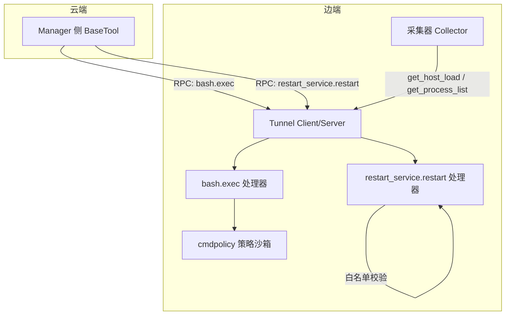
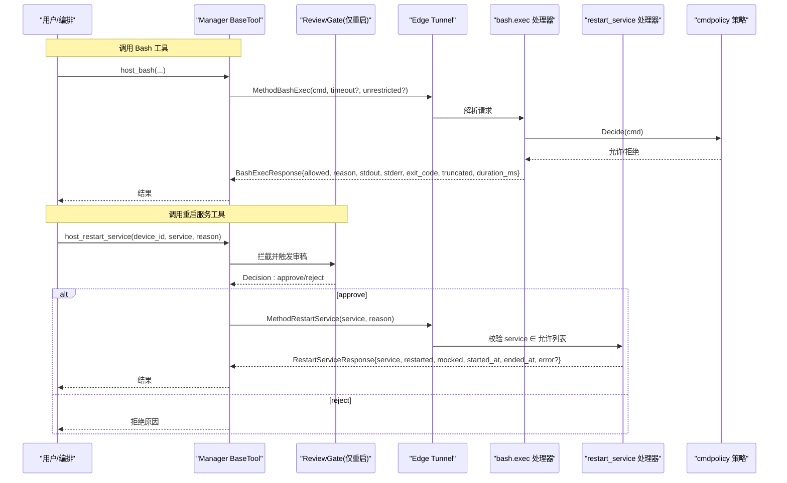
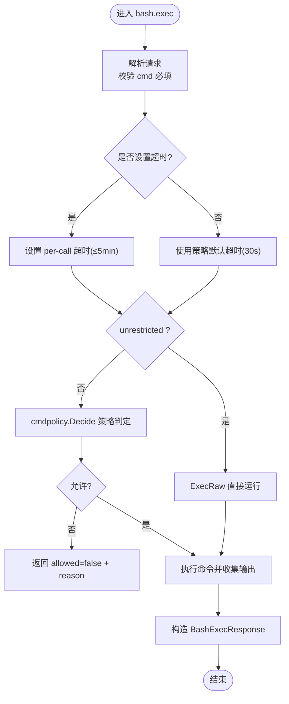
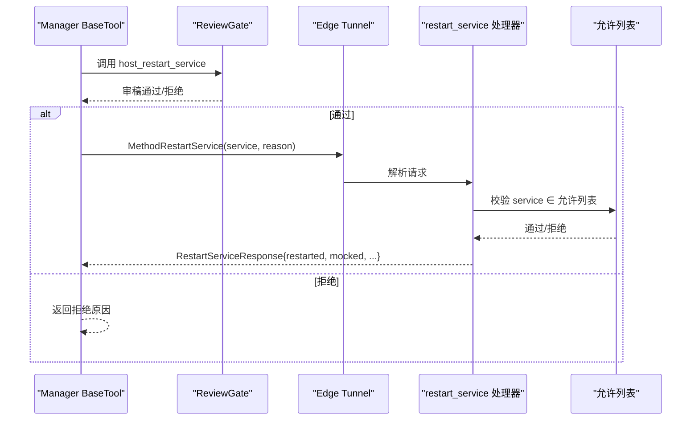
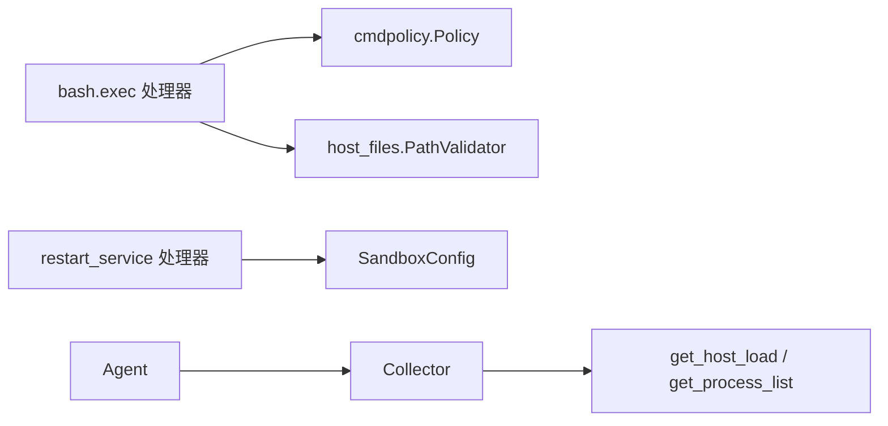

# 系统工具

<cite>
**本文引用的文件**
- [internal/edgeagent/bash/handlers.go](file://internal/edgeagent/bash/handlers.go)
- [internal/pkg/tunnel/bash.go](file://internal/pkg/tunnel/bash.go)
- [internal/edgeagent/restart_service/handlers.go](file://internal/edgeagent/restart_service/handlers.go)
- [internal/pkg/tunnel/restart_service.go](file://internal/pkg/tunnel/restart_service.go)
- [internal/edgeagent/cmdpolicy/policy.go](file://internal/edgeagent/cmdpolicy/policy.go)
- [skills/bash/SKILL.md](file://skills/bash/SKILL.md)
- [skills/restart-service/SKILL.md](file://skills/restart-service/SKILL.md)
- [internal/skill/builtin/restart_service/restart_service.go](file://internal/skill/builtin/restart_service/restart_service.go)
- [internal/edgeagent/biz/agent.go](file://internal/edgeagent/biz/agent.go)
- [internal/pkg/tunnel/types.go](file://internal/pkg/tunnel/types.go)
</cite>

## 目录
1. [简介](#简介)
2. [项目结构](#项目结构)
3. [核心组件](#核心组件)
4. [架构总览](#架构总览)
5. [详细组件分析](#详细组件分析)
6. [依赖关系分析](#依赖关系分析)
7. [性能考量](#性能考量)
8. [故障排查指南](#故障排查指南)
9. [结论](#结论)
10. [附录](#附录)

## 简介
本文件面向“系统工具”能力，覆盖以下子能力：
- Bash 命令执行工具：在边端沙箱中安全执行只读 shell 命令或管道，支持策略校验、路径白名单、网络出站白名单与超时控制。
- 主机负载查询工具：通过统一采集器接口获取主机负载指标（CPU/内存/IO/网络等）。
- 进程管理工具：按排序维度获取进程列表（默认按 CPU 占用 Top N）。
- 服务重启工具：对允许列表内的 systemd 服务发起重启请求，走 SOP 二审流程，边端二次校验并记录审计信息。

文档将说明各工具的参数定义、返回值格式、调用示例、安全机制与权限控制、最佳实践与性能优化建议、错误处理与异常场景，并提供实际使用场景的参考路径。

## 项目结构
系统工具由“边端处理器 + 协议类型 + 策略沙箱 + 技能注册 + 采集器”共同组成：
- 边端处理器：负责接收云端 RPC，解析请求，执行策略校验与具体操作，返回响应。
- 协议类型：定义方法名、请求/响应结构体，作为云-边通信契约。
- 策略沙箱：为 Bash 命令提供二进制白名单、读写分类、参数匹配、路径/网络限制。
- 技能注册：将工具以“技能”形式暴露给上层编排与 UI。
- 采集器：实现主机负载与进程列表的数据采集与上报。

图示来源
- [internal/edgeagent/bash/handlers.go:44-93](file://internal/edgeagent/bash/handlers.go#L44-L93)
- [internal/pkg/tunnel/bash.go:13-43](file://internal/pkg/tunnel/bash.go#L13-L43)
- [internal/edgeagent/restart_service/handlers.go:144-162](file://internal/edgeagent/restart_service/handlers.go#L144-L162)
- [internal/pkg/tunnel/restart_service.go:21-44](file://internal/pkg/tunnel/restart_service.go#L21-L44)
- [internal/edgeagent/cmdpolicy/policy.go:33-49](file://internal/edgeagent/cmdpolicy/policy.go#L33-L49)
- [internal/edgeagent/biz/agent.go:372-391](file://internal/edgeagent/biz/agent.go#L372-L391)

章节来源
- [internal/edgeagent/bash/handlers.go:44-93](file://internal/edgeagent/bash/handlers.go#L44-L93)
- [internal/pkg/tunnel/bash.go:13-43](file://internal/pkg/tunnel/bash.go#L13-L43)
- [internal/edgeagent/restart_service/handlers.go:144-162](file://internal/edgeagent/restart_service/handlers.go#L144-L162)
- [internal/pkg/tunnel/restart_service.go:21-44](file://internal/pkg/tunnel/restart_service.go#L21-L44)
- [internal/edgeagent/cmdpolicy/policy.go:33-49](file://internal/edgeagent/cmdpolicy/policy.go#L33-L49)
- [internal/edgeagent/biz/agent.go:372-391](file://internal/edgeagent/biz/agent.go#L372-L391)

## 核心组件
- Bash 命令执行工具
  - 方法：bash.exec
  - 作用：在边端 cmdpolicy 沙箱内执行只读 shell 命令或管道，支持 per-call 超时与可选“无限制模式”（需管理员开关）。
  - 关键特性：二进制白名单、读写分类、路径白名单、网络出站白名单、输出大小上限、超时控制。
- 主机负载查询工具
  - 方法：get_host_load
  - 作用：通过 Collector 接口获取主机负载采样数据。
- 进程管理工具
  - 方法：get_process_list
  - 作用：获取进程列表，支持 Top N 与排序字段（默认 CPU）。
- 服务重启工具
  - 方法：restart_service.restart
  - 作用：对允许列表内的 systemd 服务发起重启；边端进行白名单二次校验；当前版本为 mock 实现，用于打通 SOP 二审流程。

章节来源
- [internal/pkg/tunnel/bash.go:13-43](file://internal/pkg/tunnel/bash.go#L13-L43)
- [internal/edgeagent/bash/handlers.go:99-157](file://internal/edgeagent/bash/handlers.go#L99-L157)
- [internal/edgeagent/biz/agent.go:372-391](file://internal/edgeagent/biz/agent.go#L372-L391)
- [internal/pkg/tunnel/restart_service.go:21-74](file://internal/pkg/tunnel/restart_service.go#L21-L74)
- [internal/edgeagent/restart_service/handlers.go:49-90](file://internal/edgeagent/restart_service/handlers.go#L49-L90)

## 架构总览
Bash 与服务重启两类工具分别走不同的安全与审批路径：
- Bash 工具：基于 cmdpolicy 的沙箱策略，默认只读；可通过策略文件扩展/收紧；支持 per-call 超时；可选“无限制模式”需管理员开关。
- 服务重启工具：属于 mutating 类，必须经过 ReviewGate 二审；边端再次校验 service 是否在允许列表；当前为 mock 实现，便于审计与演练。

图示来源
- [internal/pkg/tunnel/bash.go:13-43](file://internal/pkg/tunnel/bash.go#L13-L43)
- [internal/edgeagent/bash/handlers.go:99-157](file://internal/edgeagent/bash/handlers.go#L99-L157)
- [internal/edgeagent/cmdpolicy/policy.go:707-800](file://internal/edgeagent/cmdpolicy/policy.go#L707-L800)
- [internal/pkg/tunnel/restart_service.go:21-74](file://internal/pkg/tunnel/restart_service.go#L21-L74)
- [internal/edgeagent/restart_service/handlers.go:167-219](file://internal/edgeagent/restart_service/handlers.go#L167-L219)

## 详细组件分析

### Bash 命令执行工具
- 方法与协议
  - 方法名：MethodBashExec = "bash.exec"
  - 请求体：包含 cmd、timeout_seconds、unrestricted（可选）
  - 响应体：包含 allowed、reason、stdout、stderr、exit_code、truncated、duration_ms
- 执行流程
  - 解析请求，校验 cmd 必填
  - 可选 per-call 超时（最大 5 分钟），否则使用策略默认值
  - 根据 unrestricted 标志选择 ExecRaw（绕过策略）或 Exec（受策略约束）
  - 返回标准化响应
- 策略与安全
  - 默认只读策略：二进制白名单、读写分类、参数匹配、路径白名单、网络出站白名单
  - 可叠加 YAML 策略覆盖（/etc/ongrid-edge/bash-policy.yaml）
  - 路径校验复用 host_files 默认配置
  - 输出 cap：stdout 64 KiB，stderr 16 KiB
  - 默认超时：30s；单段 argv ≤ 32
- 使用要点
  - 推荐用于复杂条件的一行命令或管道
  - 写操作一律被拒；如需写操作请使用专用 mutating 工具并走审批流
  - 被拒时读取 reason 调整命令重试

图示来源
- [internal/edgeagent/bash/handlers.go:99-157](file://internal/edgeagent/bash/handlers.go#L99-L157)
- [internal/pkg/tunnel/bash.go:21-71](file://internal/pkg/tunnel/bash.go#L21-L71)
- [internal/edgeagent/cmdpolicy/policy.go:33-49](file://internal/edgeagent/cmdpolicy/policy.go#L33-L49)
- [internal/edgeagent/cmdpolicy/policy.go:707-800](file://internal/edgeagent/cmdpolicy/policy.go#L707-L800)

章节来源
- [internal/pkg/tunnel/bash.go:13-71](file://internal/pkg/tunnel/bash.go#L13-L71)
- [internal/edgeagent/bash/handlers.go:44-157](file://internal/edgeagent/bash/handlers.go#L44-L157)
- [internal/edgeagent/cmdpolicy/policy.go:33-49](file://internal/edgeagent/cmdpolicy/policy.go#L33-L49)
- [internal/edgeagent/cmdpolicy/policy.go:707-800](file://internal/edgeagent/cmdpolicy/policy.go#L707-L800)
- [skills/bash/SKILL.md:111-188](file://skills/bash/SKILL.md#L111-L188)

### 主机负载查询工具
- 方法与协议
  - 方法名：MethodGetHostLoad
  - 请求体：无（或空）
  - 响应体：由 Collector.GetHostLoad 返回的结构化负载数据
- 实现要点
  - Agent 在启动时注册 handler，委托 collector 获取负载
  - 支持周期性采集与上报（心跳/指标循环）
- 使用要点
  - 适合快速查看主机整体负载情况
  - 若需要更细粒度指标，可使用 Prometheus/Loki 等后端

章节来源
- [internal/edgeagent/biz/agent.go:372-375](file://internal/edgeagent/biz/agent.go#L372-L375)
- [internal/edgeagent/biz/agent.go:608-693](file://internal/edgeagent/biz/agent.go#L608-L693)

### 进程管理工具
- 方法与协议
  - 方法名：MethodGetProcessList
  - 请求体：topN（默认 20）、sortBy（默认 CPU）
  - 响应体：进程列表及采样时间
- 实现要点
  - Agent 注册 handler，解析请求后调用 collector.GetProcessList
  - 默认排序为 CPU，可按需调整
- 使用要点
  - 适合定位资源占用高的进程
  - 结合日志与指标进一步下钻

章节来源
- [internal/edgeagent/biz/agent.go:376-391](file://internal/edgeagent/biz/agent.go#L376-L391)

### 服务重启工具
- 方法与协议
  - 方法名：MethodRestartService = "restart_service.restart"
  - 请求体：service（systemd 短名，不带 .service）、reason（可选）
  - 响应体：service、restarted、mocked、started_at、ended_at、error（可选）
- 执行流程
  - Manager 侧 BaseTool 经 ReviewGate 拦截，审稿通过后下发到边端
  - 边端再次校验 service 是否在允许列表
  - 当前为 mock 实现，返回 Mocked=true，便于审计与演练
- 使用要点
  - 仅允许列表内的服务可重启（nginx/redis/prometheus/loki/tempo/grafana/mysql/ongrid）
  - 必须填写 reason，便于事后复盘
  - 不要主动建议重启，先做诊断

图示来源
- [internal/pkg/tunnel/restart_service.go:21-74](file://internal/pkg/tunnel/restart_service.go#L21-L74)
- [internal/edgeagent/restart_service/handlers.go:144-219](file://internal/edgeagent/restart_service/handlers.go#L144-L219)
- [internal/skill/builtin/restart_service/restart_service.go:58-93](file://internal/skill/builtin/restart_service/restart_service.go#L58-L93)

章节来源
- [internal/pkg/tunnel/restart_service.go:21-74](file://internal/pkg/tunnel/restart_service.go#L21-L74)
- [internal/edgeagent/restart_service/handlers.go:49-219](file://internal/edgeagent/restart_service/handlers.go#L49-L219)
- [skills/restart-service/SKILL.md:32-82](file://skills/restart-service/SKILL.md#L32-L82)
- [internal/skill/builtin/restart_service/restart_service.go:58-114](file://internal/skill/builtin/restart_service/restart_service.go#L58-L114)

## 依赖关系分析
- Bash 工具依赖
  - tunnel.Client/Handler：用于注册与调用
  - cmdpolicy.Policy：策略决策
  - host_files.PathValidator：路径白名单校验
- 重启服务工具依赖
  - tunnel.Client/Handler：用于注册与调用
  - SandboxConfig：允许列表与 mock 开关
- 采集器依赖
  - Collector 接口：GetHostLoad、GetProcessList
  - Agent 生命周期：心跳与指标循环

图示来源
- [internal/edgeagent/bash/handlers.go:79-93](file://internal/edgeagent/bash/handlers.go#L79-L93)
- [internal/edgeagent/restart_service/handlers.go:144-162](file://internal/edgeagent/restart_service/handlers.go#L144-L162)
- [internal/edgeagent/biz/agent.go:372-391](file://internal/edgeagent/biz/agent.go#L372-L391)

章节来源
- [internal/edgeagent/bash/handlers.go:79-93](file://internal/edgeagent/bash/handlers.go#L79-L93)
- [internal/edgeagent/restart_service/handlers.go:144-162](file://internal/edgeagent/restart_service/handlers.go#L144-L162)
- [internal/edgeagent/biz/agent.go:372-391](file://internal/edgeagent/biz/agent.go#L372-L391)

## 性能考量
- Bash 工具
  - 默认超时 30s，per-call 可设但上限 5 分钟，避免长时间占用隧道槽位
  - 输出 cap：stdout 64 KiB，stderr 16 KiB，避免大输出阻塞
  - 单段 argv ≤ 32，防止过长参数导致解析/执行开销
  - 管道支持，但应避免过度嵌套管道造成复杂度上升
- 重启服务工具
  - 当前为 mock，耗时微秒级；未来真实 systemctl 调用应设置合理超时与重试
  - 允许列表预计算，查找 O(1)，减少校验开销
- 主机负载与进程列表
  - 周期采集间隔与批大小可调，避免频繁 IO 与网络开销
  - 失败不中断主循环，下次 tick 重试，保证稳定性

[本节为通用指导，无需特定文件引用]

## 故障排查指南
- Bash 工具被拒绝
  - 检查 response.reason，常见原因：二进制不在白名单、参数命中写规则、路径/网络受限
  - 调整命令或使用结构化查询替代
  - 如需写操作，改用专用 mutating 工具并走审批
- 重启服务被拒绝
  - 检查 service 是否在允许列表
  - 确认 manager 侧审稿通过
  - 当前 mock 模式下，Mocked=true 表示未真正执行 systemctl
- 连接与超时
  - 注意 per-call 超时与策略默认超时
  - 隧道重连会自动重新注册 handler，关注日志中的重连事件

章节来源
- [internal/edgeagent/bash/handlers.go:129-157](file://internal/edgeagent/bash/handlers.go#L129-L157)
- [internal/edgeagent/restart_service/handlers.go:171-219](file://internal/edgeagent/restart_service/handlers.go#L171-L219)
- [internal/pkg/tunnel/types.go:68-105](file://internal/pkg/tunnel/types.go#L68-L105)

## 结论
本系统工具集围绕“安全可控、可观测、可审计”的目标设计：
- Bash 工具提供灵活的只读诊断能力，严格策略保障安全边界
- 主机负载与进程列表提供基础监控能力
- 服务重启工具引入 SOP 二审与边端白名单双重保障，确保变更可控
- 通过统一的 tunnel 协议与 skill 注册，便于扩展与维护

[本节为总结性内容，无需特定文件引用]

## 附录

### 参数与返回值速查
- Bash 执行
  - 请求：cmd（必填）、timeout_seconds（可选）、unrestricted（可选）
  - 响应：allowed、reason、stdout、stderr、exit_code、truncated、duration_ms
- 主机负载
  - 请求：无
  - 响应：由 Collector.GetHostLoad 返回
- 进程列表
  - 请求：topN（默认 20）、sortBy（默认 CPU）
  - 响应：进程列表与采样时间
- 重启服务
  - 请求：service（必填，systemd 短名）、reason（可选）
  - 响应：service、restarted、mocked、started_at、ended_at、error（可选）

章节来源
- [internal/pkg/tunnel/bash.go:21-71](file://internal/pkg/tunnel/bash.go#L21-L71)
- [internal/pkg/tunnel/restart_service.go:29-74](file://internal/pkg/tunnel/restart_service.go#L29-L74)
- [internal/edgeagent/biz/agent.go:372-391](file://internal/edgeagent/biz/agent.go#L372-L391)

### 使用示例（参考路径）
- Bash 工具
  - 查看 CPU Top 10：参考 [skills/bash/SKILL.md:142-147](file://skills/bash/SKILL.md#L142-L147)
  - 查看 nginx 最近一小时错误：参考 [skills/bash/SKILL.md:148-152](file://skills/bash/SKILL.md#L148-L152)
  - 查看 /var 占用：参考 [skills/bash/SKILL.md:154-158](file://skills/bash/SKILL.md#L154-L158)
  - 查看 iptables 规则：参考 [skills/bash/SKILL.md:160-164](file://skills/bash/SKILL.md#L160-L164)
  - 查看监听端口：参考 [skills/bash/SKILL.md:166-170](file://skills/bash/SKILL.md#L166-L170)
- 重启服务
  - 调用规则与白名单：参考 [skills/restart-service/SKILL.md:36-52](file://skills/restart-service/SKILL.md#L36-L52)
  - 二审流程：参考 [skills/restart-service/SKILL.md:54-69](file://skills/restart-service/SKILL.md#L54-L69)

章节来源
- [skills/bash/SKILL.md:142-170](file://skills/bash/SKILL.md#L142-L170)
- [skills/restart-service/SKILL.md:36-69](file://skills/restart-service/SKILL.md#L36-L69)