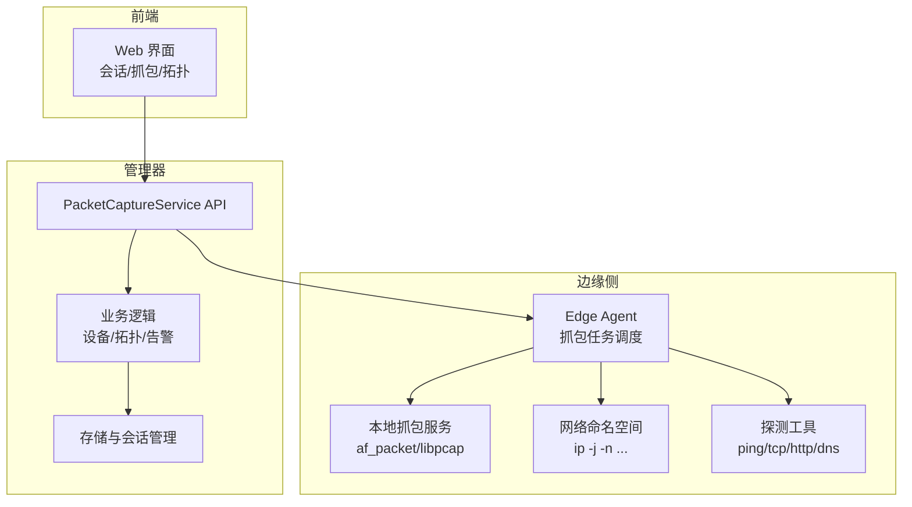
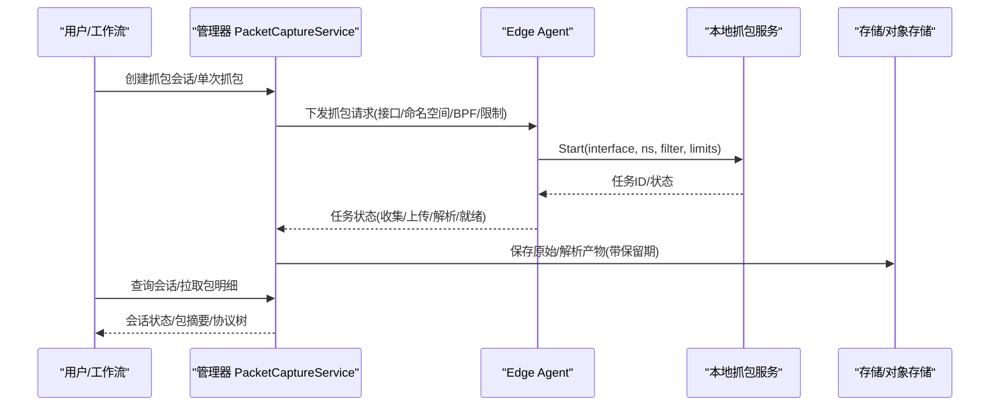
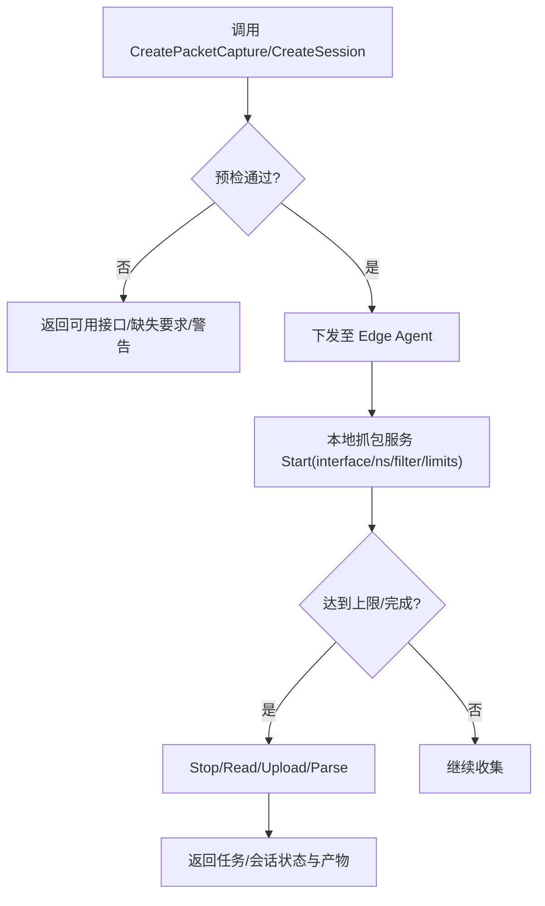
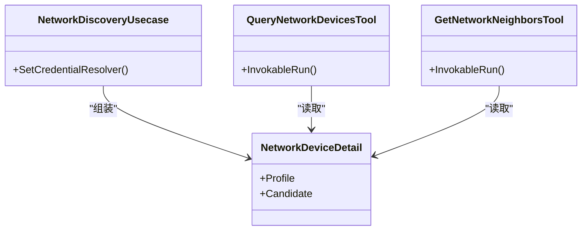
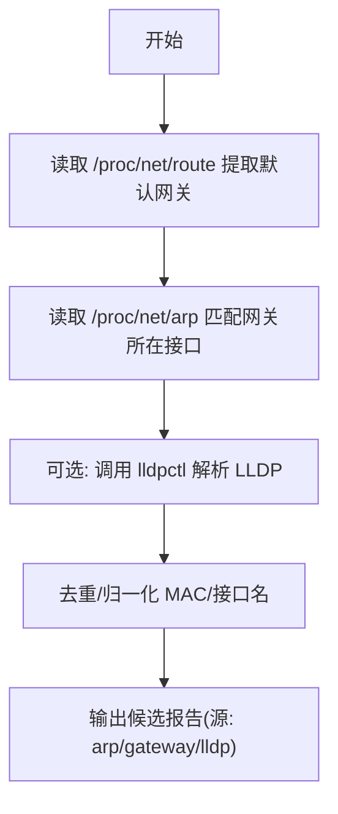
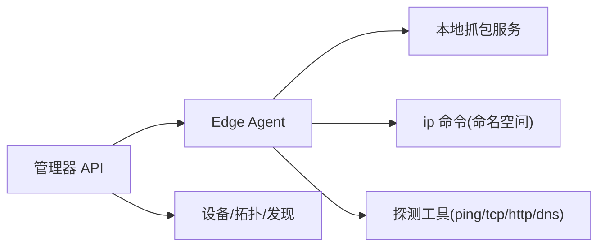

# 网络工具

<cite>
**本文引用的文件**   
- [internal/edgeagent/biz/packet_capture.go](file://internal/edgeagent/biz/packet_capture.go)
- [internal/edgeagent/collector/network_discovery.go](file://internal/edgeagent/collector/network_discovery.go)
- [internal/skill/builtin/capture_pcap.go](file://internal/skill/builtin/capture_pcap.go)
- [internal/skill/builtin/host_netns_inspect.go](file://internal/skill/builtin/host_netns_inspect.go)
- [internal/skill/builtin/probe_dns.go](file://internal/skill/builtin/probe_dns.go)
- [internal/skill/builtin/probe_http.go](file://internal/skill/builtin/probe_http.go)
- [internal/skill/builtin/probe_ping.go](file://internal/skill/builtin/probe_ping.go)
- [internal/skill/builtin/probe_tcp.go](file://internal/skill/builtin/probe_tcp.go)
- [api/manager/packetcapture/v1/packet_capture.proto](file://api/manager/packetcapture/v1/packet_capture.proto)
- [web/src/api/packetCaptures.ts](file://web/src/api/packetCaptures.ts)
- [internal/manager/biz/device/network_discovery.go](file://internal/manager/biz/device/network_discovery.go)
- [internal/manager/server/device/http.go](file://internal/manager/server/device/http.go)
- [web/src/api/devices.ts](file://web/src/api/devices.ts)
- [internal/manager/biz/aiops/tools/network_inventory_basetool.go](file://internal/manager/biz/aiops/tools/network_inventory_basetool.go)
- [agents/specialist-network.md](file://agents/specialist-network.md)
</cite>

## 目录
1. [简介](#简介)
2. [项目结构](#项目结构)
3. [核心组件](#核心组件)
4. [架构总览](#架构总览)
5. [详细组件分析](#详细组件分析)
6. [依赖关系分析](#依赖关系分析)
7. [性能考虑](#性能考虑)
8. [故障排查指南](#故障排查指南)
9. [结论](#结论)
10. [附录：参数与返回格式速查](#附录参数与返回格式速查)

## 简介
本文件面向网络诊断与分析场景，系统化梳理本项目中的网络相关工具能力，包括：
- 网络拓扑查询与设备发现（SNMP、ARP、LLDP、网关探测）
- 数据包捕获与会话管理（PCAP/PCAPNG、BPF过滤、多目标会话）
- 设备解析与邻接关系（接口、链路、邻居）
- 异常节点发现（候选节点、置信度、来源）
- 连通性探测（DNS、HTTP、TCP、Ping）
- 网络命名空间探查（Linux netns）

文档同时说明数据采集原理、限制、性能影响与安全考量，并提供实际排障案例。

## 项目结构
围绕网络能力的代码主要分布在以下层次：
- 协议定义：gRPC/Protobuf 定义了抓包服务、会话、过滤器、状态机等
- 边缘侧执行：Edge Agent 负责在主机或容器网络命名空间内启动抓包、读取结果
- 管理器侧编排：Manager 提供 API、存储、会话聚合、分析与展示
- 技能层（Skill）：可被 AI 助手与工作流调用的标准化网络探测与检查能力
- Web 前端：会话列表、抓包详情、拓扑与设备视图

图表来源
- [api/manager/packetcapture/v1/packet_capture.proto:9-26](file://api/manager/packetcapture/v1/packet_capture.proto#L9-L26)
- [internal/edgeagent/biz/packet_capture.go:15-133](file://internal/edgeagent/biz/packet_capture.go#L15-L133)
- [internal/skill/builtin/host_netns_inspect.go:55-80](file://internal/skill/builtin/host_netns_inspect.go#L55-L80)
- [web/src/api/packetCaptures.ts:52-85](file://web/src/api/packetCaptures.ts#L52-L85)

章节来源
- [api/manager/packetcapture/v1/packet_capture.proto:9-26](file://api/manager/packetcapture/v1/packet_capture.proto#L9-L26)
- [internal/edgeagent/biz/packet_capture.go:15-133](file://internal/edgeagent/biz/packet_capture.go#L15-L133)

## 核心组件
- 数据包捕获与会话
  - 管理器 API：创建/获取/列出/取消/停止抓包；会话级批量抓包与刷新
  - 边缘侧：启动/查询/读取/停止/取消抓包任务，支持 BPF 过滤、时长/大小/包数上限、快照长度、混杂模式等
- 网络发现与拓扑
  - 被动采集：网关、ARP、LLDP 候选；虚拟接口过滤；MAC 归一化
  - 管理器：候选入库、认证设备清单、邻接关系查询、接口详情
- 连通性探测与命名空间探查
  - DNS/TCP/HTTP/Ping 探测，结构化输出延迟与错误
  - Linux 网络命名空间地址/路由/链路信息读取

章节来源
- [internal/edgeagent/biz/packet_capture.go:15-133](file://internal/edgeagent/biz/packet_capture.go#L15-L133)
- [internal/edgeagent/collector/network_discovery.go:18-113](file://internal/edgeagent/collector/network_discovery.go#L18-L113)
- [internal/manager/biz/device/network_discovery.go:64-101](file://internal/manager/biz/device/network_discovery.go#L64-L101)
- [internal/skill/builtin/probe_dns.go:19-38](file://internal/skill/builtin/probe_dns.go#L19-L38)
- [internal/skill/builtin/probe_tcp.go:19-38](file://internal/skill/builtin/probe_tcp.go#L19-L38)
- [internal/skill/builtin/probe_http.go:23-46](file://internal/skill/builtin/probe_http.go#L23-L46)
- [internal/skill/builtin/probe_ping.go:20-42](file://internal/skill/builtin/probe_ping.go#L20-L42)
- [internal/skill/builtin/host_netns_inspect.go:55-80](file://internal/skill/builtin/host_netns_inspect.go#L55-L80)

## 架构总览
下图展示了从用户发起网络诊断到边缘执行与结果回传的完整流程。

图表来源
- [api/manager/packetcapture/v1/packet_capture.proto:9-26](file://api/manager/packetcapture/v1/packet_capture.proto#L9-L26)
- [internal/edgeagent/biz/packet_capture.go:111-133](file://internal/edgeagent/biz/packet_capture.go#L111-L133)
- [web/src/api/packetCaptures.ts:52-85](file://web/src/api/packetCaptures.ts#L52-L85)

## 详细组件分析

### 数据包捕获工具（PCAP/PCAPNG）
- 功能要点
  - 管理器 API 提供预检、创建、查询、列表、取消、停止、会话管理、包列表与单包详情
  - 边缘侧实现启动/查询/读取/停止/取消，支持 BPF 过滤、时长/大小/包数上限、快照长度、混杂模式、开始时间
  - 会话模式支持多目标（主机接口/K8s Pod 网络命名空间），统一聚合状态与时间线
- 关键参数（来自 Skill 与 Proto）
  - interface：抓包网卡名
  - network_namespace：K8s Pod 网络命名空间
  - filter：BPF/过滤表达式
  - duration_seconds/max_bytes/max_packets/snaplen/promiscuous_mode：资源与行为限制
  - direction/format/immediate_mode/raw/parsed_retention_seconds：方向、格式、保留策略
- 返回值与状态
  - 任务/会话状态机：待审批/排队/分发/收集/上传/解析/就绪/已取消/失败/过期/删除
  - 会话分析包含摘要、流量、时间线等
- 使用示例（描述性）
  - 在指定网卡上抓取 HTTPS 流量，限制时长 60s、最大包数 100k，并设置 BPF 过滤 host X and port 443
  - 为某 Pod 的网络命名空间创建会话，持续 120s，自动聚合多个成员抓包结果

图表来源
- [api/manager/packetcapture/v1/packet_capture.proto:124-174](file://api/manager/packetcapture/v1/packet_capture.proto#L124-L174)
- [internal/edgeagent/biz/packet_capture.go:111-133](file://internal/edgeagent/biz/packet_capture.go#L111-L133)
- [internal/skill/builtin/capture_pcap.go:26-44](file://internal/skill/builtin/capture_pcap.go#L26-L44)

章节来源
- [api/manager/packetcapture/v1/packet_capture.proto:9-26](file://api/manager/packetcapture/v1/packet_capture.proto#L9-L26)
- [api/manager/packetcapture/v1/packet_capture.proto:124-174](file://api/manager/packetcapture/v1/packet_capture.proto#L124-L174)
- [internal/edgeagent/biz/packet_capture.go:15-133](file://internal/edgeagent/biz/packet_capture.go#L15-L133)
- [internal/skill/builtin/capture_pcap.go:26-44](file://internal/skill/builtin/capture_pcap.go#L26-L44)
- [web/src/api/packetCaptures.ts:52-85](file://web/src/api/packetCaptures.ts#L52-L85)

### 网络拓扑查询与设备解析
- 功能要点
  - 查询已验证网络设备清单（SNMP 身份、可达性、管理地址、发现来源、接口/链路计数）
  - 查询某设备的接口详情（仅关注项）
  - 查询某网络设备的邻居（基于拓扑关系与发现来源）
- 数据来源
  - SNMP 发现的设备档案
  - 网络发现候选（ARP、网关、LLDP）
  - 拓扑关系（连接关系）
- 使用示例（描述性）
  - 列出所有可达的交换机，查看其接口统计
  - 针对某核心交换机，查看与其直连的主机/服务器

图表来源
- [internal/manager/biz/device/network_discovery.go:64-101](file://internal/manager/biz/device/network_discovery.go#L64-L101)
- [internal/manager/biz/aiops/tools/network_inventory_basetool.go:18-32](file://internal/manager/biz/aiops/tools/network_inventory_basetool.go#L18-L32)

章节来源
- [internal/manager/biz/device/network_discovery.go:64-101](file://internal/manager/biz/device/network_discovery.go#L64-L101)
- [internal/manager/biz/aiops/tools/network_inventory_basetool.go:18-32](file://internal/manager/biz/aiops/tools/network_inventory_basetool.go#L18-L32)
- [web/src/api/devices.ts:43-101](file://web/src/api/devices.ts#L43-L101)

### 异常节点发现（候选节点）
- 原理
  - 边缘侧被动采集：网关、ARP、LLDP 候选；过滤虚拟接口；MAC 归一化；LLDP 管理地址优先级选择
  - 管理器将候选持久化，后续可由 SNMP 增强并提升为“已验证设备”
- 关键点
  - 不主动扫描 CIDR，不发送 SNMP 凭证
  - 缺失 /proc 文件或 lldpctl 视为空信号而非致命错误
- 使用示例（描述性）
  - 在边缘主机上运行一次网络发现，汇总 ARP 与 LLDP 观察到的邻居
  - 在管理器中查看候选列表，评估置信度与来源

图表来源
- [internal/edgeagent/collector/network_discovery.go:43-113](file://internal/edgeagent/collector/network_discovery.go#L43-L113)
- [internal/edgeagent/collector/network_discovery.go:115-142](file://internal/edgeagent/collector/network_discovery.go#L115-L142)
- [internal/edgeagent/collector/network_discovery.go:205-275](file://internal/edgeagent/collector/network_discovery.go#L205-L275)

章节来源
- [internal/edgeagent/collector/network_discovery.go:18-113](file://internal/edgeagent/collector/network_discovery.go#L18-L113)
- [internal/edgeagent/collector/network_discovery.go:115-142](file://internal/edgeagent/collector/network_discovery.go#L115-L142)
- [internal/edgeagent/collector/network_discovery.go:205-275](file://internal/edgeagent/collector/network_discovery.go#L205-L275)

### 连通性探测工具（DNS/TCP/HTTP/Ping）
- 功能要点
  - DNS：系统解析器查询 A/AAAA，返回地址与耗时
  - TCP：拨号建立连接后立即关闭，返回连通性与耗时
  - HTTP：HEAD/GET 请求，跳过 TLS 校验以适配内部自签证书，返回状态码、耗时、内容长度
  - Ping：固定次数 ICMP 探测，返回退出码、耗时、标准输出/错误
- 使用示例（描述性）
  - 探测某域名解析是否成功及耗时
  - 探测后端服务端口连通性
  - 对健康检查端点做 HEAD 探测
  - 快速判断目标主机是否可达

章节来源
- [internal/skill/builtin/probe_dns.go:19-38](file://internal/skill/builtin/probe_dns.go#L19-L38)
- [internal/skill/builtin/probe_tcp.go:19-38](file://internal/skill/builtin/probe_tcp.go#L19-L38)
- [internal/skill/builtin/probe_http.go:23-46](file://internal/skill/builtin/probe_http.go#L23-L46)
- [internal/skill/builtin/probe_ping.go:20-42](file://internal/skill/builtin/probe_ping.go#L20-L42)

### 网络命名空间探查（host_netns_inspect）
- 功能要点
  - 列出 /var/run/netns 下的命名空间，并对每个命名空间读取 IP 地址、路由表、可选链路信息
  - 参数控制是否包含路由/链路；命名空间名称白名单校验，防止注入
- 使用示例（描述性）
  - 仅查询某个命名空间的地址与路由
  - 遍历全部命名空间，收集接口状态与 MAC

章节来源
- [internal/skill/builtin/host_netns_inspect.go:55-80](file://internal/skill/builtin/host_netns_inspect.go#L55-L80)
- [internal/skill/builtin/host_netns_inspect.go:136-205](file://internal/skill/builtin/host_netns_inspect.go#L136-L205)
- [internal/skill/builtin/host_netns_inspect.go:207-327](file://internal/skill/builtin/host_netns_inspect.go#L207-L327)

## 依赖关系分析
- 管理器与边缘侧通过隧道/消息传递协作：管理器下发抓包请求，边缘侧执行并上报任务状态与产物
- 网络发现依赖宿主内核数据（/proc）与外部命令（lldpctl），管理器侧再结合 SNMP 与拓扑进行增强
- 技能层暴露统一的元数据与参数 schema，便于 AI 助手与工作流调用

图表来源
- [api/manager/packetcapture/v1/packet_capture.proto:9-26](file://api/manager/packetcapture/v1/packet_capture.proto#L9-L26)
- [internal/edgeagent/biz/packet_capture.go:111-133](file://internal/edgeagent/biz/packet_capture.go#L111-L133)
- [internal/edgeagent/collector/network_discovery.go:43-113](file://internal/edgeagent/collector/network_discovery.go#L43-L113)

章节来源
- [api/manager/packetcapture/v1/packet_capture.proto:9-26](file://api/manager/packetcapture/v1/packet_capture.proto#L9-L26)
- [internal/edgeagent/biz/packet_capture.go:111-133](file://internal/edgeagent/biz/packet_capture.go#L111-L133)
- [internal/edgeagent/collector/network_discovery.go:43-113](file://internal/edgeagent/collector/network_discovery.go#L43-L113)

## 性能考虑
- 抓包限制
  - 严格限制 duration_seconds、max_bytes、max_packets、snaplen，避免内存与磁盘压力
  - 支持 raw/parsed 不同保留策略，降低长期存储成本
- 并发与超时
  - 探测工具使用上下文超时，避免阻塞调度器
  - 网络发现对可选依赖（如 lldpctl）采用容错处理，不影响主流程
- 数据量控制
  - 会话模式聚合多成员结果，减少重复传输
  - 包列表分页与游标，避免一次性加载大量数据

[本节为通用指导，不直接分析具体文件]

## 故障排查指南
- 无法启动抓包
  - 检查边缘侧是否配置了抓包服务与权限（混杂模式需 CAP_NET_ADMIN）
  - 确认接口/命名空间存在且可访问
  - 参考管理器 API 的预检响应（可用接口、缺失要求、警告）
- 抓包无数据或数据不完整
  - 调整 BPF 过滤条件，确保匹配目标流量
  - 增大 max_packets/max_bytes 或延长 duration_seconds
  - 检查 snaplen 是否过小导致头部被截断
- 解析失败或产物过期
  - 检查 raw/parsed 保留时间是否到期
  - 查看任务状态是否为失败，定位错误码与详情
- 网络发现未识别邻居
  - 确认非虚拟接口（docker/br-/veth/cni/virbr/flannel/cali/tun/tap/lo）
  - 检查 /proc/net/route 与 /proc/net/arp 是否存在
  - 若使用 LLDP，确认 lldpctl 可用且输出正常

章节来源
- [internal/edgeagent/biz/packet_capture.go:111-133](file://internal/edgeagent/biz/packet_capture.go#L111-L133)
- [internal/edgeagent/collector/network_discovery.go:115-142](file://internal/edgeagent/collector/network_discovery.go#L115-L142)
- [api/manager/packetcapture/v1/packet_capture.proto:124-174](file://api/manager/packetcapture/v1/packet_capture.proto#L124-L174)

## 结论
本项目提供了覆盖“发现—探测—捕获—解析—可视化”的完整网络诊断能力。通过管理器与边缘侧的协同，既能安全可控地执行敏感操作（如抓包），又能以结构化方式呈现结果，便于自动化与人工排障。建议在生产环境中：
- 明确抓包授权与审计，严格控制资源上限
- 优先使用会话模式进行多目标、长时采集
- 结合网络发现与拓扑，形成“设备—接口—邻居—流量”的闭环诊断

[本节为总结性内容，不直接分析具体文件]

## 附录：参数与返回格式速查
- 抓包任务/会话
  - 关键参数：interface、network_namespace、filter、duration_seconds、max_bytes、max_packets、snaplen、promiscuous_mode、direction、format、raw/parsed_retention_seconds
  - 状态：pending_approval/queued/dispatching/capturing/uploading/parsing/ready/cancelled/failed/raw_expired/expired/deleted
  - 会话分析：summary、flows、timeline
- 网络发现
  - 来源：arp/gateway/lldp
  - 字段：ip_address、mac、interface_name、source、interfaces、links、confidence、status
- 探测工具
  - DNS：addrs、latency_ms、error
  - TCP：ok、latency_ms、error
  - HTTP：status_code、latency_ms、content_length、error
  - Ping：ok、exit_code、duration_ms、stdout、stderr、error
- 命名空间探查
  - namespaces：name、addrs、routes、links、error

章节来源
- [api/manager/packetcapture/v1/packet_capture.proto:124-174](file://api/manager/packetcapture/v1/packet_capture.proto#L124-L174)
- [api/manager/packetcapture/v1/packet_capture.proto:262-306](file://api/manager/packetcapture/v1/packet_capture.proto#L262-L306)
- [web/src/api/packetCaptures.ts:52-85](file://web/src/api/packetCaptures.ts#L52-L85)
- [web/src/api/devices.ts:43-101](file://web/src/api/devices.ts#L43-L101)
- [internal/skill/builtin/probe_dns.go:19-38](file://internal/skill/builtin/probe_dns.go#L19-L38)
- [internal/skill/builtin/probe_tcp.go:19-38](file://internal/skill/builtin/probe_tcp.go#L19-L38)
- [internal/skill/builtin/probe_http.go:23-46](file://internal/skill/builtin/probe_http.go#L23-L46)
- [internal/skill/builtin/probe_ping.go:20-42](file://internal/skill/builtin/probe_ping.go#L20-L42)
- [internal/skill/builtin/host_netns_inspect.go:55-80](file://internal/skill/builtin/host_netns_inspect.go#L55-L80)