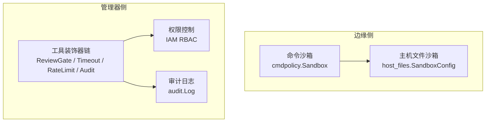
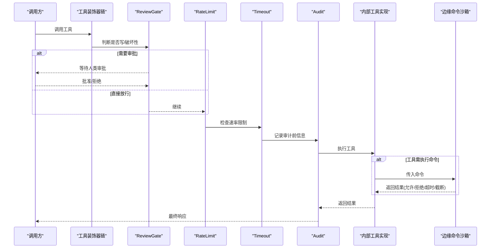
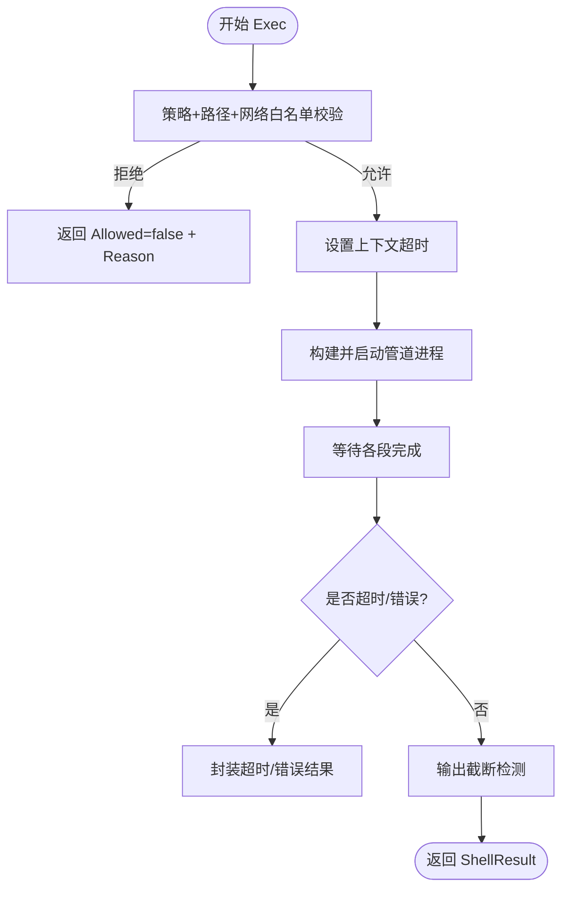
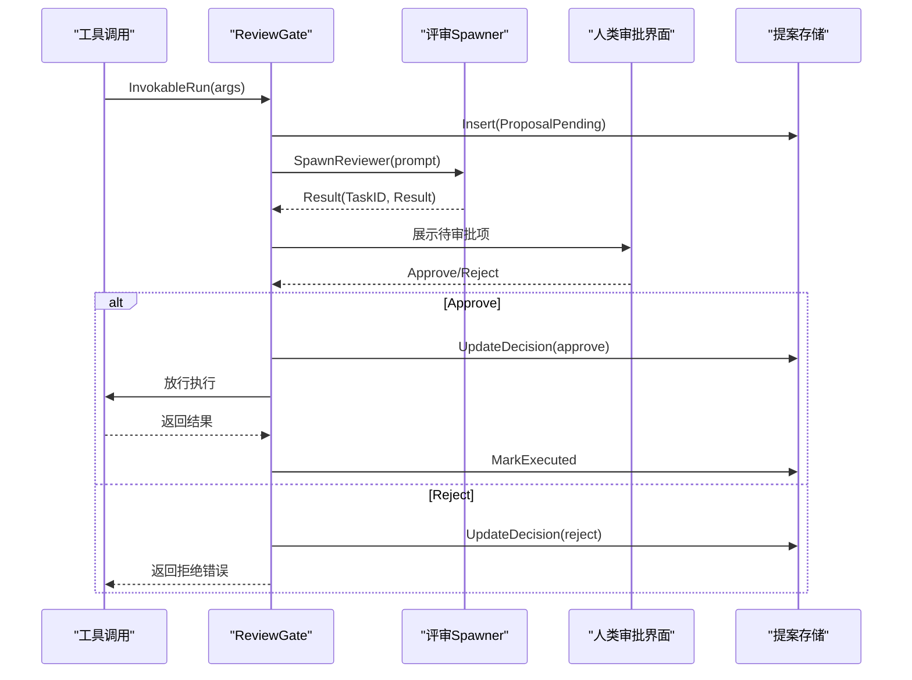
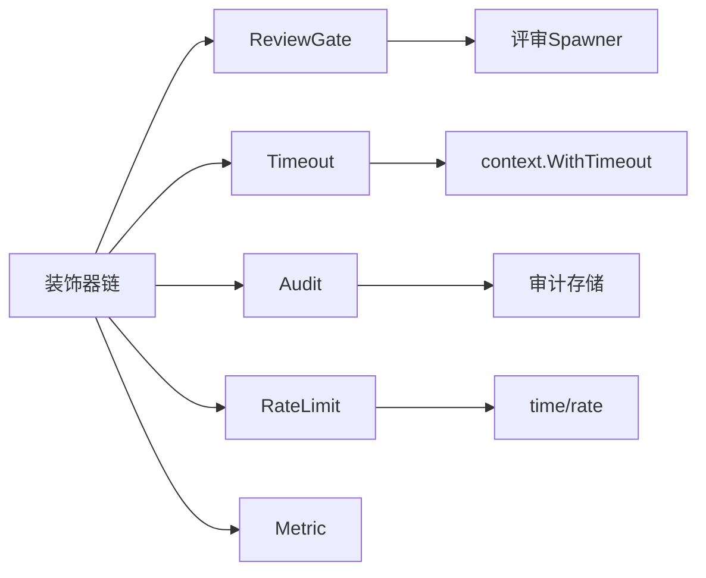

# 工具安全机制

<cite>
**本文引用的文件**
- [internal/edgeagent/cmdpolicy/sandbox.go](file://internal/edgeagent/cmdpolicy/sandbox.go)
- [internal/edgeagent/host_files/sandbox.go](file://internal/edgeagent/host_files/sandbox.go)
- [internal/manager/biz/aiops/tools/decorators/review_gate.go](file://internal/manager/biz/aiops/tools/decorators/review_gate.go)
- [internal/manager/biz/aiops/tools/decorators/ratelimit.go](file://internal/manager/biz/aiops/tools/decorators/ratelimit.go)
- [internal/manager/biz/aiops/tools/decorators/timeout.go](file://internal/manager/biz/aiops/tools/decorators/timeout.go)
- [internal/manager/model/audit/log.go](file://internal/manager/model/audit/log.go)
- [internal/iam/biz/authz/authz.go](file://internal/iam/biz/authz/authz.go)
- [cmd/ongrid/main.go](file://cmd/ongrid/main.go)
</cite>

## 目录
1. [简介](#简介)
2. [项目结构](#项目结构)
3. [核心组件](#核心组件)
4. [架构总览](#架构总览)
5. [详细组件分析](#详细组件分析)
6. [依赖关系分析](#依赖关系分析)
7. [性能与安全权衡](#性能与安全权衡)
8. [故障排查指南](#故障排查指南)
9. [结论](#结论)
10. [附录：配置与最佳实践](#附录配置与最佳实践)

## 简介
本文件系统性阐述工具执行的安全边界、权限控制模型、人类审批机制、速率限制、超时控制、资源隔离、敏感操作保护、审计与监控等。目标是帮助读者理解从“命令沙箱”到“工具装饰器链”的纵深防御体系，并给出可操作的配置建议与排障方法。

## 项目结构
围绕工具安全的关键代码分布在以下层次：
- 边缘侧命令执行沙箱：对 shell 命令进行白名单、路径校验、网络目标白名单、输出上限、超时控制与进程组隔离。
- 管理器侧工具装饰器链：在工具调用入口统一注入人类审批（ReviewGate）、超时、审计、速率限制、指标采集等横切能力。
- 权限与授权：基于角色的访问控制（RBAC）与组织域隔离。
- 审计日志：不可篡改的操作记录，支持按动作、资源、状态检索。

图表来源
- [internal/edgeagent/cmdpolicy/sandbox.go:17-37](file://internal/edgeagent/cmdpolicy/sandbox.go#L17-L37)
- [internal/edgeagent/host_files/sandbox.go:1-24](file://internal/edgeagent/host_files/sandbox.go#L1-L24)
- [internal/manager/biz/aiops/tools/decorators/review_gate.go:15-59](file://internal/manager/biz/aiops/tools/decorators/review_gate.go#L15-L59)
- [internal/manager/model/audit/log.go:1-6](file://internal/manager/model/audit/log.go#L1-L6)
- [internal/iam/biz/authz/authz.go:1-21](file://internal/iam/biz/authz/authz.go#L1-L21)

章节来源
- [internal/edgeagent/cmdpolicy/sandbox.go:17-37](file://internal/edgeagent/cmdpolicy/sandbox.go#L17-L37)
- [internal/edgeagent/host_files/sandbox.go:1-24](file://internal/edgeagent/host_files/sandbox.go#L1-L24)
- [internal/manager/biz/aiops/tools/decorators/review_gate.go:15-59](file://internal/manager/biz/aiops/tools/decorators/review_gate.go#L15-L59)
- [internal/manager/model/audit/log.go:1-6](file://internal/manager/model/audit/log.go#L1-L6)
- [internal/iam/biz/authz/authz.go:1-21](file://internal/iam/biz/authz/authz.go#L1-L21)

## 核心组件
- 命令沙箱（cmdpolicy.Sandbox）：负责命令解析、策略决策、路径/网络白名单校验、管道执行、输出截断、超时控制与进程组隔离。
- 主机文件沙箱（host_files.SandboxConfig）：提供路径校验与二进制白名单，默认“读多写少”的宽松策略配合强拒绝列表。
- 人类审批门控（ReviewGate）：拦截写/破坏性工具调用，触发确定性审批或 LLM 评审工作流，仅批准后才放行。
- 速率限制（RateLimitTool）：按（工具名, 用户ID）维度令牌桶限流，防止滥用与雪崩。
- 超时控制（TimeoutTool）：为每次工具调用设置上下文超时，避免长时占用。
- 权限控制（IAM RBAC）：基于角色与组织域的细粒度授权，内置三档角色与超级用户兜底。
- 审计日志（audit.Log）：记录“谁在何时对何资源做了什么”，支持成功/失败/拒绝三类状态。

章节来源
- [internal/edgeagent/cmdpolicy/sandbox.go:52-74](file://internal/edgeagent/cmdpolicy/sandbox.go#L52-L74)
- [internal/edgeagent/host_files/sandbox.go:34-69](file://internal/edgeagent/host_files/sandbox.go#L34-L69)
- [internal/manager/biz/aiops/tools/decorators/review_gate.go:15-84](file://internal/manager/biz/aiops/tools/decorators/review_gate.go#L15-L84)
- [internal/manager/biz/aiops/tools/decorators/ratelimit.go:14-40](file://internal/manager/biz/aiops/tools/decorators/ratelimit.go#L14-L40)
- [internal/manager/biz/aiops/tools/decorators/timeout.go:22-31](file://internal/manager/biz/aiops/tools/decorators/timeout.go#L22-L31)
- [internal/iam/biz/authz/authz.go:86-110](file://internal/iam/biz/authz/authz.go#L86-L110)
- [internal/manager/model/audit/log.go:10-47](file://internal/manager/model/audit/log.go#L10-L47)

## 架构总览
工具调用在管理器侧通过装饰器链统一受控，再下钻到具体工具实现；若涉及边缘侧命令执行，则进入命令沙箱进一步约束。

图表来源
- [internal/manager/biz/aiops/tools/decorators/review_gate.go:263-350](file://internal/manager/biz/aiops/tools/decorators/review_gate.go#L263-L350)
- [internal/manager/biz/aiops/tools/decorators/ratelimit.go:121-135](file://internal/manager/biz/aiops/tools/decorators/ratelimit.go#L121-L135)
- [internal/manager/biz/aiops/tools/decorators/timeout.go:55-78](file://internal/manager/biz/aiops/tools/decorators/timeout.go#L55-L78)
- [internal/edgeagent/cmdpolicy/sandbox.go:140-188](file://internal/edgeagent/cmdpolicy/sandbox.go#L140-L188)

## 详细组件分析

### 命令沙箱：执行边界与资源隔离
- 策略决策：先由 Policy 决定命令是否允许，再叠加路径与网络白名单校验。
- 路径校验：所有以绝对路径开头的参数均经 PathValidator 校验，防越权访问。
- 网络白名单：对 ClassNetwork 的二进制（如 curl/ping/dig），提取目标主机并匹配允许列表；空列表即拒绝所有出站。
- 管道执行：将多个子进程通过 stdout→stdin 串联，每个子进程使用最小环境变量集（PATH/LANG/LC_ALL）。
- 输出上限：stdout/stderr 分别按策略上限截断，并在结果中标记 Truncated。
- 超时控制：为整个管道设置 context.WithTimeout，超时后整体取消。
- 进程组隔离：通过 Setpgid 将管道内进程置于独立进程组，便于超时或错误时整体清理。
- 特权逃逸通道：ExecRaw 绕过白名单与语法限制，仅在管理员明确开启“允许 Agent 写操作”时使用，仍保留超时与输出上限。

图表来源
- [internal/edgeagent/cmdpolicy/sandbox.go:76-132](file://internal/edgeagent/cmdpolicy/sandbox.go#L76-L132)
- [internal/edgeagent/cmdpolicy/sandbox.go:140-188](file://internal/edgeagent/cmdpolicy/sandbox.go#L140-L188)
- [internal/edgeagent/cmdpolicy/sandbox.go:260-342](file://internal/edgeagent/cmdpolicy/sandbox.go#L260-L342)
- [internal/edgeagent/cmdpolicy/sandbox.go:398-420](file://internal/edgeagent/cmdpolicy/sandbox.go#L398-L420)

章节来源
- [internal/edgeagent/cmdpolicy/sandbox.go:76-132](file://internal/edgeagent/cmdpolicy/sandbox.go#L76-L132)
- [internal/edgeagent/cmdpolicy/sandbox.go:140-188](file://internal/edgeagent/cmdpolicy/sandbox.go#L140-L188)
- [internal/edgeagent/cmdpolicy/sandbox.go:260-342](file://internal/edgeagent/cmdpolicy/sandbox.go#L260-L342)
- [internal/edgeagent/cmdpolicy/sandbox.go:398-420](file://internal/edgeagent/cmdpolicy/sandbox.go#L398-L420)

### 主机文件沙箱：路径与二进制白名单
- 默认“读多写少”：读操作默认允许，但命中 DeniedReadPaths（虚拟文件系统、高敏文件）即拒绝；可选 AllowedReadPaths 进一步收紧。
- 符号链接防护：存在时优先解析符号链接后再校验，防止 /tmp/escape → /etc/shadow 类绕过。
- 二进制白名单：仅允许 find/du/df/stat/ls 等少数只读型工具，且通过 ResolveBinary 返回绝对路径，避免 PATH 劫持。
- 启动校验：要求关键二进制（find/du）必须可用，否则注册失败，保证安全基线。

章节来源
- [internal/edgeagent/host_files/sandbox.go:34-69](file://internal/edgeagent/host_files/sandbox.go#L34-L69)
- [internal/edgeagent/host_files/sandbox.go:71-109](file://internal/edgeagent/host_files/sandbox.go#L71-L109)
- [internal/edgeagent/host_files/sandbox.go:123-193](file://internal/edgeagent/host_files/sandbox.go#L123-L193)
- [internal/edgeagent/host_files/sandbox.go:246-281](file://internal/edgeagent/host_files/sandbox.go#L246-L281)

### 人类审批机制：原理与流程
- 触发条件：工具 Class 为 write 或 destructive 时进入 ReviewGate。
- 确定性审批：特定场景（如告警规则创建）满足严格前置条件时可自动批准，减少人工干预。
- LLM 评审：否则启动 reviewer 工作流，生成评审提示，解析其输出中的 Decision: approve|reject。
- 审计落盘：在发起评审、更新决策、标记执行时写入提案表，形成完整审计轨迹。
- 超时与容错：评审有独立超时；评审系统异常时默认拒绝，确保“安全默认”。

图表来源
- [internal/manager/biz/aiops/tools/decorators/review_gate.go:263-350](file://internal/manager/biz/aiops/tools/decorators/review_gate.go#L263-L350)
- [internal/manager/biz/aiops/tools/decorators/review_gate.go:468-512](file://internal/manager/biz/aiops/tools/decorators/review_gate.go#L468-L512)
- [internal/manager/biz/aiops/tools/decorators/review_gate.go:524-592](file://internal/manager/biz/aiops/tools/decorators/review_gate.go#L524-L592)

章节来源
- [internal/manager/biz/aiops/tools/decorators/review_gate.go:15-84](file://internal/manager/biz/aiops/tools/decorators/review_gate.go#L15-L84)
- [internal/manager/biz/aiops/tools/decorators/review_gate.go:263-350](file://internal/manager/biz/aiops/tools/decorators/review_gate.go#L263-L350)
- [internal/manager/biz/aiops/tools/decorators/review_gate.go:468-512](file://internal/manager/biz/aiops/tools/decorators/review_gate.go#L468-L512)
- [internal/manager/biz/aiops/tools/decorators/review_gate.go:524-592](file://internal/manager/biz/aiops/tools/decorators/review_gate.go#L524-L592)

### 速率限制：按用户与工具的配额
- 维度：按（工具名, 用户ID）维护独立令牌桶，避免跨用户共享预算。
- 默认值：每分钟若干次调用（默认 10），突发等于速率，空闲后可一次性消费。
- 非阻塞：拒绝时快速返回错误，不阻塞上游循环。
- 可插拔：测试可使用 NoopLimiter；生产可通过注入自定义 Limiter 调整策略。

章节来源
- [internal/manager/biz/aiops/tools/decorators/ratelimit.go:14-40](file://internal/manager/biz/aiops/tools/decorators/ratelimit.go#L14-L40)
- [internal/manager/biz/aiops/tools/decorators/ratelimit.go:49-96](file://internal/manager/biz/aiops/tools/decorators/ratelimit.go#L49-L96)
- [internal/manager/biz/aiops/tools/decorators/ratelimit.go:121-135](file://internal/manager/biz/aiops/tools/decorators/ratelimit.go#L121-L135)

### 超时控制：上下文级保护
- 默认超时：每工具调用默认 15 秒，可在注册时覆盖。
- 上下文传播：包装 inner 工具调用，超时时返回明确错误类型，便于上层分类处理。
- 双重检查：即使工具忽略上下文，也在返回后再次检查 deadline，确保安全。

章节来源
- [internal/manager/biz/aiops/tools/decorators/timeout.go:22-31](file://internal/manager/biz/aiops/tools/decorators/timeout.go#L22-L31)
- [internal/manager/biz/aiops/tools/decorators/timeout.go:55-78](file://internal/manager/biz/aiops/tools/decorators/timeout.go#L55-L78)

### 权限控制：RBAC 与组织域
- 角色矩阵：org_admin（全量读写与管理成员）、member（读写与有限 exec）、viewer（只读）。
- 组织域隔离：通过 casbin 的 domain 字段实现租户/组织隔离。
- 超级用户兜底：中间件短路放行，同时保留 fallback 策略作为纵深防御。
- 成员同步：将数据库中的成员关系同步至 casbin 分组策略，保证授权实时一致。

章节来源
- [internal/iam/biz/authz/authz.go:86-110](file://internal/iam/biz/authz/authz.go#L86-L110)
- [internal/iam/biz/authz/authz.go:127-143](file://internal/iam/biz/authz/authz.go#L127-L143)
- [internal/iam/biz/authz/authz.go:233-247](file://internal/iam/biz/authz/authz.go#L233-L247)

### 审计与监控：不可篡改的记录
- 审计模型：每条记录包含发生时间、用户、角色、IP、UA、动作、资源、状态、错误码/信息、负载 JSON、请求 ID。
- 动作与资源：采用扁平枚举，复杂差异通过 payload 承载，保持 UI 过滤简洁。
- 变更回溯：提供按时间与资源类型的变更查询接口，辅助根因分析。

章节来源
- [internal/manager/model/audit/log.go:10-47](file://internal/manager/model/audit/log.go#L10-L47)
- [internal/manager/model/audit/log.go:60-116](file://internal/manager/model/audit/log.go#L60-L116)
- [internal/manager/model/audit/log.go:118-135](file://internal/manager/model/audit/log.go#L118-L135)

### 敏感操作保护：文件写入与命令执行
- 文件读取：通过 host_files 沙箱的 denylist + optional allowlist + 符号链接解析，阻断敏感路径与虚拟文件系统。
- 命令执行：通过 cmdpolicy 白名单、路径校验、网络目标白名单、输出上限、超时与进程组隔离，限制破坏面。
- 特权通道：ExecRaw 完全绕过白名单与语法限制，仅限管理员显式开启时使用，仍保留超时与输出上限。

章节来源
- [internal/edgeagent/host_files/sandbox.go:71-109](file://internal/edgeagent/host_files/sandbox.go#L71-L109)
- [internal/edgeagent/host_files/sandbox.go:152-193](file://internal/edgeagent/host_files/sandbox.go#L152-L193)
- [internal/edgeagent/cmdpolicy/sandbox.go:190-253](file://internal/edgeagent/cmdpolicy/sandbox.go#L190-L253)
- [internal/edgeagent/cmdpolicy/sandbox.go:428-549](file://internal/edgeagent/cmdpolicy/sandbox.go#L428-L549)

## 依赖关系分析
- 装饰器链顺序：tenant_bind → ReviewGate → Timeout → Audit → RateLimit → Metric。该顺序确保：
  - 审批在超时之前，避免评审被误杀；
  - 审计记录的是实际执行，而非被拒绝的提案；
  - 速率限制在审计之后，避免大量拒绝产生噪声审计。
- 外部依赖：
  - IAM RBAC 使用 casbin 做策略执行；
  - 速率限制使用 golang.org/x/time/rate；
  - 命令执行使用 os/exec 与 syscall 进程组管理。

图表来源
- [internal/manager/biz/aiops/tools/decorators/review_gate.go:40-59](file://internal/manager/biz/aiops/tools/decorators/review_gate.go#L40-L59)
- [internal/manager/biz/aiops/tools/decorators/ratelimit.go:9-10](file://internal/manager/biz/aiops/tools/decorators/ratelimit.go#L9-L10)
- [internal/manager/biz/aiops/tools/decorators/timeout.go:55-78](file://internal/manager/biz/aiops/tools/decorators/timeout.go#L55-L78)

章节来源
- [internal/manager/biz/aiops/tools/decorators/review_gate.go:40-59](file://internal/manager/biz/aiops/tools/decorators/review_gate.go#L40-L59)
- [internal/manager/biz/aiops/tools/decorators/ratelimit.go:9-10](file://internal/manager/biz/aiops/tools/decorators/ratelimit.go#L9-L10)
- [internal/manager/biz/aiops/tools/decorators/timeout.go:55-78](file://internal/manager/biz/aiops/tools/decorators/timeout.go#L55-L78)

## 性能与安全权衡
- 评审延迟：ReviewGate 自带独立超时（默认 60s），避免与工具超时互相干扰；评审失败默认拒绝，牺牲可用性换取安全性。
- 速率限制：非阻塞拒绝，快速失败，避免队列堆积；按（工具, 用户）隔离，兼顾公平性与吞吐。
- 输出上限：防止大输出拖垮链路；Truncated 标志提示上层可换命令重试。
- 进程组隔离：超时或错误时能整体终止管道，减少僵尸进程风险。
- 审计开销：写入提案与执行标记为 best-effort，不影响主流程决策。

[本节为通用指导，无需列出具体文件来源]

## 故障排查指南
- 命令被拒绝：
  - 检查 cmdpolicy 策略是否允许该二进制；
  - 检查路径是否在 AllowedReadPaths 或未被 DeniedReadPaths 命中；
  - 检查网络目标是否在 allowlist；
  - 关注 ShellResult.Reason 与 Truncated 标志。
- 评审未通过：
  - 查看评审输出中是否包含明确的 Decision: approve|reject；
  - 确认 spawner 是否正常返回；
  - 检查提案存储中的决策与原因。
- 速率限制触发：
  - 确认当前（工具, 用户）是否达到每分钟配额；
  - 必要时调整 Limiter 配置或引入排队策略。
- 超时问题：
  - 区分工具自身超时与 ReviewGate 评审超时；
  - 对长耗时任务考虑拆分或异步化。
- 权限不足：
  - 检查 IAM 角色与组织域；
  - 确认成员关系已同步至 casbin。

章节来源
- [internal/edgeagent/cmdpolicy/sandbox.go:76-132](file://internal/edgeagent/cmdpolicy/sandbox.go#L76-L132)
- [internal/edgeagent/cmdpolicy/sandbox.go:140-188](file://internal/edgeagent/cmdpolicy/sandbox.go#L140-L188)
- [internal/manager/biz/aiops/tools/decorators/review_gate.go:263-350](file://internal/manager/biz/aiops/tools/decorators/review_gate.go#L263-L350)
- [internal/manager/biz/aiops/tools/decorators/ratelimit.go:121-135](file://internal/manager/biz/aiops/tools/decorators/ratelimit.go#L121-L135)
- [internal/manager/biz/aiops/tools/decorators/timeout.go:55-78](file://internal/manager/biz/aiops/tools/decorators/timeout.go#L55-L78)
- [internal/iam/biz/authz/authz.go:233-247](file://internal/iam/biz/authz/authz.go#L233-L247)

## 结论
本系统通过“边缘命令沙箱 + 管理器工具装饰器链 + RBAC + 审计”的多层纵深防御，实现了工具执行的细粒度安全控制。人类审批机制在高风险操作中提供必要的人工把关；速率限制与超时控制保障系统稳定性；路径与网络白名单、输出上限与进程组隔离有效收敛攻击面。结合严格的配置与审计追踪，可在保障效率的同时最大化安全性。

[本节为总结性内容，无需列出具体文件来源]

## 附录：配置与最佳实践
- 命令沙箱
  - 明确定义 AllowedBinaries，仅暴露必要只读工具；
  - 配置 NetworkHostAllowlist，仅允许可信域名/CIDR；
  - 设置合理的 StdoutCap/StderrCap 与 Timeout，避免资源耗尽；
  - 谨慎启用 ExecRaw，仅在管理员明确授权时使用。
- 主机文件沙箱
  - 使用 DeniedReadPaths 屏蔽虚拟文件系统与高敏路径；
  - 如需更严格，启用 AllowedReadPaths 限定扫描范围；
  - 定期校验 Required Binaries（find/du）可用性。
- 人类审批
  - 合理配置 ReviewGate 超时，避免评审长时间挂起；
  - 利用确定性审批减少不必要的人工干预；
  - 确保评审系统高可用，失败默认拒绝。
- 速率限制
  - 根据业务峰值调整 per-minute 配额；
  - 对高频工具单独评估限额，避免相互影响。
- 权限控制
  - 遵循最小权限原则分配角色；
  - 定期同步成员关系，确保 RBAC 与实际一致。
- 审计与监控
  - 关注 audit_logs 的 denied/failure 趋势；
  - 结合请求 ID 关联日志与审计行，便于溯源。

章节来源
- [internal/edgeagent/cmdpolicy/sandbox.go:190-253](file://internal/edgeagent/cmdpolicy/sandbox.go#L190-L253)
- [internal/edgeagent/cmdpolicy/sandbox.go:428-549](file://internal/edgeagent/cmdpolicy/sandbox.go#L428-L549)
- [internal/edgeagent/host_files/sandbox.go:71-109](file://internal/edgeagent/host_files/sandbox.go#L71-L109)
- [internal/manager/biz/aiops/tools/decorators/review_gate.go:263-350](file://internal/manager/biz/aiops/tools/decorators/review_gate.go#L263-L350)
- [internal/manager/biz/aiops/tools/decorators/ratelimit.go:66-96](file://internal/manager/biz/aiops/tools/decorators/ratelimit.go#L66-L96)
- [internal/manager/model/audit/log.go:10-47](file://internal/manager/model/audit/log.go#L10-L47)