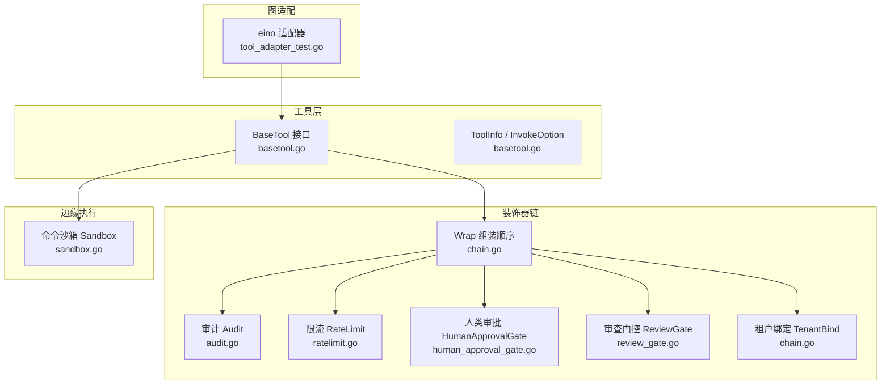
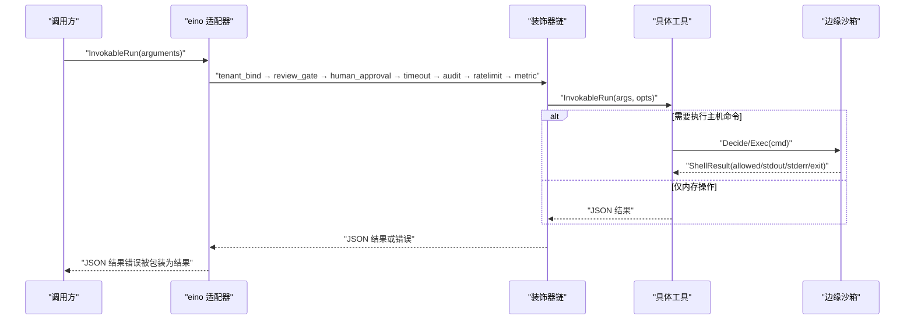
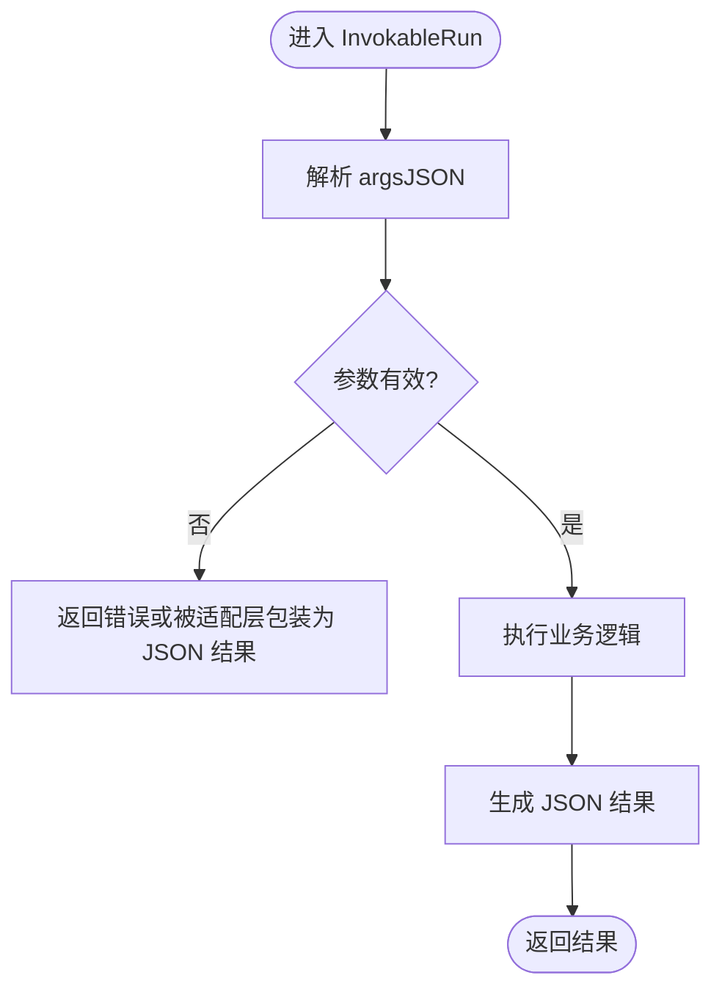
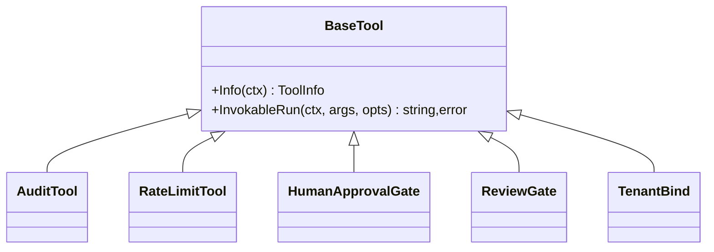
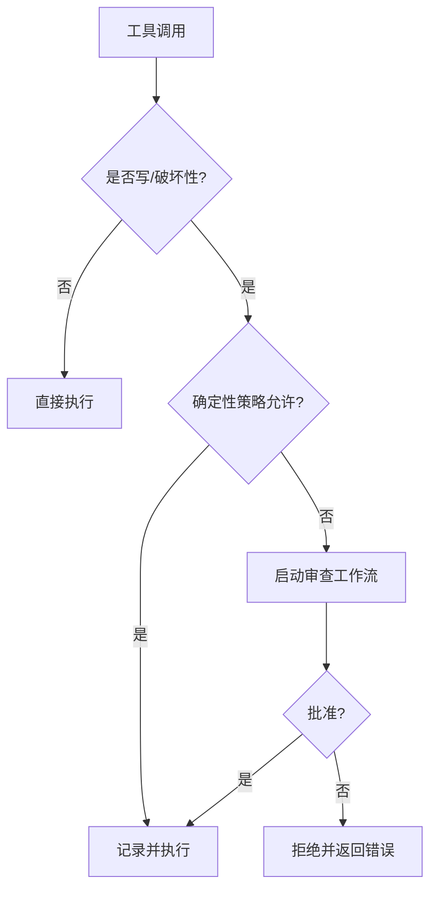
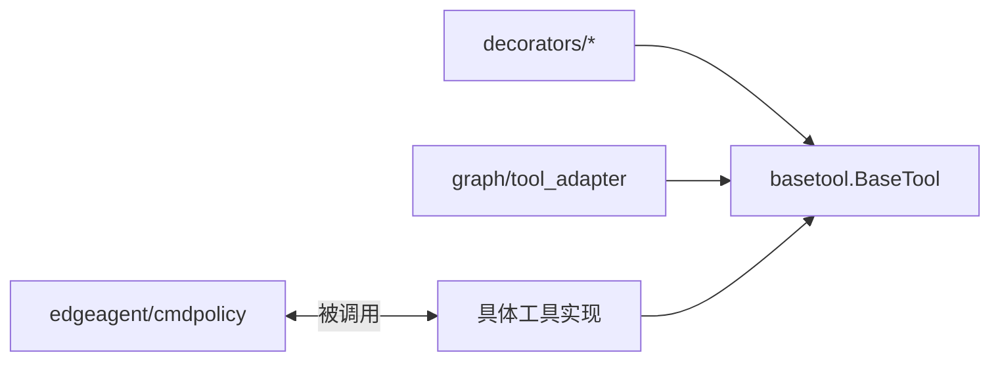
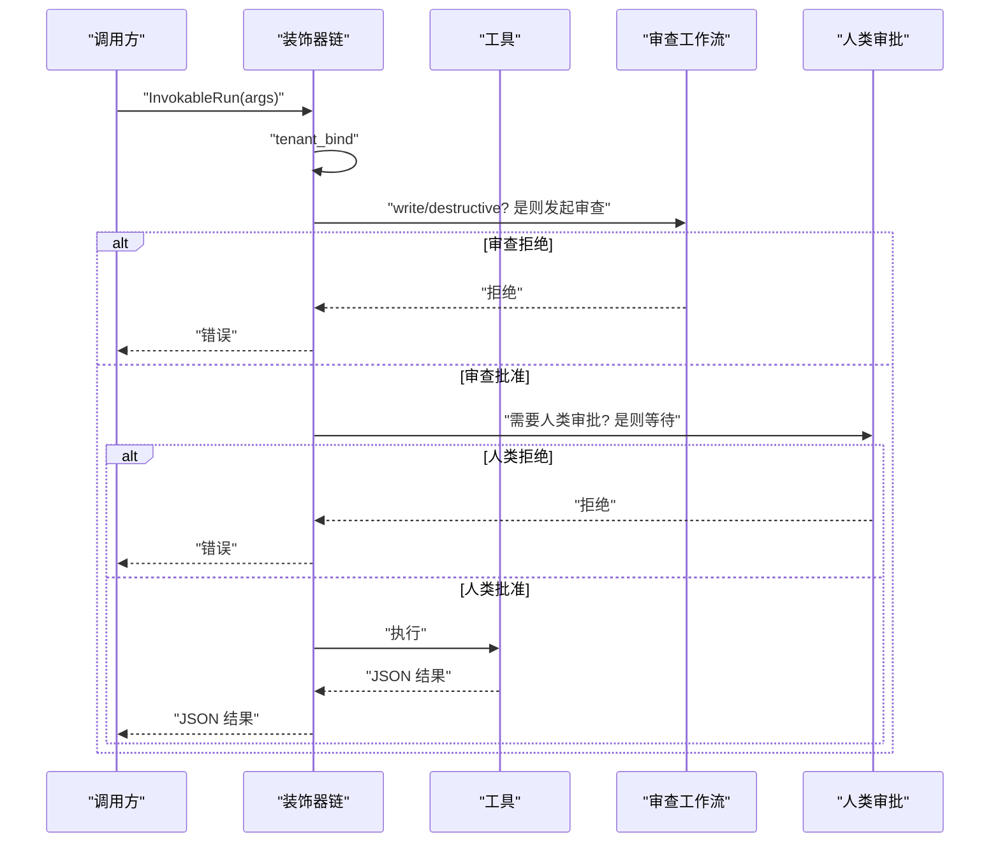

# 基类设计模式

<cite>
**本文引用的文件**
- [basetool.go](file://internal/manager/biz/aiops/tools/basetool/basetool.go)
- [host_write.go](file://internal/manager/biz/aiops/tools/basetool/host_write.go)
- [chain.go](file://internal/manager/biz/aiops/tools/decorators/chain.go)
- [audit.go](file://internal/manager/biz/aiops/tools/decorators/audit.go)
- [ratelimit.go](file://internal/manager/biz/aiops/tools/decorators/ratelimit.go)
- [human_approval_gate.go](file://internal/manager/biz/aiops/tools/decorators/human_approval_gate.go)
- [review_gate.go](file://internal/manager/biz/aiops/tools/decorators/review_gate.go)
- [tool_adapter_test.go](file://internal/manager/biz/aiops/graph/tool_adapter_test.go)
- [tool_search_tool.go](file://internal/manager/biz/aiops/tools/tool_search_tool.go)
- [sandbox.go](file://internal/edgeagent/cmdpolicy/sandbox.go)
</cite>

## 目录
1. [简介](#简介)
2. [项目结构](#项目结构)
3. [核心组件](#核心组件)
4. [架构总览](#架构总览)
5. [详细组件分析](#详细组件分析)
6. [依赖关系分析](#依赖关系分析)
7. [性能考量](#性能考量)
8. [故障排查指南](#故障排查指南)
9. [结论](#结论)
10. [附录：扩展与示例](#附录：扩展与示例)

## 简介
本文件系统化梳理 ongrid 的“工具基类 + 装饰器链”设计，围绕 BaseTool 抽象、参数绑定、结果处理、错误策略、审计/限流/审批门控等横切能力、会话上下文传递与安全边界（主机写入限制、命令执行沙箱、访问控制）展开。目标是帮助读者在不深入源码的情况下理解整体机制，并具备扩展 BaseTool 与自定义装饰器的能力。

## 项目结构
- 工具基类与运行时选项定义位于 basetool 包，提供统一的工具接口、元数据模型与调用选项解析。
- 装饰器链在 decorators 包中组合审计、限流、超时、租户绑定、人类审批、审查门控等横切逻辑。
- 图适配层将 eino 工具协议桥接到 BaseTool，统一错误包装为 JSON 结果，避免中断 LLM 对话流。
- 边缘侧命令执行通过 cmdpolicy.Sandbox 实现白名单、路径校验、网络目标白名单与输出截断等安全约束；支持受限执行与管理员直通两种模式。

图表来源
- [basetool.go:30-56](file://internal/manager/biz/aiops/tools/basetool/basetool.go#L30-L56)
- [chain.go:56-131](file://internal/manager/biz/aiops/tools/decorators/chain.go#L56-L131)
- [audit.go:59-121](file://internal/manager/biz/aiops/tools/decorators/audit.go#L59-L121)
- [ratelimit.go:98-135](file://internal/manager/biz/aiops/tools/decorators/ratelimit.go#L98-L135)
- [human_approval_gate.go:45-83](file://internal/manager/biz/aiops/tools/decorators/human_approval_gate.go#L45-L83)
- [review_gate.go:220-350](file://internal/manager/biz/aiops/tools/decorators/review_gate.go#L220-L350)
- [tool_adapter_test.go:372-406](file://internal/manager/biz/aiops/graph/tool_adapter_test.go#L372-L406)
- [sandbox.go:140-253](file://internal/edgeagent/cmdpolicy/sandbox.go#L140-L253)

章节来源
- [basetool.go:30-56](file://internal/manager/biz/aiops/tools/basetool/basetool.go#L30-L56)
- [chain.go:56-131](file://internal/manager/biz/aiops/tools/decorators/chain.go#L56-L131)

## 核心组件
- BaseTool 接口：统一 Info() 与 InvokableRun() 契约，前者声明参数 Schema、分类与用途提示；后者接收 JSON 参数与可选调用选项，返回 JSON 结果或错误。
- ToolInfo：描述工具名称、描述、使用场景、参数 Schema、影响类别（read/write/destructive）、确认策略与来源标记。
- InvokeOption/Resolved：以函数式选项注入租户、用户、设备、用户原文、主机写入权限、已确认设备列表、人类审批标记等跨切面信息。
- 装饰器链：按固定顺序组合租户绑定、审查门控、人类审批、超时、审计、限流、指标采集，保证横切关注点一致且可测试。
- 图适配：将 eino 工具协议桥接至 BaseTool，并将工具错误包装为 JSON 结果，使 LLM 能消费失败并自愈。
- 边缘沙箱：对命令执行进行白名单、路径校验、网络目标白名单与输出截断，并提供受限执行与管理员直通模式。

章节来源
- [basetool.go:30-259](file://internal/manager/biz/aiops/tools/basetool/basetool.go#L30-L259)
- [chain.go:56-131](file://internal/manager/biz/aiops/tools/decorators/chain.go#L56-L131)
- [tool_adapter_test.go:372-406](file://internal/manager/biz/aiops/graph/tool_adapter_test.go#L372-L406)
- [sandbox.go:140-253](file://internal/edgeagent/cmdpolicy/sandbox.go#L140-L253)

## 架构总览
下图展示一次工具调用的完整链路：请求进入图适配层后，经装饰器链依次执行租户绑定、审查门控、人类审批、超时、审计、限流与指标采集，最终到达具体工具实现；若涉及主机命令，则进入边缘沙箱进行策略校验与执行。

图表来源
- [chain.go:56-131](file://internal/manager/biz/aiops/tools/decorators/chain.go#L56-L131)
- [tool_adapter_test.go:372-406](file://internal/manager/biz/aiops/graph/tool_adapter_test.go#L372-L406)
- [sandbox.go:140-253](file://internal/edgeagent/cmdpolicy/sandbox.go#L140-L253)

## 详细组件分析

### BaseTool 抽象与参数绑定
- 接口契约：Info() 纯读，用于暴露 Schema 与分类；InvokableRun() 负责解析 argsJSON 并返回 JSON 结果。
- 参数绑定：工具通过 JSON Schema 声明参数，调用端由图适配层或上游解析为 JSON；工具内部按需反序列化为结构化参数。
- 选项注入：InvokeOption 提供 WithTenant/WithUserID/WithDeviceID/WithUserText/WithHostWritePermission/WithConfirmedDeviceIDs/WithHumanApproval 等，供装饰器与工具读取。
- 错误策略：工具错误通常作为 Go error 返回；图适配层会将错误转为 JSON 结果，避免中断 LLM 对话流。

图表来源
- [basetool.go:30-56](file://internal/manager/biz/aiops/tools/basetool/basetool.go#L30-L56)
- [tool_adapter_test.go:372-406](file://internal/manager/biz/aiops/graph/tool_adapter_test.go#L372-L406)

章节来源
- [basetool.go:30-259](file://internal/manager/biz/aiops/tools/basetool/basetool.go#L30-L259)
- [tool_adapter_test.go:372-406](file://internal/manager/biz/aiops/graph/tool_adapter_test.go#L372-L406)

### 装饰器模式与标准链
- 标准顺序：tenant_bind → review_gate → human_approval → timeout → audit → ratelimit → metric。
- 设计要点：
  - tenant_bind 最外层，确保后续层看到正确的租户/用户上下文。
  - review_gate 在 timeout 之外，因为审查流程本身有独立超时预算。
  - audit 在 ratelimit 之前，以便记录被限流的拒绝尝试。
  - metric 最内层，只统计真实工具耗时。
- 各装饰器职责：
  - 审计：记录开始/结束事件，不阻塞工具成功。
  - 限流：按 (工具名, 用户) 维度令牌桶限流，超限快速失败。
  - 人类审批：根据 ToolInfo.Confirmation 与 Class 决定是否走持久化审批卡。
  - 审查门控：对 write/destructive 工具进行确定性策略放行或触发审查工作流。
  - 租户绑定：从上下文解析租户并注入到后续层。

图表来源
- [chain.go:56-131](file://internal/manager/biz/aiops/tools/decorators/chain.go#L56-L131)
- [audit.go:59-121](file://internal/manager/biz/aiops/tools/decorators/audit.go#L59-L121)
- [ratelimit.go:98-135](file://internal/manager/biz/aiops/tools/decorators/ratelimit.go#L98-L135)
- [human_approval_gate.go:45-83](file://internal/manager/biz/aiops/tools/decorators/human_approval_gate.go#L45-L83)
- [review_gate.go:220-350](file://internal/manager/biz/aiops/tools/decorators/review_gate.go#L220-L350)

章节来源
- [chain.go:56-131](file://internal/manager/biz/aiops/tools/decorators/chain.go#L56-L131)
- [audit.go:59-121](file://internal/manager/biz/aiops/tools/decorators/audit.go#L59-L121)
- [ratelimit.go:98-135](file://internal/manager/biz/aiops/tools/decorators/ratelimit.go#L98-L135)
- [human_approval_gate.go:45-83](file://internal/manager/biz/aiops/tools/decorators/human_approval_gate.go#L45-L83)
- [review_gate.go:220-350](file://internal/manager/biz/aiops/tools/decorators/review_gate.go#L220-L350)

### 审计装饰器
- 作用：在工具执行前后记录开始/结束事件，包含工具名、参数、租户、用户、设备、时间戳与耗时。
- 行为：OnToolStart 失败会中止调用；OnToolEnd 失败不影响工具结果，仅日志上报。
- 适用：所有工具调用，便于追踪与排障。

章节来源
- [audit.go:59-121](file://internal/manager/biz/aiops/tools/decorators/audit.go#L59-L121)

### 限流装饰器
- 作用：基于 (工具名, 用户) 维度的令牌桶限流，默认每分钟若干次，超限返回特定错误。
- 行为：非阻塞检查，拒绝时立即返回错误，不触发下游工具。
- 配置：可通过注入 Limiter 替换默认实现或关闭。

章节来源
- [ratelimit.go:14-135](file://internal/manager/biz/aiops/tools/decorators/ratelimit.go#L14-L135)

### 人类审批门控装饰器
- 作用：当 ToolInfo.Confirmation 要求或敏感写操作时，进入持久化审批流程；已通过的人类审批标记可直接放行。
- 行为：未安装审批器时返回特定错误；通过后追加 HumanApproved 选项再执行。
- 适用：需要人工确认的写/破坏性操作或显式 required 的工具。

章节来源
- [human_approval_gate.go:13-107](file://internal/manager/biz/aiops/tools/decorators/human_approval_gate.go#L13-L107)

### 审查门控装饰器
- 作用：对 write/destructive 工具进行门控，优先尝试确定性策略放行，否则启动审查工作流，解析“Decision: approve|reject”。
- 行为：未安装审查器或审查失败均视为拒绝；批准后继续执行并记录执行完成。
- 适用：变更类操作的安全双签。

章节来源
- [review_gate.go:15-350](file://internal/manager/biz/aiops/tools/decorators/review_gate.go#L15-L350)

### 会话管理与上下文传递
- 上下文键：通过 InvokeOption 注入租户、用户、设备、用户原文、主机写入权限、已确认设备列表与人类审批标记。
- 会话关联：审查门控与会话 ID 关联，便于追踪提案与执行。
- 资源清理：审计与指标采集在工具结束后执行，确保即使异常也能记录。

章节来源
- [basetool.go:134-259](file://internal/manager/biz/aiops/tools/basetool/basetool.go#L134-L259)
- [review_gate.go:400-405](file://internal/manager/biz/aiops/tools/decorators/review_gate.go#L400-L405)

### 权限控制与安全边界
- 主机写入限制：通过 WithHostWritePermission 注入全局写门控；开启后 host_bash 可使用不受 cmdpolicy 限制的直通路径，但 mutating 命令仍需审批。
- 命令执行沙箱：cmdpolicy.Sandbox 提供白名单二进制、路径校验、网络目标白名单、输出截断与管道执行；支持受限执行与管理员直通。
- 访问控制检查：限流装饰器按用户维度节流；审计记录用户与设备；审查门控对写/破坏性操作强制双签。

图表来源
- [review_gate.go:220-350](file://internal/manager/biz/aiops/tools/decorators/review_gate.go#L220-L350)
- [sandbox.go:140-253](file://internal/edgeagent/cmdpolicy/sandbox.go#L140-L253)
- [host_write.go:17-42](file://internal/manager/biz/aiops/tools/basetool/host_write.go#L17-L42)

章节来源
- [host_write.go:17-42](file://internal/manager/biz/aiops/tools/basetool/host_write.go#L17-L42)
- [sandbox.go:140-253](file://internal/edgeagent/cmdpolicy/sandbox.go#L140-L253)
- [review_gate.go:220-350](file://internal/manager/biz/aiops/tools/decorators/review_gate.go#L220-L350)

## 依赖关系分析
- 低耦合：装饰器仅依赖 basetool 接口，不感知具体工具实现；工具也无需关心横切逻辑。
- 可扩展：新增装饰器只需实现 BaseTool 并在 chain.Wrap 中插入顺序即可。
- 外部依赖：Prometheus 指标、golang.org/x/time/rate 限流、eino 工具协议适配。

图表来源
- [chain.go:56-131](file://internal/manager/biz/aiops/tools/decorators/chain.go#L56-L131)
- [basetool.go:30-56](file://internal/manager/biz/aiops/tools/basetool/basetool.go#L30-L56)
- [tool_search_tool.go:51-91](file://internal/manager/biz/aiops/tools/tool_search_tool.go#L51-L91)
- [sandbox.go:140-253](file://internal/edgeagent/cmdpolicy/sandbox.go#L140-L253)

章节来源
- [chain.go:56-131](file://internal/manager/biz/aiops/tools/decorators/chain.go#L56-L131)
- [basetool.go:30-56](file://internal/manager/biz/aiops/tools/basetool/basetool.go#L30-L56)
- [tool_search_tool.go:51-91](file://internal/manager/biz/aiops/tools/tool_search_tool.go#L51-L91)

## 性能考量
- 装饰器顺序优化：metric 最内层避免统计装饰器开销；timeout 包裹审计以保证超时也被记录；audit 在限流前以记录拒绝。
- 限流策略：按 (工具, 用户) 分桶，避免单用户风暴；默认速率经验值平衡并发与后端压力。
- 输出截断：命令执行输出上限防止大响应拖慢 LLM 与网络。
- 审查超时：审查工作流拥有独立超时，避免与工具超时互相干扰。

[本节为通用指导，不直接分析具体文件]

## 故障排查指南
- 工具报错被包装为 JSON：检查图适配层是否正确将错误转为结果，避免对话中断。
- 限流触发：确认用户维度与工具维度配额，必要时调整 Limiter 配置。
- 审查拒绝：查看审查输出中的 Decision 行与理由，定位策略或参数问题。
- 主机命令被拒：检查 cmdpolicy 白名单、路径校验与网络目标白名单；确认是否启用了管理员直通。
- 审计缺失：确认 AuditSink 已正确注入，且 OnToolStart/OnToolEnd 未被上层拦截。

章节来源
- [tool_adapter_test.go:372-406](file://internal/manager/biz/aiops/graph/tool_adapter_test.go#L372-L406)
- [ratelimit.go:98-135](file://internal/manager/biz/aiops/tools/decorators/ratelimit.go#L98-L135)
- [review_gate.go:220-350](file://internal/manager/biz/aiops/tools/decorators/review_gate.go#L220-L350)
- [sandbox.go:140-253](file://internal/edgeagent/cmdpolicy/sandbox.go#L140-L253)

## 结论
通过 BaseTool 抽象与标准化装饰器链，ongrid 实现了高内聚、低耦合的工具体系：参数与选项清晰、横切能力可插拔、错误与观测一致、安全边界明确。结合审查门控与人类审批，系统在保证灵活性的同时强化了变更安全；边缘沙箱进一步收敛了命令执行风险。该模式易于扩展与维护，适合复杂 AI 工具生态。

[本节为总结，不直接分析具体文件]

## 附录：扩展与示例

### 如何扩展 BaseTool
- 实现 Info()：声明 Name、Description、WhenToUse、Parameters(JSON Schema)、Class(read/write/destructive)、Confirmation 与 Origin。
- 实现 InvokableRun()：解析 argsJSON，执行业务逻辑，返回 JSON 字符串或错误。
- 使用装饰器链：通过 chain.Wrap 将工具接入标准横切能力。

参考路径
- [basetool.go:30-259](file://internal/manager/biz/aiops/tools/basetool/basetool.go#L30-L259)
- [chain.go:56-131](file://internal/manager/biz/aiops/tools/decorators/chain.go#L56-L131)

### 如何实现自定义装饰器
- 实现 BaseTool 包装：在 Info() 透传，在 InvokableRun() 中插入横切逻辑（如鉴权、埋点、重试）。
- 加入标准链：在 chain.Wrap 中按语义顺序插入新装饰器。
- 遵循错误策略：装饰器不应吞掉业务错误，除非是 best-effort 的观测型副作用。

参考路径
- [audit.go:59-121](file://internal/manager/biz/aiops/tools/decorators/audit.go#L59-L121)
- [ratelimit.go:98-135](file://internal/manager/biz/aiops/tools/decorators/ratelimit.go#L98-L135)
- [chain.go:56-131](file://internal/manager/biz/aiops/tools/decorators/chain.go#L56-L131)

### 典型调用序列（含审查与人类审批）

图表来源
- [review_gate.go:220-350](file://internal/manager/biz/aiops/tools/decorators/review_gate.go#L220-L350)
- [human_approval_gate.go:45-83](file://internal/manager/biz/aiops/tools/decorators/human_approval_gate.go#L45-L83)
- [chain.go:56-131](file://internal/manager/biz/aiops/tools/decorators/chain.go#L56-L131)