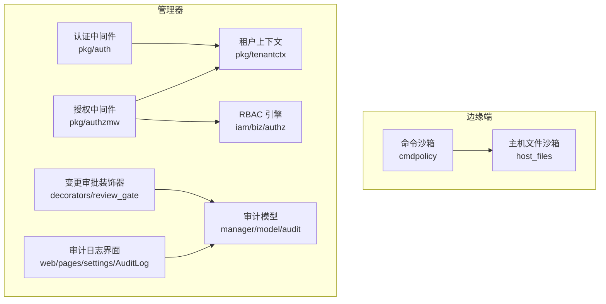
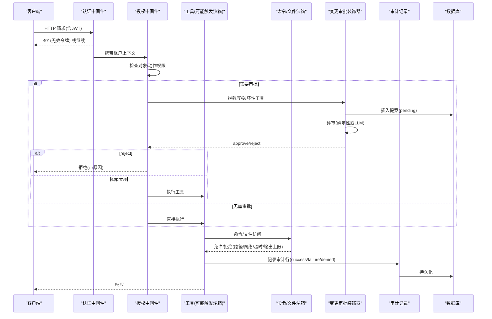
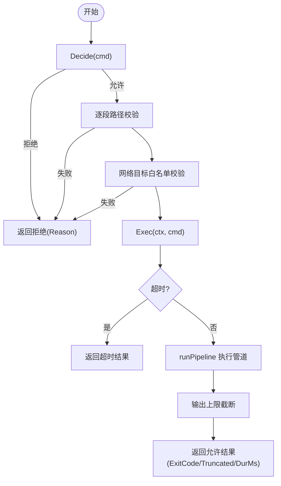
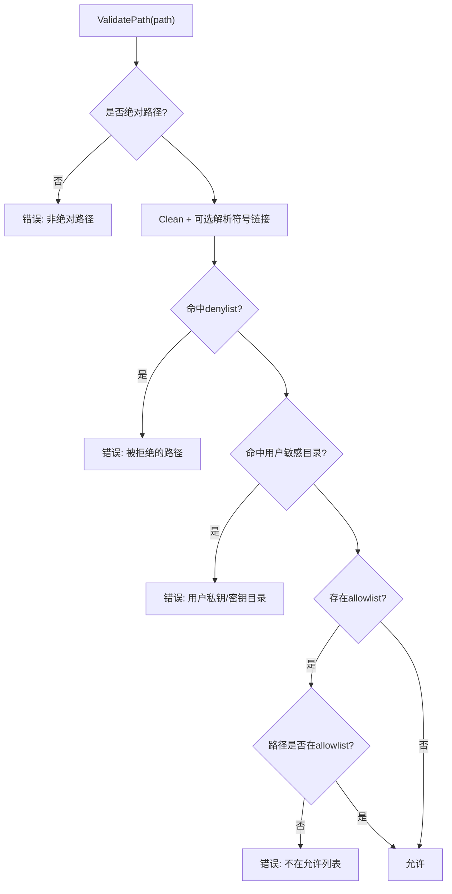
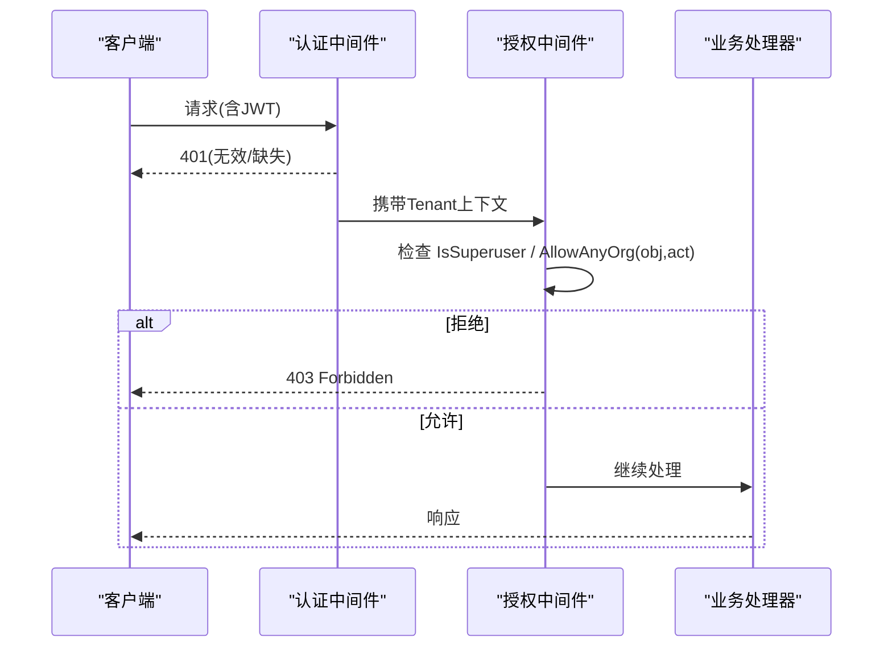
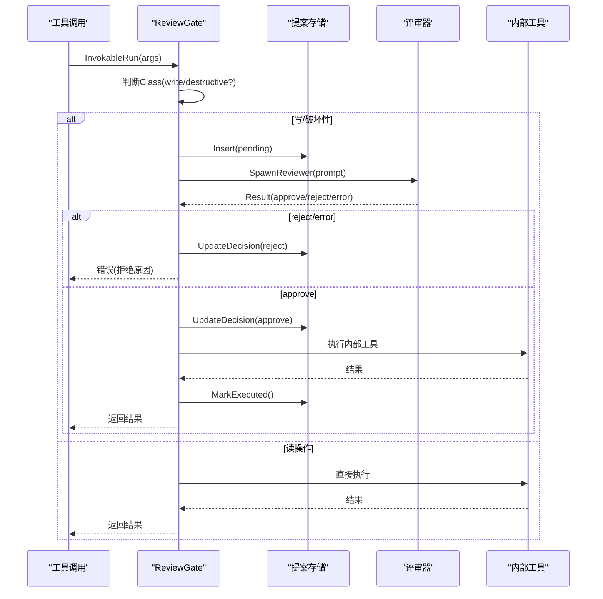
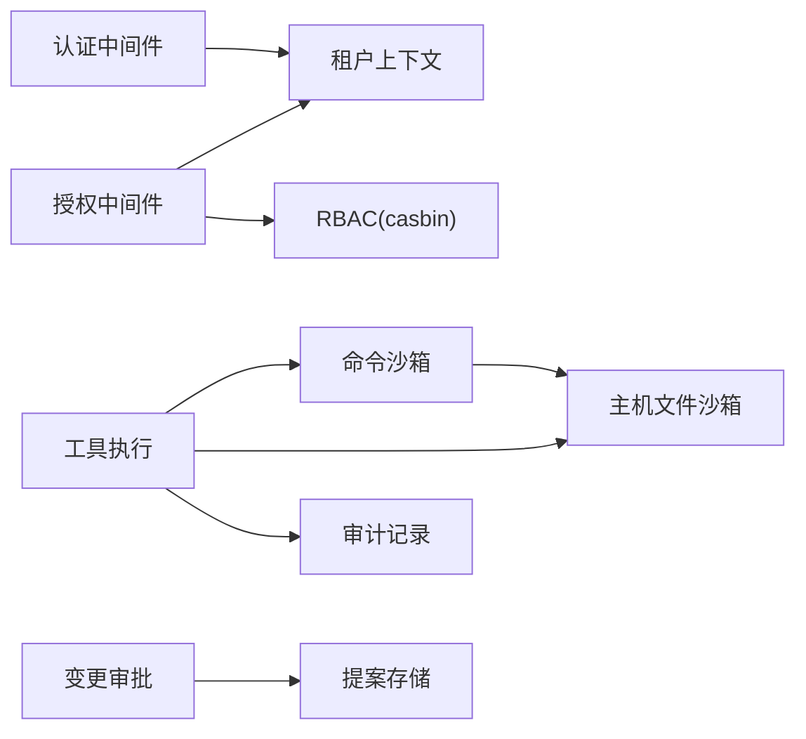

# 安全与审计机制

<cite>
**本文引用的文件**
- [sandbox.go](file://internal/edgeagent/cmdpolicy/sandbox.go)
- [sandbox.go](file://internal/edgeagent/host_files/sandbox.go)
- [middleware.go](file://internal/pkg/auth/middleware.go)
- [middleware.go](file://internal/pkg/authzmw/middleware.go)
- [tenantctx.go](file://internal/pkg/tenantctx/tenantctx.go)
- [log.go](file://internal/manager/model/audit/log.go)
- [review_gate.go](file://internal/manager/biz/aiops/tools/decorators/review_gate.go)
- [mutating_proposal.go](file://internal/manager/model/aiops/mutating_proposal.go)
- [http.go](file://internal/manager/server/monitor/http.go)
- [authz.go](file://internal/iam/biz/authz/authz.go)
- [model.go](file://internal/iam/model/model.go)
- [AuditLog.tsx](file://web/src/pages/settings/AuditLog.tsx)
</cite>

## 目录
1. [简介](#简介)
2. [项目结构](#项目结构)
3. [核心组件](#核心组件)
4. [架构总览](#架构总览)
5. [详细组件分析](#详细组件分析)
6. [依赖关系分析](#依赖关系分析)
7. [性能考虑](#性能考虑)
8. [故障排查指南](#故障排查指南)
9. [结论](#结论)
10. [附录](#附录)

## 简介
本文件系统性阐述 OnGrid 的安全与审计机制，覆盖以下关键主题：
- 工具系统的安全边界：主机文件访问控制、命令执行沙箱、网络请求过滤
- 审计日志记录：操作追踪、用户行为分析、合规性报告
- 人工审批流程：变更提案、审批决策、执行控制
- 权限模型：RBAC 集成、租户隔离、操作授权
- 安全配置最佳实践与常见威胁防护
- 代码级示例路径（以“章节来源”标注具体文件与行号）

## 项目结构
与安全与审计相关的关键模块分布在如下位置：
- 边缘端工具沙箱与策略：internal/edgeagent/cmdpolicy、internal/edgeagent/host_files
- 认证与授权中间件：internal/pkg/auth、internal/pkg/authzmw、internal/pkg/tenantctx
- 审计数据模型与前端展示：internal/manager/model/audit、web/src/pages/settings/AuditLog.tsx
- 变更审批与提案：internal/manager/biz/aiops/tools/decorators/review_gate.go、internal/manager/model/aiops/mutating_proposal.go
- IAM 与 RBAC：internal/iam/biz/authz、internal/iam/model

图表来源
- [sandbox.go:17-38](file://internal/edgeagent/cmdpolicy/sandbox.go#L17-L38)
- [sandbox.go:152-193](file://internal/edgeagent/host_files/sandbox.go#L152-L193)
- [middleware.go:21-53](file://internal/pkg/auth/middleware.go#L21-L53)
- [middleware.go:70-97](file://internal/pkg/authzmw/middleware.go#L70-L97)
- [tenantctx.go:13-35](file://internal/pkg/tenantctx/tenantctx.go#L13-L35)
- [review_gate.go:235-350](file://internal/manager/biz/aiops/tools/decorators/review_gate.go#L235-L350)
- [log.go:10-47](file://internal/manager/model/audit/log.go#L10-L47)
- [AuditLog.tsx:131-231](file://web/src/pages/settings/AuditLog.tsx#L131-L231)
- [authz.go:46-84](file://internal/iam/biz/authz/authz.go#L46-L84)

章节来源
- [sandbox.go:17-38](file://internal/edgeagent/cmdpolicy/sandbox.go#L17-L38)
- [sandbox.go:152-193](file://internal/edgeagent/host_files/sandbox.go#L152-L193)
- [middleware.go:21-53](file://internal/pkg/auth/middleware.go#L21-L53)
- [middleware.go:70-97](file://internal/pkg/authzmw/middleware.go#L70-L97)
- [tenantctx.go:13-35](file://internal/pkg/tenantctx/tenantctx.go#L13-L35)
- [review_gate.go:235-350](file://internal/manager/biz/aiops/tools/decorators/review_gate.go#L235-L350)
- [log.go:10-47](file://internal/manager/model/audit/log.go#L10-L47)
- [AuditLog.tsx:131-231](file://web/src/pages/settings/AuditLog.tsx#L131-L231)
- [authz.go:46-84](file://internal/iam/biz/authz/authz.go#L46-L84)

## 核心组件
- 命令执行沙箱（cmdpolicy）：对命令进行白名单、路径校验、网络目标白名单、超时与输出截断等限制，提供 Decide/Exec/ExecRaw 能力。
- 主机文件沙箱（host_files）：通过 denylist + optional allowlist 控制读路径，仅允许受信任二进制（find/du/stat/ls），防止越权读取敏感目录。
- 认证中间件（pkg/auth）：解析 Bearer Token / WebSocket token，验证 JWT，将租户信息写入上下文。
- 授权中间件（pkg/authzmw）：基于 casbin 的 RBAC 鉴权，支持超管短路放行与对象/动作粒度控制。
- 租户上下文（pkg/tenantctx）：在请求上下文中携带用户身份、角色、是否超管等信息，供下游服务与审计使用。
- 审计模型（manager/model/audit）：定义审计日志表结构与标准动作/资源类型常量，用于持久化“谁在何时做了什么”。
- 变更审批（decorators/review_gate）：拦截写/破坏性工具调用，支持确定性审批或 LLM 评审，记录提案并控制执行。
- 提案模型（manager/model/aiops/mutating_proposal）：存储变更提案、评审结果、执行时间戳等。
- 审计日志前端（web/pages/settings/AuditLog）：提供筛选、分页、详情查看等能力。

章节来源
- [sandbox.go:17-38](file://internal/edgeagent/cmdpolicy/sandbox.go#L17-L38)
- [sandbox.go:152-193](file://internal/edgeagent/host_files/sandbox.go#L152-L193)
- [middleware.go:21-53](file://internal/pkg/auth/middleware.go#L21-L53)
- [middleware.go:70-97](file://internal/pkg/authzmw/middleware.go#L70-L97)
- [tenantctx.go:13-35](file://internal/pkg/tenantctx/tenantctx.go#L13-L35)
- [log.go:10-47](file://internal/manager/model/audit/log.go#L10-L47)
- [review_gate.go:235-350](file://internal/manager/biz/aiops/tools/decorators/review_gate.go#L235-L350)
- [mutating_proposal.go:69-128](file://internal/manager/model/aiops/mutating_proposal.go#L69-L128)
- [AuditLog.tsx:131-231](file://web/src/pages/settings/AuditLog.tsx#L131-L231)

## 架构总览
下图展示了从请求进入、认证、授权、工具执行到审计记录的完整链路，以及边缘端命令/文件沙箱如何限制实际系统调用。

图表来源
- [middleware.go:21-53](file://internal/pkg/auth/middleware.go#L21-L53)
- [middleware.go:70-97](file://internal/pkg/authzmw/middleware.go#L70-L97)
- [review_gate.go:235-350](file://internal/manager/biz/aiops/tools/decorators/review_gate.go#L235-L350)
- [sandbox.go:76-188](file://internal/edgeagent/cmdpolicy/sandbox.go#L76-L188)
- [sandbox.go:152-193](file://internal/edgeagent/host_files/sandbox.go#L152-L193)
- [log.go:10-47](file://internal/manager/model/audit/log.go#L10-L47)

## 详细组件分析

### 命令执行沙箱（cmdpolicy）
- 设计要点
  - 白名单二进制与类分类：仅允许配置中的二进制；对网络类命令进行目标主机白名单校验。
  - 路径校验：所有 argv 中以“/”开头的参数均通过 PathValidator 校验，防止越界路径。
  - 网络目标白名单：支持精确匹配、后缀匹配（如“.internal”）、CIDR（如“10.0.0.0/8”）。
  - 管道执行：多段命令通过 stdin/stdout 管道串联，统一超时与输出上限。
  - ExecRaw 逃生门：仅在管理员开启“允许 Agent 写操作”时绕过白名单与语法限制，但仍受超时与输出上限保护。
- 典型流程
  - Decide：先走 Policy 判定，再路径校验，再网络目标校验。
  - Exec：若允许则启动进程组，捕获 stdout/stderr，处理超时与错误。
  - runPipeline：按段启动子进程，连接管道，收集最后一段退出码与输出。

图表来源
- [sandbox.go:76-188](file://internal/edgeagent/cmdpolicy/sandbox.go#L76-L188)
- [sandbox.go:260-342](file://internal/edgeagent/cmdpolicy/sandbox.go#L260-L342)
- [sandbox.go:428-549](file://internal/edgeagent/cmdpolicy/sandbox.go#L428-L549)

章节来源
- [sandbox.go:76-188](file://internal/edgeagent/cmdpolicy/sandbox.go#L76-L188)
- [sandbox.go:260-342](file://internal/edgeagent/cmdpolicy/sandbox.go#L260-L342)
- [sandbox.go:428-549](file://internal/edgeagent/cmdpolicy/sandbox.go#L428-L549)

### 主机文件沙箱（host_files）
- 设计要点
  - 默认 denylist：禁止虚拟文件系统（/proc、/sys、/dev、/run）与高敏感文件（/etc/shadow、/root/.ssh 等）。
  - 可选 allowlist：当设置 AllowedReadPaths 时，路径必须同时命中 allowlist。
  - 符号链接安全：优先尝试 EvalSymlinks 解析后再比对 denylist/allowlist，防止软链逃逸。
  - 二进制白名单：仅允许 find/du/df/stat/ls 等受控命令，缺失时优雅降级。
- 典型流程
  - ValidatePath：绝对路径校验 → denylist 检查 → per-user 敏感目录检查 → optional allowlist 检查。
  - ResolveBinary：按短名查找已解析的绝对路径，未在白名单中则报错。

图表来源
- [sandbox.go:152-193](file://internal/edgeagent/host_files/sandbox.go#L152-L193)
- [sandbox.go:246-281](file://internal/edgeagent/host_files/sandbox.go#L246-L281)

章节来源
- [sandbox.go:152-193](file://internal/edgeagent/host_files/sandbox.go#L152-L193)
- [sandbox.go:246-281](file://internal/edgeagent/host_files/sandbox.go#L246-L281)

### 认证与授权（pkg/auth 与 pkg/authzmw）
- 认证中间件
  - 支持 Authorization: Bearer 与 ?token= 两种来源（WebSocket 兼容）。
  - 验证 JWT 后将 Tenant 注入上下文，包含 UserID、Email、Role、IsSuperuser。
- 授权中间件
  - 基于 casbin 的 RBAC，支持对象/动作维度授权。
  - 超管短路放行；未配置 Authorizer 时回退为放行（兼容旧部署）。
  - 拒绝时记录日志并返回 403。

图表来源
- [middleware.go:21-53](file://internal/pkg/auth/middleware.go#L21-L53)
- [middleware.go:70-97](file://internal/pkg/authzmw/middleware.go#L70-L97)

章节来源
- [middleware.go:21-53](file://internal/pkg/auth/middleware.go#L21-L53)
- [middleware.go:70-97](file://internal/pkg/authzmw/middleware.go#L70-L97)

### 租户上下文（pkg/tenantctx）
- 作用：在请求上下文中传递调用者身份（UserID、Email、Role、IsSuperuser），供鉴权、审计、限流等下游组件使用。
- 特性：支持外层中间件通过 slot 机制读取内层中间件写入的 Tenant，避免 WithContext 导致的可见性问题。

章节来源
- [tenantctx.go:13-35](file://internal/pkg/tenantctx/tenantctx.go#L13-L35)
- [tenantctx.go:51-87](file://internal/pkg/tenantctx/tenantctx.go#L51-L87)

### 审计日志（manager/model/audit）
- 字段设计：包含发生时间、用户标识、角色、IP、UA、动作、资源类型/ID/名称、状态、错误码/信息、负载 JSON、请求 ID、创建时间。
- 状态枚举：success、failure、denied。
- 动作与资源类型：采用扁平命名约定，便于 UI 筛选与聚合；敏感值由上游在序列化前脱敏。

章节来源
- [log.go:10-47](file://internal/manager/model/audit/log.go#L10-L47)
- [log.go:53-135](file://internal/manager/model/audit/log.go#L53-L135)

### 变更审批流程（decorators/review_gate）
- 触发条件：工具 Class 为 write 或 destructive 时拦截。
- 审批模式
  - 确定性审批：特定场景（如告警规则创建）满足严格约束时自动批准。
  - LLM 评审：生成评审提示词，等待评审结果，解析 Decision: approve|reject。
- 提案记录：在拦截时插入 pending 提案，评审后更新 decision，执行后标记 executed_at。
- 安全默认：评审系统不可用时拒绝执行，避免无审查变更。

图表来源
- [review_gate.go:235-350](file://internal/manager/biz/aiops/tools/decorators/review_gate.go#L235-L350)
- [mutating_proposal.go:69-128](file://internal/manager/model/aiops/mutating_proposal.go#L69-L128)

章节来源
- [review_gate.go:235-350](file://internal/manager/biz/aiops/tools/decorators/review_gate.go#L235-L350)
- [mutating_proposal.go:69-128](file://internal/manager/model/aiops/mutating_proposal.go#L69-L128)

### 权限模型与 RBAC（iam/biz/authz）
- 角色与域：支持 org_admin/member/viewer 三类角色，域为组织 ID；超管通过中间件短路放行，不经过 casbin。
- 成员同步：IAM 的成员关系会映射到 casbin_rule，确保策略与真实成员一致。
- 模型与策略：模型配置嵌入包中，启动时加载策略并初始化 Enforcer。

章节来源
- [authz.go:46-84](file://internal/iam/biz/authz/authz.go#L46-L84)
- [model.go:1-21](file://internal/iam/model/model.go#L1-L21)

### 审计日志前端（web/pages/settings/AuditLog）
- 功能：支持按资源类型、状态、用户邮箱、动作等筛选，分页展示，查看详情。
- 交互：清空筛选、状态标签渲染、资源类型标签化显示。

章节来源
- [AuditLog.tsx:131-231](file://web/src/pages/settings/AuditLog.tsx#L131-L231)

## 依赖关系分析
- 组件耦合
  - 命令沙箱依赖 host_files 的路径校验接口，实现单一事实源。
  - 认证中间件向租户上下文注入身份，授权中间件据此做 RBAC 判断。
  - 变更审批装饰器依赖提案存储与评审器，形成“拦截—评审—执行”闭环。
  - 审计模型为跨层共享的数据契约，前后端共同消费。
- 外部依赖
  - casbin 作为 RBAC 引擎，策略存储在数据库中。
  - 数据库用于审计日志与提案持久化。

图表来源
- [sandbox.go:17-38](file://internal/edgeagent/cmdpolicy/sandbox.go#L17-L38)
- [middleware.go:21-53](file://internal/pkg/auth/middleware.go#L21-L53)
- [middleware.go:70-97](file://internal/pkg/authzmw/middleware.go#L70-L97)
- [review_gate.go:235-350](file://internal/manager/biz/aiops/tools/decorators/review_gate.go#L235-L350)
- [log.go:10-47](file://internal/manager/model/audit/log.go#L10-L47)

章节来源
- [sandbox.go:17-38](file://internal/edgeagent/cmdpolicy/sandbox.go#L17-L38)
- [middleware.go:21-53](file://internal/pkg/auth/middleware.go#L21-L53)
- [middleware.go:70-97](file://internal/pkg/authzmw/middleware.go#L70-L97)
- [review_gate.go:235-350](file://internal/manager/biz/aiops/tools/decorators/review_gate.go#L235-L350)
- [log.go:10-47](file://internal/manager/model/audit/log.go#L10-L47)

## 性能考虑
- 命令执行
  - 管道执行与进程组管理减少上下文切换开销；超时与输出上限避免长尾任务影响吞吐。
  - 二进制解析与路径校验为 O(n) 小常数，适合高频调用。
- 审批流程
  - 评审超时独立于工具超时，避免评审阻塞整体 SLA；确定性审批路径零评审开销。
- 审计记录
  - 审计写入为 best-effort，不影响主流程；建议异步落库以提升吞吐。
- 授权判断
  - casbin 策略加载与缓存降低重复计算；超管短路减少不必要判断。

[本节为通用指导，不直接分析具体文件]

## 故障排查指南
- 认证失败
  - 现象：401 Unauthorized
  - 排查：检查 Authorization 头或 ?token= 是否存在且有效；确认 JWT 签名与过期时间。
  - 参考：认证中间件对无效令牌的快速失败路径。
- 授权拒绝
  - 现象：403 Forbidden
  - 排查：确认当前用户角色与目标对象/动作是否匹配；检查 casbin 策略与成员同步。
  - 参考：授权中间件的拒绝日志与短路逻辑。
- 命令/文件访问被拒
  - 现象：命令执行返回拒绝或路径错误
  - 排查：检查命令是否在白名单、路径是否在 denylist/allowlist、网络目标是否在白名单。
  - 参考：命令沙箱 Decide/Exec 与主机文件 ValidatePath。
- 审批失败
  - 现象：写/破坏性工具调用被拒绝
  - 排查：查看提案记录与评审原因；确认是否满足确定性审批条件或评审器可用。
  - 参考：ReviewGate 的提案插入、决策更新与执行标记。
- 审计记录缺失
  - 现象：审计界面无对应条目
  - 排查：确认审计写入是否成功；检查请求 ID 与筛选条件；确认敏感值是否被脱敏导致查询困难。
  - 参考：审计模型字段与前端筛选逻辑。

章节来源
- [http.go:153-195](file://internal/manager/server/monitor/http.go#L153-L195)
- [sandbox.go:76-188](file://internal/edgeagent/cmdpolicy/sandbox.go#L76-L188)
- [sandbox.go:152-193](file://internal/edgeagent/host_files/sandbox.go#L152-L193)
- [review_gate.go:235-350](file://internal/manager/biz/aiops/tools/decorators/review_gate.go#L235-L350)
- [log.go:10-47](file://internal/manager/model/audit/log.go#L10-L47)
- [AuditLog.tsx:131-231](file://web/src/pages/settings/AuditLog.tsx#L131-L231)

## 结论
OnGrid 的安全与审计机制通过多层防御与可观测性设计，实现了：
- 严格的工具执行边界：命令与文件访问均在沙箱内受控，网络出口白名单最小化暴露面。
- 完整的审计追踪：以标准化模型记录“谁在何时做了什么”，支持筛选与合规导出。
- 可控的变更审批：写/破坏性操作需经确定性策略或 LLM 评审，提案全程可追溯。
- 健壮的权限模型：RBAC 与租户上下文结合，支持超管短路、对象/动作粒度控制。
建议在生产环境中结合速率限制、会话管理与敏感信息脱敏策略，进一步提升安全性与合规性。

[本节为总结，不直接分析具体文件]

## 附录
- 安全配置最佳实践
  - 命令沙箱：启用网络目标白名单，限制超时与输出上限；谨慎使用 ExecRaw，仅限管理员明确开启。
  - 主机文件沙箱：保持 denylist 默认；按需启用 allowlist 进一步收敛；定期复核敏感目录。
  - 认证与授权：强制 JWT 校验；启用 RBAC 策略；定期审计成员与角色映射。
  - 审批流程：为高风险工具启用评审；为低风险场景配置确定性审批；监控评审超时与失败率。
  - 审计日志：确保审计写入可靠；定期导出与归档；对敏感字段脱敏。
- 常见威胁与防护
  - 路径穿越/软链逃逸：通过 ValidatePath 解析与 denylist/allowlist 双重校验。
  - 任意命令执行：仅允许白名单二进制；管道执行受超时与输出上限保护。
  - 外联攻击：网络目标白名单（精确/后缀/CIDR）；空列表即全拒绝。
  - 越权访问：RBAC 中间件 + 超管短路；对象/动作粒度控制。
  - 无审查变更：写/破坏性工具默认拦截；评审系统不可用则拒绝。

[本节为通用指导，不直接分析具体文件]