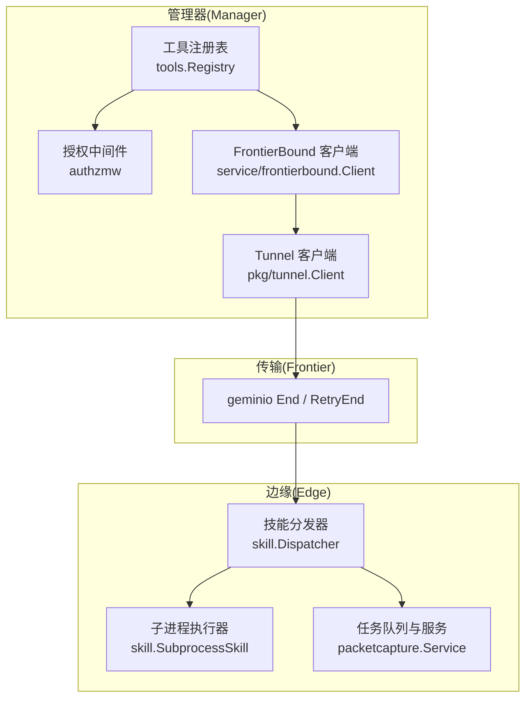
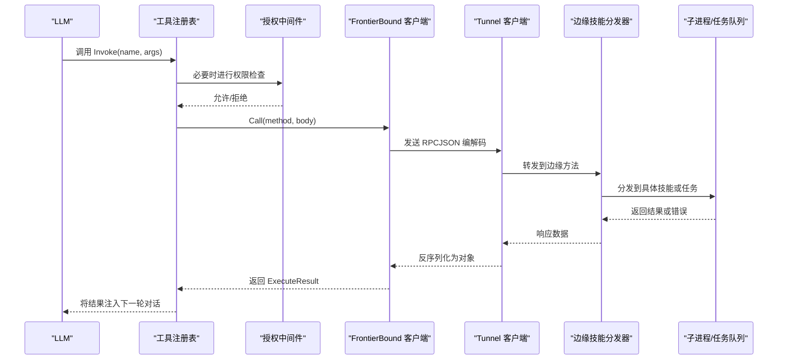
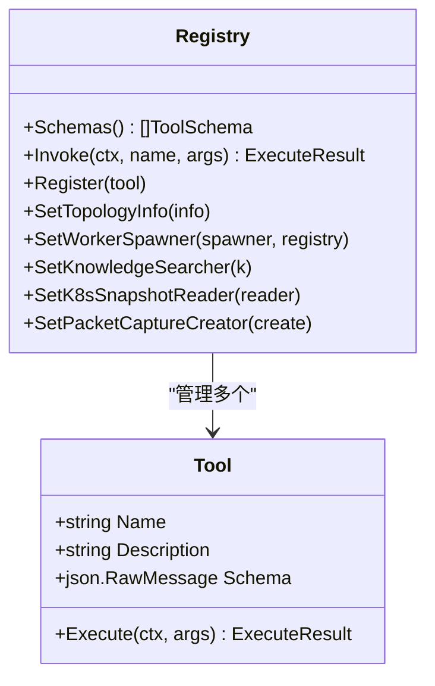
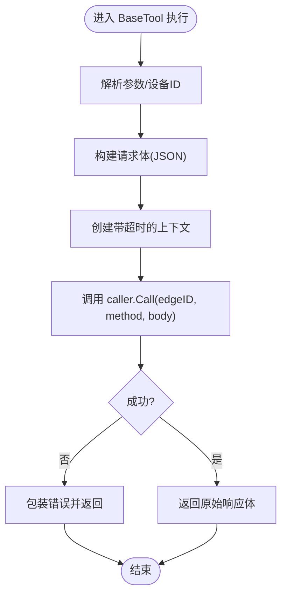
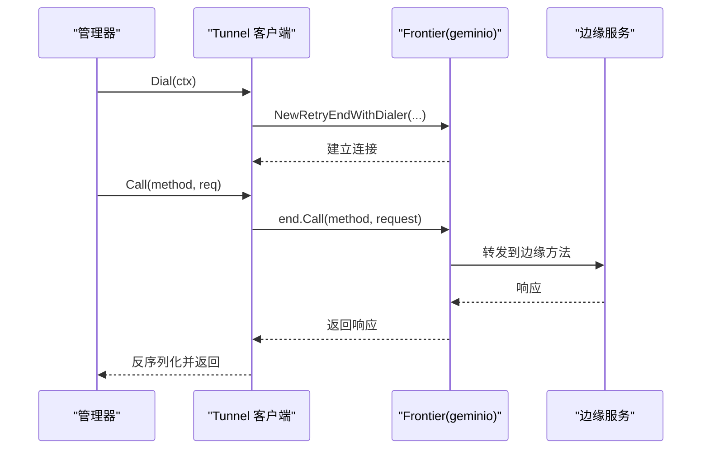
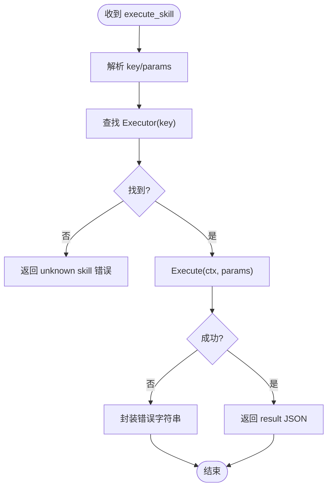
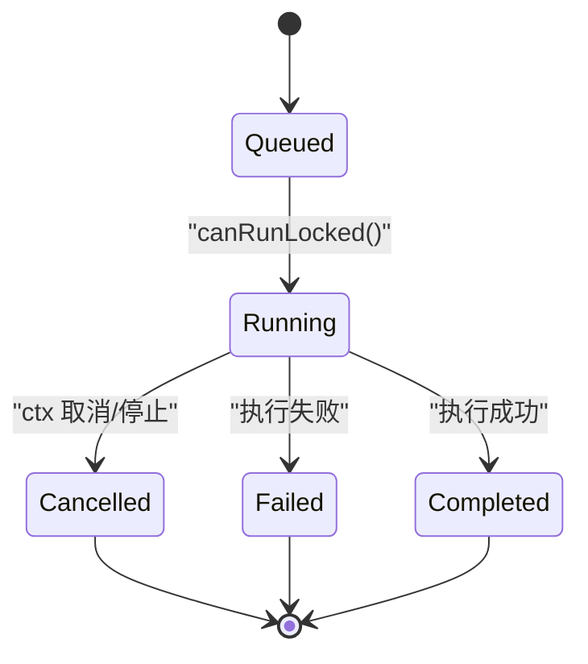
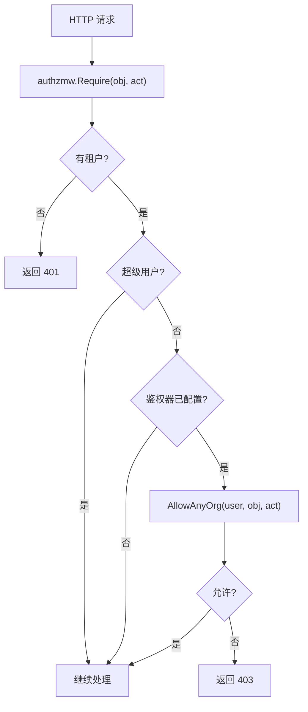
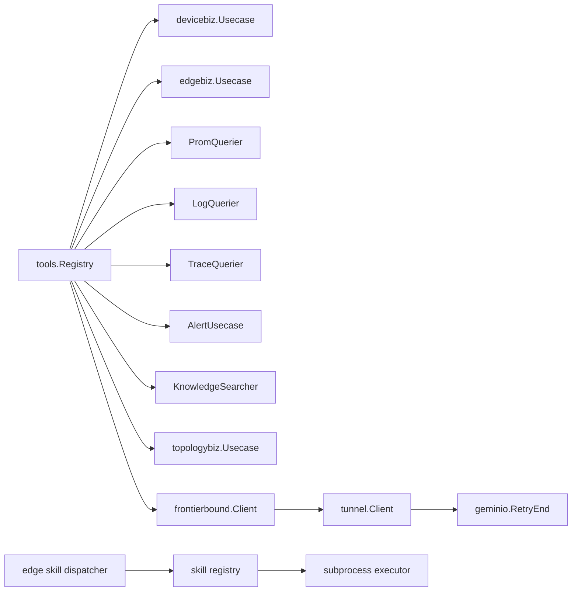

# 工具执行流程

<cite>
**本文引用的文件**
- [internal/manager/biz/aiops/tools/registry.go](file://internal/manager/biz/aiops/tools/registry.go)
- [internal/manager/biz/aiops/tools/host_files_basetool.go](file://internal/manager/biz/aiops/tools/host_files_basetool.go)
- [internal/pkg/tunnel/client.go](file://internal/pkg/tunnel/client.go)
- [internal/edgeagent/skill/dispatcher.go](file://internal/edgeagent/skill/dispatcher.go)
- [internal/skill/subprocess.go](file://internal/skill/subprocess.go)
- [internal/skill/loader.go](file://internal/skill/loader.go)
- [internal/edgeagent/packetcapture/service_linux.go](file://internal/edgeagent/packetcapture/service_linux.go)
- [internal/manager/service/frontierbound/client.go](file://internal/manager/service/frontierbound/client.go)
- [internal/pkg/authzmw/middleware.go](file://internal/pkg/authzmw/middleware.go)
- [internal/iam/biz/authz/authz.go](file://internal/iam/biz/authz/authz.go)
</cite>

## 目录
1. [简介](#简介)
2. [项目结构](#项目结构)
3. [核心组件](#核心组件)
4. [架构总览](#架构总览)
5. [详细组件分析](#详细组件分析)
6. [依赖关系分析](#依赖关系分析)
7. [性能与并发](#性能与并发)
8. [故障排查指南](#故障排查指南)
9. [结论](#结论)

## 简介
本文档面向“从 LLM 调用到边缘设备执行”的端到端工具执行流程，覆盖工具解析、参数校验、权限检查、执行调度、结果返回；并深入说明异步处理机制（任务队列、进度跟踪、超时）、跨域通信（Frontier 客户端封装、消息序列化、错误传播），以及并发控制与资源管理（连接池、内存限制、优雅关闭）。文档提供流程图与时序图，帮助读者快速定位关键步骤与问题。

## 项目结构
本仓库围绕“管理器（Manager）— Frontier — 边缘（Edge）”三层架构组织：
- 管理器侧负责工具注册、LLM 交互编排、权限校验、通过 Frontier 反向调用边缘。
- 边缘侧负责技能（Skill）分发、子进程执行、任务队列与状态推进。
- 传输层基于 geminio/Frontier 实现双向 RPC 与流式能力，具备自动重连与路由回收。

图表来源
- [internal/manager/biz/aiops/tools/registry.go:280-411](file://internal/manager/biz/aiops/tools/registry.go#L280-L411)
- [internal/pkg/tunnel/client.go:24-165](file://internal/pkg/tunnel/client.go#L24-L165)
- [internal/edgeagent/skill/dispatcher.go:24-44](file://internal/edgeagent/skill/dispatcher.go#L24-L44)
- [internal/skill/subprocess.go:125-172](file://internal/skill/subprocess.go#L125-L172)
- [internal/edgeagent/packetcapture/service_linux.go:112-280](file://internal/edgeagent/packetcapture/service_linux.go#L112-L280)

章节来源
- [internal/manager/biz/aiops/tools/registry.go:280-411](file://internal/manager/biz/aiops/tools/registry.go#L280-L411)
- [internal/pkg/tunnel/client.go:24-165](file://internal/pkg/tunnel/client.go#L24-L165)

## 核心组件
- 工具注册表（Registry）：维护工具名、描述、JSON Schema 与执行函数；对外暴露 Schemas() 给 LLM，Invoke(name, args) 用于调度执行。
- 基础工具（BaseTool）：统一封装设备到边缘的调用、超时控制、错误包装与批量协议。
- Tunnel 客户端：封装 geminio 的重试、重连、连接生命周期管理与 JSON 编解码。
- 边缘技能分发器：接收 execute_skill RPC，按 key 查找 Executor，执行并返回结构化结果或错误。
- 子进程执行器：安全地启动外部脚本/二进制，限制环境变量、强制超时、校验输出为 JSON。
- 任务队列与服务：在边缘侧对长耗时任务进行排队、顺序执行、状态推进与取消。
- 授权中间件：基于 casbin 的 RBAC，拦截写操作并拒绝无权限请求。

章节来源
- [internal/manager/biz/aiops/tools/registry.go:30-59](file://internal/manager/biz/aiops/tools/registry.go#L30-L59)
- [internal/manager/biz/aiops/tools/host_files_basetool.go:78-95](file://internal/manager/biz/aiops/tools/host_files_basetool.go#L78-L95)
- [internal/pkg/tunnel/client.go:24-165](file://internal/pkg/tunnel/client.go#L24-L165)
- [internal/edgeagent/skill/dispatcher.go:24-44](file://internal/edgeagent/skill/dispatcher.go#L24-L44)
- [internal/skill/subprocess.go:125-172](file://internal/skill/subprocess.go#L125-L172)
- [internal/edgeagent/packetcapture/service_linux.go:112-280](file://internal/edgeagent/packetcapture/service_linux.go#L112-L280)
- [internal/pkg/authzmw/middleware.go:57-97](file://internal/pkg/authzmw/middleware.go#L57-L97)

## 架构总览
下图展示一次典型的工具调用链路：LLM 选择工具 → 管理器解析参数 → 权限校验 → 通过 Frontier/Tunnel 调用边缘 → 边缘分发到具体技能 → 子进程执行或任务队列 → 结果回传。

图表来源
- [internal/manager/biz/aiops/tools/registry.go:470-483](file://internal/manager/biz/aiops/tools/registry.go#L470-L483)
- [internal/pkg/tunnel/client.go:241-270](file://internal/pkg/tunnel/client.go#L241-L270)
- [internal/edgeagent/skill/dispatcher.go:24-44](file://internal/edgeagent/skill/dispatcher.go#L24-L44)

## 详细组件分析

### 工具注册与调度（Registry）
- 职责：集中管理工具元数据（名称、描述、Schema）与执行器；向 LLM 暴露工具列表；根据名称调度执行。
- 关键点：
  - 工具可动态注册（Register），支持条件注册（如 prom/log/trace/alert 是否可用）。
  - Invoke 会规范化空参数为 {}，未知工具返回未找到错误。
  - 部分工具需要额外能力（如 K8s 快照、通知、页面存储等），通过 setter 注入，保证启动期弱依赖。

图表来源
- [internal/manager/biz/aiops/tools/registry.go:52-59](file://internal/manager/biz/aiops/tools/registry.go#L52-L59)
- [internal/manager/biz/aiops/tools/registry.go:447-483](file://internal/manager/biz/aiops/tools/registry.go#L447-L483)

章节来源
- [internal/manager/biz/aiops/tools/registry.go:280-411](file://internal/manager/biz/aiops/tools/registry.go#L280-L411)
- [internal/manager/biz/aiops/tools/registry.go:447-483](file://internal/manager/biz/aiops/tools/registry.go#L447-L483)

### 基础工具与边缘调用（BaseTool 路径）
- 职责：将 LLM 的参数转换为边缘可调用的方法，应用超时、错误包装，并返回原始响应体供上层处理。
- 关键点：
  - 使用 Caller 接口抽象 frontierbound.Client，便于测试替换。
  - 统一通过 dispatchEdgeCall 发起调用，携带 per-call 超时上下文。
  - 支持批量协议（如 host_files 的 paths[]），逐条失败以 Results[i].Error 形式返回，避免额外往返。

图表来源
- [internal/manager/biz/aiops/tools/host_files_basetool.go:78-95](file://internal/manager/biz/aiops/tools/host_files_basetool.go#L78-L95)

章节来源
- [internal/manager/biz/aiops/tools/host_files_basetool.go:17-35](file://internal/manager/biz/aiops/tools/host_files_basetool.go#L17-L35)
- [internal/manager/biz/aiops/tools/host_files_basetool.go:78-95](file://internal/manager/biz/aiops/tools/host_files_basetool.go#L78-L95)

### 跨域通信：Tunnel 与 Frontier
- Tunnel 客户端：
  - 基于 geminio 的 RetryEnd，实现指数退避重连、断线恢复、连接生命周期管理。
  - 提供 Call 方法完成 JSON 编解码与错误传播；当检测到路由失效时主动回收旧连接。
- FrontierBound 客户端：
  - 在管理器侧注册边缘回调方法，提取 edgeID 并交给业务处理器。
  - 支持 edge-online 生命周期回调与 edge ID 映射。

图表来源
- [internal/pkg/tunnel/client.go:81-165](file://internal/pkg/tunnel/client.go#L81-L165)
- [internal/pkg/tunnel/client.go:241-270](file://internal/pkg/tunnel/client.go#L241-L270)
- [internal/manager/service/frontierbound/client.go:179-218](file://internal/manager/service/frontierbound/client.go#L179-L218)

章节来源
- [internal/pkg/tunnel/client.go:24-165](file://internal/pkg/tunnel/client.go#L24-L165)
- [internal/pkg/tunnel/client.go:241-270](file://internal/pkg/tunnel/client.go#L241-L270)
- [internal/manager/service/frontierbound/client.go:179-218](file://internal/manager/service/frontierbound/client.go#L179-L218)

### 边缘技能分发与子进程执行
- 技能分发器：
  - 接收 execute_skill RPC，解析 key 与 params，查找对应 Executor。
  - 错误不直接抛给 RPC 层，而是封装进响应体，保持审计链路完整。
- 子进程执行器：
  - 强制 Scope=Manager，Class 默认 Safe，校验入口文件存在且可执行。
  - 环境变量白名单过滤，强制超时，校验 stdout 为 JSON，非零退出码视为错误。

图表来源
- [internal/edgeagent/skill/dispatcher.go:24-44](file://internal/edgeagent/skill/dispatcher.go#L24-L44)
- [internal/skill/subprocess.go:125-172](file://internal/skill/subprocess.go#L125-L172)

章节来源
- [internal/edgeagent/skill/dispatcher.go:24-44](file://internal/edgeagent/skill/dispatcher.go#L24-L44)
- [internal/skill/subprocess.go:125-172](file://internal/skill/subprocess.go#L125-L172)
- [internal/skill/loader.go:216-253](file://internal/skill/loader.go#L216-L253)

### 异步任务队列与进度跟踪
- 边缘任务队列（以抓包为例）：
  - 支持延迟执行（StartAt）、优先级排序（按开始时间/创建时间/ID）。
  - 状态机：Queued → Running → Completed/Failed/Cancelled，记录 StartedAt/FinishedAt。
  - 并发控制：同一时刻仅运行一个任务，等待队列中更早的任务完成。
- 进度查询：Get(captureID) 返回当前任务快照，便于前端轮询或事件推送。

图表来源
- [internal/edgeagent/packetcapture/service_linux.go:112-280](file://internal/edgeagent/packetcapture/service_linux.go#L112-L280)

章节来源
- [internal/edgeagent/packetcapture/service_linux.go:112-280](file://internal/edgeagent/packetcapture/service_linux.go#L112-L280)

### 权限检查（RBAC）
- 管理器侧通过 authzmw 中间件对写操作进行鉴权：
  - 无租户上下文 → 401
  - 超级用户 → 放行
  - 未配置鉴权器 → 放行（兼容历史部署）
  - 否则调用 casbin Enforcer.AllowAnyOrg 判断
- IAM 授权器：
  - 基于 casbin 模型与策略，支持多组织域与成员同步。
  - 提供 AllowAnyOrg 与 UserOrgs 等方法。

图表来源
- [internal/pkg/authzmw/middleware.go:57-97](file://internal/pkg/authzmw/middleware.go#L57-L97)
- [internal/iam/biz/authz/authz.go:249-289](file://internal/iam/biz/authz/authz.go#L249-L289)

章节来源
- [internal/pkg/authzmw/middleware.go:57-97](file://internal/pkg/authzmw/middleware.go#L57-L97)
- [internal/iam/biz/authz/authz.go:249-289](file://internal/iam/biz/authz/authz.go#L249-L289)

## 依赖关系分析
- 工具注册表依赖：
  - 设备/边缘用例（devicebiz/edgebiz）用于设备到边缘的映射与聚合信息。
  - 可选依赖：prom/log/trace 查询、告警用例、知识检索、拓扑信息等，按需注册。
- 传输层依赖：
  - Tunnel 客户端依赖 geminio 的 RetryEnd，提供自动重连与连接回收。
  - FrontierBound 客户端在管理器侧注册边缘回调，提取 edgeID 并委派给业务。
- 边缘侧依赖：
  - 技能分发器依赖 skill 注册表，按 key 查找执行器。
  - 子进程执行器依赖系统 exec，受限于白名单环境变量与超时。

图表来源
- [internal/manager/biz/aiops/tools/registry.go:61-143](file://internal/manager/biz/aiops/tools/registry.go#L61-L143)
- [internal/pkg/tunnel/client.go:24-165](file://internal/pkg/tunnel/client.go#L24-L165)
- [internal/edgeagent/skill/dispatcher.go:24-44](file://internal/edgeagent/skill/dispatcher.go#L24-L44)

章节来源
- [internal/manager/biz/aiops/tools/registry.go:61-143](file://internal/manager/biz/aiops/tools/registry.go#L61-L143)
- [internal/pkg/tunnel/client.go:24-165](file://internal/pkg/tunnel/client.go#L24-L165)

## 性能与并发
- 连接与重连：
  - Tunnel 客户端使用指数退避重连（1s→2s→...≤60s），并在检测到路由失效时回收旧连接，避免并行 End 竞争。
  - 连接生命周期由 activeGeneration/pendingGeneration 保护，防止误用新连接。
- 任务队列与并发：
  - 边缘任务队列串行执行，确保资源隔离与顺序性；支持延迟执行与优先级排序。
- 超时与取消：
  - 基础工具每调用设置 per-call 超时；子进程执行器强制超时；任务队列支持 ctx 取消。
- 资源限制：
  - 子进程环境变量白名单，避免敏感信息泄露；stdout 必须为 JSON，stderr 截断保留尾部。
- 优雅关闭：
  - Tunnel 客户端 Close 后不再接受新连接，清理 pending 与 active 连接；参考优雅关闭最佳实践（先停止接受流量，再完成进行中请求，最后释放下游资源）。

章节来源
- [internal/pkg/tunnel/client.go:81-165](file://internal/pkg/tunnel/client.go#L81-L165)
- [internal/pkg/tunnel/client.go:322-361](file://internal/pkg/tunnel/client.go#L322-L361)
- [internal/edgeagent/packetcapture/service_linux.go:112-280](file://internal/edgeagent/packetcapture/service_linux.go#L112-L280)
- [internal/skill/subprocess.go:125-172](file://internal/skill/subprocess.go#L125-L172)

## 故障排查指南
- 工具调用失败
  - 现象：Invoke 返回未找到工具或参数错误。
  - 排查：确认工具已注册（条件依赖是否满足），参数是否为空对象 {}。
  - 参考：[internal/manager/biz/aiops/tools/registry.go:470-483](file://internal/manager/biz/aiops/tools/registry.go#L470-L483)
- 边缘调用超时
  - 现象：dispatchEdgeCall 超时或子进程执行超时。
  - 排查：检查 per-call 超时配置、子进程 TimeoutSeconds；查看 stderr 尾部信息。
  - 参考：[internal/manager/biz/aiops/tools/host_files_basetool.go:78-95](file://internal/manager/biz/aiops/tools/host_files_basetool.go#L78-L95), [internal/skill/subprocess.go:145-172](file://internal/skill/subprocess.go#L145-L172)
- 连接不稳定或路由失效
  - 现象：tunnel call 报 remote error 或 no such rpc。
  - 排查：观察日志中的 backoff 与 route recycling；确认 edge 在线与绑定。
  - 参考：[internal/pkg/tunnel/client.go:145-165](file://internal/pkg/tunnel/client.go#L145-L165), [internal/pkg/tunnel/client.go:322-361](file://internal/pkg/tunnel/client.go#L322-L361)
- 权限被拒
  - 现象：401/403。
  - 排查：确认租户上下文、超级用户豁免、casbin 策略与成员同步。
  - 参考：[internal/pkg/authzmw/middleware.go:57-97](file://internal/pkg/authzmw/middleware.go#L57-L97), [internal/iam/biz/authz/authz.go:249-289](file://internal/iam/biz/authz/authz.go#L249-L289)
- 任务卡住或无法执行
  - 现象：任务长期 Queued 或 Running 无进展。
  - 排查：检查 canRunLocked 逻辑（是否有其他任务 Running/更早的 Queued）；确认 ctx 未被提前取消。
  - 参考：[internal/edgeagent/packetcapture/service_linux.go:230-267](file://internal/edgeagent/packetcapture/service_linux.go#L230-L267)

## 结论
该工具执行流程以“工具注册表”为中心，结合“授权中间件”、“Tunnel/Frontier 传输”、“边缘技能分发”和“子进程/任务队列”，实现了从 LLM 到边缘设备的端到端执行闭环。其设计强调：
- 清晰的职责边界与可扩展的工具注册机制。
- 健壮的跨域通信与自动重连、路由回收。
- 严格的权限控制与安全约束（环境变量白名单、JSON 输出校验）。
- 完善的异步处理（任务队列、超时、取消）与资源管理（连接生命周期、优雅关闭）。

通过这些机制，系统在复杂网络与高并发场景下仍能保持稳定与可观测性，便于运维与开发者快速定位问题。