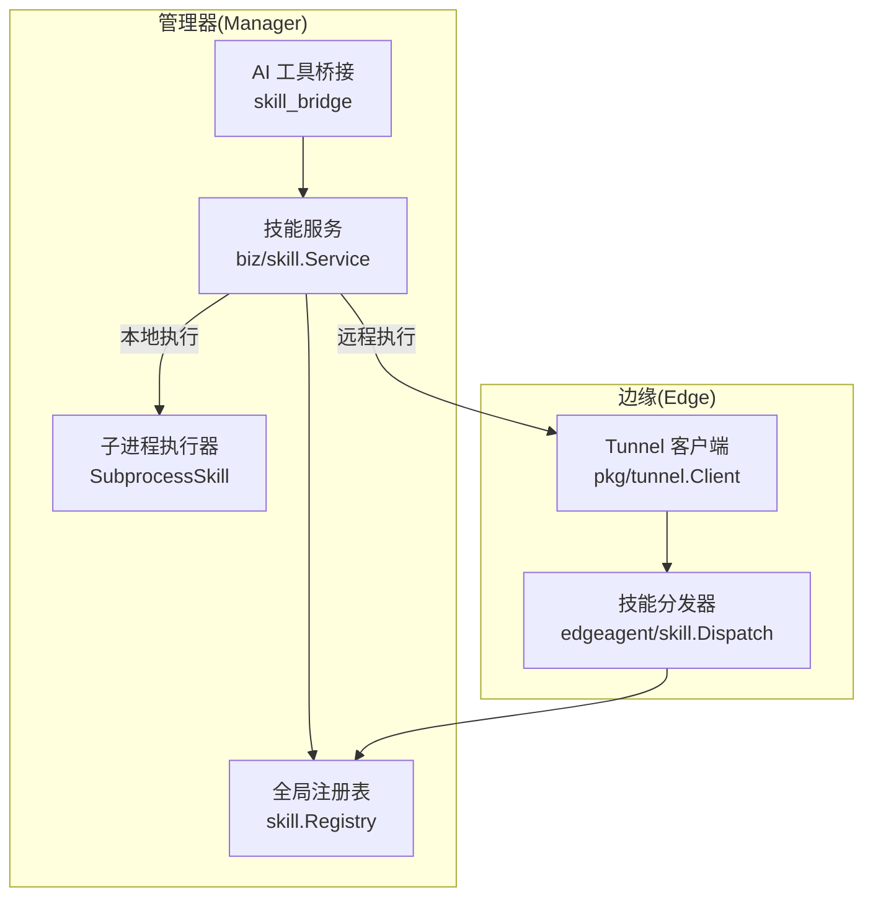
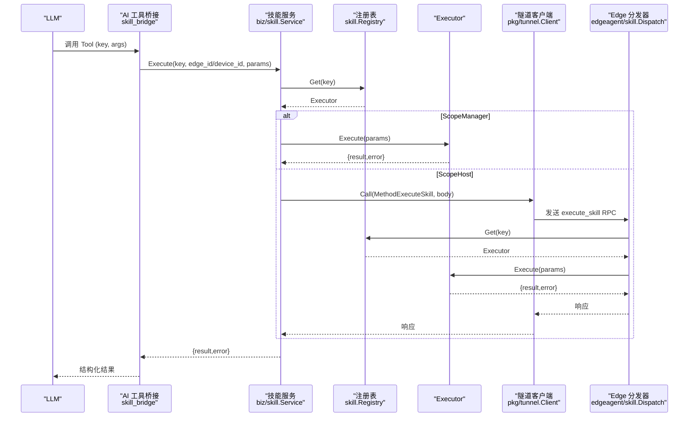
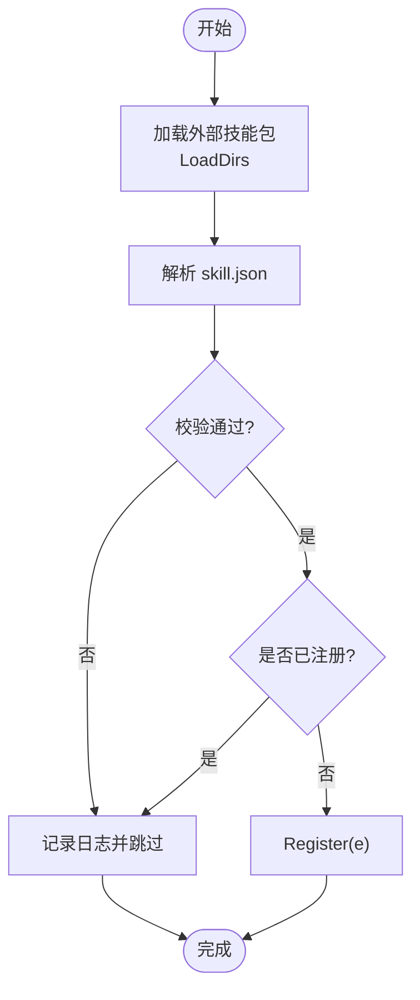
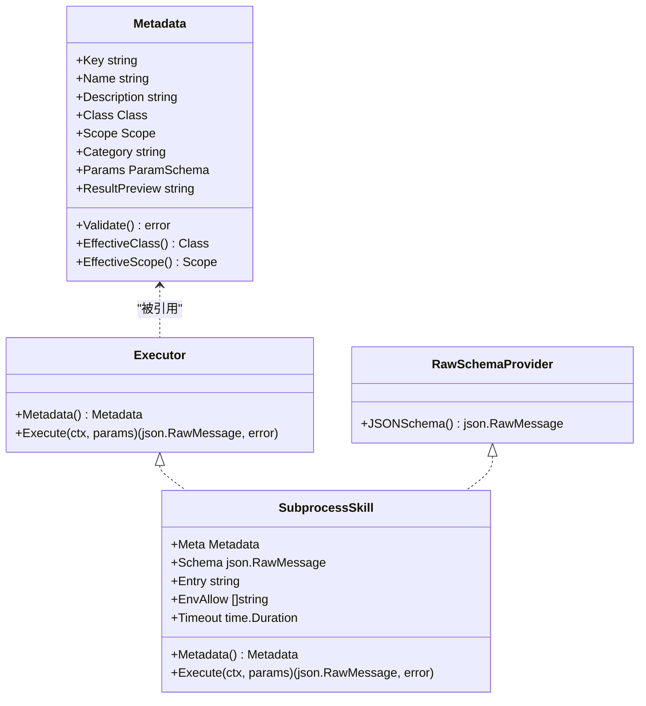
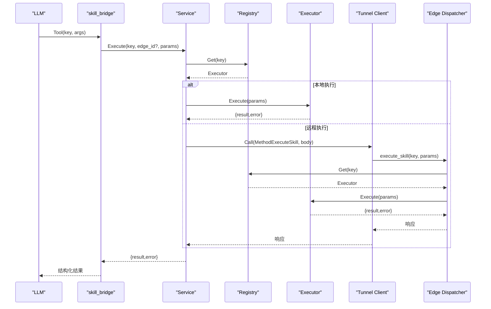
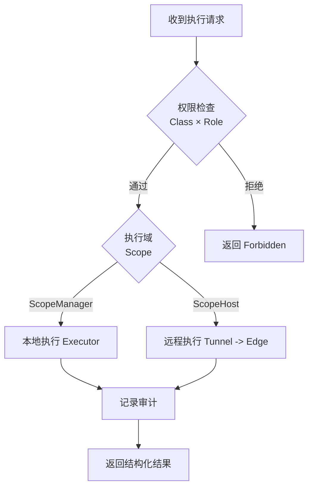
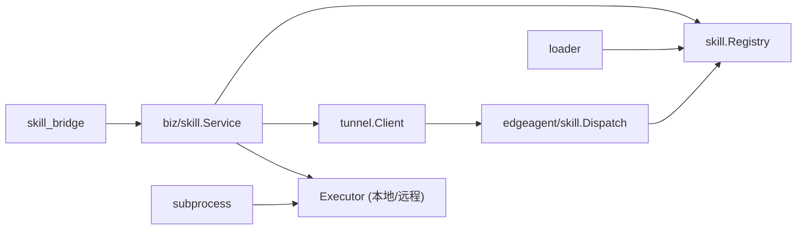

# 工具架构设计

<cite>
**本文引用的文件**
- [internal/skill/registry.go](file://internal/skill/registry.go)
- [internal/skill/types.go](file://internal/skill/types.go)
- [internal/skill/loader.go](file://internal/skill/loader.go)
- [internal/skill/subprocess.go](file://internal/skill/subprocess.go)
- [internal/skill/schema.go](file://internal/skill/schema.go)
- [internal/manager/biz/skill/service.go](file://internal/manager/biz/skill/service.go)
- [internal/manager/biz/aiops/tools/skill_bridge.go](file://internal/manager/biz/aiops/tools/skill_bridge.go)
- [internal/edgeagent/skill/dispatcher.go](file://internal/edgeagent/skill/dispatcher.go)
- [internal/pkg/tunnel/client.go](file://internal/pkg/tunnel/client.go)
</cite>

## 目录
1. [简介](#简介)
2. [项目结构](#项目结构)
3. [核心组件](#核心组件)
4. [架构总览](#架构总览)
5. [详细组件分析](#详细组件分析)
6. [依赖关系分析](#依赖关系分析)
7. [性能考量](#性能考量)
8. [故障排查指南](#故障排查指南)
9. [结论](#结论)
10. [附录](#附录)

## 简介
本文件系统化阐述工具（Skill）系统的整体架构与关键机制，聚焦以下目标：
- 工具注册表（Registry）的核心设计：生命周期管理、条件注册策略、并发安全。
- 基类与扩展点：以 Executor/Metadata 为核心的“基类”抽象，RawSchemaProvider 作为可选扩展，以及参数绑定与结果处理流程。
- 工具调用端到端路径：从 LLM 工具调用到边缘设备执行的完整链路（Manager 进程内执行 vs 通过隧道下发到 Edge）。
- 安全边界、权限控制与审计：基于 Class 的权限门控、Scope 的执行域隔离、子进程沙箱化、审计记录。
- 提供架构图与数据流图，帮助读者快速理解关键概念与交互。

## 项目结构
工具系统由“核心框架 + Manager 编排 + Edge 分发 + 外部子进程”四部分组成：
- internal/skill：定义统一的能力抽象（Executor/Metadata）、全局注册表、参数 Schema 构建、外部技能包加载器与子进程执行器。
- internal/manager/biz/skill：Manager 侧的服务层，负责鉴权、路由（本地或远程）、审计。
- internal/manager/biz/aiops/tools/skill_bridge：将安全类能力自动注册为 LLM 可调用的 Tool，并处理 device_id → edge_id 解析。
- internal/edgeagent/skill/dispatcher：Edge 侧接收云端 MethodExecuteSkill RPC，按 Key 分发到对应 Executor。
- internal/pkg/tunnel：云边双向通道，封装连接、重连、RPC 调用。

**图表来源**
- [internal/manager/biz/aiops/tools/skill_bridge.go:51-75](file://internal/manager/biz/aiops/tools/skill_bridge.go#L51-L75)
- [internal/manager/biz/skill/service.go:187-288](file://internal/manager/biz/skill/service.go#L187-L288)
- [internal/skill/registry.go:17-47](file://internal/skill/registry.go#L17-L47)
- [internal/skill/subprocess.go:30-78](file://internal/skill/subprocess.go#L30-L78)
- [internal/edgeagent/skill/dispatcher.go:16-44](file://internal/edgeagent/skill/dispatcher.go#L16-L44)
- [internal/pkg/tunnel/client.go:241-270](file://internal/pkg/tunnel/client.go#L241-L270)

**章节来源**
- [internal/skill/registry.go:10-47](file://internal/skill/registry.go#L10-L47)
- [internal/skill/types.go:1-27](file://internal/skill/types.go#L1-L27)
- [internal/manager/biz/skill/service.go:1-12](file://internal/manager/biz/skill/service.go#L1-L12)

## 核心组件
- 全局注册表 Registry：进程级技能目录，维护 Key→Executor 映射；提供 Register/Get/All/AllByClass 等接口；注册阶段单线程，运行期并发读，使用读写锁保护。
- 能力抽象 Executor/Metadata：每个技能实现一个 Executor，暴露 Metadata() 与 Execute(ctx, params)。Metadata 描述 Key、Name、Description、Class、Scope、Category、Params、ResultPreview。
- 参数 Schema 构建 BuildSchema：优先使用 RawSchemaProvider 提供的原始 JSON Schema，否则从 ParamSchema 推导 OpenAI function-calling 兼容的 Schema。
- 外部技能加载器 Loader：扫描指定目录下的 skill.json，校验并构建 SubprocessSkill，再注册到全局注册表；支持超时、环境变量白名单、入口路径白名单。
- 子进程执行器 SubprocessSkill：每次调用启动独立进程，stdin 传入参数 JSON，stdout 返回结果 JSON；限制输出大小、默认超时、严格的环境变量过滤。
- Manager 技能服务 Service：鉴权（Class × Role）、路由（ScopeHost/ScopeManager）、审计（AuditSink），并将错误结构化返回。
- AI 工具桥接 skill_bridge：将 ClassSafe 技能自动注册为 LLM Tool；对 ScopeHost 注入 device_id，并解析为 edge_id；对 ScopeManager 直接转发参数。
- Edge 分发器 Dispatch：接收云端 MethodExecuteSkill，按 Key 查找 Executor 并执行，统一包装 result/error。

**章节来源**
- [internal/skill/registry.go:21-127](file://internal/skill/registry.go#L21-L127)
- [internal/skill/types.go:63-203](file://internal/skill/types.go#L63-L203)
- [internal/skill/schema.go:5-20](file://internal/skill/schema.go#L5-L20)
- [internal/skill/loader.go:13-74](file://internal/skill/loader.go#L13-L74)
- [internal/skill/subprocess.go:17-78](file://internal/skill/subprocess.go#L17-L78)
- [internal/manager/biz/skill/service.go:27-82](file://internal/manager/biz/skill/service.go#L27-L82)
- [internal/manager/biz/aiops/tools/skill_bridge.go:1-18](file://internal/manager/biz/aiops/tools/skill_bridge.go#L1-L18)
- [internal/edgeagent/skill/dispatcher.go:16-44](file://internal/edgeagent/skill/dispatcher.go#L16-L44)

## 架构总览
下图展示从 LLM 工具调用到边缘设备执行的端到端路径，包括本地执行与远程执行两种分支。

**图表来源**
- [internal/manager/biz/aiops/tools/skill_bridge.go:151-234](file://internal/manager/biz/aiops/tools/skill_bridge.go#L151-L234)
- [internal/manager/biz/skill/service.go:187-288](file://internal/manager/biz/skill/service.go#L187-L288)
- [internal/skill/registry.go:35-47](file://internal/skill/registry.go#L35-L47)
- [internal/edgeagent/skill/dispatcher.go:24-44](file://internal/edgeagent/skill/dispatcher.go#L24-L44)
- [internal/pkg/tunnel/client.go:241-270](file://internal/pkg/tunnel/client.go#L241-L270)

## 详细组件分析

### 工具注册表（Registry）
- 生命周期管理：
  - 注册阶段：在 init() 或加载器中调用 Register，进行元数据校验与重复键检测；失败时 panic，确保作者级错误尽早暴露。
  - 运行期：并发读取，使用 RWMutex 保护；提供 All/AllByClass 用于枚举与筛选。
- 条件注册策略：
  - 通过 AllByClass 仅注册 ClassSafe 技能到 LLM 工具集；mutating/dangerous 需人工审批或 SOP 签名（当前拒绝）。
  - 外部技能包通过 Loader 扫描目录，逐个解析 manifest，校验后注册；重复键跳过而非崩溃。
- 并发与健壮性：
  - 注册单线程，读取多线程；loader 对 Register 使用 defer/recover 防止异常导致启动失败。

**图表来源**
- [internal/skill/loader.go:69-160](file://internal/skill/loader.go#L69-L160)
- [internal/skill/registry.go:59-74](file://internal/skill/registry.go#L59-L74)

**章节来源**
- [internal/skill/registry.go:17-127](file://internal/skill/registry.go#L17-L127)
- [internal/skill/loader.go:69-160](file://internal/skill/loader.go#L69-L160)

### 基类与扩展点（Executor/Metadata/RawSchemaProvider）
- 基类抽象：
  - Executor：定义 Metadata() 与 Execute(ctx, params)，所有技能必须实现。
  - Metadata：描述技能的标识、名称、描述、权限类别（safe/mutating/dangerous）、执行范围（host/manager）、分类、参数 Schema、结果预览。
- 参数绑定机制：
  - 声明式 ParamSchema 可转换为 OpenAI function-calling 兼容的 JSON Schema；数组类型支持 ItemType。
  - 扩展点 RawSchemaProvider：允许手写复杂 Schema（如 oneOf、嵌套对象），优先于 ParamSchema。
- 结果处理流程：
  - 子进程执行器要求 stdout 为合法 JSON；非零退出码或超时均返回错误，stderr 尾部信息附带以便诊断。
  - Manager 服务将错误字符串放入 ExecuteOutput.Error，保持结构化输出供上层消费。

**图表来源**
- [internal/skill/types.go:63-203](file://internal/skill/types.go#L63-L203)
- [internal/skill/subprocess.go:30-97](file://internal/skill/subprocess.go#L30-L97)
- [internal/skill/schema.go:5-20](file://internal/skill/schema.go#L5-L20)

**章节来源**
- [internal/skill/types.go:63-203](file://internal/skill/types.go#L63-L203)
- [internal/skill/schema.go:5-20](file://internal/skill/schema.go#L5-L20)
- [internal/skill/subprocess.go:99-172](file://internal/skill/subprocess.go#L99-L172)

### 工具调用的端到端路径
- LLM 工具调用：
  - skill_bridge 将 ClassSafe 技能注册为 Tool；对 ScopeHost 注入 device_id，并解析为 edge_id；对 ScopeManager 直接转发参数。
  - 调用 Service.Execute，根据 Scope 决定本地执行或远程调用。
- 本地执行（ScopeManager）：
  - 直接调用 Executor.Execute（例如 web_search、SubprocessSkill），返回结构化结果。
- 远程执行（ScopeHost）：
  - 通过 tunnel.Client.Call 发送 MethodExecuteSkill 到 Edge。
  - Edge 的 dispatcher 按 Key 查找 Executor 并执行，统一包装 result/error。
- 审计与错误：
  - Service 记录审计事件（包含 SkillKey、EdgeID、Caller、Class、Params、Result/Error、时间戳）。
  - 错误以字符串形式返回，便于 UI 与 LLM 消费。

**图表来源**
- [internal/manager/biz/aiops/tools/skill_bridge.go:151-234](file://internal/manager/biz/aiops/tools/skill_bridge.go#L151-L234)
- [internal/manager/biz/skill/service.go:187-288](file://internal/manager/biz/skill/service.go#L187-L288)
- [internal/edgeagent/skill/dispatcher.go:24-44](file://internal/edgeagent/skill/dispatcher.go#L24-L44)
- [internal/pkg/tunnel/client.go:241-270](file://internal/pkg/tunnel/client.go#L241-L270)

**章节来源**
- [internal/manager/biz/aiops/tools/skill_bridge.go:151-234](file://internal/manager/biz/aiops/tools/skill_bridge.go#L151-L234)
- [internal/manager/biz/skill/service.go:187-288](file://internal/manager/biz/skill/service.go#L187-L288)
- [internal/edgeagent/skill/dispatcher.go:24-44](file://internal/edgeagent/skill/dispatcher.go#L24-L44)

### 安全边界、权限控制与审计
- 权限门控（Class × Role）：
  - safe：任何认证用户可执行。
  - mutating：仅 admin/user 可执行，viewer 拒绝。
  - dangerous：当前全部拒绝，待 SOP 双签落地。
- 执行域隔离（Scope）：
  - ScopeHost：在 Edge 上执行，需要 edge_id（通过 device_id 解析）。
  - ScopeManager：在 Manager 进程内执行，无需 edge_id。
- 子进程安全：
  - 入口路径白名单：Loader 强制 Entry 位于允许目录，禁止逃逸。
  - 环境变量白名单：仅显式允许的变量传递给子进程，默认不继承 PATH。
  - 资源限制：最大 stdout/stderr 大小、默认超时 30s。
- 审计记录：
  - 每次执行记录 SkillKey、EdgeID、Caller、Class、Params、Result/Error、起止时间。
  - 审计失败仅告警，不影响主流程。

**图表来源**
- [internal/manager/biz/skill/service.go:290-313](file://internal/manager/biz/skill/service.go#L290-L313)
- [internal/skill/loader.go:176-253](file://internal/skill/loader.go#L176-L253)
- [internal/skill/subprocess.go:174-193](file://internal/skill/subprocess.go#L174-L193)
- [internal/manager/biz/skill/service.go:261-282](file://internal/manager/biz/skill/service.go#L261-L282)

**章节来源**
- [internal/manager/biz/skill/service.go:290-313](file://internal/manager/biz/skill/service.go#L290-L313)
- [internal/skill/loader.go:176-253](file://internal/skill/loader.go#L176-L253)
- [internal/skill/subprocess.go:174-193](file://internal/skill/subprocess.go#L174-L193)
- [internal/manager/biz/skill/service.go:261-282](file://internal/manager/biz/skill/service.go#L261-L282)

## 依赖关系分析
- 模块耦合：
  - skill_bridge 依赖 biz/skill.Service 与 skillcore.Registry；通过 AllByClass(ClassSafe) 获取可自动注册的技能。
  - biz/skill.Service 依赖 skillcore.Registry 与 tunnel.Client；负责鉴权、路由、审计。
  - edgeagent/skill.Dispatcher 依赖 skillcore.Registry；按 Key 分发到 Executor。
  - loader 与 subprocess 属于 skillcore 内部实现，对外暴露 Executor/Metadata。
- 外部依赖：
  - tunnel 基于 geminio 实现云边 RPC，具备重连、重试、回调机制。
  - 子进程执行使用标准库 os/exec，配合上下文取消与超时。

**图表来源**
- [internal/manager/biz/aiops/tools/skill_bridge.go:51-75](file://internal/manager/biz/aiops/tools/skill_bridge.go#L51-L75)
- [internal/manager/biz/skill/service.go:187-288](file://internal/manager/biz/skill/service.go#L187-L288)
- [internal/edgeagent/skill/dispatcher.go:24-44](file://internal/edgeagent/skill/dispatcher.go#L24-L44)
- [internal/skill/loader.go:69-160](file://internal/skill/loader.go#L69-L160)
- [internal/skill/subprocess.go:99-172](file://internal/skill/subprocess.go#L99-L172)

**章节来源**
- [internal/manager/biz/aiops/tools/skill_bridge.go:51-75](file://internal/manager/biz/aiops/tools/skill_bridge.go#L51-L75)
- [internal/manager/biz/skill/service.go:187-288](file://internal/manager/biz/skill/service.go#L187-L288)
- [internal/edgeagent/skill/dispatcher.go:24-44](file://internal/edgeagent/skill/dispatcher.go#L24-L44)
- [internal/skill/loader.go:69-160](file://internal/skill/loader.go#L69-L160)
- [internal/skill/subprocess.go:99-172](file://internal/skill/subprocess.go#L99-L172)

## 性能考量
- 注册表访问：
  - 读多写少场景下，RWMutex 保证高并发读取；All/AllByClass 排序开销与技能数量线性相关。
- 子进程执行：
  - 默认超时 30s，避免长时间阻塞；stdout/stderr 有上限，防止内存膨胀。
  - 环境变量白名单减少不必要的环境污染与启动开销。
- 隧道通信：
  - 基于 geminio 的重试与重连机制，提升网络抖动下的稳定性；Call 方法序列化/反序列化带来一定开销。
- 审计记录：
  - 异步或落盘可能引入 I/O 延迟；当前实现失败仅告警，避免影响主流程。

[本节为通用性能讨论，不直接分析具体文件]

## 故障排查指南
- 技能未找到：
  - 现象：Manager 返回 NotFound；Edge 返回 unknown skill。
  - 排查：确认 Key 是否正确注册；检查 Loader 是否扫描到 skill.json；确认无重复键覆盖。
- 权限拒绝：
  - 现象：Forbidden；viewer 无法执行 mutating。
  - 排查：检查 Caller.Role 与 Skill.Class；dangerous 当前全部拒绝。
- 子进程执行失败：
  - 现象：exit code 非零、超时、stdout 非 JSON。
  - 排查：检查 Entry 是否存在且可执行；环境变量是否允许；超时配置；stderr 尾部信息。
- 隧道通信错误：
  - 现象：remote error、route stale、not dialed。
  - 排查：检查连接状态、重连回调；确认 Edge 已注册并在线。

**章节来源**
- [internal/skill/registry.go:35-47](file://internal/skill/registry.go#L35-L47)
- [internal/edgeagent/skill/dispatcher.go:24-44](file://internal/edgeagent/skill/dispatcher.go#L24-L44)
- [internal/manager/biz/skill/service.go:290-313](file://internal/manager/biz/skill/service.go#L290-L313)
- [internal/skill/subprocess.go:99-172](file://internal/skill/subprocess.go#L99-L172)
- [internal/pkg/tunnel/client.go:241-270](file://internal/pkg/tunnel/client.go#L241-L270)

## 结论
该工具系统通过统一的 Executor/Metadata 抽象与全局注册表，实现了技能的可插拔、可扩展与可审计。Manager 侧通过 Class 与 Scope 实现细粒度权限与执行域控制，Edge 侧通过分发器将云端请求精准路由至本地能力。子进程执行器提供了安全的边界与资源限制，结合审计记录满足合规需求。整体架构清晰、职责分离，便于后续扩展更多能力与策略。

[本节为总结性内容，不直接分析具体文件]

## 附录
- 关键术语：
  - Skill：单一设备侧能力单元。
  - Executor：技能实现接口。
  - Metadata：技能元数据描述。
  - Class：权限类别（safe/mutating/dangerous）。
  - Scope：执行域（host/manager）。
  - Tool：LLM 可调用的函数接口。
  - Audit：执行审计记录。

[本节为术语解释，不直接分析具体文件]