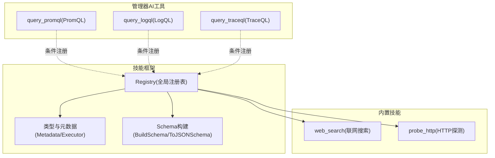
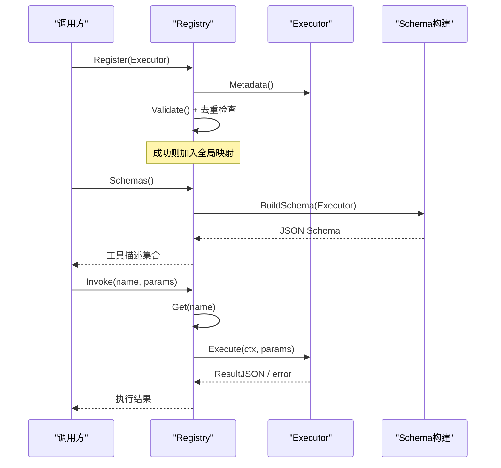
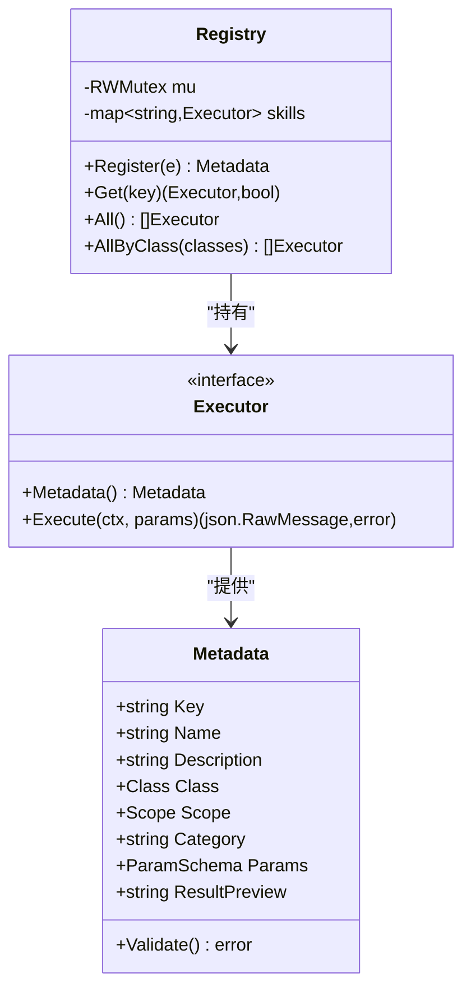
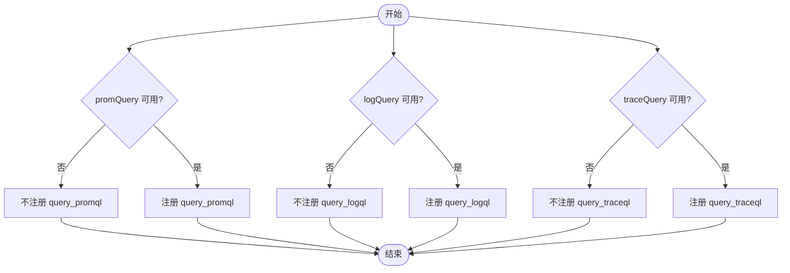
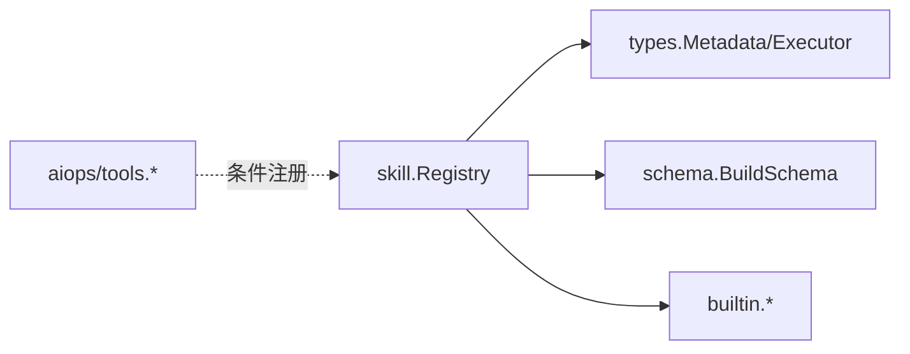

# 工具注册表设计

<cite>
**本文引用的文件**
- [internal/skill/registry.go](file://internal/skill/registry.go)
- [internal/skill/types.go](file://internal/skill/types.go)
- [internal/skill/schema.go](file://internal/skill/schema.go)
- [internal/skill/builtin/web_search.go](file://internal/skill/builtin/web_search.go)
- [internal/skill/builtin/probe_http.go](file://internal/skill/builtin/probe_http.go)
- [internal/manager/biz/aiops/tools/query_promql.go](file://internal/manager/biz/aiops/tools/query_promql.go)
- [internal/manager/biz/aiops/tools/query_logql_test.go](file://internal/manager/biz/aiops/tools/query_logql_test.go)
- [internal/manager/biz/aiops/tools/query_traceql.go](file://internal/manager/biz/aiops/tools/query_traceql.go)
- [tests/e2e/skills_registry_test.go](file://tests/e2e/skills_registry_test.go)
</cite>

## 目录
1. [简介](#简介)
2. [项目结构](#项目结构)
3. [核心组件](#核心组件)
4. [架构总览](#架构总览)
5. [详细组件分析](#详细组件分析)
6. [依赖关系分析](#依赖关系分析)
7. [性能考量](#性能考量)
8. [故障排查指南](#故障排查指南)
9. [结论](#结论)
10. [附录：最佳实践与示例路径](#附录最佳实践与示例路径)

## 简介
本文件聚焦于“工具注册表”的设计与实现，围绕 Registry 结构体的生命周期管理、依赖注入机制与条件注册策略展开。重点解释 Register 方法的动态注册、重命名覆盖与错误处理；阐述 Schemas 方法如何为 LLM 提供工具描述信息；说明 Invoke 方法如何实现工具调度的完整流程；并讨论 promQuery、logQuery、traceQuery 等可选依赖的条件注册逻辑。最后给出工具注册与调用的最佳实践与参考路径。

## 项目结构
本仓库将“设备侧能力（Skill）”与“管理器侧 AI 工具（AIOps Tools）”统一纳入可发现、可调度的注册体系：
- internal/skill：定义 Skill 的元数据、执行器接口、全局注册表与 JSON Schema 构建，内置多种设备侧能力（如 web_search、probe_http）。
- internal/manager/biz/aiops/tools：在管理器侧将 AIOps 能力以“工具”形式暴露给 LLM，支持按依赖是否可用进行条件注册（prom/log/trace 查询）。
- tests/e2e：端到端验证 /v1/skills 列表与关键工具键是否存在。

图表来源
- [internal/skill/registry.go:10-24](file://internal/skill/registry.go#L10-L24)
- [internal/skill/types.go:99-203](file://internal/skill/types.go#L99-L203)
- [internal/skill/schema.go:5-20](file://internal/skill/schema.go#L5-L20)
- [internal/skill/builtin/web_search.go:19-195](file://internal/skill/builtin/web_search.go#L19-L195)
- [internal/skill/builtin/probe_http.go:15-47](file://internal/skill/builtin/probe_http.go#L15-L47)
- [internal/manager/biz/aiops/tools/query_promql.go:12-49](file://internal/manager/biz/aiops/tools/query_promql.go#L12-L49)

章节来源
- [internal/skill/registry.go:10-24](file://internal/skill/registry.go#L10-L24)
- [internal/skill/types.go:99-203](file://internal/skill/types.go#L99-L203)
- [internal/skill/schema.go:5-20](file://internal/skill/schema.go#L5-L20)
- [internal/skill/builtin/web_search.go:19-195](file://internal/skill/builtin/web_search.go#L19-L195)
- [internal/skill/builtin/probe_http.go:15-47](file://internal/skill/builtin/probe_http.go#L15-L47)
- [internal/manager/biz/aiops/tools/query_promql.go:12-49](file://internal/manager/biz/aiops/tools/query_promql.go#L12-L49)

## 核心组件
- 全局注册表 Registry：进程级工具目录，维护 key -> Executor 映射，提供 Register/Get/All/AllByClass 等方法，使用读写锁保证并发安全。
- 执行器接口 Executor：每个工具一个实现，包含 Metadata() 与 Execute(ctx, params)。
- 元数据 Metadata：描述工具的 Key、Name、Description、Class、Scope、Category、Params、ResultPreview，并在注册时进行校验。
- Schema 构建：BuildSchema 优先使用 RawSchemaProvider 提供的 JSON Schema，否则从 Metadata.Params 推导 OpenAI function-calling 兼容的 schema。

章节来源
- [internal/skill/registry.go:10-24](file://internal/skill/registry.go#L10-L24)
- [internal/skill/types.go:99-203](file://internal/skill/types.go#L99-L203)
- [internal/skill/schema.go:5-20](file://internal/skill/schema.go#L5-L20)

## 架构总览
下图展示了“注册—描述—调度”的整体流程：
- 注册阶段：各工具在 init() 中调用 Register，完成元数据校验、去重检查与入表。
- 描述阶段：Schemas 通过 BuildSchema 生成 JSON Schema，供 LLM 工具发现与参数约束。
- 调度阶段：Invoke 根据工具名查找对应执行器，反序列化参数后调用 Execute，返回结果。

图表来源
- [internal/skill/registry.go:56-82](file://internal/skill/registry.go#L56-L82)
- [internal/skill/schema.go:5-20](file://internal/skill/schema.go#L5-L20)
- [internal/skill/types.go:190-203](file://internal/skill/types.go#L190-L203)

## 详细组件分析

### Registry 结构与生命周期管理
- 数据结构：内部 map[string]Executor，配合 sync.RWMutex 保护。
- 注册期：Register 对 Executor 非空校验、Metadata 校验、Key 重复性检查，失败直接 panic，确保作者级错误在启动时暴露。
- 运行期：Get/All/AllByClass 仅读访问，All/AllByClass 返回排序后的列表，便于 UI 与 LLM 工具列表稳定展示。
- 测试隔离：提供 NewRegistryForTest 构造独立实例，避免全局状态污染。

图表来源
- [internal/skill/registry.go:21-116](file://internal/skill/registry.go#L21-L116)
- [internal/skill/types.go:99-175](file://internal/skill/types.go#L99-L175)

章节来源
- [internal/skill/registry.go:21-116](file://internal/skill/registry.go#L21-L116)
- [internal/skill/types.go:99-175](file://internal/skill/types.go#L99-L175)

### Register 方法：动态注册、重命名覆盖与错误处理
- 动态注册：init() 中调用 Register，将 Executor 加入全局映射。
- 重命名覆盖：当前实现不允许重复 Key，若出现重复会 panic；因此“覆盖”需先移除旧实现或调整 Key，避免静默覆盖。
- 错误处理：
  - nil Executor：panic。
  - Metadata 校验失败：panic（作者错误应在启动时暴露）。
  - 重复 Key：panic（防止隐式覆盖）。
  - 未知 Key 查询：Get 返回 (nil, false)，上层转换为 404 风格错误。

章节来源
- [internal/skill/registry.go:26-74](file://internal/skill/registry.go#L26-L74)
- [internal/skill/types.go:127-175](file://internal/skill/types.go#L127-L175)

### Schemas 方法：为 LLM 提供工具描述信息
- 优先使用 RawSchemaProvider：若 Executor 实现了该接口，直接使用其 JSON Schema。
- 否则从 Metadata.Params 推导：ToJSONSchema 将 ParamSchema 转为 OpenAI function-calling 兼容的 object schema（含 properties、required、默认值、枚举等）。
- 输出：json.RawMessage，便于上层扩展字段（例如为 host-scoped skill 附加 device_id）。

章节来源
- [internal/skill/schema.go:5-20](file://internal/skill/schema.go#L5-L20)
- [internal/skill/schema.go:22-95](file://internal/skill/schema.go#L22-L95)
- [internal/skill/types.go:177-188](file://internal/skill/types.go#L177-L188)

### Invoke 方法：工具调度完整流程
- 查找：根据工具名（key）从全局映射获取 Executor。
- 参数校验：由调用方基于 Schema 进行形状校验；Execute 仍需防御性解析。
- 执行：调用 Executor.Execute，返回 ResultJSON 或错误。
- 错误传播：未找到 key 返回 not-found；下游服务层负责转换为 HTTP 或 RPC 错误。

章节来源
- [internal/skill/registry.go:35-40](file://internal/skill/registry.go#L35-L40)
- [internal/skill/types.go:190-203](file://internal/skill/types.go#L190-L203)

### 条件注册策略：promQuery、logQuery、traceQuery
- 设计原则：当外部依赖不可用时，不注册对应工具，避免运行时崩溃；调用时返回 not-found 或明确错误。
- PromQL：executeQueryPromQL 中若 promQuery 为 nil 则返回配置错误；测试表明当依赖为 nil 时不会注册该工具。
- LogQL：测试断言当 logQuery 为 nil 时 query_logql 不应注册，且调用应返回 not-found。
- TraceQL：executeQueryTraceQL 中若 traceQuery 为 nil 则返回配置错误；测试同样断言未注册时的行为。

图表来源
- [internal/manager/biz/aiops/tools/query_promql.go:79-118](file://internal/manager/biz/aiops/tools/query_promql.go#L79-L118)
- [internal/manager/biz/aiops/tools/query_logql_test.go:246-257](file://internal/manager/biz/aiops/tools/query_logql_test.go#L246-L257)
- [internal/manager/biz/aiops/tools/query_traceql.go:181-208](file://internal/manager/biz/aiops/tools/query_traceql.go#L181-L208)

章节来源
- [internal/manager/biz/aiops/tools/query_promql.go:79-118](file://internal/manager/biz/aiops/tools/query_promql.go#L79-L118)
- [internal/manager/biz/aiops/tools/query_logql_test.go:246-257](file://internal/manager/biz/aiops/tools/query_logql_test.go#L246-L257)
- [internal/manager/biz/aiops/tools/query_traceql.go:181-208](file://internal/manager/biz/aiops/tools/query_traceql.go#L181-L208)

### 内置工具示例：web_search 与 probe_http
- web_search：Manager 侧能力，支持多后端（SearXNG/Tavily/Brave），通过配置解析器注入运行时配置；Execute 中根据 provider 选择具体实现，并将不可用情况以 skipped_reason 返回而非错误，便于 LLM 引导用户修复。
- probe_http：Host 侧能力，发起 HEAD/GET 请求，返回状态码、延迟、内容长度；TLS 校验关闭以适应内网自签证书场景。

章节来源
- [internal/skill/builtin/web_search.go:19-195](file://internal/skill/builtin/web_search.go#L19-L195)
- [internal/skill/builtin/web_search.go:225-283](file://internal/skill/builtin/web_search.go#L225-L283)
- [internal/skill/builtin/probe_http.go:15-47](file://internal/skill/builtin/probe_http.go#L15-L47)
- [internal/skill/builtin/probe_http.go:62-119](file://internal/skill/builtin/probe_http.go#L62-L119)

## 依赖关系分析
- 松耦合：Skill 框架不依赖管理器业务包，仅通过接口与元数据协作；管理器侧工具通过条件注册引入外部依赖。
- 可插拔：RawSchemaProvider 允许复杂参数结构的工具绕过声明式 Schema，保持灵活性。
- 可测试：NewRegistryForTest 与接口化依赖（如 PromQuerier）便于单元测试与集成测试。

图表来源
- [internal/skill/registry.go:10-24](file://internal/skill/registry.go#L10-L24)
- [internal/skill/types.go:99-203](file://internal/skill/types.go#L99-L203)
- [internal/skill/schema.go:5-20](file://internal/skill/schema.go#L5-L20)
- [internal/manager/biz/aiops/tools/query_promql.go:12-49](file://internal/manager/biz/aiops/tools/query_promql.go#L12-L49)

章节来源
- [internal/skill/registry.go:10-24](file://internal/skill/registry.go#L10-L24)
- [internal/skill/types.go:99-203](file://internal/skill/types.go#L99-L203)
- [internal/skill/schema.go:5-20](file://internal/skill/schema.go#L5-L20)
- [internal/manager/biz/aiops/tools/query_promql.go:12-49](file://internal/manager/biz/aiops/tools/query_promql.go#L12-L49)

## 性能考量
- 注册期一次性开销：Register 在 init() 阶段执行，不影响运行时。
- 读取路径高效：Get/All/AllByClass 使用读锁，All 系列返回排序副本，适合 UI 与 LLM 工具列表。
- 超时控制：AIOps 工具在执行时设置上下文超时（如 PromQL/TraceQL），避免长时间阻塞。
- 资源限制：web_search 对响应体大小限制，避免大响应影响性能。

[本节为通用指导，不直接分析具体文件]

## 故障排查指南
- 重复 Key：注册时 panic，检查 init() 中的 Key 唯一性。
- 未找到工具：Get 返回 not-found，确认工具是否正确注册且名称一致。
- 依赖未配置：AIOps 工具在未配置依赖时不会注册，调用将返回 not-found；检查依赖初始化逻辑。
- 参数校验失败：Schema 校验失败会在调用前拦截；Execute 中仍建议做防御性解析与错误提示。

章节来源
- [internal/skill/registry.go:26-74](file://internal/skill/registry.go#L26-L74)
- [internal/manager/biz/aiops/tools/query_logql_test.go:246-257](file://internal/manager/biz/aiops/tools/query_logql_test.go#L246-L257)
- [internal/manager/biz/aiops/tools/query_traceql.go:181-208](file://internal/manager/biz/aiops/tools/query_traceql.go#L181-L208)

## 结论
本注册表以“元数据驱动 + 接口抽象 + 条件注册”为核心，实现了工具的统一发现、描述与调度。Register 严格校验与去重保障稳定性；Schemas 为 LLM 提供一致的参数契约；Invoke 提供简洁的调度入口。通过条件注册策略，系统可在不同部署环境下灵活启用/禁用特定工具，提升鲁棒性与可维护性。

[本节为总结性内容，不直接分析具体文件]

## 附录：最佳实践与示例路径
- 新增工具步骤
  - 定义 Metadata 与 Executor，并在 init() 中调用 Register。
  - 如需复杂参数，实现 RawSchemaProvider 提供 JSON Schema。
  - 若依赖外部服务，采用条件注册：仅在依赖可用时注册。
- 参考实现路径
  - 注册与全局管理：[internal/skill/registry.go:10-116](file://internal/skill/registry.go#L10-L116)
  - 元数据与执行器接口：[internal/skill/types.go:99-203](file://internal/skill/types.go#L99-L203)
  - Schema 构建：[internal/skill/schema.go:5-95](file://internal/skill/schema.go#L5-L95)
  - 内置工具示例：
    - 联网搜索：[internal/skill/builtin/web_search.go:19-195](file://internal/skill/builtin/web_search.go#L19-L195)
    - HTTP 探测：[internal/skill/builtin/probe_http.go:15-47](file://internal/skill/builtin/probe_http.go#L15-L47)
  - 条件注册示例（AIOps 工具）：
    - PromQL：[internal/manager/biz/aiops/tools/query_promql.go:79-118](file://internal/manager/biz/aiops/tools/query_promql.go#L79-L118)
    - LogQL（测试断言）：[internal/manager/biz/aiops/tools/query_logql_test.go:246-257](file://internal/manager/biz/aiops/tools/query_logql_test.go#L246-L257)
    - TraceQL：[internal/manager/biz/aiops/tools/query_traceql.go:181-208](file://internal/manager/biz/aiops/tools/query_traceql.go#L181-L208)
- 端到端验证
  - 列出已注册工具并校验关键键存在：[tests/e2e/skills_registry_test.go:33-134](file://tests/e2e/skills_registry_test.go#L33-L134)