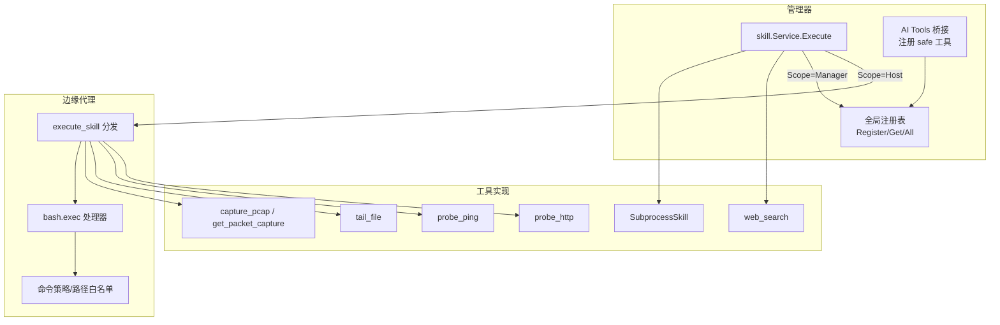
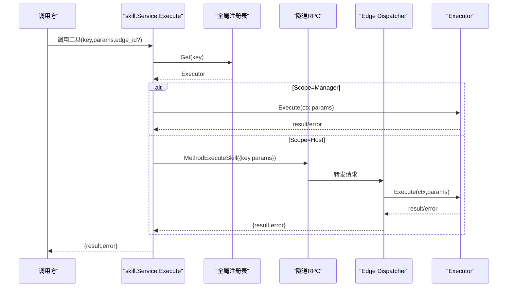
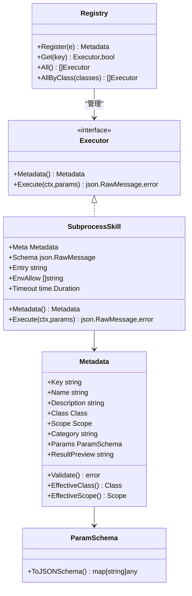
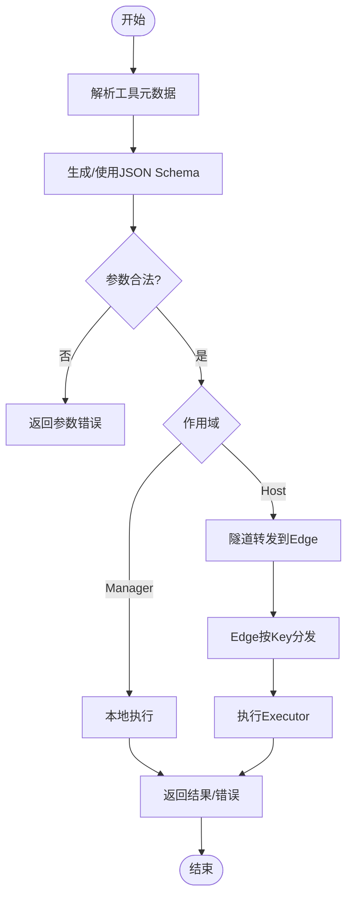
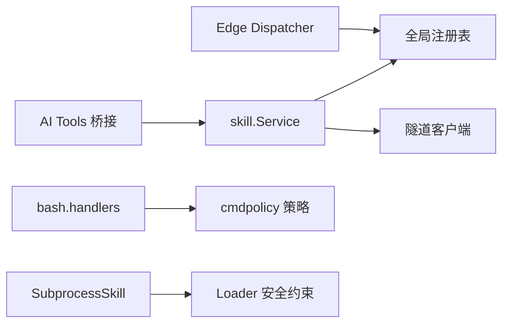

# 工具系统

<cite>
**本文引用的文件**
- [internal/skill/types.go](file://internal/skill/types.go)
- [internal/skill/registry.go](file://internal/skill/registry.go)
- [internal/skill/schema.go](file://internal/skill/schema.go)
- [internal/skill/loader.go](file://internal/skill/loader.go)
- [internal/skill/subprocess.go](file://internal/skill/subprocess.go)
- [internal/skill/builtin/probe_http.go](file://internal/skill/builtin/probe_http.go)
- [internal/skill/builtin/probe_ping.go](file://internal/skill/builtin/probe_ping.go)
- [internal/skill/builtin/web_search.go](file://internal/skill/builtin/web_search.go)
- [internal/skill/builtin/tail_file.go](file://internal/skill/builtin/tail_file.go)
- [internal/skill/builtin/capture_pcap.go](file://internal/skill/builtin/capture_pcap.go)
- [internal/edgeagent/bash/handlers.go](file://internal/edgeagent/bash/handlers.go)
- [internal/edgeagent/cmdpolicy/policy.go](file://internal/edgeagent/cmdpolicy/policy.go)
- [internal/manager/biz/skill/service.go](file://internal/manager/biz/skill/service.go)
- [internal/manager/biz/aiops/tools/skill_bridge.go](file://internal/manager/biz/aiops/tools/skill_bridge.go)
- [internal/pkg/tunnel/operator.go](file://internal/pkg/tunnel/operator.go)
</cite>

## 目录
1. [简介](#简介)
2. [项目结构](#项目结构)
3. [核心组件](#核心组件)
4. [架构总览](#架构总览)
5. [详细组件分析](#详细组件分析)
6. [依赖关系分析](#依赖关系分析)
7. [性能考量](#性能考量)
8. [故障排查指南](#故障排查指南)
9. [结论](#结论)
10. [附录](#附录)

## 简介
本文件系统化阐述 Ongrid 的“工具系统”（Skill）：以统一接口与注册表为核心，将边缘侧能力（如 Bash、网络探测、抓包等）与管理端能力（如联网搜索、子进程技能包）抽象为可发现、可编排、可审计的工具。文档覆盖：
- 工具注册表、基类设计与元数据驱动
- 生命周期管理、参数绑定与结果处理
- 内置工具类型与功能（Bash、Kubernetes/Edge 动作、网络探测、文件读取、抓包、联网搜索）
- 自定义工具开发指南（实现 Executor、错误处理、性能优化）
- 安全边界与权限控制（Class/Scope、命令白名单、路径白名单、环境变量白名单）

## 项目结构
工具系统由“框架层 + 内置工具 + 调度层 + 安全策略”组成：
- 框架层：定义 Executor/Metadata/ParamSchema、全局注册表、JSON Schema 生成、外部子进程技能加载器
- 内置工具：网络探测（HTTP/Ping/TCP/DNS）、文件读取（tail）、抓包（PCAP）、联网搜索（SearXNG/Tavily/Brave）
- 调度层：Manager 侧 Service 根据 Scope 决定本地执行或经隧道转发到 Edge；Edge 侧 Dispatcher 按 Key 分发到 Executor
- 安全策略：Bash 命令沙箱策略（只读基线 + YAML 扩展），路径白名单，网络主机白名单，子进程环境变量白名单

图表来源
- [internal/manager/biz/skill/service.go:187-261](file://internal/manager/biz/skill/service.go#L187-L261)
- [internal/manager/biz/aiops/tools/skill_bridge.go:1-161](file://internal/manager/biz/aiops/tools/skill_bridge.go#L1-L161)
- [internal/skill/registry.go:10-47](file://internal/skill/registry.go#L10-L47)
- [internal/edgeagent/bash/handlers.go:44-94](file://internal/edgeagent/bash/handlers.go#L44-L94)
- [internal/skill/builtin/probe_http.go:15-47](file://internal/skill/builtin/probe_http.go#L15-L47)
- [internal/skill/builtin/probe_ping.go:14-43](file://internal/skill/builtin/probe_ping.go#L14-L43)
- [internal/skill/builtin/web_search.go:150-195](file://internal/skill/builtin/web_search.go#L150-L195)
- [internal/skill/builtin/tail_file.go:15-46](file://internal/skill/builtin/tail_file.go#L15-L46)
- [internal/skill/builtin/capture_pcap.go:16-44](file://internal/skill/builtin/capture_pcap.go#L16-L44)
- [internal/skill/subprocess.go:30-78](file://internal/skill/subprocess.go#L30-L78)

章节来源
- [internal/skill/types.go:1-27](file://internal/skill/types.go#L1-L27)
- [internal/skill/registry.go:10-47](file://internal/skill/registry.go#L10-L47)
- [internal/manager/biz/skill/service.go:187-261](file://internal/manager/biz/skill/service.go#L187-L261)

## 核心组件
- 工具元数据与执行接口
  - Metadata：Key/Name/Description/Class/Scope/Category/Params/ResultPreview
  - ParamSchema：声明式参数描述，自动导出 JSON Schema
  - Executor：Metadata() + Execute(ctx, params) -> (result, error)
- 全局注册表
  - Register/Get/All/AllByClass：线程安全，启动期注册，运行期并发读取
- 子进程技能加载器
  - LoadDirs：扫描 skill.json，构建 SubprocessSkill，限制 Entry 在允许目录内
- 子进程执行器
  - 严格的环境变量白名单、超时、输出大小上限、非零退出码错误封装

章节来源
- [internal/skill/types.go:63-175](file://internal/skill/types.go#L63-L175)
- [internal/skill/registry.go:17-119](file://internal/skill/registry.go#L17-L119)
- [internal/skill/loader.go:13-74](file://internal/skill/loader.go#L13-L74)
- [internal/skill/subprocess.go:17-78](file://internal/skill/subprocess.go#L17-L78)

## 架构总览
工具系统采用“元数据驱动 + 注册表 + 作用域路由”的架构：
- 所有工具通过 init() 调用 Register 进入全局注册表
- Manager 侧 Service 根据工具的 Scope 决定：
  - ScopeHost：通过隧道 RPC MethodExecuteSkill 转发到 Edge，由 Edge Dispatcher 按 Key 分发
  - ScopeManager：在 Manager 进程内直接执行（如 web_search、子进程技能）
- AI Tools 桥接层将 safe 工具自动暴露为 LLM 可调用的函数，并注入 edge_id（仅 Host 作用域）
- Bash 工具走独立通道：bash.exec 经 cmdpolicy 沙箱校验后执行，支持只读基线与 YAML 扩展

图表来源
- [internal/manager/biz/skill/service.go:187-261](file://internal/manager/biz/skill/service.go#L187-L261)
- [internal/skill/registry.go:31-40](file://internal/skill/registry.go#L31-L40)
- [internal/edgeagent/skill/dispatcher.go:16-44](file://internal/edgeagent/skill/dispatcher.go#L16-L44)

章节来源
- [internal/manager/biz/skill/service.go:187-261](file://internal/manager/biz/skill/service.go#L187-L261)
- [internal/edgeagent/skill/dispatcher.go:16-44](file://internal/edgeagent/skill/dispatcher.go#L16-L44)

## 详细组件分析

### 工具注册表与基类设计
- 注册表提供全局唯一 Key 索引，支持按 Class 过滤（safe/mutating/dangerous）
- Executor 是统一接口，Metadata 描述工具能力与权限等级，ParamSchema 自动生成 JSON Schema
- RawSchemaProvider 允许复杂参数形状（数组/对象/oneOf）绕过声明式 schema

图表来源
- [internal/skill/registry.go:17-119](file://internal/skill/registry.go#L17-L119)
- [internal/skill/types.go:99-175](file://internal/skill/types.go#L99-L175)
- [internal/skill/subprocess.go:43-97](file://internal/skill/subprocess.go#L43-L97)

章节来源
- [internal/skill/types.go:99-175](file://internal/skill/types.go#L99-L175)
- [internal/skill/registry.go:17-119](file://internal/skill/registry.go#L17-L119)
- [internal/skill/subprocess.go:43-97](file://internal/skill/subprocess.go#L43-L97)

### 生命周期管理与参数绑定
- 生命周期
  - 启动期：各工具包 init() 中 Register，注册表校验元数据并登记
  - 运行期：Manager 根据 Key 获取 Executor，按 Scope 选择本地或远程执行
  - 结束：返回结构化结果或错误；子进程技能对 stderr/stdout 做截断与兜底
- 参数绑定
  - 声明式 ParamSchema -> JSON Schema（OpenAI function-calling 兼容）
  - 复杂参数可通过 RawSchemaProvider 提供原始 JSON Schema
  - 运行时对 params 进行防御性反序列化，确保值语义校验由工具自身完成

图表来源
- [internal/skill/schema.go:5-20](file://internal/skill/schema.go#L5-L20)
- [internal/skill/types.go:177-203](file://internal/skill/types.go#L177-L203)
- [internal/manager/biz/skill/service.go:187-261](file://internal/manager/biz/skill/service.go#L187-L261)

章节来源
- [internal/skill/schema.go:5-20](file://internal/skill/schema.go#L5-L20)
- [internal/skill/types.go:177-203](file://internal/skill/types.go#L177-L203)
- [internal/manager/biz/skill/service.go:187-261](file://internal/manager/biz/skill/service.go#L187-L261)

### 结果处理机制
- 成功：返回 json.RawMessage，上层可合并 skipped_reason 或包装成统一信封
- 失败：
  - 子进程技能：非零退出码携带 stderr 尾部信息；超时返回 context.DeadlineExceeded 包装错误
  - 网络技能：不可达/配置缺失时返回 skipped_reason 而非 Go error，便于 LLM 提示修复
- 审计与追踪：Manager 记录开始/结束时间，错误信息透传至调用方

章节来源
- [internal/skill/subprocess.go:99-172](file://internal/skill/subprocess.go#L99-L172)
- [internal/skill/builtin/web_search.go:225-283](file://internal/skill/builtin/web_search.go#L225-L283)
- [internal/manager/biz/skill/service.go:221-261](file://internal/manager/biz/skill/service.go#L221-L261)

### 内置工具：类型与功能
- 网络探测
  - HTTP 探测：HEAD/GET，返回状态码、延迟、内容长度，跳过 TLS 验证以适配内部自签服务
  - Ping 探测：固定次数 ICMP，带超时与输出捕获
- 文件读取
  - tail_file：绝对路径+防穿越校验，限制最大读取字节数，返回最后 N 行
- 抓包
  - capture_pcap/get_packet_capture：声明式 API，实际执行在 Edge，需授权操作者触发
- 联网搜索
  - web_search：多后端（SearXNG/Tavily/Brave），默认 SearXNG；未配置 key 时返回 skipped_reason 引导配置
- Bash（边缘侧）
  - bash.exec：基于只读基线 + YAML 扩展的命令策略，路径白名单，可选管理员写门限

章节来源
- [internal/skill/builtin/probe_http.go:15-47](file://internal/skill/builtin/probe_http.go#L15-L47)
- [internal/skill/builtin/probe_ping.go:14-43](file://internal/skill/builtin/probe_ping.go#L14-L43)
- [internal/skill/builtin/tail_file.go:15-46](file://internal/skill/builtin/tail_file.go#L15-L46)
- [internal/skill/builtin/capture_pcap.go:16-44](file://internal/skill/builtin/capture_pcap.go#L16-L44)
- [internal/skill/builtin/web_search.go:150-195](file://internal/skill/builtin/web_search.go#L150-L195)
- [internal/edgeagent/bash/handlers.go:44-94](file://internal/edgeagent/bash/handlers.go#L44-L94)

### 自定义工具开发指南
- 实现步骤
  - 定义 struct 实现 Executor 接口（Metadata + Execute）
  - 在 init() 中调用 Register 注册
  - 如需复杂参数，实现 RawSchemaProvider 提供 JSON Schema
- 参数与结果
  - 使用 ParamSchema 声明简单参数；复杂结构用 RawSchemaProvider
  - Execute 中对 params 进行防御性反序列化；返回 json.RawMessage
- 错误处理
  - 明确区分业务错误与系统错误；子进程技能需处理超时与非零退出码
  - 对外部依赖不可用时返回 skipped_reason（如 web_search）
- 性能优化
  - 合理设置超时与输出上限（子进程技能默认 30s，stdout 上限 16MiB）
  - 避免大对象传输；必要时分页/流式处理
  - 复用连接（如 HTTP 客户端）并设置合理超时

章节来源
- [internal/skill/types.go:177-203](file://internal/skill/types.go#L177-L203)
- [internal/skill/subprocess.go:17-28](file://internal/skill/subprocess.go#L17-L28)
- [internal/skill/builtin/web_search.go:225-283](file://internal/skill/builtin/web_search.go#L225-L283)

### 安全边界与权限控制
- 权限等级（Class）
  - safe：只读，无副作用；mutating：可逆修改；dangerous：不可逆/集群影响
  - Manager 侧授权：safe 任意认证用户；mutating 需管理员；dangerous 需 SOP 签名（待接入）
- 作用域（Scope）
  - host：在 Edge 执行，需 edge_id；manager：在 Manager 进程执行
- Bash 命令沙箱
  - 只读基线 + YAML 扩展；路径白名单（/var,/opt,/home,/tmp,/srv,/data）
  - 网络主机白名单默认拒绝全部，需显式放行 CIDR
  - 支持 per-call 超时上限（5 分钟）
- 子进程技能安全
  - Entry 必须位于允许目录（防止逃逸）
  - 环境变量白名单（默认不继承 PATH，需显式 opt-in）
  - stdout/stderr 容量限制，超时保护

章节来源
- [internal/skill/types.go:35-61](file://internal/skill/types.go#L35-L61)
- [internal/manager/biz/skill/service.go:187-219](file://internal/manager/biz/skill/service.go#L187-L219)
- [internal/edgeagent/bash/handlers.go:44-94](file://internal/edgeagent/bash/handlers.go#L44-L94)
- [internal/edgeagent/cmdpolicy/policy.go:33-49](file://internal/edgeagent/cmdpolicy/policy.go#L33-L49)
- [internal/skill/loader.go:176-254](file://internal/skill/loader.go#L176-L254)
- [internal/skill/subprocess.go:174-193](file://internal/skill/subprocess.go#L174-L193)

## 依赖关系分析
- Manager 侧
  - skill.Service 依赖全局注册表与隧道客户端
  - AI Tools 桥接层依赖 skill.Service 与注册表，自动注册 safe 工具
- Edge 侧
  - bash.handlers 依赖 cmdpolicy 策略与 host_files 路径校验
  - skill.Dispatcher 依赖全局注册表按 Key 分发
- 工具实现
  - 网络/文件/搜索等工具依赖标准库或外部服务（SearXNG/Tavily/Brave）
  - 子进程技能依赖 Loader 的安全约束与 SubprocessSkill 的执行环境

图表来源
- [internal/manager/biz/skill/service.go:187-261](file://internal/manager/biz/skill/service.go#L187-L261)
- [internal/manager/biz/aiops/tools/skill_bridge.go:1-161](file://internal/manager/biz/aiops/tools/skill_bridge.go#L1-L161)
- [internal/edgeagent/bash/handlers.go:44-94](file://internal/edgeagent/bash/handlers.go#L44-L94)
- [internal/skill/loader.go:176-254](file://internal/skill/loader.go#L176-L254)

章节来源
- [internal/manager/biz/skill/service.go:187-261](file://internal/manager/biz/skill/service.go#L187-L261)
- [internal/edgeagent/bash/handlers.go:44-94](file://internal/edgeagent/bash/handlers.go#L44-L94)
- [internal/skill/loader.go:176-254](file://internal/skill/loader.go#L176-L254)

## 性能考量
- 子进程技能
  - 默认超时 30 秒，stdout 上限 16 MiB，stderr 保留尾部 4 KiB
  - 环境变量白名单减少不必要的环境开销
- Bash 命令
  - 只读基线减少误写风险；路径白名单限制 IO 范围
  - 每调用可设超时上限（5 分钟），避免长任务阻塞
- 网络技能
  - HTTP 客户端设置合理超时；SearXNG 不可达时快速返回 skipped_reason
- 资源保护
  - 输出截断与内存上限防止恶意/异常输出导致 OOM

章节来源
- [internal/skill/subprocess.go:17-28](file://internal/skill/subprocess.go#L17-L28)
- [internal/edgeagent/bash/handlers.go:114-127](file://internal/edgeagent/bash/handlers.go#L114-L127)
- [internal/skill/builtin/web_search.go:225-283](file://internal/skill/builtin/web_search.go#L225-L283)

## 故障排查指南
- 工具未找到
  - 检查 Key 是否正确，是否已在 init() 中 Register
  - 查看注册表 All/AllByClass 确认已登记
- 参数错误
  - 核对 ParamSchema 与传入 JSON；复杂参数使用 RawSchemaProvider
- 子进程技能失败
  - 检查 Entry 是否在允许目录，是否可执行
  - 查看 stderr 尾部信息与退出码；确认环境变量白名单包含所需键
- Bash 命令被拒绝
  - 检查命令是否在白名单，参数是否命中 DeniedArgs/WriteMatchers
  - 路径是否落在 PathAllowlist；网络目标是否在 NetworkHostAllowlist
- 联网搜索不可用
  - 确认 SearXNG 可达或已配置 Tavily/Brave key；否则会出现 skipped_reason

章节来源
- [internal/skill/registry.go:31-40](file://internal/skill/registry.go#L31-L40)
- [internal/skill/loader.go:176-254](file://internal/skill/loader.go#L176-L254)
- [internal/edgeagent/cmdpolicy/policy.go:707-800](file://internal/edgeagent/cmdpolicy/policy.go#L707-L800)
- [internal/skill/builtin/web_search.go:225-283](file://internal/skill/builtin/web_search.go#L225-L283)

## 结论
Ongrid 工具系统通过统一的 Executor 接口与元数据驱动，实现了跨边缘与管理端的工具抽象与编排。注册表提供集中管理能力，Scope 与 Class 保障安全边界，Bash 沙箱与子进程策略强化执行安全。内置工具覆盖常见运维场景，同时支持通过子进程技能包扩展生态。建议开发者遵循参数校验、错误分类与性能上限的最佳实践，确保工具稳定可靠。

## 附录
- 关键流程参考
  - Manager 执行入口：[internal/manager/biz/skill/service.go:187-261](file://internal/manager/biz/skill/service.go#L187-L261)
  - Edge 分发入口：[internal/edgeagent/skill/dispatcher.go:16-44](file://internal/edgeagent/skill/dispatcher.go#L16-L44)
  - Bash 处理器：[internal/edgeagent/bash/handlers.go:44-94](file://internal/edgeagent/bash/handlers.go#L44-L94)
  - 子进程技能执行：[internal/skill/subprocess.go:99-172](file://internal/skill/subprocess.go#L99-L172)
  - 联网搜索实现：[internal/skill/builtin/web_search.go:225-283](file://internal/skill/builtin/web_search.go#L225-L283)
  - 网络探测（HTTP/Ping）：[internal/skill/builtin/probe_http.go:15-47](file://internal/skill/builtin/probe_http.go#L15-L47), [internal/skill/builtin/probe_ping.go:14-43](file://internal/skill/builtin/probe_ping.go#L14-L43)
  - 文件读取（tail）：[internal/skill/builtin/tail_file.go:15-46](file://internal/skill/builtin/tail_file.go#L15-L46)
  - 抓包 API 声明：[internal/skill/builtin/capture_pcap.go:16-44](file://internal/skill/builtin/capture_pcap.go#L16-L44)
  - 命令策略基线：[internal/edgeagent/cmdpolicy/policy.go:33-49](file://internal/edgeagent/cmdpolicy/policy.go#L33-L49)
  - 操作员执行事件模型：[internal/pkg/tunnel/operator.go:10-61](file://internal/pkg/tunnel/operator.go#L10-L61)