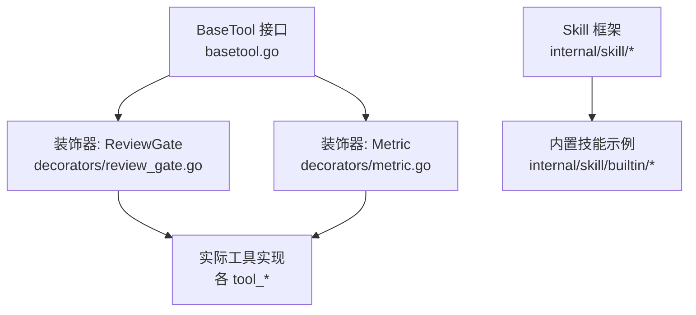
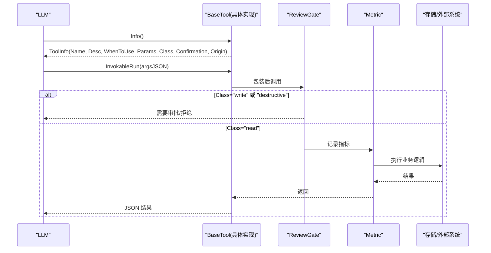
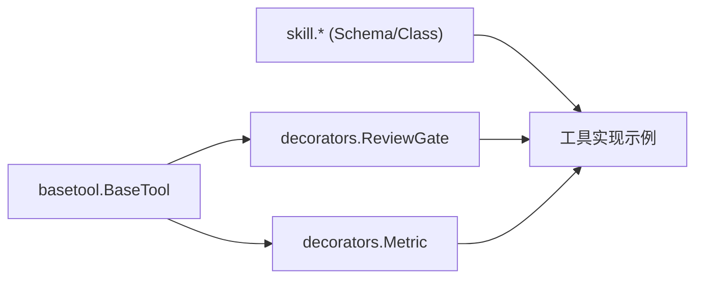

# 工具接口基础

<cite>
**本文引用的文件**
- [basetool.go](file://internal/manager/biz/aiops/tools/basetool/basetool.go)
- [review_gate.go](file://internal/manager/biz/aiops/tools/decorators/review_gate.go)
- [metric.go](file://internal/manager/biz/aiops/tools/decorators/metric.go)
- [tool_adapter_test.go](file://internal/manager/biz/aiops/graph/tool_adapter_test.go)
- [tool_search_tool_test.go](file://internal/manager/biz/aiops/tools/tool_search_tool_test.go)
- [toolbag_test.go](file://internal/manager/biz/aiops/tools/toolbag_test.go)
- [schema.go](file://internal/skill/schema.go)
- [types.go](file://internal/skill/types.go)
- [probe_dns.go](file://internal/skill/builtin/probe_dns.go)
- [web_search.go](file://internal/skill/builtin/web_search.go)
- [restart_service.go](file://internal/skill/builtin/restart_service/restart_service.go)
</cite>

## 目录
1. [简介](#简介)
2. [项目结构](#项目结构)
3. [核心组件](#核心组件)
4. [架构总览](#架构总览)
5. [详细组件分析](#详细组件分析)
6. [依赖关系分析](#依赖关系分析)
7. [性能考虑](#性能考虑)
8. [故障排查指南](#故障排查指南)
9. [结论](#结论)
10. [附录](#附录)

## 简介
本文件面向“工具接口基础”，聚焦 ongrid 的 BaseTool 抽象与 ToolInfo 元数据，解释 Info() 与 InvokableRun() 的职责、参数校验、错误处理与返回值格式化的最佳实践；说明工具分类（read/write/destructive）与确认机制（confirmation），并给出实现一个基础工具的步骤与示例路径。

## 项目结构
- 工具接口定义位于 internal/manager/biz/aiops/tools/basetool，提供 BaseTool 接口与 ToolInfo 结构体，以及调用选项与解析能力。
- 装饰器链位于 decorators 包，如 ReviewGate（写/破坏性操作的人审门控）、Metric（指标埋点）。
- Skill 框架位于 internal/skill，提供设备侧能力的元数据、参数 Schema 生成与执行模型，作为工具实现的参考范式。
- 内置技能示例位于 internal/skill/builtin，包含读类（DNS 探测、联网搜索）与写类（重启服务）的实现。

图表来源
- [basetool.go:30-56](file://internal/manager/biz/aiops/tools/basetool/basetool.go#L30-L56)
- [review_gate.go:15-41](file://internal/manager/biz/aiops/tools/decorators/review_gate.go#L15-L41)
- [metric.go:103-122](file://internal/manager/biz/aiops/tools/decorators/metric.go#L103-L122)
- [types.go:19-26](file://internal/skill/types.go#L19-L26)
- [probe_dns.go:13-39](file://internal/skill/builtin/probe_dns.go#L13-L39)
- [web_search.go:161-195](file://internal/skill/builtin/web_search.go#L161-L195)
- [restart_service.go:69-93](file://internal/skill/builtin/restart_service/restart_service.go#L69-L93)

章节来源
- [basetool.go:30-125](file://internal/manager/biz/aiops/tools/basetool/basetool.go#L30-L125)
- [types.go:19-26](file://internal/skill/types.go#L19-L26)

## 核心组件
- BaseTool 接口
  - Info(ctx): 返回只读的 ToolInfo，描述工具名称、用途、何时使用、参数 JSON Schema、工具类别与确认策略等。必须纯读，不得访问外部系统。
  - InvokableRun(ctx, argsJSON, opts...): 执行工具，参数为 LLM 生成的原始 JSON 字符串；返回给 LLM 的 role=tool 消息体为 JSON 字符串；错误会向上传播并被上层分类为 success/error/timeout。
- ToolInfo 结构体关键字段
  - Name: 稳定的工具名（snake_case），对应 function.name。
  - Description: 一句话说明工具做什么。
  - WhenToUse: 在相似工具中用于路由提示的“何时使用”说明。
  - Parameters: 参数的 JSON Schema，供装饰器注入与工具反序列化。
  - Class: 工具类别 read/write/destructive，决定是否需要人审或二次确认。
  - Confirmation: 确认策略 required/not-required/self-managed，覆盖默认策略。
  - Origin: 来源标记 builtin/mcp/skill，区分编译期内置与运行时发现的能力。
- 调用选项与上下文
  - InvokeOption/ResolveOptions: 携带租户、用户、设备、人类审批等每调用上下文，供装饰器与工具读取。

章节来源
- [basetool.go:30-56](file://internal/manager/biz/aiops/tools/basetool/basetool.go#L30-L56)
- [basetool.go:58-125](file://internal/manager/biz/aiops/tools/basetool/basetool.go#L58-L125)
- [basetool.go:134-259](file://internal/manager/biz/aiops/tools/basetool/basetool.go#L134-L259)

## 架构总览
BaseTool 是统一入口，所有工具通过装饰器链进行横切增强：审计、限流、度量、租户绑定、人审门控等。ReviewGate 对 write/destructive 工具强制进入二审流程；Metric 记录调用次数与时延；Memoization 对 read 成功结果缓存，但不对 destructive 与错误结果缓存。

图表来源
- [basetool.go:30-56](file://internal/manager/biz/aiops/tools/basetool/basetool.go#L30-L56)
- [review_gate.go:15-41](file://internal/manager/biz/aiops/tools/decorators/review_gate.go#L15-L41)
- [metric.go:103-122](file://internal/manager/biz/aiops/tools/decorators/metric.go#L103-L122)
- [tool_adapter_test.go:287-312](file://internal/manager/biz/aiops/graph/tool_adapter_test.go#L287-L312)

## 详细组件分析

### BaseTool 接口与 ToolInfo 字段语义
- Info() 必须是纯读，仅暴露元数据，不触发 I/O。
- InvokableRun() 负责参数解析、业务执行、错误处理与 JSON 结果封装。
- ToolInfo.Class 控制行为分支：
  - read: 查询类，可缓存成功结果。
  - write: 修改 ongrid 状态，需审批。
  - destructive: 修改外部状态（如重启服务），需更严格审批。
- ToolInfo.Confirmation 覆盖默认审批策略：
  - required: 即使 read 也可能需要审批（敏感读）。
  - not-required: 明确豁免内部无害写。
  - self-managed: 由工具自身已具备审批协议。

章节来源
- [basetool.go:30-125](file://internal/manager/biz/aiops/tools/basetool/basetool.go#L30-L125)

### 装饰器：ReviewGate（写/破坏性操作的人审门控）
- 当工具 Class 为 write/destructive 时拦截调用，走 SOP 二审流程；批准后才放行到内层工具，否则返回错误以便协调器向用户解释。
- 该装饰器位置在 chain.Wrap 中，确保所有 mutating 调用均被统一治理。

章节来源
- [review_gate.go:15-41](file://internal/manager/biz/aiops/tools/decorators/review_gate.go#L15-L41)

### 装饰器：Metric（指标埋点）
- 每次调用统计 ongrid_tool_invocations_total 与 ongrid_tool_duration_seconds，按工具名与结果维度聚合。

章节来源
- [metric.go:103-122](file://internal/manager/biz/aiops/tools/decorators/metric.go#L103-L122)

### 缓存与幂等策略（read vs write/destructive）
- read 工具的成功结果可缓存，重复相同入参直接命中。
- write/destructive 工具绝不缓存，保证每次调用可见且可重试。
- 失败结果不缓存，保持可重试性。

章节来源
- [tool_adapter_test.go:287-312](file://internal/manager/biz/aiops/graph/tool_adapter_test.go#L287-L312)

### 参数 Schema 与验证
- ToolInfo.Parameters 为 JSON Schema，装饰器可据此注入字段（如 tenant_id），工具实现通过 json.Unmarshal 映射到结构化参数。
- Skill 框架提供 ParamSchema 到 JSON Schema 的转换，支持 string/int/float/bool/duration/enum/array 等类型，并可声明必填与默认值。

章节来源
- [basetool.go:81-85](file://internal/manager/biz/aiops/tools/basetool/basetool.go#L81-L85)
- [schema.go:22-95](file://internal/skill/schema.go#L22-L95)

### 工具分类与确认机制
- Class=read/write/destructive 决定审批与缓存策略。
- Confirmation 可在 read 上强制要求确认，或在写操作上豁免（not-required），或交由工具自管（self-managed）。

章节来源
- [basetool.go:87-117](file://internal/manager/biz/aiops/tools/basetool/basetool.go#L87-L117)

### 简单工具实现示例（读类）
- DNS 探测（host_probe_dns）：安全读，参数 host 必填，超时可选；Execute 中做参数校验、超时控制与结果封装。
- 联网搜索（web_search）：Manager 端读类，多 Provider 选择，参数 query 必填，结果标准化返回。

章节来源
- [probe_dns.go:13-85](file://internal/skill/builtin/probe_dns.go#L13-L85)
- [web_search.go:161-283](file://internal/skill/builtin/web_search.go#L161-L283)

### 写类工具示例（需审批）
- 重启服务（host_restart_service）：Class=mutating，Scope=host，直接 Execute 会被拒绝，必须经 Manager 端 BaseTool + ReviewGate 审批后执行。

章节来源
- [restart_service.go:1-114](file://internal/skill/builtin/restart_service/restart_service.go#L1-L114)

### 工具搜索与元数据合并
- ToolSearch 工具用于根据自然语言查询匹配可用工具，合并 WhenToUse 到描述中，便于 LLM 路由。
- 红化（redacted）工具对外暴露空 properties 的 Schema，并提示使用 ToolSearch 获取完整参数。

章节来源
- [tool_search_tool_test.go:42-80](file://internal/manager/biz/aiops/tools/tool_search_tool_test.go#L42-L80)
- [tool_search_tool_test.go:138-159](file://internal/manager/biz/aiops/tools/tool_search_tool_test.go#L138-L159)
- [tool_search_tool_test.go:229-267](file://internal/manager/biz/aiops/tools/tool_search_tool_test.go#L229-L267)
- [toolbag_test.go:147-173](file://internal/manager/biz/aiops/tools/toolbag_test.go#L147-L173)
- [tool_adapter_test.go:105-146](file://internal/manager/biz/aiops/graph/tool_adapter_test.go#L105-L146)

## 依赖关系分析
- basetool 提供接口与元数据，被 decorators 与工具实现共同依赖。
- decorators 依赖 basetool 以读取工具元数据与调用选项。
- skill 框架独立于 manager 侧工具，但提供了参数 Schema 生成与权限分类范式，可作为工具实现的参考。

图表来源
- [basetool.go:30-56](file://internal/manager/biz/aiops/tools/basetool/basetool.go#L30-L56)
- [review_gate.go:15-41](file://internal/manager/biz/aiops/tools/decorators/review_gate.go#L15-L41)
- [metric.go:103-122](file://internal/manager/biz/aiops/tools/decorators/metric.go#L103-L122)
- [types.go:19-26](file://internal/skill/types.go#L19-L26)

章节来源
- [basetool.go:30-125](file://internal/manager/biz/aiops/tools/basetool/basetool.go#L30-L125)
- [types.go:19-26](file://internal/skill/types.go#L19-L26)

## 性能考虑
- 读类工具可缓存成功结果，减少重复 I/O。
- 写/破坏性工具禁止缓存，避免副作用被误复用。
- 使用装饰器统一度量耗时与调用次数，便于定位瓶颈。
- 参数校验尽早失败，避免无效请求进入后端。

[本节为通用指导，无需特定文件引用]

## 故障排查指南
- 空查询被拒绝：ToolSearch 对空 query 返回错误，提示 LLM 补全参数。
- 红化 Schema：对外隐藏敏感参数，提示使用 ToolSearch 获取完整 Schema。
- 写/破坏性工具未审批：ReviewGate 拦截并返回错误，需在审批通过后重试。
- 读类错误不缓存：失败结果保持可重试，检查上游依赖与网络。

章节来源
- [tool_search_tool_test.go:229-239](file://internal/manager/biz/aiops/tools/tool_search_tool_test.go#L229-L239)
- [toolbag_test.go:147-173](file://internal/manager/biz/aiops/tools/toolbag_test.go#L147-L173)
- [tool_adapter_test.go:287-312](file://internal/manager/biz/aiops/graph/tool_adapter_test.go#L287-L312)

## 结论
BaseTool 将工具元数据与执行解耦，配合 ToolInfo 的分类与确认机制，实现了统一的工具治理：读类可缓存、写/破坏性需审批、参数 Schema 驱动校验与注入。通过装饰器链，审计、度量与人审门控得以横切应用，提升安全性与可观测性。实现新工具时，应遵循参数校验、错误处理与返回值格式化的约定，并确保正确的 Class 与 Confirmation 设置。

[本节为总结，无需特定文件引用]

## 附录
- 参数 Schema 类型映射与必填/默认值：参见 Skill 框架的 ToJSONSchema 实现。
- 工具来源标记：OriginBuiltin/MCP/Skill，用于区分内置与动态发现的能力。
- 调用选项：WithTenant/WithUserID/WithDeviceID/WithUserText/WithConfirmedDeviceIDs/WithHostWritePermission/WithHumanApproval，用于传递跨切面上下文。

章节来源
- [schema.go:22-95](file://internal/skill/schema.go#L22-L95)
- [basetool.go:113-132](file://internal/manager/biz/aiops/tools/basetool/basetool.go#L113-L132)
- [basetool.go:178-219](file://internal/manager/biz/aiops/tools/basetool/basetool.go#L178-L219)