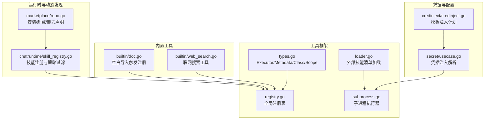
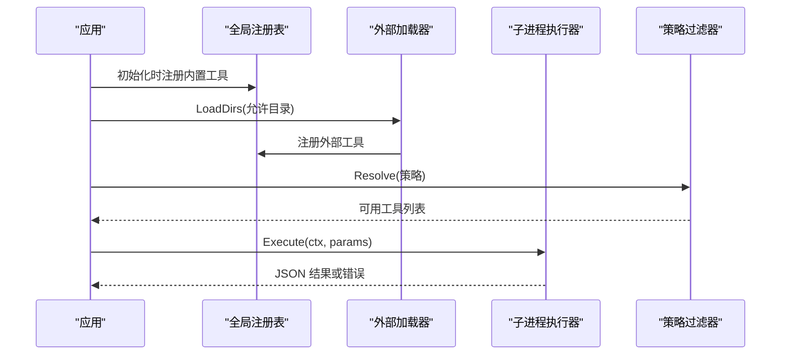
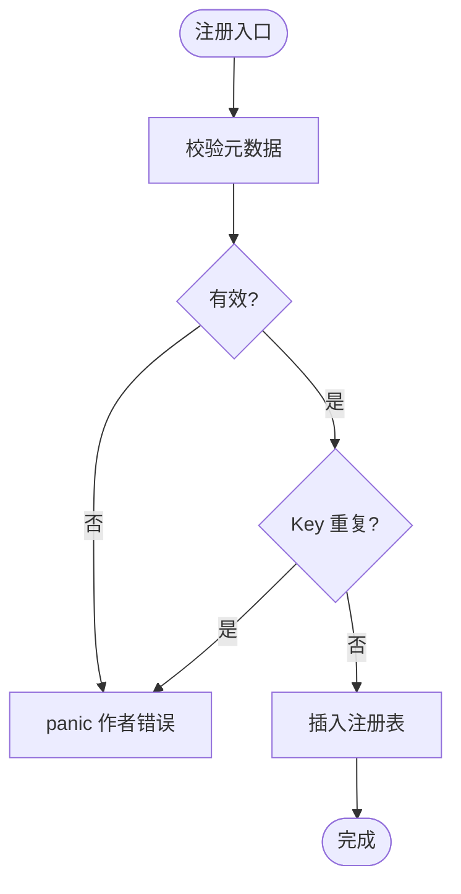
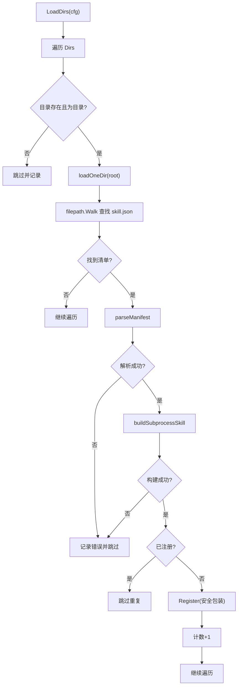
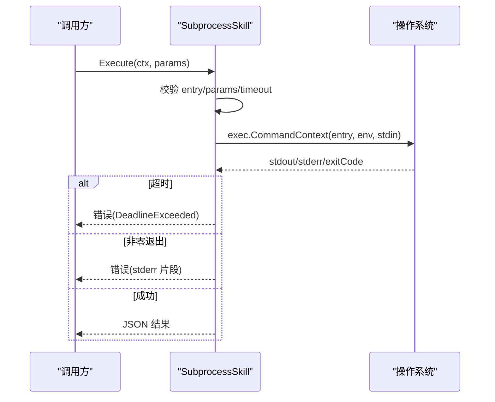
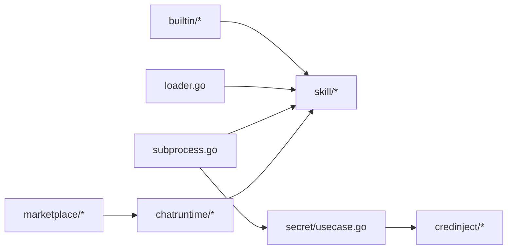

# 工具注册机制

<cite>
**本文引用的文件**
- [internal/skill/types.go](file://internal/skill/types.go)
- [internal/skill/registry.go](file://internal/skill/registry.go)
- [internal/skill/loader.go](file://internal/skill/loader.go)
- [internal/skill/subprocess.go](file://internal/skill/subprocess.go)
- [internal/skill/builtin/doc.go](file://internal/skill/builtin/doc.go)
- [internal/skill/builtin/web_search.go](file://internal/skill/builtin/web_search.go)
- [internal/manager/biz/aiops/chatruntime/skill_registry.go](file://internal/manager/biz/aiops/chatruntime/skill_registry.go)
- [internal/manager/biz/marketplace/repo.go](file://internal/manager/biz/marketplace/repo.go)
- [internal/manager/biz/secret/usecase.go](file://internal/manager/biz/secret/usecase.go)
- [internal/pkg/credinject/credinject.go](file://internal/pkg/credinject/credinject.go)
</cite>

## 目录
1. [简介](#简介)
2. [项目结构](#项目结构)
3. [核心组件](#核心组件)
4. [架构总览](#架构总览)
5. [详细组件分析](#详细组件分析)
6. [依赖关系分析](#依赖关系分析)
7. [性能与并发特性](#性能与并发特性)
8. [故障排查指南](#故障排查指南)
9. [结论](#结论)
10. [附录：最佳实践与示例路径](#附录最佳实践与示例路径)

## 简介
本指南系统性说明 ongrid 的“工具（Skill）”注册机制，覆盖静态注册与动态发现两种模式、工具生命周期管理（从注册到调用）、依赖注入与配置管理、以及版本与兼容性处理的最佳实践。通过代码级分析与图示，帮助读者理解如何在应用中注册自定义工具并安全地运行。

## 项目结构
- 工具框架核心位于 internal/skill，定义统一的 Executor 接口、元数据、权限分类与执行范围，并提供全局注册表与外部子进程工具加载器。
- 内置工具位于 internal/skill/builtin，通过包级 init() 自动向全局注册表注册。
- 运行时技能目录扫描与策略过滤位于 internal/manager/biz/aiops/chatruntime，支持按策略选择可用技能集合。
- 市场化工具包安装与能力声明位于 internal/manager/biz/marketplace，结合 chatruntime 完成动态发现与热更新。
- 凭据注入与配置解析位于 internal/manager/biz/secret 与 internal/pkg/credinject，为工具提供安全的凭据注入能力。

**图表来源**
- [internal/skill/types.go:99-203](file://internal/skill/types.go#L99-L203)
- [internal/skill/registry.go:10-47](file://internal/skill/registry.go#L10-L47)
- [internal/skill/loader.go:13-67](file://internal/skill/loader.go#L13-L67)
- [internal/skill/subprocess.go:30-78](file://internal/skill/subprocess.go#L30-L78)
- [internal/skill/builtin/doc.go:1-26](file://internal/skill/builtin/doc.go#L1-L26)
- [internal/skill/builtin/web_search.go:19-46](file://internal/skill/builtin/web_search.go#L19-L46)
- [internal/manager/biz/aiops/chatruntime/skill_registry.go:10-30](file://internal/manager/biz/aiops/chatruntime/skill_registry.go#L10-L30)
- [internal/manager/biz/marketplace/repo.go:107-147](file://internal/manager/biz/marketplace/repo.go#L107-L147)
- [internal/manager/biz/secret/usecase.go:147-185](file://internal/manager/biz/secret/usecase.go#L147-L185)
- [internal/pkg/credinject/credinject.go:1-41](file://internal/pkg/credinject/credinject.go#L1-L41)

**章节来源**
- [internal/skill/types.go:1-241](file://internal/skill/types.go#L1-L241)
- [internal/skill/registry.go:1-127](file://internal/skill/registry.go#L1-L127)
- [internal/skill/loader.go:1-274](file://internal/skill/loader.go#L1-L274)
- [internal/skill/subprocess.go:1-268](file://internal/skill/subprocess.go#L1-L268)
- [internal/skill/builtin/doc.go:1-26](file://internal/skill/builtin/doc.go#L1-L26)
- [internal/skill/builtin/web_search.go:1-593](file://internal/skill/builtin/web_search.go#L1-L593)
- [internal/manager/biz/aiops/chatruntime/skill_registry.go:1-30](file://internal/manager/biz/aiops/chatruntime/skill_registry.go#L1-L30)
- [internal/manager/biz/marketplace/repo.go:107-147](file://internal/manager/biz/marketplace/repo.go#L107-L147)
- [internal/manager/biz/secret/usecase.go:147-185](file://internal/manager/biz/secret/usecase.go#L147-L185)
- [internal/pkg/credinject/credinject.go:1-41](file://internal/pkg/credinject/credinject.go#L1-L41)

## 核心组件
- 工具抽象与元数据
  - Executor 接口统一了工具的元数据描述与执行入口，参数以 JSON 传递，返回结果也为 JSON。
  - Metadata 包含 Key、Name、Description、Class（safe/mutating/dangerous）、Scope（host/manager）、Params、ResultPreview 等，用于自动生成 LLM 工具、HTTP 路由、UI 表单与审计。
  - Class 决定调用门槛：safe 可直接调用；mutating 需人工审批；dangerous 需严格 SOP 与双审。
  - Scope 决定执行位置：host 在边缘设备执行；manager 在管理器进程内执行。

- 全局注册表
  - 进程级 Registry 维护所有已注册的工具，支持按 Key 查找、枚举全部工具、按 Class 过滤。
  - 注册阶段使用互斥锁保护，读操作并发安全；重复 Key 或无效元数据会 panic，确保作者错误在启动时暴露。

- 外部工具加载器
  - LoaderConfig 指定允许扫描的目录；LoadDirs 递归查找 skill.json 清单，构建 SubprocessSkill 并注册到全局注册表。
  - 清单校验严格：名称必须 lower_snake，描述必填，entry 必须绝对路径且位于允许根目录下，class 必须合法，超时默认 30s。
  - 重复清单会被跳过，避免部署期间新旧清单共存导致崩溃。

- 子进程执行器
  - SubprocessSkill 将工具作为独立进程执行，stdin 传入参数 JSON，stdout 返回结果 JSON。
  - 环境变量白名单控制：仅 EnvAllow 中指定的变量被注入，默认不继承父进程环境。
  - 输出限制：stdout 最大 16MiB，stderr 尾部保留 4KiB 用于诊断；超时默认 30s。
  - 非零退出码视为错误，并附带 stderr 片段便于排错。

- 运行时技能注册与策略过滤
  - SkillRegistry 持有从 skills 根目录发现的技能集合，支持 Reload 原子替换，并发安全。
  - Resolve 方法根据策略（如 AllowedClasses）过滤工具类，确保只有允许的工具可被调用。

- 市场化工具包
  - 安装/卸载后调用 Reload，使新工具立即生效；InstallResult 包含能力声明与警告信息，便于 UI 展示。
  - CapabilitySummary 汇总工具类、二进制、配置键与凭据槽位，驱动安装确认对话框。

- 凭据注入与配置管理
  - secret/usecase 提供凭据注入解析，基于类型规则生成环境变量映射；custom 类型直接按字段名注入。
  - credinject 实现 n8n 风格的 {{field}} 模板解析，产出环境变量与临时文件的注入计划。

**章节来源**
- [internal/skill/types.go:99-203](file://internal/skill/types.go#L99-L203)
- [internal/skill/registry.go:10-127](file://internal/skill/registry.go#L10-L127)
- [internal/skill/loader.go:55-161](file://internal/skill/loader.go#L55-L161)
- [internal/skill/subprocess.go:30-172](file://internal/skill/subprocess.go#L30-L172)
- [internal/manager/biz/aiops/chatruntime/skill_registry.go:10-30](file://internal/manager/biz/aiops/chatruntime/skill_registry.go#L10-L30)
- [internal/manager/biz/marketplace/repo.go:107-147](file://internal/manager/biz/marketplace/repo.go#L107-L147)
- [internal/manager/biz/secret/usecase.go:147-185](file://internal/manager/biz/secret/usecase.go#L147-L185)
- [internal/pkg/credinject/credinject.go:1-41](file://internal/pkg/credinject/credinject.go#L1-L41)

## 架构总览
工具注册机制由“静态注册 + 动态发现”组成：
- 静态注册：内置工具通过包级 init() 调用 Register 加入全局注册表。
- 动态发现：Loader 扫描外部目录中的 skill.json，构建 SubprocessSkill 并注册；Marketplace 安装/卸载后刷新注册表。
- 运行时策略：chatruntime 的 SkillRegistry 根据策略过滤工具类，Resolve 返回可用工具集合。
- 执行路径：Manager 侧工具直接在进程内执行；Host 侧工具通过隧道下发到边缘执行。

**图表来源**
- [internal/skill/builtin/doc.go:19-25](file://internal/skill/builtin/doc.go#L19-L25)
- [internal/skill/loader.go:69-161](file://internal/skill/loader.go#L69-L161)
- [internal/skill/registry.go:26-47](file://internal/skill/registry.go#L26-L47)
- [internal/skill/subprocess.go:99-172](file://internal/skill/subprocess.go#L99-L172)
- [internal/manager/biz/aiops/chatruntime/skill_registry.go:10-30](file://internal/manager/biz/aiops/chatruntime/skill_registry.go#L10-L30)

## 详细组件分析

### 全局注册表（静态注册）
- 设计要点
  - 进程级单例，init() 阶段注册，运行时并发读取。
  - Register 对元数据进行校验，重复 Key 或非法元数据 panic，确保作者错误尽早暴露。
  - AllByClass 支持按权限类过滤，便于 LLM 工具注册与 UI 展示。

- 关键流程
  - 内置工具在 init() 中调用 Register，将 Executor 加入全局 map。
  - 运行时通过 Get/All/AllByClass 查询工具。

**图表来源**
- [internal/skill/registry.go:26-74](file://internal/skill/registry.go#L26-L74)
- [internal/skill/types.go:127-175](file://internal/skill/types.go#L127-L175)

**章节来源**
- [internal/skill/registry.go:10-127](file://internal/skill/registry.go#L10-L127)
- [internal/skill/types.go:99-203](file://internal/skill/types.go#L99-L203)

### 外部工具加载器（动态发现）
- 设计要点
  - LoaderConfig.Dirs 为允许扫描的目录白名单；非存在或非绝对路径将被跳过。
  - 每个 skill.json 被解析并构建 SubprocessSkill，随后注册到全局注册表。
  - 重复清单跳过，避免部署期间冲突；Register 失败通过 recover 捕获并记录日志。

- 关键流程
  - LoadDirs 遍历目录，loadOneDir 递归查找 skill.json。
  - parseManifest 解析清单；buildSubprocessSkill 校验并构造执行器。
  - Register 前检查是否已存在同名工具，避免重复注册。

**图表来源**
- [internal/skill/loader.go:69-161](file://internal/skill/loader.go#L69-L161)
- [internal/skill/loader.go:163-254](file://internal/skill/loader.go#L163-L254)

**章节来源**
- [internal/skill/loader.go:13-274](file://internal/skill/loader.go#L13-L274)

### 子进程执行器（安全执行）
- 设计要点
  - 强制 ScopeManager，防止任意二进制在边缘执行。
  - 环境变量白名单：仅 EnvAllow 中指定的变量被注入，默认不继承 PATH。
  - 输出限制：stdout 上限 16MiB，stderr 尾部保留 4KiB；超时默认 30s。
  - 参数校验：空参数转为 "{}"，非 JSON 报错；entry 必须为绝对路径且可执行。

- 关键流程
  - Execute 校验 entry、参数 JSON、超时上下文。
  - 构建环境变量，启动子进程，捕获 stdout/stderr，检查退出码。
  - 非零退出码返回错误并附带 stderr 片段。

**图表来源**
- [internal/skill/subprocess.go:99-172](file://internal/skill/subprocess.go#L99-L172)
- [internal/skill/subprocess.go:174-238](file://internal/skill/subprocess.go#L174-L238)

**章节来源**
- [internal/skill/subprocess.go:17-268](file://internal/skill/subprocess.go#L17-L268)

### 运行时技能注册与策略过滤
- 设计要点
  - SkillRegistry 持有从 skills 根目录发现的技能集合，Reload 原子替换，并发安全。
  - Resolve 根据策略（如 AllowedClasses）过滤工具类，确保只有允许的工具可被调用。

- 关键流程
  - Load 扫描目录，收集技能与警告。
  - Reload 在写锁下重建切片并原子交换，避免在读操作中观察到中间状态。
  - Resolve 返回符合策略的技能集合。

**章节来源**
- [internal/manager/biz/aiops/chatruntime/skill_registry.go:10-30](file://internal/manager/biz/aiops/chatruntime/skill_registry.go#L10-L30)

### 市场化工具包与能力声明
- 设计要点
  - Install/Uninstall 后调用 Reload，使新工具立即生效。
  - InstallResult 包含能力声明与警告信息，便于 UI 展示。
  - CapabilitySummary 汇总工具类、二进制、配置键与凭据槽位，驱动安装确认对话框。

**章节来源**
- [internal/manager/biz/marketplace/repo.go:107-147](file://internal/manager/biz/marketplace/repo.go#L107-L147)

### 凭据注入与配置管理
- 设计要点
  - secret/usecase 提供凭据注入解析，基于类型规则生成环境变量映射；custom 类型直接按字段名注入。
  - credinject 实现 n8n 风格的 {{field}} 模板解析，产出环境变量与临时文件的注入计划。
  - 子进程执行器通过 EnvAllow 白名单控制环境变量注入，确保安全。

**章节来源**
- [internal/manager/biz/secret/usecase.go:147-185](file://internal/manager/biz/secret/usecase.go#L147-L185)
- [internal/pkg/credinject/credinject.go:1-41](file://internal/pkg/credinject/credinject.go#L1-L41)
- [internal/skill/subprocess.go:64-78](file://internal/skill/subprocess.go#L64-L78)

## 依赖关系分析
- 低耦合设计
  - skill 包不依赖 manager 包，通过接口解耦配置解析（如 WebSearchConfigResolver）。
  - 凭据注入与执行器分离，credinject 无外部依赖，便于单元测试。
- 直接依赖
  - 内置工具依赖 skill 包进行注册。
  - Loader 依赖 skill 包构建 SubprocessSkill。
  - chatruntime 依赖 skill 包进行策略过滤。
  - marketplace 依赖 chatruntime 进行动态发现。
- 潜在循环依赖
  - 通过接口与包隔离避免循环依赖；skill 包保持最小依赖。

**图表来源**
- [internal/skill/builtin/doc.go:19-25](file://internal/skill/builtin/doc.go#L19-L25)
- [internal/skill/loader.go:69-161](file://internal/skill/loader.go#L69-L161)
- [internal/skill/subprocess.go:99-172](file://internal/skill/subprocess.go#L99-L172)
- [internal/manager/biz/aiops/chatruntime/skill_registry.go:10-30](file://internal/manager/biz/aiops/chatruntime/skill_registry.go#L10-L30)
- [internal/manager/biz/marketplace/repo.go:107-147](file://internal/manager/biz/marketplace/repo.go#L107-L147)
- [internal/manager/biz/secret/usecase.go:147-185](file://internal/manager/biz/secret/usecase.go#L147-L185)
- [internal/pkg/credinject/credinject.go:1-41](file://internal/pkg/credinject/credinject.go#L1-L41)

**章节来源**
- [internal/skill/types.go:1-241](file://internal/skill/types.go#L1-L241)
- [internal/skill/registry.go:1-127](file://internal/skill/registry.go#L1-L127)
- [internal/skill/loader.go:1-274](file://internal/skill/loader.go#L1-L274)
- [internal/skill/subprocess.go:1-268](file://internal/skill/subprocess.go#L1-L268)
- [internal/skill/builtin/doc.go:1-26](file://internal/skill/builtin/doc.go#L1-L26)
- [internal/manager/biz/aiops/chatruntime/skill_registry.go:1-30](file://internal/manager/biz/aiops/chatruntime/skill_registry.go#L1-L30)
- [internal/manager/biz/marketplace/repo.go:107-147](file://internal/manager/biz/marketplace/repo.go#L107-L147)
- [internal/manager/biz/secret/usecase.go:147-185](file://internal/manager/biz/secret/usecase.go#L147-L185)
- [internal/pkg/credinject/credinject.go:1-41](file://internal/pkg/credinject/credinject.go#L1-L41)

## 性能与并发特性
- 注册阶段
  - 注册发生在 init() 或加载阶段，单线程执行，使用互斥锁保护写入。
  - 重复 Key 或无效元数据 panic，避免运行时错误扩散。
- 运行时查询
  - 读操作使用读锁，支持高并发查询 All/Get/AllByClass。
  - chatruntime 的 Reload 原子替换切片，避免读操作观察到中间状态。
- 子进程执行
  - 超时控制默认 30s，防止长时间阻塞。
  - 输出限制防止内存膨胀；stderr 尾部保留用于诊断。
- 策略过滤
  - Resolve 按类过滤，减少不必要工具暴露给 LLM。

[本节提供通用指导，无需特定文件分析]

## 故障排查指南
- 注册失败
  - 检查元数据是否有效（Key、Name、Description、Class、Scope、Params）。
  - 重复 Key 会导致 panic，确保唯一性。
- 外部工具未加载
  - 检查 LoaderConfig.Dirs 是否为绝对路径且存在。
  - 检查 skill.json 是否合法，entry 是否在允许根目录下。
- 子进程执行错误
  - 检查 entry 是否可执行，参数是否为有效 JSON。
  - 检查环境变量白名单是否正确配置。
  - 查看 stderr 片段定位问题。
- 策略过滤导致工具不可用
  - 检查 AllowedClasses 是否包含目标工具类。
- 凭据注入失败
  - 检查凭据类型与注入规则是否匹配。
  - 检查模板 {{field}} 是否与凭据字段一致。

**章节来源**
- [internal/skill/registry.go:26-74](file://internal/skill/registry.go#L26-L74)
- [internal/skill/loader.go:163-254](file://internal/skill/loader.go#L163-L254)
- [internal/skill/subprocess.go:99-172](file://internal/skill/subprocess.go#L99-L172)
- [internal/manager/biz/aiops/chatruntime/skill_registry.go:10-30](file://internal/manager/biz/aiops/chatruntime/skill_registry.go#L10-L30)
- [internal/manager/biz/secret/usecase.go:147-185](file://internal/manager/biz/secret/usecase.go#L147-L185)
- [internal/pkg/credinject/credinject.go:1-41](file://internal/pkg/credinject/credinject.go#L1-L41)

## 结论
ongrid 的工具注册机制通过静态注册与动态发现相结合，提供了灵活、安全、可扩展的工具管理能力。全局注册表保证并发安全，外部加载器支持插件化扩展，策略过滤确保工具调用的安全性。凭据注入与配置管理为工具提供了安全的运行时环境。遵循最佳实践可实现高效的工具开发与集成。

[本节总结内容，无需特定文件分析]

## 附录：最佳实践与示例路径
- 静态注册示例
  - 在内置工具包中通过 init() 调用 Register 注册工具。
  - 参考路径：[internal/skill/builtin/web_search.go:19-46](file://internal/skill/builtin/web_search.go#L19-L46)
- 动态发现示例
  - 在外部目录放置 skill.json，配置 entry、env_allow、timeout_seconds、class 等字段。
  - 参考路径：[internal/skill/loader.go:13-67](file://internal/skill/loader.go#L13-L67)
- 依赖注入示例
  - 通过 WebSearchConfigResolver 注入配置，或使用 credinject 解析凭据模板。
  - 参考路径：[internal/skill/builtin/web_search.go:48-101](file://internal/skill/builtin/web_search.go#L48-L101)
  - 参考路径：[internal/pkg/credinject/credinject.go:1-41](file://internal/pkg/credinject/credinject.go#L1-L41)
- 版本管理与兼容性
  - 使用 Class 与 Scope 控制工具行为，避免破坏性变更。
  - 通过策略过滤逐步启用新工具，确保向后兼容。
  - 参考路径：[internal/skill/types.go:35-61](file://internal/skill/types.go#L35-L61)
  - 参考路径：[internal/manager/biz/aiops/chatruntime/skill_registry.go:10-30](file://internal/manager/biz/aiops/chatruntime/skill_registry.go#L10-L30)

**章节来源**
- [internal/skill/builtin/web_search.go:19-101](file://internal/skill/builtin/web_search.go#L19-L101)
- [internal/skill/loader.go:13-67](file://internal/skill/loader.go#L13-L67)
- [internal/pkg/credinject/credinject.go:1-41](file://internal/pkg/credinject/credinject.go#L1-L41)
- [internal/skill/types.go:35-61](file://internal/skill/types.go#L35-L61)
- [internal/manager/biz/aiops/chatruntime/skill_registry.go:10-30](file://internal/manager/biz/aiops/chatruntime/skill_registry.go#L10-L30)