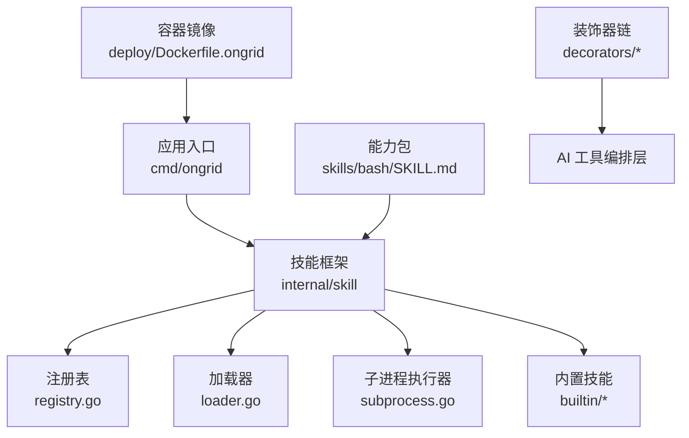
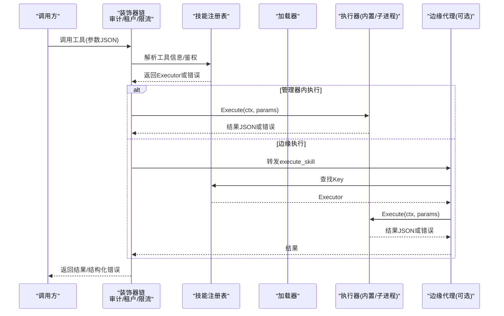
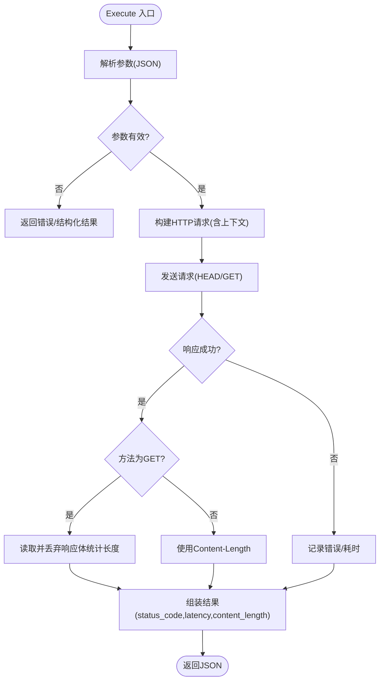
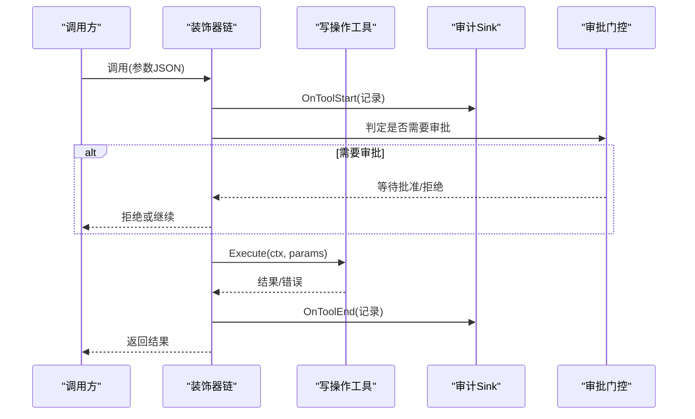
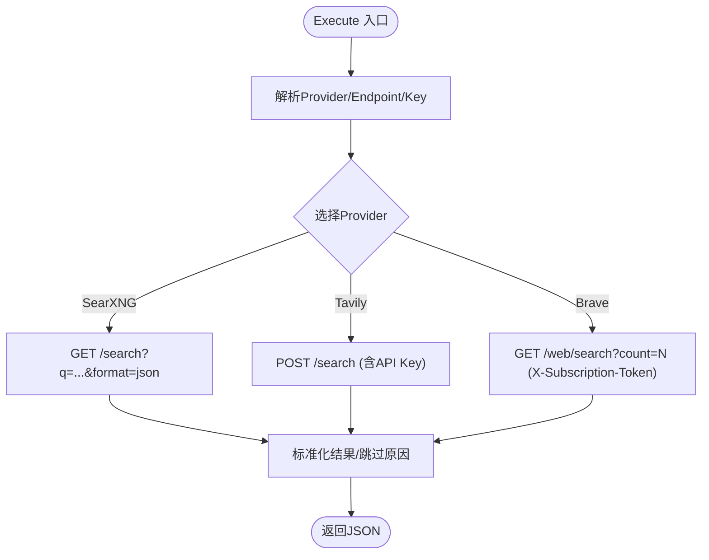
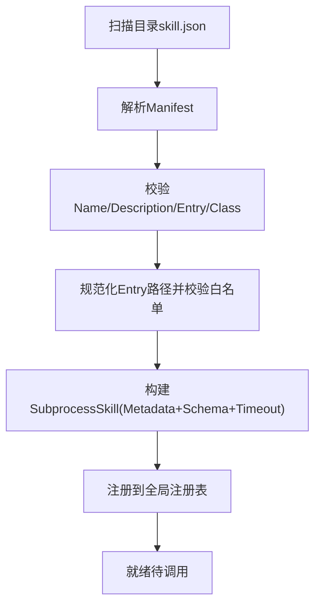
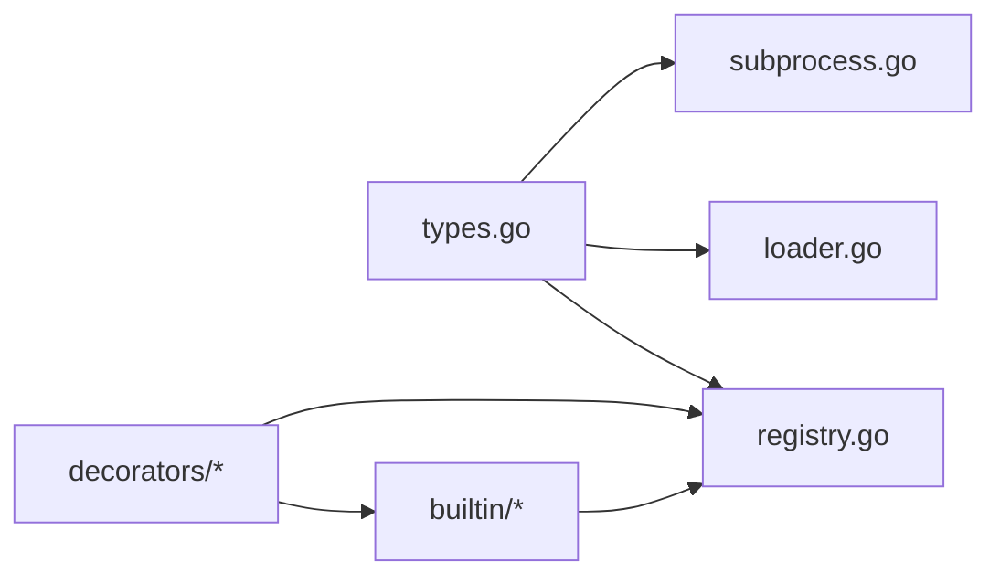

# 开发示例与最佳实践

<cite>
**本文引用的文件**
- [README.md](file://README.md)
- [types.go](file://internal/skill/types.go)
- [registry.go](file://internal/skill/registry.go)
- [loader.go](file://internal/skill/loader.go)
- [subprocess.go](file://internal/skill/subprocess.go)
- [probe_http.go](file://internal/skill/builtin/probe_http.go)
- [probe_ping.go](file://internal/skill/builtin/probe_ping.go)
- [web_search.go](file://internal/skill/builtin/web_search.go)
- [tail_file.go](file://internal/skill/builtin/tail_file.go)
- [probe_http_test.go](file://internal/skill/builtin/probe_http_test.go)
- [SKILL.md](file://skills/bash/SKILL.md)
- [Dockerfile.ongrid](file://deploy/Dockerfile.ongrid)
- [audit.go](file://internal/manager/biz/aiops/tools/decorators/audit.go)
- [tenant_bind.go](file://internal/manager/biz/aiops/tools/decorators/tenant_bind.go)
- [chain.go](file://internal/manager/biz/aiops/tools/decorators/chain.go)
</cite>

## 目录
1. [简介](#简介)
2. [项目结构](#项目结构)
3. [核心组件](#核心组件)
4. [架构总览](#架构总览)
5. [详细组件分析](#详细组件分析)
6. [依赖关系分析](#依赖关系分析)
7. [性能考量](#性能考量)
8. [故障排查指南](#故障排查指南)
9. [结论](#结论)
10. [附录](#附录)

## 简介
本指南基于仓库中“技能（Skill）”框架，提供从零开始开发自定义工具的完整步骤与最佳实践。内容涵盖：
- 项目结构与注册机制
- 代码实现范式（查询、写操作、外部系统调用）
- 参数校验、错误处理、日志与审计、权限分级
- 测试策略（单元、集成、性能）
- 部署配置与容器化要点
- 常见陷阱与解决方案
- 代码审查检查清单

该框架将工具抽象为“技能”，通过统一的元数据、执行器接口和注册表，自动派生 LLM 工具描述、HTTP API、UI 表单、权限门控与审计日志。新增一个工具只需编写一个实现并注册一次。

**章节来源**
- [README.md:43-120](file://README.md#L43-L120)

## 项目结构
与工具开发直接相关的目录与文件：
- internal/skill：技能框架核心（类型、注册表、加载器、子进程执行器）
- internal/skill/builtin：内置技能示例（HTTP 探测、Ping、Web 搜索、文件尾部读取）
- skills/bash：以 SKILL.md 描述的 Bash 能力包（只读沙箱命令）
- deploy：容器镜像构建与运行配置
- internal/manager/biz/aiops/tools/decorators：工具装饰器链（审计、租户绑定、限流等）

**图表来源**
- [registry.go:10-54](file://internal/skill/registry.go#L10-L54)
- [loader.go:13-74](file://internal/skill/loader.go#L13-L74)
- [subprocess.go:30-78](file://internal/skill/subprocess.go#L30-L78)
- [probe_http.go:15-47](file://internal/skill/builtin/probe_http.go#L15-L47)
- [SKILL.md:1-109](file://skills/bash/SKILL.md#L1-L109)
- [Dockerfile.ongrid:120-126](file://deploy/Dockerfile.ongrid#L120-L126)

**章节来源**
- [registry.go:10-54](file://internal/skill/registry.go#L10-L54)
- [loader.go:13-74](file://internal/skill/loader.go#L13-L74)
- [subprocess.go:30-78](file://internal/skill/subprocess.go#L30-L78)
- [probe_http.go:15-47](file://internal/skill/builtin/probe_http.go#L15-L47)
- [SKILL.md:1-109](file://skills/bash/SKILL.md#L1-L109)
- [Dockerfile.ongrid:120-126](file://deploy/Dockerfile.ongrid#L120-L126)

## 核心组件
- 技能元数据与执行器接口
  - Metadata：定义 Key、Name、Description、Class、Scope、Category、Params、ResultPreview
  - Executor：Metadata() 与 Execute(ctx, params)
  - ParamSchema：声明式参数类型、是否必填、默认值、枚举、数组元素类型
- 注册表
  - 全局注册表维护所有已注册技能；支持按 Class 过滤；并发安全
- 加载器
  - 扫描外部目录中的 skill.json，解析并注册 SubprocessSkill；路径白名单校验；超时与类别映射
- 子进程执行器
  - 每次调用启动独立进程；stdin/stdout JSON 协议；超时、输出大小限制、环境变量白名单；非零退出码封装为错误

**章节来源**
- [types.go:35-125](file://internal/skill/types.go#L35-L125)
- [types.go:127-188](file://internal/skill/types.go#L127-L188)
- [registry.go:10-54](file://internal/skill/registry.go#L10-L54)
- [loader.go:13-74](file://internal/skill/loader.go#L13-L74)
- [subprocess.go:30-78](file://internal/skill/subprocess.go#L30-L78)

## 架构总览
下图展示了从调用方到具体技能执行的端到端流程，包括管理器侧的装饰器链（审计、租户绑定、限流）与边缘侧的技能分发。

**图表来源**
- [registry.go:31-54](file://internal/skill/registry.go#L31-L54)
- [loader.go:69-110](file://internal/skill/loader.go#L69-L110)
- [subprocess.go:99-172](file://internal/skill/subprocess.go#L99-L172)
- [audit.go:67-97](file://internal/manager/biz/aiops/tools/decorators/audit.go#L67-L97)
- [tenant_bind.go:60-99](file://internal/manager/biz/aiops/tools/decorators/tenant_bind.go#L60-L99)
- [chain.go:11-41](file://internal/manager/biz/aiops/tools/decorators/chain.go#L11-L41)

## 详细组件分析

### 组件A：查询类工具（host_probe_http）
- 目标：对 URL 发起 HEAD/GET 请求，返回状态码、延迟、内容长度
- 关键实现要点
  - 元数据声明：Key、Name、Description、Class=安全、Category=网络、Params(url, method, timeout_ms)
  - 参数校验：URL 必填；method 仅允许 GET/HEAD；超时默认值与边界
  - 执行逻辑：创建带上下文的 HTTP 请求；记录耗时；GET 时读取并丢弃响应体统计长度
  - 错误处理：构造统一结果结构，包含 error 字段便于上层展示
- 测试策略
  - 使用 httptest 模拟服务端，验证 HEAD/GET 成功路径
  - 覆盖非法参数与不可达 URL 的错误分支

**图表来源**
- [probe_http.go:23-47](file://internal/skill/builtin/probe_http.go#L23-L47)
- [probe_http.go:62-119](file://internal/skill/builtin/probe_http.go#L62-L119)

**章节来源**
- [probe_http.go:15-119](file://internal/skill/builtin/probe_http.go#L15-L119)
- [probe_http_test.go:13-105](file://internal/skill/builtin/probe_http_test.go#L13-L105)

### 组件B：写操作工具（示例：重启服务）
- 说明：写操作属于“变更类”或“危险类”，需要审批与审计
- 框架约束
  - Class 必须显式设置为 mutating/dangerous
  - 通过装饰器链注入审计、限流、审批门控
  - 在管理器侧执行或通过工作流触发 ReviewGate
- 建议实现模式
  - 参数严格校验（资源标识、动作、影响范围）
  - 幂等性与回滚策略
  - 审计事件：OnToolStart/OnToolEnd，记录入参与出参摘要
  - 失败不阻断可观测性：审计写入失败不应导致工具失败

**图表来源**
- [audit.go:67-97](file://internal/manager/biz/aiops/tools/decorators/audit.go#L67-L97)
- [chain.go:11-41](file://internal/manager/biz/aiops/tools/decorators/chain.go#L11-L41)

**章节来源**
- [audit.go:67-97](file://internal/manager/biz/aiops/tools/decorators/audit.go#L67-L97)
- [chain.go:11-41](file://internal/manager/biz/aiops/tools/decorators/chain.go#L11-L41)

### 组件C：外部系统调用工具（web_search）
- 目标：聚合多个搜索引擎（SearXNG/Tavily/Brave），返回标题、链接、片段与可选答案
- 关键实现要点
  - 多 Provider 路由：优先参数指定，其次配置解析器，最后默认 SearXNG
  - 配置注入：通过 WebSearchConfigResolver 获取 provider、API Key、SearXNG URL
  - 错误与跳过：不可达或未配置时返回 skipped_reason 而非错误，便于 LLM 引导用户修复
  - 安全与限额：HTTP 客户端超时、响应体限制、User-Agent 设置
- 测试策略
  - 通过 SetWebSearchHTTPClient 注入测试客户端
  - 覆盖各 Provider 的成功/失败/未配置场景

**图表来源**
- [web_search.go:150-283](file://internal/skill/builtin/web_search.go#L150-L283)
- [web_search.go:285-374](file://internal/skill/builtin/web_search.go#L285-L374)
- [web_search.go:389-455](file://internal/skill/builtin/web_search.go#L389-L455)
- [web_search.go:480-543](file://internal/skill/builtin/web_search.go#L480-L543)

**章节来源**
- [web_search.go:19-195](file://internal/skill/builtin/web_search.go#L19-L195)
- [web_search.go:225-283](file://internal/skill/builtin/web_search.go#L225-L283)
- [web_search.go:285-543](file://internal/skill/builtin/web_search.go#L285-L543)

### 组件D：文件系统读取工具（tail_file）
- 目标：读取文件末尾 N 行，类似 tail -n
- 安全与边界
  - 仅绝对路径且不允许 .. 穿越
  - 最大读取字节数预算，超过则截断并标记 truncated
  - 返回 lines、total_lines_returned、file_size、truncated、error
- 适用场景：日志快速定位、诊断探索

**章节来源**
- [tail_file.go:15-133](file://internal/skill/builtin/tail_file.go#L15-L133)

### 组件E：子进程技能（外部可执行）
- 目标：通过 skill.json 描述外部可执行，作为 Manager 侧子进程运行
- 安全与隔离
  - Entry 必须位于允许的根目录下（防逃逸）
  - 环境变量白名单（默认无继承 PATH）
  - 超时控制（默认 30s）、stdout/stderr 上限
  - 非零退出码与 stderr 尾部纳入错误消息
- 加载流程
  - 扫描目录 -> 解析 skill.json -> 构建 SubprocessSkill -> 注册到全局注册表

**图表来源**
- [loader.go:69-110](file://internal/skill/loader.go#L69-L110)
- [loader.go:163-254](file://internal/skill/loader.go#L163-L254)
- [subprocess.go:99-172](file://internal/skill/subprocess.go#L99-L172)

**章节来源**
- [loader.go:13-274](file://internal/skill/loader.go#L13-L274)
- [subprocess.go:17-268](file://internal/skill/subprocess.go#L17-L268)

## 依赖关系分析
- 技能框架内部依赖
  - types.go 定义核心类型与校验
  - registry.go 提供并发安全的注册与查询
  - loader.go 负责外部技能包的发现与注册
  - subprocess.go 提供子进程执行的安全边界
- 内置技能依赖
  - probe_http.go、probe_ping.go、tail_file.go 均实现 Executor 接口并注册
  - web_search.go 依赖配置解析器与 HTTP 客户端（可注入）
- 管理器侧装饰器链
  - audit.go：审计埋点（OnToolStart/OnToolEnd）
  - tenant_bind.go：租户 ID 注入（基于 Schema 判断）
  - chain.go：装饰器依赖（超时、审计、限流、评审）

**图表来源**
- [types.go:35-188](file://internal/skill/types.go#L35-L188)
- [registry.go:10-54](file://internal/skill/registry.go#L10-L54)
- [loader.go:69-110](file://internal/skill/loader.go#L69-L110)
- [subprocess.go:99-172](file://internal/skill/subprocess.go#L99-L172)
- [audit.go:67-97](file://internal/manager/biz/aiops/tools/decorators/audit.go#L67-L97)
- [tenant_bind.go:60-99](file://internal/manager/biz/aiops/tools/decorators/tenant_bind.go#L60-L99)
- [chain.go:11-41](file://internal/manager/biz/aiops/tools/decorators/chain.go#L11-L41)

**章节来源**
- [types.go:35-188](file://internal/skill/types.go#L35-L188)
- [registry.go:10-54](file://internal/skill/registry.go#L10-L54)
- [loader.go:69-110](file://internal/skill/loader.go#L69-L110)
- [subprocess.go:99-172](file://internal/skill/subprocess.go#L99-L172)
- [audit.go:67-97](file://internal/manager/biz/aiops/tools/decorators/audit.go#L67-L97)
- [tenant_bind.go:60-99](file://internal/manager/biz/aiops/tools/decorators/tenant_bind.go#L60-L99)
- [chain.go:11-41](file://internal/manager/biz/aiops/tools/decorators/chain.go#L11-L41)

## 性能考量
- 超时与预算
  - 子进程默认 30s 超时；可配置 TimeoutSeconds
  - stdout 限制 16MiB，stderr 保留尾部 4KiB 用于诊断
- 资源保护
  - cappedWriter 防止恶意二进制撑爆内存
  - 环境变量白名单避免泄露敏感信息
- 缓存与去重
  - 管理器侧可对读工具启用 memoization（相同参数复用结果）
  - 单工具调用次数上限，防止重复调用循环
- 网络优化
  - HTTP 客户端超时与响应体限制
  - User-Agent 与 Accept 头适配第三方服务

**章节来源**
- [subprocess.go:17-28](file://internal/skill/subprocess.go#L17-L28)
- [subprocess.go:207-238](file://internal/skill/subprocess.go#L207-L238)
- [web_search.go:225-283](file://internal/skill/builtin/web_search.go#L225-L283)

## 故障排查指南
- 参数校验失败
  - 检查 Metadata.Params 的类型、必填项、枚举值
  - 参考 types.go 的 Validate 规则
- 子进程执行失败
  - 确认 Entry 存在且可执行；路径在白名单内
  - 检查环境变量白名单是否包含所需变量
  - 查看 stderr 尾部与退出码
- 外部服务不可达
  - web_search 的 SearXNG/Tavily/Brave 连接失败会返回 skipped_reason
  - 检查配置解析器与 API Key
- 审计与限流
  - 审计写入失败不应导致工具失败；关注 sink 自身日志
  - 限流器触发时返回结构化提示

**章节来源**
- [types.go:127-175](file://internal/skill/types.go#L127-L175)
- [subprocess.go:99-172](file://internal/skill/subprocess.go#L99-L172)
- [web_search.go:285-374](file://internal/skill/builtin/web_search.go#L285-L374)
- [audit.go:67-97](file://internal/manager/biz/aiops/tools/decorators/audit.go#L67-L97)

## 结论
通过 Skill 框架，开发者可以以最小成本实现可审计、可审批、可观测的工具能力。遵循参数校验、错误处理、日志与性能优化的最佳实践，结合单元测试与集成测试，确保工具在生产环境稳定可靠。部署时注意容器镜像依赖与安全基线，利用装饰器链实现横切关注点。

[无需来源]

## 附录

### 从零开发一个简单工具的步骤
- 设计元数据
  - 定义 Key、Name、Description、Class、Scope、Category、Params、ResultPreview
  - 参考 types.go 的 Metadata 与 ParamSchema
- 实现执行器
  - 实现 Metadata() 与 Execute(ctx, params)
  - 参数解码与校验；业务逻辑；结果序列化
  - 参考 probe_http.go、probe_ping.go、tail_file.go
- 注册技能
  - 在 init() 中调用 skill.Register(&YourTool{})
  - 参考各内置技能的 init() 注册方式
- 编写测试
  - 单元测试：httptest 模拟外部依赖；覆盖正常与异常路径
  - 集成测试：端到端调用链路（含装饰器链）
  - 参考 probe_http_test.go
- 部署与运行
  - 容器镜像构建：参考 Dockerfile.ongrid
  - 外部技能包：准备 skill.json 与可执行，放入允许目录
  - 参考 loader.go 的 LoadDirs 行为

**章节来源**
- [types.go:99-125](file://internal/skill/types.go#L99-L125)
- [probe_http.go:15-47](file://internal/skill/builtin/probe_http.go#L15-L47)
- [probe_http_test.go:13-105](file://internal/skill/builtin/probe_http_test.go#L13-L105)
- [loader.go:69-110](file://internal/skill/loader.go#L69-L110)
- [Dockerfile.ongrid:120-126](file://deploy/Dockerfile.ongrid#L120-L126)

### 不同类型工具的开发示例
- 查询工具
  - host_probe_http：HTTP 探测；返回状态码、延迟、内容长度
  - host_probe_ping：ICMP Ping；返回 ok、exit_code、duration_ms、stdout/stderr
- 写操作工具
  - 通过 Class=mutating/dangerous 与装饰器链实现审批与审计
  - 参考 decorators/audit.go、decorators/chain.go
- 外部系统调用工具
  - web_search：聚合 SearXNG/Tavily/Brave；返回搜索结果与可选答案
  - 通过配置解析器注入 Provider 与密钥

**章节来源**
- [probe_http.go:15-119](file://internal/skill/builtin/probe_http.go#L15-L119)
- [probe_ping.go:14-125](file://internal/skill/builtin/probe_ping.go#L14-L125)
- [web_search.go:150-283](file://internal/skill/builtin/web_search.go#L150-L283)
- [audit.go:67-97](file://internal/manager/biz/aiops/tools/decorators/audit.go#L67-L97)
- [chain.go:11-41](file://internal/manager/biz/aiops/tools/decorators/chain.go#L11-L41)

### 参数验证、错误处理、日志记录与性能优化最佳实践
- 参数验证
  - 使用 ParamSchema 声明类型、必填、默认值、枚举
  - 在 Execute 中进行防御性解码与语义校验
- 错误处理
  - 区分参数错误、运行时错误、外部服务错误
  - 对外部不可达使用 skipped_reason 而非错误（如 web_search）
- 日志记录
  - 通过装饰器链注入审计；记录 OnToolStart/OnToolEnd
  - 子进程 stderr 尾部纳入错误消息
- 性能优化
  - 设置合理超时与输出上限
  - 对读工具启用缓存与调用次数限制
  - 网络请求使用带超时的客户端

**章节来源**
- [types.go:63-125](file://internal/skill/types.go#L63-L125)
- [web_search.go:225-283](file://internal/skill/builtin/web_search.go#L225-L283)
- [subprocess.go:99-172](file://internal/skill/subprocess.go#L99-L172)
- [audit.go:67-97](file://internal/manager/biz/aiops/tools/decorators/audit.go#L67-L97)

### 常见陷阱与解决方案
- 路径逃逸
  - 子进程 Entry 必须位于允许根目录下；Loader 进行路径规范化与白名单校验
- 环境变量泄露
  - 默认不继承任何环境变量；需显式加入 EnvAllow
- 无限输出
  - stdout/stderr 限制；cappedWriter 防止内存溢出
- 未配置的外部服务
  - 返回 skipped_reason 并提供修复指引（如 SearXNG 未启动）

**章节来源**
- [loader.go:176-254](file://internal/skill/loader.go#L176-L254)
- [subprocess.go:174-193](file://internal/skill/subprocess.go#L174-L193)
- [subprocess.go:207-238](file://internal/skill/subprocess.go#L207-L238)
- [web_search.go:285-374](file://internal/skill/builtin/web_search.go#L285-L374)

### 代码审查检查清单
- 元数据完整性
  - Key 符合 lower_snake；Name、Description 清晰；Class、Scope 正确设置
- 参数校验
  - 必填项、类型、枚举、默认值合理；防御性解码
- 错误处理
  - 区分错误类型；外部不可达使用 skipped_reason；审计写入失败不影响主流程
- 安全与隔离
  - 路径白名单；环境变量白名单；超时与输出限制
- 测试覆盖
  - 正常路径、异常路径、边界条件；外部依赖模拟
- 性能与可观测性
  - 超时、缓存、调用次数限制；审计埋点

**章节来源**
- [types.go:99-175](file://internal/skill/types.go#L99-L175)
- [loader.go:176-254](file://internal/skill/loader.go#L176-L254)
- [subprocess.go:99-172](file://internal/skill/subprocess.go#L99-L172)
- [probe_http_test.go:13-105](file://internal/skill/builtin/probe_http_test.go#L13-L105)
- [audit.go:67-97](file://internal/manager/biz/aiops/tools/decorators/audit.go#L67-L97)