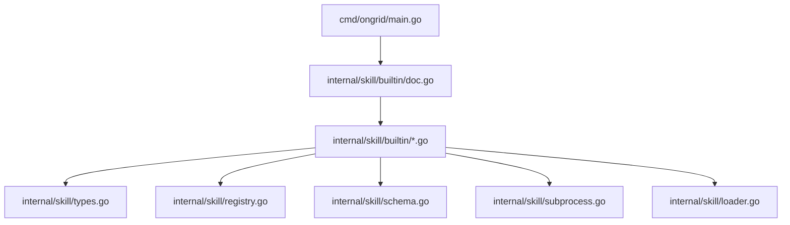
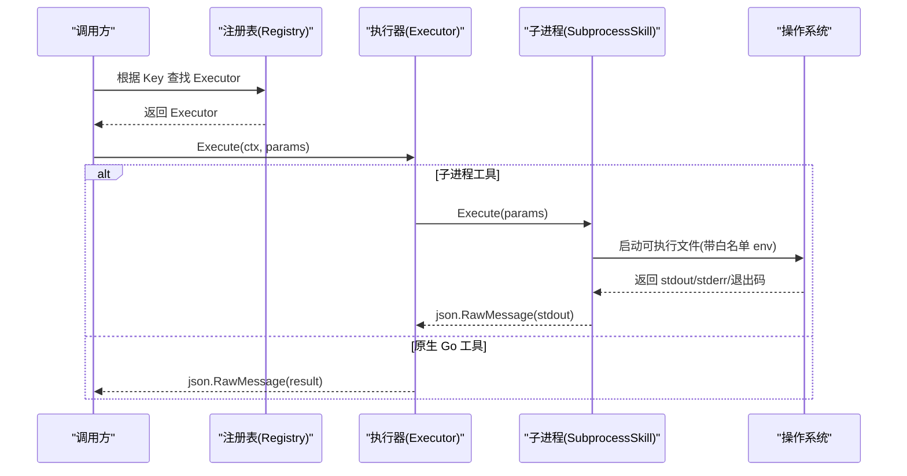
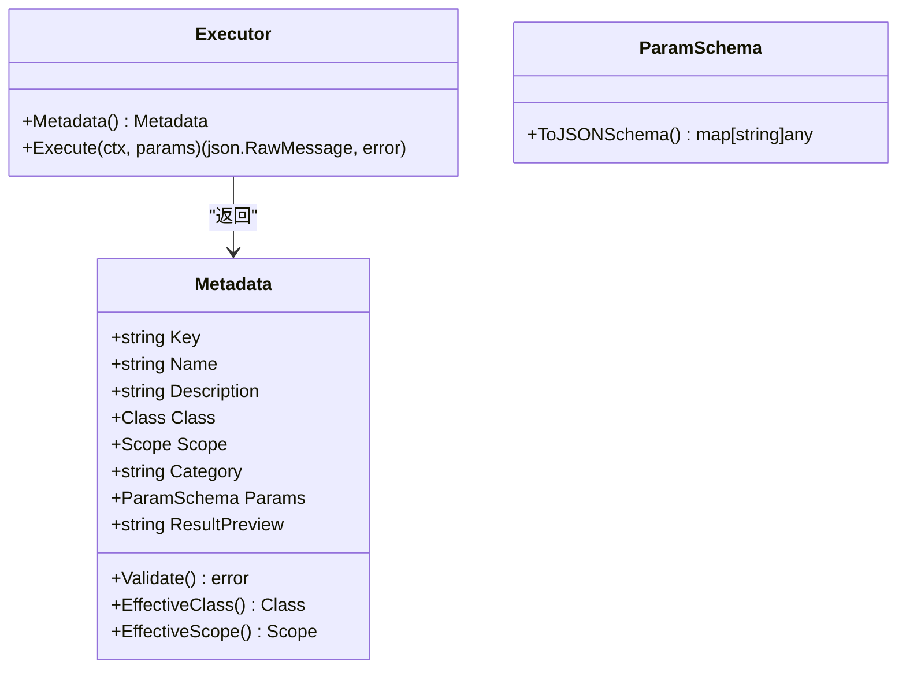
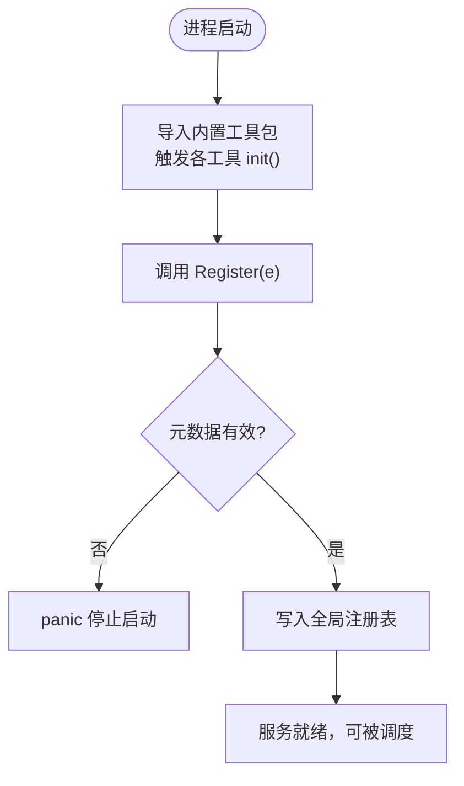
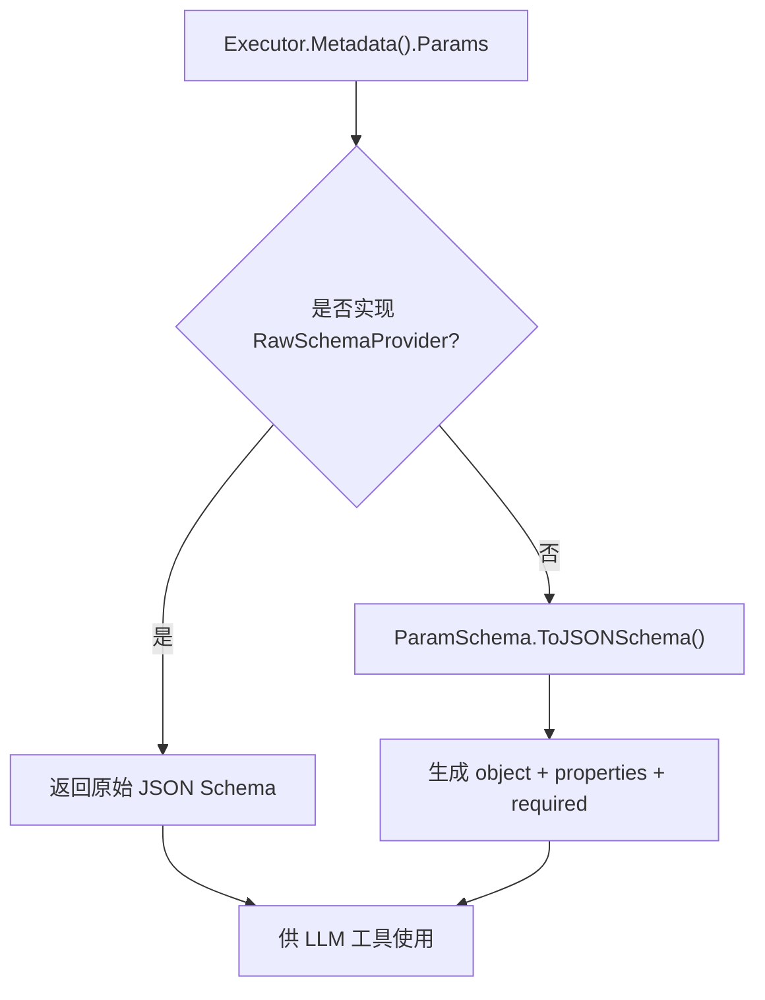
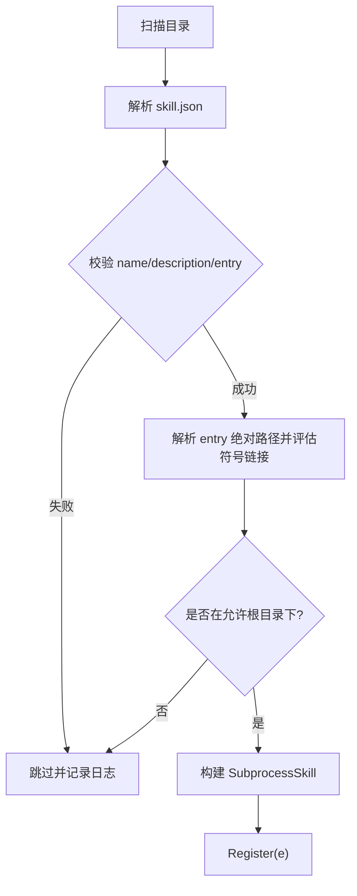
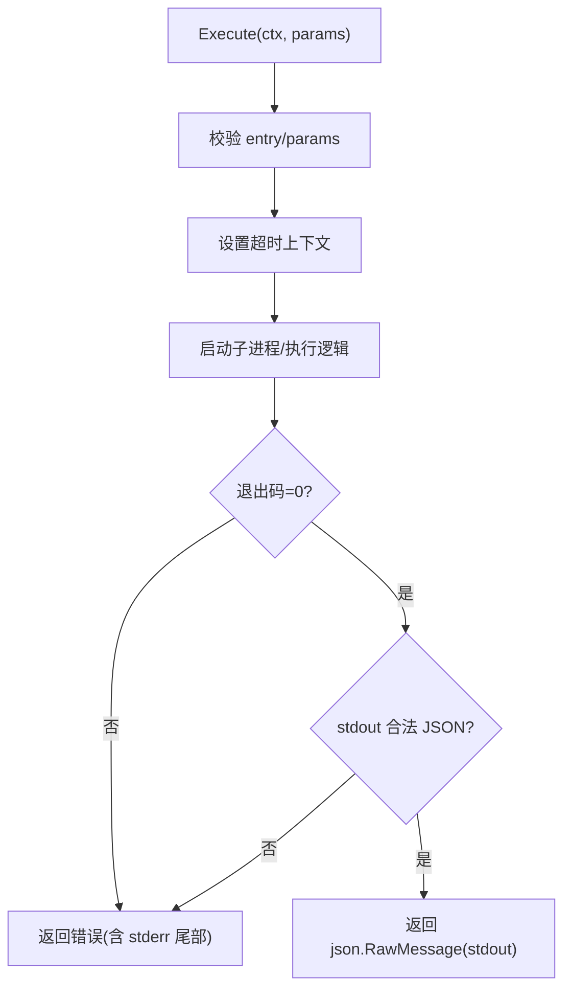
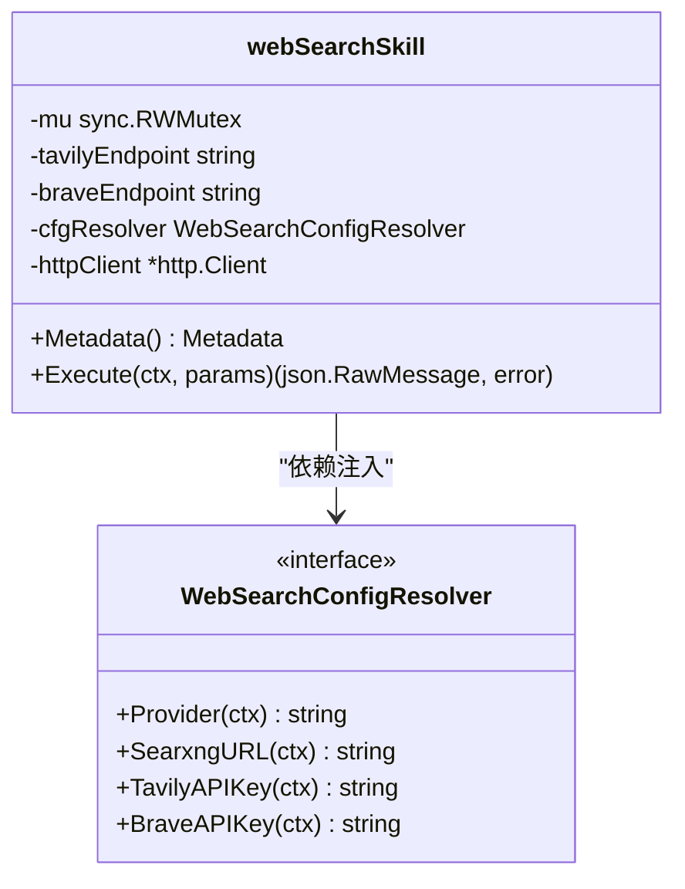
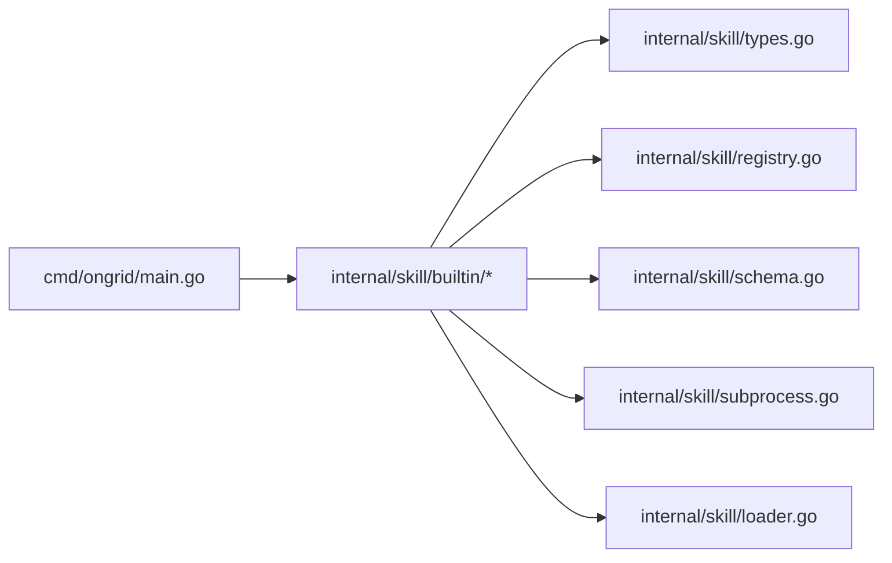
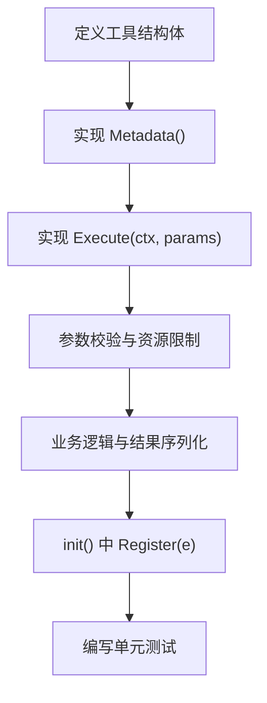

# 自定义工具开发

<cite>
**本文引用的文件**
- [internal/skill/types.go](file://internal/skill/types.go)
- [internal/skill/registry.go](file://internal/skill/registry.go)
- [internal/skill/loader.go](file://internal/skill/loader.go)
- [internal/skill/schema.go](file://internal/skill/schema.go)
- [internal/skill/subprocess.go](file://internal/skill/subprocess.go)
- [internal/skill/builtin/doc.go](file://internal/skill/builtin/doc.go)
- [internal/skill/builtin/probe_ping.go](file://internal/skill/builtin/probe_ping.go)
- [internal/skill/builtin/tail_file.go](file://internal/skill/builtin/tail_file.go)
- [internal/skill/builtin/web_search.go](file://internal/skill/builtin/web_search.go)
- [cmd/ongrid/main.go](file://cmd/ongrid/main.go)
- [internal/skill/builtin/probe_ping_test.go](file://internal/skill/builtin/probe_ping_test.go)
- [internal/skill/subprocess_test.go](file://internal/skill/subprocess_test.go)
</cite>

## 目录
1. [简介](#简介)
2. [项目结构](#项目结构)
3. [核心组件](#核心组件)
4. [架构总览](#架构总览)
5. [详细组件分析](#详细组件分析)
6. [依赖关系分析](#依赖关系分析)
7. [性能考虑](#性能考虑)
8. [故障排查指南](#故障排查指南)
9. [结论](#结论)
10. [附录：从零实现一个简单工具](#附录从零实现一个简单工具)

## 简介
本指南面向希望在 ongrid 平台中开发“自定义工具（Skill）”的开发者。基于仓库中的 Skill 框架，你将学会：
- 实现工具接口、定义参数与结果格式
- 进行参数校验与错误处理
- 通过注册机制将工具暴露给 LLM 工具、HTTP API 和 UI
- 使用子进程方式运行外部脚本或二进制
- 编写测试与调试技巧
- 部署与版本管理建议

该框架的核心思想是：每个工具是一个自包含的“能力单元”，由元数据描述（名称、描述、权限等级、作用域、参数 schema），以及一个执行器（Executor）。框架会基于元数据自动生成 LLM 工具定义、HTTP 路由、UI 表单、权限门控与审计日志。新增工具只需写一个文件并在 init() 中注册一次。

## 项目结构
与工具开发直接相关的代码集中在 internal/skill 及其子包 builtin 中；主程序在 cmd/ongrid/main.go 中引入内置工具包以完成全局注册。

**图表来源**
- [cmd/ongrid/main.go:198-203](file://cmd/ongrid/main.go#L198-L203)
- [internal/skill/builtin/doc.go:1-26](file://internal/skill/builtin/doc.go#L1-L26)
- [internal/skill/types.go:1-241](file://internal/skill/types.go#L1-L241)
- [internal/skill/registry.go:1-127](file://internal/skill/registry.go#L1-L127)
- [internal/skill/schema.go:1-96](file://internal/skill/schema.go#L1-L96)
- [internal/skill/subprocess.go:1-268](file://internal/skill/subprocess.go#L1-L268)
- [internal/skill/loader.go:1-274](file://internal/skill/loader.go#L1-L274)

**章节来源**
- [cmd/ongrid/main.go:198-203](file://cmd/ongrid/main.go#L198-L203)
- [internal/skill/builtin/doc.go:1-26](file://internal/skill/builtin/doc.go#L1-L26)

## 核心组件
- 工具元数据与类型：定义工具的名称、描述、权限等级、作用域、参数 schema、结果预览等，并提供校验逻辑。
- 注册表：进程级工具目录，支持并发安全地注册、查询、列举工具。
- Schema 生成：将声明式参数转换为 LLM 工具所需的 JSON Schema。
- 子进程工具：通过 manifest 描述的外部可执行程序，按 stdin/stdout 协议交换 JSON。
- 加载器：扫描指定目录下的 skill.json，构建并注册子进程工具，同时做路径白名单与环境变量白名单限制。

**章节来源**
- [internal/skill/types.go:35-175](file://internal/skill/types.go#L35-L175)
- [internal/skill/registry.go:10-127](file://internal/skill/registry.go#L10-L127)
- [internal/skill/schema.go:5-96](file://internal/skill/schema.go#L5-L96)
- [internal/skill/subprocess.go:17-78](file://internal/skill/subprocess.go#L17-L78)
- [internal/skill/loader.go:13-74](file://internal/skill/loader.go#L13-L74)

## 架构总览
下图展示了从调用方到工具执行的完整链路：管理器侧通过注册表获取 Executor，构造参数 schema，调用 Execute；对于子进程工具，框架负责启动进程、传递参数、限制输出大小与超时，并将 stdout 作为结果返回。

**图表来源**
- [internal/skill/registry.go:31-82](file://internal/skill/registry.go#L31-L82)
- [internal/skill/subprocess.go:99-172](file://internal/skill/subprocess.go#L99-L172)

## 详细组件分析

### 工具接口与元数据
- 工具必须实现 Executor 接口，提供 Metadata() 与 Execute(ctx, params)。
- Metadata 包含 Key、Name、Description、Class、Scope、Category、Params、ResultPreview。
- 参数类型支持 string/int/float/bool/duration/enum/array，数组需指定 ItemType。
- Validate() 会在注册时检查元数据一致性，避免运行时错误。

**图表来源**
- [internal/skill/types.go:99-175](file://internal/skill/types.go#L99-L175)
- [internal/skill/types.go:177-203](file://internal/skill/types.go#L177-L203)
- [internal/skill/schema.go:22-96](file://internal/skill/schema.go#L22-L96)

**章节来源**
- [internal/skill/types.go:35-175](file://internal/skill/types.go#L35-L175)
- [internal/skill/schema.go:22-96](file://internal/skill/schema.go#L22-L96)

### 注册机制与生命周期
- 所有工具在 init() 中调用 Register(e)，将 Executor 加入全局注册表。
- 注册时会验证元数据，重复 Key 会 panic（作者级错误应在启动期暴露）。
- 管理器侧通过 All()/AllByClass() 枚举工具，用于 LLM 工具注册、HTTP /skills 列表、UI 下拉框。
- 主程序通过空白导入内置包触发其 init()，从而完成工具注册。

**图表来源**
- [internal/skill/registry.go:26-73](file://internal/skill/registry.go#L26-L73)
- [internal/skill/builtin/doc.go:19-26](file://internal/skill/builtin/doc.go#L19-L26)
- [cmd/ongrid/main.go:198-203](file://cmd/ongrid/main.go#L198-L203)

**章节来源**
- [internal/skill/registry.go:10-127](file://internal/skill/registry.go#L10-L127)
- [internal/skill/builtin/doc.go:1-26](file://internal/skill/builtin/doc.go#L1-L26)
- [cmd/ongrid/main.go:198-203](file://cmd/ongrid/main.go#L198-L203)

### 参数验证与 Schema 生成
- 声明式 ParamSchema 会被转换为 OpenAI function-calling 兼容的 JSON Schema。
- 若工具实现 RawSchemaProvider，则优先使用其提供的原始 JSON Schema。
- 转换规则包括类型映射、必填项、默认值、枚举与数组元素类型。

**图表来源**
- [internal/skill/schema.go:5-20](file://internal/skill/schema.go#L5-L20)
- [internal/skill/schema.go:22-96](file://internal/skill/schema.go#L22-L96)
- [internal/skill/types.go:177-188](file://internal/skill/types.go#L177-L188)

**章节来源**
- [internal/skill/schema.go:5-96](file://internal/skill/schema.go#L5-L96)
- [internal/skill/types.go:177-188](file://internal/skill/types.go#L177-L188)

### 子进程工具与安全边界
- 子进程工具通过 skill.json 清单描述：name、description、schema、entry、env_allow、timeout_seconds、class、category。
- Loader 会递归扫描配置目录，解析清单，构建 SubprocessSkill 并注册。
- 安全策略：
  - entry 必须为绝对路径，且必须位于允许的根目录下（防逃逸）。
  - 环境变量仅允许白名单传入，默认不继承父进程环境。
  - 输出限制：stdout 最大 16MiB，stderr 保留尾部 4KiB 用于诊断。
  - 超时控制：未设置时使用默认 30s。

**图表来源**
- [internal/skill/loader.go:69-161](file://internal/skill/loader.go#L69-L161)
- [internal/skill/loader.go:176-254](file://internal/skill/loader.go#L176-L254)
- [internal/skill/subprocess.go:17-78](file://internal/skill/subprocess.go#L17-L78)

**章节来源**
- [internal/skill/loader.go:13-274](file://internal/skill/loader.go#L13-L274)
- [internal/skill/subprocess.go:17-78](file://internal/skill/subprocess.go#L17-L78)

### 执行流程与错误处理
- Execute 接收已按 schema 校验过的 params，但仍需防御性反序列化与业务校验。
- 子进程工具：
  - 空 params 转为 "{}"，确保 stdin 始终为合法 JSON。
  - 非零退出码视为错误，附带 stderr 尾部信息。
  - 超时返回 context.DeadlineExceeded 包装错误。
  - stdout 必须为合法 JSON，否则报错。
- 原生 Go 工具：
  - 返回结构化结果（如 ping 探测、文件尾读取），统一序列化为 JSON。

**图表来源**
- [internal/skill/subprocess.go:99-172](file://internal/skill/subprocess.go#L99-L172)

**章节来源**
- [internal/skill/subprocess.go:99-172](file://internal/skill/subprocess.go#L99-L172)

### 依赖注入与配置解析
- 工具可通过接口抽象外部依赖，例如 WebSearch 通过 WebSearchConfigResolver 获取 provider、URL、API Key。
- 管理器在启动时将具体实现注入到工具单例，便于测试替换与运行时配置生效。
- HTTP 客户端也可注入，便于单元测试使用 httptest。

**图表来源**
- [internal/skill/builtin/web_search.go:48-87](file://internal/skill/builtin/web_search.go#L48-L87)
- [internal/skill/builtin/web_search.go:150-159](file://internal/skill/builtin/web_search.go#L150-L159)
- [internal/skill/builtin/web_search.go:161-195](file://internal/skill/builtin/web_search.go#L161-L195)

**章节来源**
- [internal/skill/builtin/web_search.go:48-195](file://internal/skill/builtin/web_search.go#L48-L195)

### 内置工具示例
- Ping 探测：安全类，调用系统 ping，限制次数与超时，返回结构化结果。
- 文件尾读取：安全类，强制绝对路径、禁止 ..，限制读取字节数，返回最后 N 行。
- 联网搜索：安全类，支持多 provider（SearXNG/Tavily/Brave），通过配置解析器动态选择后端。

**章节来源**
- [internal/skill/builtin/probe_ping.go:14-125](file://internal/skill/builtin/probe_ping.go#L14-L125)
- [internal/skill/builtin/tail_file.go:15-133](file://internal/skill/builtin/tail_file.go#L15-L133)
- [internal/skill/builtin/web_search.go:19-593](file://internal/skill/builtin/web_search.go#L19-L593)

## 依赖关系分析
- 主程序通过空白导入内置包，触发各工具的 init() 完成注册。
- 工具之间无强耦合，均通过注册表解耦。
- 子进程工具与宿主进程隔离，通过标准输入输出通信，降低风险面。
- 配置与外部依赖通过接口注入，提升可测试性与灵活性。

**图表来源**
- [cmd/ongrid/main.go:198-203](file://cmd/ongrid/main.go#L198-L203)
- [internal/skill/builtin/doc.go:19-26](file://internal/skill/builtin/doc.go#L19-L26)

**章节来源**
- [cmd/ongrid/main.go:198-203](file://cmd/ongrid/main.go#L198-L203)
- [internal/skill/builtin/doc.go:19-26](file://internal/skill/builtin/doc.go#L19-L26)

## 性能考虑
- 子进程工具：
  - 输出上限：stdout 限制 16MiB，stderr 仅保留尾部 4KiB，防止内存爆炸。
  - 超时控制：默认 30s，避免长时间阻塞。
  - 环境变量白名单：最小化泄露面，减少不必要的环境开销。
- 原生工具：
  - 合理设置超时与资源限制（如网络请求、命令执行）。
  - 对大对象进行分页或截断，避免一次性传输过多数据。
- 注册表：
  - 读多写少场景，使用读写锁保护，保证高并发下枚举与查找的性能。

[本节为通用指导，无需特定文件引用]

## 故障排查指南
- 启动期错误：
  - 元数据无效或重复 Key 会导致 panic，应检查工具注册时的 Metadata.Validate()。
- 运行时错误：
  - 子进程工具非零退出码会返回错误，并附带 stderr 尾部信息，便于定位问题。
  - 超时错误会包装 context.DeadlineExceeded，检查超时设置与任务耗时。
  - 子进程 stdout 非 JSON 会报错，确保子进程输出符合约定。
- 权限与路径：
  - 子进程 entry 必须在允许根目录下，否则会拒绝执行。
  - 环境变量仅允许白名单传入，确认必要变量已配置。

**章节来源**
- [internal/skill/registry.go:59-73](file://internal/skill/registry.go#L59-L73)
- [internal/skill/subprocess.go:112-172](file://internal/skill/subprocess.go#L112-L172)
- [internal/skill/loader.go:176-254](file://internal/skill/loader.go#L176-L254)

## 结论
ongrid 的 Skill 框架提供了统一的工具开发与集成方式，通过声明式元数据与执行器接口，自动派生 LLM 工具、HTTP API、UI 表单与权限控制。结合子进程工具的安全边界与依赖注入机制，开发者可以高效、安全地扩展平台能力。遵循本文档的最佳实践，可显著提升工具的可维护性、可测试性与安全性。

[本节为总结，无需特定文件引用]

## 附录：从零实现一个简单工具
以下以“文件尾读取”为例，展示如何从零开始实现一个安全、可注册的工具。

步骤概览：
- 定义工具结构体与 Metadata，声明参数与结果预览。
- 实现 Execute：参数校验、资源限制、业务逻辑、结果序列化。
- 在 init() 中调用 Register 完成注册。
- 编写单元测试覆盖参数校验、边界条件与错误路径。

**图表来源**
- [internal/skill/builtin/tail_file.go:15-133](file://internal/skill/builtin/tail_file.go#L15-L133)
- [internal/skill/builtin/probe_ping_test.go:11-50](file://internal/skill/builtin/probe_ping_test.go#L11-L50)
- [internal/skill/subprocess_test.go:29-201](file://internal/skill/subprocess_test.go#L29-L201)

**章节来源**
- [internal/skill/builtin/tail_file.go:15-133](file://internal/skill/builtin/tail_file.go#L15-L133)
- [internal/skill/builtin/probe_ping_test.go:11-50](file://internal/skill/builtin/probe_ping_test.go#L11-L50)
- [internal/skill/subprocess_test.go:29-201](file://internal/skill/subprocess_test.go#L29-L201)