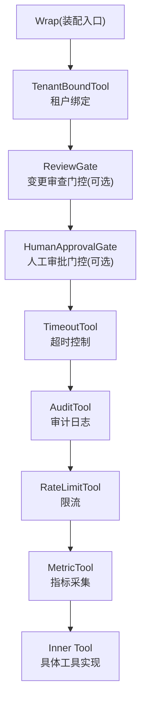
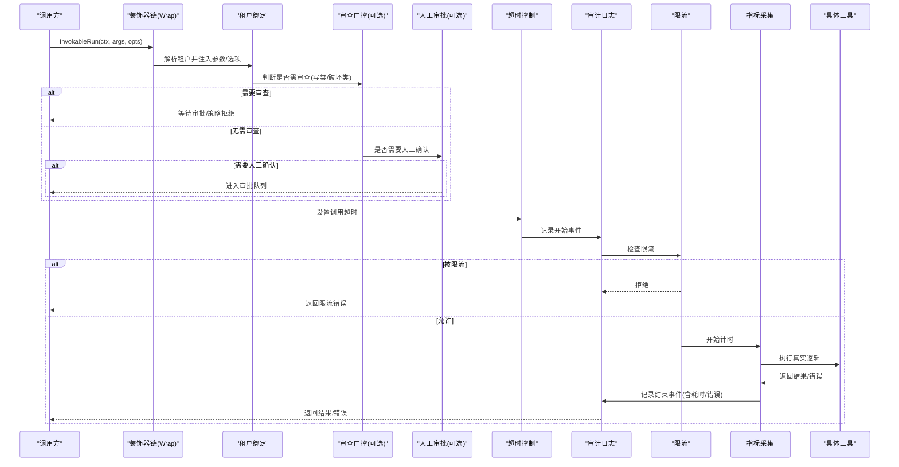
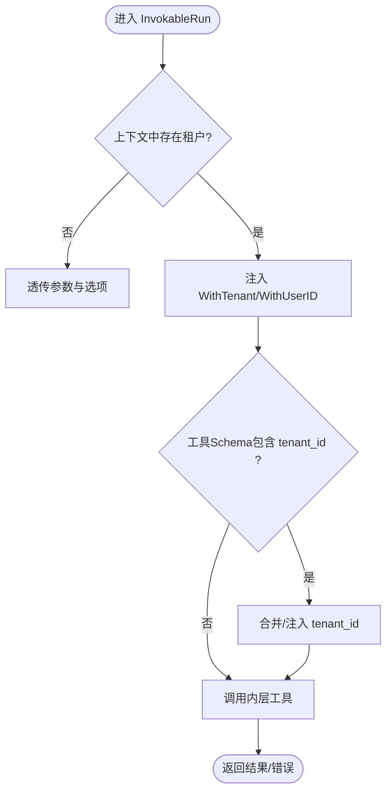
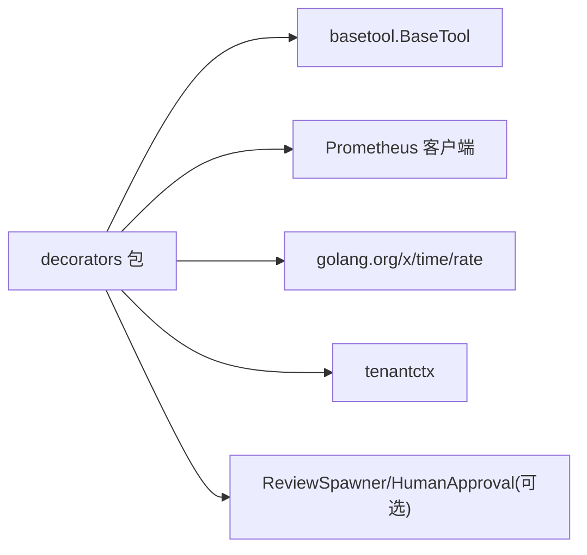

# 装饰器模式应用

<cite>
**本文引用的文件**
- [chain.go](file://internal/manager/biz/aiops/tools/decorators/chain.go)
- [tenant_bind.go](file://internal/manager/biz/aiops/tools/decorators/tenant_bind.go)
- [timeout.go](file://internal/manager/biz/aiops/tools/decorators/timeout.go)
- [audit.go](file://internal/manager/biz/aiops/tools/decorators/audit.go)
- [ratelimit.go](file://internal/manager/biz/aiops/tools/decorators/ratelimit.go)
- [metric.go](file://internal/manager/biz/aiops/tools/decorators/metric.go)
- [human_approval_gate.go](file://internal/manager/biz/aiops/tools/decorators/human_approval_gate.go)
- [review_gate.go](file://internal/manager/biz/aiops/tools/decorators/review_gate.go)
- [decorators_test.go](file://internal/manager/biz/aiops/tools/decorators/decorators_test.go)
- [basetool_decorated_test.go](file://internal/manager/biz/aiops/tools/basetool_decorated_test.go)
</cite>

## 目录
1. [简介](#简介)
2. [项目结构](#项目结构)
3. [核心组件](#核心组件)
4. [架构总览](#架构总览)
5. [详细组件分析](#详细组件分析)
6. [依赖关系分析](#依赖关系分析)
7. [性能考量](#性能考量)
8. [故障排查指南](#故障排查指南)
9. [结论](#结论)
10. [附录](#附录)

## 简介
本文件系统性梳理工具系统中基于装饰器模式的横切能力实现，包括租户绑定、超时控制、审计日志、限流与指标收集等内置装饰器。文档解释装饰器链的设计动机与执行顺序，提供自定义装饰器的接口约定与实现方式，并通过实际组合示例展示如何将多个装饰器应用到工具上。最后给出性能影响分析与调试技巧，帮助读者在生产环境中正确配置与排障。

## 项目结构
装饰器相关代码集中在 aiops 工具的 decorators 包中，围绕统一的 BaseTool 接口进行包装，形成可复用的标准调用链。核心文件职责如下：
- chain.go：定义 Deps 配置与 Wrap 组装顺序，是装饰器链的“装配中心”。
- tenant_bind.go：从上下文注入租户信息，按需改写参数中的 tenant_id。
- timeout.go：为每次调用施加超时边界，统一错误语义。
- audit.go：记录工具调用的开始与结束事件，支持可插拔的审计落盘。
- ratelimit.go：按（工具名, 用户ID）维度进行令牌桶限流。
- metric.go：通过 Prometheus 计数器与直方图采集调用量与耗时。
- human_approval_gate.go / review_gate.go：可选的人类审批与变更审查门控。

图表来源
- [chain.go:56-131](file://internal/manager/biz/aiops/tools/decorators/chain.go#L56-L131)

章节来源
- [chain.go:11-54](file://internal/manager/biz/aiops/tools/decorators/chain.go#L11-L54)
- [chain.go:56-131](file://internal/manager/biz/aiops/tools/decorators/chain.go#L56-L131)

## 核心组件
- 统一接口：所有装饰器均实现 BaseTool 的 Info 与 InvokableRun 方法，保证链式透明。
- 装配器：Wrap(inner, deps) 将内层工具与横切能力组合为标准链。
- 依赖注入：Deps 提供超时、审计、限流、注册器等外部依赖，零值安全。
- 扩展点：AuditSink、Limiter、Registerer、ReviewSpawner、HumanApprovalProposer 等接口便于替换或禁用。

章节来源
- [chain.go:11-54](file://internal/manager/biz/aiops/tools/decorators/chain.go#L11-L54)
- [chain.go:56-131](file://internal/manager/biz/aiops/tools/decorators/chain.go#L56-L131)

## 架构总览
装饰器链的标准顺序由 Wrap 固定，确保横切关注点以一致且可预测的方式生效：
- 外层：租户绑定（tenant_bind），从上下文解析租户并注入参数与选项。
- 审查门控：review_gate（可选），对写类/破坏类工具进行策略或人工审查。
- 人工审批：human_approval_gate（可选），对需要确认的工具进入审批队列。
- 超时控制：timeout，限制单次调用最大耗时。
- 审计日志：audit，记录调用开始与结束，失败不阻断主流程。
- 限流：ratelimit，按（工具名, 用户ID）节流，拒绝时返回明确错误。
- 指标：metric，统计调用次数与耗时，标签不含敏感维度。

图表来源
- [chain.go:56-131](file://internal/manager/biz/aiops/tools/decorators/chain.go#L56-L131)
- [tenant_bind.go:50-84](file://internal/manager/biz/aiops/tools/decorators/tenant_bind.go#L50-L84)
- [timeout.go:55-78](file://internal/manager/biz/aiops/tools/decorators/timeout.go#L55-L78)
- [audit.go:84-121](file://internal/manager/biz/aiops/tools/decorators/audit.go#L84-L121)
- [ratelimit.go:121-135](file://internal/manager/biz/aiops/tools/decorators/ratelimit.go#L121-L135)
- [metric.go:103-122](file://internal/manager/biz/aiops/tools/decorators/metric.go#L103-L122)

## 详细组件分析

### 租户绑定装饰器（TenantBoundTool）
- 作用：从上下文读取租户信息，若工具声明了 tenant_id 参数且未显式传入，则自动注入；同时将用户ID与租户串写入 InvokeOption，供下游装饰器使用。
- 行为：若无租户上下文或工具未声明 tenant_id，则透传参数与选项，保持无副作用。
- 关键点：仅做参数重写与选项增强，不影响工具元数据。

图表来源
- [tenant_bind.go:50-84](file://internal/manager/biz/aiops/tools/decorators/tenant_bind.go#L50-L84)
- [tenant_bind.go:87-128](file://internal/manager/biz/aiops/tools/decorators/tenant_bind.go#L87-L128)

章节来源
- [tenant_bind.go:13-43](file://internal/manager/biz/aiops/tools/decorators/tenant_bind.go#L13-L43)
- [tenant_bind.go:50-84](file://internal/manager/biz/aiops/tools/decorators/tenant_bind.go#L50-L84)
- [tenant_bind.go:87-128](file://internal/manager/biz/aiops/tools/decorators/tenant_bind.go#L87-L128)

### 超时控制装饰器（TimeoutTool）
- 作用：为每次调用施加 context.WithTimeout，统一超时错误语义。
- 行为：当调用因自身超时而失败时，包装为明确的 ErrToolTimeout，便于上层分类处理。
- 注意：即使内部工具忽略上下文，也会在返回后再次校验截止时间，防止逃逸。

章节来源
- [timeout.go:22-31](file://internal/manager/biz/aiops/tools/decorators/timeout.go#L22-L31)
- [timeout.go:40-78](file://internal/manager/biz/aiops/tools/decorators/timeout.go#L40-L78)

### 审计日志装饰器（AuditTool）
- 作用：在调用前后分别触发 OnToolStart/OnToolEnd，记录工具名、参数、租户/用户、设备、起止时间与耗时、错误。
- 行为：OnToolStart 返回的 id 用于关联结束事件；OnToolEnd 的错误不会覆盖工具结果，遵循“审计不可失败”的原则。
- 关键：审计发生在限流之前，因此被限流的请求也会产生审计记录。

章节来源
- [audit.go:10-35](file://internal/manager/biz/aiops/tools/decorators/audit.go#L10-L35)
- [audit.go:59-76](file://internal/manager/biz/aiops/tools/decorators/audit.go#L59-L76)
- [audit.go:84-121](file://internal/manager/biz/aiops/tools/decorators/audit.go#L84-L121)

### 限流装饰器（RateLimitTool）
- 作用：按（工具名, 用户ID）维度进行令牌桶限流，默认每分钟若干次，突发等于速率。
- 行为：拒绝时返回 ErrRateLimited，便于上层识别与分类。
- 并发：每个键维护一个 rate.Limiter，互斥保护，线程安全。

章节来源
- [ratelimit.go:14-40](file://internal/manager/biz/aiops/tools/decorators/ratelimit.go#L14-L40)
- [ratelimit.go:49-96](file://internal/manager/biz/aiops/tools/decorators/ratelimit.go#L49-L96)
- [ratelimit.go:98-135](file://internal/manager/biz/aiops/tools/decorators/ratelimit.go#L98-L135)

### 指标采集装饰器（MetricTool）
- 作用：统计 ongrid_tool_invocations_total（name, result）与 ongrid_tool_duration_seconds（name）。
- 行为：仅在度量层面观察，不改变业务逻辑；标签不包含用户/租户/设备，避免高基数。
- 注册：懒创建并按 Registerer 去重，避免重复注册 panic。

章节来源
- [metric.go:14-62](file://internal/manager/biz/aiops/tools/decorators/metric.go#L14-L62)
- [metric.go:79-122](file://internal/manager/biz/aiops/tools/decorators/metric.go#L79-L122)

### 人类审批与变更审查门控（可选）
- HumanApprovalGate：对需要确认的工具进入持久化审批队列，未配置时不安装该层。
- ReviewGate：对写类/破坏类工具进行策略或人工审查，未配置 ReviewSpawner 时不安装该层。
- 位置：位于超时之前，避免审查过程被短超时打断；同时位于审计之外，避免拒绝产生虚假执行记录。

章节来源
- [chain.go:32-47](file://internal/manager/biz/aiops/tools/decorators/chain.go#L32-L47)
- [chain.go:119-128](file://internal/manager/biz/aiops/tools/decorators/chain.go#L119-L128)

### 装饰器链装配（Wrap）
- 装配顺序（由外到内）：tenant_bind → review_gate → human_approval → timeout → audit → ratelimit → metric。
- 设计理由：
  - tenant_bind 最外层，确保后续层看到正确的租户/用户上下文与参数。
  - review_gate 在超时之外，避免审查过程被短超时约束。
  - audit 在限流之外，确保被限流的拒绝也能被审计。
  - ratelimit 在指标之外，避免拒绝开销污染耗时直方图。
  - metric 最内层，只观测真实工具耗时。

章节来源
- [chain.go:56-105](file://internal/manager/biz/aiops/tools/decorators/chain.go#L56-L105)
- [chain.go:106-131](file://internal/manager/biz/aiops/tools/decorators/chain.go#L106-L131)

## 依赖关系分析
- 对外依赖：
  - Prometheus 客户端：指标采集与注册。
  - golang.org/x/time/rate：令牌桶限流。
  - 租户上下文：tenantctx，用于解析租户身份。
- 内部依赖：
  - basetool.BaseTool：统一工具接口，所有装饰器与其解耦。
  - 可选门控：ReviewSpawner、HumanApprovalProposer、MutatingProposalSink 等。

图表来源
- [chain.go:1-9](file://internal/manager/biz/aiops/tools/decorators/chain.go#L1-L9)
- [metric.go:1-12](file://internal/manager/biz/aiops/tools/decorators/metric.go#L1-L12)
- [ratelimit.go:1-12](file://internal/manager/biz/aiops/tools/decorators/ratelimit.go#L1-L12)
- [tenant_bind.go:1-11](file://internal/manager/biz/aiops/tools/decorators/tenant_bind.go#L1-L11)

章节来源
- [chain.go:1-9](file://internal/manager/biz/aiops/tools/decorators/chain.go#L1-L9)
- [metric.go:1-12](file://internal/manager/biz/aiops/tools/decorators/metric.go#L1-L12)
- [ratelimit.go:1-12](file://internal/manager/biz/aiops/tools/decorators/ratelimit.go#L1-L12)
- [tenant_bind.go:1-11](file://internal/manager/biz/aiops/tools/decorators/tenant_bind.go#L1-L11)

## 性能考量
- 装饰器开销：
  - 租户绑定：JSON 解析与合并仅在必要时发生，成本较低。
  - 超时：context.WithTimeout 开销极小。
  - 审计：I/O 异步或缓冲建议，避免阻塞主路径。
  - 限流：每（工具, 用户）一个令牌桶，内存占用随活跃键增长；默认速率较小，适合高频场景。
  - 指标：Prometheus 计数器与直方图高效，但应避免高基数标签。
- 建议：
  - 合理设置超时与限流阈值，结合业务峰值与SLO。
  - 审计落盘采用异步批处理，降低延迟抖动。
  - 指标标签严格限定为 name/result，避免泄露用户/租户维度。

[本节为通用指导，不直接分析具体文件]

## 故障排查指南
- 常见问题定位：
  - 超时：检查 Wrap 传入的超时时间，以及工具是否尊重上下文取消。
  - 限流：确认用户ID是否正确注入，查看被限流时的错误类型是否为 ErrRateLimited。
  - 审计缺失：确认 AuditSink 已注入且 OnToolStart 成功返回 id；注意 OnToolEnd 错误不应影响主流程。
  - 指标异常：检查 Registerer 是否正确传递，避免重复注册导致 panic。
- 测试验证要点：
  - 链顺序验证：超时仍应产生审计记录；限流拒绝也应产生审计记录。
  - 租户注入：对未声明 tenant_id 的工具，不应修改参数。
  - 空依赖安全：Deps 为零值时应退化为最小可用链。

章节来源
- [decorators_test.go:413-519](file://internal/manager/biz/aiops/tools/decorators/decorators_test.go#L413-L519)
- [basetool_decorated_test.go:39-88](file://internal/manager/biz/aiops/tools/basetool_decorated_test.go#L39-L88)
- [basetool_decorated_test.go:131-173](file://internal/manager/biz/aiops/tools/basetool_decorated_test.go#L131-L173)
- [basetool_decorated_test.go:175-195](file://internal/manager/biz/aiops/tools/basetool_decorated_test.go#L175-L195)

## 结论
装饰器模式在本项目中提供了高度可组合、可配置的横切能力，通过固定的 Wrap 顺序确保租户、审查、审批、超时、审计、限流与指标的一致性与可预期性。各装饰器职责单一、依赖清晰，既满足生产环境的稳定性要求，又为扩展与定制提供了良好接口。配合完善的测试与可观测性，可在复杂调用链路中快速定位问题并优化性能。

[本节为总结性内容，不直接分析具体文件]

## 附录

### 如何创建自定义装饰器
- 接口约定：实现 BaseTool 的 Info 与 InvokableRun，Info 透传元数据，InvokableRun 负责横切逻辑。
- 依赖注入：通过函数参数或结构体字段注入外部依赖（如审计 sink、限流器、注册器）。
- 错误处理：区分业务错误与横切错误（如超时、限流），便于上层分类。
- 线程安全：装饰器本身应为无状态或并发安全；共享状态需加锁或使用并发安全数据结构。
- 组合方式：在 Wrap 中按需求插入新层，或在构建工具时手动包裹。

章节来源
- [chain.go:56-131](file://internal/manager/biz/aiops/tools/decorators/chain.go#L56-L131)
- [audit.go:59-76](file://internal/manager/biz/aiops/tools/decorators/audit.go#L59-L76)
- [ratelimit.go:98-114](file://internal/manager/biz/aiops/tools/decorators/ratelimit.go#L98-L114)
- [metric.go:79-96](file://internal/manager/biz/aiops/tools/decorators/metric.go#L79-L96)

### 装饰器组合的实际示例
- 基本组合：使用 Wrap 将工具与超时、审计、限流、指标组合，适用于大多数场景。
- 带审查的组合：为写类/破坏类工具启用 ReviewSpawner，使变更先经策略或人工审查。
- 带人工审批的组合：对高风险操作启用 HumanApprovalProposer，进入审批队列后再执行。
- 最小可用链：Deps 为空时，链退化为仅包含必要横切能力的最小集，便于测试与开发。

章节来源
- [chain.go:106-131](file://internal/manager/biz/aiops/tools/decorators/chain.go#L106-L131)
- [decorators_test.go:413-519](file://internal/manager/biz/aiops/tools/decorators/decorators_test.go#L413-L519)
- [basetool_decorated_test.go:39-88](file://internal/manager/biz/aiops/tools/basetool_decorated_test.go#L39-L88)