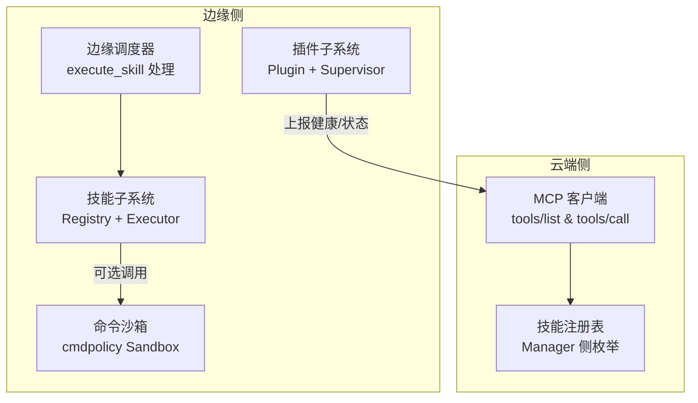
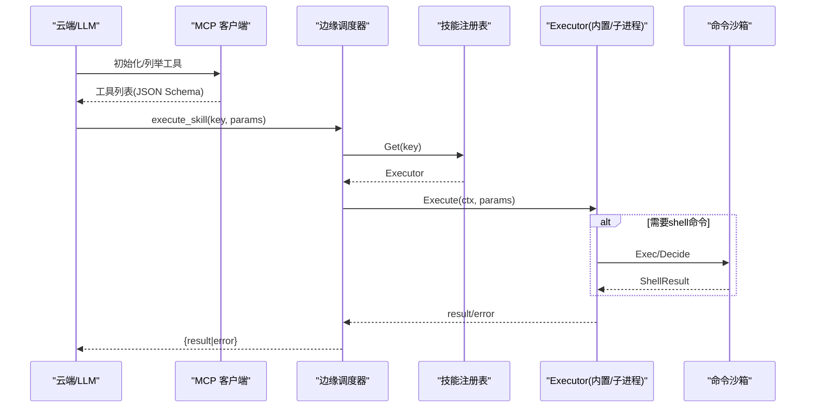
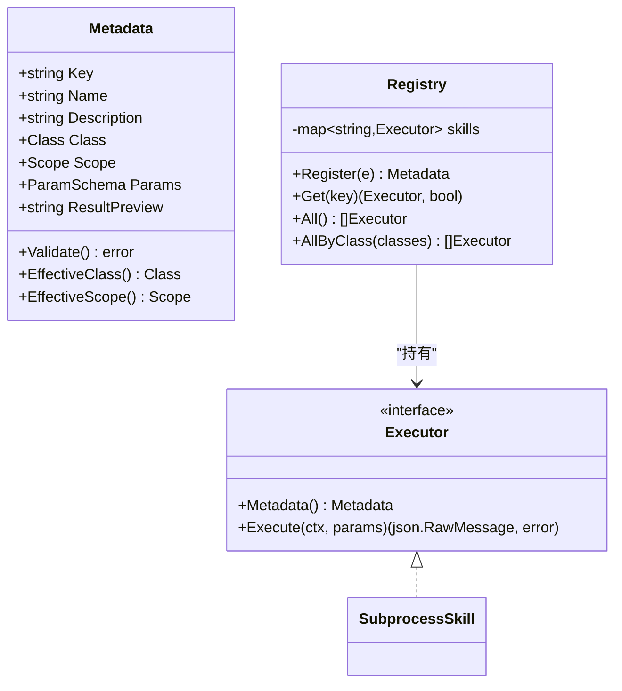
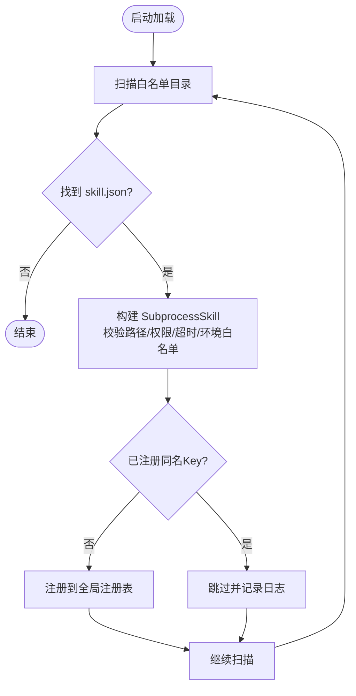
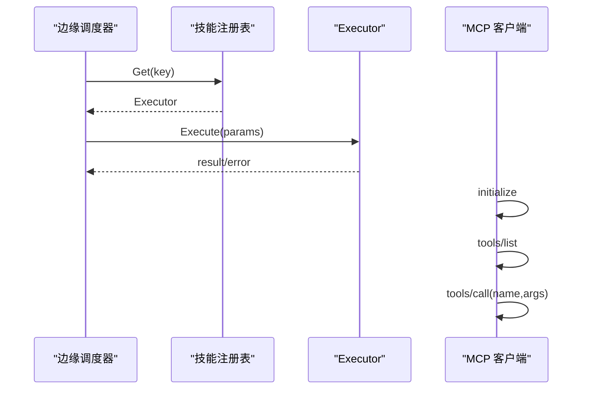
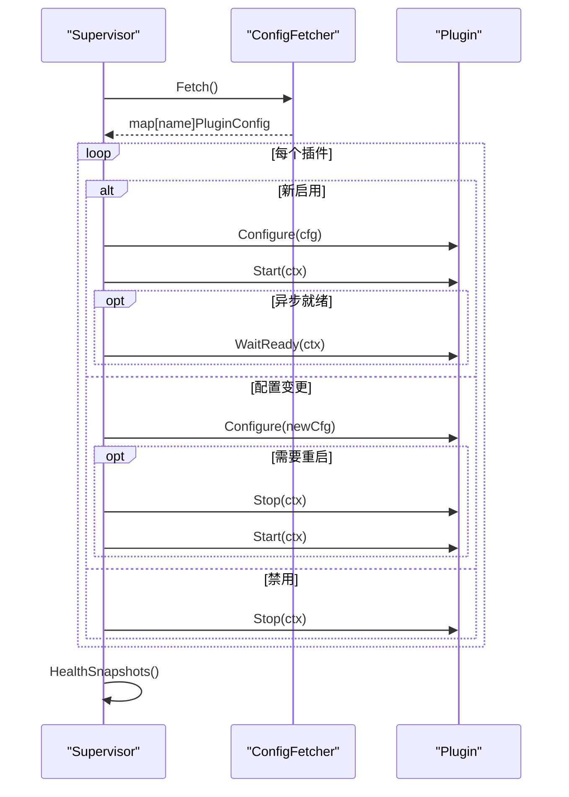
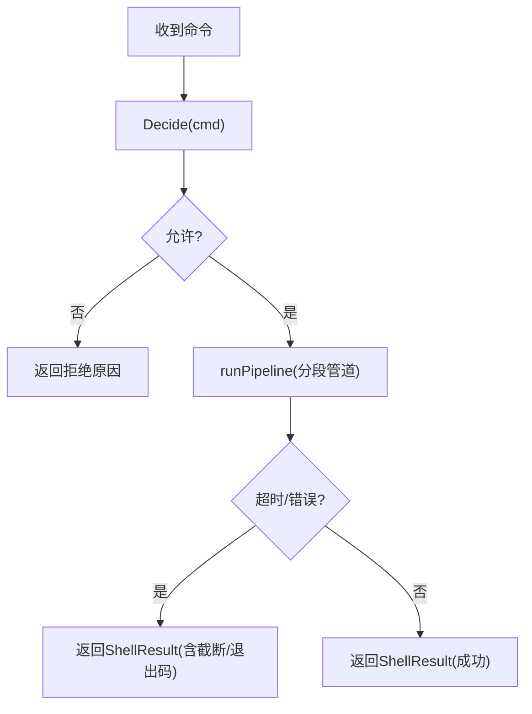
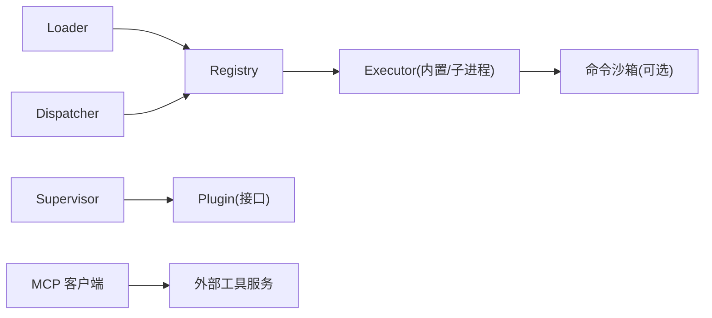

# 扩展性设计

<cite>
**本文引用的文件**
- [internal/skill/types.go](file://internal/skill/types.go)
- [internal/skill/registry.go](file://internal/skill/registry.go)
- [internal/skill/loader.go](file://internal/skill/loader.go)
- [internal/skill/subprocess.go](file://internal/skill/subprocess.go)
- [internal/edgeagent/skill/dispatcher.go](file://internal/edgeagent/skill/dispatcher.go)
- [internal/edgeagent/plugins/plugin.go](file://internal/edgeagent/plugins/plugin.go)
- [internal/edgeagent/plugins/supervisor.go](file://internal/edgeagent/plugins/supervisor.go)
- [internal/pkg/mcpclient/client.go](file://internal/pkg/mcpclient/client.go)
- [internal/edgeagent/cmdpolicy/sandbox.go](file://internal/edgeagent/cmdpolicy/sandbox.go)
</cite>

## 目录
1. [引言](#引言)
2. [项目结构](#项目结构)
3. [核心组件](#核心组件)
4. [架构总览](#架构总览)
5. [详细组件分析](#详细组件分析)
6. [依赖关系分析](#依赖关系分析)
7. [性能考虑](#性能考虑)
8. [故障排查指南](#故障排查指南)
9. [结论](#结论)
10. [附录：插件与技能开发指南](#附录：插件与技能开发指南)

## 引言
本设计文档聚焦 Ongrid 的扩展性，围绕“插件系统、技能系统、工具系统”三大扩展面展开，重点说明动态加载、热插拔与沙箱隔离的实现原理，覆盖插件注册表、生命周期管理与资源隔离策略。同时提供插件与技能的开发指南和最佳实践，并讨论扩展点抽象设计与向后兼容性保证。

## 项目结构
Ongrid 将扩展能力拆分为三层：
- 边缘侧插件系统（plugins）：以信号名（metrics/logs/traces/profiles）为键，统一生命周期管理，支持进程内与子进程两种实现，Supervisor 负责配置拉取、启停与重启。
- 设备侧技能系统（skill）：统一的 L2 能力抽象，通过全局注册表按 Key 分发执行；支持内置 Go 实现与外部可执行程序（SubprocessSkill），并提供权限分级与安全约束。
- 云端工具系统（mcpclient + manager 工具注册）：通过 MCP 协议发现与调用外部工具，结合技能元数据生成 LLM 工具描述与 UI 表单。

图表来源
- [internal/edgeagent/plugins/plugin.go:18-52](file://internal/edgeagent/plugins/plugin.go#L18-L52)
- [internal/edgeagent/plugins/supervisor.go:112-133](file://internal/edgeagent/plugins/supervisor.go#L112-L133)
- [internal/skill/registry.go:10-47](file://internal/skill/registry.go#L10-L47)
- [internal/edgeagent/skill/dispatcher.go:16-44](file://internal/edgeagent/skill/dispatcher.go#L16-L44)
- [internal/pkg/mcpclient/client.go:103-131](file://internal/pkg/mcpclient/client.go#L103-L131)
- [internal/edgeagent/cmdpolicy/sandbox.go:140-188](file://internal/edgeagent/cmdpolicy/sandbox.go#L140-L188)

章节来源
- [internal/edgeagent/plugins/plugin.go:18-52](file://internal/edgeagent/plugins/plugin.go#L18-L52)
- [internal/edgeagent/plugins/supervisor.go:112-133](file://internal/edgeagent/plugins/supervisor.go#L112-L133)
- [internal/skill/registry.go:10-47](file://internal/skill/registry.go#L10-L47)
- [internal/edgeagent/skill/dispatcher.go:16-44](file://internal/edgeagent/skill/dispatcher.go#L16-L44)
- [internal/pkg/mcpclient/client.go:103-131](file://internal/pkg/mcpclient/client.go#L103-L131)
- [internal/edgeagent/cmdpolicy/sandbox.go:140-188](file://internal/edgeagent/cmdpolicy/sandbox.go#L140-L188)

## 核心组件
- 技能元数据与执行器接口：定义权限等级、作用域、参数 Schema、执行契约，支撑自动推导 LLM 工具描述与 UI 表单。
- 全局技能注册表：进程级注册与并发读取，提供按 Key 查找、按权限类过滤、全量枚举能力。
- 外部技能加载器：扫描指定目录下的 skill.json 清单，构建 SubprocessSkill 并注册到全局注册表，支持安全白名单与超时控制。
- 子进程执行器：以独立进程运行外部二进制，stdin/stdout JSON 通信，严格限制环境变量、输出大小与超时。
- 边缘调度器：接收 execute_skill RPC，按 Key 分发给对应 Executor，错误封装在响应体中以便审计与展示。
- 插件接口与监管器：统一 Plugin 生命周期（Configure/Start/Stop/HealthSnapshot），Supervisor 周期拉取配置并做差异应用，支持热重载与崩溃自愈。
- MCP 工具客户端：通过 Streamable HTTP 与 MCP 服务器交互，列举与调用工具，作为云端工具扩展入口。
- 命令沙箱：对 shell 命令进行策略校验、路径校验、网络目标白名单校验，管道化执行并限制输出与超时。

章节来源
- [internal/skill/types.go:99-203](file://internal/skill/types.go#L99-L203)
- [internal/skill/registry.go:10-47](file://internal/skill/registry.go#L10-L47)
- [internal/skill/loader.go:13-74](file://internal/skill/loader.go#L13-L74)
- [internal/skill/subprocess.go:30-78](file://internal/skill/subprocess.go#L30-L78)
- [internal/edgeagent/skill/dispatcher.go:16-44](file://internal/edgeagent/skill/dispatcher.go#L16-L44)
- [internal/edgeagent/plugins/plugin.go:18-52](file://internal/edgeagent/plugins/plugin.go#L18-L52)
- [internal/edgeagent/plugins/supervisor.go:112-133](file://internal/edgeagent/plugins/supervisor.go#L112-L133)
- [internal/pkg/mcpclient/client.go:103-131](file://internal/pkg/mcpclient/client.go#L103-L131)
- [internal/edgeagent/cmdpolicy/sandbox.go:140-188](file://internal/edgeagent/cmdpolicy/sandbox.go#L140-L188)

## 架构总览
Ongrid 的扩展体系由“注册—加载—调度—执行—监控”闭环构成：
- 注册：内置技能在 init 时向全局注册表登记；外部技能通过清单加载器扫描并注册。
- 加载：加载器对清单进行解析、路径白名单校验、权限类与分类设置，构建 SubprocessSkill。
- 调度：边缘侧 receive execute_skill 请求后，按 Key 查找 Executor 并执行；云端通过 MCP 发现与调用工具。
- 执行：Go 实现直接执行；外部二进制通过子进程执行，受限于超时、环境变量白名单与输出上限。
- 监控：插件健康快照周期性上报；技能执行结果与错误进入审计与日志。

图表来源
- [internal/pkg/mcpclient/client.go:87-131](file://internal/pkg/mcpclient/client.go#L87-L131)
- [internal/edgeagent/skill/dispatcher.go:24-44](file://internal/edgeagent/skill/dispatcher.go#L24-L44)
- [internal/skill/registry.go:35-47](file://internal/skill/registry.go#L35-L47)
- [internal/skill/subprocess.go:112-172](file://internal/skill/subprocess.go#L112-L172)
- [internal/edgeagent/cmdpolicy/sandbox.go:140-188](file://internal/edgeagent/cmdpolicy/sandbox.go#L140-L188)

## 详细组件分析

### 技能系统与注册表
- 元数据与执行契约：Metadata 声明 Key、Name、Description、Class、Scope、Params、ResultPreview；Executor 暴露 Metadata() 与 Execute(ctx, params)。
- 注册表：全局 Registry 维护 map[string]Executor，提供 Register、Get、All、AllByClass；并发安全使用读写锁。
- 权限与作用域：Class 分为 safe/mutating/dangerous；Scope 区分 host（边缘执行）与 manager（云端执行）。
- 自动推导：基于 Params 或 RawSchemaProvider 生成 JSON Schema，用于 LLM 工具与 UI 表单。

图表来源
- [internal/skill/types.go:99-203](file://internal/skill/types.go#L99-L203)
- [internal/skill/registry.go:17-47](file://internal/skill/registry.go#L17-L47)
- [internal/skill/subprocess.go:43-78](file://internal/skill/subprocess.go#L43-L78)

章节来源
- [internal/skill/types.go:99-203](file://internal/skill/types.go#L99-L203)
- [internal/skill/registry.go:17-47](file://internal/skill/registry.go#L17-L47)

### 外部技能动态加载与沙箱隔离
- 清单格式：SkillManifest 包含 name、description、schema、entry、env_allow、timeout_seconds、class、category。
- 加载流程：LoadDirs 遍历白名单目录，解析 skill.json，构建 SubprocessSkill 并注册；重复 Key 跳过而非崩溃。
- 安全约束：Entry 必须位于允许根目录下（含符号链接解析校验）；环境变量仅白名单透传；默认无 PATH；超时默认 30s；stdout 最大 16MiB，stderr 尾部保留 4KiB。
- 执行模型：stdin 传入 JSON 参数，stdout 返回 JSON 结果；非零退出码视为错误并附带 stderr 尾部信息。

图表来源
- [internal/skill/loader.go:69-160](file://internal/skill/loader.go#L69-L160)
- [internal/skill/loader.go:176-254](file://internal/skill/loader.go#L176-L254)
- [internal/skill/subprocess.go:112-172](file://internal/skill/subprocess.go#L112-L172)

章节来源
- [internal/skill/loader.go:69-160](file://internal/skill/loader.go#L69-L160)
- [internal/skill/loader.go:176-254](file://internal/skill/loader.go#L176-L254)
- [internal/skill/subprocess.go:112-172](file://internal/skill/subprocess.go#L112-L172)

### 边缘技能调度与云端工具集成
- 边缘调度：receive execute_skill 请求，解析 key 与 params，查找 Executor 并执行；错误封装在响应体中，便于审计与前端展示。
- 云端工具：通过 MCP 客户端与远程服务交互，先 initialize，再 tools/list 获取工具列表与输入 Schema，最后 tools/call 调用工具。

图表来源
- [internal/edgeagent/skill/dispatcher.go:24-44](file://internal/edgeagent/skill/dispatcher.go#L24-L44)
- [internal/pkg/mcpclient/client.go:87-131](file://internal/pkg/mcpclient/client.go#L87-L131)

章节来源
- [internal/edgeagent/skill/dispatcher.go:24-44](file://internal/edgeagent/skill/dispatcher.go#L24-L44)
- [internal/pkg/mcpclient/client.go:87-131](file://internal/pkg/mcpclient/client.go#L87-L131)

### 插件系统与生命周期管理
- 插件接口：统一 Name、Configure、Start、Stop、HealthSnapshot；支持 ReadyPlugin 异步就绪等待。
- 监管器：Supervisor 周期拉取配置（ConfigFetcher），计算差异并 Apply：新增启用→Configure+Start；禁用→Stop；配置变更→重新 Configure，必要时 Stop+Start；崩溃后自动重启。
- 健康上报：定期收集各插件 HealthSnapshot，上报给 Manager。

图表来源
- [internal/edgeagent/plugins/plugin.go:18-52](file://internal/edgeagent/plugins/plugin.go#L18-L52)
- [internal/edgeagent/plugins/supervisor.go:112-133](file://internal/edgeagent/plugins/supervisor.go#L112-L133)
- [internal/edgeagent/plugins/supervisor.go:175-243](file://internal/edgeagent/plugins/supervisor.go#L175-L243)

章节来源
- [internal/edgeagent/plugins/plugin.go:18-52](file://internal/edgeagent/plugins/plugin.go#L18-L52)
- [internal/edgeagent/plugins/supervisor.go:112-133](file://internal/edgeagent/plugins/supervisor.go#L112-L133)
- [internal/edgeagent/plugins/supervisor.go:175-243](file://internal/edgeagent/plugins/supervisor.go#L175-L243)

### 命令沙箱与执行策略
- 策略决策：Sandbox.Decide 基于 Policy 判断是否允许执行，并进行路径校验与网络目标白名单校验。
- 执行管道：Sandbox.Exec 将命令分段通过管道串联执行，限制环境变量、输出大小与超时；ExecRaw 绕过策略检查（需管理员授权）。
- 输出与截断：stdout/stderr 写入带容量的 Writer，达到上限标记 Truncated 以便上层提示。

图表来源
- [internal/edgeagent/cmdpolicy/sandbox.go:76-132](file://internal/edgeagent/cmdpolicy/sandbox.go#L76-L132)
- [internal/edgeagent/cmdpolicy/sandbox.go:140-188](file://internal/edgeagent/cmdpolicy/sandbox.go#L140-L188)
- [internal/edgeagent/cmdpolicy/sandbox.go:260-342](file://internal/edgeagent/cmdpolicy/sandbox.go#L260-L342)

章节来源
- [internal/edgeagent/cmdpolicy/sandbox.go:76-132](file://internal/edgeagent/cmdpolicy/sandbox.go#L76-L132)
- [internal/edgeagent/cmdpolicy/sandbox.go:140-188](file://internal/edgeagent/cmdpolicy/sandbox.go#L140-L188)
- [internal/edgeagent/cmdpolicy/sandbox.go:260-342](file://internal/edgeagent/cmdpolicy/sandbox.go#L260-L342)

## 依赖关系分析
- 技能层依赖：
  - 注册表依赖 Executor 接口；SubprocessSkill 实现 Executor。
  - Loader 依赖 SkillManifest 与 SubprocessSkill 构建逻辑。
  - Dispatcher 依赖全局注册表进行 Key 分发。
- 插件层依赖：
  - Supervisor 依赖 ConfigFetcher 获取配置，依赖 Plugin 接口管理生命周期。
  - 插件健康快照聚合后上报。
- 工具层依赖：
  - MCP 客户端依赖 HTTP 与 SSE 解析，提供 tools/list/call。
- 沙箱依赖：
  - Sandbox 依赖 Policy、PathValidator、网络白名单策略。

图表来源
- [internal/skill/loader.go:69-160](file://internal/skill/loader.go#L69-L160)
- [internal/skill/registry.go:17-47](file://internal/skill/registry.go#L17-L47)
- [internal/edgeagent/skill/dispatcher.go:24-44](file://internal/edgeagent/skill/dispatcher.go#L24-L44)
- [internal/edgeagent/plugins/supervisor.go:112-133](file://internal/edgeagent/plugins/supervisor.go#L112-L133)
- [internal/pkg/mcpclient/client.go:103-131](file://internal/pkg/mcpclient/client.go#L103-L131)
- [internal/edgeagent/cmdpolicy/sandbox.go:140-188](file://internal/edgeagent/cmdpolicy/sandbox.go#L140-L188)

章节来源
- [internal/skill/loader.go:69-160](file://internal/skill/loader.go#L69-L160)
- [internal/skill/registry.go:17-47](file://internal/skill/registry.go#L17-L47)
- [internal/edgeagent/skill/dispatcher.go:24-44](file://internal/edgeagent/skill/dispatcher.go#L24-L44)
- [internal/edgeagent/plugins/supervisor.go:112-133](file://internal/edgeagent/plugins/supervisor.go#L112-L133)
- [internal/pkg/mcpclient/client.go:103-131](file://internal/pkg/mcpclient/client.go#L103-L131)
- [internal/edgeagent/cmdpolicy/sandbox.go:140-188](file://internal/edgeagent/cmdpolicy/sandbox.go#L140-L188)

## 性能考虑
- 注册表读多写少：注册阶段单线程，运行时并发读使用读写锁，All/AllByClass 排序开销可控。
- 子进程执行限制：stdout 最大 16MiB，stderr 尾部保留 4KiB，避免内存膨胀；默认超时 30s，防止长时间阻塞。
- 插件热重载：Supervisor 周期轮询与触发重载，差异最小化变更，减少不必要的重启。
- 管道执行：分段命令通过管道连接，失败段尽早终止，整体超时控制保障资源占用。

[本节为通用性能建议，不直接分析具体文件]

## 故障排查指南
- 技能未找到：检查 Key 是否正确、是否已注册；边缘调度器会返回未知 Key 的错误。
- 外部技能无法执行：确认 entry 路径在白名单根目录下、可执行、环境变量白名单包含所需变量；查看 stderr 尾部信息。
- 插件未启动：检查 ConfigFetcher 是否能拉取配置；查看 Supervisor 日志中的配置差异与应用结果；关注 ReadyPlugin 就绪超时。
- 命令被拒绝：检查 Policy 是否允许该命令、路径是否合法、网络目标是否在白名单；必要时使用 ExecRaw（需管理员授权）。

章节来源
- [internal/edgeagent/skill/dispatcher.go:24-44](file://internal/edgeagent/skill/dispatcher.go#L24-L44)
- [internal/skill/loader.go:176-254](file://internal/skill/loader.go#L176-L254)
- [internal/skill/subprocess.go:112-172](file://internal/skill/subprocess.go#L112-L172)
- [internal/edgeagent/plugins/supervisor.go:175-243](file://internal/edgeagent/plugins/supervisor.go#L175-L243)
- [internal/edgeagent/cmdpolicy/sandbox.go:76-132](file://internal/edgeagent/cmdpolicy/sandbox.go#L76-L132)

## 结论
Ongrid 通过清晰的抽象与分层实现了高扩展性：技能系统以注册表为核心，支持内置与外部实现；插件系统以 Supervisor 为中心，提供热插拔与健康治理；工具系统借助 MCP 协议对接外部能力。配合严格的沙箱与策略控制，既保证了安全性，又提供了灵活的扩展空间。

[本节为总结性内容，不直接分析具体文件]

## 附录：插件与技能开发指南

### 开发自定义技能
- 选择实现方式：
  - 内置 Go 技能：实现 Executor 接口，在 init 中调用 Register 注册。
  - 外部二进制技能：编写 skill.json 清单，确保 entry 位于允许根目录，配置 env_allow、timeout_seconds、class、category。
- 元数据设计：
  - 明确 Key、Name、Description，合理设置 Class（safe/mutating/dangerous）与 Scope（host/manager）。
  - 使用 Params 或 RawSchemaProvider 定义输入 Schema，便于 LLM 与 UI 自动生成。
- 安全与健壮性：
  - 外部技能应尽快返回有效 JSON，避免大量输出；正确处理超时与错误码。
  - 谨慎使用危险权限，遵循最小权限原则。

章节来源
- [internal/skill/types.go:99-203](file://internal/skill/types.go#L99-L203)
- [internal/skill/loader.go:13-74](file://internal/skill/loader.go#L13-L74)
- [internal/skill/loader.go:176-254](file://internal/skill/loader.go#L176-L254)
- [internal/skill/subprocess.go:112-172](file://internal/skill/subprocess.go#L112-L172)

### 开发自定义插件
- 实现 Plugin 接口：
  - Name：唯一标识（如 metrics/logs/traces）。
  - Configure：接收配置并准备资源。
  - Start：启动工作（进程内 goroutine 或子进程）。
  - Stop：优雅关闭。
  - HealthSnapshot：返回当前健康状态。
- 接入 Supervisor：
  - 在启动前 Register 插件实例。
  - 实现 ReadyPlugin 以支持异步就绪检测。
  - 实现 ConfigApplyReporter（可选）以回传配置应用结果。

章节来源
- [internal/edgeagent/plugins/plugin.go:18-52](file://internal/edgeagent/plugins/plugin.go#L18-L52)
- [internal/edgeagent/plugins/supervisor.go:112-133](file://internal/edgeagent/plugins/supervisor.go#L112-L133)
- [internal/edgeagent/plugins/supervisor.go:175-243](file://internal/edgeagent/plugins/supervisor.go#L175-L243)

### 开发外部工具（MCP）
- 遵循 MCP 协议：
  - 实现 initialize、tools/list、tools/call。
  - 返回 JSON Schema 描述工具输入，便于 LLM 正确调用。
- 安全与鉴权：
  - 使用静态头注入凭据；限制会话 ID 传递。
  - 对长流式响应进行首条 JSON-RPC 响应提取。

章节来源
- [internal/pkg/mcpclient/client.go:87-131](file://internal/pkg/mcpclient/client.go#L87-L131)
- [internal/pkg/mcpclient/client.go:174-219](file://internal/pkg/mcpclient/client.go#L174-L219)

### 扩展点抽象与向后兼容
- 抽象设计：
  - Executor 接口稳定，新增实现无需改动调度逻辑。
  - Plugin 接口统一生命周期，新增插件类型透明接入。
  - MCP 协议标准化工具发现与调用。
- 向后兼容：
  - 默认值策略：Class 默认为 safe，Scope 默认为 host，降低作者遗漏风险。
  - 注册表与加载器对重复 Key 与无效清单采取跳过与日志记录，避免启动失败。
  - 插件配置差异比较语义化，仅在必要变更时重启。

章节来源
- [internal/skill/types.go:205-224](file://internal/skill/types.go#L205-L224)
- [internal/skill/loader.go:138-160](file://internal/skill/loader.go#L138-L160)
- [internal/edgeagent/plugins/supervisor.go:278-300](file://internal/edgeagent/plugins/supervisor.go#L278-L300)