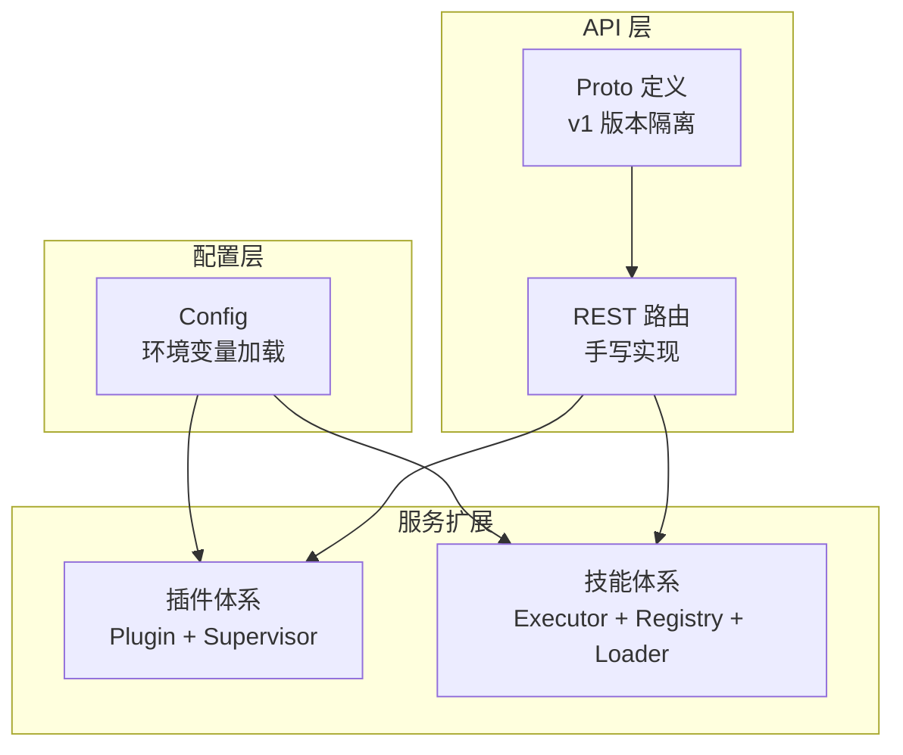
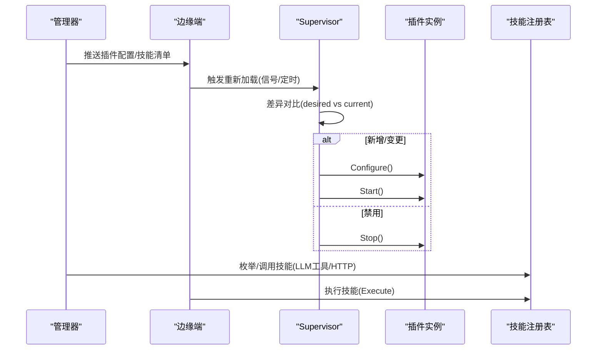
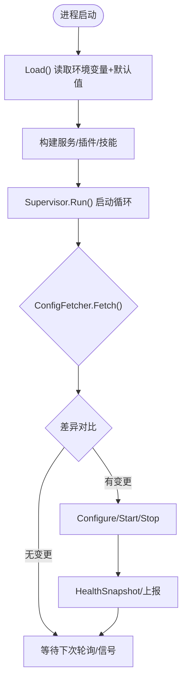
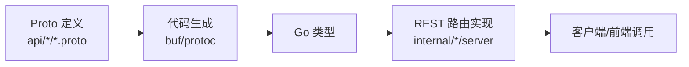
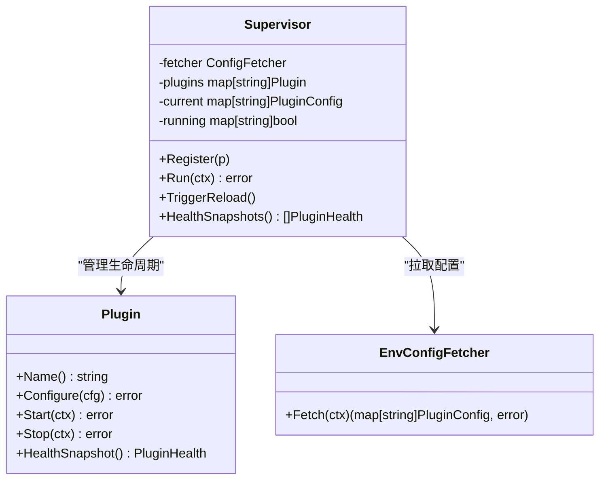
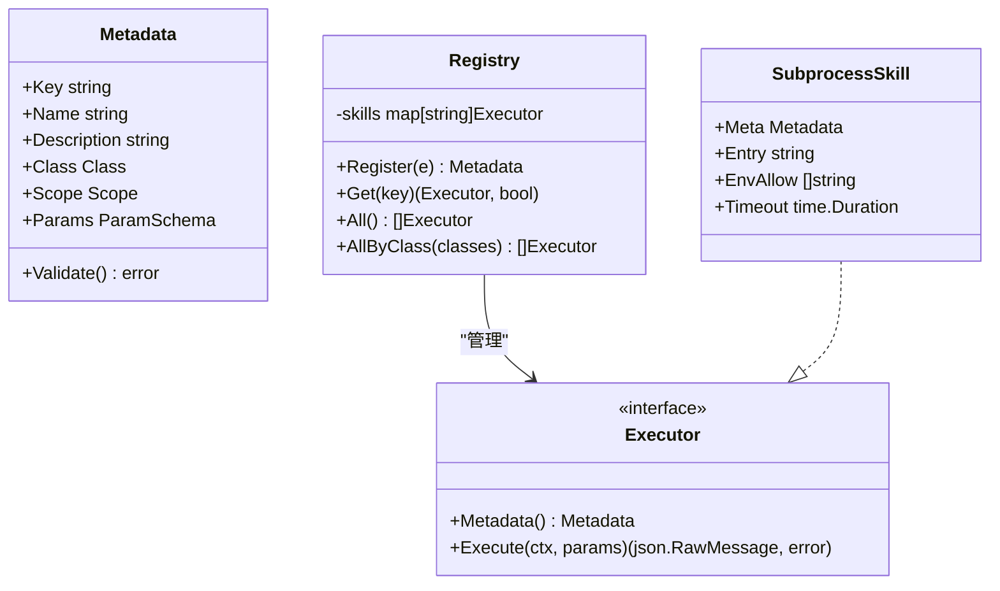
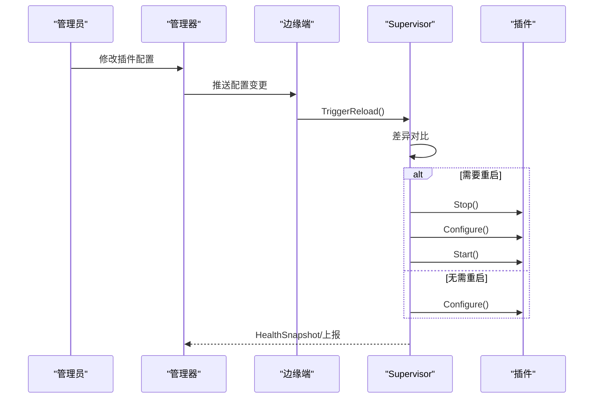
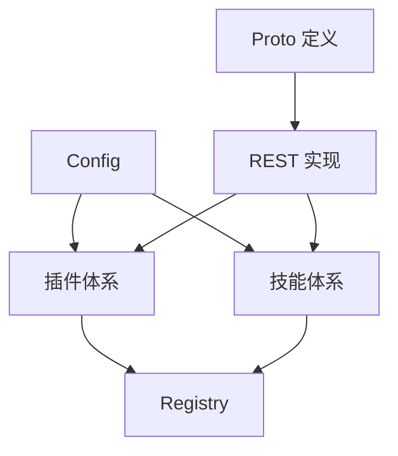

# 扩展点设计

<cite>
**本文引用的文件**
- [config.go](file://internal/pkg/config/config.go)
- [registry.go](file://internal/skill/registry.go)
- [types.go](file://internal/skill/types.go)
- [loader.go](file://internal/skill/loader.go)
- [plugin.go](file://internal/edgeagent/plugins/plugin.go)
- [supervisor.go](file://internal/edgeagent/plugins/supervisor.go)
- [config_env.go](file://internal/edgeagent/plugins/config_env.go)
- [README.md](file://api/README.md)
- [tunnel.proto](file://api/tunnel/v1/tunnel.proto)
- [metric.proto](file://api/manager/metric/v1/metric.proto)
- [Makefile](file://Makefile)
</cite>

## 目录
1. [引言](#引言)
2. [项目结构](#项目结构)
3. [核心组件](#核心组件)
4. [架构总览](#架构总览)
5. [详细组件分析](#详细组件分析)
6. [依赖关系分析](#依赖关系分析)
7. [性能与可扩展性](#性能与可扩展性)
8. [故障排查指南](#故障排查指南)
9. [结论](#结论)
10. [附录：最佳实践与设计原则](#附录最佳实践与设计原则)

## 引言
本文件系统化阐述 Ongrid 的扩展点设计，覆盖配置扩展、API 扩展与服务扩展三大机制。重点说明：
- 扩展点的抽象与注册流程（技能注册、插件生命周期、外部技能加载）
- 版本兼容性与迁移策略（Proto 版本约定、CI 破坏性变更检测、数据库迁移）
- 热插拔支持（插件配置拉取、差异对比、按需重启、健康上报）
- 配置系统能力（环境变量注入、配置文件加载、运行时更新）
- API 向后兼容保证与迁移策略
- 扩展开发最佳实践与设计原则

## 项目结构
Ongrid 将“扩展”拆分为三层：
- 配置扩展：集中通过环境变量驱动，提供默认值与开关，支撑服务启动与运行时行为切换
- API 扩展：以 Proto 为单一事实来源，按业务域划分版本包，REST 路由手写实现；CI 使用 buf breaking 检测破坏性变更
- 服务扩展：包含两类
  - 边缘侧插件体系：统一 Plugin 接口 + Supervisor 协调器，支持进程内/子进程插件的热重载与健康上报
  - 技能体系：统一的 Executor 抽象 + 全局 Registry + 外部技能包加载器，自动推导 LLM 工具、HTTP 路由与 UI 表单

**图表来源**
- [config.go:18-63](file://internal/pkg/config/config.go#L18-L63)
- [README.md:1-42](file://api/README.md#L1-L42)
- [plugin.go:18-52](file://internal/edgeagent/plugins/plugin.go#L18-L52)
- [registry.go:10-47](file://internal/skill/registry.go#L10-L47)

**章节来源**
- [config.go:18-63](file://internal/pkg/config/config.go#L18-L63)
- [README.md:1-42](file://api/README.md#L1-L42)

## 核心组件
- 配置中心：从环境变量加载并合并默认值，暴露结构化 Config 供各子系统消费
- 插件体系：统一 Plugin 接口与 Supervisor 调度，支持配置拉取、差异对比、按需重启与健康上报
- 技能体系：统一 Executor 抽象、全局注册表、外部技能包扫描与注册，自动推导 LLM 工具与 HTTP 路由
- API 契约：Proto 作为唯一事实来源，按 v1 版本管理，REST 路由基于 Go 类型手写实现

**章节来源**
- [config.go:414-549](file://internal/pkg/config/config.go#L414-L549)
- [plugin.go:18-135](file://internal/edgeagent/plugins/plugin.go#L18-L135)
- [registry.go:10-127](file://internal/skill/registry.go#L10-L127)
- [loader.go:13-274](file://internal/skill/loader.go#L13-L274)
- [README.md:1-42](file://api/README.md#L1-L42)

## 架构总览
下图展示扩展点在运行时的交互关系：配置驱动插件与技能的启用与参数；Supervisor 周期性或信号触发拉取配置并应用；技能通过全局注册表被管理器与边缘侧分发调用；API 层通过 Proto 定义的 v1 契约对外暴露能力。

**图表来源**
- [supervisor.go:112-243](file://internal/edgeagent/plugins/supervisor.go#L112-L243)
- [registry.go:10-47](file://internal/skill/registry.go#L10-L47)
- [plugin.go:18-52](file://internal/edgeagent/plugins/plugin.go#L18-L52)

## 详细组件分析

### 配置扩展：环境变量注入与运行时更新
- 配置加载：通过 Load 函数集中读取环境变量并设置默认值，形成结构化 Config 对象
- 可配置项：涵盖 HTTP/Metrics/Tunnel 地址、数据库、JWT、LLM 多提供商、通知渠道、告警规则、Prometheus/Grafana 集成、日志/追踪查询、抓包解析、技能外部目录等
- 运行时更新：插件侧通过 ConfigFetcher 拉取最新配置快照，Supervisor 进行差异对比后仅对变更项执行 Configure/Start/Stop，避免全量重启
- 环境变量注入：插件可通过环境变量获取设备标识、端点、鉴权信息等；同时支持通过 manager 下发的配置覆盖

**图表来源**
- [config.go:414-549](file://internal/pkg/config/config.go#L414-L549)
- [supervisor.go:112-243](file://internal/edgeagent/plugins/supervisor.go#L112-L243)
- [config_env.go:38-53](file://internal/edgeagent/plugins/config_env.go#L38-L53)

**章节来源**
- [config.go:18-63](file://internal/pkg/config/config.go#L18-L63)
- [config.go:414-549](file://internal/pkg/config/config.go#L414-L549)
- [config_env.go:38-53](file://internal/edgeagent/plugins/config_env.go#L38-L53)

### API 扩展：Proto 版本化与兼容性
- 单一事实来源：所有公共 API 契约集中在 api 目录，按业务域与 major 版本组织（如 ongrid.manager.metric.v1）
- 生成与校验：通过 buf 或 protoc 生成 Go 存根；CI 中使用 buf breaking 检测破坏性变更
- 路由实现：REST 路由手写实现，直接基于生成的 Go 类型，不依赖 grpc-gateway
- 传输协议：tunnel 消息在 MVP 阶段使用 JSON 传输，未来可切换到 proto 二进制

**图表来源**
- [README.md:1-42](file://api/README.md#L1-L42)
- [Makefile:135-162](file://Makefile#L135-L162)
- [tunnel.proto:1-29](file://api/tunnel/v1/tunnel.proto#L1-L29)
- [metric.proto:1-26](file://api/manager/metric/v1/metric.proto#L1-L26)

**章节来源**
- [README.md:1-42](file://api/README.md#L1-L42)
- [Makefile:135-162](file://Makefile#L135-L162)
- [tunnel.proto:1-29](file://api/tunnel/v1/tunnel.proto#L1-L29)
- [metric.proto:1-26](file://api/manager/metric/v1/metric.proto#L1-L26)

### 服务扩展：插件体系（Edge Agent）
- 统一接口：Plugin 定义 Name/Configure/Start/Stop/HealthSnapshot，屏蔽进程内与子进程实现的差异
- 生命周期管理：Supervisor 负责注册、拉取配置、差异对比、启停控制、健康收集与上报
- 热插拔：支持配置变更时仅重配置/重启受影响插件；崩溃自动重启；支持 ReadyPlugin 就绪门控
- 配置来源：EnvConfigFetcher 从环境变量读取插件配置；也可替换为隧道拉取实现

**图表来源**
- [plugin.go:18-135](file://internal/edgeagent/plugins/plugin.go#L18-L135)
- [supervisor.go:12-135](file://internal/edgeagent/plugins/supervisor.go#L12-L135)
- [config_env.go:38-53](file://internal/edgeagent/plugins/config_env.go#L38-L53)

**章节来源**
- [plugin.go:18-135](file://internal/edgeagent/plugins/plugin.go#L18-L135)
- [supervisor.go:12-301](file://internal/edgeagent/plugins/supervisor.go#L12-L301)
- [config_env.go:38-53](file://internal/edgeagent/plugins/config_env.go#L38-L53)

### 服务扩展：技能体系（Manager/Edge）
- 抽象与分类：Skill 通过 Metadata 描述 Key/Name/Description/Class/Scope/Params，Executor 提供 Execute 实现
- 权限分级：safe/mutating/dangerous 三类，配合审批流与安全策略
- 注册机制：全局 Registry 维护 Executor 映射；init 时注册内置技能；外部技能通过 Loader 扫描 skill.json 并注册
- 自动推导：根据 Metadata 自动生成 LLM 工具、HTTP 路由与 UI 表单；支持 RawSchemaProvider 自定义复杂参数结构

**图表来源**
- [types.go:35-241](file://internal/skill/types.go#L35-L241)
- [registry.go:10-127](file://internal/skill/registry.go#L10-L127)
- [loader.go:13-274](file://internal/skill/loader.go#L13-L274)

**章节来源**
- [types.go:35-241](file://internal/skill/types.go#L35-L241)
- [registry.go:10-127](file://internal/skill/registry.go#L10-L127)
- [loader.go:13-274](file://internal/skill/loader.go#L13-L274)

### 热插拔与版本兼容性
- 热插拔：Supervisor 通过 ConfigFetcher 定期或信号触发拉取配置，比较 desired/current，仅对变更项执行 Configure/Start/Stop；支持 ReadyPlugin 就绪门控与错误上报
- 版本兼容：API 采用 v1 版本隔离；每个 RPC 拥有独立 Request/Response 类型；CI 使用 buf breaking 检测破坏性变更；tunnel 消息 MVP 使用 JSON，便于平滑演进
- 数据迁移：db/migrations 提供 up/down 脚本，配合 migrate 命令进行数据库版本管理

**图表来源**
- [supervisor.go:84-135](file://internal/edgeagent/plugins/supervisor.go#L84-L135)
- [supervisor.go:135-243](file://internal/edgeagent/plugins/supervisor.go#L135-L243)
- [README.md:1-42](file://api/README.md#L1-L42)

**章节来源**
- [supervisor.go:84-135](file://internal/edgeagent/plugins/supervisor.go#L84-L135)
- [supervisor.go:135-243](file://internal/edgeagent/plugins/supervisor.go#L135-L243)
- [README.md:1-42](file://api/README.md#L1-L42)

## 依赖关系分析
- 配置到服务：Config 为插件与技能提供运行时参数；Skills.ExternalDirs 控制外部技能加载路径
- 插件到配置：Supervisor 依赖 ConfigFetcher 获取插件配置；EnvConfigFetcher 从环境变量读取
- 技能到注册表：Loader 扫描外部技能并注册到全局 Registry；Registry 提供 Get/All/AllByClass 查询
- API 到实现：Proto 定义约束 REST 路由实现；CI 通过 buf breaking 保障兼容性

**图表来源**
- [config.go:18-63](file://internal/pkg/config/config.go#L18-L63)
- [plugin.go:18-135](file://internal/edgeagent/plugins/plugin.go#L18-L135)
- [registry.go:10-127](file://internal/skill/registry.go#L10-L127)
- [README.md:1-42](file://api/README.md#L1-L42)

**章节来源**
- [config.go:18-63](file://internal/pkg/config/config.go#L18-L63)
- [plugin.go:18-135](file://internal/edgeagent/plugins/plugin.go#L18-L135)
- [registry.go:10-127](file://internal/skill/registry.go#L10-L127)
- [README.md:1-42](file://api/README.md#L1-L42)

## 性能与可扩展性
- 插件热重载：仅对变更项执行 Configure/Start/Stop，减少不必要重启开销；ReadyPlugin 就绪门控避免误报
- 配置拉取：Supervisor 支持定时器与信号双通道，兼顾实时性与稳定性；失败时保持上一状态，避免雪崩
- 技能加载：外部技能按目录扫描，重复 key 跳过；单技能解析失败不影响整体启动
- API 版本：v1 隔离与 CI 破坏性变更检测，降低升级风险；JSON 传输便于过渡期兼容

[本节为通用指导，不直接分析具体文件]

## 故障排查指南
- 插件无法启动：检查 Supervisor 日志中的 start failed 与 last_error；确认 ConfigFetcher 返回的配置有效；必要时手动 TriggerReload
- 配置未生效：确认 ConfigFetcher 能拉取到最新快照；查看 reconcile snapshot 日志中 enabled_names；验证 configEqual 语义是否认为已变更
- 技能未注册：检查 Loader 日志中 parse/build/register 输出；确认 skill.json 字段完整且 entry 在允许目录下；避免重复 key
- API 兼容问题：确认 Proto 未引入破坏性变更；CI 中 buf breaking 是否通过；必要时回滚至稳定版本

**章节来源**
- [supervisor.go:135-243](file://internal/edgeagent/plugins/supervisor.go#L135-L243)
- [loader.go:112-161](file://internal/skill/loader.go#L112-L161)
- [README.md:1-42](file://api/README.md#L1-L42)

## 结论
Ongrid 的扩展点设计以“配置即驱动、契约即边界、生命周期即治理”为核心：
- 配置扩展通过环境变量与结构化 Config 统一管理，支撑服务启动与运行时行为切换
- API 扩展以 Proto 为单一事实来源，v1 版本隔离与 CI 破坏性变更检测保障向后兼容
- 服务扩展通过插件与技能两大体系，提供统一接口、注册机制与热插拔治理能力
该设计在保证稳定性的同时，提供了良好的可扩展性与可维护性。

[本节为总结性内容，不直接分析具体文件]

## 附录：最佳实践与设计原则
- 配置优先：尽量通过环境变量与配置项驱动行为，避免硬编码；为新功能提供默认值与开关
- 最小变更：热插拔场景下，尽量只重配置而不重启；确需重启时提供优雅停止与超时保护
- 版本隔离：新增 API 能力优先通过新字段或新版本包；避免破坏现有 v1 契约
- 安全边界：外部技能入口必须限制在允许目录；环境变量白名单最小化；敏感信息通过密钥管理
- 可观测性：插件与技能需提供健康快照与错误上报；关键路径记录 reconcile 快照与变更原因
- 测试先行：为插件与技能编写单元测试；使用隔离的 Registry 与静态 Fetcher 模拟配置变化

[本节为通用指导，不直接分析具体文件]