# 内置技能详解

<cite>
**本文引用的文件**
- [internal/skill/builtin/doc.go](file://internal/skill/builtin/doc.go)
- [internal/skill/types.go](file://internal/skill/types.go)
- [internal/skill/registry.go](file://internal/skill/registry.go)
- [internal/skill/loader.go](file://internal/skill/loader.go)
- [internal/skill/builtin/probe_dns.go](file://internal/skill/builtin/probe_dns.go)
- [internal/skill/builtin/probe_http.go](file://internal/skill/builtin/probe_http.go)
- [internal/skill/builtin/probe_ping.go](file://internal/skill/builtin/probe_ping.go)
- [internal/skill/builtin/probe_tcp.go](file://internal/skill/builtin/probe_tcp.go)
- [internal/skill/builtin/read_journal.go](file://internal/skill/builtin/read_journal.go)
- [internal/skill/builtin/tail_file.go](file://internal/skill/builtin/tail_file.go)
- [internal/skill/builtin/web_search.go](file://internal/skill/builtin/web_search.go)
- [internal/skill/builtin/capture_pcap.go](file://internal/skill/builtin/capture_pcap.go)
- [internal/skill/builtin/host_netns_inspect.go](file://internal/skill/builtin/host_netns_inspect.go)
</cite>

## 目录
1. [简介](#简介)
2. [项目结构](#项目结构)
3. [核心组件](#核心组件)
4. [架构总览](#架构总览)
5. [详细组件分析](#详细组件分析)
6. [依赖关系分析](#依赖关系分析)
7. [性能考量](#性能考量)
8. [故障排查指南](#故障排查指南)
9. [结论](#结论)
10. [附录](#附录)

## 简介
本文件系统化梳理 Ongrid 的内置技能（Skills）能力，覆盖网络探测、文件操作、系统检查与联网搜索等类别。文档面向不同技术背景的读者，提供：
- 每个技能的功能特性、参数配置、使用场景
- 探测原理与参数选项说明
- 输出格式与错误处理机制
- 组合使用模式与最佳实践
- 故障排查与性能优化建议

## 项目结构
Ongrid 的技能框架位于 internal/skill 包，内置技能实现集中在 internal/skill/builtin。每个技能通过 init() 调用 skill.Register 完成注册；框架根据 Metadata 自动生成 LLM 工具描述、HTTP 路由、UI 表单、权限门控与审计日志。

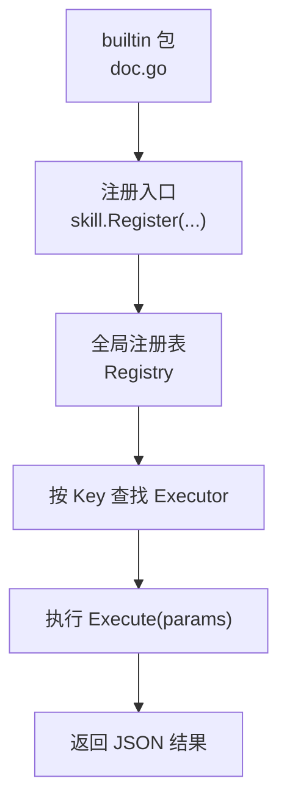

**图示来源**
- [internal/skill/builtin/doc.go:1-26](file://internal/skill/builtin/doc.go#L1-L26)
- [internal/skill/registry.go:10-47](file://internal/skill/registry.go#L10-L47)

**章节来源**
- [internal/skill/builtin/doc.go:1-26](file://internal/skill/builtin/doc.go#L1-L26)
- [internal/skill/registry.go:10-47](file://internal/skill/registry.go#L10-L47)

## 核心组件
- 元数据与类型
  - Metadata：定义技能的 Key、Name、Description、Class、Scope、Category、Params、ResultPreview
  - ParamSchema：声明参数名、类型、是否必填、默认值、枚举、数组元素类型
  - Class：safe / mutating / dangerous 三类权限等级
  - Scope：host（在边缘节点执行）或 manager（在管理端执行）
- 注册与发现
  - Registry：进程级技能目录，支持 Register/Get/All/AllByClass
  - Loader：加载外部技能包（skill.json + 可执行），安全限制 entry 路径与环境变量白名单
- 执行契约
  - Executor：Metadata() 与 Execute(ctx, params) -> (json.RawMessage, error)

这些抽象使新增技能只需一个文件并注册一次，即可被 LLM、HTTP API、UI 和审计系统自动感知。

**章节来源**
- [internal/skill/types.go:29-175](file://internal/skill/types.go#L29-L175)
- [internal/skill/types.go:177-241](file://internal/skill/types.go#L177-L241)
- [internal/skill/registry.go:10-127](file://internal/skill/registry.go#L10-L127)
- [internal/skill/loader.go:13-74](file://internal/skill/loader.go#L13-L74)
- [internal/skill/loader.go:176-254](file://internal/skill/loader.go#L176-L254)

## 架构总览
下图展示从“调用方”到“具体技能执行”的端到端流程，以及 Manager/Edge 两种执行范围的区别。

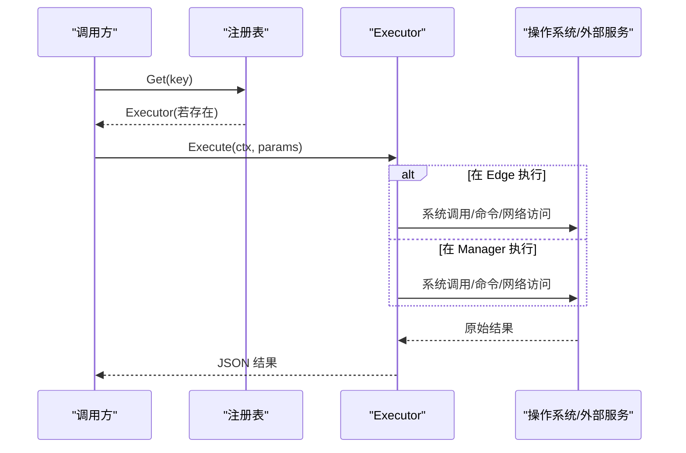

**图示来源**
- [internal/skill/types.go:190-203](file://internal/skill/types.go#L190-L203)
- [internal/skill/registry.go:35-47](file://internal/skill/registry.go#L35-L47)

## 详细组件分析

### 网络探测类技能

#### DNS 解析（host_probe_dns）
- 功能：对目标主机进行 A/AAAA 解析，返回地址列表与耗时
- 参数
  - host：必填，字符串
  - timeout_ms：可选，整数，默认 3000
- 原理：使用系统解析器 LookupIPAddr，并通过 context 超时保护
- 输出：{addrs, latency_ms, error?}
- 适用场景：快速验证域名解析是否正常、定位 DNS 延迟问题

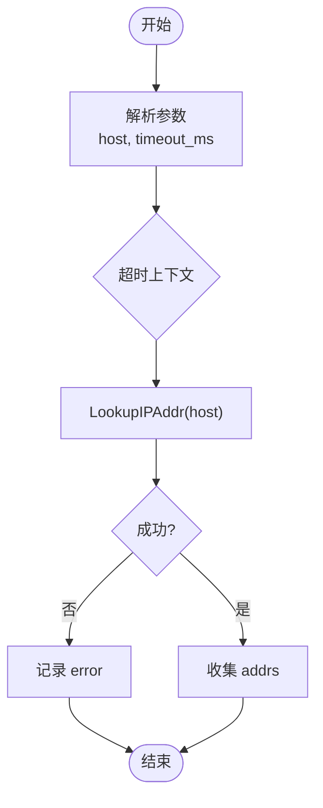

**图示来源**
- [internal/skill/builtin/probe_dns.go:20-84](file://internal/skill/builtin/probe_dns.go#L20-L84)

**章节来源**
- [internal/skill/builtin/probe_dns.go:20-84](file://internal/skill/builtin/probe_dns.go#L20-L84)

#### HTTP 探测（host_probe_http）
- 功能：对 URL 发起 HEAD/GET 请求，返回状态码、耗时与内容长度
- 参数
  - url：必填，字符串
  - method：可选，枚举 GET/HEAD，默认 HEAD
  - timeout_ms：可选，整数，默认 5000
- 原理：创建 http.Client（跳过 TLS 校验以适配内网自签证书），设置超时；GET 会读取并丢弃响应体统计字节数
- 输出：{status_code, latency_ms, content_length, error?}
- 适用场景：健康检查、连通性探测、接口可用性监控

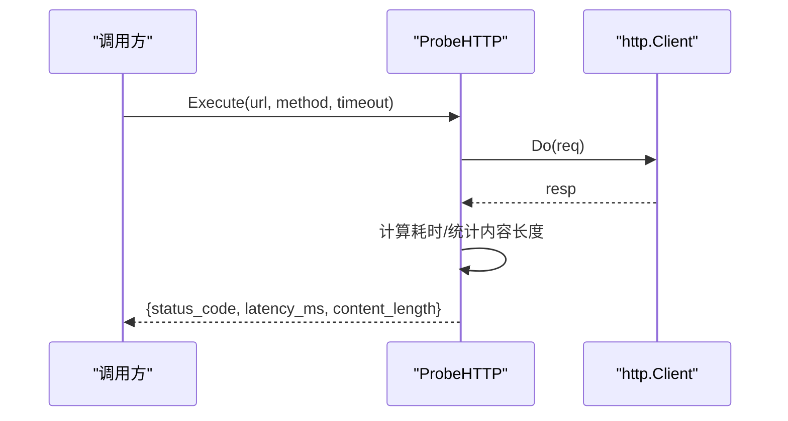

**图示来源**
- [internal/skill/builtin/probe_http.go:23-119](file://internal/skill/builtin/probe_http.go#L23-L119)

**章节来源**
- [internal/skill/builtin/probe_http.go:23-119](file://internal/skill/builtin/probe_http.go#L23-L119)

#### Ping 探测（host_probe_ping）
- 功能：对目标发起短时 ICMP ping，返回是否可达、退出码、耗时与原始输出
- 参数
  - host：必填，字符串
  - count：可选，整数，默认 4，最大 10
  - timeout_ms：可选，整数，默认 3000，最大 10000
- 原理：直接调用系统 ping 命令，不经过 shell；外层基于 context 做整体超时控制
- 输出：{ok, exit_code, duration_ms, stdout, stderr, error?}
- 适用场景：基础连通性检测、丢包率与延迟评估

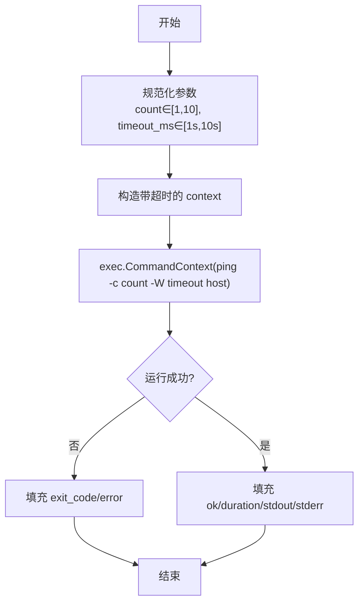

**图示来源**
- [internal/skill/builtin/probe_ping.go:20-124](file://internal/skill/builtin/probe_ping.go#L20-L124)

**章节来源**
- [internal/skill/builtin/probe_ping.go:20-124](file://internal/skill/builtin/probe_ping.go#L20-L124)

#### TCP 连通性探测（host_probe_tcp）
- 功能：对 host:port 发起 TCP 拨号，返回连通性与耗时
- 参数
  - target：必填，字符串，形如 host:port
  - timeout_ms：可选，整数，默认 3000
- 原理：net.Dialer 建立连接后立即关闭，无载荷发送
- 输出：{ok, latency_ms, error?}
- 适用场景：端口可达性检查、服务监听状态确认

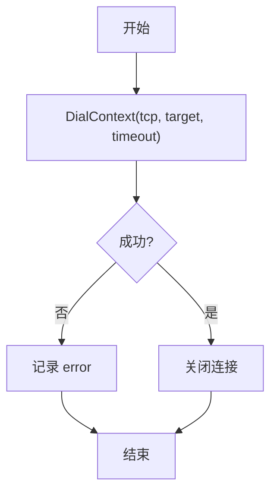

**图示来源**
- [internal/skill/builtin/probe_tcp.go:19-82](file://internal/skill/builtin/probe_tcp.go#L19-L82)

**章节来源**
- [internal/skill/builtin/probe_tcp.go:19-82](file://internal/skill/builtin/probe_tcp.go#L19-L82)

### 文件操作类技能

#### Journald 日志读取（host_read_journal）
- 功能：读取 systemd-journald 最近日志行（Linux 专用）
- 参数
  - unit：可选，systemd unit 名
  - since：可选，回溯时长（journalctl --since 形式），默认 10m
  - lines：可选，最大行数，默认 200
- 原理：调用 journalctl --no-pager --output=short-iso -n ...，非 Linux 返回结构化错误
- 输出：{lines, total_lines, command, error?}
- 性能与安全：固定 30s 超时；只读参数，无破坏性开关

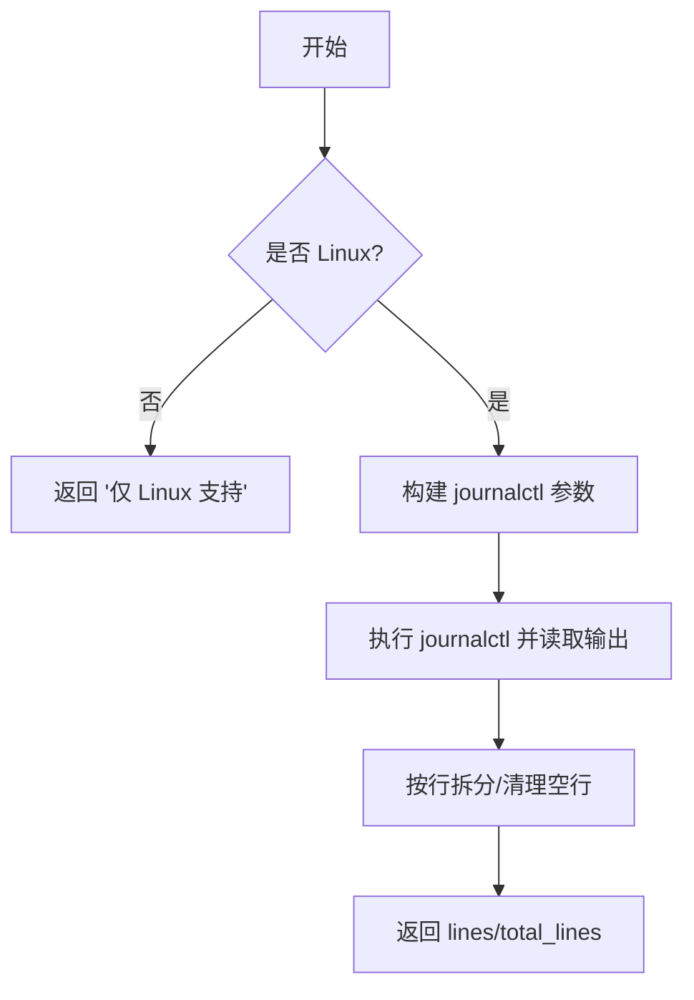

**图示来源**
- [internal/skill/builtin/read_journal.go:23-111](file://internal/skill/builtin/read_journal.go#L23-L111)

**章节来源**
- [internal/skill/builtin/read_journal.go:23-111](file://internal/skill/builtin/read_journal.go#L23-L111)

#### 文件尾部读取（host_tail_file）
- 功能：读取文件最后 N 行（类似 tail -n）
- 参数
  - path：必填，绝对路径，禁止包含 ..
  - lines：可选，返回行数，默认 100
  - max_bytes：可选，最多读取的尾部字节数，默认 1MiB
- 原理：打开文件后 Stat 获取大小；若超过预算则 Seek 至 FileSize-MaxBytes 处读取；截断时丢弃首行不完整行
- 输出：{lines, total_lines_returned, file_size, truncated, error?}
- 安全：强制绝对路径且不含 ..，防止路径穿越

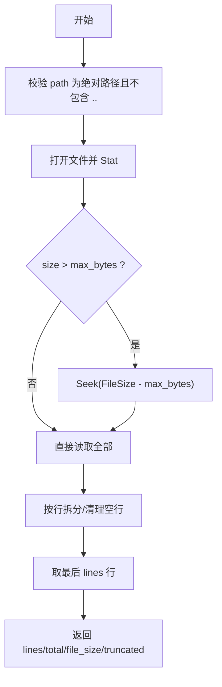

**图示来源**
- [internal/skill/builtin/tail_file.go:23-132](file://internal/skill/builtin/tail_file.go#L23-L132)

**章节来源**
- [internal/skill/builtin/tail_file.go:23-132](file://internal/skill/builtin/tail_file.go#L23-L132)

### 系统检查类技能

#### 网络命名空间探查（host_netns_inspect）
- 功能：列出 /var/run/netns 下的 network namespace，并对每个 ns 报告 IP 地址、路由与可选 link 信息
- 参数
  - namespace：可选，精确匹配单个 ns 名（正则允许 a-zA-Z0-9_.-，最长 64）
  - include_routes：可选，布尔，默认 true
  - include_links：可选，布尔，默认 false
- 原理：调用 ip netns list；对每个 ns 执行 ip -j -n <ns> addr/route/link show，解析 JSON 输出
- 输出：{namespaces:[{name, addrs, routes, links?, error?}], error?}
- 安全：严格校验 namespace 名称，避免注入；仅 read-only

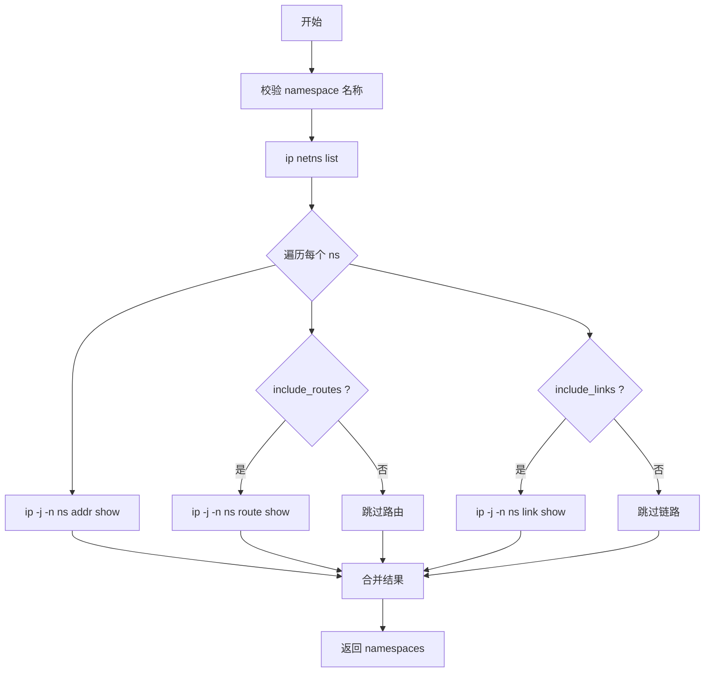

**图示来源**
- [internal/skill/builtin/host_netns_inspect.go:54-205](file://internal/skill/builtin/host_netns_inspect.go#L54-L205)
- [internal/skill/builtin/host_netns_inspect.go:207-328](file://internal/skill/builtin/host_netns_inspect.go#L207-L328)

**章节来源**
- [internal/skill/builtin/host_netns_inspect.go:54-205](file://internal/skill/builtin/host_netns_inspect.go#L54-L205)
- [internal/skill/builtin/host_netns_inspect.go:207-328](file://internal/skill/builtin/host_netns_inspect.go#L207-L328)

#### 抓包任务（capture_pcap / get_packet_capture）
- 功能：在 Linux 边缘节点启动有界抓包任务，并查询任务状态
- 参数（capture_pcap）
  - interface：必填，网卡名
  - filter：可选，过滤语法（tcp/udp/icmp/icmp6/host/port and 组合）
  - duration_seconds：可选，秒，最大 300
  - max_bytes：可选，最大捕获负载字节，最大 268435456
  - max_packets：可选，最大包数，最大 500000
  - snaplen：可选，每包保留的最大字节，最大 65535
  - promiscuous：可选，是否混杂模式，需要 CAP_NET_ADMIN
- 参数（get_packet_capture）
  - capture_id：必填，任务 ID
- 说明：这两个技能在管理器侧仅用于声明与编排，实际执行由边缘代理负责
- 输出：capture 返回 {id, state, created_at}；get 返回 {id, state, result, error?}

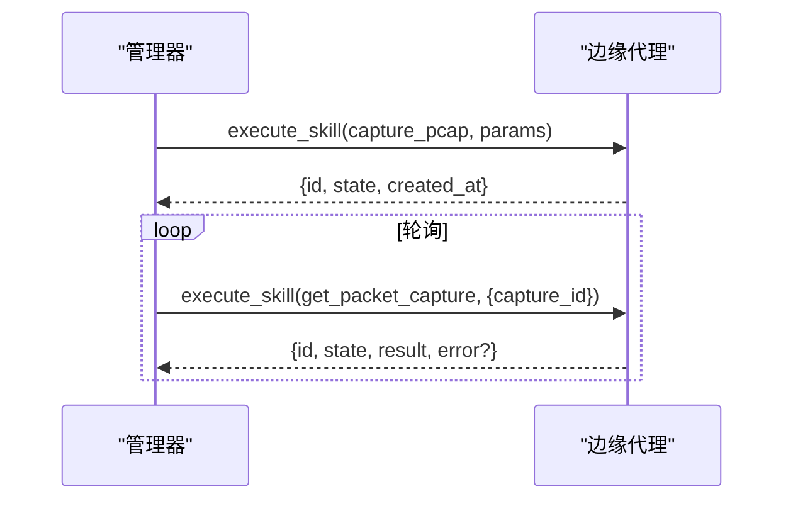

**图示来源**
- [internal/skill/builtin/capture_pcap.go:26-72](file://internal/skill/builtin/capture_pcap.go#L26-L72)

**章节来源**
- [internal/skill/builtin/capture_pcap.go:26-72](file://internal/skill/builtin/capture_pcap.go#L26-L72)

### 联网搜索类技能

#### 联网搜索（web_search）
- 功能：搜索公开互联网，返回标题、URL、摘要与可选答案
- 参数
  - query：必填，自然语言或精确关键词
  - max_results：可选，1~10，默认 5
  - include_domains/exclude_domains：可选，逗号分隔域（Tavily 支持）
  - provider：可选，枚举 searxng/tavily/brave，留空走系统设置
- 原理：根据 provider 选择后端
  - SearXNG：本地/自建实例，无需密钥；不可达时返回 skipped_reason
  - Tavily：需 API Key；支持 answer 字段
  - Brave：需订阅令牌；纯链接结果
- 输出：{provider, results:[{title,url,snippet,published_date}], answer?, skipped_reason?}
- 适用范围：Manager 侧执行（Scope=manager），适合 AI 助手检索知识

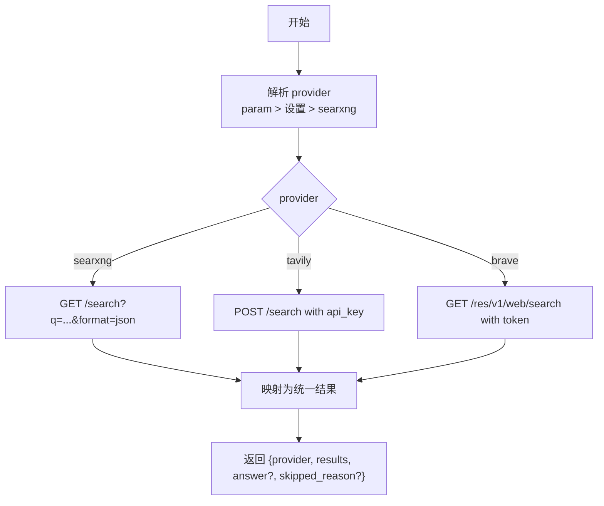

**图示来源**
- [internal/skill/builtin/web_search.go:161-283](file://internal/skill/builtin/web_search.go#L161-L283)
- [internal/skill/builtin/web_search.go:285-543](file://internal/skill/builtin/web_search.go#L285-L543)

**章节来源**
- [internal/skill/builtin/web_search.go:161-283](file://internal/skill/builtin/web_search.go#L161-L283)
- [internal/skill/builtin/web_search.go:285-543](file://internal/skill/builtin/web_search.go#L285-L543)

## 依赖关系分析
- 技能注册与发现
  - 所有内置技能通过 init() 调用 skill.Register，集中注册到全局 Registry
  - Manager/Edge 通过 Registry.Get(key) 获取 Executor，再调用 Execute
- 外部依赖
  - 网络探测依赖系统解析器、TCP 栈、HTTP 客户端
  - Ping/Journal/NetNS 依赖系统命令（ping、journalctl、ip）
  - WebSearch 依赖第三方搜索服务（SearXNG/Tavily/Brave）
- 权限与范围
  - safe/mutating/dangerous 三类权限控制调用策略
  - host/manager 两类执行范围决定调用路径

**图示来源**
- [internal/skill/builtin/doc.go:19-25](file://internal/skill/builtin/doc.go#L19-L25)
- [internal/skill/registry.go:10-47](file://internal/skill/registry.go#L10-L47)
- [internal/skill/types.go:190-203](file://internal/skill/types.go#L190-L203)

**章节来源**
- [internal/skill/builtin/doc.go:19-25](file://internal/skill/builtin/doc.go#L19-L25)
- [internal/skill/registry.go:10-47](file://internal/skill/registry.go#L10-L47)
- [internal/skill/types.go:190-203](file://internal/skill/types.go#L190-L203)

## 性能考量
- 超时与资源上限
  - DNS/HTTP/TCP/Ping 均使用 context 或 client.Timeout 控制耗时
  - TailFile 通过 max_bytes 限制内存占用，避免大文件导致 OOM
  - ReadJournal 固定 30s 超时，防止长时间阻塞
  - CapturePCAP 限制 duration/max_bytes/max_packets/snaplen，避免磁盘与 CPU 压力
- I/O 与并发
  - HTTP GET 会读取并丢弃响应体，确保不会累积内存
  - NetNS 探查对每个 ns 顺序执行子命令，可通过 include_links=false 减少数据量
- 平台差异
  - ReadJournal 与 NetNS 仅 Linux 可用；跨平台调用将返回结构化错误
- 外部依赖
  - WebSearch 的 SearXNG 不可达时返回 skipped_reason，便于上层提示而非中断流程

[本节为通用指导，不直接分析具体文件]

## 故障排查指南
- 常见错误与定位
  - DNS 解析失败：检查 host 是否正确、DNS 服务器可达性、timeout_ms 是否过小
  - HTTP 探测失败：确认 URL 与方法、TLS 自签环境、超时与网络可达
  - Ping 失败：检查防火墙/ACL、ICMP 是否被拦截、count/timeout 是否合理
  - TCP 探测失败：确认目标 host:port、端口监听、安全组/防火墙规则
  - Journal 读取失败：确认 Linux 环境、journalctl 可用、unit 名正确
  - TailFile 失败：确认路径为绝对路径且不包含 ..、文件可读
  - NetNS 探查失败：确认 iproute2 安装、/var/run/netns 存在、权限足够
  - WebSearch 失败：SearXNG 未启动时查看 skipped_reason；Tavily/Brave 检查 API Key 与配额
- 调试建议
  - 优先使用最小参数集复现问题（例如 Ping 的 count=1）
  - 关注返回中的 error 字段与耗时指标（latency_ms/duration_ms）
  - 对于 WebSearch，先尝试默认 SearXNG，再切换其他 provider 对比
  - 对于 CapturePCAP，逐步放宽 filter 与 snaplen，定位带宽与存储瓶颈

**章节来源**
- [internal/skill/builtin/probe_dns.go:55-84](file://internal/skill/builtin/probe_dns.go#L55-L84)
- [internal/skill/builtin/probe_http.go:65-119](file://internal/skill/builtin/probe_http.go#L65-L119)
- [internal/skill/builtin/probe_ping.go:60-124](file://internal/skill/builtin/probe_ping.go#L60-L124)
- [internal/skill/builtin/probe_tcp.go:55-82](file://internal/skill/builtin/probe_tcp.go#L55-L82)
- [internal/skill/builtin/read_journal.go:65-111](file://internal/skill/builtin/read_journal.go#L65-L111)
- [internal/skill/builtin/tail_file.go:64-132](file://internal/skill/builtin/tail_file.go#L64-L132)
- [internal/skill/builtin/host_netns_inspect.go:136-205](file://internal/skill/builtin/host_netns_inspect.go#L136-L205)
- [internal/skill/builtin/web_search.go:228-283](file://internal/skill/builtin/web_search.go#L228-L283)

## 结论
Ongrid 的内置技能以统一的元数据与执行契约组织，既保证了可扩展性，又提供了稳定的调用体验。网络探测、文件操作、系统检查与联网搜索四类技能覆盖了日常运维与排障的主要场景。通过合理的参数配置、超时控制与权限分级，可在保障安全的前提下高效完成任务。结合组合使用模式（如“Ping+TCP+HTTP”、“TailFile+WebSearch”、“CapturePCAP+NetNS 探查”），可以构建更强大的自动化诊断工作流。

[本节为总结性内容，不直接分析具体文件]

## 附录

### 参数验证规则速查
- 键名：lower_snake，仅 a-z、0-9、_
- 参数类型：string/int/float/bool/duration/enum/array（array 需指定 ItemType）
- Required 与 Default 互斥
- 各技能内部还会进行语义校验（如路径必须绝对、不包含 ..；count/timeout 上下界；provider 枚举等）

**章节来源**
- [internal/skill/types.go:127-175](file://internal/skill/types.go#L127-L175)
- [internal/skill/builtin/tail_file.go:71-85](file://internal/skill/builtin/tail_file.go#L71-L85)
- [internal/skill/builtin/probe_ping.go:101-124](file://internal/skill/builtin/probe_ping.go#L101-L124)
- [internal/skill/builtin/web_search.go:246-283](file://internal/skill/builtin/web_search.go#L246-L283)

### 组合使用模式与最佳实践
- 网络连通性三步曲：Ping（层三）→ TCP（层四）→ HTTP（层七），逐层定位问题
- 日志与搜索联动：TailFile 抓取最近异常日志片段，配合 WebSearch 检索已知问题与解决方案
- 抓包与命名空间：CapturePCAP 限定时间与流量上限，结合 NetNS 探查定位容器/命名空间网络问题
- 安全与性能：始终设置超时与上限；谨慎使用 promiscuous；优先只读技能；危险操作需审批

[本节为概念性指导，不直接分析具体文件]