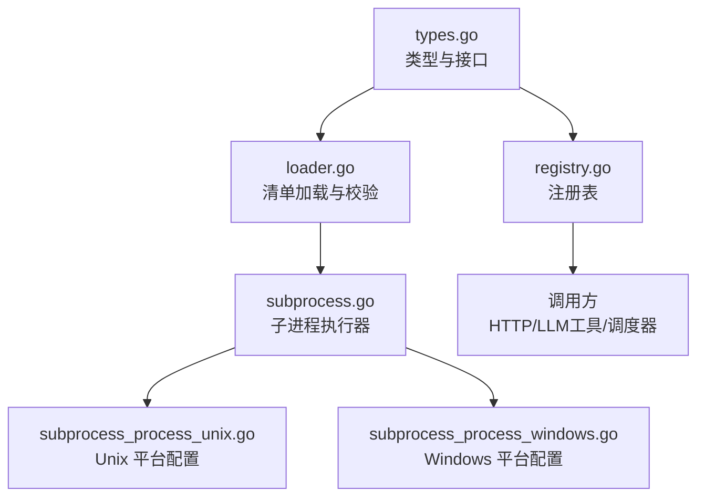
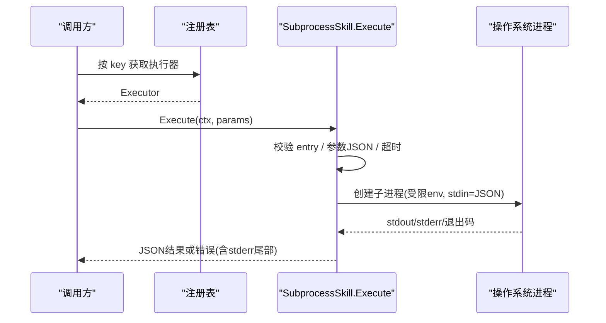
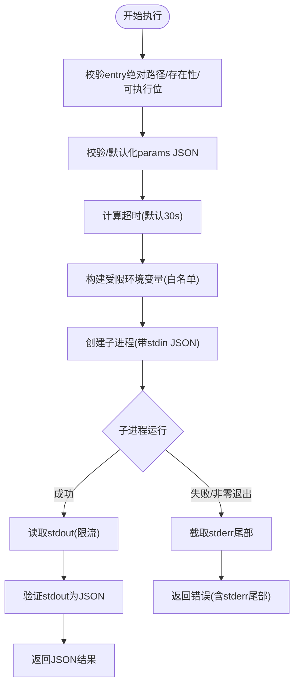
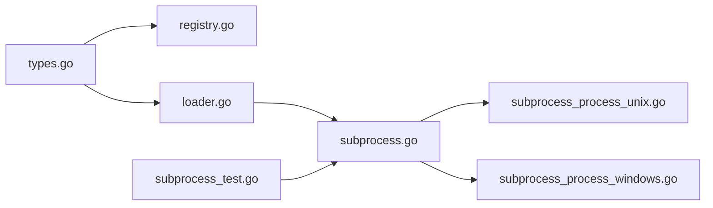

# 技能执行环境

<cite>
**本文引用的文件**
- [subprocess.go](file://internal/skill/subprocess.go)
- [subprocess_process_unix.go](file://internal/skill/subprocess_process_unix.go)
- [subprocess_process_windows.go](file://internal/skill/subprocess_process_windows.go)
- [loader.go](file://internal/skill/loader.go)
- [types.go](file://internal/skill/types.go)
- [registry.go](file://internal/skill/registry.go)
- [subprocess_test.go](file://internal/skill/subprocess_test.go)
</cite>

## 目录
1. [简介](#简介)
2. [项目结构](#项目结构)
3. [核心组件](#核心组件)
4. [架构总览](#架构总览)
5. [详细组件分析](#详细组件分析)
6. [依赖关系分析](#依赖关系分析)
7. [性能与资源限制](#性能与资源限制)
8. [故障恢复与错误处理](#故障恢复与错误处理)
9. [结论](#结论)
10. [附录](#附录)

## 简介
本技术文档聚焦于“技能执行环境”的实现，围绕子进程隔离、执行超时管理、文件系统访问控制、环境变量继承机制、跨平台兼容性以及性能监控与资源使用统计进行系统化说明。该实现通过外部可执行程序（子进程）承载技能逻辑，以 JSON 在 stdin/stdout 间传递参数与结果，并在管理器侧提供安全沙箱化的加载与执行能力。

## 项目结构
技能执行环境位于 internal/skill 包中，核心由以下模块组成：
- 类型与元数据：定义权限等级、作用域、参数结构与执行器接口
- 注册表：进程内技能注册与查询
- 加载器：扫描并解析外部技能清单，构建受控的子进程执行器
- 子进程执行器：创建、运行、限制与清理子进程，处理超时、输出裁剪与环境变量白名单
- 平台适配：Unix 与 Windows 的差异化进程组与信号处理

图表来源
- [types.go:1-241](file://internal/skill/types.go#L1-L241)
- [registry.go:1-127](file://internal/skill/registry.go#L1-L127)
- [loader.go:1-274](file://internal/skill/loader.go#L1-L274)
- [subprocess.go:1-268](file://internal/skill/subprocess.go#L1-L268)
- [subprocess_process_unix.go:1-27](file://internal/skill/subprocess_process_unix.go#L1-L27)
- [subprocess_process_windows.go:1-8](file://internal/skill/subprocess_process_windows.go#L1-L8)

章节来源
- [types.go:1-241](file://internal/skill/types.go#L1-L241)
- [registry.go:1-127](file://internal/skill/registry.go#L1-L127)
- [loader.go:1-274](file://internal/skill/loader.go#L1-L274)
- [subprocess.go:1-268](file://internal/skill/subprocess.go#L1-L268)
- [subprocess_process_unix.go:1-27](file://internal/skill/subprocess_process_unix.go#L1-L27)
- [subprocess_process_windows.go:1-8](file://internal/skill/subprocess_process_windows.go#L1-L8)

## 核心组件
- 执行器接口与元数据：统一描述技能的名称、描述、权限等级、作用域、参数 schema 等，供上层自动装配 LLM 工具、UI 表单与审计日志
- 注册表：线程安全的进程级技能目录，支持按 key 查找、按权限过滤、全量枚举
- 加载器：从配置的允许目录递归扫描 skill.json，解析并构建 SubprocessSkill；强制 entry 路径位于允许根目录下，解析符号链接后做前缀校验
- 子进程执行器：负责创建子进程、注入受限环境变量、限制 stdout/stderr 大小、设置超时、捕获退出码与错误信息，并将 stdout 作为 JSON 结果返回

章节来源
- [types.go:35-224](file://internal/skill/types.go#L35-L224)
- [registry.go:10-127](file://internal/skill/registry.go#L10-L127)
- [loader.go:13-274](file://internal/skill/loader.go#L13-L274)
- [subprocess.go:17-172](file://internal/skill/subprocess.go#L17-L172)

## 架构总览
技能执行采用“清单驱动 + 子进程隔离”的模式：
- 管理员将外部技能打包为 skill.json + 可执行入口，放置于允许的目录树
- 启动时加载器扫描并校验清单，构建 SubprocessSkill 并注册到全局注册表
- 运行时，调度器根据技能 key 找到执行器，传入参数 JSON 到子进程 stdin，读取 stdout 作为结果
- 子进程在独立进程组中运行，具备超时控制、输出裁剪与环境变量白名单保护

图表来源
- [registry.go:31-82](file://internal/skill/registry.go#L31-L82)
- [subprocess.go:112-172](file://internal/skill/subprocess.go#L112-L172)
- [subprocess.go:207-238](file://internal/skill/subprocess.go#L207-L238)

## 详细组件分析

### 子进程隔离机制
- 进程创建：使用 exec.CommandContext 创建子进程，并通过 WaitDelay 确保上下文取消后的优雅终止尝试
- 进程组隔离（Unix）：设置进程组 ID，取消时将 SIGKILL 发送至整个进程组，避免僵尸子进程残留
- 资源限制：stdout 最大 16 MiB，stderr 仅保留尾部 4 KiB 用于诊断；内部使用 cappedWriter 截断写入，防止恶意输出耗尽内存
- 权限与范围：子进程技能始终在 ScopeManager 下运行，无法伪装为设备端执行，降低边缘侧风险

图表来源
- [subprocess.go:112-172](file://internal/skill/subprocess.go#L112-L172)
- [subprocess.go:207-238](file://internal/skill/subprocess.go#L207-L238)
- [subprocess_process_unix.go:12-26](file://internal/skill/subprocess_process_unix.go#L12-L26)

章节来源
- [subprocess.go:17-172](file://internal/skill/subprocess.go#L17-L172)
- [subprocess_process_unix.go:1-27](file://internal/skill/subprocess_process_unix.go#L1-L27)
- [subprocess_process_windows.go:1-8](file://internal/skill/subprocess_process_windows.go#L1-L8)

### 执行超时管理
- 默认超时：未显式设置时采用 30 秒默认值
- 可配置超时：清单中的 timeout_seconds 字段覆盖默认值
- 优雅终止：父进程 context 超时时触发取消，Unix 下向进程组发送 SIGKILL，Windows 走系统默认终止流程；WaitDelay 设置为 1 秒以给子进程收尾时间
- 超时语义：超时错误包装 context.DeadlineExceeded，便于上层识别与重试策略

章节来源
- [subprocess.go:26-28](file://internal/skill/subprocess.go#L26-L28)
- [subprocess.go:145-160](file://internal/skill/subprocess.go#L145-L160)
- [subprocess.go:213-238](file://internal/skill/subprocess.go#L213-L238)
- [subprocess_process_unix.go:12-26](file://internal/skill/subprocess_process_unix.go#L12-L26)
- [subprocess_process_windows.go:7-8](file://internal/skill/subprocess_process_windows.go#L7-L8)

### 文件系统访问控制
- 清单入口白名单：加载器要求 entry 必须位于配置的 ExternalDirs 之下；相对路径基于清单所在目录解析，随后进行绝对路径规范化与符号链接解析，再与前缀匹配，拒绝逃逸
- 执行期校验：Execute 会 stat entry，拒绝目录、不存在或非可执行文件；不在此处再次解析符号链接，交由加载期保证安全性
- 权限验证：仅检查可执行位，具体文件访问权限由操作系统与部署策略保障

章节来源
- [loader.go:176-254](file://internal/skill/loader.go#L176-L254)
- [subprocess.go:116-135](file://internal/skill/subprocess.go#L116-L135)

### 环境变量继承机制
- 默认拒绝：子进程不继承父进程完整环境，需显式声明允许列表
- 白名单注入：EnvAllow 指定要透传的环境变量名；若未设置则子进程无环境变量（包括 PATH），除非显式加入
- 敏感信息过滤：仅白名单内的变量会被注入，避免密钥泄露
- 测试覆盖：用例验证了白名单透传与无关变量被过滤的行为

章节来源
- [subprocess.go:64-73](file://internal/skill/subprocess.go#L64-L73)
- [subprocess.go:174-193](file://internal/skill/subprocess.go#L174-L193)
- [subprocess_test.go:142-170](file://internal/skill/subprocess_test.go#L142-L170)

### 跨平台兼容性
- Unix：启用进程组隔离，取消时向负 PID 发送 SIGKILL，确保子进程树被彻底终止；忽略进程已退出的错误
- Windows：无进程组概念，configureSubprocessCommand 为空实现，依赖系统默认终止行为
- 测试跳过：部分测试在 Windows 上跳过，因为依赖 POSIX shell 特性

章节来源
- [subprocess_process_unix.go:1-27](file://internal/skill/subprocess_process_unix.go#L1-L27)
- [subprocess_process_windows.go:1-8](file://internal/skill/subprocess_process_windows.go#L1-L8)
- [subprocess_test.go:14-27](file://internal/skill/subprocess_test.go#L14-L27)

### 性能监控与资源使用统计
- 输出限流：stdout 上限 16 MiB，stderr 仅保留尾部 4 KiB，避免异常输出导致内存膨胀
- 超时保护：默认 30 秒，防止长时间占用 CPU/IO
- 可观测性建议：可在调用层增加指标（如执行耗时、退出码分布、stderr 长度、超时率），以便监控与告警

章节来源
- [subprocess.go:17-24](file://internal/skill/subprocess.go#L17-L24)
- [subprocess.go:145-160](file://internal/skill/subprocess.go#L145-L160)

## 依赖关系分析
- types.go 定义了 Executor 接口与 Metadata，是所有技能的基础契约
- registry.go 提供线程安全的注册与查询，支持按权限过滤
- loader.go 依赖 types.go 与 subprocess.go，负责清单解析与安全约束
- subprocess.go 依赖平台适配文件，完成实际的进程创建与控制
- 测试文件覆盖关键路径：正常执行、参数透传、非零退出、相对路径拒绝、缺失二进制、超时、环境变量白名单、非 JSON 输出、作用域强制

图表来源
- [types.go:1-241](file://internal/skill/types.go#L1-L241)
- [registry.go:1-127](file://internal/skill/registry.go#L1-L127)
- [loader.go:1-274](file://internal/skill/loader.go#L1-L274)
- [subprocess.go:1-268](file://internal/skill/subprocess.go#L1-L268)
- [subprocess_process_unix.go:1-27](file://internal/skill/subprocess_process_unix.go#L1-L27)
- [subprocess_process_windows.go:1-8](file://internal/skill/subprocess_process_windows.go#L1-L8)
- [subprocess_test.go:1-200](file://internal/skill/subprocess_test.go#L1-L200)

章节来源
- [types.go:1-241](file://internal/skill/types.go#L1-L241)
- [registry.go:1-127](file://internal/skill/registry.go#L1-L127)
- [loader.go:1-274](file://internal/skill/loader.go#L1-L274)
- [subprocess.go:1-268](file://internal/skill/subprocess.go#L1-L268)
- [subprocess_test.go:1-200](file://internal/skill/subprocess_test.go#L1-L200)

## 性能与资源限制
- 内存保护：通过 cappedWriter 限制 stdout/stderr 写入，避免恶意或异常输出导致 OOM
- CPU/IO 保护：通过超时与进程组终止，限制长时间运行的任务对系统资源的占用
- 可扩展性：子进程模型天然隔离，适合并发执行多个技能；建议在调用层引入队列与并发度控制

[本节为通用指导，不直接分析具体文件]

## 故障恢复与错误处理
- 参数与路径校验：空 entry、非绝对路径、非可执行、目录型 entry 均返回错误，快速失败
- 子进程错误：非零退出码会返回错误，并附带 stderr 尾部片段，便于定位问题
- 超时处理：context 超时会返回明确超时错误，便于上层重试或降级
- 健壮性：加载器在遍历目录时对单个清单解析失败进行记录并跳过，不影响整体启动；注册阶段 panic 被 recover 包裹，避免崩溃
- 平台差异：Unix 下进程组终止更彻底；Windows 下遵循系统默认终止行为

章节来源
- [subprocess.go:112-172](file://internal/skill/subprocess.go#L112-L172)
- [loader.go:115-161](file://internal/skill/loader.go#L115-L161)
- [subprocess_process_unix.go:12-26](file://internal/skill/subprocess_process_unix.go#L12-L26)
- [subprocess_process_windows.go:7-8](file://internal/skill/subprocess_process_windows.go#L7-L8)

## 结论
该技能执行环境通过“清单驱动 + 子进程隔离”的方式，提供了安全可控的外部命令执行能力。其核心优势包括：
- 严格的路径白名单与符号链接解析，防止任意二进制执行
- 默认拒绝的环境变量继承与白名单注入，最小化敏感信息泄露风险
- 明确的超时与输出限制，保障系统稳定性与资源安全
- 跨平台兼容的进程组与终止策略，提升可靠性
- 完善的错误分类与诊断信息，便于运维排障

在生产环境中，建议结合调用层的指标采集与告警策略，持续优化超时阈值与并发度，确保在高负载下的稳定运行。

[本节为总结性内容，不直接分析具体文件]

## 附录
- 典型使用流程
  - 编写 skill.json 与可执行入口，放入允许目录
  - 启动服务，加载器扫描并注册技能
  - 通过 HTTP 或 LLM 工具调用技能，传入参数 JSON
  - 监控执行结果与错误，必要时调整超时与白名单

- 最佳实践
  - 为每个技能设置合理的 timeout_seconds
  - 仅在 EnvAllow 中声明必需的环境变量
  - 保持 entry 为绝对路径且位于允许目录内
  - 在调用层收集执行耗时、退出码、stderr 长度等指标

[本节为补充信息，不直接分析具体文件]