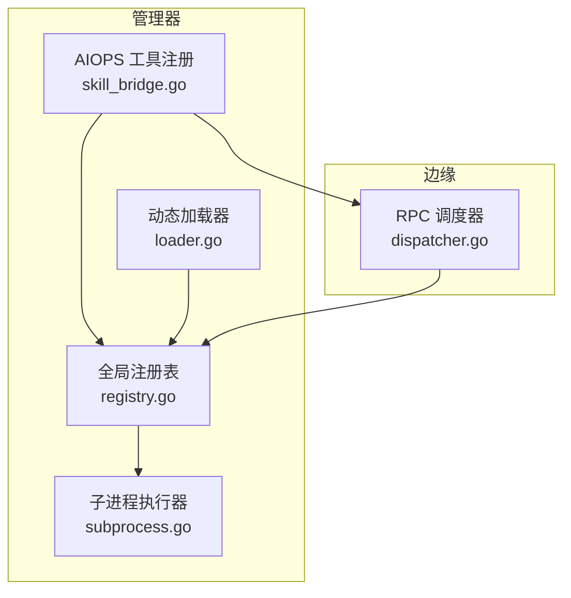
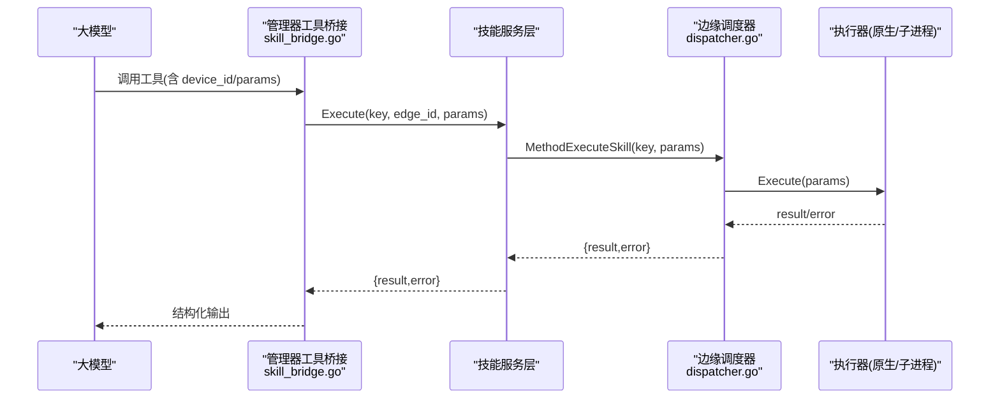
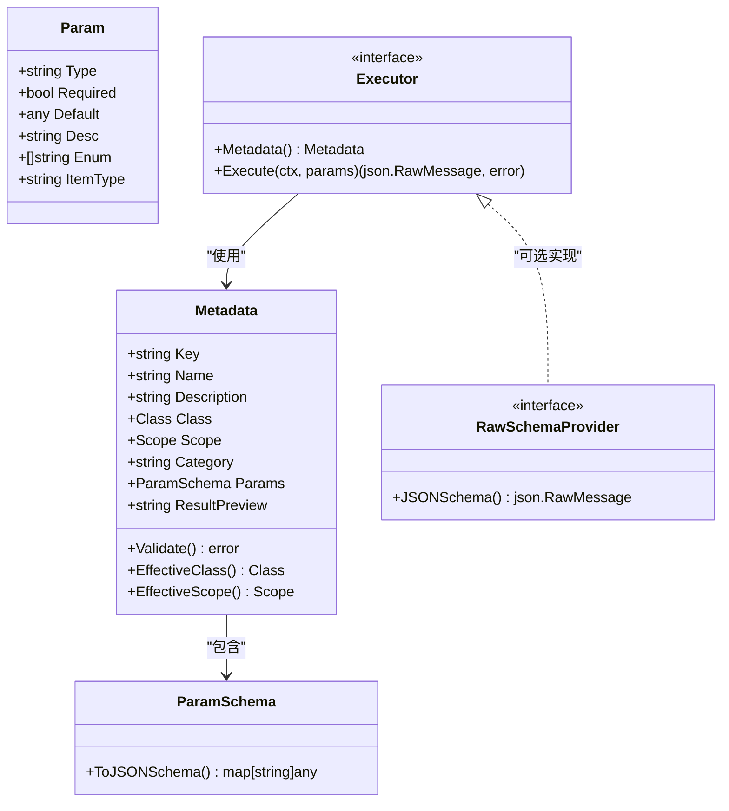
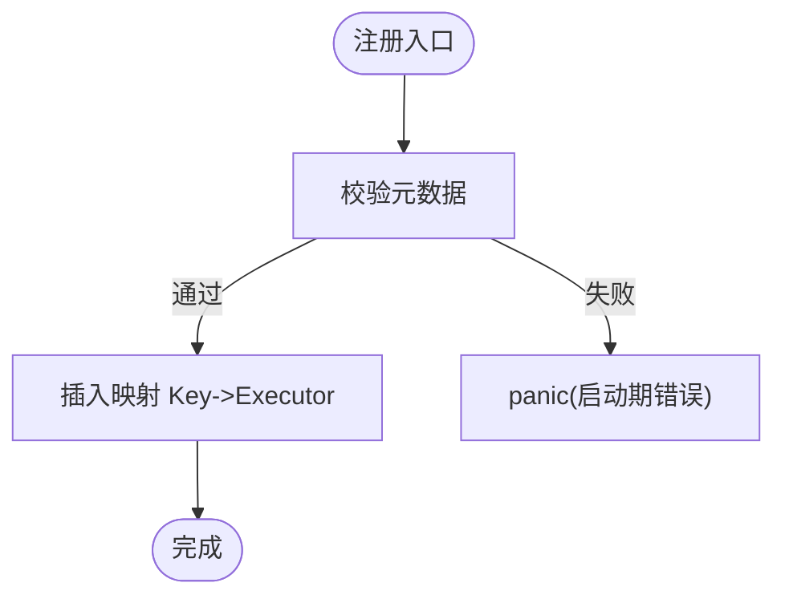
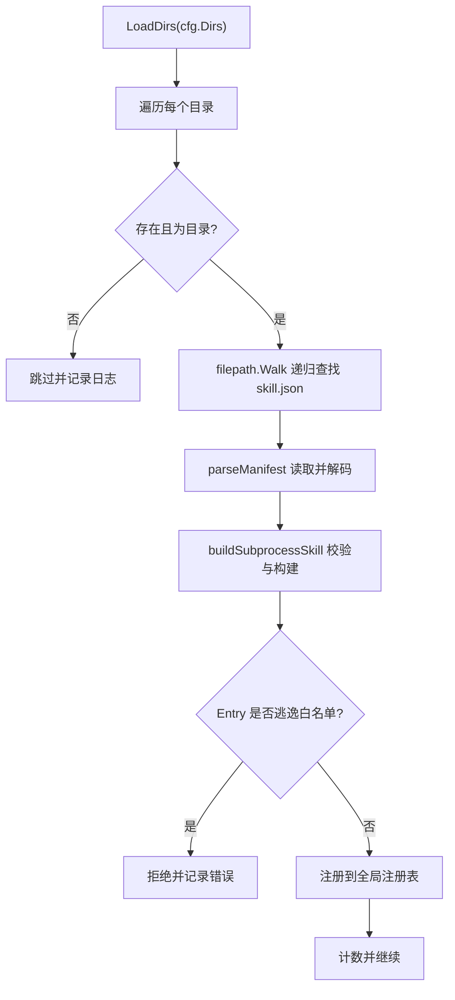
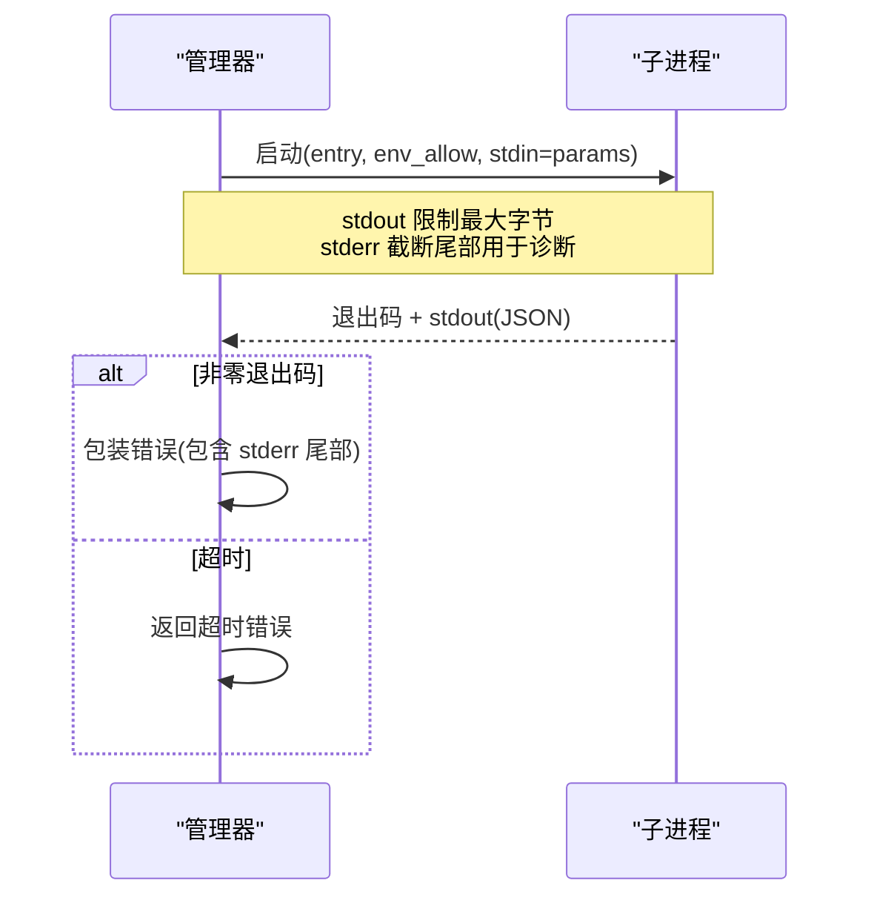
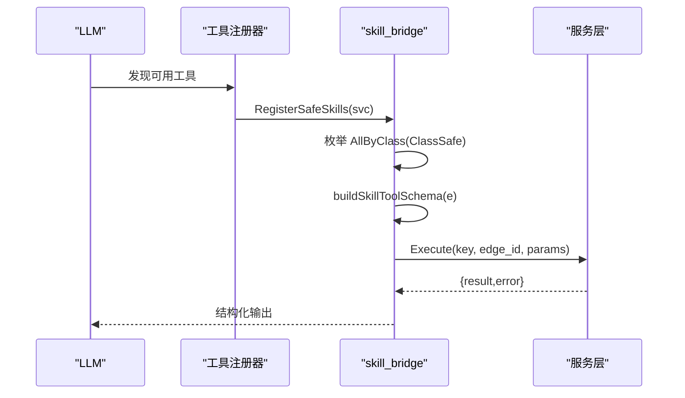
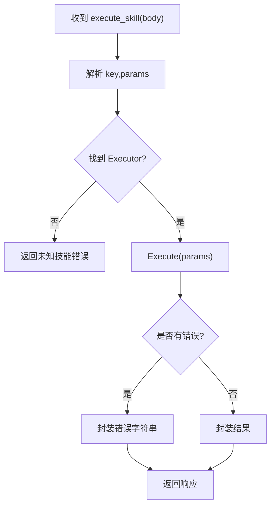
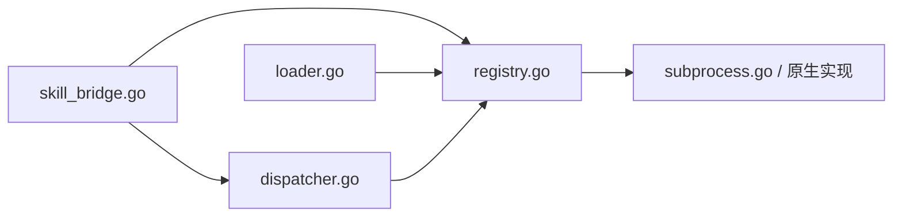

# 技能架构设计

<cite>
**本文引用的文件**
- [internal/skill/types.go](file://internal/skill/types.go)
- [internal/skill/registry.go](file://internal/skill/registry.go)
- [internal/skill/loader.go](file://internal/skill/loader.go)
- [internal/skill/schema.go](file://internal/skill/schema.go)
- [internal/skill/subprocess.go](file://internal/skill/subprocess.go)
- [internal/skill/subprocess_process_unix.go](file://internal/skill/subprocess_process_unix.go)
- [internal/skill/subprocess_process_windows.go](file://internal/skill/subprocess_process_windows.go)
- [internal/manager/biz/aiops/tools/skill_bridge.go](file://internal/manager/biz/aiops/tools/skill_bridge.go)
- [internal/edgeagent/skill/dispatcher.go](file://internal/edgeagent/skill/dispatcher.go)
</cite>

## 目录
1. [简介](#简介)
2. [项目结构](#项目结构)
3. [核心组件](#核心组件)
4. [架构总览](#架构总览)
5. [详细组件分析](#详细组件分析)
6. [依赖关系分析](#依赖关系分析)
7. [性能与资源控制](#性能与资源控制)
8. [故障排查指南](#故障排查指南)
9. [结论](#结论)
10. [附录](#附录)

## 简介
本文件系统化阐述 Ongrid 技能系统的整体架构与设计理念，覆盖以下关键主题：
- 技能注册表机制与并发安全
- 动态加载流程（外部子进程技能包）
- 执行环境隔离（管理器侧 vs 边缘侧）
- 技能清单 SkillManifest 字段语义与校验
- 参数 Schema 生成与 LLM 工具集成
- 技能分类体系与安全级别控制（safe、mutating、dangerous）
- 目录扫描算法、路径白名单验证与符号链接安全检查
- 架构图与交互流程图，帮助开发者快速理解系统

## 项目结构
技能系统由“核心定义 + 注册表 + 动态加载 + 执行器 + 管理器桥接 + 边缘调度”构成。核心类型与接口集中在 internal/skill 下；管理器侧通过 AIOPS 工具桥接将 safe 技能暴露为 LLM 可调用的工具；边缘侧通过统一的 execute_skill RPC 进行分发执行。

**图表来源**
- [internal/manager/biz/aiops/tools/skill_bridge.go:51-75](file://internal/manager/biz/aiops/tools/skill_bridge.go#L51-L75)
- [internal/skill/registry.go:17-47](file://internal/skill/registry.go#L17-L47)
- [internal/skill/loader.go:69-160](file://internal/skill/loader.go#L69-L160)
- [internal/skill/subprocess.go:30-78](file://internal/skill/subprocess.go#L30-L78)
- [internal/edgeagent/skill/dispatcher.go:24-44](file://internal/edgeagent/skill/dispatcher.go#L24-L44)

**章节来源**
- [internal/skill/registry.go:17-47](file://internal/skill/registry.go#L17-L47)
- [internal/skill/loader.go:69-160](file://internal/skill/loader.go#L69-L160)
- [internal/manager/biz/aiops/tools/skill_bridge.go:51-75](file://internal/manager/biz/aiops/tools/skill_bridge.go#L51-L75)
- [internal/edgeagent/skill/dispatcher.go:24-44](file://internal/edgeagent/skill/dispatcher.go#L24-L44)

## 核心组件
- 元数据与类型定义：描述技能的名称、描述、分类、作用域、参数 Schema、结果预览等，并提供校验逻辑。
- 注册表：进程级技能目录，提供注册、查询、按分类枚举能力，保证并发安全。
- 动态加载器：扫描配置目录下的 skill.json，解析并构建 SubprocessSkill，完成路径白名单与符号链接安全检查后注册。
- 执行器接口：统一抽象 Executor，支持原生 Go 实现与子进程实现。
- 管理器桥接：将 safe 技能自动注册为 LLM 工具，并按作用域注入设备标识与参数 Schema。
- 边缘调度器：接收 execute_skill RPC，按 key 查找执行器并调用 Execute，返回结构化结果或错误。

**章节来源**
- [internal/skill/types.go:99-175](file://internal/skill/types.go#L99-L175)
- [internal/skill/registry.go:21-54](file://internal/skill/registry.go#L21-L54)
- [internal/skill/loader.go:13-53](file://internal/skill/loader.go#L13-L53)
- [internal/skill/subprocess.go:30-78](file://internal/skill/subprocess.go#L30-L78)
- [internal/manager/biz/aiops/tools/skill_bridge.go:51-75](file://internal/manager/biz/aiops/tools/skill_bridge.go#L51-L75)
- [internal/edgeagent/skill/dispatcher.go:24-44](file://internal/edgeagent/skill/dispatcher.go#L24-L44)

## 架构总览
下图展示从管理器到边缘的完整调用链：管理器将 safe 技能注册为 LLM 工具，LLM 调用时经桥接层构造参数并调用服务层，最终通过隧道 RPC 在边缘侧调度执行；子进程技能在管理器侧以受限环境运行。

**图表来源**
- [internal/manager/biz/aiops/tools/skill_bridge.go:151-234](file://internal/manager/biz/aiops/tools/skill_bridge.go#L151-L234)
- [internal/edgeagent/skill/dispatcher.go:24-44](file://internal/edgeagent/skill/dispatcher.go#L24-L44)

## 详细组件分析

### 元数据与参数 Schema
- Metadata：包含 Key、Name、Description、Class、Scope、Category、Params、ResultPreview。Validate 对 Key 格式、必填字段、Class/Scope 取值、Param 类型与数组 ItemType 等进行严格校验。
- ParamSchema：声明式参数列表，转换为 OpenAI function-calling 所需的 JSON Schema；支持 string/int/float/bool/duration/enum/array 及默认值与必填项。
- RawSchemaProvider：允许执行器直接提供原始 JSON Schema，用于复杂形状（数组、嵌套对象、oneOf 等）。

**图表来源**
- [internal/skill/types.go:99-175](file://internal/skill/types.go#L99-L175)
- [internal/skill/schema.go:5-20](file://internal/skill/schema.go#L5-L20)

**章节来源**
- [internal/skill/types.go:99-175](file://internal/skill/types.go#L99-L175)
- [internal/skill/schema.go:22-96](file://internal/skill/schema.go#L22-L96)

### 注册表机制
- 全局 Registry：维护 Key -> Executor 映射，提供 Register、Get、All、AllByClass。
- 并发安全：注册阶段单线程，运行时读多写少，使用 RWMutex 保护。
- 重复键与无效元数据：Register 会 panic，确保作者错误在启动期暴露。
- 按分类过滤：AllByClass 仅返回指定 Class 的技能，便于管理器只暴露 safe 给 LLM。

**图表来源**
- [internal/skill/registry.go:59-74](file://internal/skill/registry.go#L59-L74)

**章节来源**
- [internal/skill/registry.go:17-54](file://internal/skill/registry.go#L17-L54)
- [internal/skill/registry.go:59-74](file://internal/skill/registry.go#L59-L74)

### 动态加载流程（外部子进程技能包）
- SkillManifest：name、description、schema、entry、env_allow、timeout_seconds、class、category。
- LoadDirs：遍历配置的白名单目录，递归查找 skill.json，解析并构建 SubprocessSkill，去重后注册。
- 路径白名单与符号链接检查：Entry 解析为绝对路径后，EvalSymlinks 展开符号链接，确保最终目标位于 allowlist 根目录下，防止逃逸。
- 环境变量白名单：子进程默认无继承环境，仅转发 env_allow 中显式允许的变量名。

**图表来源**
- [internal/skill/loader.go:69-160](file://internal/skill/loader.go#L69-L160)
- [internal/skill/loader.go:176-253](file://internal/skill/loader.go#L176-L253)

**章节来源**
- [internal/skill/loader.go:13-53](file://internal/skill/loader.go#L13-L53)
- [internal/skill/loader.go:69-160](file://internal/skill/loader.go#L69-L160)
- [internal/skill/loader.go:176-253](file://internal/skill/loader.go#L176-L253)

### 执行环境隔离
- 作用域 Scope：
  - ScopeHost：在边缘侧执行，需要设备标识（device_id），管理器桥接层负责解析并注入。
  - ScopeManager：在管理器进程内执行，适合访问公网或运行子进程技能包。
- 子进程隔离：
  - 子进程默认不继承任何环境变量，仅转发 env_allow 白名单中的变量。
  - 标准输出限制最大字节数，避免恶意二进制耗尽内存。
  - 超时控制：未设置则使用默认超时。
  - Unix 平台：设置进程组并在取消时发送信号终止整个进程组，确保彻底清理。

**图表来源**
- [internal/skill/subprocess.go:30-78](file://internal/skill/subprocess.go#L30-L78)
- [internal/skill/subprocess.go:112-172](file://internal/skill/subprocess.go#L112-L172)
- [internal/skill/subprocess.go:174-193](file://internal/skill/subprocess.go#L174-L193)
- [internal/skill/subprocess.go:207-238](file://internal/skill/subprocess.go#L207-L238)
- [internal/skill/subprocess_process_unix.go:12-25](file://internal/skill/subprocess_process_unix.go#L12-L25)

**章节来源**
- [internal/skill/types.go:47-61](file://internal/skill/types.go#L47-L61)
- [internal/skill/subprocess.go:17-28](file://internal/skill/subprocess.go#L17-L28)
- [internal/skill/subprocess.go:112-172](file://internal/skill/subprocess.go#L112-L172)
- [internal/skill/subprocess_process_unix.go:12-25](file://internal/skill/subprocess_process_unix.go#L12-L25)

### 管理器工具桥接（LLM 集成）
- 自动注册：枚举所有 ClassSafe 技能，将其注册为 LLM 工具，工具名=Key，描述=Description+ResultPreview。
- Schema 构建：优先使用 SubprocessSkill 自带的 raw schema；否则基于 ParamSchema 转换；对 ScopeHost 注入 device_id 为必填整数。
- 执行封装：解析 envelope，提取 device_id/edge_id（兼容旧字段），解析为 host edge_id，调用服务层执行，返回 {result,error} 的结构化响应。

**图表来源**
- [internal/manager/biz/aiops/tools/skill_bridge.go:51-75](file://internal/manager/biz/aiops/tools/skill_bridge.go#L51-L75)
- [internal/manager/biz/aiops/tools/skill_bridge.go:77-144](file://internal/manager/biz/aiops/tools/skill_bridge.go#L77-L144)
- [internal/manager/biz/aiops/tools/skill_bridge.go:151-234](file://internal/manager/biz/aiops/tools/skill_bridge.go#L151-L234)

**章节来源**
- [internal/manager/biz/aiops/tools/skill_bridge.go:51-75](file://internal/manager/biz/aiops/tools/skill_bridge.go#L51-L75)
- [internal/manager/biz/aiops/tools/skill_bridge.go:77-144](file://internal/manager/biz/aiops/tools/skill_bridge.go#L77-L144)
- [internal/manager/biz/aiops/tools/skill_bridge.go:151-234](file://internal/manager/biz/aiops/tools/skill_bridge.go#L151-L234)

### 边缘调度器
- 统一入口：接收 execute_skill RPC 请求体，解析 key 与 params。
- 分发执行：根据 key 从全局注册表获取 Executor，调用 Execute，并将错误或结果封装为统一响应结构。
- 错误处理：即使执行失败，RPC 本身成功返回，以便上层能渲染错误并保留审计轨迹。

**图表来源**
- [internal/edgeagent/skill/dispatcher.go:24-44](file://internal/edgeagent/skill/dispatcher.go#L24-L44)

**章节来源**
- [internal/edgeagent/skill/dispatcher.go:24-44](file://internal/edgeagent/skill/dispatcher.go#L24-L44)

## 依赖关系分析
- 管理器侧依赖：
  - 工具桥接依赖全局注册表枚举 safe 技能，并依赖服务层执行。
  - 动态加载器依赖文件系统与路径白名单策略，构建 SubprocessSkill 并注册。
- 边缘侧依赖：
  - 调度器依赖全局注册表进行 key 到执行器的查找。
- 执行器实现：
  - 原生 Go 技能实现 Executor 接口。
  - 子进程技能通过 SubprocessSkill 实现 Executor，并依赖操作系统命令执行与环境控制。

**图表来源**
- [internal/manager/biz/aiops/tools/skill_bridge.go:51-75](file://internal/manager/biz/aiops/tools/skill_bridge.go#L51-L75)
- [internal/skill/registry.go:17-47](file://internal/skill/registry.go#L17-L47)
- [internal/skill/loader.go:69-160](file://internal/skill/loader.go#L69-L160)
- [internal/edgeagent/skill/dispatcher.go:24-44](file://internal/edgeagent/skill/dispatcher.go#L24-L44)
- [internal/skill/subprocess.go:30-78](file://internal/skill/subprocess.go#L30-L78)

**章节来源**
- [internal/manager/biz/aiops/tools/skill_bridge.go:51-75](file://internal/manager/biz/aiops/tools/skill_bridge.go#L51-L75)
- [internal/skill/registry.go:17-47](file://internal/skill/registry.go#L17-L47)
- [internal/skill/loader.go:69-160](file://internal/skill/loader.go#L69-L160)
- [internal/edgeagent/skill/dispatcher.go:24-44](file://internal/edgeagent/skill/dispatcher.go#L24-L44)
- [internal/skill/subprocess.go:30-78](file://internal/skill/subprocess.go#L30-L78)

## 性能与资源控制
- 子进程输出限制：stdout 最大字节数限制，避免恶意二进制耗尽内存。
- 超时控制：子进程默认超时，防止长时间挂起。
- 环境变量最小化：默认不继承父进程环境，仅白名单转发，减少泄露面。
- 注册表并发：读多写少场景使用读写锁，保障高并发查询性能。
- Schema 生成：优先复用 raw schema，减少重复计算。

[本节为通用指导，无需特定文件引用]

## 故障排查指南
- 启动期注册失败：
  - 现象：程序 panic 提示无效元数据或重复 Key。
  - 原因：Metadata.Validate 失败或重复注册。
  - 处理：检查 Key 格式、必填字段、Class/Scope 取值、Param 类型与数组 ItemType。
- 动态加载失败：
  - 现象：日志记录解析或构建错误，对应技能被跳过。
  - 原因：skill.json 解析失败、Entry 逃逸白名单、权限不足等。
  - 处理：确认 entry 路径在白名单根目录下，符号链接已正确解析，文件可执行。
- 子进程执行失败：
  - 现象：返回错误包含 stderr 尾部信息。
  - 原因：非零退出码、超时、参数 JSON 非法、环境变量缺失。
  - 处理：检查参数 JSON、调整超时、添加必要环境变量到 env_allow。
- 边缘调度失败：
  - 现象：返回未知技能错误。
  - 原因：key 未在注册表中。
  - 处理：确认技能已正确注册，key 一致。

**章节来源**
- [internal/skill/registry.go:59-74](file://internal/skill/registry.go#L59-L74)
- [internal/skill/loader.go:115-160](file://internal/skill/loader.go#L115-L160)
- [internal/skill/loader.go:176-253](file://internal/skill/loader.go#L176-L253)
- [internal/skill/subprocess.go:112-172](file://internal/skill/subprocess.go#L112-L172)
- [internal/edgeagent/skill/dispatcher.go:24-44](file://internal/edgeagent/skill/dispatcher.go#L24-L44)

## 结论
Ongrid 技能系统通过清晰的元数据驱动、严格的注册校验、安全的动态加载与执行隔离，实现了可扩展、可审计、可管控的设备侧能力框架。管理器侧将 safe 技能无缝接入 LLM 工具生态，边缘侧提供统一调度入口，配合分类控制与路径白名单、符号链接检查、环境变量白名单等安全措施，确保技能在受控环境中可靠运行。

[本节为总结性内容，无需特定文件引用]

## 附录
- 技能分类与安全级别
  - safe：只读、无副作用，可直接由 AI 代理调用。
  - mutating：修改边缘状态但可回滚，需人工审批。
  - dangerous：不可逆或影响集群，需 RSA 签名 SOP 与双重审批。
- 作用域说明
  - ScopeHost：在边缘侧执行，需要设备标识。
  - ScopeManager：在管理器侧执行，适合访问公网或运行子进程技能包。
- 参数 Schema 类型映射
  - string/int/float/bool/duration/enum/array，支持默认值与必填项。

[本节为概念性补充，无需特定文件引用]