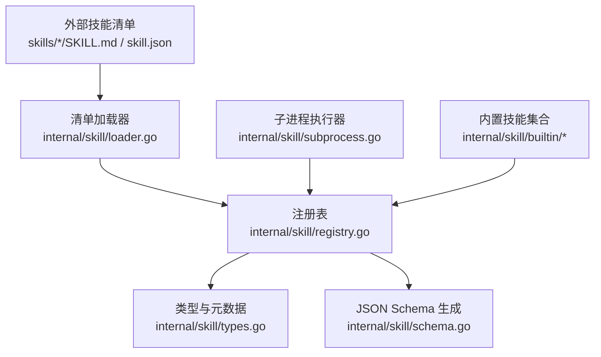
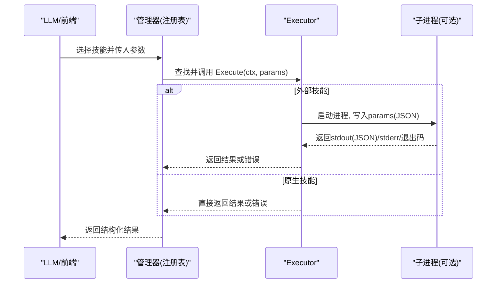
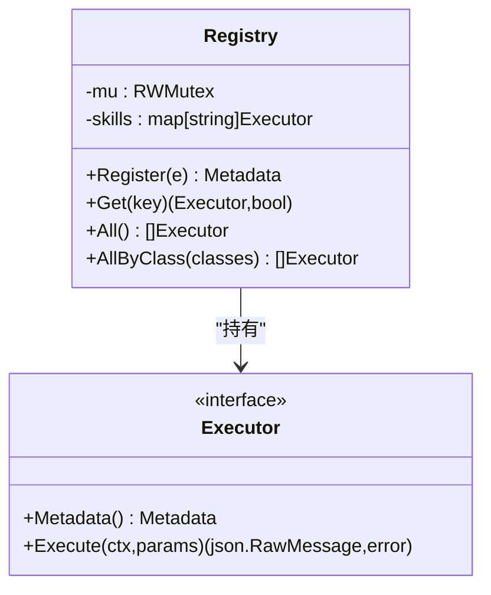
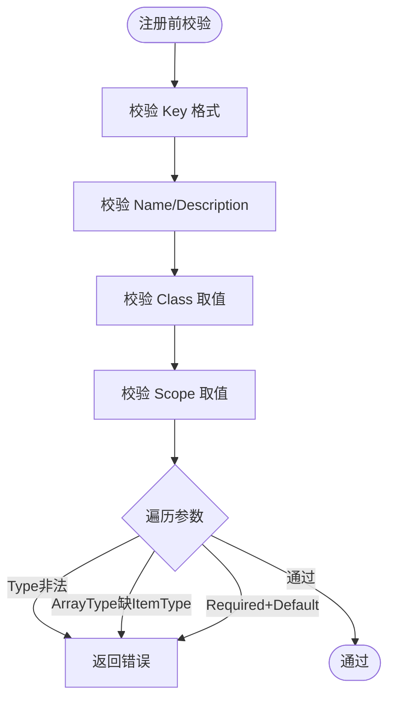
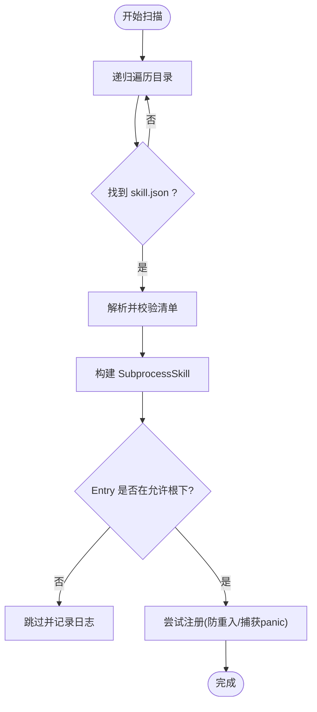
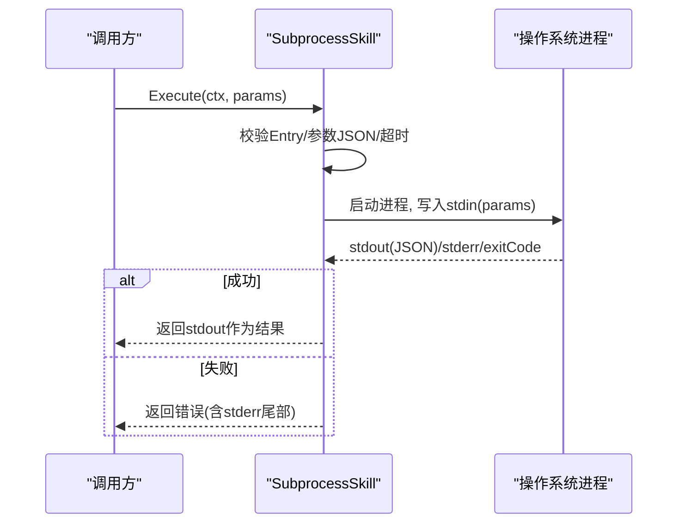
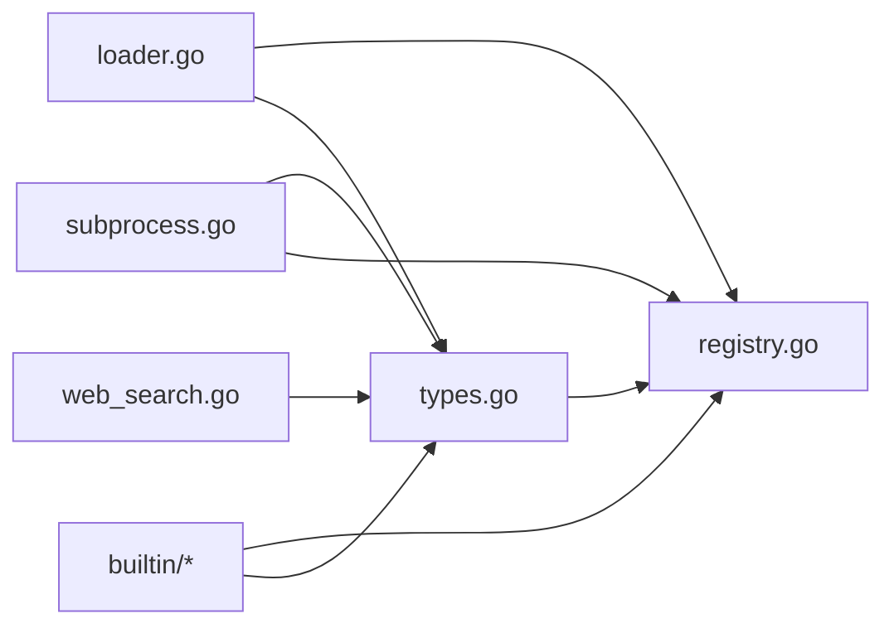

# 技能系统

<cite>
**本文引用的文件**
- [internal/skill/types.go](file://internal/skill/types.go)
- [internal/skill/registry.go](file://internal/skill/registry.go)
- [internal/skill/schema.go](file://internal/skill/schema.go)
- [internal/skill/loader.go](file://internal/skill/loader.go)
- [internal/skill/subprocess.go](file://internal/skill/subprocess.go)
- [internal/skill/builtin/probe_ping.go](file://internal/skill/builtin/probe_ping.go)
- [internal/skill/builtin/probe_http.go](file://internal/skill/builtin/probe_http.go)
- [internal/skill/builtin/tail_file.go](file://internal/skill/builtin/tail_file.go)
- [internal/skill/builtin/web_search.go](file://internal/skill/builtin/web_search.go)
- [internal/skill/builtin/restart_service/restart_service.go](file://internal/skill/builtin/restart_service/restart_service.go)
- [skills/bash/SKILL.md](file://skills/bash/SKILL.md)
- [skills/restart-service/SKILL.md](file://skills/restart-service/SKILL.md)
</cite>

## 目录
1. [简介](#简介)
2. [项目结构](#项目结构)
3. [核心组件](#核心组件)
4. [架构总览](#架构总览)
5. [详细组件分析](#详细组件分析)
6. [依赖关系分析](#依赖关系分析)
7. [性能与资源限制](#性能与资源限制)
8. [故障排查指南](#故障排查指南)
9. [结论](#结论)
10. [附录：自定义技能开发指南](#附录自定义技能开发指南)

## 简介
本文件系统化说明 Ongrid 的“技能（Skill）”体系：以统一接口将设备侧或管理端的可执行能力抽象为“技能”，通过注册表、清单加载、子进程执行与环境隔离，形成可扩展、可审计、可治理的能力平台。文档覆盖：
- 技能注册表与动态加载机制
- 执行环境（子进程、环境变量白名单、超时控制）
- 技能清单文件格式（skill.json）与元数据、参数校验
- 内置技能实现原理（网络探测、文件读取、服务重启、联网搜索）
- 自定义技能开发指南（子进程通信协议、环境变量控制、超时管理）
- 技能分类与安全级别控制（safe/mutating/dangerous）

## 项目结构
技能系统位于 internal/skill 包，包含类型定义、注册表、清单加载器、子进程执行器；内置技能位于 internal/skill/builtin；外部技能通过 skill.json 清单在指定目录被自动发现并注册。

图表来源
- [internal/skill/registry.go:10-47](file://internal/skill/registry.go#L10-L47)
- [internal/skill/types.go:99-175](file://internal/skill/types.go#L99-L175)
- [internal/skill/schema.go:5-20](file://internal/skill/schema.go#L5-L20)
- [internal/skill/loader.go:13-67](file://internal/skill/loader.go#L13-L67)
- [internal/skill/subprocess.go:30-78](file://internal/skill/subprocess.go#L30-L78)

章节来源
- [internal/skill/registry.go:10-47](file://internal/skill/registry.go#L10-L47)
- [internal/skill/loader.go:13-67](file://internal/skill/loader.go#L13-L67)

## 核心组件
- 类型与元数据：定义技能权限等级（safe/mutating/dangerous）、执行范围（host/manager）、参数模式、结果预览等，并提供校验逻辑。
- 注册表：全局维护已注册技能的键到执行器的映射，支持按类过滤与排序枚举。
- 清单加载器：扫描配置目录下的 skill.json，解析并构建 SubprocessSkill，安全校验入口路径与作用域，最终注册到全局注册表。
- 子进程执行器：以独立进程运行外部二进制，stdin/stdout 传输 JSON，强制作用域为 manager，严格的环境变量白名单与超时控制。
- 内置技能：提供网络探测（ping/http/tcp/dns）、文件操作（tail/read journal）、联网搜索（SearXNG/Tavily/Brave）、服务重启（mutating，走审批流）。

章节来源
- [internal/skill/types.go:35-61](file://internal/skill/types.go#L35-L61)
- [internal/skill/types.go:99-175](file://internal/skill/types.go#L99-L175)
- [internal/skill/registry.go:10-47](file://internal/skill/registry.go#L10-L47)
- [internal/skill/loader.go:13-67](file://internal/skill/loader.go#L13-L67)
- [internal/skill/subprocess.go:30-78](file://internal/skill/subprocess.go#L30-L78)

## 架构总览
技能系统采用“声明式元数据 + 可插拔执行器”的设计：
- 声明层：每个技能通过 Metadata 描述其名称、描述、参数模式、类别、作用域、结果预览。
- 注册层：init() 中调用 Register 将 Executor 加入全局注册表；加载器从磁盘扫描 skill.json 并构建 SubprocessSkill 后注册。
- 调度层：Manager 侧根据 Key 查找 Executor，构造 JSON Schema 暴露给 LLM 工具；Edge 侧通过 execute_skill RPC 分发到对应技能。
- 执行层：Go 原生技能直接 Execute；外部技能通过子进程 stdin/stdout 交换 JSON，受环境变量白名单与超时保护。

图表来源
- [internal/skill/registry.go:35-47](file://internal/skill/registry.go#L35-L47)
- [internal/skill/subprocess.go:112-172](file://internal/skill/subprocess.go#L112-L172)

## 详细组件分析

### 注册表（Registry）
- 职责：维护全局技能索引，提供 Get/All/AllByClass 查询；保证并发安全（读多写少）。
- 关键行为：
  - Register 时校验元数据，拒绝重复 Key。
  - AllByClass 支持按权限类过滤（如仅 safe 自动调用）。
  - 提供测试用 NewRegistryForTest 隔离状态。

图表来源
- [internal/skill/registry.go:21-47](file://internal/skill/registry.go#L21-L47)
- [internal/skill/types.go:190-203](file://internal/skill/types.go#L190-L203)

章节来源
- [internal/skill/registry.go:10-127](file://internal/skill/registry.go#L10-L127)

### 类型与元数据（Types & Metadata）
- 权限类 Class：safe（只读无副作用）、mutating（可逆修改）、dangerous（不可逆/集群影响）。
- 作用域 Scope：host（在边缘设备执行）、manager（在管理器进程执行）。
- 参数模式 ParamSchema：声明参数名、类型、是否必填、默认值、枚举、数组元素类型，并转换为 JSON Schema。
- 校验 Validate：确保 Key/Name/Description 非空、Class/Scope 合法、Param.Type/ItemType 合法、Required 与 Default 互斥。

图表来源
- [internal/skill/types.go:127-175](file://internal/skill/types.go#L127-L175)

章节来源
- [internal/skill/types.go:35-61](file://internal/skill/types.go#L35-L61)
- [internal/skill/types.go:99-175](file://internal/skill/types.go#L99-L175)

### 清单加载器（Loader）
- 目标：扫描配置的目录树，发现所有 skill.json，解析并构建 SubprocessSkill，再注册到全局注册表。
- 安全策略：
  - Entry 必须为绝对路径，且经符号链接解析后必须位于允许根目录下，防止逃逸。
  - 作用域强制为 manager（SubprocessSkill 的 Metadata 会覆盖）。
  - 环境变量白名单 EnvAllow：仅放行显式列出的变量，默认不继承 PATH。
  - 超时 TimeoutSeconds：未设置则使用默认 30s。
- 容错：单个清单解析失败或注册异常会被记录日志并跳过，不影响其他技能加载。

图表来源
- [internal/skill/loader.go:69-160](file://internal/skill/loader.go#L69-L160)
- [internal/skill/loader.go:176-253](file://internal/skill/loader.go#L176-L253)

章节来源
- [internal/skill/loader.go:13-67](file://internal/skill/loader.go#L13-L67)
- [internal/skill/loader.go:163-253](file://internal/skill/loader.go#L163-L253)

### 子进程执行器（SubprocessSkill）
- 通信协议：
  - 输入：stdin 接收 JSON 参数对象（空参数会被规范化为 {}）。
  - 输出：stdout 必须为有效 JSON；非零退出码视为错误，附带 stderr 尾部用于诊断。
- 安全与资源：
  - 作用域强制为 manager，避免在边缘执行不受控的二进制。
  - 环境变量白名单：仅注入 EnvAllow 中的变量，缺失则忽略。
  - 超时：默认 30s，可通过 manifest 配置；上下文取消传播。
  - I/O 上限：stdout 最大 16MiB，stderr 保留尾部 4KiB 用于错误信息。
- 错误分类：
  - 参数/路径校验错误：直接返回 Go 错误。
  - 超时：包装 context.DeadlineExceeded。
  - 非零退出：返回错误并附带 stderr 尾部。

图表来源
- [internal/skill/subprocess.go:112-172](file://internal/skill/subprocess.go#L112-L172)
- [internal/skill/subprocess.go:174-205](file://internal/skill/subprocess.go#L174-L205)
- [internal/skill/subprocess.go:207-238](file://internal/skill/subprocess.go#L207-L238)

章节来源
- [internal/skill/subprocess.go:17-78](file://internal/skill/subprocess.go#L17-L78)
- [internal/skill/subprocess.go:112-172](file://internal/skill/subprocess.go#L112-L172)

### 内置技能

#### 网络探测：Ping
- 功能：对目标主机发起短时 ICMP ping，返回连通性、耗时与原始输出。
- 安全：只读、固定次数与超时，避免滥用。
- 参数：host（必填）、count（默认4，上限10）、timeout_ms（默认3000，上限10000）。

章节来源
- [internal/skill/builtin/probe_ping.go:14-43](file://internal/skill/builtin/probe_ping.go#L14-L43)
- [internal/skill/builtin/probe_ping.go:60-125](file://internal/skill/builtin/probe_ping.go#L60-L125)

#### 网络探测：HTTP
- 功能：对 URL 发起 HEAD/GET 请求，返回状态码、延迟与内容长度；TLS 验证关闭以适配内网自签证书场景。
- 安全：只读方法（GET/HEAD），限制超时。
- 参数：url（必填）、method（默认HEAD）、timeout_ms（默认5000）。

章节来源
- [internal/skill/builtin/probe_http.go:15-47](file://internal/skill/builtin/probe_http.go#L15-L47)
- [internal/skill/builtin/probe_http.go:62-120](file://internal/skill/builtin/probe_http.go#L62-L120)

#### 文件操作：Tail File
- 功能：读取文件最后 N 行，类似 tail -n；支持最大字节预算，超大文件截断读取。
- 安全：仅读，要求绝对路径且禁止 .. 穿越。
- 参数：path（必填，绝对路径）、lines（默认100）、max_bytes（默认1MiB）。

章节来源
- [internal/skill/builtin/tail_file.go:15-46](file://internal/skill/builtin/tail_file.go#L15-L46)
- [internal/skill/builtin/tail_file.go:64-133](file://internal/skill/builtin/tail_file.go#L64-L133)

#### 联网搜索：Web Search
- 功能：聚合多个后端（SearXNG/Tavily/Brave），返回标题、URL、摘要与可选答案。
- 安全：只读 HTTP 调用；provider 未配置或不可达时返回 skipped_reason 而非错误，便于引导用户修复。
- 参数：query（必填）、max_results（默认5，上限10）、include/exclude_domains（Tavily 支持）、provider（可选覆盖）。

章节来源
- [internal/skill/builtin/web_search.go:19-46](file://internal/skill/builtin/web_search.go#L19-L46)
- [internal/skill/builtin/web_search.go:161-195](file://internal/skill/builtin/web_search.go#L161-L195)
- [internal/skill/builtin/web_search.go:225-283](file://internal/skill/builtin/web_search.go#L225-L283)

#### 服务重启：Restart Service（Mutating）
- 功能：重启允许列表内的 systemd 服务；属于 mutating 类，触发 reviewer 二审流程。
- 安全：该 Executor 的 Execute 故意返回错误，强制通过 Manager 侧 BaseTool + ReviewGate 调用，避免绕过审批。
- 参数：device_id（必填）、service（必填，短名）、reason（建议填写，用于审计）。

章节来源
- [internal/skill/builtin/restart_service/restart_service.go:1-36](file://internal/skill/builtin/restart_service/restart_service.go#L1-L36)
- [internal/skill/builtin/restart_service/restart_service.go:58-93](file://internal/skill/builtin/restart_service/restart_service.go#L58-L93)
- [internal/skill/builtin/restart_service/restart_service.go:95-114](file://internal/skill/builtin/restart_service/restart_service.go#L95-L114)
- [skills/restart-service/SKILL.md:1-82](file://skills/restart-service/SKILL.md#L1-L82)

### 外部技能与 Bash 沙箱
- Bash 技能（host_bash）：在边缘设备以子进程方式执行只读 shell 命令，由 cmdpolicy 沙箱进行白名单与策略校验，禁止写操作与危险二进制。
- 适用场景：复杂管道、日志定位、网络/系统状态查询等；明确不建议用于重启服务或改配置。

章节来源
- [skills/bash/SKILL.md:1-188](file://skills/bash/SKILL.md#L1-L188)

## 依赖关系分析
- 类型与注册表：types.go 定义 Executor/Metadata/ParamSchema；registry.go 维护全局索引与并发访问。
- 清单加载器：loader.go 依赖 types 与 registry，负责解析 skill.json 并构建 SubprocessSkill。
- 子进程执行器：subprocess.go 依赖 types 与 registry（通过 Loader 注册），提供安全的进程管理与 I/O 限流。
- 内置技能：各 builtin/*.go 实现 Executor 并在 init() 中注册；web_search 通过可插拔 resolver 获取配置。
- 外部技能：通过 skills/*/SKILL.md 与 skill.json 描述能力与约束，由 loader 发现并注册。

图表来源
- [internal/skill/types.go:99-203](file://internal/skill/types.go#L99-L203)
- [internal/skill/registry.go:10-47](file://internal/skill/registry.go#L10-L47)
- [internal/skill/loader.go:69-160](file://internal/skill/loader.go#L69-L160)
- [internal/skill/subprocess.go:30-78](file://internal/skill/subprocess.go#L30-L78)
- [internal/skill/builtin/web_search.go:161-195](file://internal/skill/builtin/web_search.go#L161-L195)

章节来源
- [internal/skill/types.go:99-203](file://internal/skill/types.go#L99-L203)
- [internal/skill/registry.go:10-47](file://internal/skill/registry.go#L10-L47)
- [internal/skill/loader.go:69-160](file://internal/skill/loader.go#L69-L160)
- [internal/skill/subprocess.go:30-78](file://internal/skill/subprocess.go#L30-L78)

## 性能与资源限制
- 子进程 I/O 上限：stdout 最大 16MiB，stderr 保留尾部 4KiB，避免恶意输出耗尽内存。
- 超时控制：默认 30s，可通过清单配置；上下文取消传播，确保及时释放资源。
- 参数与结果大小：参数 JSON 需合法；结果 JSON 需有效，否则返回错误。
- 并发安全：注册表使用读写锁，读多写少场景高效。
- 网络请求：web_search 对响应体限制读取，避免大响应阻塞。

章节来源
- [internal/skill/subprocess.go:17-28](file://internal/skill/subprocess.go#L17-L28)
- [internal/skill/subprocess.go:112-172](file://internal/skill/subprocess.go#L112-L172)
- [internal/skill/builtin/web_search.go:225-283](file://internal/skill/builtin/web_search.go#L225-L283)

## 故障排查指南
- 清单解析失败：检查 skill.json 字段是否完整（name/description/entry），以及 entry 路径是否在允许根目录下。
- 子进程执行错误：
  - 非零退出：查看 stderr 尾部，定位外部程序报错原因。
  - 超时：调整 timeout_seconds 或优化外部脚本性能。
  - 参数 JSON 无效：确保传入参数符合 JSON Schema。
- 环境变量未生效：确认 EnvAllow 包含所需变量名；PATH 需显式添加。
- 权限类误用：mutating/dangerous 技能需通过 Manager 侧审批流程，直接调用将被拒绝。
- Bash 沙箱拒绝：检查命令是否在允许列表中，避免写操作与危险二进制。

章节来源
- [internal/skill/loader.go:163-253](file://internal/skill/loader.go#L163-L253)
- [internal/skill/subprocess.go:112-172](file://internal/skill/subprocess.go#L112-L172)
- [skills/bash/SKILL.md:113-188](file://skills/bash/SKILL.md#L113-L188)

## 结论
Ongrid 技能系统通过统一的元数据模型、严格的注册与加载流程、安全的子进程执行环境，实现了能力的标准化接入与治理。内置技能覆盖了常见运维场景，外部技能通过 skill.json 灵活扩展；权限类与作用域控制确保安全边界，配合 Bash 沙箱与审批流，满足生产环境的合规与稳定性要求。

## 附录：自定义技能开发指南

### 技能清单（skill.json）字段说明
- name：技能键（lower_snake），唯一标识。
- description：人类可读描述，同时用于 LLM 工具描述。
- schema：可选，原始 JSON Schema；缺失时使用 ParamSchema 推导。
- entry：可执行文件路径；相对路径基于清单所在目录解析，必须位于允许根目录下。
- env_allow：环境变量白名单；为空表示不继承任何环境变量（包括 PATH）。
- timeout_seconds：子进程超时秒数；0 使用默认 30s。
- class：权限类（safe/mutating/dangerous），空默认为 safe。
- category：分类标签，默认 external。

章节来源
- [internal/skill/loader.go:13-53](file://internal/skill/loader.go#L13-L53)
- [internal/skill/loader.go:176-253](file://internal/skill/loader.go#L176-L253)

### 子进程通信协议
- 输入：stdin 接收 JSON 参数对象（空参数会被规范化为 {}）。
- 输出：stdout 必须为有效 JSON；非零退出码视为错误，附带 stderr 尾部用于诊断。
- 环境变量：仅注入 env_allow 中列出的变量；缺失则忽略。
- 超时：默认 30s，可通过清单配置；上下文取消传播。

章节来源
- [internal/skill/subprocess.go:112-172](file://internal/skill/subprocess.go#L112-L172)
- [internal/skill/subprocess.go:174-205](file://internal/skill/subprocess.go#L174-L205)

### 参数验证与 JSON Schema
- 若实现 RawSchemaProvider，则使用其提供的 JSON Schema；否则从 Metadata.Params 推导。
- 支持的参数类型：string/int/float/bool/duration/enum/array（需指定 ItemType）。
- Required 与 Default 互斥；Array 的 ItemType 必须为标量类型。

章节来源
- [internal/skill/schema.go:5-20](file://internal/skill/schema.go#L5-L20)
- [internal/skill/types.go:127-175](file://internal/skill/types.go#L127-L175)

### 安全级别与控制
- safe：只读无副作用，可直接由 AI 代理调用。
- mutating：可逆修改，需经理侧审批（ReviewGate）后方可执行。
- dangerous：不可逆或集群影响，需更严格审批。
- 作用域：host（边缘设备）或 manager（管理器进程）；外部技能强制 manager。

章节来源
- [internal/skill/types.go:35-61](file://internal/skill/types.go#L35-L61)
- [internal/skill/subprocess.go:30-78](file://internal/skill/subprocess.go#L30-L78)
- [internal/skill/builtin/restart_service/restart_service.go:58-93](file://internal/skill/builtin/restart_service/restart_service.go#L58-L93)