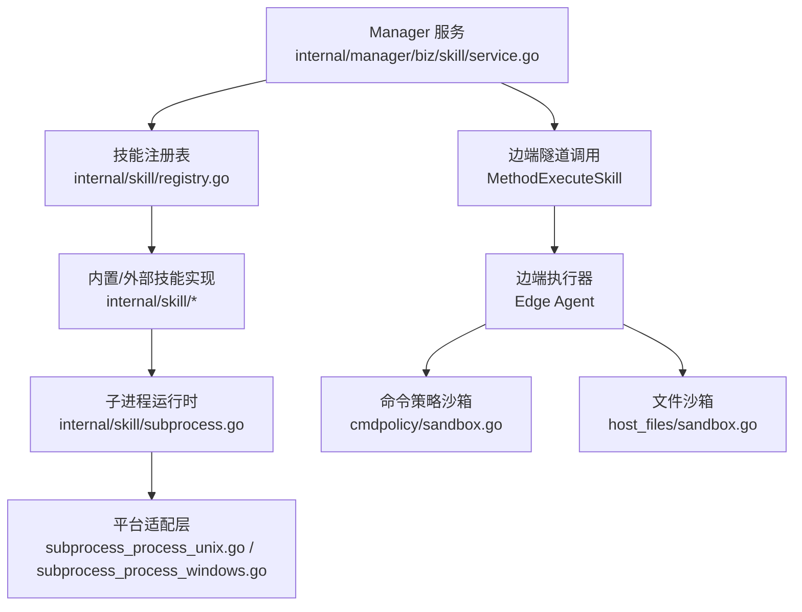
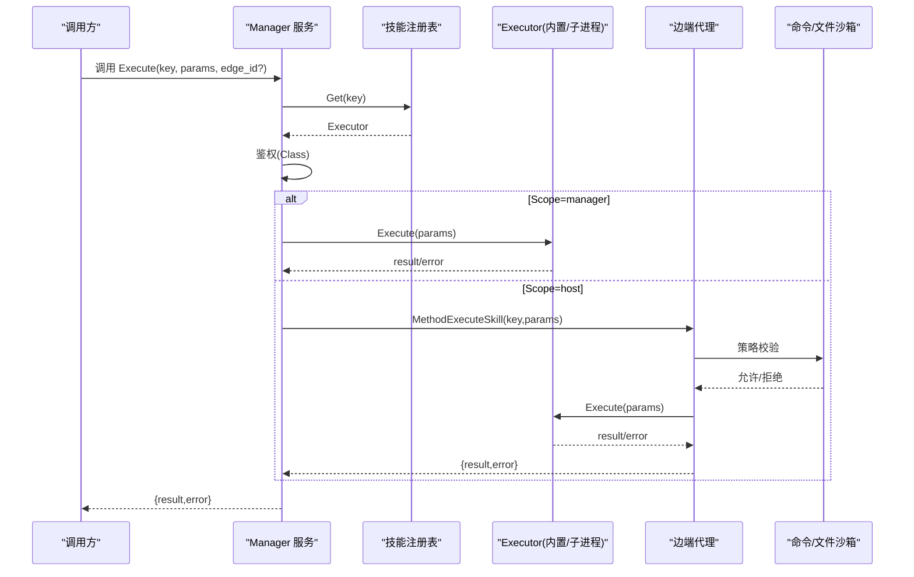
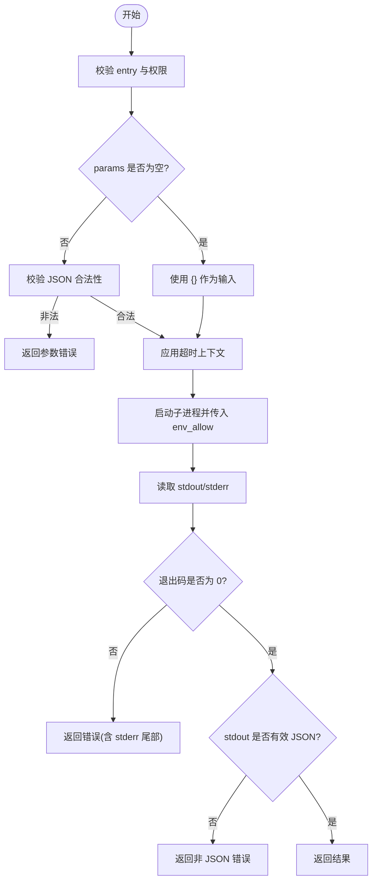
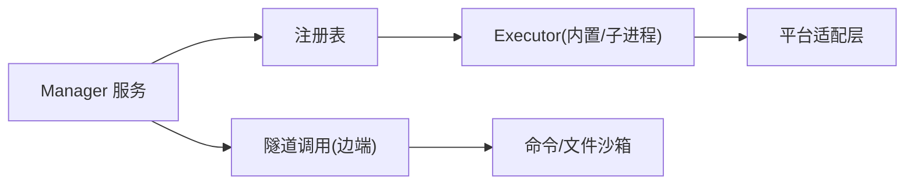

# 自定义技能开发

<cite>
**本文引用的文件**
- [internal/skill/types.go](file://internal/skill/types.go)
- [internal/skill/schema.go](file://internal/skill/schema.go)
- [internal/skill/loader.go](file://internal/skill/loader.go)
- [internal/skill/subprocess.go](file://internal/skill/subprocess.go)
- [internal/skill/subprocess_process_unix.go](file://internal/skill/subprocess_process_unix.go)
- [internal/skill/subprocess_process_windows.go](file://internal/skill/subprocess_process_windows.go)
- [internal/skill/registry.go](file://internal/skill/registry.go)
- [internal/manager/biz/skill/service.go](file://internal/manager/biz/skill/service.go)
- [skills/bash/SKILL.md](file://skills/bash/SKILL.md)
- [internal/edgeagent/host_files/sandbox.go](file://internal/edgeagent/host_files/sandbox.go)
- [internal/edgeagent/cmdpolicy/sandbox.go](file://internal/edgeagent/cmdpolicy/sandbox.go)
</cite>

## 目录
1. [简介](#简介)
2. [项目结构](#项目结构)
3. [核心组件](#核心组件)
4. [架构总览](#架构总览)
5. [详细组件分析](#详细组件分析)
6. [依赖关系分析](#依赖关系分析)
7. [性能与资源限制](#性能与资源限制)
8. [调试与排错指南](#调试与排错指南)
9. [结论](#结论)
10. [附录：完整开发流程示例](#附录完整开发流程示例)

## 简介
本指南面向希望为系统扩展“自定义技能”的开发者。内容涵盖：
- 技能清单文件（skill.json）编写规范、必填字段、可选配置与校验规则
- 子进程通信协议：标准输入输出的 JSON 数据格式、环境变量传递、超时控制
- 跨平台兼容性：Unix 与 Windows 的差异处理
- 安全沙箱机制：文件系统访问限制、网络权限控制、资源使用限制
- 从设计到测试部署的完整流程，以及调试技巧与常见问题解决方案

## 项目结构
技能框架位于 internal/skill 包，负责元数据定义、注册表、JSON Schema 生成、外部子进程技能加载与执行；管理器侧通过 internal/manager/biz/skill/service.go 进行调度；边端存在命令策略与文件沙箱以约束能力边界。

图表来源
- [internal/manager/biz/skill/service.go:187-261](file://internal/manager/biz/skill/service.go#L187-L261)
- [internal/skill/registry.go:10-47](file://internal/skill/registry.go#L10-L47)
- [internal/skill/subprocess.go:30-78](file://internal/skill/subprocess.go#L30-L78)
- [internal/skill/subprocess_process_unix.go:12-26](file://internal/skill/subprocess_process_unix.go#L12-L26)
- [internal/skill/subprocess_process_windows.go:7-8](file://internal/skill/subprocess_process_windows.go#L7-L8)
- [internal/edgeagent/host_files/sandbox.go:195-281](file://internal/edgeagent/host_files/sandbox.go#L195-L281)

章节来源
- [internal/skill/types.go:1-27](file://internal/skill/types.go#L1-L27)
- [internal/skill/loader.go:13-53](file://internal/skill/loader.go#L13-L53)
- [internal/skill/subprocess.go:17-78](file://internal/skill/subprocess.go#L17-L78)

## 核心组件
- 元数据与参数模型：Metadata、ParamSchema、Class、Scope
- 注册表：全局注册、按类过滤、并发安全
- Schema 生成：将 ParamSchema 转为 LLM 工具可用的 JSON Schema
- 子进程技能：通过 stdin/stdout 交换 JSON，支持环境变量白名单与超时
- 管理器调度：根据 Scope 决定本地执行或经隧道转发至边端
- 平台适配：Unix 进程组与信号终止；Windows 空实现

章节来源
- [internal/skill/types.go:35-125](file://internal/skill/types.go#L35-L125)
- [internal/skill/registry.go:10-47](file://internal/skill/registry.go#L10-L47)
- [internal/skill/schema.go:5-20](file://internal/skill/schema.go#L5-L20)
- [internal/skill/subprocess.go:30-78](file://internal/skill/subprocess.go#L30-L78)
- [internal/manager/biz/skill/service.go:187-261](file://internal/manager/biz/skill/service.go#L187-L261)

## 架构总览
技能执行路径分为两类：
- ScopeHost：在边端执行，管理器通过隧道 RPC 转发请求并解析返回结果
- ScopeManager：在管理器内直接执行，适用于需要访问公网或运行外部脚本的技能

图表来源
- [internal/manager/biz/skill/service.go:187-261](file://internal/manager/biz/skill/service.go#L187-L261)
- [internal/skill/registry.go:31-47](file://internal/skill/registry.go#L31-L47)
- [internal/skill/subprocess.go:99-172](file://internal/skill/subprocess.go#L99-L172)
- [internal/edgeagent/host_files/sandbox.go:195-281](file://internal/edgeagent/host_files/sandbox.go#L195-L281)

## 详细组件分析

### 技能清单文件（skill.json）规范
- 位置与发现：Loader 会递归扫描配置的 allowlist 目录，查找 skill.json 并注册为 SubprocessSkill
- 必填字段
  - name：小写下划线键名，需通过 key 校验
  - description：用于 UI 与 LLM 描述
  - entry：可执行文件路径；相对路径相对于 manifest 所在目录解析，绝对路径必须位于 allowlist 根目录下（含符号链接解析后的检查）
- 可选字段
  - schema：原始 JSON Schema，覆盖由 Metadata.Params 派生的 Schema
  - env_allow：仅将指定名称的环境变量注入子进程，默认不继承任何环境
  - timeout_seconds：子进程超时秒数，未设置时回退到默认值
  - class：safe/mutating/dangerous，未设置时为 safe
  - category：分组标签，未设置时默认为 external
- 校验规则
  - name 必须满足 lower_snake 且唯一
  - entry 必须可执行且位于 allowlist 下
  - class 必须在允许集合中
  - 若提供 schema，则作为 LLM 工具参数描述直接使用

章节来源
- [internal/skill/loader.go:13-53](file://internal/skill/loader.go#L13-L53)
- [internal/skill/loader.go:163-174](file://internal/skill/loader.go#L163-L174)
- [internal/skill/loader.go:176-254](file://internal/skill/loader.go#L176-L254)
- [internal/skill/types.go:127-175](file://internal/skill/types.go#L127-L175)

### 子进程通信协议
- 输入：父进程将 params 序列化为 JSON 写入子进程标准输入；空参数会被规范化为 {}
- 输出：子进程将结果以 JSON 形式写入标准输出；非 JSON 将被拒绝
- 错误处理：非零退出码视为错误，错误信息包含 stderr 尾部片段便于诊断
- 环境变量：仅 env_allow 中列出的变量被注入；为空时子进程无环境（deny by default）
- 超时控制：timeout_seconds 未设置时使用默认超时；超过时限返回超时错误
- 资源限制：stdout 最大读取字节数限制，stderr 内存保留尾部长度限制，防止异常输出耗尽内存

图表来源
- [internal/skill/subprocess.go:99-172](file://internal/skill/subprocess.go#L99-L172)
- [internal/skill/subprocess.go:174-193](file://internal/skill/subprocess.go#L174-L193)
- [internal/skill/subprocess.go:207-238](file://internal/skill/subprocess.go#L207-L238)

章节来源
- [internal/skill/subprocess.go:99-172](file://internal/skill/subprocess.go#L99-L172)
- [internal/skill/subprocess.go:174-193](file://internal/skill/subprocess.go#L174-L193)
- [internal/skill/subprocess.go:207-238](file://internal/skill/subprocess.go#L207-L238)

### 跨平台兼容性
- Unix：子进程创建时设置进程组，取消时向整个进程组发送 SIGKILL，确保子树进程被清理
- Windows：当前为占位实现，不设置额外属性；需注意 Windows 上 shell 脚本与 chmod 行为差异，建议使用批处理或可执行文件

章节来源
- [internal/skill/subprocess_process_unix.go:12-26](file://internal/skill/subprocess_process_unix.go#L12-L26)
- [internal/skill/subprocess_process_windows.go:7-8](file://internal/skill/subprocess_process_windows.go#L7-L8)

### 安全沙箱机制
- 命令策略沙箱（边端）：对可执行命令进行白名单/黑名单匹配，阻止写操作与危险二进制；网络出站默认拒绝，需显式放行
- 文件沙箱（边端）：对读路径进行 denylist 与 allowlist 双重校验，拒绝敏感路径（如 /proc、/sys、/dev、/run、/etc/shadow、用户密钥目录等），并提供二进制解析白名单
- 子进程技能安全：强制 ScopeManager，entry 必须位于 allowlist 根目录；环境变量严格白名单注入；stdout/stderr 容量限制

章节来源
- [internal/edgeagent/cmdpolicy/sandbox.go](file://internal/edgeagent/cmdpolicy/sandbox.go)
- [internal/edgeagent/host_files/sandbox.go:195-281](file://internal/edgeagent/host_files/sandbox.go#L195-L281)
- [internal/skill/subprocess.go:30-78](file://internal/skill/subprocess.go#L30-L78)
- [internal/skill/loader.go:176-254](file://internal/skill/loader.go#L176-L254)

### 管理器调度与权限控制
- 根据 Skill 的 Class 进行鉴权：safe 可直接调用；mutating/dangerous 需要更高权限或审批流程
- 根据 Scope 选择执行路径：manager 本地执行或经隧道转发到边端
- 边端执行前经过命令策略与文件沙箱校验，确保只读与最小权限原则

章节来源
- [internal/manager/biz/skill/service.go:187-261](file://internal/manager/biz/skill/service.go#L187-L261)
- [internal/skill/types.go:17-26](file://internal/skill/types.go#L17-L26)

## 依赖关系分析
- 管理器服务依赖注册表获取 Executor，再依据 Scope 决定执行路径
- 子进程技能依赖 Loader 的 allowlist 校验与环境白名单
- 平台适配层影响进程生命周期管理（Unix 进程组与信号）
- 边端沙箱对命令与文件访问进行强约束

图表来源
- [internal/manager/biz/skill/service.go:187-261](file://internal/manager/biz/skill/service.go#L187-L261)
- [internal/skill/registry.go:31-47](file://internal/skill/registry.go#L31-L47)
- [internal/skill/subprocess.go:207-238](file://internal/skill/subprocess.go#L207-L238)
- [internal/edgeagent/host_files/sandbox.go:195-281](file://internal/edgeagent/host_files/sandbox.go#L195-L281)

章节来源
- [internal/skill/registry.go:10-47](file://internal/skill/registry.go#L10-L47)
- [internal/skill/subprocess.go:207-238](file://internal/skill/subprocess.go#L207-L238)

## 性能与资源限制
- 子进程 stdout 最大读取字节数限制，避免异常输出导致内存膨胀
- stderr 仅保留尾部片段用于错误诊断，减少内存占用
- 默认超时时间适用于大多数 LLM 工具场景，可通过清单配置调整
- 参数 Schema 自动生成，减少 LLM 调用时的解析成本与错误率

章节来源
- [internal/skill/subprocess.go:17-28](file://internal/skill/subprocess.go#L17-L28)
- [internal/skill/subprocess.go:207-238](file://internal/skill/subprocess.go#L207-L238)
- [internal/skill/schema.go:22-95](file://internal/skill/schema.go#L22-L95)

## 调试与排错指南
- 常见错误
  - 非 JSON 输出：子进程 stdout 必须为有效 JSON，否则返回错误
  - 非零退出码：错误信息包含 stderr 尾部片段，便于定位问题
  - 环境变量泄漏：仅 env_allow 中的变量会被注入，未列入的不会传递
  - 超时：超过 timeout_seconds 将返回超时错误
- 调试建议
  - 在子进程中打印结构化日志到 stderr，便于捕获错误上下文
  - 使用最小化参数集逐步验证输入与输出
  - 检查 entry 路径是否在 allowlist 下且具有可执行权限
  - 确认 platform 差异（Unix vs Windows）下的脚本与权限设置

章节来源
- [internal/skill/subprocess.go:99-172](file://internal/skill/subprocess.go#L99-L172)
- [internal/skill/subprocess.go:174-193](file://internal/skill/subprocess.go#L174-L193)
- [internal/skill/subprocess.go:207-238](file://internal/skill/subprocess.go#L207-L238)

## 结论
本框架通过统一的元数据、注册表与子进程运行时，实现了可扩展、安全可控的技能体系。开发者只需遵循 skill.json 规范与通信协议，即可快速集成外部能力，并在管理器与边端之间获得一致的调度与安全保障。

## 附录：完整开发流程示例
以下示例展示从零到一开发一个外部子进程技能的步骤，涵盖设计、实现、清单、测试与部署。

- 设计阶段
  - 确定技能用途与权限等级（safe/mutating/dangerous）
  - 明确输入参数与输出结构，必要时提供自定义 JSON Schema
  - 评估是否需要环境变量注入与超时配置

- 实现阶段
  - 编写可执行文件或脚本，接收 stdin JSON 并输出 stdout JSON
  - 处理错误：非零退出码并输出 stderr 提示
  - 遵守资源限制：控制输出大小，避免无限循环

- 清单阶段
  - 创建 skill.json，填写 name、description、entry、env_allow、timeout_seconds、class、category
  - 确保 entry 路径位于 allowlist 根目录下，且具备可执行权限

- 测试阶段
  - 本地模拟子进程，验证输入输出与错误处理
  - 使用单元测试覆盖关键路径（成功、失败、超时、非 JSON 输出）
  - 在目标平台验证行为（Unix/Windows）

- 部署阶段
  - 将 skill.json 与可执行文件放入配置的 allowlist 目录
  - 重启管理器服务以加载新技能
  - 通过管理器 API 或 UI 验证技能可用性与权限控制

章节来源
- [internal/skill/loader.go:69-110](file://internal/skill/loader.go#L69-L110)
- [internal/skill/loader.go:176-254](file://internal/skill/loader.go#L176-L254)
- [internal/skill/subprocess.go:99-172](file://internal/skill/subprocess.go#L99-L172)
- [skills/bash/SKILL.md:1-188](file://skills/bash/SKILL.md#L1-L188)