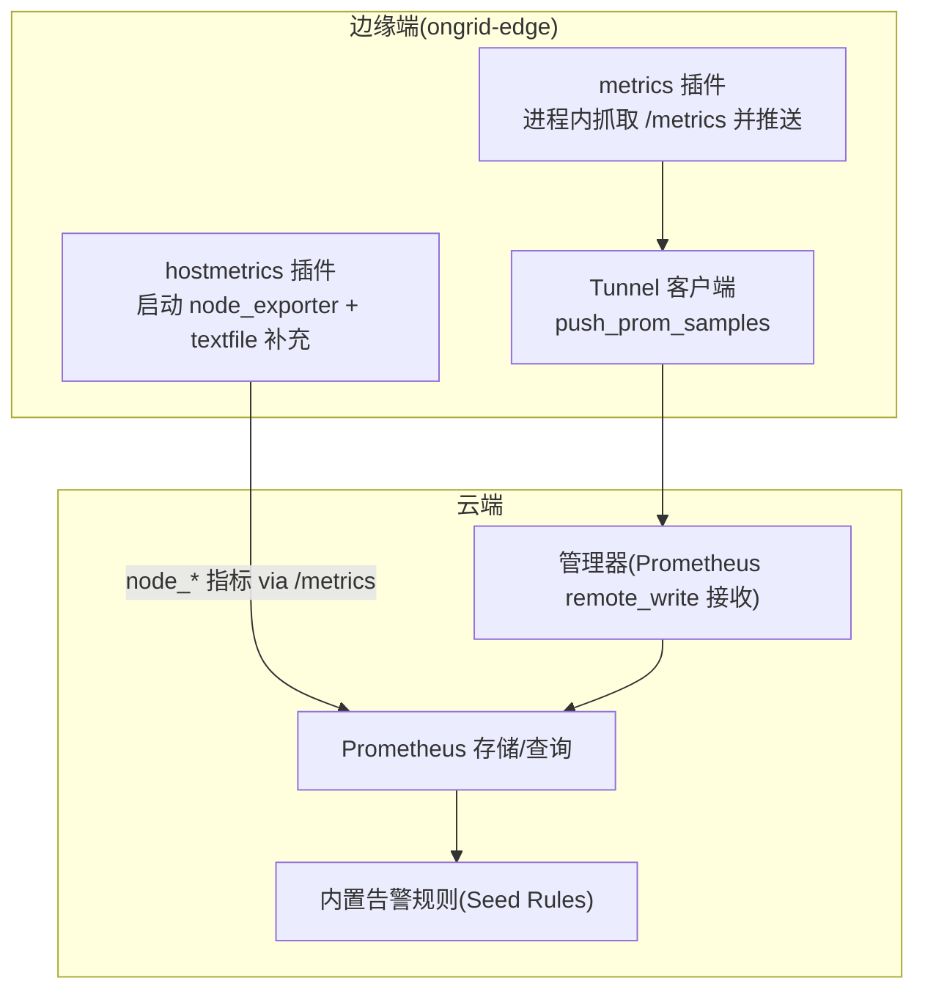
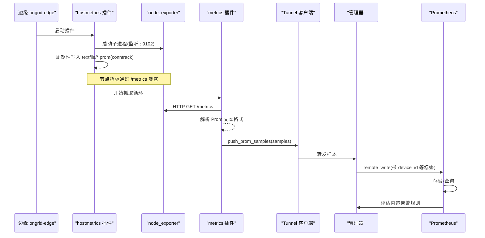
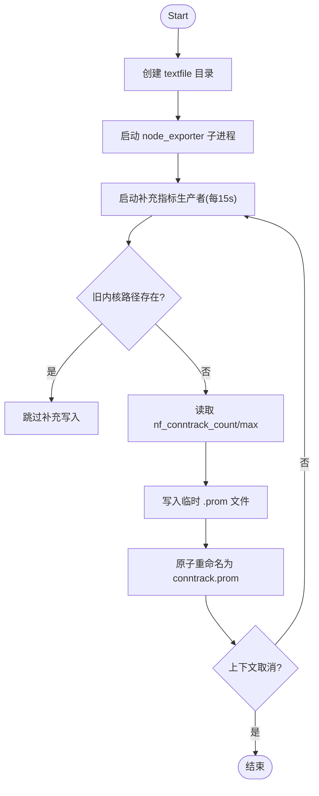
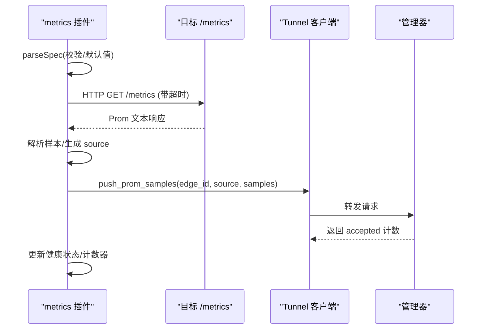
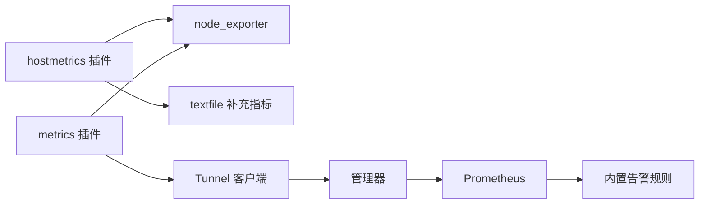

# 主机指标插件

<cite>
**本文引用的文件**
- [internal/edgeagent/plugins/hostmetrics/plugin.go](file://internal/edgeagent/plugins/hostmetrics/plugin.go)
- [internal/edgeagent/plugins/metrics/plugin.go](file://internal/edgeagent/plugins/metrics/plugin.go)
- [internal/edgeagent/collector/doc.go](file://internal/edgeagent/collector/doc.go)
- [internal/edgeagent/collector/embedded.go](file://internal/edgeagent/collector/embedded.go)
- [internal/edgeagent/collector/scrapecfg.go](file://internal/edgeagent/collector/scrapecfg.go)
- [internal/edgeagent/collector/scrape_config.example.yaml](file://internal/edgeagent/collector/scrape_config.example.yaml)
- [internal/pkg/tunnel/messages.go](file://internal/pkg/tunnel/messages.go)
- [internal/manager/data/alert/store/seed_rules.go](file://internal/manager/data/alert/store/seed_rules.go)
- [internal/pkg/config/config.go](file://internal/pkg/config/config.go)
- [deploy/install/prometheus.yml](file://deploy/install/prometheus.yml)
- [deploy/install/prometheus-rules.yml](file://deploy/install/prometheus-rules.yml)
</cite>

## 目录
1. [简介](#简介)
2. [项目结构](#项目结构)
3. [核心组件](#核心组件)
4. [架构总览](#架构总览)
5. [详细组件分析](#详细组件分析)
6. [依赖关系分析](#依赖关系分析)
7. [性能与资源占用](#性能与资源占用)
8. [故障排查指南](#故障排查指南)
9. [结论](#结论)
10. [附录](#附录)

## 简介
本文件系统性说明 ongrid 的“主机指标插件”如何采集、传输并接入到云端监控体系。重点覆盖：
- 采集范围：CPU、内存、磁盘、网络、负载等基础资源指标，以及连接跟踪（conntrack）补充指标。
- 采集频率、数据精度与资源占用控制策略。
- 平台兼容性：Linux 为主，Windows 差异与限制。
- 最佳实践：阈值配置建议、存储优化与查询性能考虑。
- 诊断与调优：常见瓶颈定位方法与调优建议。
- 集成方式：与 Prometheus、Tunnel 推送、告警规则联动。

## 项目结构
主机指标在 ongrid-edge 侧通过两类机制实现：
- hostmetrics 插件：以子进程方式运行 node_exporter，暴露标准 /metrics；同时内嵌一个补充指标生产者，将内核中不易被默认 collector 读取的指标写入 textfile 供 node_exporter 抓取。
- metrics 插件：进程内定时抓取本地 /metrics（默认 node_exporter），解析后通过隧道 RPC 推送到管理器。

图表来源
- [internal/edgeagent/plugins/hostmetrics/plugin.go:1-28](file://internal/edgeagent/plugins/hostmetrics/plugin.go#L1-L28)
- [internal/edgeagent/plugins/metrics/plugin.go:1-35](file://internal/edgeagent/plugins/metrics/plugin.go#L1-L35)
- [internal/pkg/tunnel/messages.go:383-394](file://internal/pkg/tunnel/messages.go#L383-L394)
- [deploy/install/prometheus.yml:30-36](file://deploy/install/prometheus.yml#L30-L36)

章节来源
- [internal/edgeagent/plugins/hostmetrics/plugin.go:1-28](file://internal/edgeagent/plugins/hostmetrics/plugin.go#L1-L28)
- [internal/edgeagent/plugins/metrics/plugin.go:1-35](file://internal/edgeagent/plugins/metrics/plugin.go#L1-L35)
- [internal/edgeagent/collector/doc.go:1-21](file://internal/edgeagent/collector/doc.go#L1-L21)

## 核心组件
- hostmetrics 插件
  - 负责启动 node_exporter 子进程，监听地址可配置（默认 :9102）。
  - 自动启用 textfile collector，并将补充指标写入工作目录下的 textfile/*.prom。
  - 针对现代内核 nf_conntrack 路径变更问题，提供补充指标写入，避免面板空白。
  - 支持 collectors_enabled/collectors_disabled/extra_args 等参数透传。
- metrics 插件
  - 进程内定时抓取目标 /metrics（默认 node_exporter :9102），解析为 Prom 样本并通过隧道 push_prom_samples 上报。
  - 支持多目标、超时保护、失败重试（按 tick）、静态标签合并等。
- 嵌入式采集器（备用模式）
  - 使用 gopsutil 直接读取系统信息，输出与 node_exporter 兼容的指标名，便于在无外部导出器时作为基线。
- 云端告警种子规则
  - 基于 node_* 指标预置 CPU/内存/磁盘/负载等阈值告警，支持通过配置开关或阈值禁用。

章节来源
- [internal/edgeagent/plugins/hostmetrics/plugin.go:22-28](file://internal/edgeagent/plugins/hostmetrics/plugin.go#L22-L28)
- [internal/edgeagent/plugins/hostmetrics/plugin.go:53-57](file://internal/edgeagent/plugins/hostmetrics/plugin.go#L53-L57)
- [internal/edgeagent/plugins/hostmetrics/plugin.go:150-162](file://internal/edgeagent/plugins/hostmetrics/plugin.go#L150-L162)
- [internal/edgeagent/plugins/metrics/plugin.go:23-35](file://internal/edgeagent/plugins/metrics/plugin.go#L23-L35)
- [internal/edgeagent/collector/doc.go:1-21](file://internal/edgeagent/collector/doc.go#L1-L21)
- [internal/manager/data/alert/store/seed_rules.go:64-96](file://internal/manager/data/alert/store/seed_rules.go#L64-L96)

## 架构总览
主机指标从边缘到云端的完整链路如下：
- 边缘端 hostmetrics 插件启动 node_exporter，暴露 node_* 指标；textfile 补充 conntrack 指标。
- 云端 Prometheus 可直接抓取本地 edge 的 node_exporter（容器桥接场景），或通过远程写入通道由管理器接收。
- metrics 插件将抓取到的样本经隧道 RPC 推送到管理器，管理器注入 device_id 等标签后持久化至 Prometheus。
- 内置告警规则对关键指标进行阈值评估，触发告警事件。

图表来源
- [internal/edgeagent/plugins/hostmetrics/plugin.go:68-84](file://internal/edgeagent/plugins/hostmetrics/plugin.go#L68-L84)
- [internal/edgeagent/plugins/hostmetrics/plugin.go:150-162](file://internal/edgeagent/plugins/hostmetrics/plugin.go#L150-L162)
- [internal/edgeagent/plugins/metrics/plugin.go:181-207](file://internal/edgeagent/plugins/metrics/plugin.go#L181-L207)
- [internal/edgeagent/plugins/metrics/plugin.go:220-281](file://internal/edgeagent/plugins/metrics/plugin.go#L220-L281)
- [internal/pkg/tunnel/messages.go:383-394](file://internal/pkg/tunnel/messages.go#L383-L394)
- [deploy/install/prometheus.yml:30-36](file://deploy/install/prometheus.yml#L30-L36)

## 详细组件分析

### hostmetrics 插件
- 职责
  - 管理 node_exporter 子进程生命周期，构建命令行参数（监听地址、收集器开关、额外参数）。
  - 强制挂载 textfile collector 目录，确保补充指标能被统一抓取。
  - 独立 goroutine 周期写入 conntrack 指标到 textfile，解决新版内核路径变化导致的缺失问题。
- 关键行为
  - 默认监听端口 :9102，避免与 manager 的 9100 冲突。
  - supplementaryInterval=15s，匹配典型抓取间隔，减少 I/O 浪费。
  - 写文件采用 tmp+rename 原子替换，避免半写文件导致解析失败。
  - 若旧内核路径存在则跳过补充写入，避免重复指标冲突。
- 配置项
  - listen_address：字符串，默认 ":9102"
  - collectors_enabled：[]string，传递 --collector.<name>
  - collectors_disabled：[]string，传递 --no-collector.<name>
  - extra_args：[]string，追加到命令末尾

图表来源
- [internal/edgeagent/plugins/hostmetrics/plugin.go:111-133](file://internal/edgeagent/plugins/hostmetrics/plugin.go#L111-L133)
- [internal/edgeagent/plugins/hostmetrics/plugin.go:150-176](file://internal/edgeagent/plugins/hostmetrics/plugin.go#L150-L176)
- [internal/edgeagent/plugins/hostmetrics/plugin.go:191-231](file://internal/edgeagent/plugins/hostmetrics/plugin.go#L191-L231)

章节来源
- [internal/edgeagent/plugins/hostmetrics/plugin.go:22-28](file://internal/edgeagent/plugins/hostmetrics/plugin.go#L22-L28)
- [internal/edgeagent/plugins/hostmetrics/plugin.go:47-57](file://internal/edgeagent/plugins/hostmetrics/plugin.go#L47-L57)
- [internal/edgeagent/plugins/hostmetrics/plugin.go:68-84](file://internal/edgeagent/plugins/hostmetrics/plugin.go#L68-L84)
- [internal/edgeagent/plugins/hostmetrics/plugin.go:150-176](file://internal/edgeagent/plugins/hostmetrics/plugin.go#L150-L176)
- [internal/edgeagent/plugins/hostmetrics/plugin.go:191-231](file://internal/edgeagent/plugins/hostmetrics/plugin.go#L191-L231)

### metrics 插件
- 职责
  - 进程内定时抓取一个或多个 /metrics 端点，解析为 Prom 样本，通过隧道 RPC 推送到管理器。
  - 支持 per-target 超时、失败隔离、立即首次抓取、健康状态统计。
- 关键行为
  - 默认目标包含 node_exporter :9102 与 process_exporter :9256。
  - scrape_interval 与 scrape_timeout 可配置，且超时会被钳制不超过间隔，防止重叠。
  - 每个 URL 失败仅记录日志，不中断其他目标抓取。
  - 在 edge_id 未就绪时延迟推送，避免空设备标识。
- 配置项
  - target_url：字符串（单目标）或 URLs（多目标）
  - scrape_interval：持续时间字符串，默认 15s
  - scrape_timeout：持续时间字符串，默认 5s
  - tls_insecure：bool，是否忽略 HTTPS 证书校验
  - bearer_token：可选 Authorization Bearer
  - extra_labels：map[string]string，合并到每个样本标签

图表来源
- [internal/edgeagent/plugins/metrics/plugin.go:181-207](file://internal/edgeagent/plugins/metrics/plugin.go#L181-L207)
- [internal/edgeagent/plugins/metrics/plugin.go:220-281](file://internal/edgeagent/plugins/metrics/plugin.go#L220-L281)
- [internal/pkg/tunnel/messages.go:383-394](file://internal/pkg/tunnel/messages.go#L383-L394)

章节来源
- [internal/edgeagent/plugins/metrics/plugin.go:23-35](file://internal/edgeagent/plugins/metrics/plugin.go#L23-L35)
- [internal/edgeagent/plugins/metrics/plugin.go:181-207](file://internal/edgeagent/plugins/metrics/plugin.go#L181-L207)
- [internal/edgeagent/plugins/metrics/plugin.go:220-281](file://internal/edgeagent/plugins/metrics/plugin.go#L220-L281)

### 嵌入式采集器（gopsutil 模式）
- 职责
  - 在不依赖外部导出器的情况下，直接读取系统信息，输出与 node_exporter 兼容的指标名。
  - 覆盖 CPU、内存、负载、网络、文件系统、时间等常用指标族。
- 指标命名
  - 遵循 node_exporter 约定，如 node_cpu_seconds_total、node_memory_*、node_load*、node_network_*、node_filesystem_*、node_time_seconds、node_boot_time_seconds 等。
- 优势
  - 纯 Go、无 CGO，跨平台更友好；可作为 fallback 基线。

章节来源
- [internal/edgeagent/collector/doc.go:1-21](file://internal/edgeagent/collector/doc.go#L1-L21)
- [internal/edgeagent/collector/embedded.go:176-198](file://internal/edgeagent/collector/embedded.go#L176-L198)

### 多目标抓取配置（scrape 模式）
- 配置文件
  - targets 列表，每项定义 name、role、url、interval、timeout、认证与 TLS 选项、静态标签。
  - role=host 可作为主机源参与快速路径与内置告警；role=component 仅丰富 Prom 样本。
- 示例
  - 提供 node-exporter、kubelet-cadvisor、mysql-exporter 等示例条目。

章节来源
- [internal/edgeagent/collector/scrapecfg.go:12-49](file://internal/edgeagent/collector/scrapecfg.go#L12-L49)
- [internal/edgeagent/collector/scrape_config.example.yaml:1-29](file://internal/edgeagent/collector/scrape_config.example.yaml#L1-L29)

## 依赖关系分析
- 组件耦合
  - hostmetrics 插件依赖 node_exporter 二进制与 textfile 目录；metrics 插件依赖本地 /metrics 端点与隧道客户端。
  - 两者均产出 node_* 系列指标，保证云端查询一致性。
- 外部依赖
  - 云端 Prometheus 通过 remote_write 接收样本；内置告警规则基于 node_* 指标评估。
- 潜在循环
  - 无直接循环依赖；hostmetrics 与 metrics 插件相互独立，分别走不同数据通路。

图表来源
- [internal/edgeagent/plugins/hostmetrics/plugin.go:68-84](file://internal/edgeagent/plugins/hostmetrics/plugin.go#L68-L84)
- [internal/edgeagent/plugins/metrics/plugin.go:220-281](file://internal/edgeagent/plugins/metrics/plugin.go#L220-L281)
- [internal/pkg/tunnel/messages.go:383-394](file://internal/pkg/tunnel/messages.go#L383-L394)
- [internal/manager/data/alert/store/seed_rules.go:64-96](file://internal/manager/data/alert/store/seed_rules.go#L64-L96)

章节来源
- [internal/edgeagent/plugins/hostmetrics/plugin.go:68-84](file://internal/edgeagent/plugins/hostmetrics/plugin.go#L68-L84)
- [internal/edgeagent/plugins/metrics/plugin.go:220-281](file://internal/edgeagent/plugins/metrics/plugin.go#L220-L281)
- [internal/pkg/tunnel/messages.go:383-394](file://internal/pkg/tunnel/messages.go#L383-L394)
- [internal/manager/data/alert/store/seed_rules.go:64-96](file://internal/manager/data/alert/store/seed_rules.go#L64-L96)

## 性能与资源占用
- 采集频率
  - hostmetrics 补充指标生产者固定 15s 刷新，匹配典型抓取间隔，避免多余 I/O。
  - metrics 插件默认 15s 抓取间隔，超时默认 5s，且超时会被钳制不超过间隔，防止并发抓取重叠。
- 数据精度
  - 嵌入式采集器与 node_exporter 输出一致的指标命名，便于云端 PromQL 一致查询。
  - 补充指标通过 textfile 精确写入，避免内核路径差异导致的数据缺失。
- 资源占用控制
  - 通过 collectors_enabled/collectors_disabled 精细控制 node_exporter 收集器集合，降低开销。
  - 多目标抓取失败隔离，单个目标异常不影响其他目标。
  - 嵌入式模式无 CGO、无外部进程，适合轻量部署。
- 存储与查询优化
  - 统一指标命名与标签（device_id、ongrid_source），提升聚合与关联查询效率。
  - 合理设置 scrape_interval 与 evaluation_interval，平衡实时性与存储压力。

章节来源
- [internal/edgeagent/plugins/hostmetrics/plugin.go:53-57](file://internal/edgeagent/plugins/hostmetrics/plugin.go#L53-L57)
- [internal/edgeagent/plugins/metrics/plugin.go:181-207](file://internal/edgeagent/plugins/metrics/plugin.go#L181-L207)
- [internal/edgeagent/collector/doc.go:13-21](file://internal/edgeagent/collector/doc.go#L13-L21)
- [deploy/install/prometheus.yml:6-8](file://deploy/install/prometheus.yml#L6-L8)

## 故障排查指南
- 常见问题
  - conntrack 面板空白：检查 textfile 补充指标是否成功写入；确认内核路径与旧路径共存时的去重逻辑。
  - 抓取失败：查看 metrics 插件日志中的 scrape failed；确认目标 /metrics 可达性与超时配置。
  - 指标缺失：核对 node_exporter 收集器开关；必要时启用特定 collector 或调整 extra_args。
  - 告警未触发：检查内置规则阈值配置是否为 0（表示禁用）；确认指标已入库。
- 定位步骤
  - 验证 node_exporter 进程存活与监听端口。
  - 检查 textfile 目录是否存在 conntrack.prom 且内容非空。
  - 查看 Prometheus 是否收到样本（remote_write 或本地抓取）。
  - 审查内置告警规则与阈值配置。

章节来源
- [internal/edgeagent/plugins/hostmetrics/plugin.go:191-231](file://internal/edgeagent/plugins/hostmetrics/plugin.go#L191-L231)
- [internal/edgeagent/plugins/metrics/plugin.go:220-281](file://internal/edgeagent/plugins/metrics/plugin.go#L220-L281)
- [internal/manager/data/alert/store/seed_rules.go:64-96](file://internal/manager/data/alert/store/seed_rules.go#L64-L96)
- [internal/pkg/config/config.go:214-241](file://internal/pkg/config/config.go#L214-L241)

## 结论
ongrid 的主机指标插件通过 hostmetrics 与 metrics 两条互补路径，实现了稳定、可扩展的主机资源监控能力。其设计兼顾了：
- 指标标准化与兼容性（node_exporter 命名约定）
- 灵活的可观测性扩展（textfile 补充、多目标抓取）
- 低侵入与高可用（失败隔离、超时保护、原子写入）
- 与云端监控体系的无缝集成（remote_write、内置告警）

在生产环境中，建议结合业务规模与资源约束，合理配置采集频率、收集器集合与阈值，以获得最佳的监控效果与成本收益。

## 附录

### 指标类别与采集来源
- CPU
  - 来源：node_exporter 或嵌入式 gopsutil
  - 指标族：node_cpu_seconds_total{cpu, mode}
- 内存
  - 来源：node_exporter 或嵌入式 gopsutil
  - 指标族：node_memory_MemTotal_bytes、node_memory_MemAvailable_bytes、node_memory_MemFree_bytes、node_memory_Buffers_bytes、node_memory_Cached_bytes
- 负载
  - 来源：node_exporter 或嵌入式 gopsutil
  - 指标族：node_load1、node_load5、node_load15
- 网络
  - 来源：node_exporter 或嵌入式 gopsutil
  - 指标族：node_network_receive_bytes_total{device}、node_network_transmit_bytes_total{device}、node_network_receive_packets_total{device}、node_network_transmit_packets_total{device}
- 磁盘
  - 来源：node_exporter 或嵌入式 gopsutil
  - 指标族：node_filesystem_size_bytes{mountpoint, fstype}、node_filesystem_avail_bytes{mountpoint, fstype}、node_filesystem_free_bytes{mountpoint, fstype}
- 连接跟踪（补充）
  - 来源：textfile 补充生产者
  - 指标族：node_nf_conntrack_entries、node_nf_conntrack_entries_limit

章节来源
- [internal/edgeagent/collector/embedded.go:176-198](file://internal/edgeagent/collector/embedded.go#L176-L198)
- [internal/edgeagent/plugins/hostmetrics/plugin.go:150-162](file://internal/edgeagent/plugins/hostmetrics/plugin.go#L150-L162)

### 平台兼容性
- Linux
  - 主要运行平台；node_exporter 与 gopsutil 均良好支持。
  - 注意现代内核下 conntrack 路径变化，插件已通过 textfile 补充规避。
- Windows
  - 代码中存在平台相关实现（如 dpapi_windows.go、edgedirs_windows.go），但主机指标采集主要面向 Linux；如需 Windows 支持，需评估 gopsutil 与 node_exporter 的兼容性。

章节来源
- [internal/edgeagent/collector/doc.go:13-21](file://internal/edgeagent/collector/doc.go#L13-L21)
- [internal/edgeagent/plugins/hostmetrics/plugin.go:150-162](file://internal/edgeagent/plugins/hostmetrics/plugin.go#L150-L162)

### 告警规则与阈值建议
- 内置规则
  - CPU 高负载、内存高占用、磁盘高占用、Load1 高等，均基于 node_* 指标。
  - 可通过配置项启用/禁用或调整阈值。
- 建议
  - 根据业务峰值与容量规划设定阈值，避免误报与漏报。
  - 对关键服务（数据库、缓存）结合专用 exporter 指标细化告警。

章节来源
- [internal/manager/data/alert/store/seed_rules.go:64-96](file://internal/manager/data/alert/store/seed_rules.go#L64-L96)
- [internal/pkg/config/config.go:214-241](file://internal/pkg/config/config.go#L214-L241)

### 存储与查询性能
- 存储
  - 合理设置 Prometheus 的 scrape_interval 与 evaluation_interval，控制数据写入速率。
  - 使用合适的 retention 与分片策略，避免存储膨胀。
- 查询
  - 利用 device_id、ongrid_source 等标签进行高效聚合与关联。
  - 避免过于复杂的即时查询，优先使用时序聚合函数与降采样。

章节来源
- [deploy/install/prometheus.yml:6-8](file://deploy/install/prometheus.yml#L6-L8)
- [internal/pkg/tunnel/messages.go:383-394](file://internal/pkg/tunnel/messages.go#L383-L394)