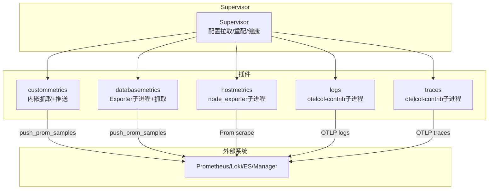
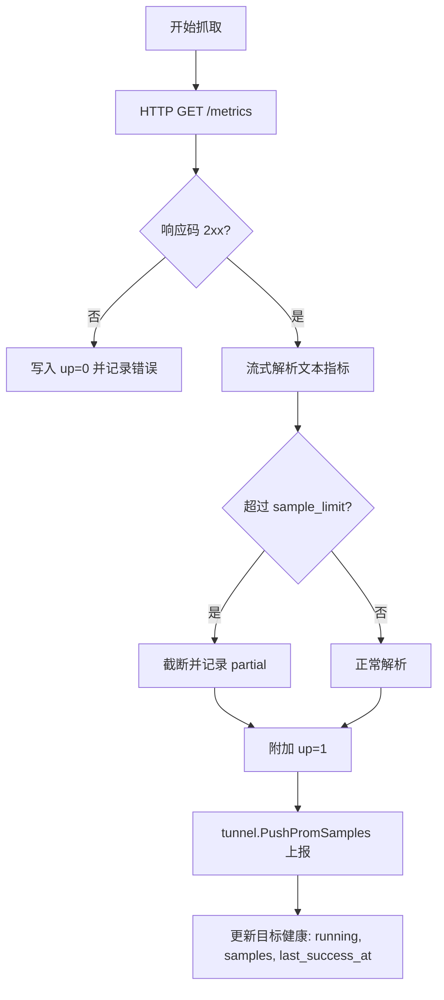
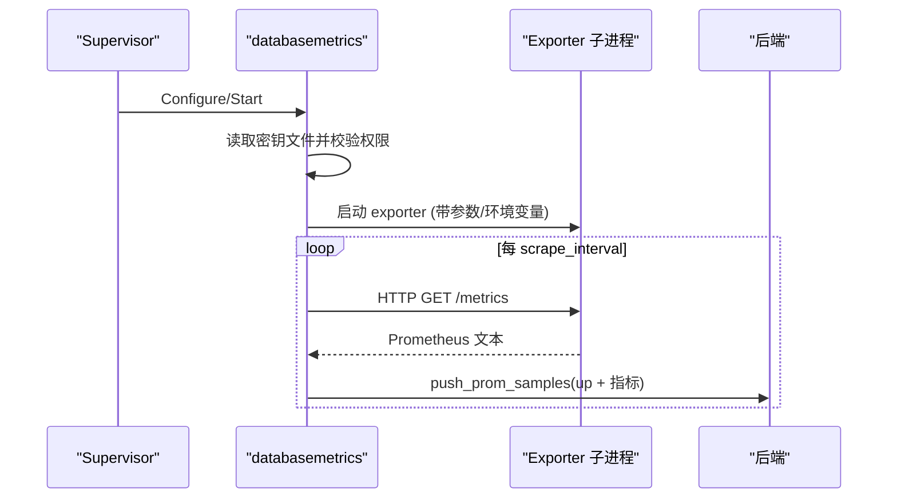
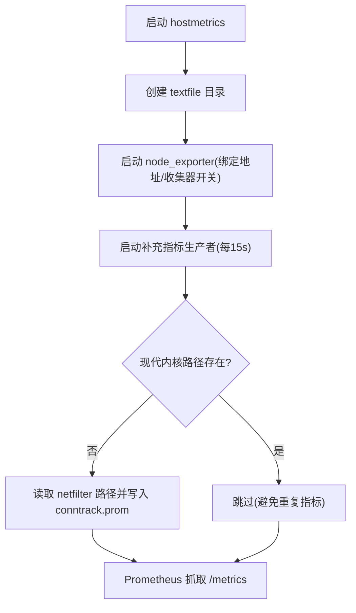
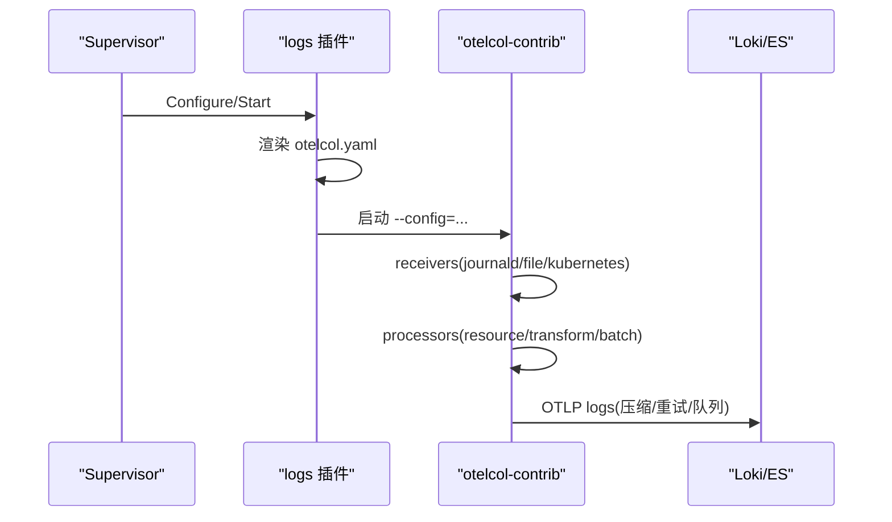
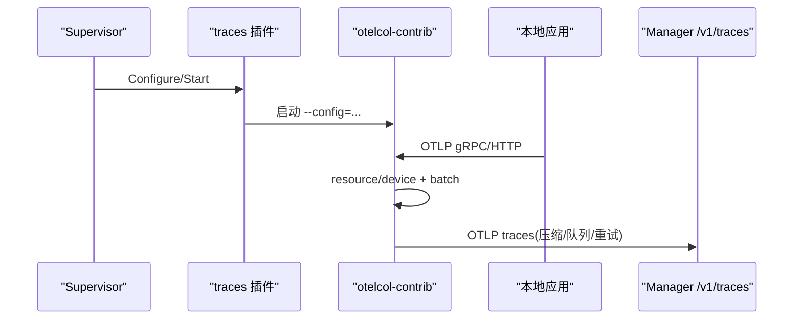
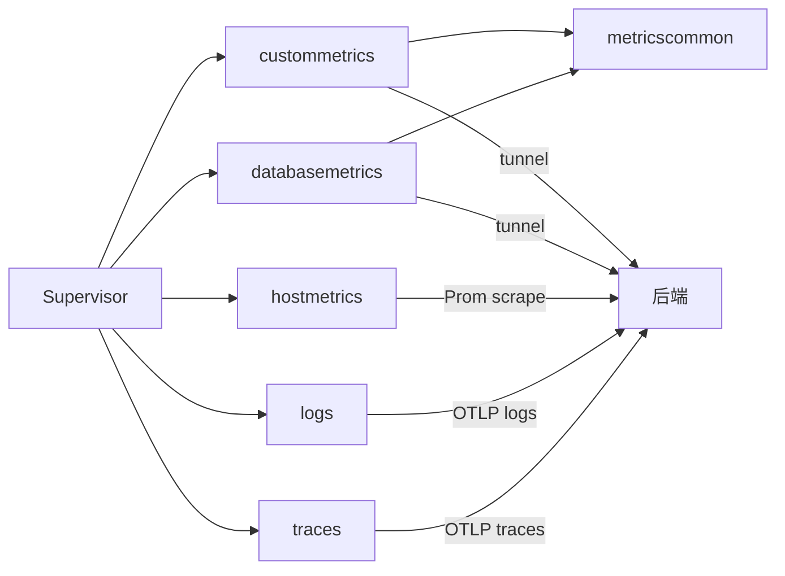

# 内置插件详解

<cite>
**本文引用的文件**
- [internal/edgeagent/plugins/plugin.go](file://internal/edgeagent/plugins/plugin.go)
- [internal/edgeagent/plugins/supervisor.go](file://internal/edgeagent/plugins/supervisor.go)
- [internal/edgeagent/plugins/custommetrics/plugin.go](file://internal/edgeagent/plugins/custommetrics/plugin.go)
- [internal/edgeagent/plugins/custommetrics/spec.go](file://internal/edgeagent/plugins/custommetrics/spec.go)
- [internal/edgeagent/plugins/databasemetrics/plugin.go](file://internal/edgeagent/plugins/databasemetrics/plugin.go)
- [internal/edgeagent/plugins/databasemetrics/spec.go](file://internal/edgeagent/plugins/databasemetrics/spec.go)
- [internal/edgeagent/plugins/hostmetrics/plugin.go](file://internal/edgeagent/plugins/hostmetrics/plugin.go)
- [internal/edgeagent/plugins/logs/plugin.go](file://internal/edgeagent/plugins/logs/plugin.go)
- [internal/edgeagent/plugins/logs/render.go](file://internal/edgeagent/plugins/logs/render.go)
- [internal/edgeagent/plugins/traces/plugin.go](file://internal/edgeagent/plugins/traces/plugin.go)
- [internal/edgeagent/plugins/traces/render.go](file://internal/edgeagent/plugins/traces/render.go)
- [internal/edgeagent/plugins/metricscommon/scrape.go](file://internal/edgeagent/plugins/metricscommon/scrape.go)
</cite>

## 目录
1. [简介](#简介)
2. [项目结构](#项目结构)
3. [核心组件](#核心组件)
4. [架构总览](#架构总览)
5. [详细组件分析](#详细组件分析)
6. [依赖关系分析](#依赖关系分析)
7. [性能考量](#性能考量)
8. [故障排查指南](#故障排查指南)
9. [结论](#结论)
10. [附录](#附录)

## 简介
本文件系统性梳理 Ongrid 边缘侧内置插件体系，覆盖 custommetrics（自定义指标）、databasemetrics（数据库指标）、hostmetrics（主机指标）、logs（日志采集）与 traces（链路追踪）五大插件。文档从插件职责、配置参数、数据格式与输出规范、OpenTelemetry 生态集成方式、性能特征、资源消耗、故障排查与最佳实践等维度展开，帮助读者快速理解并安全高效地使用这些插件。

## 项目结构
Ongrid 的插件子系统位于 internal/edgeagent/plugins，采用“统一接口 + 子进程/内嵌实现”的模式：
- 统一接口：所有插件实现统一的 Plugin 生命周期（Configure/Start/Stop/HealthSnapshot），由 Supervisor 统一管理注册、配置下发、启停与健康上报。
- 子进程插件：logs 与 traces 通过 otelcol-contrib 子进程运行；hostmetrics 通过 node_exporter 子进程运行；custommetrics 与 databasemetrics 为内嵌 Go 协程或子进程混合模式。
- 公共能力：metricscommon 提供 Prometheus 文本格式的流式抓取、限流、标签裁剪与 up/partial/accepted 状态指标生成。

图表来源
- [internal/edgeagent/plugins/supervisor.go:112-243](file://internal/edgeagent/plugins/supervisor.go#L112-L243)
- [internal/edgeagent/plugins/custommetrics/plugin.go:135-229](file://internal/edgeagent/plugins/custommetrics/plugin.go#L135-L229)
- [internal/edgeagent/plugins/databasemetrics/plugin.go:145-324](file://internal/edgeagent/plugins/databasemetrics/plugin.go#L145-L324)
- [internal/edgeagent/plugins/hostmetrics/plugin.go:62-148](file://internal/edgeagent/plugins/hostmetrics/plugin.go#L62-L148)
- [internal/edgeagent/plugins/logs/plugin.go:27-41](file://internal/edgeagent/plugins/logs/plugin.go#L27-L41)
- [internal/edgeagent/plugins/traces/plugin.go:31-49](file://internal/edgeagent/plugins/traces/plugin.go#L31-L49)

章节来源
- [internal/edgeagent/plugins/plugin.go:18-71](file://internal/edgeagent/plugins/plugin.go#L18-L71)
- [internal/edgeagent/plugins/supervisor.go:12-47](file://internal/edgeagent/plugins/supervisor.go#L12-L47)

## 核心组件
- 插件接口与配置
  - 插件统一生命周期：Configure → Start → HealthSnapshot → Stop，支持热重载与崩溃恢复。
  - 配置结构包含 enabled、edge_id、endpoint、auth_user/auth_pass、spec（插件特定 JSON）。
- 插件监管器（Supervisor）
  - 周期拉取配置并 diff 应用；新增启用则 Configure+Start；配置变更触发重新 Configure；停止时优雅关闭。
  - 支持可选 ReadyPlugin 等待就绪，再上报配置生效。
- 健康模型
  - 插件级健康：名称、状态、最近错误、重启次数、PID、启动时间、更新时间。
  - 目标级健康（多目标插件）：ID、名称、类型、状态、样本数、最近成功时间等。

章节来源
- [internal/edgeagent/plugins/plugin.go:18-135](file://internal/edgeagent/plugins/plugin.go#L18-L135)
- [internal/edgeagent/plugins/supervisor.go:49-110](file://internal/edgeagent/plugins/supervisor.go#L49-L110)
- [internal/edgeagent/plugins/supervisor.go:135-255](file://internal/edgeagent/plugins/supervisor.go#L135-L255)

## 架构总览
下图展示 Supervisor 与各插件的协作关系，以及数据流向后端（Prometheus/Loki/Elasticsearch/Manager OTLP 端点）。

```mermaid
sequenceDiagram
participant M as "管理器"
participant SV as "Supervisor"
participant CM as "custommetrics"
participant DB as "databasemetrics"
participant HM as "hostmetrics"
participant LG as "logs"
participant TR as "traces"
participant BE as "后端(Manager/Prom/Loki/ES)"
M->>SV : 推送插件配置
SV->>CM : Configure/Start
SV->>DB : Configure/Start
SV->>HM : Configure/Start
SV->>LG : Configure/Start
SV->>TR : Configure/Start
CM->>BE : push_prom_samples(指标)
DB->>BE : push_prom_samples(指标)
HM-->>BE : Prom scrape(/metrics)
LG->>BE : OTLP logs(直推)
TR->>BE : OTLP traces(直推)
SV->>M : 周期性健康快照
```

图表来源
- [internal/edgeagent/plugins/supervisor.go:112-243](file://internal/edgeagent/plugins/supervisor.go#L112-L243)
- [internal/edgeagent/plugins/custommetrics/plugin.go:187-229](file://internal/edgeagent/plugins/custommetrics/plugin.go#L187-L229)
- [internal/edgeagent/plugins/databasemetrics/plugin.go:276-324](file://internal/edgeagent/plugins/databasemetrics/plugin.go#L276-L324)
- [internal/edgeagent/plugins/hostmetrics/plugin.go:62-148](file://internal/edgeagent/plugins/hostmetrics/plugin.go#L62-L148)
- [internal/edgeagent/plugins/logs/plugin.go:27-41](file://internal/edgeagent/plugins/logs/plugin.go#L27-L41)
- [internal/edgeagent/plugins/traces/plugin.go:31-49](file://internal/edgeagent/plugins/traces/plugin.go#L31-L49)

## 详细组件分析

### custommetrics（自定义指标）
- 功能特性
  - 定时抓取一个或多个已有的 Prometheus /metrics 端点，本地解析后通过 tunnel 推送至 Manager。
  - 支持 per-target 的 scrape_interval、scrape_timeout、TLS 跳过校验、Bearer Token、Basic Auth、额外标签、采样上限、标签丢弃。
  - 自动产出 up 指标以反映目标可用性。
- 配置参数（spec）
  - targets: 数组，每项包含 id、target_url、scrape_interval、scrape_timeout、enabled、source_label、auth(bearer_token/username/password)、extra_labels、resource(category/type)、sample_limit、label_drop 等。
  - 资源分类：当 category=database 时，会附加 resource_category 与 db_type 标签，kind 设为具体数据库类型。
- 数据格式与输出
  - 使用 metricscommon 流式解析 Prometheus 文本格式，限制样本量，必要时返回 SampleLimitError。
  - 输出通过 tunnel.PushPromSamples 上报，附带 plugin/target_id/target_name/kind 等低基数标签。
- OpenTelemetry 集成
  - 不直接依赖 OTel Collector；通过 Manager 的数据面通道将指标送入后端（Prometheus/Loki 等）。
- 关键流程
  - 每个 target 独立协程按间隔抓取；失败时写入 up=0；成功追加 up=1 并推送。
  - 健康信息包含每个 target 的状态、样本数与最近成功时间。

图表来源
- [internal/edgeagent/plugins/custommetrics/plugin.go:135-229](file://internal/edgeagent/plugins/custommetrics/plugin.go#L135-L229)
- [internal/edgeagent/plugins/metricscommon/scrape.go:74-115](file://internal/edgeagent/plugins/metricscommon/scrape.go#L74-L115)
- [internal/edgeagent/plugins/metricscommon/scrape.go:150-190](file://internal/edgeagent/plugins/metricscommon/scrape.go#L150-L190)

章节来源
- [internal/edgeagent/plugins/custommetrics/plugin.go:1-291](file://internal/edgeagent/plugins/custommetrics/plugin.go#L1-L291)
- [internal/edgeagent/plugins/custommetrics/spec.go:13-112](file://internal/edgeagent/plugins/custommetrics/spec.go#L13-L112)
- [internal/edgeagent/plugins/metricscommon/scrape.go:22-51](file://internal/edgeagent/plugins/metricscommon/scrape.go#L22-L51)

### databasemetrics（数据库指标）
- 功能特性
  - 为每种数据库类型启动对应的 exporter 子进程（mysqld_exporter/postgres_exporter/redis_exporter/mongodb_exporter），并在本地监听端口暴露 /metrics。
  - 边端定时抓取 exporter 的 /metrics，经管道处理后通过 tunnel 上报。
  - 支持 TLS 选项、exporter 参数白名单映射、默认 label_drop、端口冲突检测。
- 配置参数（spec）
  - sources: 数组，每项包含 id、db_type、listen_address、connection(type=path)、tls、exporter、scrape_interval、scrape_timeout、source_label、extra_labels、sample_limit、label_drop 等。
  - connection.type 固定为 managed；connection.path 指向受管密钥文件（权限严格检查）。
- 数据格式与输出
  - 同 custommetrics，基于 metricscommon 抓取并上报；同时产出 up 指标。
- OpenTelemetry 集成
  - 不直接使用 OTel Collector；通过 Manager 数据面通道上报指标。
- 关键流程
  - 读取密钥文件 → 构造 exporter 命令与环境变量 → 启动子进程 → 定期抓取 → 上报 → 健康状态维护。
  - 子进程退出或抓取失败时指数退避重试。

图表来源
- [internal/edgeagent/plugins/databasemetrics/plugin.go:145-324](file://internal/edgeagent/plugins/databasemetrics/plugin.go#L145-L324)
- [internal/edgeagent/plugins/databasemetrics/spec.go:168-203](file://internal/edgeagent/plugins/databasemetrics/spec.go#L168-L203)

章节来源
- [internal/edgeagent/plugins/databasemetrics/plugin.go:1-403](file://internal/edgeagent/plugins/databasemetrics/plugin.go#L1-L403)
- [internal/edgeagent/plugins/databasemetrics/spec.go:54-166](file://internal/edgeagent/plugins/databasemetrics/spec.go#L54-L166)

### hostmetrics（主机指标）
- 功能特性
  - 启动 node_exporter 子进程，默认监听 :9102，暴露 node_* 指标。
  - 内嵌补充指标生产者，周期性写入 textfile 目录，供 node_exporter 的 textfile collector 采集（例如 nf_conntrack 在现代内核路径下的兼容补齐）。
- 配置参数（spec）
  - listen_address、collectors_enabled、collectors_disabled、extra_args。
  - 始终强制挂载 textfile 目录，确保补充指标可被采集。
- 数据格式与输出
  - 标准 Prometheus 文本格式，由 Manager 侧 Prometheus 通过 docker 桥接抓取。
- OpenTelemetry 集成
  - 不直接依赖 OTel Collector；走传统 Prometheus scrape 路径。
- 关键流程
  - 构建 node_exporter 参数 → 启动子进程 → 启动补充指标生产者 → 定期写入 conntrack.prom → 由 Prometheus 抓取。

图表来源
- [internal/edgeagent/plugins/hostmetrics/plugin.go:62-148](file://internal/edgeagent/plugins/hostmetrics/plugin.go#L62-L148)
- [internal/edgeagent/plugins/hostmetrics/plugin.go:150-231](file://internal/edgeagent/plugins/hostmetrics/plugin.go#L150-L231)

章节来源
- [internal/edgeagent/plugins/hostmetrics/plugin.go:1-277](file://internal/edgeagent/plugins/hostmetrics/plugin.go#L1-L277)

### logs（日志采集）
- 功能特性
  - 渲染并启动 otelcol-contrib 子进程，接收 journald/文件/Kubernetes Pod 日志，进行清洗、脱敏、资源属性注入、批处理，然后直推到 Manager Loki OTLP 或外部 Elasticsearch。
  - 支持内存限制、发送队列、重试、健康检查、Collector 自身指标暴露。
- 配置参数（spec）
  - backend: builtin_loki 或 external_elasticsearch。
  - mode: host 或 kubernetes；kubernetes 需 cluster_id/node_name/pod_log_path。
  - file sources: id/service_name/dataset/include/exclude/parser(regex/json/plain)/multiline/start_at/exclude_older_than 等。
  - 其他：extra_labels/extra_attrs、loki_auth_mode、elasticsearch_endpoints/api_key_file/ca_file、memory_limit_mib/spike_limit_mib 等。
- 数据格式与输出
  - 内部使用 OTLP Logs 协议；对 Loki 使用 OTLP HTTP 端点；对 ES 使用 elasticsearch exporter（限定 mapping.mode=otel）。
  - 自动注入 device_id、cluster_id、cluster_name、k8s.* 等资源属性，并对敏感字段进行脱敏与键名匹配删除。
- OpenTelemetry 集成
  - 完全基于 otelcol-contrib；通过渲染的 YAML 配置驱动 pipeline。
- 关键流程
  - 渲染配置 → 启动子进程 → 接收日志 → 处理器链（资源注入/转换/批处理）→ 导出到后端。

图表来源
- [internal/edgeagent/plugins/logs/plugin.go:27-41](file://internal/edgeagent/plugins/logs/plugin.go#L27-L41)
- [internal/edgeagent/plugins/logs/render.go:55-251](file://internal/edgeagent/plugins/logs/render.go#L55-L251)
- [internal/edgeagent/plugins/logs/render.go:502-600](file://internal/edgeagent/plugins/logs/render.go#L502-L600)

章节来源
- [internal/edgeagent/plugins/logs/plugin.go:1-42](file://internal/edgeagent/plugins/logs/plugin.go#L1-L42)
- [internal/edgeagent/plugins/logs/render.go:1-800](file://internal/edgeagent/plugins/logs/render.go#L1-L800)

### traces（链路追踪）
- 功能特性
  - 渲染并启动 otelcol-contrib 子进程，接受本地 OTLP gRPC/HTTP，注入设备与集群资源属性，批处理后直推 Manager /v1/traces。
  - 可选开启 Kubernetes 属性增强、日志旁路（Loki）、指标旁路（Prometheus Remote Write 或 Gateway）。
- 配置参数（spec）
  - grpc_endpoint/http_endpoint、extra_attrs、tls_insecure_skip_verify、omit_device_id、enable_k8sattributes。
  - enable_logs 时需 logs_endpoint；enable_metrics 时需 metrics_export_endpoint 或 metrics_remote_write_endpoint。
  - bounded_pipelines 时可配置 memory_limit_mib、spike_limit_mib、batch_send_size、batch_max_size、queue_size。
- 数据格式与输出
  - 使用 OTLP Traces 协议；默认 gzip 压缩、队列与重试；健康检查端口与 Collector 指标暴露。
- OpenTelemetry 集成
  - 完全基于 otelcol-contrib；模板化渲染配置，保证稳定输出顺序。
- 关键流程
  - 渲染配置 → 启动子进程 → 接收 OTLP → 资源注入 → 批处理 → 导出到 Manager。

图表来源
- [internal/edgeagent/plugins/traces/plugin.go:31-49](file://internal/edgeagent/plugins/traces/plugin.go#L31-L49)
- [internal/edgeagent/plugins/traces/render.go:263-423](file://internal/edgeagent/plugins/traces/render.go#L263-L423)

章节来源
- [internal/edgeagent/plugins/traces/plugin.go:1-50](file://internal/edgeagent/plugins/traces/plugin.go#L1-L50)
- [internal/edgeagent/plugins/traces/render.go:1-530](file://internal/edgeagent/plugins/traces/render.go#L1-L530)

## 依赖关系分析
- 插件与 Supervisor
  - 所有插件通过统一接口接入 Supervisor；Supervisor 负责配置拉取、差异对比、启停与健康上报。
- 插件与后端
  - custommetrics/databasemetrics：通过 tunnel 推送 Prometheus 样本。
  - hostmetrics：Prometheus 抓取 node_exporter 暴露的 /metrics。
  - logs/traces：通过 otelcol-contrib 直推后端（Loki/ES/Manager OTLP）。
- 公共库
  - metricscommon：提供安全的流式抓取、限流、标签控制与 up/partial/accepted 指标。

图表来源
- [internal/edgeagent/plugins/supervisor.go:112-243](file://internal/edgeagent/plugins/supervisor.go#L112-L243)
- [internal/edgeagent/plugins/metricscommon/scrape.go:74-115](file://internal/edgeagent/plugins/metricscommon/scrape.go#L74-L115)

章节来源
- [internal/edgeagent/plugins/supervisor.go:12-47](file://internal/edgeagent/plugins/supervisor.go#L12-L47)
- [internal/edgeagent/plugins/metricscommon/scrape.go:1-51](file://internal/edgeagent/plugins/metricscommon/scrape.go#L1-L51)

## 性能考量
- 抓取与限流
  - metricscommon 使用流式解析，遇到超出 sample_limit 即停止读取，避免内存与带宽峰值。
  - 默认抓取间隔 30s，超时 5s；可按目标调整。
- 子进程隔离
  - databasemetrics 为每个数据库源启动独立 exporter 子进程，便于隔离与回滚；退出时指数退避重试。
  - hostmetrics 使用 node_exporter 子进程；补充指标以 15s 周期写入 textfile，与常见 Prom scrape 节奏匹配。
- 日志与追踪
  - logs/traces 使用 otelcol-contrib 的 sending_queue、retry_on_failure、memory_limiter（可选 bounded pipelines）与批量处理器，平衡吞吐与延迟。
  - 默认 gzip 压缩，减少网络开销；队列大小与批次大小可按负载调优。
- 资源占用建议
  - 合理设置 sample_limit、scrape_interval、timeout，避免高基数字段导致指标爆炸。
  - 在受限环境启用 bounded_pipelines，限制内存与队列规模。
  - 谨慎配置 extra_labels/extra_attrs，避免引入高基数维度。

[本节为通用指导，无需引用具体文件]

## 故障排查指南
- 插件未启动或频繁重启
  - 检查 Supervisor 日志中的“starting/stopping/reload”记录，确认配置是否生效。
  - 查看插件 HealthSnapshot 的 state、last_error、restart_count。
- custommetrics 抓取失败
  - 确认 target_url 可达、认证头正确、TLS 策略一致；检查 up 指标是否为 0。
  - 若出现 SampleLimitError，降低 sample_limit 或优化指标基数。
- databasemetrics 子进程异常
  - 检查 exporter 二进制是否存在、密钥文件路径与权限（必须 0600 或更严格）。
  - 关注 exporter 日志与退出码；根据错误调整 exporter 参数或连接串。
- hostmetrics 无 conntrack 指标
  - 确认内核路径存在性；若旧内核路径存在，插件会跳过以避免重复指标。
- logs/traces 无法推送
  - 验证 Endpoint、AuthUser/AuthPass 或 Bearer Token；检查 TLS 跳过策略与实际证书一致性。
  - 查看 otelcol 子进程日志与本地健康检查端口（logs: 13134，traces: 13133）。
  - 对于 Elasticsearch，确认 endpoints、api_key_file、ca_file 与 allowed mapping 模式。

章节来源
- [internal/edgeagent/plugins/supervisor.go:135-255](file://internal/edgeagent/plugins/supervisor.go#L135-L255)
- [internal/edgeagent/plugins/custommetrics/plugin.go:187-229](file://internal/edgeagent/plugins/custommetrics/plugin.go#L187-L229)
- [internal/edgeagent/plugins/databasemetrics/plugin.go:220-324](file://internal/edgeagent/plugins/databasemetrics/plugin.go#L220-L324)
- [internal/edgeagent/plugins/hostmetrics/plugin.go:191-231](file://internal/edgeagent/plugins/hostmetrics/plugin.go#L191-L231)
- [internal/edgeagent/plugins/logs/render.go:502-600](file://internal/edgeagent/plugins/logs/render.go#L502-L600)
- [internal/edgeagent/plugins/traces/render.go:285-423](file://internal/edgeagent/plugins/traces/render.go#L285-L423)

## 结论
Ongrid 内置插件以统一接口与 Supervisor 为核心，实现了指标、日志、追踪三类遥测数据的标准化采集与上报。custommetrics 与 databasemetrics 聚焦指标，灵活对接现有 /metrics 与数据库 exporter；hostmetrics 通过 node_exporter 提供主机维度指标；logs 与 traces 借助 otelcol-contrib 完成强大的数据处理与可靠传输。通过合理的配置与调优，可在不同环境下获得稳定、可扩展且易运维的观测能力。

[本节为总结性内容，无需引用具体文件]

## 附录
- 配置示例要点
  - custommetrics：targets 中至少包含 id 与 target_url；按需配置 auth、extra_labels、sample_limit。
  - databasemetrics：sources 中指定 db_type 与 connection.path；注意端口冲突与 exporter 白名单。
  - hostmetrics：listen_address 默认 :9102；可通过 collectors_enabled/disabled 精细控制收集器。
  - logs：选择 backend（builtin_loki/external_elasticsearch），mode（host/kubernetes），并确保至少一个日志源。
  - traces：设置 endpoint 与鉴权；如需日志/指标旁路，启用对应开关并提供必要端点。
- 最佳实践
  - 严格控制指标基数与采样频率，避免资源浪费。
  - 使用 bounded_pipelines 与合适的队列/批次大小，保障稳定性。
  - 对敏感数据进行脱敏与键名过滤，避免泄露。
  - 为子进程插件预留足够磁盘空间用于存储与日志。
  - 定期审查插件健康状态与错误日志，及时处置异常。

[本节为通用指导，无需引用具体文件]