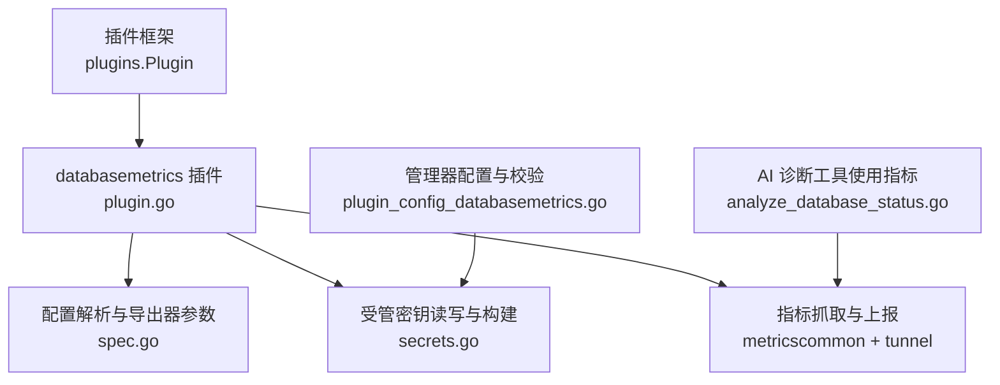
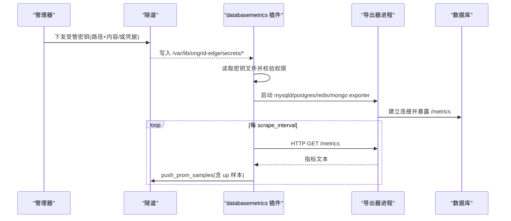
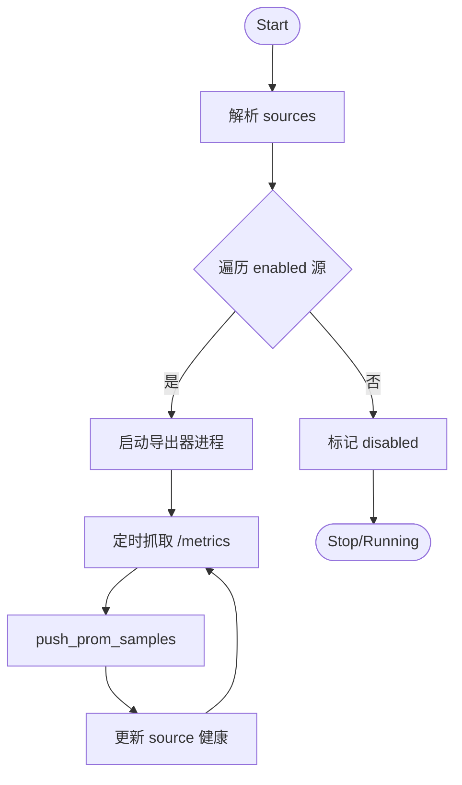
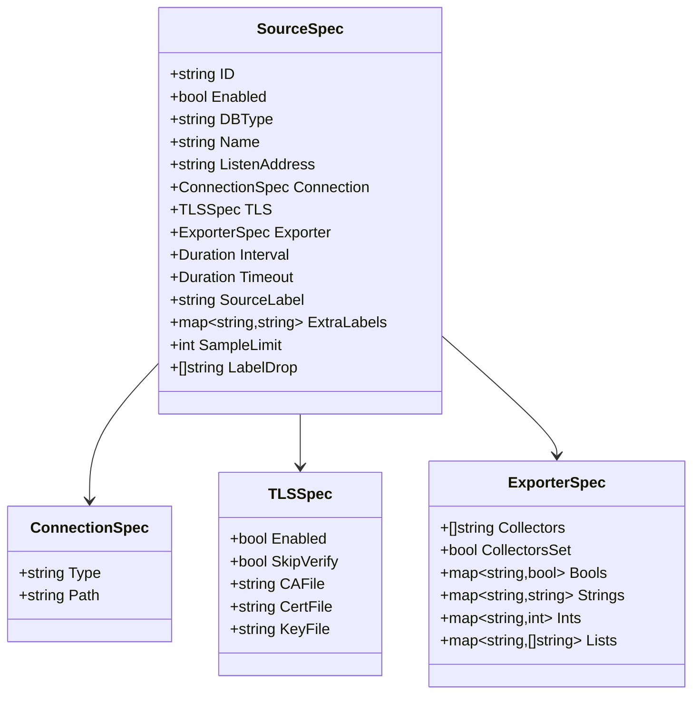
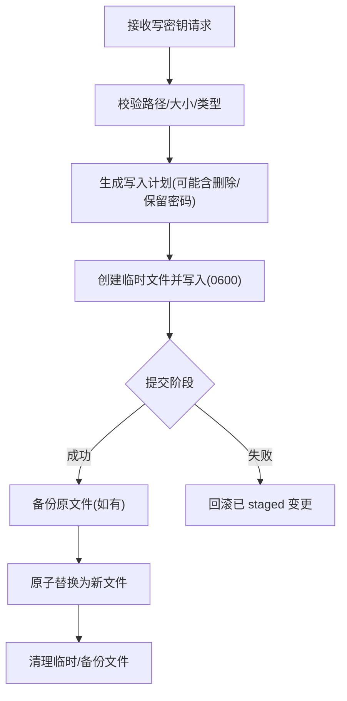
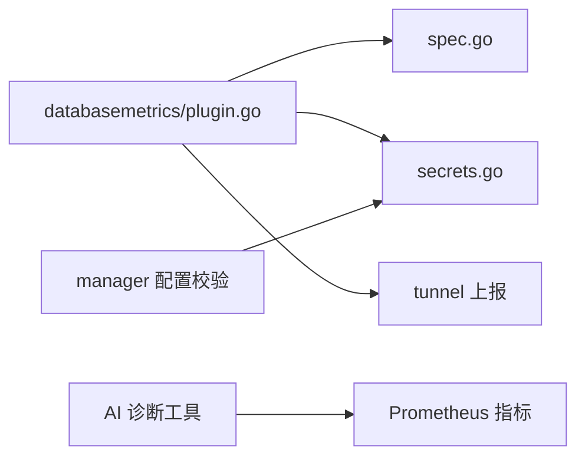

# 数据库指标插件

<cite>
**本文引用的文件**
- [internal/edgeagent/plugins/databasemetrics/plugin.go](file://internal/edgeagent/plugins/databasemetrics/plugin.go)
- [internal/edgeagent/plugins/databasemetrics/spec.go](file://internal/edgeagent/plugins/databasemetrics/spec.go)
- [internal/edgeagent/plugins/databasemetrics/secrets.go](file://internal/edgeagent/plugins/databasemetrics/secrets.go)
- [internal/edgeagent/plugins/plugin.go](file://internal/edgeagent/plugins/plugin.go)
- [internal/manager/biz/edge/plugin_config_databasemetrics.go](file://internal/manager/biz/edge/plugin_config_databasemetrics.go)
- [internal/manager/biz/aiops/tools/analyze_database_status.go](file://internal/manager/biz/aiops/tools/analyze_database_status.go)
- [internal/manager/biz/knowledge/builtin_vault/diagnostics/db-connection-pool-exhaustion.md](file://internal/manager/biz/knowledge/builtin_vault/diagnostics/db-connection-pool-exhaustion.md)
</cite>

## 目录
1. [简介](#简介)
2. [项目结构](#项目结构)
3. [核心组件](#核心组件)
4. [架构总览](#架构总览)
5. [详细组件分析](#详细组件分析)
6. [依赖关系分析](#依赖关系分析)
7. [性能与调优](#性能与调优)
8. [故障排除指南](#故障排除指南)
9. [结论](#结论)
10. [附录：配置示例与最佳实践](#附录：配置示例与最佳实践)

## 简介
本插件为边缘侧“数据库指标采集”能力，支持 MySQL、PostgreSQL、Redis、MongoDB 四类数据库。其核心思路是：为每个数据库源启动一个独立的导出器子进程（mysqld_exporter、postgres_exporter、redis_exporter、mongodb_exporter），按周期抓取指标并通过隧道上报到管理器。连接凭据以受管密钥形式写入本地安全目录，插件在运行期读取并注入到导出器进程，避免将敏感信息持久化在配置中。

## 项目结构
- 插件运行时接口与生命周期由通用插件框架提供，databasemetrics 作为具体实现之一。
- 配置解析、导出器参数映射、监听端口管理集中在 spec.go。
- 凭据写入、校验、格式构建集中在 secrets.go。
- 插件主流程（启动/停止/健康上报/重试）在 plugin.go。
- 管理器侧负责配置校验、生成边端可执行的密钥内容，并通过隧道下发。

**图表来源**
- [internal/edgeagent/plugins/plugin.go:18-108](file://internal/edgeagent/plugins/plugin.go#L18-L108)
- [internal/edgeagent/plugins/databasemetrics/plugin.go:1-135](file://internal/edgeagent/plugins/databasemetrics/plugin.go#L1-L135)
- [internal/edgeagent/plugins/databasemetrics/spec.go:54-166](file://internal/edgeagent/plugins/databasemetrics/spec.go#L54-L166)
- [internal/edgeagent/plugins/databasemetrics/secrets.go:24-51](file://internal/edgeagent/plugins/databasemetrics/secrets.go#L24-L51)
- [internal/manager/biz/edge/plugin_config_databasemetrics.go:328-343](file://internal/manager/biz/edge/plugin_config_databasemetrics.go#L328-L343)

**章节来源**
- [internal/edgeagent/plugins/plugin.go:18-108](file://internal/edgeagent/plugins/plugin.go#L18-L108)
- [internal/edgeagent/plugins/databasemetrics/plugin.go:1-135](file://internal/edgeagent/plugins/databasemetrics/plugin.go#L1-L135)
- [internal/edgeagent/plugins/databasemetrics/spec.go:54-166](file://internal/edgeagent/plugins/databasemetrics/spec.go#L54-L166)
- [internal/edgeagent/plugins/databasemetrics/secrets.go:24-51](file://internal/edgeagent/plugins/databasemetrics/secrets.go#L24-L51)
- [internal/manager/biz/edge/plugin_config_databasemetrics.go:328-343](file://internal/manager/biz/edge/plugin_config_databasemetrics.go#L328-L343)

## 核心组件
- 插件生命周期管理：Configure → Start → HealthSnapshot → Stop，支持多目标健康状态上报。
- 配置解析：sources 数组定义多个数据库源；每个源包含 id、db_type、listen_address、connection、tls、exporter、scrape_interval、scrape_timeout、sample_limit、label_drop 等。
- 导出器编排：根据 db_type 选择对应 exporter 二进制，组装命令行参数与环境变量，启动子进程并按周期抓取 /metrics。
- 受管密钥：通过隧道一次性下发，落盘至固定目录，严格权限控制；支持保留密码更新、原子替换与回滚。
- 指标上报：抓取后附加 up 样本，经隧道 push_prom_samples 上报。

**章节来源**
- [internal/edgeagent/plugins/databasemetrics/plugin.go:77-143](file://internal/edgeagent/plugins/databasemetrics/plugin.go#L77-L143)
- [internal/edgeagent/plugins/databasemetrics/spec.go:54-166](file://internal/edgeagent/plugins/databasemetrics/spec.go#L54-L166)
- [internal/edgeagent/plugins/databasemetrics/secrets.go:71-108](file://internal/edgeagent/plugins/databasemetrics/secrets.go#L71-L108)

## 架构总览

**图表来源**
- [internal/edgeagent/plugins/databasemetrics/secrets.go:24-51](file://internal/edgeagent/plugins/databasemetrics/secrets.go#L24-L51)
- [internal/edgeagent/plugins/databasemetrics/plugin.go:220-274](file://internal/edgeagent/plugins/databasemetrics/plugin.go#L220-L274)
- [internal/edgeagent/plugins/databasemetrics/plugin.go:308-324](file://internal/edgeagent/plugins/databasemetrics/plugin.go#L308-L324)

## 详细组件分析

### 插件生命周期与健康
- Configure：解析 sources，重置各 source 的健康状态。
- Start：启动 run 协程，为每个 enabled 的 source 启动导出器并周期性抓取。
- Stop：取消上下文，等待子进程退出，超时保护。
- HealthSnapshot：聚合插件与各 source 的状态、错误、采样数、最近成功时间。

**图表来源**
- [internal/edgeagent/plugins/databasemetrics/plugin.go:89-176](file://internal/edgeagent/plugins/databasemetrics/plugin.go#L89-L176)
- [internal/edgeagent/plugins/databasemetrics/plugin.go:276-296](file://internal/edgeagent/plugins/databasemetrics/plugin.go#L276-L296)

**章节来源**
- [internal/edgeagent/plugins/databasemetrics/plugin.go:77-176](file://internal/edgeagent/plugins/databasemetrics/plugin.go#L77-L176)
- [internal/edgeagent/plugins/databasemetrics/plugin.go:351-403](file://internal/edgeagent/plugins/databasemetrics/plugin.go#L351-L403)

### 配置解析与导出器参数映射
- 支持的 db_type：mysql、postgresql、redis、mongodb。
- listen_address：默认按 db_type 分配不同端口，且冲突检测与保留端口保护。
- connection.type：仅允许 managed；path 指向受管密钥文件。
- tls：skip_verify 会禁用 CA/Cert/Key；enabled 影响 scheme（如 Redis rediss）。
- exporter：按 db_type 白名单校验字段类型（bool/string/int/list），并转换为对应导出器 CLI 参数。
- label_drop：默认丢弃 query/statement/collection 等高基数标签，降低存储压力。

**图表来源**
- [internal/edgeagent/plugins/databasemetrics/spec.go:15-52](file://internal/edgeagent/plugins/databasemetrics/spec.go#L15-L52)

**章节来源**
- [internal/edgeagent/plugins/databasemetrics/spec.go:54-166](file://internal/edgeagent/plugins/databasemetrics/spec.go#L54-L166)
- [internal/edgeagent/plugins/databasemetrics/spec.go:168-249](file://internal/edgeagent/plugins/databasemetrics/spec.go#L168-L249)
- [internal/edgeagent/plugins/databasemetrics/spec.go:390-423](file://internal/edgeagent/plugins/databasemetrics/spec.go#L390-L423)
- [internal/edgeagent/plugins/databasemetrics/spec.go:425-558](file://internal/edgeagent/plugins/databasemetrics/spec.go#L425-L558)

### 受管密钥与认证机制
- 密钥写入：通过隧道注册处理器，仅接受 /var/lib/ongrid-edge/secrets 下的绝对路径，拒绝符号链接，限制最大内容大小。
- 格式构建：
  - MySQL：生成 .my.cnf 片段（client 段）。
  - PostgreSQL：生成 DSN（含 sslmode、sslrootcert/cert/key）。
  - Redis：生成 redis/rediss URI（含 DB index）。
  - MongoDB：生成 mongodb URI（含 authSource、tls/tlsInsecure/tlsCAFile/tlsCertificateKeyFile）。
- 权限与安全：文件权限 0600；读取时校验权限过宽则报错；删除操作先备份再原子替换。
- 保留密码：当未显式传入 password 且 PreservePassword=true 时，从现有文件中提取并保留。

**图表来源**
- [internal/edgeagent/plugins/databasemetrics/secrets.go:71-108](file://internal/edgeagent/plugins/databasemetrics/secrets.go#L71-L108)
- [internal/edgeagent/plugins/databasemetrics/secrets.go:398-476](file://internal/edgeagent/plugins/databasemetrics/secrets.go#L398-L476)
- [internal/edgeagent/plugins/databasemetrics/secrets.go:496-637](file://internal/edgeagent/plugins/databasemetrics/secrets.go#L496-L637)

**章节来源**
- [internal/edgeagent/plugins/databasemetrics/secrets.go:24-51](file://internal/edgeagent/plugins/databasemetrics/secrets.go#L24-L51)
- [internal/edgeagent/plugins/databasemetrics/secrets.go:153-338](file://internal/edgeagent/plugins/databasemetrics/secrets.go#L153-L338)
- [internal/edgeagent/plugins/databasemetrics/secrets.go:398-637](file://internal/edgeagent/plugins/databasemetrics/secrets.go#L398-L637)

### 各数据库类型的指标收集方法
- MySQL：通过 mysqld_exporter，启用 collectors（如 global_status、processlist、perf_schema.*），可通过布尔/字符串/整数/列表参数精细控制。
- PostgreSQL：通过 postgres_exporter，基于 DSN 连接，支持自动发现数据库、统计语句、WAL、锁等 collector。
- Redis：通过 redis_exporter，支持集群、Sentinel、模块指标、键/流检查等，URI 支持 TLS。
- MongoDB：通过 mongodb_exporter，支持 diagnosticdata、replicasetstatus、fcv 等 collector，URI 支持 TLS 与认证源。

注意：插件默认对高基数字段进行 label_drop（如 query/statement/collection），以降低指标基数与存储成本。

**章节来源**
- [internal/edgeagent/plugins/databasemetrics/spec.go:168-249](file://internal/edgeagent/plugins/databasemetrics/spec.go#L168-L249)
- [internal/edgeagent/plugins/databasemetrics/spec.go:560-774](file://internal/edgeagent/plugins/databasemetrics/spec.go#L560-L774)
- [internal/edgeagent/plugins/databasemetrics/spec.go:414-423](file://internal/edgeagent/plugins/databasemetrics/spec.go#L414-L423)

### 数据隐私与敏感信息处理
- 密钥不落配置：配置中仅保存 connection.path，真实凭据由管理器通过隧道写入受限目录。
- 最小权限：文件权限强制 0600；读取时校验；禁止符号链接；路径必须位于指定根目录。
- 传输安全：管理器到边端的密钥下发走隧道通道；指标上报走 push_prom_samples。
- 日志脱敏：导出器日志输出到工作目录文件，避免在控制台泄露敏感信息。

**章节来源**
- [internal/edgeagent/plugins/databasemetrics/plugin.go:326-349](file://internal/edgeagent/plugins/databasemetrics/plugin.go#L326-L349)
- [internal/edgeagent/plugins/databasemetrics/secrets.go:478-494](file://internal/edgeagent/plugins/databasemetrics/secrets.go#L478-L494)
- [internal/edgeagent/plugins/databasemetrics/secrets.go:513-556](file://internal/edgeagent/plugins/databasemetrics/secrets.go#L513-L556)

## 依赖关系分析
- 插件框架：统一生命周期与健康管理。
- 配置层：spec.go 将 JSON 配置映射为导出器 CLI 参数与环境变量。
- 密钥层：secrets.go 负责受管密钥的写入、校验、格式转换。
- 执行层：plugin.go 启动导出器子进程，周期抓取并上报。
- 管理器：plugin_config_databasemetrics.go 负责配置校验与密钥内容生成；AI 诊断工具 consume 指标进行分析。

**图表来源**
- [internal/edgeagent/plugins/databasemetrics/plugin.go:220-324](file://internal/edgeagent/plugins/databasemetrics/plugin.go#L220-L324)
- [internal/manager/biz/edge/plugin_config_databasemetrics.go:328-343](file://internal/manager/biz/edge/plugin_config_databasemetrics.go#L328-L343)
- [internal/manager/biz/aiops/tools/analyze_database_status.go:1329-1345](file://internal/manager/biz/aiops/tools/analyze_database_status.go#L1329-L1345)

**章节来源**
- [internal/edgeagent/plugins/databasemetrics/plugin.go:220-324](file://internal/edgeagent/plugins/databasemetrics/plugin.go#L220-L324)
- [internal/manager/biz/edge/plugin_config_databasemetrics.go:328-343](file://internal/manager/biz/edge/plugin_config_databasemetrics.go#L328-L343)
- [internal/manager/biz/aiops/tools/analyze_database_status.go:1329-1345](file://internal/manager/biz/aiops/tools/analyze_database_status.go#L1329-L1345)

## 性能与调优
- 抓取间隔与超时：scrape_interval 与 scrape_timeout 需合理设置，确保 timeout ≤ interval。
- 指标基数控制：利用 label_drop 丢弃高基数标签（query/statement/collection），减少存储与查询开销。
- 导出器参数优化：
  - MySQL：按需启用 collectors，调整 processlist/min_time、eventsstatements limit/timelimit、file_instances filter 等。
  - PostgreSQL：控制 stat_statements limit/query_length、exclude/include databases、WAL/locks 等 collector。
  - Redis：合理设置 check_keys/check_streams 批大小与数量，避免大 key 扫描。
  - MongoDB：限定 collstats/indexstats 集合范围，控制 profile-time-ts 与 connect-timeout-ms。
- 连接池与服务器上限：关注客户端连接池与数据库 max_connections，避免耗尽导致延迟飙升或连接失败。

[本节为通用指导，不直接分析具体代码文件]

## 故障排除指南
- 插件崩溃/重启：查看插件健康快照中的 last_error 与 restart_count；导出器日志在工作目录以 source.id.log 命名。
- 导出器无法启动：确认二进制存在、监听端口未被占用、TLS 证书路径正确、密钥文件权限 0600。
- 抓取失败：检查 scrape_timeout 是否小于网络抖动；核对 exporter 参数与数据库版本兼容性。
- 连接失败：验证密钥内容格式（MySQL .my.cnf、PostgreSQL DSN、Redis URI、MongoDB URI）；确认 host/port/database/auth_source。
- 连接池耗尽：参考知识库文档，检查服务端 Threads_connected/max_connections 或 pg_stat_activity，以及客户端 pool 配置。

**章节来源**
- [internal/edgeagent/plugins/databasemetrics/plugin.go:145-218](file://internal/edgeagent/plugins/databasemetrics/plugin.go#L145-L218)
- [internal/edgeagent/plugins/databasemetrics/plugin.go:326-349](file://internal/edgeagent/plugins/databasemetrics/plugin.go#L326-L349)
- [internal/manager/biz/knowledge/builtin_vault/diagnostics/db-connection-pool-exhaustion.md:1-92](file://internal/manager/biz/knowledge/builtin_vault/diagnostics/db-connection-pool-exhaustion.md#L1-L92)

## 结论
databasemetrics 插件通过“受管密钥 + 独立导出器进程 + 周期抓取上报”的模式，为多种数据库提供了统一的指标采集能力。其设计强调安全性（密钥隔离与权限控制）、可观测性（健康快照与日志）、可扩展性（按 db_type 白名单映射导出器参数）。在生产环境中，建议结合 label_drop 与合理的 scrape 策略，配合连接池与服务器上限监控，实现稳定高效的数据库可观测性。

## 附录：配置示例与最佳实践

### 支持的数据库类型与默认监听端口
- MySQL：127.0.0.1:19104
- PostgreSQL：127.0.0.1:19187
- Redis：127.0.0.1:19121
- MongoDB：127.0.0.1:19216

**章节来源**
- [internal/edgeagent/plugins/databasemetrics/spec.go:399-412](file://internal/edgeagent/plugins/databasemetrics/spec.go#L399-L412)

### 配置项说明（节选）
- sources[].id：唯一标识，用于生成密钥路径与指标标签。
- sources[].db_type：mysql/postgresql/redis/mongodb。
- sources[].listen_address：可选，默认按 db_type 分配。
- sources[].connection.type：仅支持 managed。
- sources[].connection.path：受管密钥文件绝对路径。
- sources[].tls.skip_verify：跳过证书校验（生产环境不建议）。
- sources[].exporter.*：按 db_type 白名单配置的导出器参数。
- sources[].scrape_interval/scrape_timeout：抓取周期与超时。
- sources[].sample_limit：单次抓取最大样本数。
- sources[].label_drop：丢弃的高基数字段列表。

**章节来源**
- [internal/edgeagent/plugins/databasemetrics/spec.go:54-166](file://internal/edgeagent/plugins/databasemetrics/spec.go#L54-L166)
- [internal/edgeagent/plugins/databasemetrics/spec.go:414-423](file://internal/edgeagent/plugins/databasemetrics/spec.go#L414-L423)

### 各数据库密钥内容与路径
- MySQL：.my.cnf 片段，路径后缀 .my.cnf。
- PostgreSQL：DSN，路径后缀 .dsn。
- Redis：URI，路径后缀 .dsn。
- MongoDB：URI，路径后缀 .dsn。

**章节来源**
- [internal/manager/biz/edge/plugin_config_databasemetrics.go:328-334](file://internal/manager/biz/edge/plugin_config_databasemetrics.go#L328-L334)
- [internal/edgeagent/plugins/databasemetrics/secrets.go:243-338](file://internal/edgeagent/plugins/databasemetrics/secrets.go#L243-L338)

### 最佳实践
- 使用受管密钥：不要将凭据放入配置；通过管理器下发到受限目录。
- 严格控制权限：密钥文件 0600，禁止符号链接，路径必须在允许目录内。
- 合理设置抓取频率：在高负载环境下适当增大 interval，缩短 timeout 以避免阻塞。
- 控制指标基数：启用 label_drop 丢弃 query/statement/collection 等高基数字段。
- 按需启用 collectors：只开启需要的指标，减少数据库压力与存储成本。
- 监控连接池与服务器上限：结合服务端指标与客户端配置，避免连接耗尽。

[本节为通用指导，不直接分析具体代码文件]