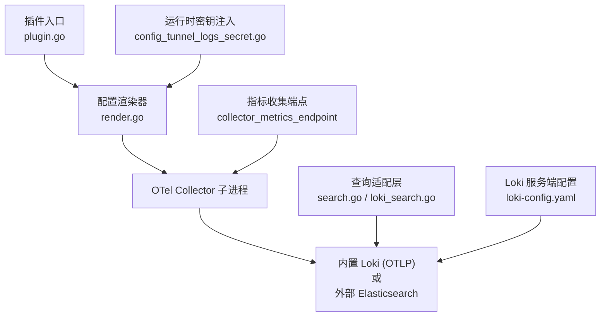
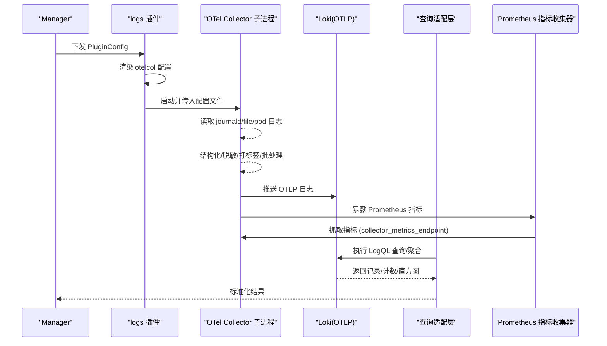
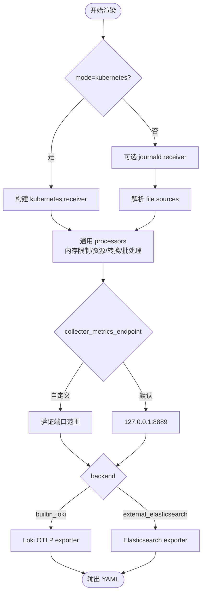
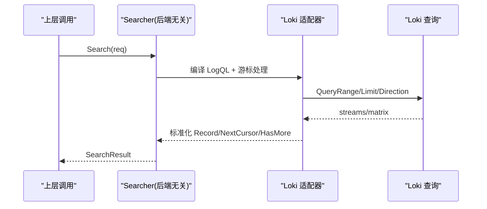
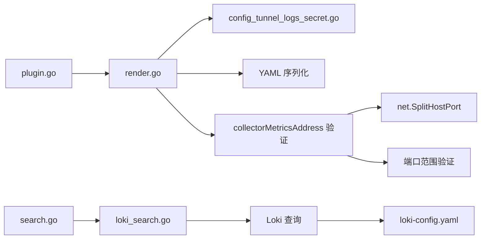

# 日志采集插件

<cite>
**本文引用的文件**
- [internal/edgeagent/plugins/logs/plugin.go](file://internal/edgeagent/plugins/logs/plugin.go)
- [internal/edgeagent/plugins/logs/render.go](file://internal/edgeagent/plugins/logs/render.go)
- [internal/edgeagent/plugins/config_tunnel_logs_secret.go](file://internal/edgeagent/plugins/config_tunnel_logs_secret.go)
- [internal/pkg/logquery/search.go](file://internal/pkg/logquery/search.go)
- [internal/pkg/logquery/loki_search.go](file://internal/pkg/logquery/loki_search.go)
- [deploy/install/loki-config.yaml](file://deploy/install/loki-config.yaml)
- [internal/manager/biz/knowledge/builtin_vault/diagnostics/loki-ingestion-backpressure.md](file://internal/manager/biz/knowledge/builtin_vault/diagnostics/loki-ingestion-backpressure.md)
- [cmd/ongrid-edge/k8s_data_plane.go](file://cmd/ongrid-edge/k8s_data_plane.go)
</cite>

## 更新摘要
**所做更改**
- 新增了 collector_metrics_endpoint 配置项说明，允许自定义指标收集端点地址
- 添加了端口冲突解决方案的详细描述
- 增加了相应的验证逻辑说明
- 更新了架构图中关于指标收集的组件
- 补充了故障排查指南中关于端口冲突的处理方法

## 目录
1. [简介](#简介)
2. [项目结构](#项目结构)
3. [核心组件](#核心组件)
4. [架构总览](#架构总览)
5. [详细组件分析](#详细组件分析)
6. [依赖关系分析](#依赖关系分析)
7. [性能与容量规划](#性能与容量规划)
8. [故障排查指南](#故障排查指南)
9. [结论](#结论)
10. [附录：配置模板与语法要点](#附录配置模板与语法要点)

## 简介
本插件为边缘侧"logs"日志采集插件，通过启动一个独立的 OTel Collector 子进程，从本地系统日志（systemd-journald）、Kubernetes Pod 日志以及任意文件路径采集日志，进行结构化处理、敏感信息脱敏、标签增强与批处理，再统一写入内置 Loki（OTLP）或外部 Elasticsearch。插件不直接触碰原始日志字节流，而是以配置驱动的方式生成并运行 Collector 配置，确保可观测性与稳定性。

**更新** 新增了 `collector_metrics_endpoint` 配置项，允许自定义指标收集端点地址，解决端口冲突问题。当业务进程已占用默认端口 127.0.0.1:8889 时，可通过此配置指定其他可用端口，避免子进程因 EADDRINUSE 崩溃循环。

## 项目结构
- 插件入口：负责发现二进制、工作目录、渲染配置、参数传递与生命周期管理。
- 配置渲染：根据 Manager 下发的 PluginConfig 渲染出完整的 otelcol-contrib 配置，包含 receivers、processors、exporters、extensions 和 service pipeline。
- 运行时密钥注入：将 Loki 认证、Elasticsearch API Key、CA 证书等安全材料以受管文件形式落地，供 Collector 使用。
- 查询适配层：提供后端无关的日志查询接口，Loki 适配器实现具体查询、聚合与直方图计算。
- Loki 服务端配置：定义索引字段、保留期、限流与基数上限等策略。



**图表来源**
- [internal/edgeagent/plugins/logs/plugin.go:20-41](file://internal/edgeagent/plugins/logs/plugin.go#L20-L41)
- [internal/edgeagent/plugins/logs/render.go:52-251](file://internal/edgeagent/plugins/logs/render.go#L52-L251)
- [internal/edgeagent/plugins/config_tunnel_logs_secret.go:27-87](file://internal/edgeagent/plugins/config_tunnel_logs_secret.go#L27-L87)
- [internal/pkg/logquery/loki_search.go:31-117](file://internal/pkg/logquery/loki_search.go#L31-L117)
- [deploy/install/loki-config.yaml:21-59](file://deploy/install/loki-config.yaml#L21-L59)

章节来源
- [internal/edgeagent/plugins/logs/plugin.go:20-41](file://internal/edgeagent/plugins/logs/plugin.go#L20-L41)
- [internal/edgeagent/plugins/logs/render.go:52-251](file://internal/edgeagent/plugins/logs/render.go#L52-L251)
- [internal/edgeagent/plugins/config_tunnel_logs_secret.go:27-87](file://internal/edgeagent/plugins/config_tunnel_logs_secret.go#L27-L87)
- [internal/pkg/logquery/search.go:138-159](file://internal/pkg/logquery/search.go#L138-L159)
- [internal/pkg/logquery/loki_search.go:31-117](file://internal/pkg/logquery/loki_search.go#L31-L117)
- [deploy/install/loki-config.yaml:21-59](file://deploy/install/loki-config.yaml#L21-L59)

## 核心组件
- 插件管理器：封装 OTel Collector 子进程的启动、配置校验、参数注入与日志输出。
- 配置渲染器：解析 PluginConfig，生成 receivers（journald、filelog、kubernetes pod log）、processors（内存限制、资源属性、转换、批处理）、exporters（Loki OTLP 或 Elasticsearch）、extensions（持久化存储、健康检查）。
- 运行时密钥注入：拉取并原子写入受管密钥文件（Loki Basic Auth、Elasticsearch API Key、CA），保证版本世代一致与安全权限。
- 查询适配层：抽象 Searcher 接口，Loki 适配器实现分页、计数、分组计数、直方图与字段值枚举。
- Loki 服务端策略：定义索引字段、结构化元数据、保留期、速率限制与基数上限。

**更新** 指标收集端点配置：支持自定义 collector_metrics_endpoint 配置项，默认值为 127.0.0.1:8889，可通过 spec 参数覆盖，解决端口冲突问题。

章节来源
- [internal/edgeagent/plugins/logs/plugin.go:20-41](file://internal/edgeagent/plugins/logs/plugin.go#L20-L41)
- [internal/edgeagent/plugins/logs/render.go:52-251](file://internal/edgeagent/plugins/logs/render.go#L52-L251)
- [internal/edgeagent/plugins/config_tunnel_logs_secret.go:27-87](file://internal/edgeagent/plugins/config_tunnel_logs_secret.go#L27-L87)
- [internal/pkg/logquery/search.go:138-159](file://internal/pkg/logquery/search.go#L138-L159)
- [internal/pkg/logquery/loki_search.go:31-117](file://internal/pkg/logquery/loki_search.go#L31-L117)
- [deploy/install/loki-config.yaml:21-59](file://deploy/install/loki-config.yaml#L21-L59)

## 架构总览
日志采集采用"边缘侧独立 Collector 子进程 + 后端无感查询适配"的架构。插件负责生成并运行 Collector，采集端仅关注本地源；查询层屏蔽 Loki/Elasticsearch 差异，向上暴露统一的搜索、计数、分组与直方图能力。

**更新** 指标收集架构：Collector 子进程内置 Prometheus 指标导出器，默认监听 127.0.0.1:8889，可通过 collector_metrics_endpoint 配置自定义端点，支持主机绑定和端口范围验证。



**图表来源**
- [internal/edgeagent/plugins/logs/plugin.go:20-41](file://internal/edgeagent/plugins/logs/plugin.go#L20-L41)
- [internal/edgeagent/plugins/logs/render.go:52-251](file://internal/edgeagent/plugins/logs/render.go#L52-L251)
- [internal/pkg/logquery/loki_search.go:31-117](file://internal/pkg/logquery/loki_search.go#L31-L117)

## 详细组件分析

### 插件入口与生命周期
- 职责：定位 otelcol-contrib 二进制、准备工作目录、渲染配置、调用配置校验器、组装命令行参数并启动子进程。
- 关键点：工作目录用于存放渲染后的配置、接收器检查点、导出队列与子进程日志；配置由 render 函数生成并通过 --config 传入。

章节来源
- [internal/edgeagent/plugins/logs/plugin.go:20-41](file://internal/edgeagent/plugins/logs/plugin.go#L20-L41)

### 配置渲染器（receivers/processes/exporters/extensions）
- 日志源类型与模式
  - Kubernetes 模式：默认采集 /var/log/pods/*/*/*.log，支持排除系统组件日志，启用容器解析器，自动附加 K8s 资源属性。
  - Host 模式：默认启用 journald 采集，同时支持 filelog 自定义文件源；若未启用 journald 且未配置文件源，则回退到系统日志文件。
- 结构化与字段提取
  - JSON 解析：将 body 中的 JSON 合并到 attributes。
  - 正则解析：按命名捕获组提取字段到 attributes。
  - 多行合并：支持 line_start_pattern 或 line_end_pattern 二选一。
- 标签添加与资源属性
  - 通用资源：device_id、cluster_id、cluster_name、k8s.node.name、ongrid.backend、ongrid.backend_generation。
  - 产品维度：service.name、workload、pod、container、node、filename、unit、namespace、source_id、level 等。
- 过滤与脱敏
  - 级别检测：从 attributes/body 推断 severity_text 并映射到 severity_number。
  - 敏感信息：对 body 中常见敏感键匹配进行脱敏，删除匹配的 attributes/resource 键。
  - 属性裁剪：限制 attributes 数量与长度，避免 cardinality 爆炸。
- 批处理与背压
  - 内存限制：memory_limiter 控制整体内存占用与尖峰阈值。
  - 发送队列：sending_queue 持久化队列，阻塞溢出保护，消费者数与队列大小可调。
  - 批处理器：batch 按条数与超时触发发送，降低网络开销。
- 后端导出
  - 内置 Loki：通过 OTLP HTTP 推送，支持 edge/basic/none 认证模式，TLS 跳过验证开关。
  - 外部 Elasticsearch：要求 HTTPS，API Key 与 CA 通过受管文件注入，强制 mapping.mode=otel，支持重试与状态码重放。

**更新** 指标收集配置：
- 默认指标端点：127.0.0.1:8889
- 自定义端点：通过 spec.collector_metrics_endpoint 配置
- 端口验证：支持 1-65535 端口范围验证
- 主机绑定：支持任意主机地址绑定（如 0.0.0.0:8888）
- 冲突解决：避免与业务进程端口冲突导致的 EADDRINUSE 错误



**图表来源**
- [internal/edgeagent/plugins/logs/render.go:52-251](file://internal/edgeagent/plugins/logs/render.go#L52-L251)
- [internal/edgeagent/plugins/logs/render.go:298-388](file://internal/edgeagent/plugins/logs/render.go#L298-L388)
- [internal/edgeagent/plugins/logs/render.go:502-600](file://internal/edgeagent/plugins/logs/render.go#L502-L600)
- [internal/edgeagent/plugins/logs/render.go:881-891](file://internal/edgeagent/plugins/logs/render.go#L881-L891)

章节来源
- [internal/edgeagent/plugins/logs/render.go:52-251](file://internal/edgeagent/plugins/logs/render.go#L52-L251)
- [internal/edgeagent/plugins/logs/render.go:298-388](file://internal/edgeagent/plugins/logs/render.go#L298-L388)
- [internal/edgeagent/plugins/logs/render.go:502-600](file://internal/edgeagent/plugins/logs/render.go#L502-L600)
- [internal/edgeagent/plugins/logs/render.go:881-891](file://internal/edgeagent/plugins/logs/render.go#L881-L891)

### 运行时密钥注入与管理
- 功能：从 Manager 拉取 Loki Basic Auth、Elasticsearch API Key、CA 证书，并以原子方式写入受管目录，附带 generation 文件，防止旧密钥覆盖新密钥。
- 探针文件：当配置包含 log_probe_id 时，生成唯一探针文件路径，便于连接性验证与遥测确认。
- 清理策略：每次渲染后清理不再需要的受管文件，保持工作目录整洁。

章节来源
- [internal/edgeagent/plugins/config_tunnel_logs_secret.go:27-87](file://internal/edgeagent/plugins/config_tunnel_logs_secret.go#L27-87)
- [internal/edgeagent/plugins/config_tunnel_logs_secret.go:142-149](file://internal/edgeagent/plugins/config_tunnel_logs_secret.go#L142-L149)
- [internal/edgeagent/plugins/config_tunnel_logs_secret.go:151-198](file://internal/edgeagent/plugins/config_tunnel_logs_secret.go#L151-L198)
- [internal/edgeagent/plugins/config_tunnel_logs_secret.go:269-337](file://internal/edgeagent/plugins/config_tunnel_logs_secret.go#L269-L337)

### 查询适配层（Loki 适配器）
- 统一接口：Searcher 提供 Search、Count、Fields、FieldValues、Histogram，屏蔽后端差异。
- 分页与游标：基于时间戳与 skip 的无状态游标，支持前后向排序与重叠边界修正。
- 过滤与范围：Scope 维度（设备、集群、命名空间、工作负载、Pod、容器、节点、服务名、来源、级别、文件、Unit）映射为 Loki 标签或结构化元数据；关键词支持 include/exclude 与多种匹配模式。
- 聚合与直方图：count_over_time 精确计数；直方图按区间对齐与偏移补偿，保证桶边界不重复计数。
- 字段值枚举：优先走索引 label values，否则扫描有限记录集合并去重排序。



**图表来源**
- [internal/pkg/logquery/search.go:138-159](file://internal/pkg/logquery/search.go#L138-L159)
- [internal/pkg/logquery/loki_search.go:31-117](file://internal/pkg/logquery/loki_search.go#L31-L117)
- [internal/pkg/logquery/loki_search.go:390-526](file://internal/pkg/logquery/loki_search.go#L390-L526)

章节来源
- [internal/pkg/logquery/search.go:13-22](file://internal/pkg/logquery/search.go#L13-L22)
- [internal/pkg/logquery/search.go:49-87](file://internal/pkg/logquery/search.go#L49-L87)
- [internal/pkg/logquery/search.go:257-338](file://internal/pkg/logquery/search.go#L257-L338)
- [internal/pkg/logquery/search.go:368-448](file://internal/pkg/logquery/search.go#L368-L448)
- [internal/pkg/logquery/loki_search.go:31-117](file://internal/pkg/logquery/loki_search.go#L31-L117)
- [internal/pkg/logquery/loki_search.go:318-388](file://internal/pkg/logquery/loki_search.go#L318-L388)
- [internal/pkg/logquery/loki_search.go:390-526](file://internal/pkg/logquery/loki_search.go#L390-L526)

### Loki 服务端策略与集成
- 索引与结构化元数据：device_id、cluster_id、ongrid_source、namespace、service.name 作为索引标签；workload、pod、container、node、filename、unit 作为结构化元数据。
- 保留期与压缩：默认 30 天保留，启用 compactor。
- 限流与基数：单租户 ingestion_rate_mb/ingestion_burst_size_mb；max_global_streams_per_user 控制流基数；reject_old_samples 拒绝过期样本。
- OTLP 支持：允许结构化元数据，忽略默认资源属性，确保 OTLP 日志入库兼容。

章节来源
- [deploy/install/loki-config.yaml:21-59](file://deploy/install/loki-config.yaml#L21-L59)

## 依赖关系分析
- 插件入口依赖渲染器与子进程管理。
- 渲染器依赖配置解析、正则校验、YAML 序列化。
- 查询适配层依赖 Loki 客户端与 LogQL 编译逻辑。
- Loki 服务端配置影响索引、保留期与限流策略。

**更新** 新增依赖关系：
- 指标收集端点配置依赖网络地址解析和端口验证
- Kubernetes 环境支持自定义指标端点（如 0.0.0.0:8888）
- 与 traces 插件保持一致的配置接口设计



**图表来源**
- [internal/edgeagent/plugins/logs/plugin.go:20-41](file://internal/edgeagent/plugins/logs/plugin.go#L20-L41)
- [internal/edgeagent/plugins/logs/render.go:52-251](file://internal/edgeagent/plugins/logs/render.go#L52-L251)
- [internal/edgeagent/plugins/config_tunnel_logs_secret.go:27-87](file://internal/edgeagent/plugins/config_tunnel_logs_secret.go#L27-L87)
- [internal/pkg/logquery/search.go:138-159](file://internal/pkg/logquery/search.go#L138-L159)
- [internal/pkg/logquery/loki_search.go:31-117](file://internal/pkg/logquery/loki_search.go#L31-L117)
- [deploy/install/loki-config.yaml:21-59](file://deploy/install/loki-config.yaml#L21-L59)
- [internal/edgeagent/plugins/logs/render.go:881-891](file://internal/edgeagent/plugins/logs/render.go#L881-L891)

章节来源
- [internal/edgeagent/plugins/logs/plugin.go:20-41](file://internal/edgeagent/plugins/logs/plugin.go#L20-L41)
- [internal/edgeagent/plugins/logs/render.go:52-251](file://internal/edgeagent/plugins/logs/render.go#L52-L251)
- [internal/edgeagent/plugins/config_tunnel_logs_secret.go:27-87](file://internal/edgeagent/plugins/config_tunnel_logs_secret.go#L27-L87)
- [internal/pkg/logquery/search.go:138-159](file://internal/pkg/logquery/search.go#L138-L159)
- [internal/pkg/logquery/loki_search.go:31-117](file://internal/pkg/logquery/loki_search.go#L31-L117)
- [deploy/install/loki-config.yaml:21-59](file://deploy/install/loki-config.yaml#L21-L59)

## 性能与容量规划
- 内存与批处理
  - memory_limiter：设置 limit_mib 与 spike_limit_mib，防止 OOM。
  - batch：send_batch_size/send_batch_max_size/timeout 平衡延迟与吞吐。
- 队列与背压
  - sending_queue：num_consumers、queue_size、block_on_overflow 提供持久化与背压保护。
  - 重试策略：指数退避与最大间隔，避免雪崩。
- 采样与限流
  - 采集端：attributes 数量与长度限制，减少 cardinality。
  - Loki 端：ingestion_rate_mb/ingestion_burst_size_mb 与 max_global_streams_per_user 控制全局与租户级限流。
- 存储优化
  - 保留期：默认 30 天，可按需调整。
  - 压缩：Exporter 启用 gzip；Loki 启用 compactor。
- 查询优化
  - 尽量使用索引字段（device_id、cluster_id、source_id、namespace、service_name）进行过滤。
  - 控制时间窗口与 limit，避免全量扫描。
  - 使用 count_over_time 精确计数，避免 UI 直方图重叠导致的重复计数。

**更新** 指标收集性能考虑：
- 默认端口 127.0.0.1:8889 适用于单机部署场景
- Kubernetes 环境建议使用 0.0.0.0:8888 以便 Service 暴露
- 端口冲突时及时切换到其他可用端口，避免服务启动失败
- 指标收集频率与 Collector 性能监控相关联

[本节为通用指导，无需特定文件引用]

## 故障排查指南
- 常见问题定位
  - 429 Too Many Requests：租户/流速率或突发限制被击穿，需降噪或提升限额。
  - entry out of order/too far behind：时间戳非单调或时钟漂移，需校准时间源。
  - stream limit/max streams：标签基数爆炸，需收敛标签或增加上限。
  - 连接失败/5xx：Loki 分发器/摄入器不可用或过载。
  - **端口冲突**：collector_metrics_endpoint 端口被占用导致 EADDRINUSE 错误。

**更新** 端口冲突故障排查：
- 症状：Collector 子进程启动失败，日志显示 "bind: address already in use"
- 原因：默认端口 127.0.0.1:8889 已被其他业务进程占用
- 解决方案：
  1. 在 PluginConfig.Spec 中添加 collector_metrics_endpoint 配置
  2. 选择未被占用的端口（如 0.0.0.0:8888）
  3. 重启 logs 插件使配置生效
- 预防措施：在部署前检查端口占用情况，预留专用端口范围

- 诊断步骤
  - 查看 Edge 侧 Collector 日志，关注 429、out of order、sending_queue 相关错误。
  - 检查 Supervisor/Parent 服务日志，确认配置应用与子进程健康。
  - 在 Loki 侧查看 metrics：loki_discarded_samples_total 按 reason 分类统计丢弃原因。
  - 检查端口占用：使用 netstat 或 ss 命令查看 8889 端口使用情况。

- 修复建议
  - 针对噪声源进行限流或降级（如崩溃循环堆栈）。
  - 调整 ingestion_rate_mb/ingestion_burst_size_mb 与 max_global_streams_per_user。
  - 修正时间同步与日志时间戳生成逻辑。
  - 重新配置 collector_metrics_endpoint 避免端口冲突。

章节来源
- [internal/manager/biz/knowledge/builtin_vault/diagnostics/loki-ingestion-backpressure.md:1-44](file://internal/manager/biz/knowledge/builtin_vault/diagnostics/loki-ingestion-backpressure.md#L1-L44)
- [internal/edgeagent/plugins/logs/render.go:881-891](file://internal/edgeagent/plugins/logs/render.go#L881-L891)

## 结论
该日志采集插件通过"边缘侧独立 Collector + 后端无感查询适配"的架构，实现了多源日志的统一采集、结构化处理与稳定传输。借助严格的配置校验、敏感信息脱敏、资源属性增强与批处理/背压机制，能够在高吞吐场景下保持稳健。配合 Loki 的服务端策略与查询优化，可满足大规模日志检索与分析需求。

**更新** 新增的 collector_metrics_endpoint 配置项解决了端口冲突问题，提升了插件在不同部署环境下的适应性和可靠性。通过灵活的指标收集端点配置，用户可以根据实际环境需求自定义端口，避免与现有业务服务的端口冲突。

[本节为总结，无需特定文件引用]

## 附录：配置模板与语法要点
- 支持的日志源
  - journald：默认启用，可通过 enable_journald=false 关闭；支持 units 过滤与 journal_directory 指定。
  - filelog：支持 include/exclude 路径模式、parser=plain/json/regex、multiline_start_pattern/line_end_pattern、start_at=end/beginning、exclude_older_than。
  - Kubernetes Pod 日志：默认路径 /var/log/pods/*/*/*.log，支持 pod_log_exclude 与 container 解析器。
- 字段提取与结构化
  - JSON 解析：将 body JSON 合并至 attributes。
  - 正则解析：使用命名捕获组提取字段。
  - 多行合并：仅允许设置 start 或 end 其一。
- 标签与资源属性
  - 通用：device_id、cluster_id、cluster_name、k8s.node.name、ongrid.backend、ongrid.backend_generation。
  - 产品维度：service.name、workload、pod、container、node、filename、unit、namespace、source_id、level。
- 过滤与脱敏
  - 级别检测：从 attributes/body 推断 severity_text 并映射到 severity_number。
  - 敏感信息：body 中常见敏感键匹配脱敏，删除匹配的 attributes/resource 键。
  - 属性裁剪：限制 attributes 数量与长度。
- 后端导出
  - 内置 Loki：OTLP HTTP，支持 edge/basic/none 认证模式，TLS 跳过验证开关。
  - 外部 Elasticsearch：HTTPS，API Key 与 CA 通过受管文件注入，强制 mapping.mode=otel，支持重试与状态码重放。
- 查询与聚合
  - Scope 维度：device_id、cluster_id、namespace、workload、pod、container、node、service_name、source_id、level、file、unit。
  - 关键词：include/exclude，支持 any/all/phrase 模式。
  - 聚合：count_over_time 精确计数；直方图按区间对齐与偏移补偿。

**更新** 指标收集配置：
- collector_metrics_endpoint：自定义指标收集端点地址
  - 默认值：127.0.0.1:8889
  - 格式：host:port（如 0.0.0.0:8888）
  - 验证：端口范围 1-65535，主机地址可为空表示绑定所有接口
  - 用途：解决端口冲突，支持不同部署环境的端口分配需求
- 配置示例：
  ```yaml
  spec:
    collector_metrics_endpoint: "0.0.0.0:8888"
  ```

章节来源
- [internal/edgeagent/plugins/logs/render.go:52-251](file://internal/edgeagent/plugins/logs/render.go#L52-L251)
- [internal/edgeagent/plugins/logs/render.go:298-388](file://internal/edgeagent/plugins/logs/render.go#L298-L388)
- [internal/edgeagent/plugins/logs/render.go:502-600](file://internal/edgeagent/plugins/logs/render.go#L502-L600)
- [internal/edgeagent/plugins/logs/render.go:881-891](file://internal/edgeagent/plugins/logs/render.go#L881-L891)
- [internal/pkg/logquery/search.go:49-87](file://internal/pkg/logquery/search.go#L49-L87)
- [internal/pkg/logquery/search.go:257-338](file://internal/pkg/logquery/search.go#L257-L338)
- [internal/pkg/logquery/search.go:368-448](file://internal/pkg/logquery/search.go#L368-L448)
- [internal/pkg/logquery/loki_search.go:318-388](file://internal/pkg/logquery/loki_search.go#L318-L388)
- [internal/pkg/logquery/loki_search.go:390-526](file://internal/pkg/logquery/loki_search.go#L390-L526)
- [deploy/install/loki-config.yaml:21-59](file://deploy/install/loki-config.yaml#L21-L59)
- [cmd/ongrid-edge/k8s_data_plane.go:190](file://cmd/ongrid-edge/k8s_data_plane.go#L190)