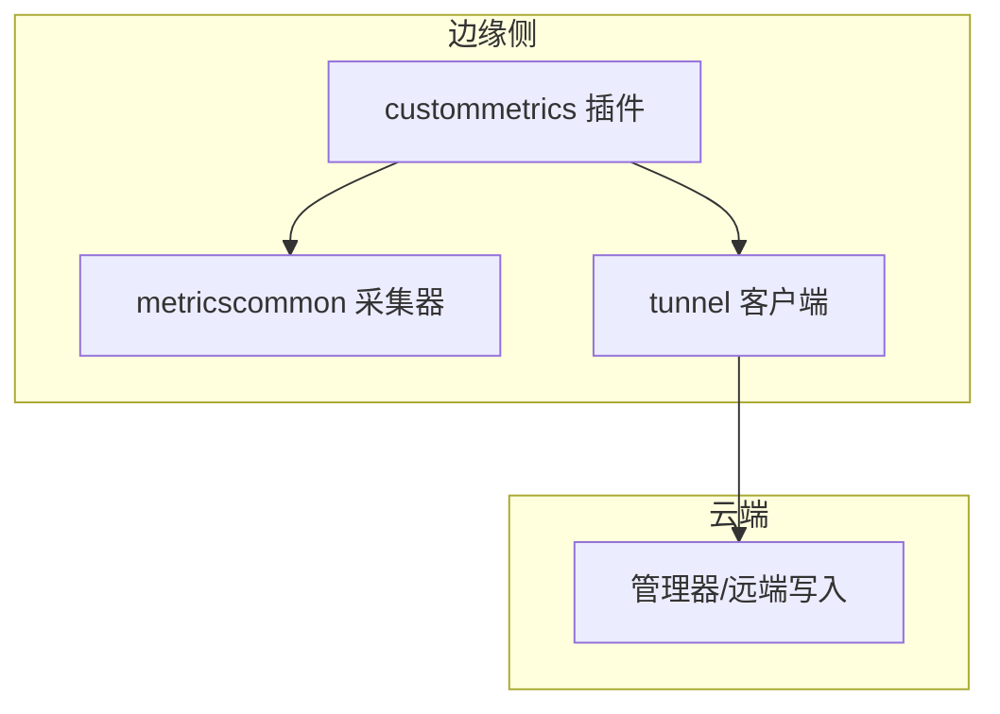
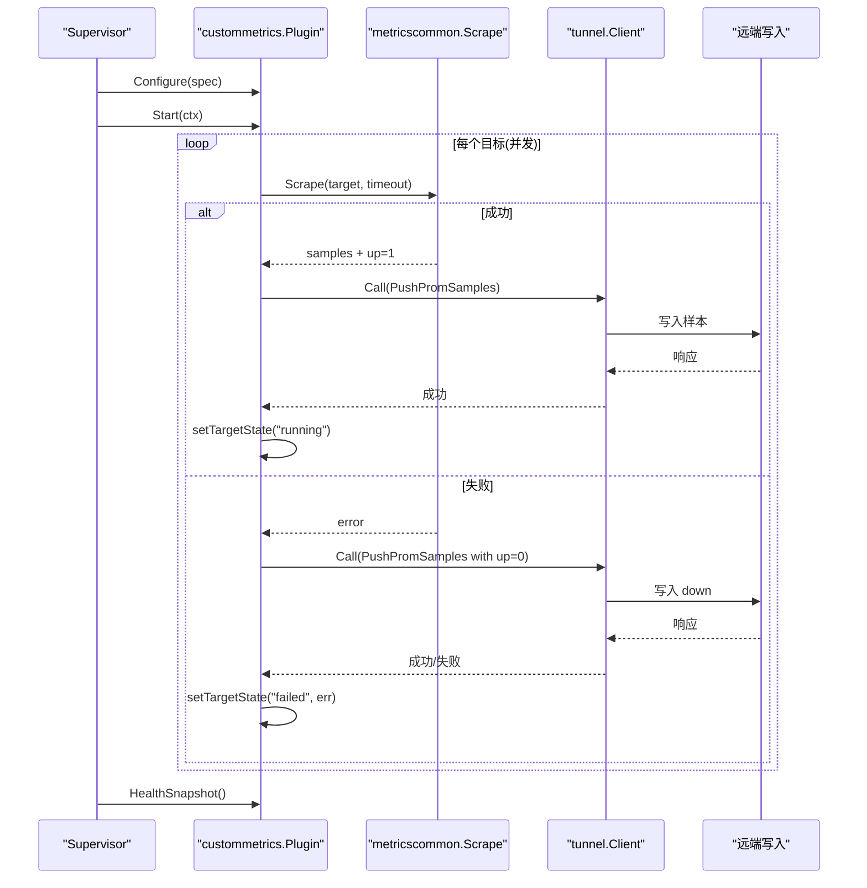
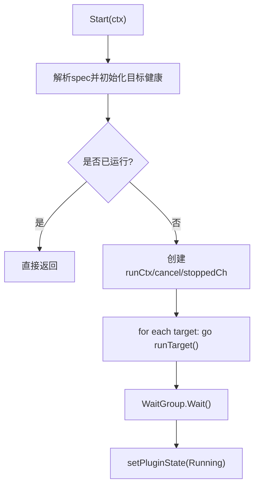
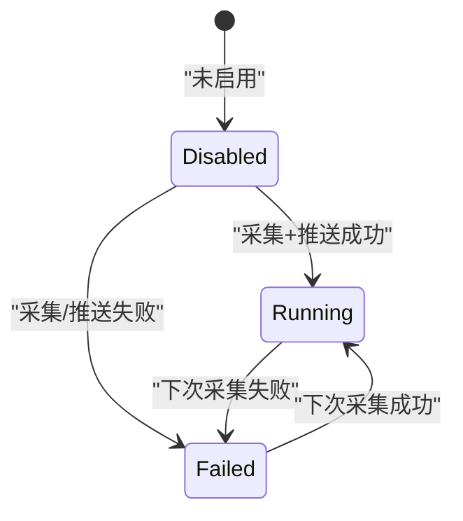
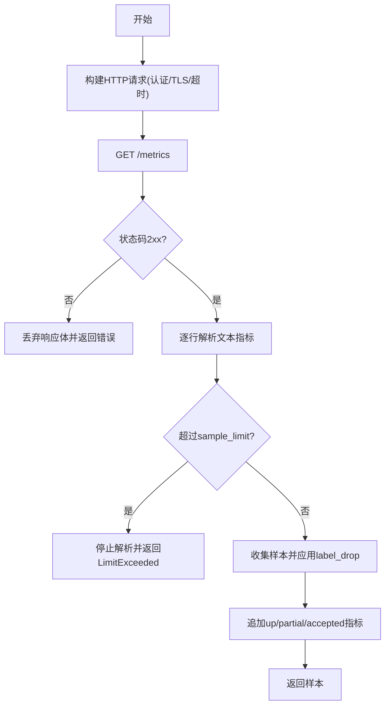
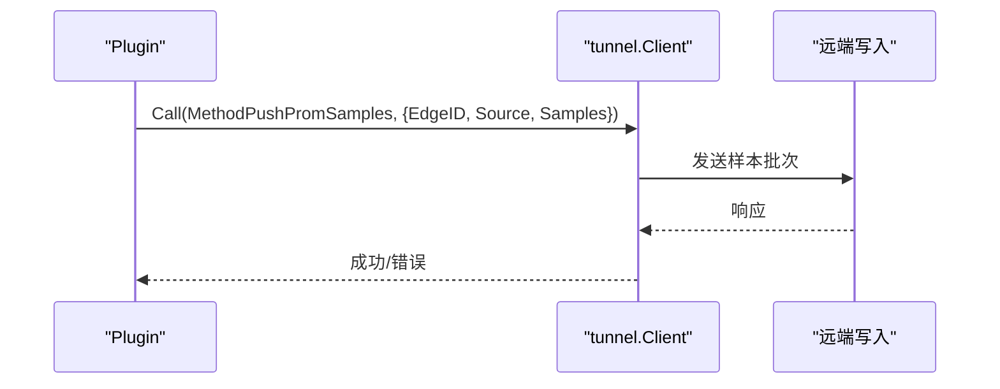
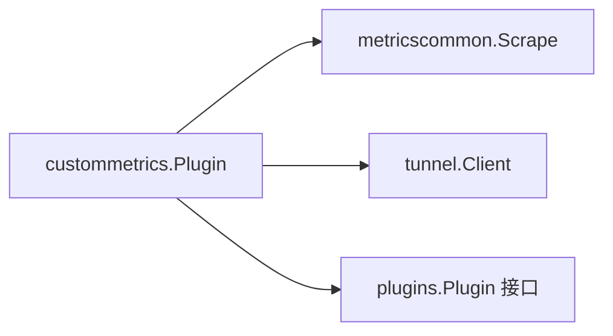

# 自定义指标插件

<cite>
**本文引用的文件**
- [internal/edgeagent/plugins/custommetrics/plugin.go](file://internal/edgeagent/plugins/custommetrics/plugin.go)
- [internal/edgeagent/plugins/custommetrics/spec.go](file://internal/edgeagent/plugins/custommetrics/spec.go)
- [internal/edgeagent/plugins/metricscommon/scrape.go](file://internal/edgeagent/plugins/metricscommon/scrape.go)
- [internal/edgeagent/plugins/plugin.go](file://internal/edgeagent/plugins/plugin.go)
- [internal/pkg/tunnel/types.go](file://internal/pkg/tunnel/types.go)
- [internal/edgeagent/collector/scrape_config.example.yaml](file://internal/edgeagent/collector/scrape_config.example.yaml)
</cite>

## 目录
1. [简介](#简介)
2. [项目结构](#项目结构)
3. [核心组件](#核心组件)
4. [架构总览](#架构总览)
5. [详细组件分析](#详细组件分析)
6. [依赖关系分析](#依赖关系分析)
7. [性能与并发](#性能与并发)
8. [故障排查指南](#故障排查指南)
9. [结论](#结论)
10. [附录：配置示例与使用场景](#附录：配置示例与使用场景)

## 简介
本插件用于在边缘侧采集一个或多个 Prometheus /metrics 端点，将采样数据转换为统一的样本格式并通过隧道推送到云端。它不管理导出器进程或数据库凭据，仅负责“拉取—转换—推送”的闭环，并提供目标健康状态、错误处理与可观测性指标（如 up、部分抓取、接受样本数）。

## 项目结构
- custommetrics 插件位于 edgeagent 插件体系内，遵循统一的生命周期接口（Configure/Start/Stop/HealthSnapshot），由 Supervisor 统一管理。
- 指标采集逻辑下沉到 metricscommon，提供通用的 HTTP GET、文本解析、限流与标签裁剪能力。
- 数据通过 tunnel 层的 RPC 方法 PushPromSamples 上报至云端。

图表来源
- [internal/edgeagent/plugins/custommetrics/plugin.go:135-229](file://internal/edgeagent/plugins/custommetrics/plugin.go#L135-L229)
- [internal/edgeagent/plugins/metricscommon/scrape.go:74-115](file://internal/edgeagent/plugins/metricscommon/scrape.go#L74-L115)
- [internal/pkg/tunnel/types.go:68-105](file://internal/pkg/tunnel/types.go#L68-L105)

章节来源
- [internal/edgeagent/plugins/plugin.go:18-52](file://internal/edgeagent/plugins/plugin.go#L18-L52)
- [internal/edgeagent/plugins/custommetrics/plugin.go:1-291](file://internal/edgeagent/plugins/custommetrics/plugin.go#L1-L291)

## 核心组件
- 插件主体（Plugin）：维护运行态、目标健康、并发调度、超时控制、panic 恢复与健康快照。
- 目标规范解析（spec）：将 manager 下发的 JSON spec 解析为 Target 列表，校验 URL、重复 ID/URL、资源分类等。
- 通用采集器（metricscommon）：HTTP 请求、文本流式解析、样本限制、标签裁剪、up/partial/accepted 指标生成。
- 隧道上报（tunnel）：通过 Call 调用 PushPromSamples 方法，携带 EdgeID、Source、Samples。

章节来源
- [internal/edgeagent/plugins/custommetrics/plugin.go:31-63](file://internal/edgeagent/plugins/custommetrics/plugin.go#L31-L63)
- [internal/edgeagent/plugins/custommetrics/spec.go:13-112](file://internal/edgeagent/plugins/custommetrics/spec.go#L13-L112)
- [internal/edgeagent/plugins/metricscommon/scrape.go:22-51](file://internal/edgeagent/plugins/metricscommon/scrape.go#L22-L51)
- [internal/pkg/tunnel/types.go:68-105](file://internal/pkg/tunnel/types.go#L68-L105)

## 架构总览
插件启动后，按目标并行执行采集循环；每次采集带超时，成功后追加 up 指标并批量推送；失败时推送 down 的 up 指标并记录目标错误。所有目标的健康状态汇总为插件级健康快照供上层查询。

图表来源
- [internal/edgeagent/plugins/custommetrics/plugin.go:135-229](file://internal/edgeagent/plugins/custommetrics/plugin.go#L135-L229)
- [internal/edgeagent/plugins/metricscommon/scrape.go:74-115](file://internal/edgeagent/plugins/metricscommon/scrape.go#L74-L115)
- [internal/pkg/tunnel/types.go:68-105](file://internal/pkg/tunnel/types.go#L68-L105)

## 详细组件分析

### 插件生命周期与并发模型
- 生命周期：Configure 解析 spec 并重置目标健康；Start 启动 run goroutine；Stop 取消上下文并等待停止；HealthSnapshot 返回当前健康与目标列表。
- 并发模型：run 对每个启用的目标启动独立 goroutine，使用 WaitGroup 等待全部完成；每个目标内部使用 ticker 周期性采集。
- 健壮性：顶层与目标层均捕获 panic 并记录堆栈，设置对应崩溃状态。

图表来源
- [internal/edgeagent/plugins/custommetrics/plugin.go:79-162](file://internal/edgeagent/plugins/custommetrics/plugin.go#L79-L162)

章节来源
- [internal/edgeagent/plugins/custommetrics/plugin.go:67-162](file://internal/edgeagent/plugins/custommetrics/plugin.go#L67-L162)

### 目标健康管理与错误处理
- 目标状态：disabled（未启用）、running（成功采集并推送）、failed（采集或推送失败）。
- 指标上送：成功时附带 up=1；失败时先尝试推送 up=0 以反映目标不可用；同时记录最近错误与成功时间。
- 插件健康：包含 last_error、started_at、updated_at 以及目标数组。

图表来源
- [internal/edgeagent/plugins/custommetrics/plugin.go:187-211](file://internal/edgeagent/plugins/custommetrics/plugin.go#L187-L211)
- [internal/edgeagent/plugins/custommetrics/plugin.go:231-280](file://internal/edgeagent/plugins/custommetrics/plugin.go#L231-L280)

章节来源
- [internal/edgeagent/plugins/custommetrics/plugin.go:187-280](file://internal/edgeagent/plugins/custommetrics/plugin.go#L187-L280)

### 指标采集机制与数据格式
- 采集方式：HTTP GET 指定 Accept 头为 text/plain，支持 Bearer Token 与 Basic Auth，TLS 最小版本 1.2，可跳过证书校验（仅限测试）。
- 流式解析：逐行解析 Prometheus 文本格式，避免大响应内存膨胀；支持 sample_limit 上限，超出则返回错误并标记 partial。
- 附加指标：up（可用性）、ongrid_scrape_partial（是否截断）、ongrid_scrape_samples_accepted（实际接受样本数）。
- 标签策略：固定低基数字段（plugin/target_id/target_name/kind），额外标签来自 extra_labels；支持 label_drop 删除高基数标签。

图表来源
- [internal/edgeagent/plugins/metricscommon/scrape.go:74-115](file://internal/edgeagent/plugins/metricscommon/scrape.go#L74-L115)
- [internal/edgeagent/plugins/metricscommon/scrape.go:117-148](file://internal/edgeagent/plugins/metricscommon/scrape.go#L117-L148)
- [internal/edgeagent/plugins/metricscommon/scrape.go:150-190](file://internal/edgeagent/plugins/metricscommon/scrape.go#L150-L190)
- [internal/edgeagent/plugins/metricscommon/scrape.go:230-248](file://internal/edgeagent/plugins/metricscommon/scrape.go#L230-L248)
- [internal/edgeagent/plugins/metricscommon/scrape.go:250-269](file://internal/edgeagent/plugins/metricscommon/scrape.go#L250-L269)

章节来源
- [internal/edgeagent/plugins/metricscommon/scrape.go:22-51](file://internal/edgeagent/plugins/metricscommon/scrape.go#L22-L51)
- [internal/edgeagent/plugins/metricscommon/scrape.go:74-115](file://internal/edgeagent/plugins/metricscommon/scrape.go#L74-L115)
- [internal/edgeagent/plugins/metricscommon/scrape.go:117-190](file://internal/edgeagent/plugins/metricscommon/scrape.go#L117-L190)
- [internal/edgeagent/plugins/metricscommon/scrape.go:215-269](file://internal/edgeagent/plugins/metricscommon/scrape.go#L215-L269)

### 数据推送流程与远程写入协议
- 推送入口：pushPromSamples 构造 PushPromSamplesRequest（EdgeID、Source、Samples），通过 tunnel.Call 调用 MethodPushPromSamples。
- 超时与重试：推送上下文默认 15 秒超时；底层连接断开由隧道层自动重连。
- 源标识：source_label 用于区分不同目标来源，便于聚合与告警。

图表来源
- [internal/edgeagent/plugins/custommetrics/plugin.go:213-229](file://internal/edgeagent/plugins/custommetrics/plugin.go#L213-L229)
- [internal/pkg/tunnel/types.go:68-105](file://internal/pkg/tunnel/types.go#L68-L105)

章节来源
- [internal/edgeagent/plugins/custommetrics/plugin.go:213-229](file://internal/edgeagent/plugins/custommetrics/plugin.go#L213-L229)
- [internal/pkg/tunnel/types.go:68-105](file://internal/pkg/tunnel/types.go#L68-L105)

### 配置参数详解
- targets[]：目标数组，每项必须包含 id、target_url；可选字段如下：
  - name：显示名，默认同 id
  - scrape_interval：采集间隔，默认 30s
  - scrape_timeout：采集超时，默认 5s，且不会超过 interval
  - enabled：是否启用，默认 true
  - source_label：源标签，默认 "custom:<id>"
  - auth.bearer_token / auth.username / auth.password：认证信息
  - tls_insecure：是否跳过 TLS 校验（不建议生产使用）
  - extra_labels：静态标签
  - sample_limit：单次采集最大样本数，默认 5000
  - label_drop：要删除的标签键列表
  - resource.category/type：资源分类（目前支持 database，类型包括 mysql/postgresql/redis/mongodb），用于自动注入 resource_category 与 db_type 标签，并将 kind 设置为具体数据库类型
- 唯一性约束：id 唯一；规范化后的 target_url 唯一（scheme/host 小写）

章节来源
- [internal/edgeagent/plugins/custommetrics/spec.go:13-112](file://internal/edgeagent/plugins/custommetrics/spec.go#L13-L112)
- [internal/edgeagent/plugins/custommetrics/spec.go:114-180](file://internal/edgeagent/plugins/custommetrics/spec.go#L114-L180)
- [internal/edgeagent/plugins/metricscommon/scrape.go:22-51](file://internal/edgeagent/plugins/metricscommon/scrape.go#L22-L51)

### 与 OpenTelemetry 生态的集成
- 信号命名：插件名称与信号名一致（metrics），符合 OTel 信号命名约定。
- 指标格式：输出为标准 Prometheus 文本格式的指标，并在云端继续由 Prometheus 消费。
- 传输通道：通过隧道 RPC 将样本以统一格式上报，不直接对接 OTLP；但标签与指标语义与 OTel/Prometheus 生态兼容。

章节来源
- [internal/edgeagent/plugins/plugin.go:18-24](file://internal/edgeagent/plugins/plugin.go#L18-L24)
- [internal/edgeagent/plugins/metricscommon/scrape.go:74-115](file://internal/edgeagent/plugins/metricscommon/scrape.go#L74-L115)

## 依赖关系分析
- custommetrics 依赖 metricscommon 进行指标采集与样本构造。
- 插件通过 tunnel.Client 与云端通信，依赖其 Call 方法与重连机制。
- 插件实现 plugins.Plugin 接口，受 Supervisor 生命周期管理。

图表来源
- [internal/edgeagent/plugins/custommetrics/plugin.go:18-21](file://internal/edgeagent/plugins/custommetrics/plugin.go#L18-L21)
- [internal/edgeagent/plugins/metricscommon/scrape.go:6-20](file://internal/edgeagent/plugins/metricscommon/scrape.go#L6-L20)
- [internal/pkg/tunnel/types.go:68-105](file://internal/pkg/tunnel/types.go#L68-L105)
- [internal/edgeagent/plugins/plugin.go:18-52](file://internal/edgeagent/plugins/plugin.go#L18-L52)

章节来源
- [internal/edgeagent/plugins/custommetrics/plugin.go:18-21](file://internal/edgeagent/plugins/custommetrics/plugin.go#L18-L21)
- [internal/edgeagent/plugins/metricscommon/scrape.go:6-20](file://internal/edgeagent/plugins/metricscommon/scrape.go#L6-L20)
- [internal/pkg/tunnel/types.go:68-105](file://internal/pkg/tunnel/types.go#L68-L105)
- [internal/edgeagent/plugins/plugin.go:18-52](file://internal/edgeagent/plugins/plugin.go#L18-L52)

## 性能与并发
- 并发度：每个目标独立 goroutine，互不影响；适合多目标并行采集。
- 内存与带宽：流式解析避免全量加载；sample_limit 控制单批样本上限；label_drop 降低标签基数。
- 网络：HTTP 客户端复用少量空闲连接，短拨号超时，整体超时由目标级别控制；推送有 15 秒超时保护。
- 资源消耗：CPU 主要消耗在指标解析与序列化；IO 受目标端吞吐与网络影响。

[本节为通用指导，无需特定文件引用]

## 故障排查指南
- 无法连接目标
  - 检查 target_url 是否 http/https 且 host 有效；确认鉴权配置正确；必要时开启 tls_insecure 仅用于调试。
  - 参考：URL 校验与 HTTP 请求构建。
- 采集超时或响应过大
  - 调整 scrape_timeout 与 sample_limit；使用 label_drop 减少标签基数；关注 ongrid_scrape_partial 指标判断是否被截断。
- 推送失败
  - 检查 EdgeID 是否就绪（非 0）；查看隧道连接与云端写入日志；注意推送超时。
- 目标健康异常
  - 查看插件健康快照中目标的 state、last_error、last_success_at；确认采集与推送链路。

章节来源
- [internal/edgeagent/plugins/metricscommon/scrape.go:117-148](file://internal/edgeagent/plugins/metricscommon/scrape.go#L117-L148)
- [internal/edgeagent/plugins/metricscommon/scrape.go:215-248](file://internal/edgeagent/plugins/metricscommon/scrape.go#L215-L248)
- [internal/edgeagent/plugins/custommetrics/plugin.go:187-229](file://internal/edgeagent/plugins/custommetrics/plugin.go#L187-L229)
- [internal/edgeagent/plugins/custommetrics/plugin.go:231-280](file://internal/edgeagent/plugins/custommetrics/plugin.go#L231-L280)

## 结论
custommetrics 插件提供了轻量、可扩展的边缘侧 Prometheus 指标采集能力，具备多目标并发、严格超时与限流、完善的健康状态与错误处理，并通过统一隧道协议将样本推送到云端。配合合理的配置与监控指标，可有效覆盖自研服务与第三方导出器的监控需求。

[本节为总结性内容，无需特定文件引用]

## 附录：配置示例与使用场景
- 典型场景
  - 本地 Node Exporter、Kubelet cAdvisor、MySQL Exporter 等多类目标混合采集。
  - 需要为数据库类目标注入资源分类标签，便于后续分析与告警。
- 配置要点
  - 为每个目标设置唯一 id 与稳定的 target_url。
  - 合理设置 scrape_interval 与 scrape_timeout，确保不超过目标端负载能力。
  - 使用 sample_limit 与 label_drop 控制指标基数与体积。
  - 通过 extra_labels 添加业务维度标签。
- 参考示例
  - 可参考内置的多目标采集示例文件，了解常见目标与认证方式的配置形态。

章节来源
- [internal/edgeagent/collector/scrape_config.example.yaml:1-30](file://internal/edgeagent/collector/scrape_config.example.yaml#L1-L30)