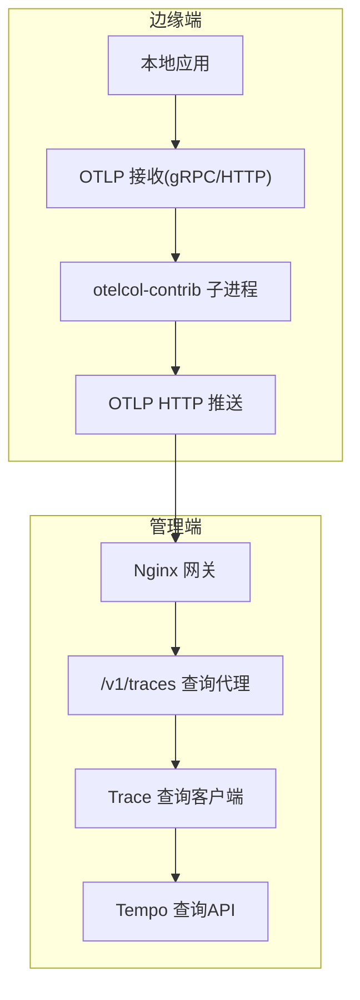
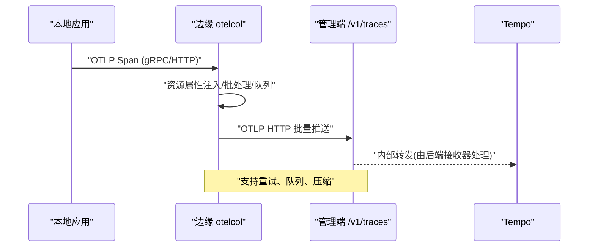
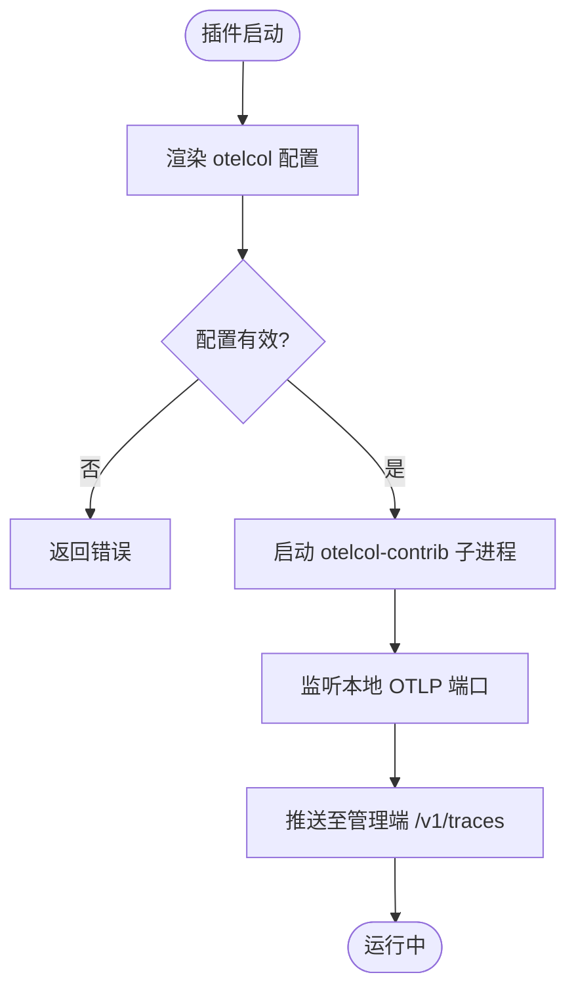
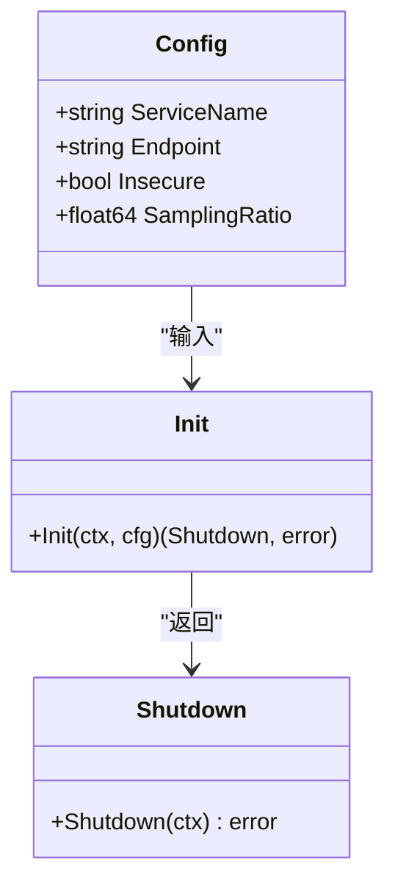
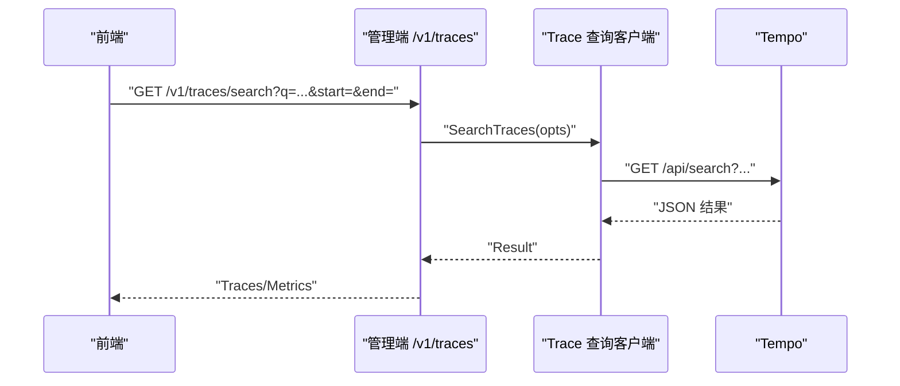
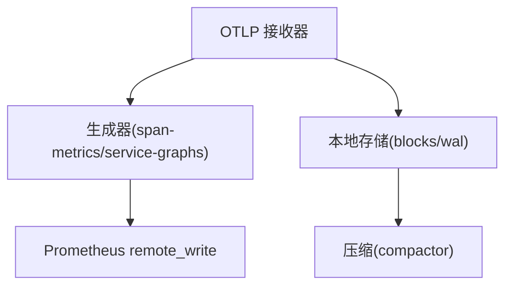
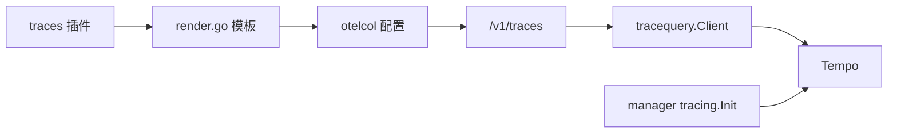

# 链路追踪插件

<cite>
**本文引用的文件**
- [internal/edgeagent/plugins/traces/plugin.go](file://internal/edgeagent/plugins/traces/plugin.go)
- [internal/edgeagent/plugins/traces/render.go](file://internal/edgeagent/plugins/traces/render.go)
- [internal/pkg/tracing/tracing.go](file://internal/pkg/tracing/tracing.go)
- [internal/manager/server/traces/http.go](file://internal/manager/server/traces/http.go)
- [internal/pkg/tracequery/client.go](file://internal/pkg/tracequery/client.go)
- [deploy/install/tempo-config.yaml](file://deploy/install/tempo-config.yaml)
- [cmd/ongrid/main.go](file://cmd/ongrid/main.go)
</cite>

## 目录
1. [简介](#简介)
2. [项目结构](#项目结构)
3. [核心组件](#核心组件)
4. [架构总览](#架构总览)
5. [详细组件分析](#详细组件分析)
6. [依赖关系分析](#依赖关系分析)
7. [性能与调优](#性能与调优)
8. [故障排查指南](#故障排查指南)
9. [结论](#结论)
10. [附录](#附录)

## 简介
本插件提供边缘侧的分布式链路追踪能力，基于 OpenTelemetry Collector（otelcol-contrib）子进程在 ongrid-edge 上运行，接收本地应用的 OTLP gRPC/HTTP 上报，经轻量处理与资源属性注入后，通过 OTLP HTTP 将追踪数据推送至管理端的 /v1/traces 入口。管理端内置 Tempo 作为默认后端，并提供查询代理与可视化集成；同时支持外部 Tempo/Jaeger/Zipkin 等后端的接入思路与配置要点。

## 项目结构
- 边缘侧 traces 插件：负责渲染 otelcol 配置、启动并管理 otelcol-contrib 子进程，完成本地 OTLP 接收与转发。
- 管理端 tracing 初始化：为 manager 自身启用 OTLP 导出到 Tempo，支撑 spanmetrics 指标生成。
- 管理端 traces 查询代理：对前端暴露受认证的 /v1/traces/* 路由，代理到 Tempo 查询 API。
- Trace 查询客户端：封装对 Tempo /api/search、/api/traces/{id} 的调用。
- Tempo 配置：单二进制部署，开启 OTLP 接收、spanmetrics/service-graphs 生成器，持久化到本地文件系统。

**图示来源**
- [internal/edgeagent/plugins/traces/render.go:37-43](file://internal/edgeagent/plugins/traces/render.go#L37-L43)
- [internal/edgeagent/plugins/traces/render.go:137-162](file://internal/edgeagent/plugins/traces/render.go#L137-L162)
- [internal/manager/server/traces/http.go:52-57](file://internal/manager/server/traces/http.go#L52-L57)
- [internal/pkg/tracequery/client.go:112-157](file://internal/pkg/tracequery/client.go#L112-L157)
- [deploy/install/tempo-config.yaml:10-17](file://deploy/install/tempo-config.yaml#L10-L17)

**章节来源**
- [internal/edgeagent/plugins/traces/plugin.go:1-50](file://internal/edgeagent/plugins/traces/plugin.go#L1-L50)
- [internal/edgeagent/plugins/traces/render.go:16-261](file://internal/edgeagent/plugins/traces/render.go#L16-L261)
- [internal/pkg/tracing/tracing.go:1-107](file://internal/pkg/tracing/tracing.go#L1-L107)
- [internal/manager/server/traces/http.go:1-57](file://internal/manager/server/traces/http.go#L1-L57)
- [internal/pkg/tracequery/client.go:1-253](file://internal/pkg/tracequery/client.go#L1-L253)
- [deploy/install/tempo-config.yaml:1-77](file://deploy/install/tempo-config.yaml#L1-L77)

## 核心组件
- 边缘 traces 插件：以子进程方式运行 otelcol-contrib，按 Manager 下发的 PluginConfig 动态渲染配置，绑定本地地址接收 OTLP，并将追踪数据推送到管理端 /v1/traces。
- 管理端 tracing 初始化：为 manager 进程本身设置 TracerProvider 与 OTLP HTTP 导出器，向 Tempo 发送追踪数据，用于 spanmetrics 计算。
- 管理端 traces 查询代理：提供认证后的查询接口，代理到 Tempo 的搜索与详情接口。
- Trace 查询客户端：封装对 Tempo 的搜索、标签值获取与按 trace_id 查询。
- Tempo 配置：启用 OTLP 接收、spanmetrics/service-graphs 生成器，本地存储与压缩策略。

**章节来源**
- [internal/edgeagent/plugins/traces/plugin.go:24-49](file://internal/edgeagent/plugins/traces/plugin.go#L24-L49)
- [internal/edgeagent/plugins/traces/render.go:263-423](file://internal/edgeagent/plugins/traces/render.go#L263-L423)
- [internal/pkg/tracing/tracing.go:35-107](file://internal/pkg/tracing/tracing.go#L35-L107)
- [internal/manager/server/traces/http.go:29-57](file://internal/manager/server/traces/http.go#L29-L57)
- [internal/pkg/tracequery/client.go:39-77](file://internal/pkg/tracequery/client.go#L39-L77)
- [deploy/install/tempo-config.yaml:30-73](file://deploy/install/tempo-config.yaml#L30-L73)

## 架构总览
- 采集层：本地应用通过 OTLP gRPC/HTTP 上报 Span；otelcol 在边缘侧进行资源属性注入、批处理与队列缓冲，再推送到管理端。
- 传输层：使用 OTLP HTTP 协议，支持 gzip 压缩、重试与发送队列；可配置 TLS 跳过校验（默认启用以兼容自签证书）。
- 存储与查询：默认使用 Tempo 单二进制，开启 spanmetrics/service-graphs 生成器，指标写入 Prometheus；查询通过管理端代理暴露给前端。
- 上下文传播：使用 W3C TraceContext 与 Baggage 组合传播，保证跨服务链路连续性。

**图示来源**
- [internal/edgeagent/plugins/traces/render.go:37-43](file://internal/edgeagent/plugins/traces/render.go#L37-L43)
- [internal/edgeagent/plugins/traces/render.go:117-135](file://internal/edgeagent/plugins/traces/render.go#L117-L135)
- [internal/edgeagent/plugins/traces/render.go:137-162](file://internal/edgeagent/plugins/traces/render.go#L137-L162)
- [internal/pkg/tracing/tracing.go:91-104](file://internal/pkg/tracing/tracing.go#L91-L104)

**章节来源**
- [internal/edgeagent/plugins/traces/render.go:16-261](file://internal/edgeagent/plugins/traces/render.go#L16-L261)
- [internal/pkg/tracing/tracing.go:60-107](file://internal/pkg/tracing/tracing.go#L60-L107)

## 详细组件分析

### 边缘 traces 插件（子进程模式）
- 职责：根据 Manager 下发的 PluginConfig 渲染 otelcol 配置，启动 otelcol-contrib 子进程，监听本地 OTLP 端口，将追踪数据推送到管理端。
- 关键点：
  - 仅绑定 docker bridge/localhost，不暴露公网。
  - 支持可选的 k8sattributes 增强、设备 ID 注入、日志/指标管道复用。
  - 支持内存限制、批大小、队列大小等边界参数。
  - 默认跳过 TLS 校验以适配自签证书，生产环境可关闭。

**图示来源**
- [internal/edgeagent/plugins/traces/plugin.go:24-49](file://internal/edgeagent/plugins/traces/plugin.go#L24-L49)
- [internal/edgeagent/plugins/traces/render.go:263-423](file://internal/edgeagent/plugins/traces/render.go#L263-L423)

**章节来源**
- [internal/edgeagent/plugins/traces/plugin.go:1-50](file://internal/edgeagent/plugins/traces/plugin.go#L1-L50)
- [internal/edgeagent/plugins/traces/render.go:16-261](file://internal/edgeagent/plugins/traces/render.go#L16-L261)

### 管理端 tracing 初始化（Span 导出与采样）
- 职责：为 manager 进程初始化全局 TracerProvider，配置 OTLP HTTP 导出器、采样率、资源属性与上下文传播。
- 关键点：
  - 通过环境变量或配置注入 Endpoint（如 tempo:4318），空值则禁用导出。
  - 采样率范围 0..1，默认全量；可按规模下调。
  - 使用 ParentBased + TraceIDRatioBased 采样。
  - 设置 TextMapPropagator 为 TraceContext + Baggage，实现标准上下文传播。

**图示来源**
- [internal/pkg/tracing/tracing.go:35-107](file://internal/pkg/tracing/tracing.go#L35-L107)

**章节来源**
- [internal/pkg/tracing/tracing.go:35-107](file://internal/pkg/tracing/tracing.go#L35-L107)
- [cmd/ongrid/main.go:236-247](file://cmd/ongrid/main.go#L236-L247)

### 管理端 traces 查询代理
- 职责：为前端提供受认证的查询接口，代理到 Tempo 的搜索与详情接口。
- 关键点：
  - 路由：/v1/traces/search、/v1/traces/tags/{tag}/values、/v1/traces/{trace_id}。
  - 参数校验：时间窗口、limit、min/max duration。
  - 当后端未启用时返回 503，便于前端展示“traces disabled”。

**图示来源**
- [internal/manager/server/traces/http.go:52-152](file://internal/manager/server/traces/http.go#L52-L152)
- [internal/pkg/tracequery/client.go:112-157](file://internal/pkg/tracequery/client.go#L112-L157)

**章节来源**
- [internal/manager/server/traces/http.go:1-229](file://internal/manager/server/traces/http.go#L1-L229)
- [internal/pkg/tracequery/client.go:89-157](file://internal/pkg/tracequery/client.go#L89-L157)

### Tempo 后端配置
- 职责：提供 OTLP 接收、spanmetrics/service-graphs 生成器、本地存储与压缩策略。
- 关键点：
  - OTLP 接收器：gRPC 4317、HTTP 4318。
  - 生成器：span-metrics 维度包含 service.name、span.kind、status.code；service-graphs 最大项数。
  - 存储：local backend，块保留 7 天，池化 worker 与队列深度。
  - 覆盖：速率限制、每 trace 最大字节数。

**图示来源**
- [deploy/install/tempo-config.yaml:10-17](file://deploy/install/tempo-config.yaml#L10-L17)
- [deploy/install/tempo-config.yaml:30-73](file://deploy/install/tempo-config.yaml#L30-L73)

**章节来源**
- [deploy/install/tempo-config.yaml:1-77](file://deploy/install/tempo-config.yaml#L1-L77)

## 依赖关系分析
- 边缘插件依赖 otelcol-contrib 二进制，通过子进程方式运行；配置由 render.go 模板渲染。
- 管理端 tracing 依赖 OTLP HTTP 导出器与 SDK TracerProvider。
- 查询代理依赖 tracequery.Client，后者封装对 Tempo 的 HTTP 调用。
- Tempo 配置驱动接收器与生成器行为，影响指标与查询性能。

**图示来源**
- [internal/edgeagent/plugins/traces/render.go:263-423](file://internal/edgeagent/plugins/traces/render.go#L263-L423)
- [internal/manager/server/traces/http.go:52-57](file://internal/manager/server/traces/http.go#L52-L57)
- [internal/pkg/tracequery/client.go:39-77](file://internal/pkg/tracequery/client.go#L39-L77)
- [internal/pkg/tracing/tracing.go:60-107](file://internal/pkg/tracing/tracing.go#L60-L107)

**章节来源**
- [internal/edgeagent/plugins/traces/render.go:263-423](file://internal/edgeagent/plugins/traces/render.go#L263-L423)
- [internal/manager/server/traces/http.go:52-57](file://internal/manager/server/traces/http.go#L52-L57)
- [internal/pkg/tracequery/client.go:39-77](file://internal/pkg/tracequery/client.go#L39-L77)
- [internal/pkg/tracing/tracing.go:60-107](file://internal/pkg/tracing/tracing.go#L60-L107)

## 性能与调优
- 采样策略
  - 边缘侧：默认全量 head sampling，可在插件配置中调整采样率（前端表单支持 0..1 概率）。
  - 管理端：tracing.Init 支持 SamplingRatio，默认 1.0，可按规模下调至 0.1 以降低负载。
- 批处理与队列
  - otelcol 批处理器 send_batch_size、send_batch_max_size、timeout；bounded pipelines 下可配置 memory_limiter、queue_size。
  - 发送队列：num_consumers、queue_size、retry_on_failure 间隔与超时。
- 网络与压缩
  - 启用 gzip 压缩；合理设置 timeout；生产环境建议关闭 insecure_skip_verify 并使用真实证书。
- 存储与查询
  - Tempo 块保留期、max_block_bytes、pool 工作线程与队列深度；span-metrics 维度选择影响指标体积与查询速度。
- 资源与隔离
  - 边缘侧避免绑定公网；必要时启用 bounded_pipelines 限制内存与批大小，防止雪崩。

[本节为通用指导，无需特定文件引用]

## 故障排查指南
- 常见问题
  - 配置无效：otelcol 子进程启动失败，检查 render.go 模板参数与 spec 字段。
  - 无法推送：确认 Endpoint、AuthHeader、TLS 策略；查看重试与队列状态。
  - 查询不可用：管理端 traces 后端未启用时返回 503；检查 Tempo URL 与鉴权。
  - 慢查询：Tempo 冷块导致搜索缓慢，适当增大 limit 或使用更精确的 TraceQL 过滤。
- 诊断步骤
  - 验证 otelcol 健康检查端点（health_check）。
  - 检查管理端 /v1/traces/* 路由是否挂载且鉴权正常。
  - 查看 tracequery 客户端日志与超时设置。
  - 核对 Tempo 配置中的 rate_limit、block_retention、max_bytes_per_trace。

**章节来源**
- [internal/edgeagent/plugins/traces/render.go:263-423](file://internal/edgeagent/plugins/traces/render.go#L263-L423)
- [internal/manager/server/traces/http.go:66-152](file://internal/manager/server/traces/http.go#L66-L152)
- [internal/pkg/tracequery/client.go:203-243](file://internal/pkg/tracequery/client.go#L203-L243)
- [deploy/install/tempo-config.yaml:63-73](file://deploy/install/tempo-config.yaml#L63-L73)

## 结论
本链路追踪插件以边缘侧 otelcol 子进程为核心，结合管理端 tracing 初始化与查询代理，形成从采集、传输到存储与查询的完整链路。默认集成 Tempo，支持 spanmetrics 与服务图生成，便于告警与可视化。通过合理的采样、批处理与队列配置，可在高吞吐场景下保持稳定性与可观测性。

[本节为总结，无需特定文件引用]

## 附录

### 支持的分布式追踪协议与数据采集方式
- 协议：OpenTelemetry OTLP（gRPC/HTTP）。
- 采集方式：本地应用通过 OTLP 上报；边缘 otelcol 接收并转发至管理端；管理端 tracing 初始化导出 manager 自身追踪数据。
- 后端：默认 Tempo；可通过配置对接外部 Tempo/Jaeger/Zipkin（需确保 OTLP 接收与查询接口可用）。

**章节来源**
- [internal/edgeagent/plugins/traces/render.go:37-43](file://internal/edgeagent/plugins/traces/render.go#L37-L43)
- [internal/pkg/tracing/tracing.go:60-107](file://internal/pkg/tracing/tracing.go#L60-L107)
- [deploy/install/tempo-config.yaml:10-17](file://deploy/install/tempo-config.yaml#L10-L17)

### Span 数据结构、Trace ID 与上下文传播
- Span：由应用 SDK 生成并通过 OTLP 上报；边缘侧进行资源属性注入与批处理。
- Trace ID：由上游应用生成，随 Span 传递；管理端查询通过 trace_id 检索。
- 上下文传播：使用 W3C TraceContext 与 Baggage 组合，确保跨服务链路一致性。

**章节来源**
- [internal/pkg/tracing/tracing.go:91-104](file://internal/pkg/tracing/tracing.go#L91-L104)
- [internal/pkg/tracequery/client.go:187-201](file://internal/pkg/tracequery/client.go#L187-L201)

### 不同追踪后端的配置示例与调优建议
- Tempo（默认）：参考 tempo-config.yaml，启用 OTLP 接收器、span-metrics/service-graphs 生成器，配置本地存储与压缩。
- Jaeger/Zipkin：若提供 OTLP 接收器，可将 Edge 推送 Endpoint 指向其后端；查询代理需对应实现查询接口。
- 调优：控制采样率、批大小、队列长度、重试间隔与超时；生产环境启用真实证书并关闭 insecure_skip_verify。

**章节来源**
- [deploy/install/tempo-config.yaml:10-73](file://deploy/install/tempo-config.yaml#L10-L73)
- [internal/edgeagent/plugins/traces/render.go:137-162](file://internal/edgeagent/plugins/traces/render.go#L137-L162)

### 采样策略、数据过滤与隐私保护
- 采样：边缘侧 head sampling（可配置概率），管理端 parent-based ratio sampling。
- 过滤：通过 TraceQL 或 tags 过滤；资源属性注入 device_id、ongrid_source 等便于筛选。
- 隐私：避免在 Span 中携带敏感信息；利用资源属性与过滤器减少不必要的数据上传。

**章节来源**
- [internal/pkg/tracing/tracing.go:48-51](file://internal/pkg/tracing/tracing.go#L48-L51)
- [internal/edgeagent/plugins/traces/render.go:81-98](file://internal/edgeagent/plugins/traces/render.go#L81-L98)
- [internal/manager/server/traces/http.go:115-137](file://internal/manager/server/traces/http.go#L115-L137)

### 追踪数据分析方法与性能瓶颈定位技巧
- 分析方法：使用 TraceQL 按服务、操作、持续时间过滤；结合 span-metrics 指标（延迟、错误率）定位热点。
- 瓶颈定位：关注慢 Span、错误 Span；检查下游依赖与数据库调用；结合服务图分析调用链。
- 查询优化：缩小时间窗口、增加精确过滤条件、限制 limit；避免冷块查询。

**章节来源**
- [internal/pkg/tracequery/client.go:89-157](file://internal/pkg/tracequery/client.go#L89-L157)
- [deploy/install/tempo-config.yaml:30-73](file://deploy/install/tempo-config.yaml#L30-L73)

### 与 Tempo、Jaeger 等系统的集成与查询优化
- 集成：Edge 推送 OTLP 至后端；管理端查询代理统一对外暴露；默认集成 Tempo。
- 查询优化：使用 TraceQL 精准匹配；合理设置 start/end、limit、min/max duration；利用标签值下拉快速构建查询。

**章节来源**
- [internal/manager/server/traces/http.go:52-152](file://internal/manager/server/traces/http.go#L52-L152)
- [internal/pkg/tracequery/client.go:112-157](file://internal/pkg/tracequery/client.go#L112-L157)

### 可视化与告警配置指南
- 可视化：前端 Traces 页面通过 /v1/traces/* 查询代理访问 Tempo；支持直接通过 trace_id 查询。
- 告警：基于 span-metrics 指标（trace_latency、trace_error_rate）在 Prometheus 中配置规则；Tempo 生成器远程写入 Prometheus。

**章节来源**
- [internal/manager/server/traces/http.go:52-57](file://internal/manager/server/traces/http.go#L52-L57)
- [deploy/install/tempo-config.yaml:30-49](file://deploy/install/tempo-config.yaml#L30-L49)