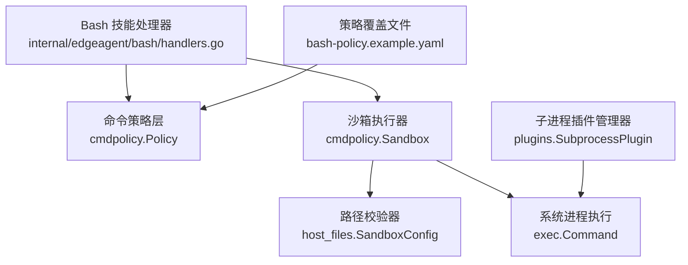
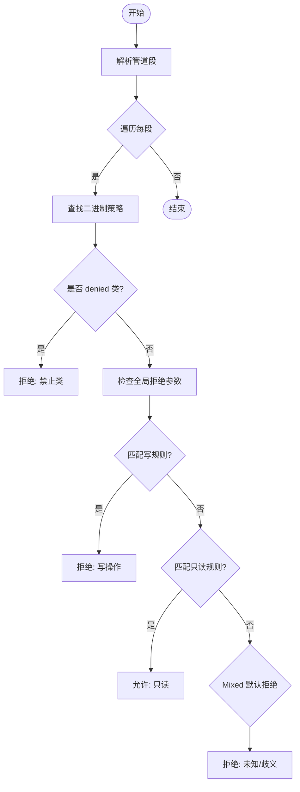
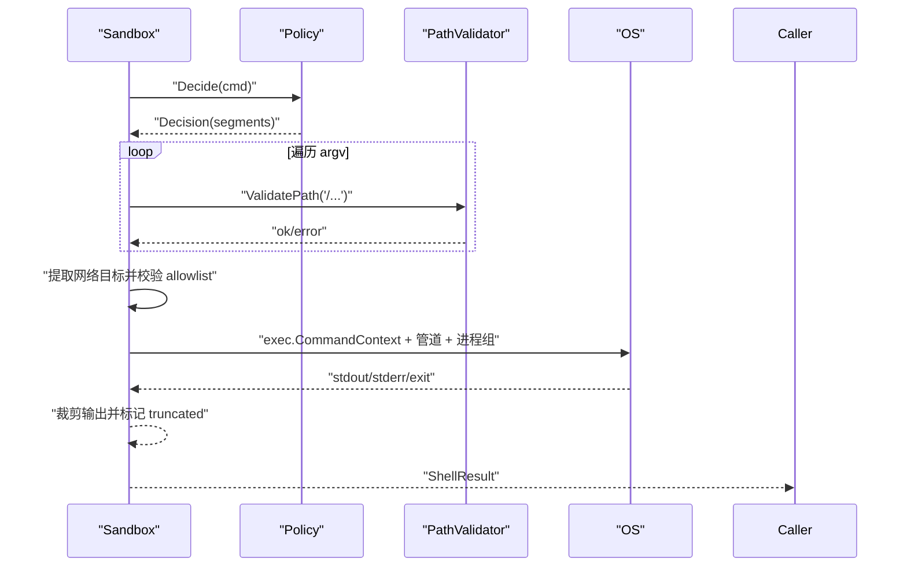
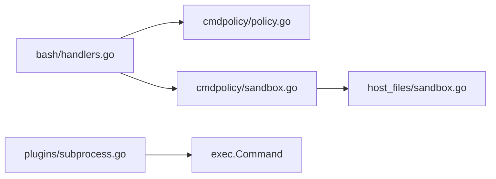

# 插件安全机制

<cite>
**本文引用的文件**
- [policy.go](file://internal/edgeagent/cmdpolicy/policy.go)
- [sandbox.go](file://internal/edgeagent/cmdpolicy/sandbox.go)
- [types.go](file://internal/edgeagent/cmdpolicy/types.go)
- [parse.go](file://internal/edgeagent/cmdpolicy/parse.go)
- [handlers.go](file://internal/edgeagent/bash/handlers.go)
- [host_files sandbox.go](file://internal/edgeagent/host_files/sandbox.go)
- [subprocess.go](file://internal/edgeagent/plugins/subprocess.go)
- [bash-policy.example.yaml](file://deploy/edge/bash-policy.example.yaml)
</cite>

## 目录
1. [简介](#简介)
2. [项目结构](#项目结构)
3. [核心组件](#核心组件)
4. [架构总览](#架构总览)
5. [详细组件分析](#详细组件分析)
6. [依赖关系分析](#依赖关系分析)
7. [性能与资源限制](#性能与资源限制)
8. [故障排查指南](#故障排查指南)
9. [结论](#结论)
10. [附录：配置最佳实践与合规审计](#附录配置最佳实践与合规审计)

## 简介
本文件系统性阐述 Ongrid 插件执行环境的安全隔离机制，重点覆盖命令执行策略（cmdpolicy）的实现原理、沙箱路径与网络权限控制、进程级超时与输出裁剪、敏感信息保护、资源使用监控与异常行为检测，以及安全配置最佳实践与合规审计要点。目标是帮助读者在不深入源码的情况下理解并正确配置 Ongrid 的插件安全边界。

## 项目结构
Ongrid 在边缘侧通过“策略 + 沙箱”的分层设计实现插件命令执行的安全隔离：
- 策略层（cmdpolicy）：定义可执行的二进制白名单、参数匹配规则、网络目标白名单、输出上限、超时与最大参数长度等。
- 沙箱执行层（cmdpolicy.Sandbox）：将策略决策转化为实际进程执行，负责管道组装、环境变量清理、进程组隔离、超时取消、输出截断与结果封装。
- 路径校验（host_files.SandboxConfig）：提供统一的绝对路径访问控制，采用“默认拒绝敏感路径 + 可选允许列表”的策略。
- Bash 技能入口（bash handlers）：将外部请求映射为 cmdpolicy.Sandbox.Exec/ExecRaw，并记录审计日志。
- 子进程插件管理（plugins.SubprocessPlugin）：对独立采集器/代理进程进行生命周期管理、崩溃重启、健康状态上报与日志落盘。



图表来源
- [handlers.go:49-93](file://internal/edgeagent/bash/handlers.go#L49-L93)
- [policy.go:33-492](file://internal/edgeagent/cmdpolicy/policy.go#L33-L492)
- [sandbox.go:52-132](file://internal/edgeagent/cmdpolicy/sandbox.go#L52-L132)
- [host_files sandbox.go:34-109](file://internal/edgeagent/host_files/sandbox.go#L34-L109)
- [subprocess.go:17-51](file://internal/edgeagent/plugins/subprocess.go#L17-L51)
- [bash-policy.example.yaml:1-178](file://deploy/edge/bash-policy.example.yaml#L1-L178)

章节来源
- [handlers.go:49-93](file://internal/edgeagent/bash/handlers.go#L49-L93)
- [policy.go:33-492](file://internal/edgeagent/cmdpolicy/policy.go#L33-L492)
- [sandbox.go:52-132](file://internal/edgeagent/cmdpolicy/sandbox.go#L52-L132)
- [host_files sandbox.go:34-109](file://internal/edgeagent/host_files/sandbox.go#L34-L109)
- [subprocess.go:17-51](file://internal/edgeagent/plugins/subprocess.go#L17-L51)
- [bash-policy.example.yaml:1-178](file://deploy/edge/bash-policy.example.yaml#L1-L178)

## 核心组件
- 命令策略（Policy）：以“类”划分二进制能力（只读文件系统、只读系统、混合读写、网络、拒绝），并通过参数匹配器区分只读与写操作；支持 YAML 覆盖合并。
- 沙箱执行（Sandbox）：基于 Policy 决策后，组装管道、设置受限环境变量、按进程组运行、超时控制、输出上限裁剪、网络目标白名单校验。
- 路径校验（PathValidator）：统一绝对路径访问控制，默认拒绝虚拟文件系统和高敏路径，支持可选允许列表。
- Bash 技能入口：将外部调用转为受控执行或管理员直通（需显式开启写门限），并记录审计日志。
- 子进程插件：对独立二进制进行启动、健康检查、崩溃重启、日志落盘与优雅停止。

章节来源
- [types.go:43-166](file://internal/edgeagent/cmdpolicy/types.go#L43-L166)
- [policy.go:33-492](file://internal/edgeagent/cmdpolicy/policy.go#L33-L492)
- [sandbox.go:52-188](file://internal/edgeagent/cmdpolicy/sandbox.go#L52-L188)
- [host_files sandbox.go:34-109](file://internal/edgeagent/host_files/sandbox.go#L34-L109)
- [handlers.go:49-93](file://internal/edgeagent/bash/handlers.go#L49-L93)
- [subprocess.go:17-51](file://internal/edgeagent/plugins/subprocess.go#L17-L51)

## 架构总览
下图展示了从请求到执行的关键流程与安全控制点：

```mermaid
sequenceDiagram
participant Client as "调用方"
participant Bash as "Bash 技能处理器"
participant Sandbox as "cmdpolicy.Sandbox"
participant Policy as "cmdpolicy.Policy"
participant PathVal as "host_files.PathValidator"
participant OS as "操作系统进程"
Client->>Bash : "BashExecRequest(cmd, timeout?, unrestricted?)"
Bash->>Sandbox : "Decide(cmd)"
Sandbox->>Policy : "Decide(cmd)"
Policy-->>Sandbox : "Decision(allow/deny, segments)"
alt 包含绝对路径
Sandbox->>PathVal : "ValidatePath(path)"
PathVal-->>Sandbox : "ok / error"
end
alt 网络类命令
Sandbox->>Sandbox : "提取目标主机并校验 allowlist"
end
opt 允许执行
Sandbox->>OS : "exec.CommandContext + 管道 + 进程组"
OS-->>Sandbox : "stdout/stderr/exitCode"
Sandbox-->>Bash : "ShellResult(allowed, stdout, stderr, exit_code, truncated, duration_ms)"
Bash-->>Client : "BashExecResponse"
else 拒绝
Sandbox-->>Bash : "ShellResult(allowed=false, reason)"
Bash-->>Client : "BashExecResponse"
end
```

图表来源
- [handlers.go:99-157](file://internal/edgeagent/bash/handlers.go#L99-L157)
- [sandbox.go:76-188](file://internal/edgeagent/cmdpolicy/sandbox.go#L76-L188)
- [policy.go:707-800](file://internal/edgeagent/cmdpolicy/policy.go#L707-L800)
- [host_files sandbox.go:135-193](file://internal/edgeagent/host_files/sandbox.go#L135-L193)

## 详细组件分析

### 命令执行策略（cmdpolicy）
- 二进制分类与默认基线：内置只读文件系统、只读系统、混合读写、网络与拒绝类；默认仅允许只读与受限网络探测，拒绝 shell/脚本/破坏性命令。
- 参数匹配器：支持 AnyFlag、Subcmd、SubcmdPath，用于精确区分只读与写操作（如 iptables -L vs -A）。
- 全局拒绝参数：针对特定二进制的全局黑名单（如 find -delete、awk system()）。
- YAML 覆盖：支持在运行时加载覆盖文件，替换或扩展默认策略（保留“添加/覆盖”语义，无删除动词）。
- 决策流程：先解析管道段，再逐段判定；Mixed 类优先匹配写规则，未命中则拒绝；Network 类默认放行但需通过主机白名单。



图表来源
- [policy.go:707-800](file://internal/edgeagent/cmdpolicy/policy.go#L707-L800)
- [types.go:79-130](file://internal/edgeagent/cmdpolicy/types.go#L79-L130)

章节来源
- [policy.go:33-492](file://internal/edgeagent/cmdpolicy/policy.go#L33-L492)
- [policy.go:707-800](file://internal/edgeagent/cmdpolicy/policy.go#L707-L800)
- [types.go:43-166](file://internal/edgeagent/cmdpolicy/types.go#L43-L166)
- [bash-policy.example.yaml:19-152](file://deploy/edge/bash-policy.example.yaml#L19-L152)

### 沙箱执行与环境隔离
- 管道执行：将多段命令通过 stdin/stdout 管道串联，最后一段的 stdout 作为结果返回。
- 环境变量清洗：仅保留 PATH/LANG/LC_ALL，避免继承宿主敏感环境变量。
- 进程组隔离：使用 Setpgid 将子进程放入独立进程组，便于超时取消时整体终止。
- 输出上限：stdout/stderr 分别设置字节上限，超过部分丢弃并在结果中标记 Truncated。
- 超时控制：每个调用绑定 context.WithTimeout，超时返回非零退出码并提示“command timed out”。
- 网络目标白名单：对网络类命令提取目标主机（URL/域名/IP），必须匹配 NetworkHostAllowlist（CIDR/后缀/精确匹配），空列表即全部拒绝。
- 路径校验：所有以“/”开头的参数交由 PathValidator 校验，遵循 host_files 的统一策略。



图表来源
- [sandbox.go:76-188](file://internal/edgeagent/cmdpolicy/sandbox.go#L76-L188)
- [sandbox.go:260-342](file://internal/edgeagent/cmdpolicy/sandbox.go#L260-L342)
- [sandbox.go:428-549](file://internal/edgeagent/cmdpolicy/sandbox.go#L428-L549)
- [host_files sandbox.go:135-193](file://internal/edgeagent/host_files/sandbox.go#L135-L193)

章节来源
- [sandbox.go:76-188](file://internal/edgeagent/cmdpolicy/sandbox.go#L76-L188)
- [sandbox.go:260-342](file://internal/edgeagent/cmdpolicy/sandbox.go#L260-L342)
- [sandbox.go:428-549](file://internal/edgeagent/cmdpolicy/sandbox.go#L428-L549)
- [host_files sandbox.go:135-193](file://internal/edgeagent/host_files/sandbox.go#L135-L193)

### 路径访问控制（host_files）
- 默认拒绝敏感路径：虚拟文件系统（/proc、/sys、/dev、/run）及高敏文件（shadow、sudoers、SSH/GPG 私钥目录）。
- 可选允许列表：当 AllowedReadPaths 非空时，路径还需落在允许前缀内。
- 符号链接处理：尝试解析真实路径后再校验，防止绕过。
- 二进制白名单：仅允许 find/du/df/stat/ls 等有限命令，缺失则报错。

章节来源
- [host_files sandbox.go:34-109](file://internal/edgeagent/host_files/sandbox.go#L34-L109)
- [host_files sandbox.go:135-193](file://internal/edgeagent/host_files/sandbox.go#L135-L193)
- [host_files sandbox.go:266-305](file://internal/edgeagent/host_files/sandbox.go#L266-L305)

### Bash 技能入口与管理员直通
- 默认走 cmdpolicy.Sandbox.Exec，严格受策略约束。
- 管理员直通 ExecRaw：绕过策略白名单与路径/网络校验，直接通过 /bin/sh -c 执行，仍受超时与输出上限保护；仅在“写门限”开启时由管理器触发，并记录 WARN 审计日志。
- 每次执行记录审计日志，包括命令与是否直通。

章节来源
- [handlers.go:49-93](file://internal/edgeagent/bash/handlers.go#L49-L93)
- [handlers.go:99-157](file://internal/edgeagent/bash/handlers.go#L99-L157)
- [sandbox.go:190-253](file://internal/edgeagent/cmdpolicy/sandbox.go#L190-L253)

### 子进程插件生命周期与健康
- 工作目录与配置文件原子写入：临时文件 + 校验 + 重命名，确保配置一致性。
- 崩溃重启：指数退避（1s→2s→…≤5min），重启计数单调递增。
- 健康快照：状态（Stopped/Starting/Running/Crashed）、PID、错误信息、更新时间。
- 日志落盘：子进程 stdout/stderr 写入工作目录下的日志文件。

章节来源
- [subprocess.go:17-51](file://internal/edgeagent/plugins/subprocess.go#L17-L51)
- [subprocess.go:143-206](file://internal/edgeagent/plugins/subprocess.go#L143-L206)
- [subprocess.go:208-308](file://internal/edgeagent/plugins/subprocess.go#L208-L308)
- [subprocess.go:310-384](file://internal/edgeagent/plugins/subprocess.go#L310-L384)

## 依赖关系分析
- Bash 技能处理器依赖 cmdpolicy 与 host_files，形成“策略 + 路径校验”的组合。
- cmdpolicy 不直接执行命令，仅做决策；实际执行由 Sandbox 完成。
- Sandbox 复用 host_files 的路径校验接口，保持单一事实源。
- 子进程插件与 cmdpolicy 解耦，各自管理独立二进制生命周期。



图表来源
- [handlers.go:49-93](file://internal/edgeagent/bash/handlers.go#L49-L93)
- [policy.go:33-492](file://internal/edgeagent/cmdpolicy/policy.go#L33-L492)
- [sandbox.go:52-188](file://internal/edgeagent/cmdpolicy/sandbox.go#L52-L188)
- [host_files sandbox.go:34-109](file://internal/edgeagent/host_files/sandbox.go#L34-L109)
- [subprocess.go:17-51](file://internal/edgeagent/plugins/subprocess.go#L17-L51)

章节来源
- [handlers.go:49-93](file://internal/edgeagent/bash/handlers.go#L49-L93)
- [policy.go:33-492](file://internal/edgeagent/cmdpolicy/policy.go#L33-L492)
- [sandbox.go:52-188](file://internal/edgeagent/cmdpolicy/sandbox.go#L52-L188)
- [host_files sandbox.go:34-109](file://internal/edgeagent/host_files/sandbox.go#L34-L109)
- [subprocess.go:17-51](file://internal/edgeagent/plugins/subprocess.go#L17-L51)

## 性能与资源限制
- 输出上限：stdout/stderr 分别限制字节数，超出部分丢弃并在结果中标记 Truncated，防止内存膨胀。
- 超时控制：默认 30 秒，可通过请求覆盖（上限 5 分钟），超时返回非零退出码。
- 参数长度限制：MaxArgs 限制每段参数数量，防御 ARG_MAX 洪水攻击。
- 管道执行：按段启动进程并连接管道，减少单进程负担；中间段错误通过 stderr 传播。
- 崩溃重启：子进程插件使用指数退避，避免频繁重启导致抖动。

章节来源
- [policy.go:26-31](file://internal/edgeagent/cmdpolicy/policy.go#L26-L31)
- [policy.go:132-166](file://internal/edgeagent/cmdpolicy/types.go#L132-L166)
- [sandbox.go:140-188](file://internal/edgeagent/cmdpolicy/sandbox.go#L140-L188)
- [sandbox.go:260-342](file://internal/edgeagent/cmdpolicy/sandbox.go#L260-L342)
- [subprocess.go:267-308](file://internal/edgeagent/plugins/subprocess.go#L267-L308)

## 故障排查指南
- 命令被拒绝：查看 ShellResult.Reason，常见原因包括“不在策略中”“属于拒绝类”“匹配写规则”“网络目标不在白名单”“路径不在允许列表”。
- 输出被截断：关注 Truncated=true，适当调整 stdout_cap_bytes/stderr_cap_bytes。
- 超时：DurationMs 接近阈值且 ExitCode=-1，检查命令耗时与超时配置。
- 路径校验失败：确认路径是否以“/”开头且位于 AllowedReadPaths，或未被 DeniedReadPaths 拦截。
- 子进程反复崩溃：查看 HealthSnapshot.LastError 与日志文件，定位配置或依赖问题。

章节来源
- [sandbox.go:76-188](file://internal/edgeagent/cmdpolicy/sandbox.go#L76-L188)
- [sandbox.go:260-342](file://internal/edgeagent/cmdpolicy/sandbox.go#L260-L342)
- [host_files sandbox.go:135-193](file://internal/edgeagent/host_files/sandbox.go#L135-L193)
- [subprocess.go:258-308](file://internal/edgeagent/plugins/subprocess.go#L258-L308)

## 结论
Ongrid 通过“策略 + 沙箱 + 路径校验”的多层安全模型，实现了插件命令执行的细粒度隔离：严格的二进制白名单与参数匹配、默认拒绝的网络出站、统一的路径访问控制、进程级超时与输出裁剪、以及管理员直通的受控通道。配合子进程插件的生命周期管理与健康监控，可在保障安全的同时满足运维诊断与数据采集需求。

## 附录：配置最佳实践与合规审计

### 安全配置最佳实践
- 最小化网络出站：默认关闭 network_host_allowlist，按需添加 CIDR 或域名后缀。
- 收紧路径访问：启用 AllowedReadPaths 限定可读取目录，避免访问敏感或虚拟文件系统。
- 精细化参数匹配：对 mixed 类命令明确 read_only_matchers/write_matchers，避免歧义。
- 限制输出与超时：根据场景设置合理的 stdout_cap_bytes/stderr_cap_bytes 与 timeout_seconds。
- 谨慎开启管理员直通：仅在必要时启用 Unrestricted，并确保审计日志可见。

章节来源
- [bash-policy.example.yaml:153-178](file://deploy/edge/bash-policy.example.yaml#L153-L178)
- [policy.go:592-641](file://internal/edgeagent/cmdpolicy/policy.go#L592-L641)
- [handlers.go:129-143](file://internal/edgeagent/bash/handlers.go#L129-L143)

### 敏感信息保护
- 路径拒绝：默认拒绝 /etc/shadow、/root/.ssh、/home/*/.gnupg 等高敏目录。
- 环境变量清洗：仅保留必要变量，避免泄露敏感信息。
- 输出裁剪：防止长输出携带敏感数据溢出。
- 设置项脱敏：系统设置 API 对敏感键值进行掩码展示，仅管理员可解密查看。

章节来源
- [host_files sandbox.go:71-93](file://internal/edgeagent/host_files/sandbox.go#L71-L93)
- [sandbox.go:274-278](file://internal/edgeagent/cmdpolicy/sandbox.go#L274-L278)
- [sandbox.go:216-220](file://internal/edgeagent/cmdpolicy/sandbox.go#L216-L220)
- [sandbox.go:405-420](file://internal/edgeagent/cmdpolicy/sandbox.go#L405-L420)

### 资源使用监控与异常行为检测
- 子进程健康快照：记录状态、PID、错误信息与重启次数，便于告警与排障。
- 审计日志：Bash 执行记录包含命令、是否直通、结果与耗时；系统设置变更与审计查询具备审计追踪。
- 超时与截断：通过 DurationMs 与 Truncated 指标识别异常或低效命令。

章节来源
- [subprocess.go:258-308](file://internal/edgeagent/plugins/subprocess.go#L258-L308)
- [handlers.go:129-157](file://internal/edgeagent/bash/handlers.go#L129-L157)

### 合规性要求
- 审计留痕：所有关键操作（包括拒绝与直通）应可追溯，支持按时间范围与资源类型检索。
- 最小权限：默认拒绝未知二进制与敏感路径，按需放宽。
- 可验证性：策略文件与默认基线一致，变更可审计并可回滚。

章节来源
- [handlers.go:129-157](file://internal/edgeagent/bash/handlers.go#L129-L157)
- [policy.go:33-492](file://internal/edgeagent/cmdpolicy/policy.go#L33-L492)