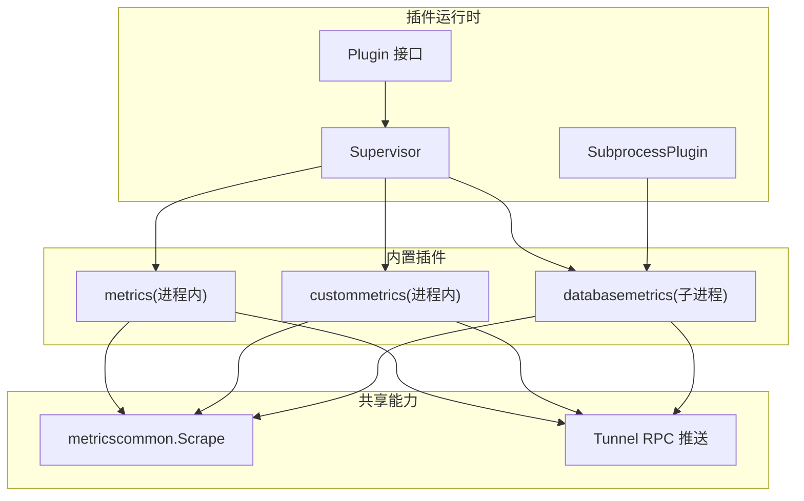
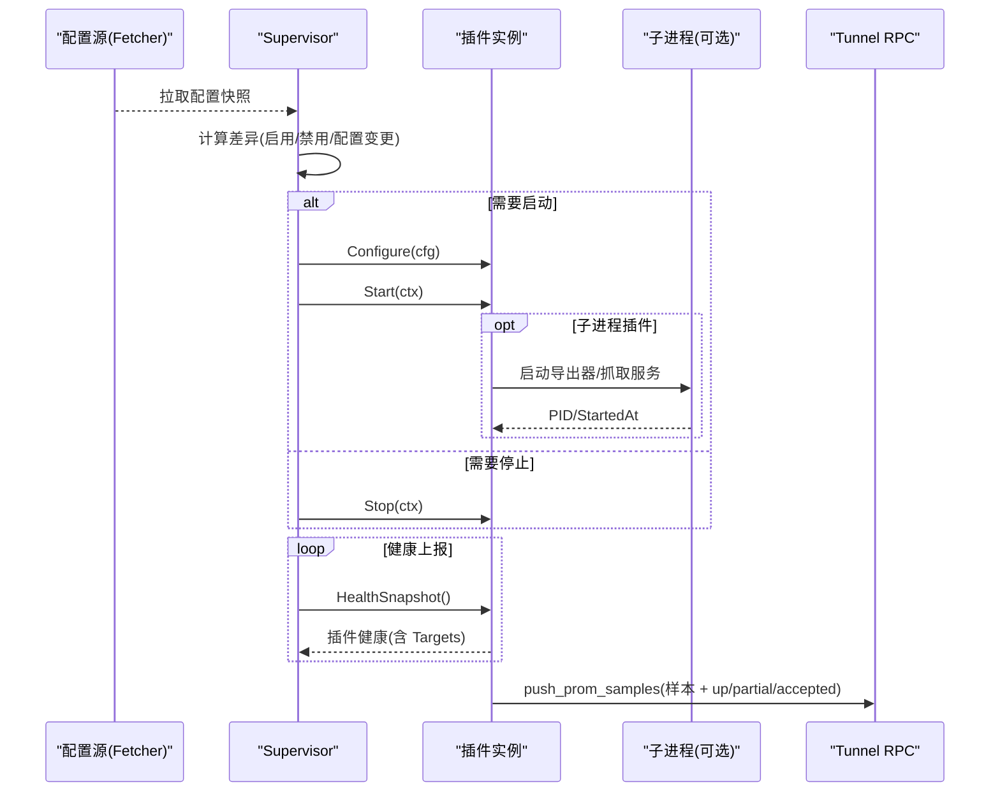
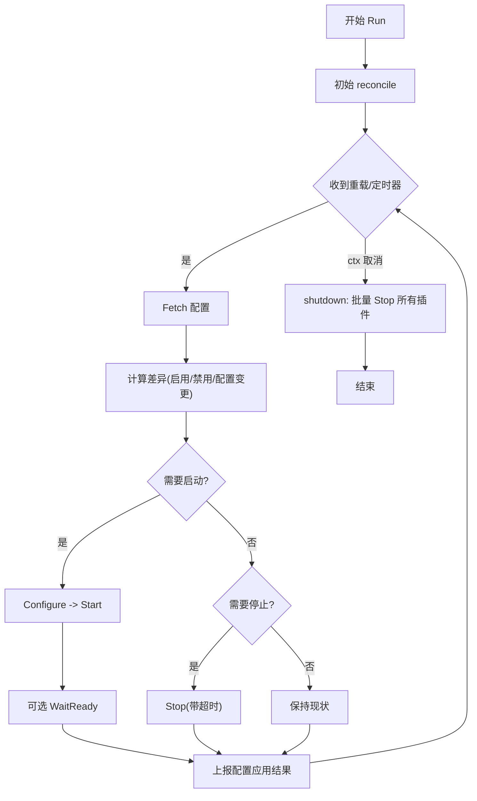
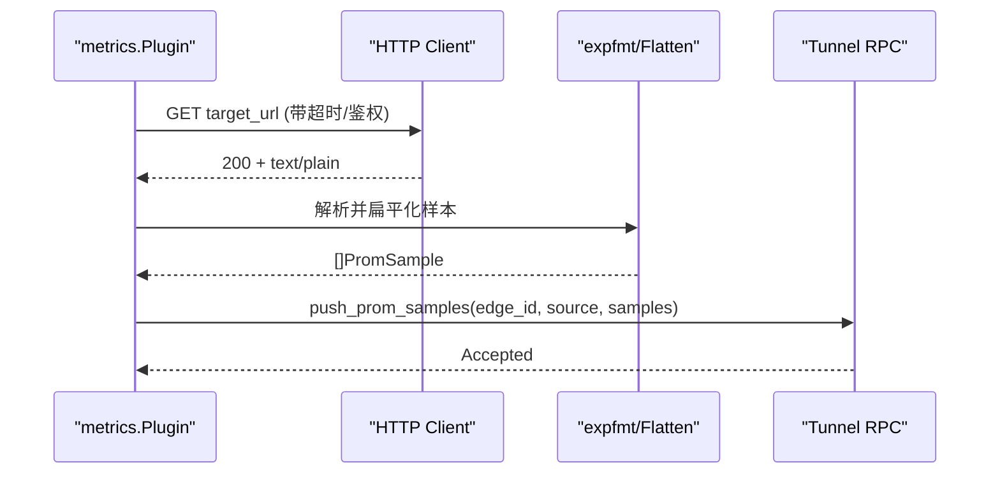
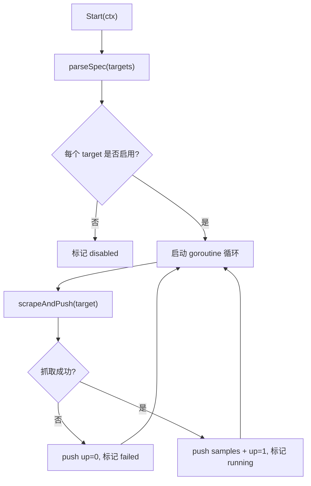
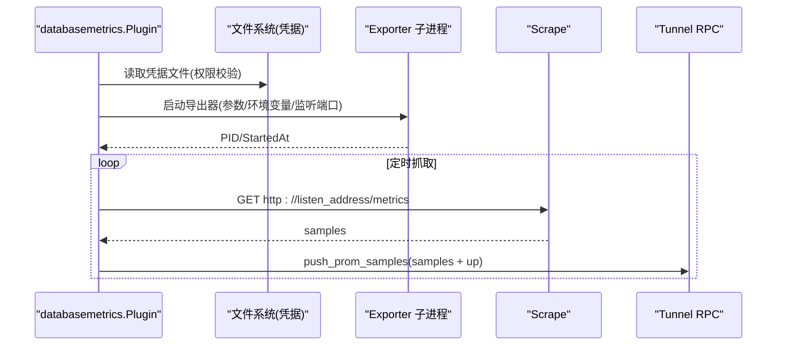
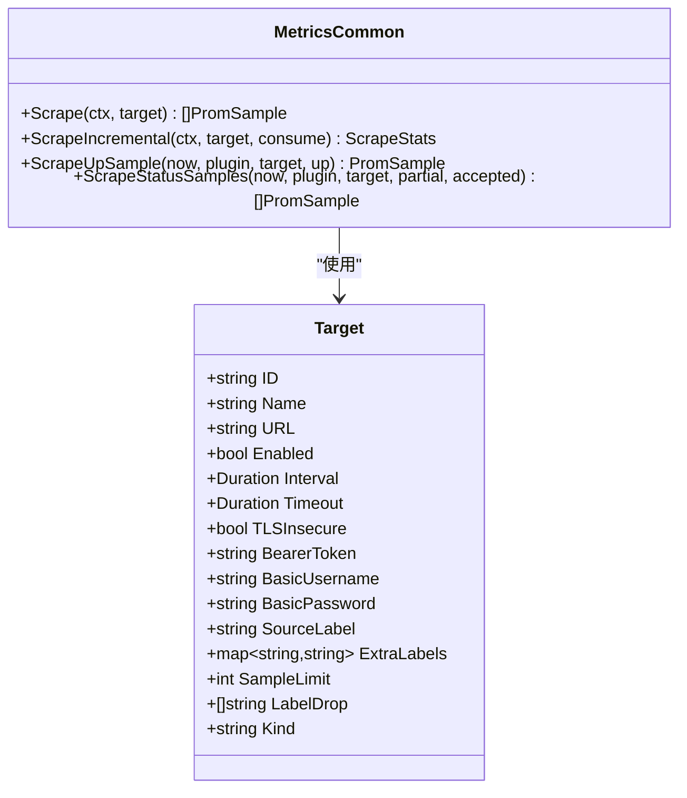
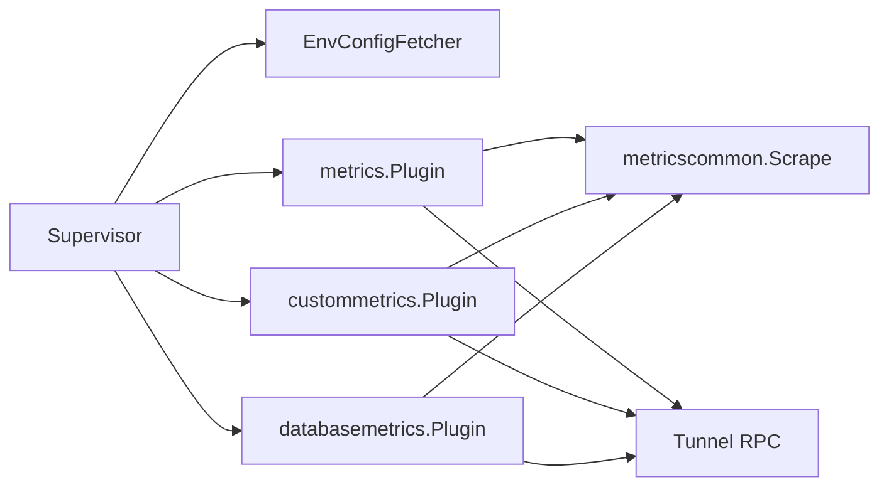

# 内嵌插件开发

<cite>
**本文引用的文件**
- [internal/edgeagent/plugins/plugin.go](file://internal/edgeagent/plugins/plugin.go)
- [internal/edgeagent/plugins/supervisor.go](file://internal/edgeagent/plugins/supervisor.go)
- [internal/edgeagent/plugins/subprocess.go](file://internal/edgeagent/plugins/subprocess.go)
- [internal/edgeagent/plugins/metrics/plugin.go](file://internal/edgeagent/plugins/metrics/plugin.go)
- [internal/edgeagent/plugins/metrics/scrape.go](file://internal/edgeagent/plugins/metrics/scrape.go)
- [internal/edgeagent/plugins/custommetrics/plugin.go](file://internal/edgeagent/plugins/custommetrics/plugin.go)
- [internal/edgeagent/plugins/custommetrics/spec.go](file://internal/edgeagent/plugins/custommetrics/spec.go)
- [internal/edgeagent/plugins/databasemetrics/plugin.go](file://internal/edgeagent/plugins/databasemetrics/plugin.go)
- [internal/edgeagent/plugins/databasemetrics/spec.go](file://internal/edgeagent/plugins/databasemetrics/spec.go)
- [internal/edgeagent/plugins/metricscommon/scrape.go](file://internal/edgeagent/plugins/metricscommon/scrape.go)
- [internal/edgeagent/plugins/config_env.go](file://internal/edgeagent/plugins/config_env.go)
</cite>

## 目录
1. [简介](#简介)
2. [项目结构](#项目结构)
3. [核心组件](#核心组件)
4. [架构总览](#架构总览)
5. [详细组件分析](#详细组件分析)
6. [依赖关系分析](#依赖关系分析)
7. [性能与内存管理](#性能与内存管理)
8. [故障排查指南](#故障排查指南)
9. [结论](#结论)
10. [附录：插件模板与示例](#附录：插件模板与示例)

## 简介
本指南面向需要在 ongrid-edge 中实现“内嵌插件”的开发者，覆盖以下主题：
- 内嵌插件模式与生命周期（Configure → Start → HealthSnapshot → Stop）
- goroutine 管理与并发安全（互斥锁、上下文取消、优雅关闭）
- metrics 插件的采集架构与数据格式（Prometheus 文本协议、tunnel RPC 推送）
- custommetrics 插件的动态配置与自定义指标收集
- databasemetrics 插件的数据库连接管理与查询优化（exporter 子进程、凭据文件、端口隔离）
- 内存管理、资源泄漏防护与性能优化策略
- 插件测试方法与调试技巧
- 错误处理、重试机制与优雅关闭

## 项目结构
插件子系统位于 internal/edgeagent/plugins，包含通用运行时、Supervisor 调度器、子进程封装以及多个具体插件实现。关键组织方式如下：
- 通用接口与状态：Plugin、PluginConfig、PluginHealth、TargetHealth
- 调度器：Supervisor（拉取配置、差异对比、启停协调、健康上报）
- 子进程封装：SubprocessPlugin（二进制启动、日志捕获、崩溃重启、优雅退出）
- 内置插件：
  - metrics：进程内抓取本地 /metrics 并推送
  - custommetrics：抓取任意 Prometheus 端点
  - databasemetrics：为每种数据库类型启动 exporter 子进程并抓取
- 共享工具：metricscommon（HTTP 抓取、限流、标签处理、up 指标）
- 配置来源：EnvConfigFetcher（环境变量驱动），可扩展为隧道配置



图表来源
- [internal/edgeagent/plugins/plugin.go:18-52](file://internal/edgeagent/plugins/plugin.go#L18-L52)
- [internal/edgeagent/plugins/supervisor.go:12-47](file://internal/edgeagent/plugins/supervisor.go#L12-L47)
- [internal/edgeagent/plugins/subprocess.go:17-51](file://internal/edgeagent/plugins/subprocess.go#L17-L51)
- [internal/edgeagent/plugins/metrics/plugin.go:1-35](file://internal/edgeagent/plugins/metrics/plugin.go#L1-L35)
- [internal/edgeagent/plugins/custommetrics/plugin.go:1-28](file://internal/edgeagent/plugins/custommetrics/plugin.go#L1-L28)
- [internal/edgeagent/plugins/databasemetrics/plugin.go:1-29](file://internal/edgeagent/plugins/databasemetrics/plugin.go#L1-L29)
- [internal/edgeagent/plugins/metricscommon/scrape.go:1-20](file://internal/edgeagent/plugins/metricscommon/scrape.go#L1-L20)

章节来源
- [internal/edgeagent/plugins/plugin.go:18-108](file://internal/edgeagent/plugins/plugin.go#L18-L108)
- [internal/edgeagent/plugins/supervisor.go:12-133](file://internal/edgeagent/plugins/supervisor.go#L12-L133)
- [internal/edgeagent/plugins/subprocess.go:17-135](file://internal/edgeagent/plugins/subprocess.go#L17-L135)

## 核心组件
- Plugin 接口：统一的生命周期方法 Name/Configure/Start/Stop/HealthSnapshot；可选 ReadyPlugin 用于等待就绪；可选 ConfigApplyReporter 用于上报配置应用结果。
- Supervisor：负责从 Fetcher 获取配置快照，按启用状态与配置变更进行差异化 Apply，维护 running/current 状态，周期性健康上报，并在退出时优雅停止所有插件。
- SubprocessPlugin：封装子进程生命周期，支持配置渲染、校验、原子替换、SIGTERM 优雅退出、崩溃指数退避重启、日志落盘与健康状态更新。
- metrics 插件：进程内定时抓取本地 /metrics，解析 Prometheus 文本格式，通过 tunnel RPC 推送样本。
- custommetrics 插件：动态解析 targets 列表，并行抓取每个目标，输出 up/partial/accepted 等状态指标。
- databasemetrics 插件：为每个数据库源启动对应 exporter 子进程，读取受管凭据文件，监听独立端口，抓取并推送样本。

章节来源
- [internal/edgeagent/plugins/plugin.go:18-135](file://internal/edgeagent/plugins/plugin.go#L18-L135)
- [internal/edgeagent/plugins/supervisor.go:112-276](file://internal/edgeagent/plugins/supervisor.go#L112-L276)
- [internal/edgeagent/plugins/subprocess.go:140-384](file://internal/edgeagent/plugins/subprocess.go#L140-L384)
- [internal/edgeagent/plugins/metrics/plugin.go:64-179](file://internal/edgeagent/plugins/metrics/plugin.go#L64-L179)
- [internal/edgeagent/plugins/custommetrics/plugin.go:31-133](file://internal/edgeagent/plugins/custommetrics/plugin.go#L31-L133)
- [internal/edgeagent/plugins/databasemetrics/plugin.go:37-143](file://internal/edgeagent/plugins/databasemetrics/plugin.go#L37-L143)

## 架构总览
Supervisor 作为插件编排中心，定期拉取配置并执行差异合并：新增启用则 Configure+Start，禁用则 Stop，配置变化则重新 Configure（必要时 Stop+Start）。插件通过 HealthSnapshot 上报运行态，Supervisor 汇总后上报给管理器。



图表来源
- [internal/edgeagent/plugins/supervisor.go:135-243](file://internal/edgeagent/plugins/supervisor.go#L135-L243)
- [internal/edgeagent/plugins/subprocess.go:208-359](file://internal/edgeagent/plugins/subprocess.go#L208-L359)
- [internal/edgeagent/plugins/metrics/plugin.go:214-282](file://internal/edgeagent/plugins/metrics/plugin.go#L214-L282)
- [internal/edgeagent/plugins/custommetrics/plugin.go:187-229](file://internal/edgeagent/plugins/custommetrics/plugin.go#L187-L229)
- [internal/edgeagent/plugins/databasemetrics/plugin.go:276-324](file://internal/edgeagent/plugins/databasemetrics/plugin.go#L276-L324)

## 详细组件分析

### Supervisor 与插件生命周期
- 配置拉取与合并：每 tick 或收到重载信号时拉取配置，比较 current/running，决定启停与重配。
- 并发安全：使用互斥锁保护 plugins/current/running 映射；对 Stop 调用设置超时避免阻塞。
- 健康上报：遍历已注册插件，收集 HealthSnapshot 并排序返回。
- 优雅关闭：ctx 取消时，批量 Stop 所有插件，带超时保护。



图表来源
- [internal/edgeagent/plugins/supervisor.go:112-276](file://internal/edgeagent/plugins/supervisor.go#L112-L276)

章节来源
- [internal/edgeagent/plugins/supervisor.go:75-133](file://internal/edgeagent/plugins/supervisor.go#L75-L133)
- [internal/edgeagent/plugins/supervisor.go:135-276](file://internal/edgeagent/plugins/supervisor.go#L135-L276)

### SubprocessPlugin 子进程封装
- 配置渲染与校验：将 PluginConfig 渲染为字节，写入临时文件，可选校验后再原子替换，确保崩溃不破坏已知良好配置。
- 进程管理：exec.CommandContext，Cancel 发送 SIGTERM，WaitDelay 提供强制终止兜底；日志定向到工作目录文件。
- 崩溃恢复：runLoop 指数退避重启，限制最大间隔；健康状态在 Starting/Running/Crashed/Stopped 间切换。
- 就绪等待：WaitReady 轮询健康直到稳定一段时间。

```mermaid
classDiagram
class SubprocessPlugin {
-name string
-binary string
-workDir string
-configFile string
-configRender func
-configValid func
-args func
-cfg PluginConfig
-cmd *exec.Cmd
-cancelRun context.CancelFunc
-health PluginHealth
-wantRunning bool
-stoppedCh chan struct{}
+Name() string
+Configure(cfg) error
+Start(ctx) error
+Stop(ctx) error
+HealthSnapshot() PluginHealth
+WaitReady(ctx) error
-runOnce(ctx) error
-runLoop(ctx, stopped)
-setState(st, err, pid)
-bumpRestart()
}
```

图表来源
- [internal/edgeagent/plugins/subprocess.go:32-51](file://internal/edgeagent/plugins/subprocess.go#L32-L51)
- [internal/edgeagent/plugins/subprocess.go:140-384](file://internal/edgeagent/plugins/subprocess.go#L140-L384)

章节来源
- [internal/edgeagent/plugins/subprocess.go:140-384](file://internal/edgeagent/plugins/subprocess.go#L140-L384)

### metrics 插件（进程内抓取）
- 抓取目标：默认抓取 node_exporter 与 process_exporter 的本地 /metrics；支持多 URL、Bearer Token、TLS 跳过验证、额外标签、文件系统去重。
- 解析与扁平化：使用 expfmt 解析文本格式，调用 collector.FlattenSamples 生成 flat samples，附加 source_label。
- 推送路径：通过 tunnel RPC push_prom_samples 推送，附带 edge_id、source、samples；若 edge_id=0 则延迟至注册完成。
- 健康与失败计数：记录 scrapeCount/failureCount，失败时更新 LastError。



图表来源
- [internal/edgeagent/plugins/metrics/scrape.go:149-188](file://internal/edgeagent/plugins/metrics/scrape.go#L149-L188)
- [internal/edgeagent/plugins/metrics/plugin.go:214-282](file://internal/edgeagent/plugins/metrics/plugin.go#L214-L282)

章节来源
- [internal/edgeagent/plugins/metrics/plugin.go:104-179](file://internal/edgeagent/plugins/metrics/plugin.go#L104-L179)
- [internal/edgeagent/plugins/metrics/scrape.go:57-136](file://internal/edgeagent/plugins/metrics/scrape.go#L57-L136)
- [internal/edgeagent/plugins/metrics/scrape.go:243-265](file://internal/edgeagent/plugins/metrics/scrape.go#L243-L265)

### custommetrics 插件（动态目标抓取）
- 动态配置：Spec.targets 数组，每项定义 id、target_url、interval、timeout、auth、extra_labels、sample_limit、label_drop、resource 分类等。
- 并发采集：每个 enabled target 一个 goroutine，按 interval 定时抓取；panic 恢复并标记 failed。
- 指标与状态：成功时追加 up=1，失败时 up=0；同时记录 samples 数量与最近成功时间。
- 资源分类：支持 database 类型并自动注入 resource_category/db_type 标签，kind 设为 db_type。



图表来源
- [internal/edgeagent/plugins/custommetrics/plugin.go:79-185](file://internal/edgeagent/plugins/custommetrics/plugin.go#L79-L185)
- [internal/edgeagent/plugins/custommetrics/spec.go:13-112](file://internal/edgeagent/plugins/custommetrics/spec.go#L13-L112)

章节来源
- [internal/edgeagent/plugins/custommetrics/plugin.go:67-133](file://internal/edgeagent/plugins/custommetrics/plugin.go#L67-L133)
- [internal/edgeagent/plugins/custommetrics/spec.go:13-112](file://internal/edgeagent/plugins/custommetrics/spec.go#L13-L112)

### databasemetrics 插件（数据库导出器）
- 配置模型：sources 数组，每项定义 id、db_type、listen_address、connection.path（受管凭据文件）、exporter 参数、interval/timeout、sample_limit、label_drop 等。
- 凭据管理：读取 connection.path 指向的受管密钥文件，严格权限检查（0600 或更严），空内容拒绝。
- 导出器进程：根据 db_type 选择 mysqld/postgres/redis/mongodb exporter，组装 CLI 参数与环境变量，监听独立端口，日志落盘。
- 抓取与推送：启动 exporter 后，定时抓取其 /metrics，附加 up/partial/accepted 状态指标并通过 tunnel RPC 推送。
- 端口隔离：默认监听地址按 db_type 分配，保留端口冲突检测，避免与其他插件冲突。



图表来源
- [internal/edgeagent/plugins/databasemetrics/plugin.go:178-274](file://internal/edgeagent/plugins/databasemetrics/plugin.go#L178-L274)
- [internal/edgeagent/plugins/databasemetrics/spec.go:168-203](file://internal/edgeagent/plugins/databasemetrics/spec.go#L168-L203)
- [internal/edgeagent/plugins/databasemetrics/spec.go:374-388](file://internal/edgeagent/plugins/databasemetrics/spec.go#L374-L388)

章节来源
- [internal/edgeagent/plugins/databasemetrics/plugin.go:77-143](file://internal/edgeagent/plugins/databasemetrics/plugin.go#L77-L143)
- [internal/edgeagent/plugins/databasemetrics/plugin.go:220-324](file://internal/edgeagent/plugins/databasemetrics/plugin.go#L220-L324)
- [internal/edgeagent/plugins/databasemetrics/spec.go:54-166](file://internal/edgeagent/plugins/databasemetrics/spec.go#L54-L166)

### 共享抓取与指标格式
- Target 结构：包含 ID、URL、Interval、Timeout、鉴权、SourceLabel、ExtraLabels、SampleLimit、LabelDrop、Kind 等。
- Scrape：增量解析 Prometheus 文本流，限制样本数，避免内存膨胀；支持 BasicAuth/BearerToken/TLS 跳过验证。
- 状态指标：
  - up：目标可达性（1/0）
  - ongrid_scrape_partial：是否截断（1/0）
  - ongrid_scrape_samples_accepted：本次接受的样本数
- 标签处理：支持 label_drop 删除高基数标签（如 query/statement/collection），减少 cardinality。



图表来源
- [internal/edgeagent/plugins/metricscommon/scrape.go:22-40](file://internal/edgeagent/plugins/metricscommon/scrape.go#L22-L40)
- [internal/edgeagent/plugins/metricscommon/scrape.go:74-92](file://internal/edgeagent/plugins/metricscommon/scrape.go#L74-L92)
- [internal/edgeagent/plugins/metricscommon/scrape.go:150-190](file://internal/edgeagent/plugins/metricscommon/scrape.go#L150-L190)

章节来源
- [internal/edgeagent/plugins/metricscommon/scrape.go:74-190](file://internal/edgeagent/plugins/metricscommon/scrape.go#L74-L190)
- [internal/edgeagent/plugins/metricscommon/scrape.go:230-270](file://internal/edgeagent/plugins/metricscommon/scrape.go#L230-L270)

## 依赖关系分析
- Supervisor 依赖 ConfigFetcher（当前 EnvConfigFetcher 可用），可替换为隧道配置源。
- 各插件依赖 metricscommon 进行 HTTP 抓取与指标标准化。
- 插件通过 Tunnel RPC 推送样本，依赖 edge_id 注册完成后才能有效推送。
- databasemetrics 依赖外部 exporter 二进制，需保证路径存在且具备执行权限。



图表来源
- [internal/edgeagent/plugins/config_env.go:45-76](file://internal/edgeagent/plugins/config_env.go#L45-L76)
- [internal/edgeagent/plugins/metrics/plugin.go:214-282](file://internal/edgeagent/plugins/metrics/plugin.go#L214-L282)
- [internal/edgeagent/plugins/custommetrics/plugin.go:187-229](file://internal/edgeagent/plugins/custommetrics/plugin.go#L187-L229)
- [internal/edgeagent/plugins/databasemetrics/plugin.go:276-324](file://internal/edgeagent/plugins/databasemetrics/plugin.go#L276-L324)

章节来源
- [internal/edgeagent/plugins/config_env.go:10-76](file://internal/edgeagent/plugins/config_env.go#L10-L76)
- [internal/edgeagent/plugins/metrics/plugin.go:214-282](file://internal/edgeagent/plugins/metrics/plugin.go#L214-L282)
- [internal/edgeagent/plugins/custommetrics/plugin.go:187-229](file://internal/edgeagent/plugins/custommetrics/plugin.go#L187-L229)
- [internal/edgeagent/plugins/databasemetrics/plugin.go:276-324](file://internal/edgeagent/plugins/databasemetrics/plugin.go#L276-L324)

## 性能与内存管理
- 增量解析与样本限制：metricscommon 使用行级流式解析，遇到超出 SampleLimit 立即停止，控制内存峰值。
- 连接池与超时：HTTP 客户端设置最小空闲连接与短拨号超时，避免长时间占用；抓取超时不得大于间隔，防止重叠。
- 文件系统去重：metrics 插件可按设备去重 node_filesystem_* 系列，降低重复采样。
- 标签裁剪：通过 label_drop 移除高基数标签（如 SQL 语句、集合名），降低存储与查询成本。
- 子进程资源：databasemetrics 为每个源启动独立 exporter，注意端口冲突与资源上限；日志落盘便于定位。
- 优雅关闭：Stop 带超时，避免阻塞；子进程先 SIGTERM，再 WaitDelay 强制终止。

[本节为通用指导，无需特定文件引用]

## 故障排查指南
- 配置错误：Supervisor 在 Configure 阶段报错会记录警告并继续其他插件；查看 HealthSnapshot.LastError。
- 抓取失败：metrics/common 会记录 HTTP 状态码与解析错误；custommetrics/databasemetrics 会在失败时推送 up=0。
- 凭据问题：databasemetrics 读取凭据文件失败或权限过宽会直接报错；确认文件路径与权限。
- 端口冲突：databasemetrics 默认监听端口与保留端口冲突时会拒绝配置；调整 listen_address。
- 子进程崩溃：SubprocessPlugin 指数退避重启，观察 RestartCount 与 LastError；检查二进制是否存在与可执行权限。
- 推送失败：edge_id=0 时延迟推送；检查 register_edge 是否完成；tunnel RPC 超时或网络异常会记录警告。

章节来源
- [internal/edgeagent/plugins/supervisor.go:195-243](file://internal/edgeagent/plugins/supervisor.go#L195-L243)
- [internal/edgeagent/plugins/subprocess.go:267-359](file://internal/edgeagent/plugins/subprocess.go#L267-L359)
- [internal/edgeagent/plugins/databasemetrics/plugin.go:326-349](file://internal/edgeagent/plugins/databasemetrics/plugin.go#L326-L349)
- [internal/edgeagent/plugins/metrics/plugin.go:246-282](file://internal/edgeagent/plugins/metrics/plugin.go#L246-L282)

## 结论
本插件体系以统一的 Plugin 接口与 Supervisor 调度为核心，结合 SubprocessPlugin 封装与 metricscommon 共享能力，实现了可扩展、可观测、可运维的内嵌插件模式。通过动态配置、并发采集、资源限制与优雅关闭，满足边缘侧多样化指标的采集与上报需求。建议在实际使用中：
- 合理设置 interval/timeout/sample_limit/label_drop，平衡实时性与资源消耗
- 使用受管凭据与最小权限原则，保障数据安全
- 利用 HealthSnapshot 与日志快速定位问题
- 通过 Supervisor 的重载机制实现热更新与灰度发布

[本节为总结性内容，无需特定文件引用]

## 附录：插件模板与示例
以下为开发新插件的参考步骤与要点（不直接展示代码内容，仅给出路径指引）：
- 实现 Plugin 接口：
  - Name：唯一标识（如 "myplugin"）
  - Configure：解析 Spec 并校验，初始化内部状态
  - Start：启动 goroutine 或子进程，记录 StartedAt
  - Stop：取消上下文，等待退出，带超时保护
  - HealthSnapshot：返回当前健康状态（可包含 Targets）
  - 可选：实现 ReadyPlugin 等待就绪；实现 ConfigApplyReporter 上报配置应用结果
- 并发与资源：
  - 使用 sync.Mutex 保护可变状态
  - 使用 context.Context 控制生命周期与超时
  - 对 goroutine 使用 WaitGroup 或 channel 同步退出
- 抓取与推送：
  - 复用 metricscommon.Target 与 Scrape 函数
  - 通过 tunnel RPC 推送样本，附带 edge_id/source/samples
  - 输出 up/partial/accepted 状态指标
- 配置与测试：
  - 使用 EnvConfigFetcher 或隧道配置源注入 Spec
  - 编写单元测试模拟 Pusher 与 EdgeIDProvider
  - 集成测试验证抓取、推送与健康上报

参考路径
- [internal/edgeagent/plugins/plugin.go:18-135](file://internal/edgeagent/plugins/plugin.go#L18-L135)
- [internal/edgeagent/plugins/metrics/plugin.go:64-179](file://internal/edgeagent/plugins/metrics/plugin.go#L64-L179)
- [internal/edgeagent/plugins/custommetrics/plugin.go:67-133](file://internal/edgeagent/plugins/custommetrics/plugin.go#L67-L133)
- [internal/edgeagent/plugins/databasemetrics/plugin.go:77-143](file://internal/edgeagent/plugins/databasemetrics/plugin.go#L77-L143)
- [internal/edgeagent/plugins/metricscommon/scrape.go:74-190](file://internal/edgeagent/plugins/metricscommon/scrape.go#L74-L190)
- [internal/edgeagent/plugins/config_env.go:45-76](file://internal/edgeagent/plugins/config_env.go#L45-L76)