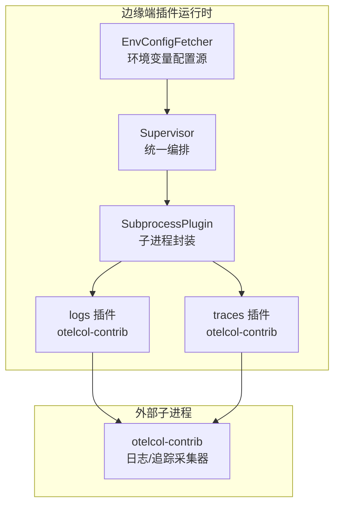
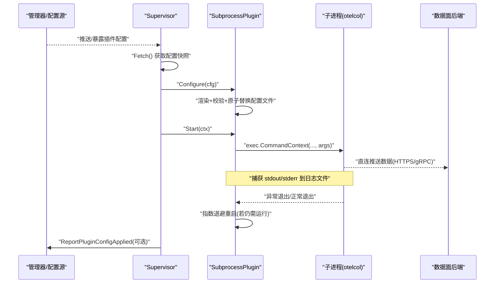
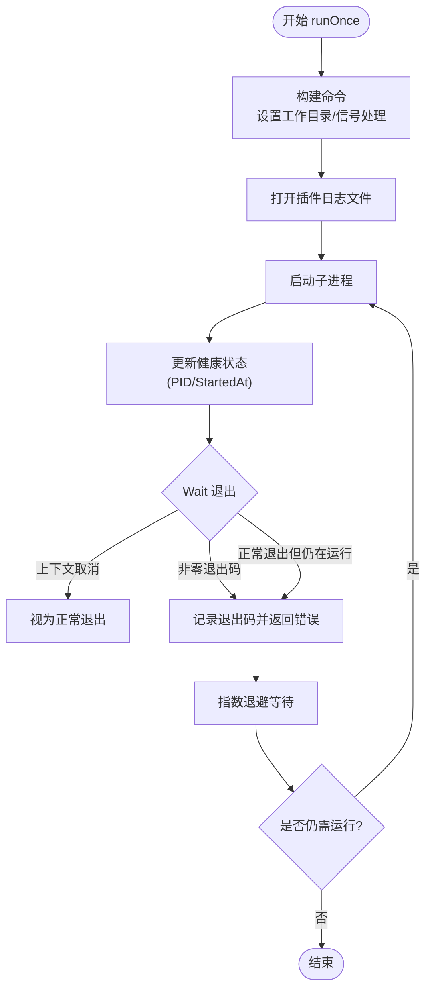
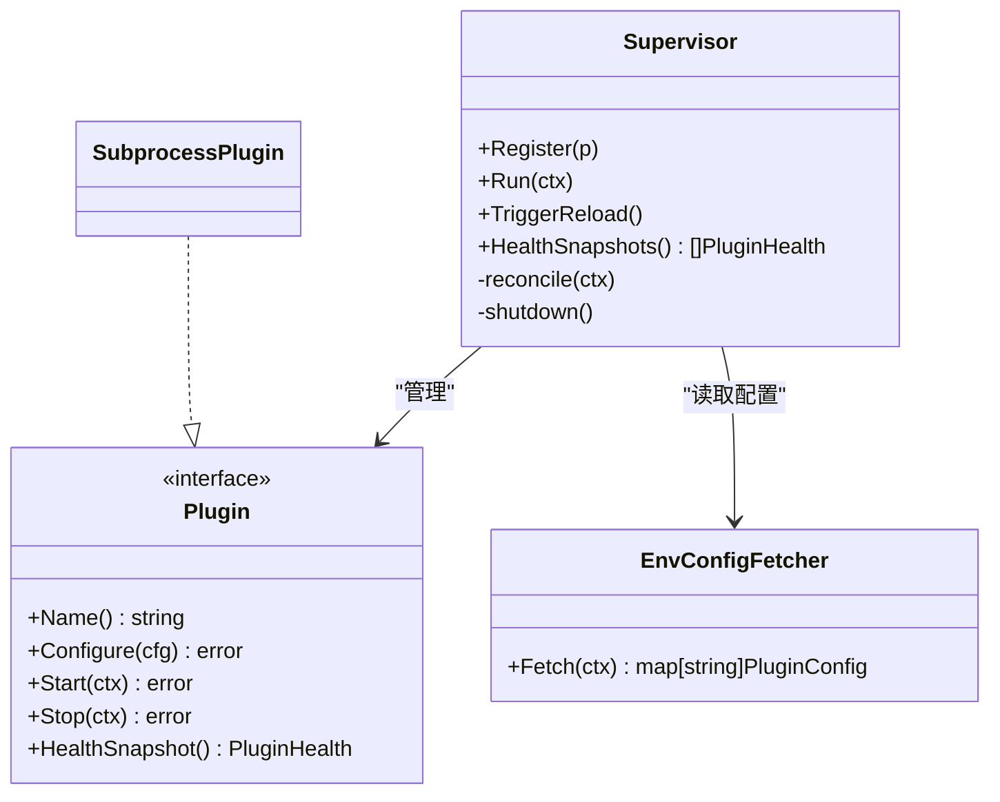
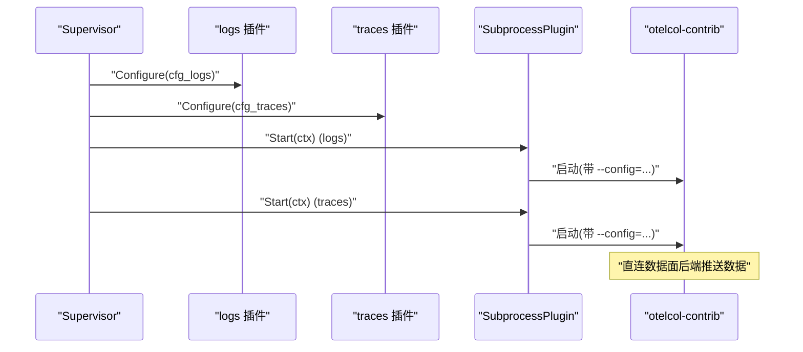
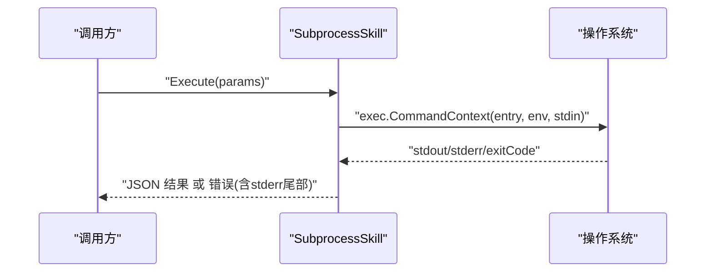
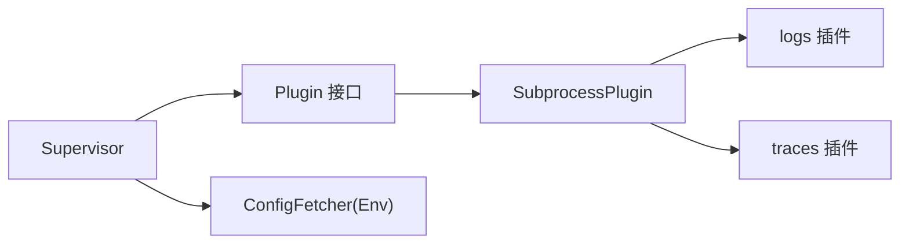

# 子进程插件开发

<cite>
**本文引用的文件**
- [internal/edgeagent/plugins/subprocess.go](file://internal/edgeagent/plugins/subprocess.go)
- [internal/edgeagent/plugins/supervisor.go](file://internal/edgeagent/plugins/supervisor.go)
- [internal/edgeagent/plugins/plugin.go](file://internal/edgeagent/plugins/plugin.go)
- [internal/edgeagent/plugins/config_env.go](file://internal/edgeagent/plugins/config_env.go)
- [internal/edgeagent/plugins/logs/plugin.go](file://internal/edgeagent/plugins/logs/plugin.go)
- [internal/edgeagent/plugins/traces/plugin.go](file://internal/edgeagent/plugins/traces/plugin.go)
- [internal/skill/subprocess.go](file://internal/skill/subprocess.go)
- [internal/skill/types.go](file://internal/skill/types.go)
- [internal/skill/subprocess_process_unix.go](file://internal/skill/subprocess_process_unix.go)
- [internal/skill/subprocess_process_windows.go](file://internal/skill/subprocess_process_windows.go)
</cite>

## 目录
1. [简介](#简介)
2. [项目结构](#项目结构)
3. [核心组件](#核心组件)
4. [架构总览](#架构总览)
5. [详细组件分析](#详细组件分析)
6. [依赖关系分析](#依赖关系分析)
7. [性能与资源管理](#性能与资源管理)
8. [故障排查指南](#故障排查指南)
9. [结论](#结论)
10. [附录：配置注入与环境变量传递](#附录：配置注入与环境变量传递)

## 简介
本指南面向需要在 ongrid-edge 中开发“子进程插件”的工程师，围绕进程隔离、通信机制、生命周期管理（启动/停止/重启/崩溃恢复）、配置注入与环境变量传递、OpenTelemetry Collector 集成、进程间通信协议与安全、性能监控与日志收集、调试技巧以及容器化部署与资源配置优化等主题，提供系统化说明与实践建议。

## 项目结构
本项目在 edgeagent 侧实现了统一的插件运行时，通过 Supervisor 统一管理插件的生命周期；logs 与 traces 两个具体插件以子进程方式运行 OpenTelemetry Collector（otelcol-contrib），由 ongrid-edge 负责渲染配置并启动/监控子进程，数据面直接由子进程推送到后端。skill 子系统提供了通用的外部可执行程序执行能力（用于工具型技能），可作为子进程编程模型参考。

图表来源
- [internal/edgeagent/plugins/supervisor.go:112-133](file://internal/edgeagent/plugins/supervisor.go#L112-L133)
- [internal/edgeagent/plugins/subprocess.go:17-51](file://internal/edgeagent/plugins/subprocess.go#L17-L51)
- [internal/edgeagent/plugins/logs/plugin.go:20-41](file://internal/edgeagent/plugins/logs/plugin.go#L20-L41)
- [internal/edgeagent/plugins/traces/plugin.go:24-49](file://internal/edgeagent/plugins/traces/plugin.go#L24-L49)
- [internal/edgeagent/plugins/config_env.go:45-76](file://internal/edgeagent/plugins/config_env.go#L45-L76)

章节来源
- [internal/edgeagent/plugins/supervisor.go:112-133](file://internal/edgeagent/plugins/supervisor.go#L112-L133)
- [internal/edgeagent/plugins/subprocess.go:17-51](file://internal/edgeagent/plugins/subprocess.go#L17-L51)
- [internal/edgeagent/plugins/logs/plugin.go:20-41](file://internal/edgeagent/plugins/logs/plugin.go#L20-L41)
- [internal/edgeagent/plugins/traces/plugin.go:24-49](file://internal/edgeagent/plugins/traces/plugin.go#L24-L49)
- [internal/edgeagent/plugins/config_env.go:45-76](file://internal/edgeagent/plugins/config_env.go#L45-L76)

## 核心组件
- SubprocessPlugin：通用子进程插件封装，负责配置渲染/校验/原子替换、进程启动/优雅退出、崩溃指数退避重启、健康状态上报与就绪等待。
- Supervisor：插件注册表与协调器，周期性拉取配置快照，对比差异后对每个插件执行 Configure/Start/Stop，并在关闭时安全停止所有插件。
- Plugin 接口与 PluginConfig/PluginHealth：定义插件统一生命周期与配置/健康数据结构。
- EnvConfigFetcher：从环境变量构建插件配置快照，支持 per-plugin 开关、数据面 Endpoint、认证凭据与 Spec 注入。
- logs/traces 插件：基于 SubprocessPlugin 的具体实现，指向 otelcol-contrib 二进制，渲染 OTel 配置并通过 CLI 参数传入。
- skill 子进程执行器：提供跨平台的外部程序执行能力（stdin JSON 入参、stdout JSON 结果、超时控制、环境白名单、进程组隔离），可作为子进程编程范式参考。

章节来源
- [internal/edgeagent/plugins/subprocess.go:17-51](file://internal/edgeagent/plugins/subprocess.go#L17-L51)
- [internal/edgeagent/plugins/supervisor.go:12-47](file://internal/edgeagent/plugins/supervisor.go#L12-L47)
- [internal/edgeagent/plugins/plugin.go:18-135](file://internal/edgeagent/plugins/plugin.go#L18-L135)
- [internal/edgeagent/plugins/config_env.go:10-76](file://internal/edgeagent/plugins/config_env.go#L10-L76)
- [internal/edgeagent/plugins/logs/plugin.go:20-41](file://internal/edgeagent/plugins/logs/plugin.go#L20-L41)
- [internal/edgeagent/plugins/traces/plugin.go:24-49](file://internal/edgeagent/plugins/traces/plugin.go#L24-L49)
- [internal/skill/subprocess.go:30-78](file://internal/skill/subprocess.go#L30-L78)

## 架构总览
子进程插件采用“控制器-工作进程”模式：
- 控制器（Supervisor）负责配置分发与生命周期编排。
- 工作进程（SubprocessPlugin 管理的子进程）专注数据采集与上报，不经过主进程代理数据面流量。
- 配置写入采用“临时文件 + 可选校验 + 原子替换”，保证切换期间子进程读取到的始终是可用的配置。
- 崩溃恢复采用指数退避重启，避免惊群效应。
- 健康状态周期性上报，便于远端观测与告警。

图表来源
- [internal/edgeagent/plugins/supervisor.go:135-243](file://internal/edgeagent/plugins/supervisor.go#L135-L243)
- [internal/edgeagent/plugins/subprocess.go:140-206](file://internal/edgeagent/plugins/subprocess.go#L140-L206)
- [internal/edgeagent/plugins/subprocess.go:208-360](file://internal/edgeagent/plugins/subprocess.go#L208-L360)

## 详细组件分析

### SubprocessPlugin 组件
- 职责
  - 渲染配置：将 PluginConfig 转换为字节流，写入临时文件，可选调用配置校验器，最后原子替换为目标路径。
  - 进程管理：使用 exec.CommandContext 启动子进程，设置工作目录、标准输出/错误重定向至日志文件，优雅退出策略为 SIGTERM，超时后回退 SIGKILL。
  - 崩溃恢复：runLoop 循环检测子进程退出，按指数退避（上限固定）重启，直至被 Stop 或上下文取消。
  - 健康与就绪：维护 PluginHealth，提供 WaitReady 等待稳定运行一段时间，排除瞬时启动失败。
- 关键设计点
  - 配置原子替换：先写临时文件并设置权限，再 rename 覆盖目标，降低中间态风险。
  - 优雅退出：Cancel 回调发送 SIGTERM，WaitDelay 作为兜底强制终止时间。
  - 重启计数：每次崩溃重启递增 RestartCount，便于诊断。
  - 日志隔离：每个插件独立日志文件，便于定位问题。

图表来源
- [internal/edgeagent/plugins/subprocess.go:267-360](file://internal/edgeagent/plugins/subprocess.go#L267-L360)

章节来源
- [internal/edgeagent/plugins/subprocess.go:140-206](file://internal/edgeagent/plugins/subprocess.go#L140-L206)
- [internal/edgeagent/plugins/subprocess.go:208-360](file://internal/edgeagent/plugins/subprocess.go#L208-L360)

### Supervisor 组件
- 职责
  - 注册插件：集中管理插件实例。
  - 配置同步：定时或触发式拉取配置快照，计算差异并应用。
  - 生命周期编排：对新启用/变更配置的插件执行 Configure → Start；对禁用插件执行 Stop；关闭时批量停止。
  - 健康上报：汇总各插件健康快照供心跳上报。
- 关键设计点
  - 幂等性：重复 Start 无副作用；Stop 在非运行态安全。
  - 健壮性：单个插件配置/启动失败不影响其他插件。
  - 就绪等待：对实现 ReadyPlugin 的插件，启动后等待就绪再报告配置已应用。

图表来源
- [internal/edgeagent/plugins/supervisor.go:12-47](file://internal/edgeagent/plugins/supervisor.go#L12-L47)
- [internal/edgeagent/plugins/plugin.go:18-52](file://internal/edgeagent/plugins/plugin.go#L18-L52)
- [internal/edgeagent/plugins/config_env.go:45-76](file://internal/edgeagent/plugins/config_env.go#L45-L76)

章节来源
- [internal/edgeagent/plugins/supervisor.go:112-243](file://internal/edgeagent/plugins/supervisor.go#L112-L243)
- [internal/edgeagent/plugins/plugin.go:18-135](file://internal/edgeagent/plugins/plugin.go#L18-L135)

### logs/traces 插件（OpenTelemetry Collector 集成）
- 共同点
  - 均复用 SubprocessPlugin，指定 otelcol-contrib 二进制与工作目录。
  - 渲染 OTel 配置并传入 --config=... 参数。
  - 使用内置验证器校验渲染后的配置。
- 差异点
  - logs 插件侧重日志采集与推送（如 Loki/Elasticsearch）。
  - traces 插件侧重链路追踪采集与推送（如 /v1/traces）。

图表来源
- [internal/edgeagent/plugins/logs/plugin.go:20-41](file://internal/edgeagent/plugins/logs/plugin.go#L20-L41)
- [internal/edgeagent/plugins/traces/plugin.go:24-49](file://internal/edgeagent/plugins/traces/plugin.go#L24-L49)
- [internal/edgeagent/plugins/subprocess.go:208-360](file://internal/edgeagent/plugins/subprocess.go#L208-L360)

章节来源
- [internal/edgeagent/plugins/logs/plugin.go:20-41](file://internal/edgeagent/plugins/logs/plugin.go#L20-L41)
- [internal/edgeagent/plugins/traces/plugin.go:24-49](file://internal/edgeagent/plugins/traces/plugin.go#L24-L49)

### 子进程编程模型（Skill 子系统）
- 作用
  - 提供统一的“外部可执行程序”执行框架：stdin 接收 JSON 参数，stdout 输出 JSON 结果，非零退出码视为错误。
  - 安全与资源保护：默认继承空环境，仅允许白名单环境变量透传；限制 stdout 大小防止内存膨胀；超时控制；Unix 下进程组隔离与强杀。
- 适用场景
  - 需要快速实现轻量级工具型能力（探测、查询、文件操作等），无需引入语言运行时。

图表来源
- [internal/skill/subprocess.go:99-172](file://internal/skill/subprocess.go#L99-L172)
- [internal/skill/subprocess.go:207-238](file://internal/skill/subprocess.go#L207-L238)
- [internal/skill/subprocess_process_unix.go:12-26](file://internal/skill/subprocess_process_unix.go#L12-L26)

章节来源
- [internal/skill/subprocess.go:30-78](file://internal/skill/subprocess.go#L30-L78)
- [internal/skill/subprocess.go:99-172](file://internal/skill/subprocess.go#L99-L172)
- [internal/skill/subprocess.go:207-238](file://internal/skill/subprocess.go#L207-L238)
- [internal/skill/subprocess_process_unix.go:12-26](file://internal/skill/subprocess_process_unix.go#L12-L26)
- [internal/skill/subprocess_process_windows.go:5-7](file://internal/skill/subprocess_process_windows.go#L5-L7)

## 依赖关系分析
- 松耦合
  - Supervisor 通过 Plugin 接口与具体实现解耦，新增插件只需实现接口。
  - 配置源通过 ConfigFetcher 抽象，当前提供环境变量实现，未来可扩展为隧道/远程配置源。
- 内聚性
  - SubprocessPlugin 将配置、进程、健康、重启逻辑高度内聚，降低业务插件复杂度。
- 外部依赖
  - logs/traces 依赖 otelcol-contrib 二进制，需随发行包提供并确保路径正确。
  - Unix 下通过进程组隔离提升清理可靠性。

图表来源
- [internal/edgeagent/plugins/supervisor.go:12-47](file://internal/edgeagent/plugins/supervisor.go#L12-L47)
- [internal/edgeagent/plugins/plugin.go:18-52](file://internal/edgeagent/plugins/plugin.go#L18-L52)
- [internal/edgeagent/plugins/config_env.go:45-76](file://internal/edgeagent/plugins/config_env.go#L45-L76)

章节来源
- [internal/edgeagent/plugins/supervisor.go:12-47](file://internal/edgeagent/plugins/supervisor.go#L12-L47)
- [internal/edgeagent/plugins/plugin.go:18-52](file://internal/edgeagent/plugins/plugin.go#L18-L52)
- [internal/edgeagent/plugins/config_env.go:45-76](file://internal/edgeagent/plugins/config_env.go#L45-L76)

## 性能与资源管理
- 进程隔离
  - 子进程与主进程隔离，崩溃不会导致主进程崩溃；日志与配置隔离于独立目录。
- 崩溃恢复
  - 指数退避重启，上限封顶，避免频繁重启造成抖动。
- I/O 与内存
  - 子进程 stdout/stderr 写入文件，避免内存无限增长；skill 子系统对 stdout 做容量限制。
- 优雅退出
  - 优先 SIGTERM，超时后 SIGKILL，确保可控的资源释放。
- 配置原子替换
  - 临时文件 + 校验 + rename，减少配置不一致导致的异常。
- 并发与锁
  - 关键状态变更加锁，避免竞态；Supervisor 对插件操作串行化。

[本节为通用指导，不直接分析具体文件]

## 故障排查指南
- 常见问题
  - 子进程二进制缺失：检查二进制路径与权限。
  - 配置渲染失败：查看渲染函数与校验器返回的错误信息。
  - 子进程启动失败：检查命令行参数、工作目录、依赖库。
  - 子进程频繁崩溃：关注健康状态中的 LastError 与 RestartCount，结合日志文件定位。
  - 配置未生效：确认 Supervisor 是否收到配置变更并触发 reconcile。
- 定位手段
  - 查看插件日志文件（workDir 下的 <name>.log）。
  - 检查健康快照（名称、状态、PID、错误信息、重启次数）。
  - 验证配置内容（临时文件与最终文件一致性）。
  - 使用 readiness 等待判断是否真正就绪。

章节来源
- [internal/edgeagent/plugins/subprocess.go:258-384](file://internal/edgeagent/plugins/subprocess.go#L258-L384)
- [internal/edgeagent/plugins/supervisor.go:135-243](file://internal/edgeagent/plugins/supervisor.go#L135-L243)

## 结论
子进程插件架构通过 Supervisor 与 SubprocessPlugin 的组合，实现了高内聚、低耦合、可观测、可恢复的边缘插件运行时。配合 logs/traces 对 OpenTelemetry Collector 的封装，开发者仅需关注配置渲染与二进制入口，即可快速扩展新的采集能力。skill 子系统则提供了更通用的外部程序执行范式，适用于轻量工具型场景。

[本节为总结性内容，不直接分析具体文件]

## 附录：配置注入与环境变量传递
- 环境变量配置源（EnvConfigFetcher）
  - per-plugin 开关：ENABLED
  - 数据面地址：ENDPOINT
  - 认证凭据：AUTH_USER、AUTH_PASS（可回退到全局 ACCESS_KEY/SECRET_KEY）
  - 插件特定配置：SPEC_JSON（JSON 字符串）
  - 设备标识：DEVICE_ID（或兼容 EDGE_ID）
- Skill 子进程环境变量
  - 默认不继承父进程环境，仅透传白名单列表中的变量名，避免敏感信息泄露。
- 安全考虑
  - 配置文件中可能包含认证信息，写入临时文件时设置严格权限，校验失败不替换目标文件。
  - 子进程最小权限原则：仅授予必要的环境变量与文件系统访问。

章节来源
- [internal/edgeagent/plugins/config_env.go:10-76](file://internal/edgeagent/plugins/config_env.go#L10-L76)
- [internal/skill/subprocess.go:64-78](file://internal/skill/subprocess.go#L64-L78)
- [internal/skill/subprocess.go:174-193](file://internal/skill/subprocess.go#L174-L193)
- [internal/edgeagent/plugins/subprocess.go:164-206](file://internal/edgeagent/plugins/subprocess.go#L164-L206)