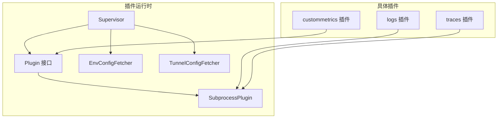
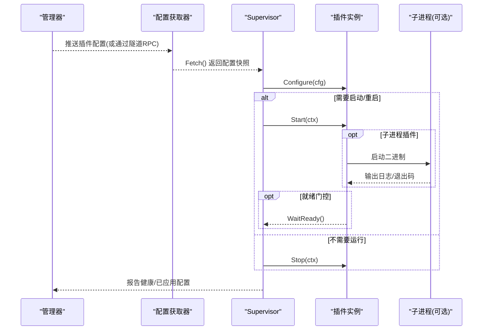
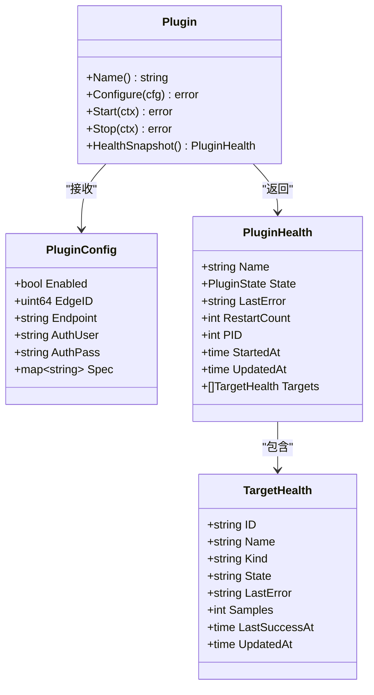
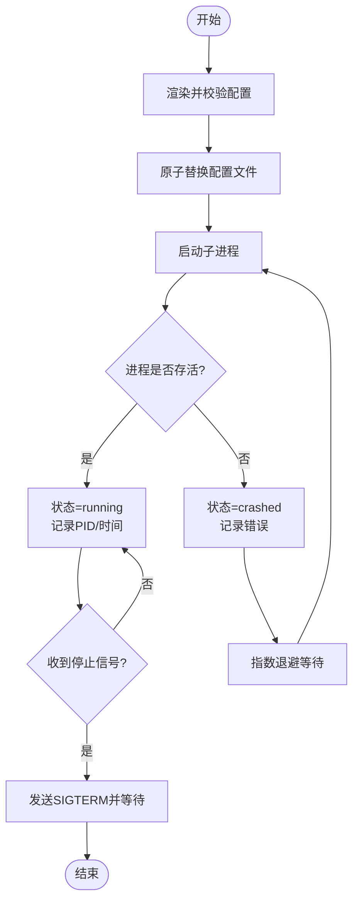
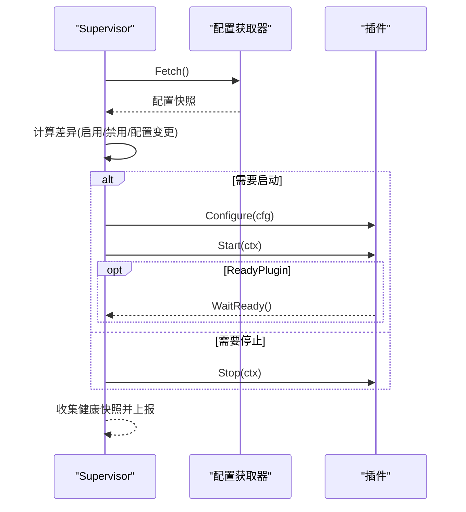
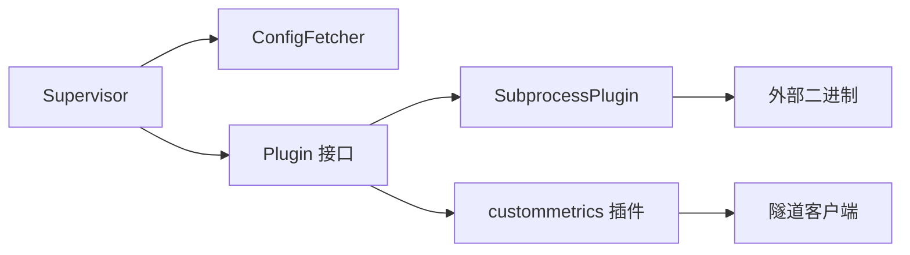

# 插件开发指南

<cite>
**本文档引用的文件**
- [internal/edgeagent/plugins/plugin.go](file://internal/edgeagent/plugins/plugin.go)
- [internal/edgeagent/plugins/subprocess.go](file://internal/edgeagent/plugins/subprocess.go)
- [internal/edgeagent/plugins/supervisor.go](file://internal/edgeagent/plugins/supervisor.go)
- [internal/edgeagent/plugins/config_env.go](file://internal/edgeagent/plugins/config_env.go)
- [internal/edgeagent/plugins/config_tunnel.go](file://internal/edgeagent/plugins/config_tunnel.go)
- [internal/edgeagent/plugins/logs/plugin.go](file://internal/edgeagent/plugins/logs/plugin.go)
- [internal/edgeagent/plugins/logs/render.go](file://internal/edgeagent/plugins/logs/render.go)
- [internal/edgeagent/plugins/traces/plugin.go](file://internal/edgeagent/plugins/traces/plugin.go)
- [internal/edgeagent/plugins/custommetrics/plugin.go](file://internal/edgeagent/plugins/custommetrics/plugin.go)
- [internal/edgeagent/plugins/custommetrics/spec.go](file://internal/edgeagent/plugins/custommetrics/spec.go)
- [internal/edgeagent/plugins/supervisor_test.go](file://internal/edgeagent/plugins/supervisor_test.go)
</cite>

## 目录
1. [简介](#简介)
2. [项目结构](#项目结构)
3. [核心组件](#核心组件)
4. [架构总览](#架构总览)
5. [详细组件分析](#详细组件分析)
6. [依赖关系分析](#依赖关系分析)
7. [性能与资源限制](#性能与资源限制)
8. [测试与调试](#测试与调试)
9. [安全考虑](#安全考虑)
10. [打包与分发](#打包与分发)
11. [常见问题与排错](#常见问题与排错)
12. [最佳实践](#最佳实践)
13. [结论](#结论)

## 简介
本指南面向希望在 Ongrid 边缘侧开发自定义插件的工程师，覆盖接口实现、配置结构、错误处理、内嵌插件与子进程插件两种模式差异、测试与调试、安全与资源限制、打包分发流程以及常见陷阱与优化建议。Ongrid 的边缘插件以“信号”命名（如 metrics、logs、traces），由 Supervisor 统一编排生命周期，支持通过环境变量或隧道从管理器动态下发配置，并具备崩溃重启、健康上报等能力。

## 项目结构
插件子系统位于 internal/edgeagent/plugins，核心包括：
- 插件接口与通用数据结构：定义 Plugin、PluginConfig、PluginHealth、TargetHealth 等
- 子进程插件封装：SubprocessPlugin 负责外部二进制（如 otelcol-contrib）的生命周期管理
- 插件监管器：Supervisor 负责配置拉取、差异对比、启停与重启
- 配置来源：EnvConfigFetcher（环境变量）、TunnelConfigFetcher（隧道 RPC + 环境回退）
- 内置插件示例：logs、traces（子进程模式）、custommetrics（内嵌模式）

图表来源
- [internal/edgeagent/plugins/plugin.go:18-52](file://internal/edgeagent/plugins/plugin.go#L18-L52)
- [internal/edgeagent/plugins/subprocess.go:17-51](file://internal/edgeagent/plugins/subprocess.go#L17-L51)
- [internal/edgeagent/plugins/supervisor.go:12-47](file://internal/edgeagent/plugins/supervisor.go#L12-L47)
- [internal/edgeagent/plugins/config_env.go:10-36](file://internal/edgeagent/plugins/config_env.go#L10-L36)
- [internal/edgeagent/plugins/config_tunnel.go:18-55](file://internal/edgeagent/plugins/config_tunnel.go#L18-L55)
- [internal/edgeagent/plugins/logs/plugin.go:20-41](file://internal/edgeagent/plugins/logs/plugin.go#L20-L41)
- [internal/edgeagent/plugins/traces/plugin.go:24-49](file://internal/edgeagent/plugins/traces/plugin.go#L24-L49)
- [internal/edgeagent/plugins/custommetrics/plugin.go:31-63](file://internal/edgeagent/plugins/custommetrics/plugin.go#L31-L63)

章节来源
- [internal/edgeagent/plugins/plugin.go:18-52](file://internal/edgeagent/plugins/plugin.go#L18-L52)
- [internal/edgeagent/plugins/subprocess.go:17-51](file://internal/edgeagent/plugins/subprocess.go#L17-L51)
- [internal/edgeagent/plugins/supervisor.go:12-47](file://internal/edgeagent/plugins/supervisor.go#L12-L47)
- [internal/edgeagent/plugins/config_env.go:10-36](file://internal/edgeagent/plugins/config_env.go#L10-L36)
- [internal/edgeagent/plugins/config_tunnel.go:18-55](file://internal/edgeagent/plugins/config_tunnel.go#L18-L55)

## 核心组件
- 插件接口 Plugin：统一 Name、Configure、Start、Stop、HealthSnapshot；可选 ReadyPlugin 提供 WaitReady 就绪门控
- 配置结构 PluginConfig：包含 Enabled、EdgeID、Endpoint、AuthUser/AuthPass、Spec（插件特定 JSON）
- 健康状态 PluginHealth/TargetHealth：记录运行态、错误、重启次数、PID、目标级健康
- 子进程插件 SubprocessPlugin：渲染配置、校验、原子替换、启动/停止、崩溃指数退避重启、日志落盘
- 监管器 Supervisor：定时/信号触发 reconcile，比较 desired vs current，按需 Configure/Stop/Start，报告已应用配置
- 配置获取器：
  - EnvConfigFetcher：从环境变量读取每个插件的配置快照
  - TunnelConfigFetcher：从管理器通过隧道 RPC 获取配置，失败时回退到环境变量；支持 Kubernetes 默认值注入与缓存

章节来源
- [internal/edgeagent/plugins/plugin.go:18-135](file://internal/edgeagent/plugins/plugin.go#L18-L135)
- [internal/edgeagent/plugins/subprocess.go:86-135](file://internal/edgeagent/plugins/subprocess.go#L86-L135)
- [internal/edgeagent/plugins/supervisor.go:49-110](file://internal/edgeagent/plugins/supervisor.go#L49-L110)
- [internal/edgeagent/plugins/config_env.go:45-76](file://internal/edgeagent/plugins/config_env.go#L45-L76)
- [internal/edgeagent/plugins/config_tunnel.go:100-186](file://internal/edgeagent/plugins/config_tunnel.go#L100-L186)

## 架构总览
插件系统采用“监管器 + 插件实现 + 配置源”的分层设计。Supervisor 周期性拉取配置并与当前状态做差异对比，调用插件的 Configure/Start/Stop 完成期望状态收敛。子进程插件将外部二进制作为独立进程管理，内嵌插件在 ongrid-edge 进程内运行。

图表来源
- [internal/edgeagent/plugins/supervisor.go:112-243](file://internal/edgeagent/plugins/supervisor.go#L112-L243)
- [internal/edgeagent/plugins/subprocess.go:208-360](file://internal/edgeagent/plugins/subprocess.go#L208-L360)
- [internal/edgeagent/plugins/config_tunnel.go:100-186](file://internal/edgeagent/plugins/config_tunnel.go#L100-L186)

## 详细组件分析

### 插件接口与数据模型
- Plugin：Name/Configure/Start/Stop/HealthSnapshot；可选 ReadyPlugin.WaitReady
- PluginConfig：Enabled、EdgeID、Endpoint、AuthUser/AuthPass、Spec
- PluginHealth/TargetHealth：用于健康上报与多目标指标插件的目标级状态

图表来源
- [internal/edgeagent/plugins/plugin.go:18-135](file://internal/edgeagent/plugins/plugin.go#L18-L135)

章节来源
- [internal/edgeagent/plugins/plugin.go:18-135](file://internal/edgeagent/plugins/plugin.go#L18-L135)

### 子进程插件封装（SubprocessPlugin）
- 职责：渲染配置、校验、原子替换、启动/停止、崩溃指数退避重启、日志落盘、健康状态维护
- 关键行为：
  - stageValidateAndReplace：临时文件写入 -> 可选校验 -> 原子重命名 -> 目录同步
  - runLoop：循环启动子进程，非零退出或意外退出视为崩溃，指数退避重启（上限 5 分钟）
  - SIGTERM 优雅关闭，WaitDelay 超时后强制终止
  - HealthSnapshot 暴露 PID、StartedAt、RestartCount、LastError

图表来源
- [internal/edgeagent/plugins/subprocess.go:140-206](file://internal/edgeagent/plugins/subprocess.go#L140-L206)
- [internal/edgeagent/plugins/subprocess.go:267-360](file://internal/edgeagent/plugins/subprocess.go#L267-L360)

章节来源
- [internal/edgeagent/plugins/subprocess.go:140-206](file://internal/edgeagent/plugins/subprocess.go#L140-L206)
- [internal/edgeagent/plugins/subprocess.go:267-360](file://internal/edgeagent/plugins/subprocess.go#L267-L360)

### 插件监管器（Supervisor）
- 职责：注册插件、拉取配置、差异对比、按策略 Configure/Start/Stop、健康汇总上报
- 关键行为：
  - Run：初始 apply，定时 tick 与 reload 信号驱动 reconcile
  - reconcile：比较 desired vs current，变更则重新 Configure，必要时 Stop+Start
  - reportConfigApplied：可选向管理器报告配置应用结果（含错误）
  - shutdown：有序停止所有插件

图表来源
- [internal/edgeagent/plugins/supervisor.go:112-243](file://internal/edgeagent/plugins/supervisor.go#L112-L243)

章节来源
- [internal/edgeagent/plugins/supervisor.go:112-243](file://internal/edgeagent/plugins/supervisor.go#L112-L243)

### 配置来源与环境变量
- EnvConfigFetcher：从环境变量读取每个插件的 ENABLED、ENDPOINT、AUTH_USER/AUTH_PASS、SPEC_JSON，并合并全局设备标识
- 特点：对未知插件名静默忽略；SPEC_JSON 解析失败不导致崩溃

章节来源
- [internal/edgeagent/plugins/config_env.go:10-36](file://internal/edgeagent/plugins/config_env.go#L10-L36)
- [internal/edgeagent/plugins/config_env.go:45-76](file://internal/edgeagent/plugins/config_env.go#L45-L76)

### 配置来源与隧道集成
- TunnelConfigFetcher：优先从管理器通过隧道 RPC 获取配置；失败时回退到环境变量；支持缓存上次成功快照
- Kubernetes 默认值注入：根据角色/模式自动设置 logs/traces/metrics/hostmetrics/procmetrics 的默认参数
- 日志运行时材料化：为 logs 插件注入必要字段（如 cluster_id/node_name/pod_log_path 等）

章节来源
- [internal/edgeagent/plugins/config_tunnel.go:18-55](file://internal/edgeagent/plugins/config_tunnel.go#L18-L55)
- [internal/edgeagent/plugins/config_tunnel.go:100-186](file://internal/edgeagent/plugins/config_tunnel.go#L100-L186)
- [internal/edgeagent/plugins/config_tunnel.go:212-393](file://internal/edgeagent/plugins/config_tunnel.go#L212-L393)

### 内置插件示例：logs（子进程模式）
- 包装 otelcol-contrib 子进程，渲染 YAML 配置，使用 OTLP 直接推送到内置 Loki 或外部 Elasticsearch
- 配置渲染包含：receivers（journald/filelog/kubernetes）、processors（内存限制/资源/转换/批处理）、exporters（Loki/Elasticsearch）、extensions（存储/健康检查）
- 安全与限制：禁止内联敏感凭据、路径白名单校验、属性长度限制、队列与批大小控制

章节来源
- [internal/edgeagent/plugins/logs/plugin.go:20-41](file://internal/edgeagent/plugins/logs/plugin.go#L20-L41)
- [internal/edgeagent/plugins/logs/render.go:52-252](file://internal/edgeagent/plugins/logs/render.go#L52-L252)
- [internal/edgeagent/plugins/logs/render.go:502-600](file://internal/edgeagent/plugins/logs/render.go#L502-L600)

### 内置插件示例：traces（子进程模式）
- 同样包装 otelcol-contrib，接受本地 OTLP gRPC/HTTP，直接推送到管理器 /v1/traces
- 通过 --config 传入渲染后的配置

章节来源
- [internal/edgeagent/plugins/traces/plugin.go:24-49](file://internal/edgeagent/plugins/traces/plugin.go#L24-L49)

### 内置插件示例：custommetrics（内嵌模式）
- 内嵌 Prometheus 端点抓取器，按目标并行抓取并通过隧道 push_prom_samples 上报
- 支持目标级健康、样本数统计、错误恢复、panic 保护
- 配置解析：targets 数组、URL/鉴权/标签/采样限制等

章节来源
- [internal/edgeagent/plugins/custommetrics/plugin.go:31-63](file://internal/edgeagent/plugins/custommetrics/plugin.go#L31-L63)
- [internal/edgeagent/plugins/custommetrics/plugin.go:135-229](file://internal/edgeagent/plugins/custommetrics/plugin.go#L135-L229)
- [internal/edgeagent/plugins/custommetrics/spec.go:13-112](file://internal/edgeagent/plugins/custommetrics/spec.go#L13-L112)

## 依赖关系分析
- Supervisor 依赖 ConfigFetcher 抽象，可插拔环境变量或隧道实现
- SubprocessPlugin 依赖外部二进制路径与工作目录，内部通过 exec.CommandContext 管理进程
- 具体插件依赖各自渲染逻辑与验证器（如 logs/traces 使用 OTel 配置校验）
- custommetrics 依赖隧道客户端进行样本上报

图表来源
- [internal/edgeagent/plugins/supervisor.go:12-47](file://internal/edgeagent/plugins/supervisor.go#L12-L47)
- [internal/edgeagent/plugins/subprocess.go:17-51](file://internal/edgeagent/plugins/subprocess.go#L17-L51)
- [internal/edgeagent/plugins/custommetrics/plugin.go:31-63](file://internal/edgeagent/plugins/custommetrics/plugin.go#L31-L63)

章节来源
- [internal/edgeagent/plugins/supervisor.go:12-47](file://internal/edgeagent/plugins/supervisor.go#L12-L47)
- [internal/edgeagent/plugins/subprocess.go:17-51](file://internal/edgeagent/plugins/subprocess.go#L17-L51)
- [internal/edgeagent/plugins/custommetrics/plugin.go:31-63](file://internal/edgeagent/plugins/custommetrics/plugin.go#L31-L63)

## 性能与资源限制
- 子进程插件崩溃重启采用指数退避，避免雪崩（上限 5 分钟）
- logs 插件使用内存限制处理器、发送队列与批大小控制，降低峰值压力
- 配置渲染阶段进行严格校验与长度限制，防止异常配置导致资源耗尽
- 多目标抓取（custommetrics）并发执行，但受目标超时与间隔约束

章节来源
- [internal/edgeagent/plugins/subprocess.go:267-308](file://internal/edgeagent/plugins/subprocess.go#L267-L308)
- [internal/edgeagent/plugins/logs/render.go:174-208](file://internal/edgeagent/plugins/logs/render.go#L174-L208)
- [internal/edgeagent/plugins/custommetrics/plugin.go:135-185](file://internal/edgeagent/plugins/custommetrics/plugin.go#L135-L185)

## 测试与调试
- 单元测试：supervisor_test 提供 fakePlugin 与 staticFetcher，验证启用/禁用、重配重启、故障回退等行为
- 调试技巧：
  - 查看子进程日志文件（workDir/<plugin>.log）
  - 使用环境变量快速验证端到端流程（EnvConfigFetcher）
  - 通过 TriggerReload 主动触发配置重载
  - 关注 HealthSnapshot 中的 LastError、RestartCount、PID

章节来源
- [internal/edgeagent/plugins/supervisor_test.go:12-92](file://internal/edgeagent/plugins/supervisor_test.go#L12-L92)
- [internal/edgeagent/plugins/supervisor_test.go:94-172](file://internal/edgeagent/plugins/supervisor_test.go#L94-L172)
- [internal/edgeagent/plugins/subprocess.go:310-360](file://internal/edgeagent/plugins/subprocess.go#L310-L360)

## 安全考虑
- 禁止内联敏感凭据：logs 插件禁止内联 Loki/Elasticsearch 认证信息，需通过文件或环境变量注入
- 路径与模式校验：日志路径必须绝对且不允许路径穿越；正则表达式需合法编译
- 属性与长度限制：资源属性键名白名单、值长度限制，防止注入与滥用
- 传输安全：支持 TLS 配置与跳过校验开关；Elasticsearch 仅允许 HTTPS（除非显式允许 HTTP）
- 最小权限：Kubernetes 模式下默认关闭 k8sattributes，避免不必要的集群 API 访问

章节来源
- [internal/edgeagent/plugins/logs/render.go:502-600](file://internal/edgeagent/plugins/logs/render.go#L502-L600)
- [internal/edgeagent/plugins/logs/render.go:631-751](file://internal/edgeagent/plugins/logs/render.go#L631-L751)
- [internal/edgeagent/plugins/config_tunnel.go:246-307](file://internal/edgeagent/plugins/config_tunnel.go#L246-L307)

## 打包与分发
- 子进程二进制：logs/traces 依赖 otelcol-contrib，需在发布包中提供可执行文件路径（binDir）
- 工作目录：插件的工作目录（workDir）用于存放渲染配置、持久化存储与日志
- 安装脚本与部署模板：参考 deploy 目录下的安装与 Helm 模板，确保二进制与目录权限正确

章节来源
- [internal/edgeagent/plugins/logs/plugin.go:20-41](file://internal/edgeagent/plugins/logs/plugin.go#L20-L41)
- [internal/edgeagent/plugins/traces/plugin.go:24-49](file://internal/edgeagent/plugins/traces/plugin.go#L24-L49)
- [internal/edgeagent/plugins/subprocess.go:109-135](file://internal/edgeagent/plugins/subprocess.go#L109-L135)

## 常见问题与排错
- 配置拉取失败：Supervisor 会保留上一份有效状态，避免服务中断；检查隧道连通性与环境变量回退
- 子进程崩溃：查看 LastError 与重启计数；确认二进制存在、配置校验通过、工作目录可写
- 配置未生效：确认 Spec 语义变化触发重配；必要时手动 TriggerReload
- 健康上报异常：检查 ConfigApplyReporter 是否实现；确认上报通道可用

章节来源
- [internal/edgeagent/plugins/supervisor.go:135-159](file://internal/edgeagent/plugins/supervisor.go#L135-L159)
- [internal/edgeagent/plugins/supervisor.go:245-255](file://internal/edgeagent/plugins/supervisor.go#L245-L255)
- [internal/edgeagent/plugins/subprocess.go:267-308](file://internal/edgeagent/plugins/subprocess.go#L267-L308)

## 最佳实践
- 明确区分内嵌与子进程模式：I/O 密集或隔离性要求高的能力优先选择子进程模式
- 配置渲染与校验分离：先渲染再校验，原子替换，避免部分更新导致的中间态
- 健壮的错误处理：捕获 panic、记录堆栈、上报健康状态，避免影响其他插件
- 资源限额：合理设置内存限制、队列大小、批大小与超时，防止资源耗尽
- 安全加固：避免内联凭据、限制路径与属性、启用 TLS、最小权限原则
- 可观测性：输出结构化日志、暴露健康端点、定期采集指标

章节来源
- [internal/edgeagent/plugins/subprocess.go:140-206](file://internal/edgeagent/plugins/subprocess.go#L140-L206)
- [internal/edgeagent/plugins/custommetrics/plugin.go:135-185](file://internal/edgeagent/plugins/custommetrics/plugin.go#L135-L185)
- [internal/edgeagent/plugins/logs/render.go:174-208](file://internal/edgeagent/plugins/logs/render.go#L174-L208)

## 结论
Ongrid 插件系统通过统一的接口与监管器，实现了插件生命周期的标准化与可观测性。开发者可根据需求选择内嵌或子进程模式，借助配置源抽象与环境/隧道双通道，实现灵活可靠的扩展。遵循安全与性能最佳实践，可有效提升插件稳定性与可维护性。