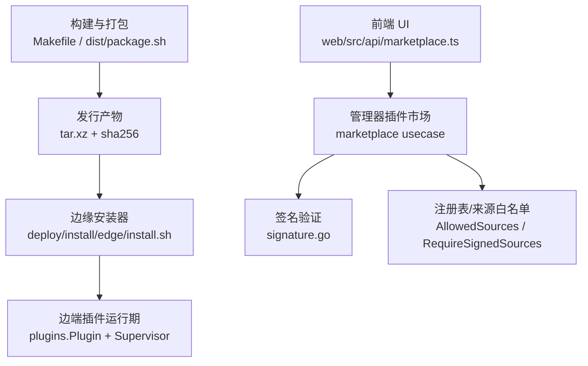
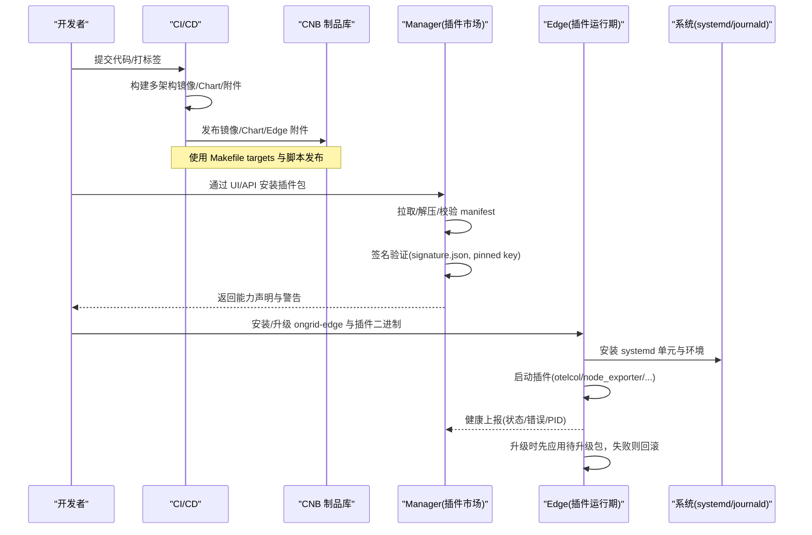
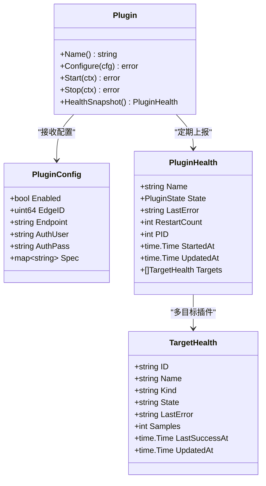
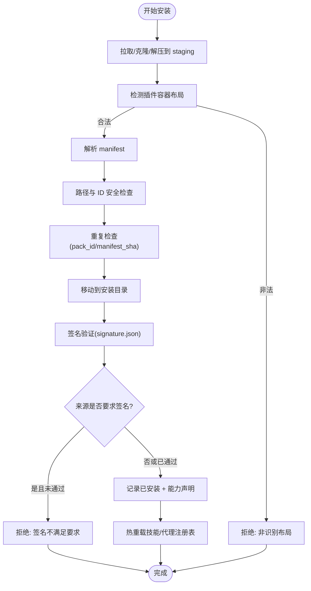
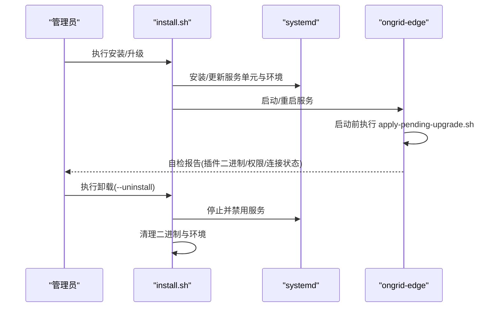
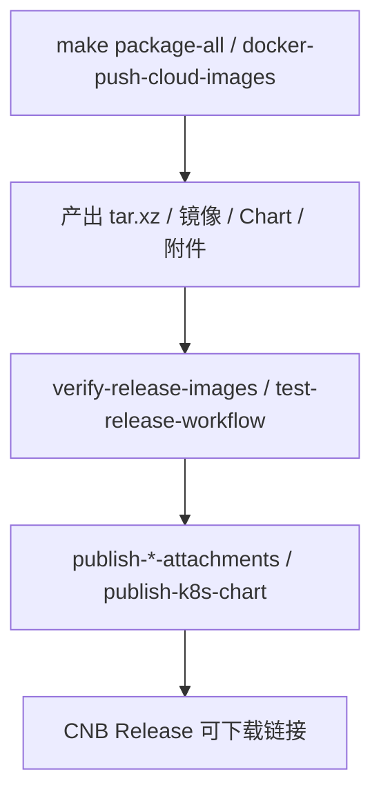
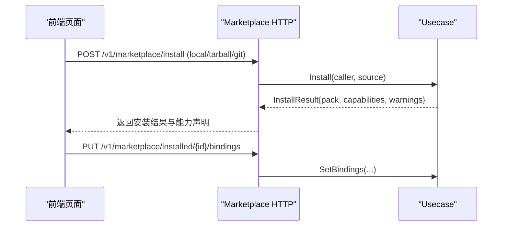
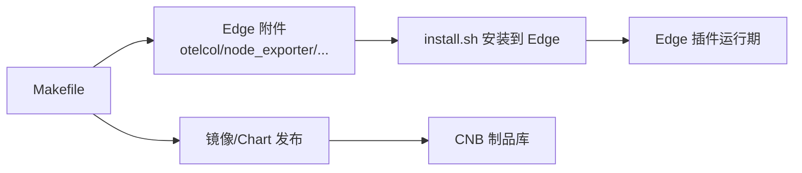

# 插件打包与分发

<cite>
**本文引用的文件**
- [Makefile](file://Makefile)
- [dist/package.sh](file://dist/package.sh)
- [internal/edgeagent/plugins/plugin.go](file://internal/edgeagent/plugins/plugin.go)
- [internal/manager/biz/marketplace/usecase.go](file://internal/manager/biz/marketplace/usecase.go)
- [internal/manager/biz/marketplace/signature.go](file://internal/manager/biz/marketplace/signature.go)
- [internal/manager/server/marketplace/http.go](file://internal/manager/server/marketplace/http.go)
- [web/src/api/marketplace.ts](file://web/src/api/marketplace.ts)
- [deploy/install/edge/install.sh](file://deploy/install/edge/install.sh)
- [scripts/publish-cnb-release-attachments.sh](file://scripts/publish-cnb-release-attachments.sh)
- [scripts/test-release-workflow.sh](file://scripts/test-release-workflow.sh)
- [scripts/test-apply-pending-upgrade.sh](file://scripts/test-apply-pending-upgrade.sh)
</cite>

## 目录
1. [简介](#简介)
2. [项目结构](#项目结构)
3. [核心组件](#核心组件)
4. [架构总览](#架构总览)
5. [详细组件分析](#详细组件分析)
6. [依赖分析](#依赖分析)
7. [性能考虑](#性能考虑)
8. [故障排查指南](#故障排查指南)
9. [结论](#结论)
10. [附录](#附录)

## 简介
本指南面向 Ongrid 的插件打包、签名验证、安装升级卸载、自动化构建发布流水线，以及插件市场集成与共享机制。内容覆盖：
- 插件目录结构与配置约定（含 OpenTelemetry 子进程插件）
- 版本控制、签名校验与安全策略
- 安装、升级、卸载流程与回滚策略
- 自动化构建与发布流水线设计
- 插件市场（Marketplace）集成与能力声明
- 文档生成与示例代码管理建议
- 兼容性检查与回滚策略

## 项目结构
Ongrid 将“插件”分为两类：
- 边端运行时插件（Edge Plugins）：如 metrics/logs/traces 等，以子进程或 goroutine 形式运行在 ongrid-edge 中，由 Supervisor 统一管理生命周期与健康上报。
- 管理器侧插件包（Marketplace Packs）：通过 Marketplace API 安装到 Manager 的 skills/agents 根目录，支持本地目录、tarball、Git 仓库等多种来源，并具备签名验证与能力声明。

**图示来源**
- [Makefile:219-387](file://Makefile#L219-L387)
- [dist/package.sh:1-410](file://dist/package.sh#L1-L410)
- [deploy/install/edge/install.sh:1-562](file://deploy/install/edge/install.sh#L1-L562)
- [internal/edgeagent/plugins/plugin.go:1-135](file://internal/edgeagent/plugins/plugin.go#L1-L135)
- [internal/manager/biz/marketplace/usecase.go:145-339](file://internal/manager/biz/marketplace/usecase.go#L145-L339)
- [internal/manager/biz/marketplace/signature.go:53-130](file://internal/manager/biz/marketplace/signature.go#L53-L130)
- [web/src/api/marketplace.ts:250-303](file://web/src/api/marketplace.ts#L250-L303)

**章节来源**
- [Makefile:219-387](file://Makefile#L219-L387)
- [dist/package.sh:1-410](file://dist/package.sh#L1-L410)
- [internal/edgeagent/plugins/plugin.go:1-135](file://internal/edgeagent/plugins/plugin.go#L1-L135)
- [internal/manager/biz/marketplace/usecase.go:145-339](file://internal/manager/biz/marketplace/usecase.go#L145-L339)
- [internal/manager/biz/marketplace/signature.go:53-130](file://internal/manager/biz/marketplace/signature.go#L53-L130)
- [web/src/api/marketplace.ts:250-303](file://web/src/api/marketplace.ts#L250-L303)
- [deploy/install/edge/install.sh:1-562](file://deploy/install/edge/install.sh#L1-L562)

## 核心组件
- 边端插件接口与状态机
  - Plugin 接口定义统一的生命周期：Configure → Start → HealthSnapshot → Stop；支持 in-process 与 subprocess 两种实现。
  - Supervisor 负责插件的启动、重启、健康上报与崩溃恢复。
- 管理器插件市场
  - Usecase 负责从多种来源拉取/克隆/解压插件包，执行安全校验（路径逃逸、manifest 解析）、签名验证、写入安装目录并热重载技能/代理注册表。
  - Signature 模块提供 ECDSA P-256 签名验证与可配置的公钥钉扎（pinned key）。
- 安装器与升级钩子
  - install.sh 负责下载 ongrid-edge 及插件二进制（otelcol-contrib、node_exporter、process_exporter、数据库 exporters），设置 systemd 服务与环境，并在启动前应用待升级包。
- 构建与发布
  - Makefile 提供多架构交叉编译、镜像构建、Helm Chart 打包与 CNB Release 附件发布。
  - dist/package.sh 组装安装包，输出 tar.xz 与 sha256，并可选择内嵌 Edge 插件二进制或引用远程 CNB Release。

**章节来源**
- [internal/edgeagent/plugins/plugin.go:1-135](file://internal/edgeagent/plugins/plugin.go#L1-L135)
- [internal/manager/biz/marketplace/usecase.go:145-339](file://internal/manager/biz/marketplace/usecase.go#L145-L339)
- [internal/manager/biz/marketplace/signature.go:53-130](file://internal/manager/biz/marketplace/signature.go#L53-L130)
- [deploy/install/edge/install.sh:215-263](file://deploy/install/edge/install.sh#L215-L263)
- [Makefile:219-387](file://Makefile#L219-L387)
- [dist/package.sh:184-293](file://dist/package.sh#L184-L293)

## 架构总览
下图展示插件从构建到安装、再到运行期的完整链路，包括签名验证与回滚机制。

**图示来源**
- [Makefile:285-387](file://Makefile#L285-L387)
- [scripts/publish-cnb-release-attachments.sh:1-24](file://scripts/publish-cnb-release-attachments.sh#L1-L24)
- [internal/manager/biz/marketplace/usecase.go:145-339](file://internal/manager/biz/marketplace/usecase.go#L145-L339)
- [internal/manager/biz/marketplace/signature.go:53-130](file://internal/manager/biz/marketplace/signature.go#L53-L130)
- [deploy/install/edge/install.sh:215-263](file://deploy/install/edge/install.sh#L215-L263)
- [scripts/test-apply-pending-upgrade.sh:41-69](file://scripts/test-apply-pending-upgrade.sh#L41-L69)

## 详细组件分析

### 边端插件运行期（Edge Plugins）
- 插件接口与生命周期
  - Name/Configure/Start/Stop/HealthSnapshot 构成统一抽象，Supervisor 按序调用。
  - 支持 in-process（goroutine）与 subprocess（如 otelcol-contrib）两种模式。
- 配置来源
  - 可由 Manager 推送或通过环境变量回退；Endpoint/AuthUser/AuthPass 用于数据面推送认证。
- 健康上报
  - 包含名称、状态、最近错误、重启次数、PID、时间戳与目标级健康信息。

**图示来源**
- [internal/edgeagent/plugins/plugin.go:18-108](file://internal/edgeagent/plugins/plugin.go#L18-L108)

**章节来源**
- [internal/edgeagent/plugins/plugin.go:18-108](file://internal/edgeagent/plugins/plugin.go#L18-L108)

### 管理器插件市场（Marketplace）
- 安装流程
  - 来源类型：local/tarball/git/registry（当前 registry 需直链 URL）。
  - 阶段：下载到 staging → 检测容器布局 → 解析 manifest → 路径安全检查 → 唯一性检查 → 移动至安装目录 → 签名验证 → 记录已安装 → 热重载注册表。
- 签名验证
  - signature.json 包含 base64 编码的 ECDSA 签名与公钥；计算 pack 的确定性哈希（排除 signature.json 本身），进行验签。
  - 支持 pinned key：强制要求签名中的公钥与配置一致。
- 能力声明
  - 根据加载结果生成 CapabilityDeclaration，供前端展示与权限控制。

**图示来源**
- [internal/manager/biz/marketplace/usecase.go:145-339](file://internal/manager/biz/marketplace/usecase.go#L145-L339)
- [internal/manager/biz/marketplace/signature.go:53-130](file://internal/manager/biz/marketplace/signature.go#L53-L130)

**章节来源**
- [internal/manager/biz/marketplace/usecase.go:145-339](file://internal/manager/biz/marketplace/usecase.go#L145-L339)
- [internal/manager/biz/marketplace/signature.go:53-130](file://internal/manager/biz/marketplace/signature.go#L53-L130)

### 安装、升级与卸载
- 安装
  - install.sh 下载 ongrid-edge 与插件二进制，创建用户/组、日志与状态目录，安装 systemd 单元，启动服务并自检插件二进制与权限。
- 升级
  - 通过 apply-pending-upgrade.sh 在每次启动前应用待升级包；成功则清理回滚标记，失败则在下次启动时自动回滚到旧版本。
- 卸载
  - 停止服务、移除二进制与服务单元、清理环境目录；幂等处理。

**图示来源**
- [deploy/install/edge/install.sh:122-132](file://deploy/install/edge/install.sh#L122-L132)
- [deploy/install/edge/install.sh:215-263](file://deploy/install/edge/install.sh#L215-L263)
- [scripts/test-apply-pending-upgrade.sh:41-69](file://scripts/test-apply-pending-upgrade.sh#L41-L69)

**章节来源**
- [deploy/install/edge/install.sh:122-132](file://deploy/install/edge/install.sh#L122-L132)
- [deploy/install/edge/install.sh:215-263](file://deploy/install/edge/install.sh#L215-L263)
- [scripts/test-apply-pending-upgrade.sh:41-69](file://scripts/test-apply-pending-upgrade.sh#L41-L69)

### 自动化构建与发布流水线
- 构建
  - Makefile 提供 build-ongrid/build-ongrid-edge、docker-build、build-web、package/package-all 等目标，支持多架构交叉编译与镜像构建。
- 发布
  - 使用 scripts/publish-cnb-release-attachments.sh 幂等发布 CNB Release 附件；镜像与 Helm Chart 通过对应 target 推送到 CNB 仓库。
- 校验
  - test-release-workflow.sh 确保发布流程仅通过 Makefile 目标，禁止直接 docker buildx；校验矩阵包含 amd64/arm64。

**图示来源**
- [Makefile:285-387](file://Makefile#L285-L387)
- [scripts/publish-cnb-release-attachments.sh:1-24](file://scripts/publish-cnb-release-attachments.sh#L1-L24)
- [scripts/test-release-workflow.sh:59-81](file://scripts/test-release-workflow.sh#L59-L81)

**章节来源**
- [Makefile:285-387](file://Makefile#L285-L387)
- [scripts/publish-cnb-release-attachments.sh:1-24](file://scripts/publish-cnb-release-attachments.sh#L1-L24)
- [scripts/test-release-workflow.sh:59-81](file://scripts/test-release-workflow.sh#L59-L81)

### 插件市场集成与共享机制
- API 路由
  - /v1/marketplace/install、/v1/marketplace/upload、/v1/marketplace/installed、/v1/marketplace/installed/{pack_id}/bindings、/v1/marketplace/registries。
- 前端交互
  - web/src/api/marketplace.ts 提供上传、卸载、列出注册表等函数，并对错误进行分类以便 UI 提示。
- 来源白名单与开发模式
  - AllowedSources 控制允许的来源；DevMode 放宽限制便于开发调试。

**图示来源**
- [internal/manager/server/marketplace/http.go:40-80](file://internal/manager/server/marketplace/http.go#L40-L80)
- [web/src/api/marketplace.ts:250-303](file://web/src/api/marketplace.ts#L250-L303)
- [internal/manager/biz/marketplace/usecase.go:400-423](file://internal/manager/biz/marketplace/usecase.go#L400-L423)

**章节来源**
- [internal/manager/server/marketplace/http.go:40-80](file://internal/manager/server/marketplace/http.go#L40-L80)
- [web/src/api/marketplace.ts:250-303](file://web/src/api/marketplace.ts#L250-L303)
- [internal/manager/biz/marketplace/usecase.go:400-423](file://internal/manager/biz/marketplace/usecase.go#L400-L423)

### 文档生成与示例代码管理
- 插件文档
  - 建议在插件包中包含 README.md/SKILL.md，并在 manifest 中描述用途与依赖；Manager 会将其作为能力声明的一部分暴露给前端。
- 示例代码
  - 可在仓库的 skills/ 目录下维护内置示例（如 bash、restart-service），并通过 Marketplace 的 local 源快速安装到测试环境。
- 最佳实践
  - 保持 plugin.json/openclaw.plugin.json 的 id/name/version/description 字段完整；为敏感配置提供 schema；避免路径穿越与危险符号。

[本节为概念性说明，不直接分析具体文件]

## 依赖分析
- 边端插件依赖
  - otelcol-contrib（logs/traces）、node_exporter（hostmetrics）、process_exporter（procmetrics）、mysqld/postgres/redis/mongodb exporters（databasemetrics）。
  - 默认安装包可选择内嵌这些二进制，或依赖 CNB Release 附件在安装时下载。
- 管理器依赖
  - Git（用于 SourceTypeGit）、HTTP Client（下载 tarball）、文件系统（staging 与安装目录）。
- 外部制品库
  - CNB Release 用于 Edge 附件与 Helm Chart 的不可变发布；镜像仓库用于 manager/web/k8s-edge 镜像。

**图示来源**
- [Makefile:416-585](file://Makefile#L416-L585)
- [dist/package.sh:184-293](file://dist/package.sh#L184-L293)
- [deploy/install/edge/install.sh:235-263](file://deploy/install/edge/install.sh#L235-L263)

**章节来源**
- [Makefile:416-585](file://Makefile#L416-L585)
- [dist/package.sh:184-293](file://dist/package.sh#L184-L293)
- [deploy/install/edge/install.sh:235-263](file://deploy/install/edge/install.sh#L235-L263)

## 性能考虑
- 构建优化
  - 使用 go build -trimpath 与 -ldflags 减小二进制体积；并行构建多架构镜像；缓存依赖层。
- 安装与升级
  - 优先使用 CNB Release 附件而非内嵌大二进制，减少安装包体积；按需 fetch 插件二进制。
- 运行期
  - 插件子进程隔离与资源限制；健康检查与自动重启；避免阻塞的健康快照。

[本节提供通用指导，不直接分析具体文件]

## 故障排查指南
- 安装失败
  - 检查网络连通性与 TLS 配置；确认 server-http-addr/server-edge-addr 正确；查看 journal 中的 unauthorized 或连接失败信息。
- 插件缺失
  - 自检输出会提示缺失的二进制；确保 /usr/local/lib/ongrid-edge 下存在相应可执行文件。
- 权限问题
  - 确保 /var/lib/ongrid-edge 对服务用户可写；确保服务用户可读 journald。
- 升级回滚
  - 若应用新包后未产生 healthy_marker，下次启动将自动回滚到旧版本；检查 apply-pending-upgrade.sh 的执行日志。

**章节来源**
- [deploy/install/edge/install.sh:465-518](file://deploy/install/edge/install.sh#L465-L518)
- [scripts/test-apply-pending-upgrade.sh:41-69](file://scripts/test-apply-pending-upgrade.sh#L41-L69)

## 结论
Ongrid 的插件体系通过清晰的边界与严格的校验，实现了安全的插件生态：
- 边端插件以统一接口运行，Supervisor 保障稳定性与可观测性。
- 管理器侧插件市场支持多来源安装、签名验证与能力声明，结合前端 UI 提供友好体验。
- 构建与发布流水线基于 Makefile 与脚本，确保多架构一致性与制品不可变性。
- 安装器与升级钩子提供可靠的安装、升级与回滚能力，适合生产环境部署。

[本节为总结性内容，不直接分析具体文件]

## 附录
- 常用命令参考
  - 构建与打包：make build-ongrid-edge、make package-all
  - 发布镜像与附件：make docker-push-cloud-images、make publish-edge-attachments
  - 安装 Edge：curl -k -sSL https://<server>/install.sh | bash -s -- ...
- 关键配置文件位置
  - Edge 环境：/etc/ongrid-edge/ongrid-edge.env
  - 插件二进制：/usr/local/lib/ongrid-edge/
  - 状态目录：/var/lib/ongrid-edge/

[本节为补充信息，不直接分析具体文件]