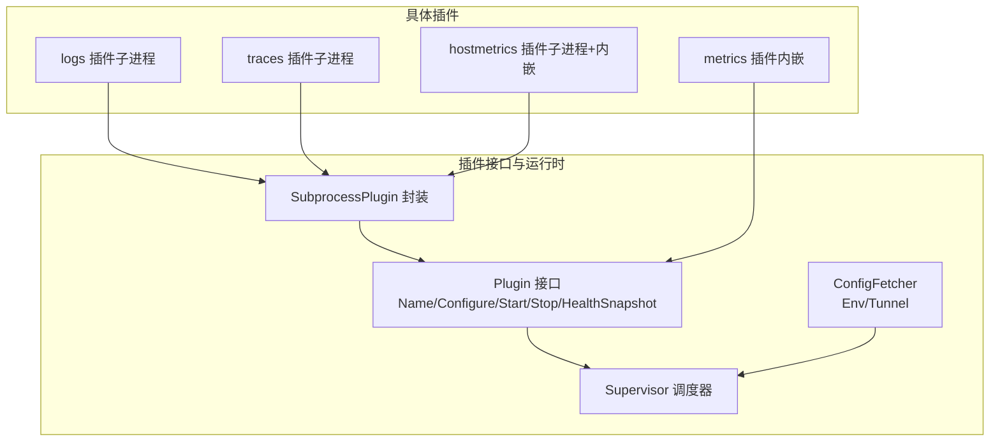
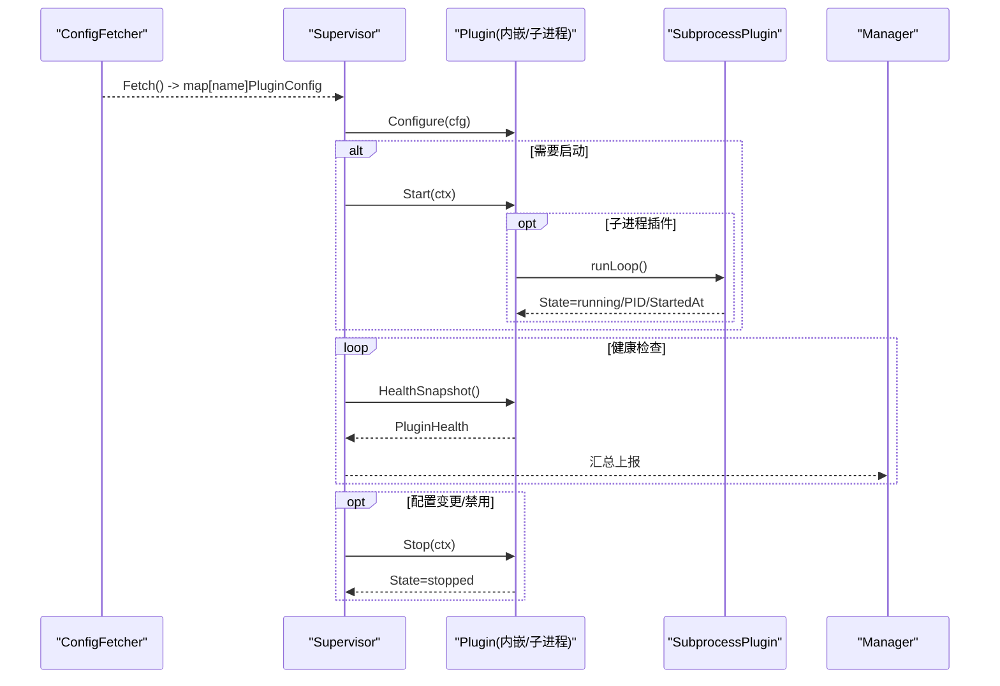
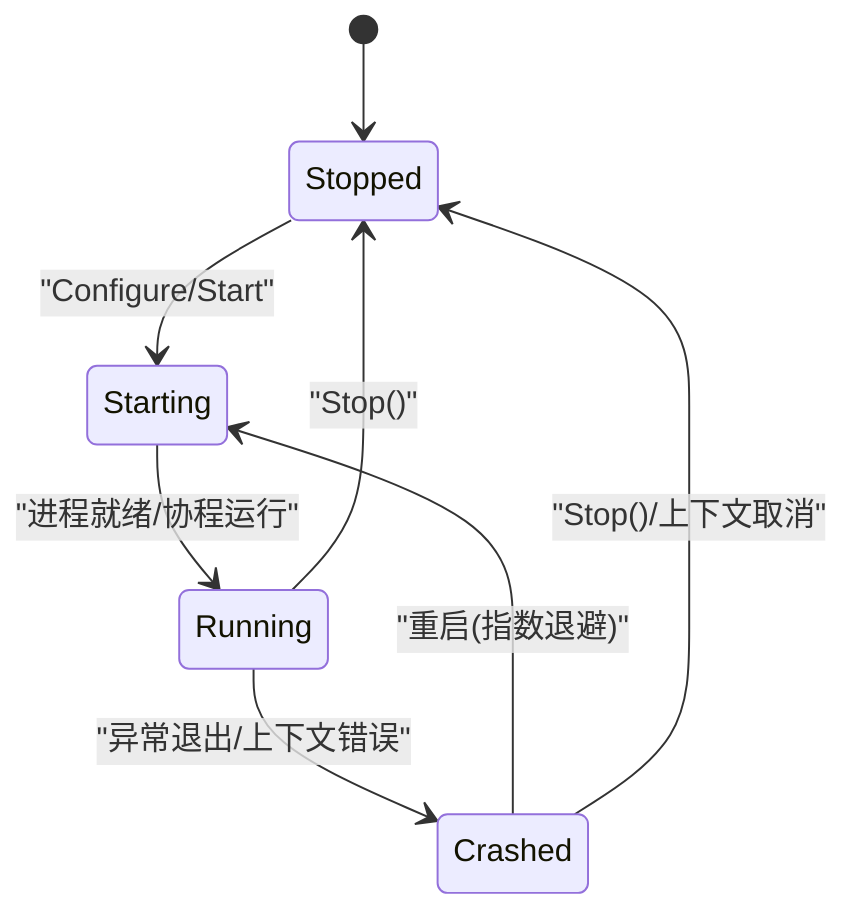
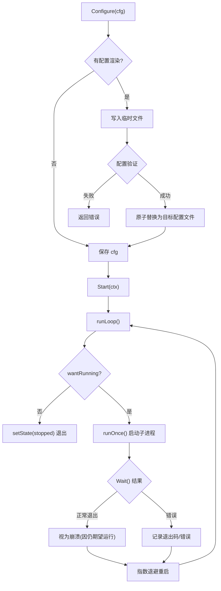
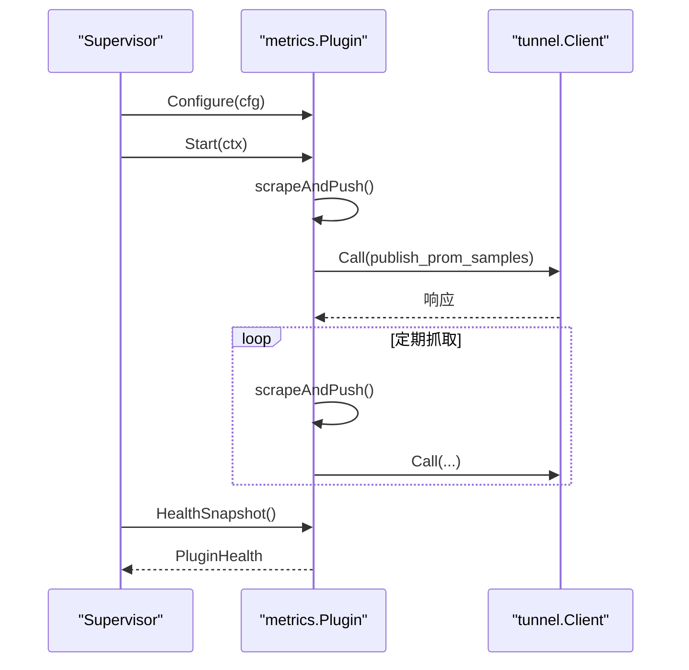
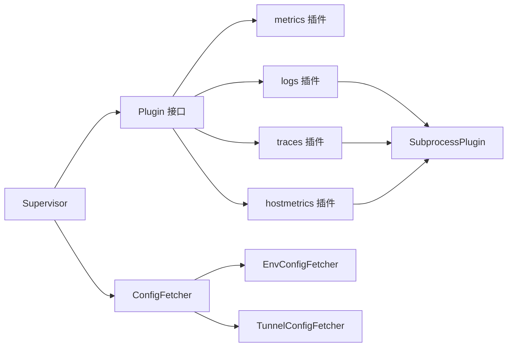

# 插件接口规范

<cite>
**本文引用的文件**
- [internal/edgeagent/plugins/plugin.go](file://internal/edgeagent/plugins/plugin.go)
- [internal/edgeagent/plugins/supervisor.go](file://internal/edgeagent/plugins/supervisor.go)
- [internal/edgeagent/plugins/subprocess.go](file://internal/edgeagent/plugins/subprocess.go)
- [internal/edgeagent/plugins/config_env.go](file://internal/edgeagent/plugins/config_env.go)
- [internal/edgeagent/plugins/config_tunnel.go](file://internal/edgeagent/plugins/config_tunnel.go)
- [internal/edgeagent/plugins/metrics/plugin.go](file://internal/edgeagent/plugins/metrics/plugin.go)
- [internal/edgeagent/plugins/logs/plugin.go](file://internal/edgeagent/plugins/logs/plugin.go)
- [internal/edgeagent/plugins/traces/plugin.go](file://internal/edgeagent/plugins/traces/plugin.go)
- [internal/edgeagent/plugins/hostmetrics/plugin.go](file://internal/edgeagent/plugins/hostmetrics/plugin.go)
</cite>

## 目录
1. [简介](#简介)
2. [项目结构](#项目结构)
3. [核心组件](#核心组件)
4. [架构总览](#架构总览)
5. [详细组件分析](#详细组件分析)
6. [依赖关系分析](#依赖关系分析)
7. [性能考量](#性能考量)
8. [故障排查指南](#故障排查指南)
9. [结论](#结论)
10. [附录](#附录)

## 简介
本文件面向 Ongrid 边缘侧插件系统的接口与实现，聚焦于 Plugin 接口的核心方法、配置结构、状态机、健康上报机制，以及内嵌插件与子进程插件在实现上的差异。文档同时提供最佳实践与常见陷阱规避建议，帮助开发者正确实现并集成新的插件能力。

## 项目结构
Ongrid 的插件系统位于 internal/edgeagent/plugins 下，采用“统一接口 + 多实现”的组织方式：
- 接口与通用类型定义：plugin.go
- 生命周期编排器：supervisor.go
- 子进程插件封装：subprocess.go
- 配置来源：config_env.go（环境变量）、config_tunnel.go（隧道 RPC）
- 具体插件实现：metrics（内嵌）、logs/traces（子进程 otelcol-contrib）、hostmetrics（子进程 node_exporter + 内嵌补充指标）

图表来源
- [internal/edgeagent/plugins/plugin.go:18-52](file://internal/edgeagent/plugins/plugin.go#L18-L52)
- [internal/edgeagent/plugins/supervisor.go:12-47](file://internal/edgeagent/plugins/supervisor.go#L12-L47)
- [internal/edgeagent/plugins/subprocess.go:17-51](file://internal/edgeagent/plugins/subprocess.go#L17-L51)
- [internal/edgeagent/plugins/config_env.go:10-36](file://internal/edgeagent/plugins/config_env.go#L10-L36)
- [internal/edgeagent/plugins/config_tunnel.go:18-55](file://internal/edgeagent/plugins/config_tunnel.go#L18-L55)
- [internal/edgeagent/plugins/metrics/plugin.go:64-80](file://internal/edgeagent/plugins/metrics/plugin.go#L64-L80)
- [internal/edgeagent/plugins/logs/plugin.go:20-41](file://internal/edgeagent/plugins/logs/plugin.go#L20-L41)
- [internal/edgeagent/plugins/traces/plugin.go:20-49](file://internal/edgeagent/plugins/traces/plugin.go#L20-L49)
- [internal/edgeagent/plugins/hostmetrics/plugin.go:59-93](file://internal/edgeagent/plugins/hostmetrics/plugin.go#L59-L93)

章节来源
- [internal/edgeagent/plugins/plugin.go:1-135](file://internal/edgeagent/plugins/plugin.go#L1-L135)
- [internal/edgeagent/plugins/supervisor.go:1-301](file://internal/edgeagent/plugins/supervisor.go#L1-L301)
- [internal/edgeagent/plugins/subprocess.go:1-391](file://internal/edgeagent/plugins/subprocess.go#L1-L391)
- [internal/edgeagent/plugins/config_env.go:1-106](file://internal/edgeagent/plugins/config_env.go#L1-L106)
- [internal/edgeagent/plugins/config_tunnel.go:1-519](file://internal/edgeagent/plugins/config_tunnel.go#L1-L519)

## 核心组件
本节深入解释 Plugin 接口、PluginConfig、PluginState、PluginHealth 的设计与使用要求。

- Plugin 接口
  - Name()：返回 OTel 信号名（如 metrics/logs/traces），作为注册键与配置行标识。
  - Configure(cfg)：接收管理器下发的配置或本地回退配置；必须幂等处理重复调用；失败时插件进入“崩溃”态以便可见性。
  - Start(ctx)：启动插件工作；对子进程即拉起进程，对内嵌即启动协程；需支持重入 Start（Supervisor 可能在 Stop 后再次 Start）。
  - Stop(ctx)：优雅关闭；子进程发送 SIGTERM 并等待；内嵌通过 context 取消；未运行时应安全无操作。
  - HealthSnapshot()：返回当前健康快照；不应阻塞；由 Supervisor 周期性收集上报。

- PluginConfig
  - Enabled：是否启用该插件。
  - EdgeID：设备标识（用于标签注入），优先使用 Manager 解析值，冷启动可回退到环境变量。
  - Endpoint：数据面推送地址（如 Loki/Traces 端点）。
  - AuthUser/AuthPass：数据面认证凭据（Basic 或 Bearer）。
  - Spec：插件特定 JSON 配置（如 logs 的 journald units、traces 的 OTel receiver 设置等）。

- PluginState 状态机
  - stopped → starting → running → crashed → stopped（重启循环）
  - Supervisor 负责根据配置变更与运行状态进行转换；子进程异常退出会进入 crashed 并按指数退避重启。

- PluginHealth
  - name/state/last_error/restart_count/pid/started_at/updated_at/targets[]
  - last_error 在崩溃时填充，成功启动后清空；pid 仅子进程有效；targets 用于多目标采集插件（如 custommetrics/databasemetrics）。

章节来源
- [internal/edgeagent/plugins/plugin.go:18-108](file://internal/edgeagent/plugins/plugin.go#L18-L108)
- [internal/edgeagent/plugins/supervisor.go:175-243](file://internal/edgeagent/plugins/supervisor.go#L175-L243)
- [internal/edgeagent/plugins/subprocess.go:267-384](file://internal/edgeagent/plugins/subprocess.go#L267-L384)

## 架构总览
Supervisor 是插件生命周期与配置的协调中心：
- 从 ConfigFetcher 获取当前配置快照（Tunnel 优先，Env 回退）。
- 对比期望与实际状态，执行 Configure/Start/Stop。
- 周期轮询或收到重载信号时重新 reconcile。
- 收集各插件 HealthSnapshot 并上报给 Manager。

图表来源
- [internal/edgeagent/plugins/supervisor.go:114-243](file://internal/edgeagent/plugins/supervisor.go#L114-L243)
- [internal/edgeagent/plugins/subprocess.go:208-308](file://internal/edgeagent/plugins/subprocess.go#L208-L308)
- [internal/edgeagent/plugins/config_tunnel.go:100-186](file://internal/edgeagent/plugins/config_tunnel.go#L100-L186)
- [internal/edgeagent/plugins/config_env.go:45-76](file://internal/edgeagent/plugins/config_env.go#L45-L76)

## 详细组件分析

### Plugin 接口与状态机
- 接口契约
  - Name()：稳定且唯一，作为注册键与日志/配置标识。
  - Configure()：幂等校验与持久化配置；错误应明确，便于 Supervisor 记录并进入崩溃态。
  - Start()：确保可重入；若已在运行则直接返回。
  - Stop()：确保可重入；未运行时无操作；带超时保护避免阻塞 Supervisor 关闭。
  - HealthSnapshot()：轻量、非阻塞；包含最近错误、PID、时间戳等。

- 状态机转换
  - 初始 stopped；Configure 成功后可进入 starting；Start 成功后为 running；异常退出为 crashed；Stop 后回到 stopped。
  - 子进程插件在 crashed 后按指数退避重启，直至达到上限。

图表来源
- [internal/edgeagent/plugins/plugin.go:73-81](file://internal/edgeagent/plugins/plugin.go#L73-L81)
- [internal/edgeagent/plugins/subprocess.go:267-308](file://internal/edgeagent/plugins/subprocess.go#L267-L308)

章节来源
- [internal/edgeagent/plugins/plugin.go:18-108](file://internal/edgeagent/plugins/plugin.go#L18-L108)
- [internal/edgeagent/plugins/subprocess.go:208-308](file://internal/edgeagent/plugins/subprocess.go#L208-L308)

### 子进程插件封装 SubprocessPlugin
- 职责
  - 渲染配置到磁盘（可选），原子替换（临时文件 + rename）。
  - 启动子进程，捕获 stdout/stderr 到独立日志文件。
  - 监听退出码，崩溃后指数退避重启。
  - 提供 WaitReady 以确认进程稳定运行。

- 关键流程
  - Configure：创建 workdir，渲染配置，可选验证，原子替换。
  - Start：检查二进制存在，启动 runLoop，更新健康状态。
  - Stop：取消运行上下文，等待停止或超时。
  - HealthSnapshot：返回副本，更新时间戳。

图表来源
- [internal/edgeagent/plugins/subprocess.go:140-206](file://internal/edgeagent/plugins/subprocess.go#L140-L206)
- [internal/edgeagent/plugins/subprocess.go:208-308](file://internal/edgeagent/plugins/subprocess.go#L208-L308)

章节来源
- [internal/edgeagent/plugins/subprocess.go:17-391](file://internal/edgeagent/plugins/subprocess.go#L17-L391)

### 内嵌插件示例：metrics
- 特点
  - 在 ongrid-edge 进程内运行，定时抓取本地 /metrics 并通过隧道 RPC 推送。
  - 不依赖外部二进制，无需子进程管理。
  - 健康信息包含抓取计数与失败计数，失败时 LastError 携带最近错误。

- 生命周期
  - Configure：解析 spec，存储配置。
  - Start：启动抓取循环，立即执行一次抓取。
  - Stop：取消上下文，等待协程退出。
  - HealthSnapshot：返回健康快照。

图表来源
- [internal/edgeagent/plugins/metrics/plugin.go:104-179](file://internal/edgeagent/plugins/metrics/plugin.go#L104-L179)
- [internal/edgeagent/plugins/metrics/plugin.go:181-282](file://internal/edgeagent/plugins/metrics/plugin.go#L181-L282)

章节来源
- [internal/edgeagent/plugins/metrics/plugin.go:1-306](file://internal/edgeagent/plugins/metrics/plugin.go#L1-L306)

### 子进程插件示例：logs 与 traces
- 共同点
  - 均基于 otelcol-contrib 子进程，Supervisor 负责配置渲染与进程管理。
  - 数据面直连后端（Loki/Traces），ongrid-edge 不代理字节流。
  - 通过 OTel 配置验证器在替换前校验配置。

- 差异点
  - logs：将日志推送到 Loki 或 Elasticsearch。
  - traces：接受 OTLP gRPC/HTTP 并转发到 /v1/traces。

章节来源
- [internal/edgeagent/plugins/logs/plugin.go:1-42](file://internal/edgeagent/plugins/logs/plugin.go#L1-L42)
- [internal/edgeagent/plugins/traces/plugin.go:1-50](file://internal/edgeagent/plugins/traces/plugin.go#L1-L50)
- [internal/edgeagent/plugins/subprocess.go:140-206](file://internal/edgeagent/plugins/subprocess.go#L140-L206)

### hostmetrics 插件：子进程 + 内嵌补充指标
- 子进程：node_exporter 暴露 /metrics 供 Prometheus 抓取。
- 内嵌：周期性写入 textfile 指标（如 nf_conntrack），弥补上游 collector 在某些内核版本下的缺失。
- 生命周期：Start 先启动子进程，再启动补充指标生产者；Stop 先停生产者，再停子进程。

章节来源
- [internal/edgeagent/plugins/hostmetrics/plugin.go:1-277](file://internal/edgeagent/plugins/hostmetrics/plugin.go#L1-L277)

### 配置来源与默认值
- EnvConfigFetcher：从环境变量读取每个插件的配置，适用于开发/离线场景。
- TunnelConfigFetcher：从 Manager 拉取配置，具备缓存与回退能力；在 Kubernetes 环境下自动注入默认值（如 cluster_id、node_name、endpoint 等）。

章节来源
- [internal/edgeagent/plugins/config_env.go:10-106](file://internal/edgeagent/plugins/config_env.go#L10-L106)
- [internal/edgeagent/plugins/config_tunnel.go:18-186](file://internal/edgeagent/plugins/config_tunnel.go#L18-L186)
- [internal/edgeagent/plugins/config_tunnel.go:220-393](file://internal/edgeagent/plugins/config_tunnel.go#L220-L393)

## 依赖关系分析
- 松耦合设计
  - Supervisor 仅依赖 Plugin 接口与 ConfigFetcher 抽象，不关心具体实现。
  - 子进程插件通过 SubprocessOpts 解耦二进制路径、参数构建与配置渲染。
- 外部依赖
  - tunnel.Client：用于 metrics 推送与配置拉取。
  - 文件系统：子进程配置与日志落盘。
  - 操作系统信号：SIGTERM 优雅关闭子进程。

图表来源
- [internal/edgeagent/plugins/supervisor.go:12-47](file://internal/edgeagent/plugins/supervisor.go#L12-L47)
- [internal/edgeagent/plugins/plugin.go:18-52](file://internal/edgeagent/plugins/plugin.go#L18-L52)
- [internal/edgeagent/plugins/config_env.go:10-36](file://internal/edgeagent/plugins/config_env.go#L10-L36)
- [internal/edgeagent/plugins/config_tunnel.go:18-55](file://internal/edgeagent/plugins/config_tunnel.go#L18-L55)

章节来源
- [internal/edgeagent/plugins/supervisor.go:12-47](file://internal/edgeagent/plugins/supervisor.go#L12-L47)
- [internal/edgeagent/plugins/plugin.go:18-52](file://internal/edgeagent/plugins/plugin.go#L18-L52)

## 性能考量
- 配置比较
  - configEqual 使用浅层字段比较与 Spec 的字符串化比较，对小规格配置足够高效；若 Spec 增长可考虑深度相等优化。
- 子进程重启策略
  - 指数退避限制最大间隔，避免频繁重启导致资源抖动。
- 健康快照
  - HealthSnapshot 必须非阻塞；Supervisor 周期调用，应避免锁竞争。
- 抓取与推送
  - metrics 插件使用定时器与超时控制，单目标失败不影响其他目标；EdgeID 未就绪时延迟推送，避免无效请求。

[本节为通用指导，不直接分析具体文件]

## 故障排查指南
- 配置下发失败
  - 现象：Supervisor 日志出现 “config fetch failed; keeping previous state”。
  - 处理：检查 Tunnel 客户端连通性与缓存；必要时回退到 Env 配置。
- 子进程崩溃
  - 现象：HealthSnapshot 中 state=crashed，last_error 非空，restart_count 递增。
  - 处理：查看子进程日志文件；检查二进制是否存在、配置是否合法；确认 SIGTERM 处理逻辑。
- 健康上报为空
  - 现象：Manager 未收到插件健康信息。
  - 处理：确认 Supervisor 已注册插件并运行；检查 HealthSnapshot 是否被调用；确认上报通道可用。
- 配置热更新不生效
  - 现象：Configure 成功但插件未重启。
  - 处理：检查 configEqual 语义差异；确认 needRestart 条件；必要时触发 TriggerReload。

章节来源
- [internal/edgeagent/plugins/supervisor.go:135-243](file://internal/edgeagent/plugins/supervisor.go#L135-L243)
- [internal/edgeagent/plugins/subprocess.go:267-308](file://internal/edgeagent/plugins/subprocess.go#L267-L308)
- [internal/edgeagent/plugins/config_tunnel.go:100-186](file://internal/edgeagent/plugins/config_tunnel.go#L100-L186)

## 结论
Ongrid 插件系统通过统一的 Plugin 接口与 Supervisor 调度，实现了内嵌与子进程插件的统一生命周期管理。配置来源灵活（Tunnel/Env），健康上报清晰，崩溃恢复稳健。遵循本文档的接口约定与最佳实践，可快速实现新插件并确保与平台的良好集成。

[本节为总结性内容，不直接分析具体文件]

## 附录

### 接口实现要点清单
- Name()：稳定、唯一、与 OTel 信号命名一致。
- Configure()：幂等、校验严格、错误明确；Spec 解析失败应返回错误。
- Start()：可重入；子进程需检查二进制存在；内嵌需启动协程并更新状态。
- Stop()：可重入；子进程发送 SIGTERM 并等待；内嵌取消上下文并等待退出。
- HealthSnapshot()：非阻塞；包含必要字段；子进程需维护 PID/StartedAt/LastError。

### 最佳实践
- 配置原子替换：使用临时文件 + rename，确保子进程始终读到完整配置。
- 优雅关闭：子进程优先 SIGTERM，设置 WaitDelay 作为 fallback。
- 健康信息及时更新：每次状态变化更新 UpdatedAt；崩溃时记录 LastError，成功启动后清空。
- 重试与退避：子进程崩溃使用指数退避，避免风暴式重启。
- 配置回退：Tunnel 不可用时回退到 Env，保证基本能力可用。

### 常见陷阱
- 忽略幂等性：多次 Start/Stop 应安全；避免重复启动或资源泄漏。
- 阻塞健康检查：HealthSnapshot 中避免 IO 或网络调用。
- 配置比较不当：Spec 复杂时建议使用深度相等；否则可能误判无需重启。
- 未处理 EdgeID 未就绪：metrics 插件在 EdgeID=0 时延迟推送，避免无效请求。
- 子进程未正确处理 SIGTERM：可能导致无法优雅退出，影响 Supervisor 关闭流程。

[本节为通用指导，不直接分析具体文件]