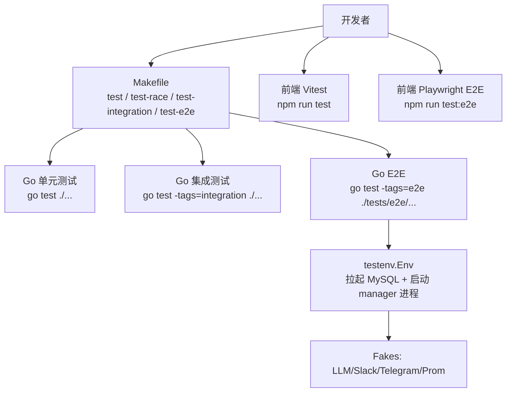
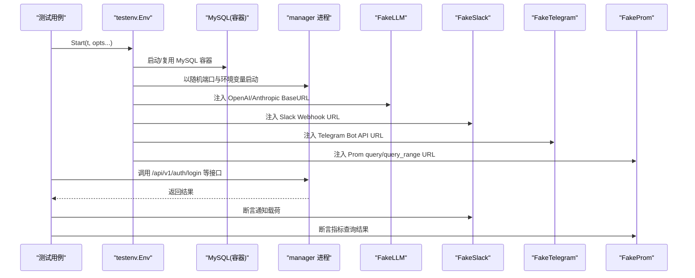
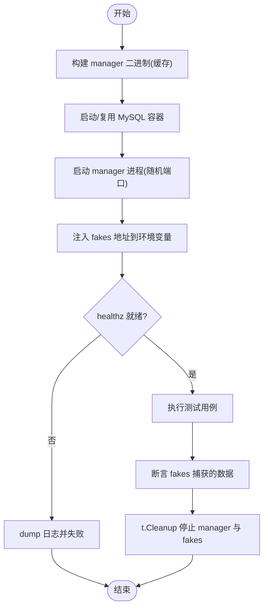
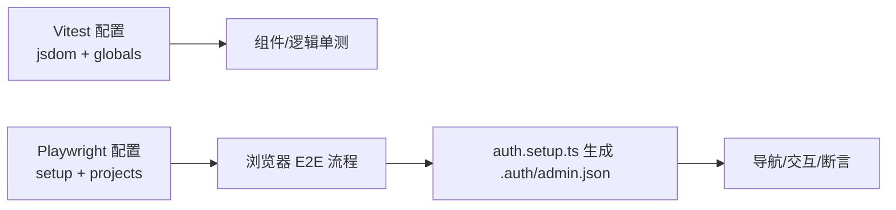
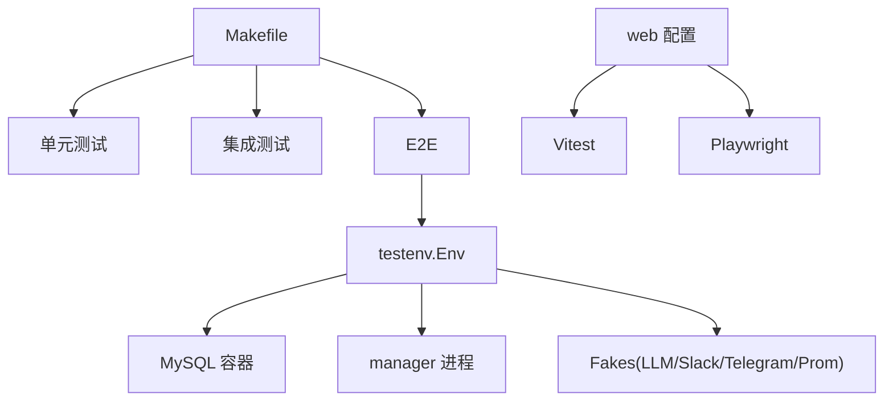

# 插件测试与调试

<cite>
**本文引用的文件**
- [Makefile](file://Makefile)
- [tests/e2e/README.md](file://tests/e2e/README.md)
- [tests/e2e/testenv/env.go](file://tests/e2e/testenv/env.go)
- [tests/e2e/testenv/fakes.go](file://tests/e2e/testenv/fakes.go)
- [tests/e2e/testenv/secrets.go](file://tests/e2e/testenv/secrets.go)
- [web/vitest.config.ts](file://web/vitest.config.ts)
- [web/playwright.config.ts](file://web/playwright.config.ts)
- [web/e2e/README.md](file://web/e2e/README.md)
- [docs/test/e2e-catalog.md](file://docs/test/e2e-catalog.md)
- [internal/manager/biz/knowledge/builtin_vault/reference/index/observability-and-tracing.md](file://internal/manager/biz/knowledge/builtin_vault/reference/index/observability-and-tracing.md)
- [internal/manager/biz/knowledge/builtin_vault/diagnostics/memory-leak-hunt.md](file://internal/manager/biz/knowledge/builtin_vault/diagnostics/memory-leak-hunt.md)
</cite>

## 目录
1. [简介](#简介)
2. [项目结构](#项目结构)
3. [核心组件](#核心组件)
4. [架构总览](#架构总览)
5. [详细组件分析](#详细组件分析)
6. [依赖关系分析](#依赖关系分析)
7. [性能考虑](#性能考虑)
8. [故障排查指南](#故障排查指南)
9. [结论](#结论)
10. [附录](#附录)

## 简介
本指南面向插件（Edge 侧插件、Agent/Skill、以及前端交互）的测试与调试，覆盖单元测试、集成测试、端到端（E2E）测试的编写方法；说明测试环境搭建与模拟对象创建；深入讲解插件性能测试与压力测试的实施；提供调试技巧与故障排查方法；讨论覆盖率要求与持续集成配置；并包含常见问题解决方案与最佳实践。同时涵盖日志分析、性能分析与内存泄漏检测工具的使用。

## 项目结构
仓库采用 Go + TypeScript 的双栈工程：
- Go 后端：通过 Makefile 统一构建与测试入口，支持单元测试、race 检测、集成测试与 E2E 测试。
- 前端：使用 Vitest 进行组件级单元测试，Playwright 进行浏览器级 E2E 测试。
- E2E 套件：基于 testcontainers-go 拉起 MySQL，并通过进程方式启动 manager 二进制，配合内置 fakes（LLM、Slack、Telegram、Prom/Loki）完成端到端验证。

图表来源
- [Makefile:103-117](file://Makefile#L103-L117)
- [tests/e2e/README.md:7-16](file://tests/e2e/README.md#L7-L16)
- [web/vitest.config.ts:1-19](file://web/vitest.config.ts#L1-L19)
- [web/playwright.config.ts:1-68](file://web/playwright.config.ts#L1-L68)

章节来源
- [Makefile:103-117](file://Makefile#L103-L117)
- [tests/e2e/README.md:7-16](file://tests/e2e/README.md#L7-L16)
- [web/vitest.config.ts:1-19](file://web/vitest.config.ts#L1-L19)
- [web/playwright.config.ts:1-68](file://web/playwright.config.ts#L1-L68)

## 核心组件
- 测试入口与命令
  - 单元测试：make test
  - 并发安全检测：make test-race
  - 集成测试：make test-integration
  - E2E（默认 fakes）：make test-e2e
  - E2E live（真实外部服务）：make test-e2e-live
- 测试环境与夹具
  - testenv.Env：封装 MySQL 容器、manager 进程生命周期、fakes 注入、登录与 HTTP 助手。
  - Fakes：FakeLLM、FakeSlack、FakeTelegram、FakeProm，提供可观测的请求/响应捕获与脚本化行为。
- 前端测试
  - Vitest：React 组件与逻辑单元单测，jsdom 环境。
  - Playwright：浏览器级 E2E，支持截图、trace、视频与 HTML 报告。

章节来源
- [Makefile:103-117](file://Makefile#L103-L117)
- [tests/e2e/testenv/env.go:29-69](file://tests/e2e/testenv/env.go#L29-L69)
- [tests/e2e/testenv/fakes.go:16-119](file://tests/e2e/testenv/fakes.go#L16-L119)
- [web/vitest.config.ts:1-19](file://web/vitest.config.ts#L1-L19)
- [web/playwright.config.ts:1-68](file://web/playwright.config.ts#L1-L68)

## 架构总览
下图展示了 E2E 测试在运行时的关键交互：测试通过 testenv 拉起 MySQL、启动 manager 进程，并将 fakes 地址注入到 manager 环境变量中，从而在不依赖真实外部服务的条件下完成端到端验证。

图表来源
- [tests/e2e/testenv/env.go:90-200](file://tests/e2e/testenv/env.go#L90-L200)
- [tests/e2e/testenv/fakes.go:102-119](file://tests/e2e/testenv/fakes.go#L102-L119)
- [tests/e2e/testenv/fakes.go:279-345](file://tests/e2e/testenv/fakes.go#L279-L345)
- [tests/e2e/testenv/fakes.go:347-437](file://tests/e2e/testenv/fakes.go#L347-L437)
- [tests/e2e/testenv/fakes.go:439-548](file://tests/e2e/testenv/fakes.go#L439-L548)

## 详细组件分析

### 单元测试与集成测试
- 单元测试
  - 使用 go test ./...，快速、无外部依赖。
  - 建议对纯函数、解析器、数据转换、边界条件进行覆盖。
- 集成测试
  - 使用 make test-integration，启用 integration build tag。
  - 适合需要数据库、网络或外部协议交互但无需完整 E2E 环境的场景。
- 并发与竞态
  - 使用 make test-race 开启 race detector，尽早发现数据竞争问题。

章节来源
- [Makefile:103-117](file://Makefile#L103-L117)

### 端到端测试（Go 后端）
- 运行方式
  - 默认模式：make test-e2e，仅使用 fakes，无需任何 secret。
  - Live 模式：make test-e2e-live，通过 secrets 接入真实外部服务。
- 环境准备
  - Docker 可达，分配足够内存给 Docker Desktop，避免 MySQL 冷启动超时。
  - 默认禁用 testcontainers ryuk sidecar，由 t.Cleanup 负责清理。
- 测试环境
  - 每个测试通过 testenv.Start 获取 Env，内部会：
    - 启动/复用 MySQL 容器
    - 编译一次 manager 二进制并复用
    - 启动 manager 进程，绑定随机端口，轮询 healthz 就绪
    - 注入 FakeLLM、FakeSlack、FakeTelegram、FakeProm 地址
- 秘密管理
  - RequireSecret 模式：优先读取环境变量，其次读取 tests/e2e/secrets.local.env，否则跳过测试。
  - 模板 secrets.example.env 列出所有已知 secret，本地复制为 secrets.local.env 并填写。
- 日志与排错
  - 可通过 env.ManagerLogs() 获取 manager 进程 stdout/stderr，便于失败时定位。

图表来源
- [tests/e2e/testenv/env.go:90-200](file://tests/e2e/testenv/env.go#L90-L200)
- [tests/e2e/testenv/env.go:419-534](file://tests/e2e/testenv/env.go#L419-L534)
- [tests/e2e/testenv/env.go:536-604](file://tests/e2e/testenv/env.go#L536-L604)
- [tests/e2e/README.md:18-55](file://tests/e2e/README.md#L18-L55)

章节来源
- [tests/e2e/README.md:7-16](file://tests/e2e/README.md#L7-L16)
- [tests/e2e/README.md:18-55](file://tests/e2e/README.md#L18-L55)
- [tests/e2e/testenv/env.go:90-200](file://tests/e2e/testenv/env.go#L90-L200)
- [tests/e2e/testenv/env.go:419-534](file://tests/e2e/testenv/env.go#L419-L534)
- [tests/e2e/testenv/env.go:536-604](file://tests/e2e/testenv/env.go#L536-L604)
- [tests/e2e/testenv/secrets.go:170-209](file://tests/e2e/testenv/secrets.go#L170-L209)

### 前端测试（Vitest + Playwright）
- Vitest 单元测试
  - 基于 vite.config.ts，启用 jsdom 环境，全局 API 可用，测试文件匹配 src/**/*.test.{ts,tsx}。
  - 适合 React 组件、状态逻辑、工具函数的快速验证。
- Playwright E2E
  - 配置文件定义输出目录、重试策略、浏览器通道、截图/trace/video 保留策略。
  - 通过 setup 项目生成认证状态，后续项目复用存储状态访问受保护页面。
  - 支持读取 deploy/.env 与 E2E_BASE_URL 等环境变量。

图表来源
- [web/vitest.config.ts:1-19](file://web/vitest.config.ts#L1-L19)
- [web/playwright.config.ts:1-68](file://web/playwright.config.ts#L1-L68)
- [web/e2e/README.md:1-17](file://web/e2e/README.md#L1-L17)

章节来源
- [web/vitest.config.ts:1-19](file://web/vitest.config.ts#L1-L19)
- [web/playwright.config.ts:1-68](file://web/playwright.config.ts#L1-L68)
- [web/e2e/README.md:1-17](file://web/e2e/README.md#L1-L17)

### 插件测试要点（Edge 插件、Agent/Skill）
- 插件默认开关与配置下发
  - E2E 用例关注插件默认 enabled 及配置变更后的重载行为。
- 插件健康上报
  - 通过 EdgeDetail 展示插件状态与错误信息，E2E 可断言 UI 表现。
- Skill 注册与执行
  - 内置 skill registry 加载与 execute 路径应被 E2E 覆盖。

章节来源
- [docs/test/e2e-catalog.md:55-66](file://docs/test/e2e-catalog.md#L55-L66)
- [docs/test/e2e-catalog.md:159-165](file://docs/test/e2e-catalog.md#L159-L165)

## 依赖关系分析
- Makefile 作为唯一构建/测试入口，屏蔽底层实现细节，确保 CI 与本地一致。
- E2E 套件依赖 testcontainers-go 与 httptest.Server，将外部依赖替换为可控的 fakes。
- 前端测试依赖 Vite/Vitest/Playwright，通过共享配置保持与开发/构建一致。

图表来源
- [Makefile:103-117](file://Makefile#L103-L117)
- [tests/e2e/testenv/env.go:90-200](file://tests/e2e/testenv/env.go#L90-L200)
- [web/vitest.config.ts:1-19](file://web/vitest.config.ts#L1-L19)
- [web/playwright.config.ts:1-68](file://web/playwright.config.ts#L1-L68)

章节来源
- [Makefile:103-117](file://Makefile#L103-L117)
- [tests/e2e/testenv/env.go:90-200](file://tests/e2e/testenv/env.go#L90-L200)
- [web/vitest.config.ts:1-19](file://web/vitest.config.ts#L1-L19)
- [web/playwright.config.ts:1-68](file://web/playwright.config.ts#L1-L68)

## 性能考虑
- 单元测试与集成测试
  - 使用 make test-race 检测并发问题，避免在生产中出现竞态导致的性能抖动。
  - 对热点路径添加基准测试（如 Prometheus 指标聚合、消息序列化），结合 pprof 分析 CPU/内存热点。
- E2E 性能
  - 合理设置 healthz 轮询间隔与超时，避免假阳性失败。
  - 控制 fakes 的负载与响应大小，避免阻塞测试流水线。
- 插件性能测试与压力测试
  - 针对 metrics/logs/traces 插件，构造高吞吐数据源，观察采集延迟与资源占用。
  - 通过 Prometheus 面板与 Grafana 监控采集链路，识别瓶颈点。
- 覆盖率要求
  - 建议在 CI 中引入覆盖率统计（如 go test -cover），设定阈值以保证新增代码质量。
  - 前端 Vitest 可结合 coverage 插件输出覆盖率报告。

[本节为通用指导，不直接分析具体文件]

## 故障排查指南
- E2E 启动失败
  - 检查 Docker 是否可达且内存充足；必要时提高 Docker Desktop 内存限制。
  - 若出现 MySQL 启动超时，确认 TESTCONTAINERS_RYUK_DISABLED 已设置，避免 sidecar 影响。
- 测试跳过
  - 缺少 secret 时，RequireSecret 会 t.Skip；按提示在环境变量或 secrets.local.env 中配置。
- 日志分析
  - 使用 env.ManagerLogs() 获取 manager 进程日志，定位启动失败或运行时异常。
  - 前端 Playwright 失败时查看截图、trace、视频与 HTML 报告。
- 性能与内存问题
  - 参考知识库中的 Linux 性能调试方法与内存泄漏排查步骤，结合系统工具与容器指标进行分析。

章节来源
- [tests/e2e/README.md:18-55](file://tests/e2e/README.md#L18-L55)
- [tests/e2e/testenv/env.go:240-257](file://tests/e2e/testenv/env.go#L240-L257)
- [tests/e2e/testenv/env.go:585-611](file://tests/e2e/testenv/env.go#L585-L611)
- [web/playwright.config.ts:1-68](file://web/playwright.config.ts#L1-L68)
- [internal/manager/biz/knowledge/builtin_vault/reference/index/observability-and-tracing.md:47-57](file://internal/manager/biz/knowledge/builtin_vault/reference/index/observability-and-tracing.md#L47-L57)
- [internal/manager/biz/knowledge/builtin_vault/diagnostics/memory-leak-hunt.md:114-151](file://internal/manager/biz/knowledge/builtin_vault/diagnostics/memory-leak-hunt.md#L114-L151)

## 结论
本仓库提供了完善的测试基础设施与清晰的测试分层：单元测试保障核心逻辑正确性，集成测试验证模块间协作，E2E 测试覆盖端到端业务流程与插件行为。通过 testenv 与 fakes，可以在无外部依赖的情况下稳定运行 E2E；通过 Playwright 与 Vitest，前端交互与组件逻辑得到充分验证。结合性能与内存诊断工具，可有效定位与优化问题。建议在 CI 中固化测试与覆盖率门禁，持续提升质量。

[本节为总结，不直接分析具体文件]

## 附录
- 常用命令
  - 单元测试：make test
  - 并发检测：make test-race
  - 集成测试：make test-integration
  - E2E（fakes）：make test-e2e
  - E2E（live）：make test-e2e-live
  - 前端单测：cd web && npm run test
  - 前端 E2E：cd web && npm run test:e2e
- 最佳实践
  - 默认使用 fakes，仅在需要真实外部服务时启用 live 模式。
  - 严格管理 secret，禁止提交真实凭证。
  - 每个 E2E 用例聚焦单一行为，便于回归与定位。
  - 利用日志与报告（manager logs、Playwright artifacts）快速排障。

[本节为补充信息，不直接分析具体文件]