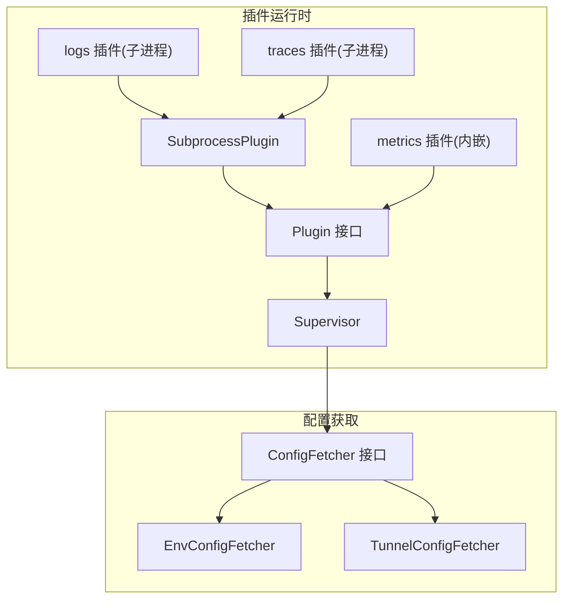
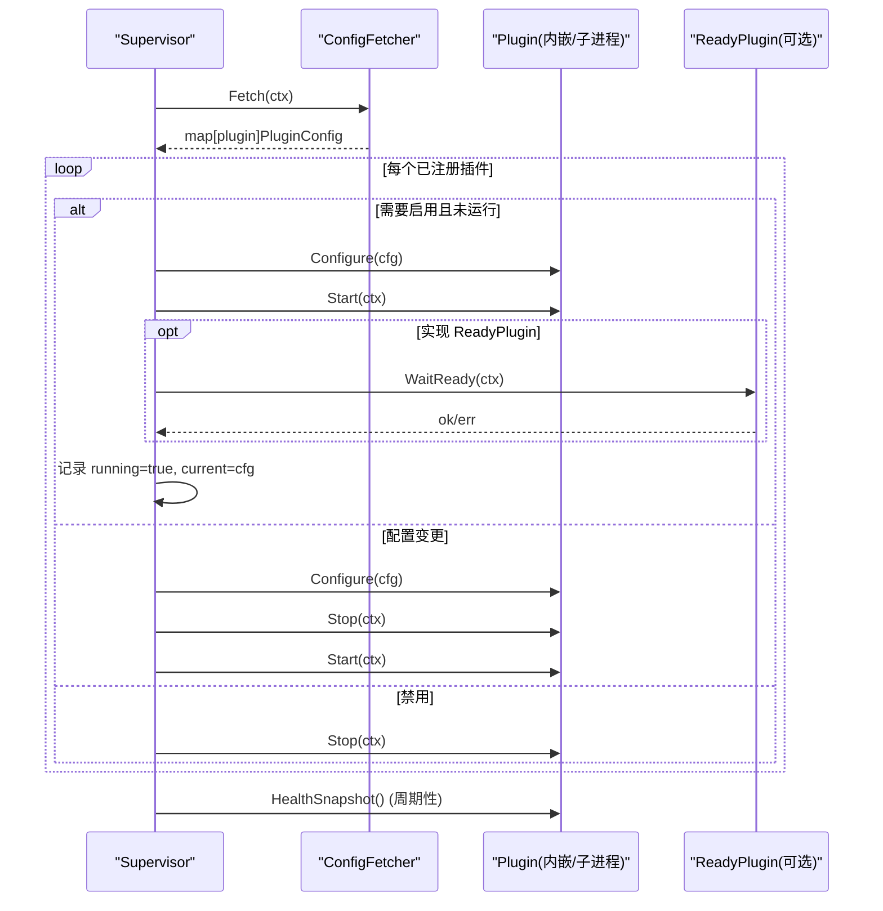
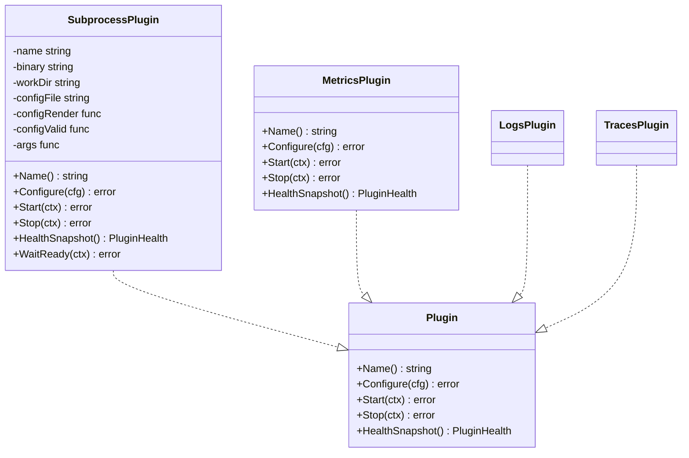
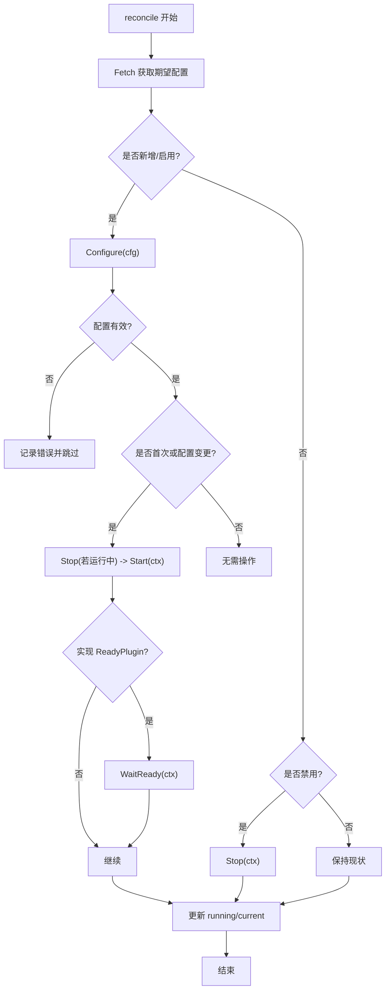
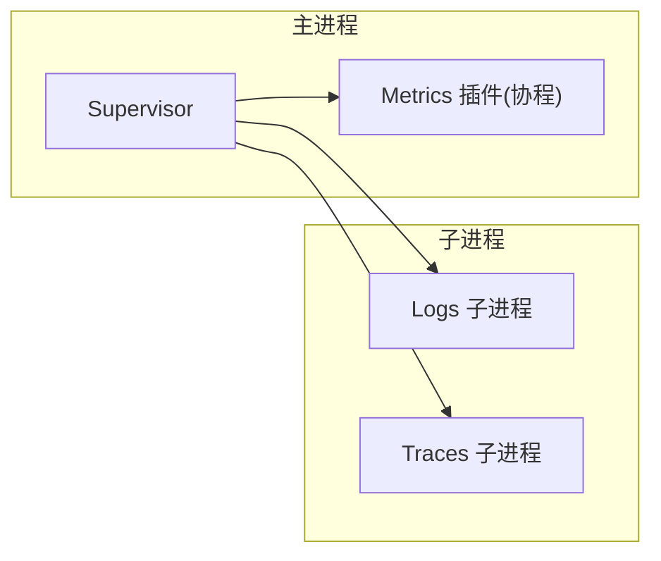
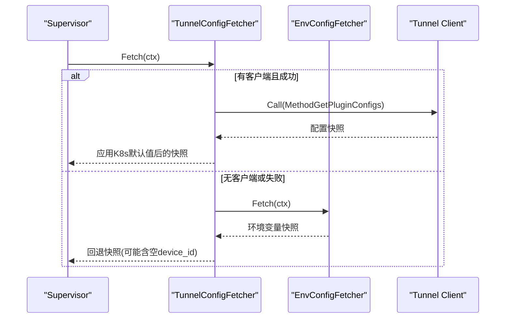
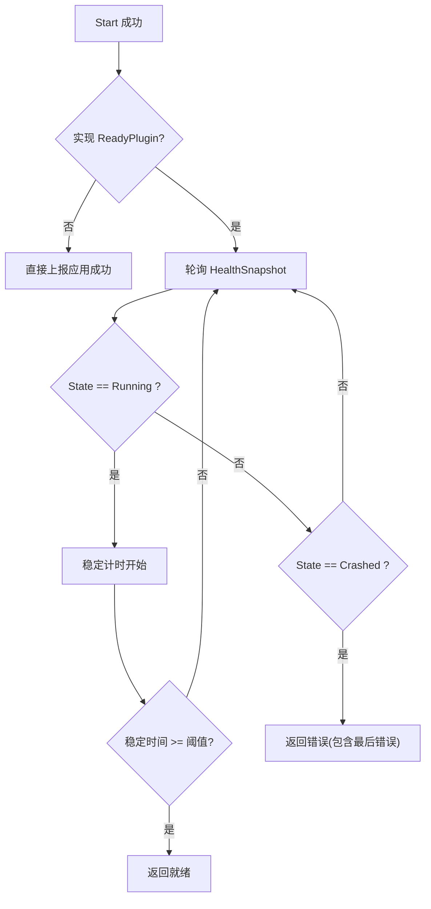
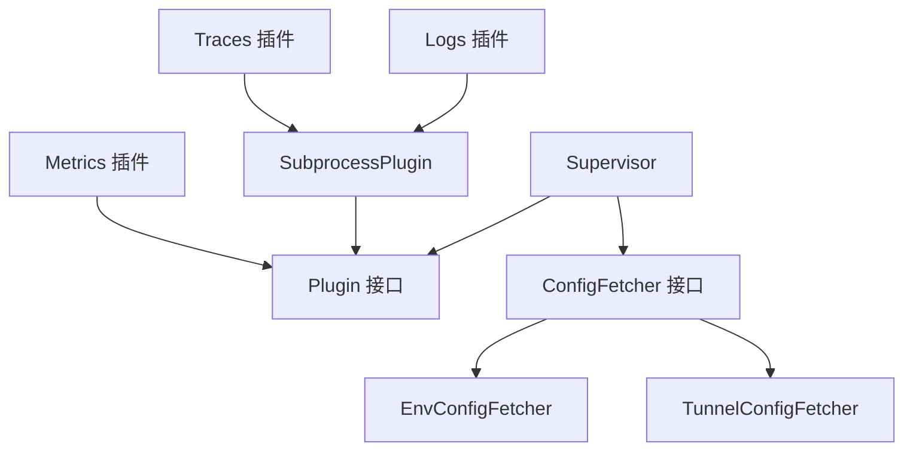

# 插件架构设计

<cite>
**本文引用的文件**
- [internal/edgeagent/plugins/plugin.go](file://internal/edgeagent/plugins/plugin.go)
- [internal/edgeagent/plugins/supervisor.go](file://internal/edgeagent/plugins/supervisor.go)
- [internal/edgeagent/plugins/subprocess.go](file://internal/edgeagent/plugins/subprocess.go)
- [internal/edgeagent/plugins/config_env.go](file://internal/edgeagent/plugins/config_env.go)
- [internal/edgeagent/plugins/config_tunnel.go](file://internal/edgeagent/plugins/config_tunnel.go)
- [internal/edgeagent/plugins/metrics/plugin.go](file://internal/edgeagent/plugins/metrics/plugin.go)
- [internal/edgeagent/plugins/logs/plugin.go](file://internal/edgeagent/plugins/logs/plugin.go)
- [internal/edgeagent/plugins/traces/plugin.go](file://internal/edgeagent/plugins/traces/plugin.go)
</cite>

## 目录
1. [简介](#简介)
2. [项目结构](#项目结构)
3. [核心组件](#核心组件)
4. [架构总览](#架构总览)
5. [详细组件分析](#详细组件分析)
6. [依赖关系分析](#依赖关系分析)
7. [性能考量](#性能考量)
8. [故障排查指南](#故障排查指南)
9. [结论](#结论)

## 简介
本文件系统性阐述 Ongrid 边缘侧插件架构的设计与实现，重点覆盖：
- 统一接口定义：Plugin 接口的四个核心方法 Name、Configure、Start、Stop 的职责与约束。
- 生命周期管理：Supervisor 如何协调插件的启动、停止、配置热更新与健康上报。
- 进程隔离模型：内嵌插件（in-process）与子进程插件（subprocess）的统一抽象。
- 配置获取机制：ConfigFetcher 的环境变量与隧道两种来源及回退策略。
- 就绪状态管理：ReadyPlugin 在异步启动场景下的就绪门控。
- 架构图与数据流图：展示组件交互与关键路径。

## 项目结构
插件子系统位于 internal/edgeagent/plugins，核心文件职责如下：
- plugin.go：定义 Plugin 接口、配置结构、健康状态、配置获取器接口与就绪接口。
- supervisor.go：Supervisor 负责注册、拉取配置、差异对比、启停与重启、健康快照收集。
- subprocess.go：SubprocessPlugin 封装外部二进制（如 otelcol-contrib），提供配置渲染、校验、原子替换、崩溃指数退避重启等能力。
- config_env.go：EnvConfigFetcher 从环境变量读取插件配置，作为冷启动或离线回退。
- config_tunnel.go：TunnelConfigFetcher 通过隧道 RPC 获取管理器下发的配置，并应用 Kubernetes 默认值；失败时回退到 EnvConfigFetcher。
- metrics/plugin.go：内嵌指标采集插件，周期抓取本地 /metrics 并通过隧道推送。
- logs/plugin.go、traces/plugin.go：基于 SubprocessPlugin 包装 otelcol-contrib 的子进程插件。

图表来源
- [internal/edgeagent/plugins/plugin.go:18-52](file://internal/edgeagent/plugins/plugin.go#L18-L52)
- [internal/edgeagent/plugins/supervisor.go:12-47](file://internal/edgeagent/plugins/supervisor.go#L12-L47)
- [internal/edgeagent/plugins/subprocess.go:17-51](file://internal/edgeagent/plugins/subprocess.go#L17-L51)
- [internal/edgeagent/plugins/config_env.go:10-36](file://internal/edgeagent/plugins/config_env.go#L10-L36)
- [internal/edgeagent/plugins/config_tunnel.go:18-55](file://internal/edgeagent/plugins/config_tunnel.go#L18-L55)
- [internal/edgeagent/plugins/metrics/plugin.go:64-80](file://internal/edgeagent/plugins/metrics/plugin.go#L64-L80)
- [internal/edgeagent/plugins/logs/plugin.go:20-41](file://internal/edgeagent/plugins/logs/plugin.go#L20-L41)
- [internal/edgeagent/plugins/traces/plugin.go:20-49](file://internal/edgeagent/plugins/traces/plugin.go#L20-L49)

章节来源
- [internal/edgeagent/plugins/plugin.go:18-135](file://internal/edgeagent/plugins/plugin.go#L18-L135)
- [internal/edgeagent/plugins/supervisor.go:12-133](file://internal/edgeagent/plugins/supervisor.go#L12-L133)
- [internal/edgeagent/plugins/subprocess.go:17-135](file://internal/edgeagent/plugins/subprocess.go#L17-L135)
- [internal/edgeagent/plugins/config_env.go:10-76](file://internal/edgeagent/plugins/config_env.go#L10-L76)
- [internal/edgeagent/plugins/config_tunnel.go:18-186](file://internal/edgeagent/plugins/config_tunnel.go#L18-L186)
- [internal/edgeagent/plugins/metrics/plugin.go:1-306](file://internal/edgeagent/plugins/metrics/plugin.go#L1-L306)
- [internal/edgeagent/plugins/logs/plugin.go:1-42](file://internal/edgeagent/plugins/logs/plugin.go#L1-L42)
- [internal/edgeagent/plugins/traces/plugin.go:1-50](file://internal/edgeagent/plugins/traces/plugin.go#L1-L50)

## 核心组件
- Plugin 接口：统一抽象所有插件的生命周期与状态汇报。
- Supervisor：集中编排插件注册、配置拉取、差异对比、启停控制、健康快照收集与配置应用上报。
- SubprocessPlugin：将任意外部二进制纳入统一生命周期管理，提供配置渲染、校验、原子替换、崩溃指数退避重启、日志捕获与就绪等待。
- ConfigFetcher：抽象配置来源，支持环境变量与隧道两种实现，具备回退与缓存能力。
- ReadyPlugin：可选扩展，用于异步启动插件的就绪门控。

章节来源
- [internal/edgeagent/plugins/plugin.go:18-135](file://internal/edgeagent/plugins/plugin.go#L18-L135)
- [internal/edgeagent/plugins/supervisor.go:12-133](file://internal/edgeagent/plugins/supervisor.go#L12-L133)
- [internal/edgeagent/plugins/subprocess.go:17-135](file://internal/edgeagent/plugins/subprocess.go#L17-L135)
- [internal/edgeagent/plugins/config_env.go:10-76](file://internal/edgeagent/plugins/config_env.go#L10-L76)
- [internal/edgeagent/plugins/config_tunnel.go:18-186](file://internal/edgeagent/plugins/config_tunnel.go#L18-L186)

## 架构总览
Supervisor 是插件系统的“调度中心”，它周期性或响应信号触发配置拉取，并与当前期望状态进行差异比较，按需 Configure/Start/Stop。对于子进程插件，Supervisor 借助 SubprocessPlugin 完成进程生命周期管理与崩溃恢复；对于内嵌插件（如 metrics），Supervisor 直接调用其 Start/Stop。配置来源由 ConfigFetcher 抽象，生产环境优先使用 TunnelConfigFetcher，失败时回退到 EnvConfigFetcher。

图表来源
- [internal/edgeagent/plugins/supervisor.go:112-243](file://internal/edgeagent/plugins/supervisor.go#L112-L243)
- [internal/edgeagent/plugins/plugin.go:18-52](file://internal/edgeagent/plugins/plugin.go#L18-L52)
- [internal/edgeagent/plugins/config_env.go:45-76](file://internal/edgeagent/plugins/config_env.go#L45-L76)
- [internal/edgeagent/plugins/config_tunnel.go:100-186](file://internal/edgeagent/plugins/config_tunnel.go#L100-L186)

## 详细组件分析

### Plugin 接口与生命周期
- Name：返回 OTel 信号名（如 metrics/logs/traces），用作注册键与上报标识。
- Configure：接收管理器下发或环境回退的配置，必须幂等并可热重载（例如重新渲染配置文件、重启子进程）。
- Start：开始工作；对子进程插件即拉起进程，对内嵌插件即启动协程；需幂等，可重复调用。
- Stop：优雅关闭；对子进程发送 SIGTERM 并等待退出，对内嵌取消上下文；可安全重复调用。
- HealthSnapshot：非阻塞地返回当前健康快照，供 Supervisor 周期性上报。

图表来源
- [internal/edgeagent/plugins/plugin.go:18-52](file://internal/edgeagent/plugins/plugin.go#L18-L52)
- [internal/edgeagent/plugins/subprocess.go:17-51](file://internal/edgeagent/plugins/subprocess.go#L17-L51)
- [internal/edgeagent/plugins/metrics/plugin.go:64-80](file://internal/edgeagent/plugins/metrics/plugin.go#L64-L80)
- [internal/edgeagent/plugins/logs/plugin.go:20-41](file://internal/edgeagent/plugins/logs/plugin.go#L20-L41)
- [internal/edgeagent/plugins/traces/plugin.go:20-49](file://internal/edgeagent/plugins/traces/plugin.go#L20-L49)

章节来源
- [internal/edgeagent/plugins/plugin.go:18-52](file://internal/edgeagent/plugins/plugin.go#L18-L52)
- [internal/edgeagent/plugins/subprocess.go:137-265](file://internal/edgeagent/plugins/subprocess.go#L137-L265)
- [internal/edgeagent/plugins/metrics/plugin.go:104-179](file://internal/edgeagent/plugins/metrics/plugin.go#L104-L179)

### Supervisor 的启动、监控、重启与健康检查
- 启动流程：Run 先执行一次 reconcile，然后进入循环监听 reload 信号与定时器。
- 配置拉取：每次 reconcile 调用 ConfigFetcher.Fetch，得到期望配置快照。
- 差异对比：比较当前 running 状态与 desired 配置，决定是否需要 Configure/Start/Stop。
- 启动与就绪：对首次启动或配置变更的插件，先 Stop（若已在运行），再 Start；若实现 ReadyPlugin，则等待就绪后再上报配置应用结果。
- 健康快照：周期性收集各插件 HealthSnapshot，供心跳上报。
- 优雅关闭：Shutdown 阶段对所有插件发起 Stop，带超时保护。

图表来源
- [internal/edgeagent/plugins/supervisor.go:135-243](file://internal/edgeagent/plugins/supervisor.go#L135-L243)

章节来源
- [internal/edgeagent/plugins/supervisor.go:112-276](file://internal/edgeagent/plugins/supervisor.go#L112-L276)

### 进程隔离模型：内嵌插件 vs 子进程插件
- 内嵌插件（如 metrics）：在 ongrid-edge 进程内以协程方式运行，通过隧道 RPC 推送数据，无额外进程开销。
- 子进程插件（如 logs/traces）：通过 SubprocessPlugin 拉起外部二进制（otelcol-contrib），独立进程隔离，崩溃不影响主进程；支持配置原子替换、SIGTERM 优雅退出、指数退避重启。
- 统一抽象：两者均实现 Plugin 接口，Supervisor 以相同方式管理生命周期与健康上报。

图表来源
- [internal/edgeagent/plugins/metrics/plugin.go:1-35](file://internal/edgeagent/plugins/metrics/plugin.go#L1-L35)
- [internal/edgeagent/plugins/logs/plugin.go:1-42](file://internal/edgeagent/plugins/logs/plugin.go#L1-L42)
- [internal/edgeagent/plugins/traces/plugin.go:1-50](file://internal/edgeagent/plugins/traces/plugin.go#L1-L50)
- [internal/edgeagent/plugins/subprocess.go:17-51](file://internal/edgeagent/plugins/subprocess.go#L17-L51)

章节来源
- [internal/edgeagent/plugins/metrics/plugin.go:1-306](file://internal/edgeagent/plugins/metrics/plugin.go#L1-L306)
- [internal/edgeagent/plugins/subprocess.go:208-360](file://internal/edgeagent/plugins/subprocess.go#L208-L360)

### 配置获取机制（ConfigFetcher）
- EnvConfigFetcher：从环境变量解析插件配置，适用于开发或离线场景；当隧道不可用时作为回退。
- TunnelConfigFetcher：通过隧道 RPC 获取管理器下发的配置，并注入 Kubernetes 相关默认值；失败时回退到 EnvConfigFetcher，并缓存上次成功快照。
- 安全与健壮性：敏感信息（如认证凭据）不随管线上送，仅由边端本地填充；未知插件名会被过滤；设备 ID 优先采用管理器解析值。

图表来源
- [internal/edgeagent/plugins/config_tunnel.go:100-186](file://internal/edgeagent/plugins/config_tunnel.go#L100-L186)
- [internal/edgeagent/plugins/config_env.go:45-76](file://internal/edgeagent/plugins/config_env.go#L45-L76)

章节来源
- [internal/edgeagent/plugins/config_tunnel.go:18-186](file://internal/edgeagent/plugins/config_tunnel.go#L18-L186)
- [internal/edgeagent/plugins/config_env.go:10-76](file://internal/edgeagent/plugins/config_env.go#L10-L76)

### 就绪状态管理（ReadyPlugin）
- 适用场景：子进程插件 Start 为异步，需要确认进程稳定运行后才认为“已就绪”。
- 实现方式：SubprocessPlugin.WaitReady 持续轮询健康状态，确保一段时间处于 Running 才返回成功；若出现 Crashed 或上下文超时则失败。
- Supervisor 集成：在 Start 成功后，若插件实现 ReadyPlugin，则等待就绪后再上报配置应用结果。

图表来源
- [internal/edgeagent/plugins/subprocess.go:53-84](file://internal/edgeagent/plugins/subprocess.go#L53-L84)
- [internal/edgeagent/plugins/supervisor.go:225-240](file://internal/edgeagent/plugins/supervisor.go#L225-L240)

章节来源
- [internal/edgeagent/plugins/subprocess.go:53-84](file://internal/edgeagent/plugins/subprocess.go#L53-L84)
- [internal/edgeagent/plugins/supervisor.go:225-240](file://internal/edgeagent/plugins/supervisor.go#L225-L240)

## 依赖关系分析
- Supervisor 依赖 ConfigFetcher 获取配置，依赖 Plugin 接口统一管理生命周期。
- SubprocessPlugin 依赖操作系统进程管理能力，负责二进制路径、工作目录、配置渲染与校验、日志输出与崩溃重启。
- 具体插件（metrics/logs/traces）依赖各自的数据平面通道（隧道 RPC 或直接写后端）。
- TunnelConfigFetcher 依赖 tunnel.Client 与 EnvConfigFetcher 回退；同时根据环境注入 Kubernetes 默认值。

图表来源
- [internal/edgeagent/plugins/supervisor.go:12-47](file://internal/edgeagent/plugins/supervisor.go#L12-L47)
- [internal/edgeagent/plugins/plugin.go:18-52](file://internal/edgeagent/plugins/plugin.go#L18-L52)
- [internal/edgeagent/plugins/config_env.go:10-36](file://internal/edgeagent/plugins/config_env.go#L10-L36)
- [internal/edgeagent/plugins/config_tunnel.go:18-55](file://internal/edgeagent/plugins/config_tunnel.go#L18-L55)
- [internal/edgeagent/plugins/subprocess.go:17-51](file://internal/edgeagent/plugins/subprocess.go#L17-L51)
- [internal/edgeagent/plugins/metrics/plugin.go:64-80](file://internal/edgeagent/plugins/metrics/plugin.go#L64-L80)
- [internal/edgeagent/plugins/logs/plugin.go:20-41](file://internal/edgeagent/plugins/logs/plugin.go#L20-L41)
- [internal/edgeagent/plugins/traces/plugin.go:20-49](file://internal/edgeagent/plugins/traces/plugin.go#L20-L49)

章节来源
- [internal/edgeagent/plugins/supervisor.go:12-133](file://internal/edgeagent/plugins/supervisor.go#L12-L133)
- [internal/edgeagent/plugins/config_tunnel.go:18-186](file://internal/edgeagent/plugins/config_tunnel.go#L18-L186)
- [internal/edgeagent/plugins/config_env.go:10-76](file://internal/edgeagent/plugins/config_env.go#L10-L76)

## 性能考量
- 配置拉取频率：Supervisor 默认每 60 秒进行一次安全网轮询，可通过选项调整；reload 信号可立即触发。
- 子进程重启退避：崩溃后采用指数退避（1s→2s→4s…上限 5 分钟），避免雪崩。
- 配置原子替换：子进程配置写入临时文件，校验通过后原子重命名，减少不一致窗口。
- 健康快照非阻塞：HealthSnapshot 必须快速返回，避免阻塞 Supervisor 主循环。
- 内嵌插件采样间隔：metrics 插件默认 15s 抓取，可根据负载调优。

章节来源
- [internal/edgeagent/plugins/supervisor.go:49-73](file://internal/edgeagent/plugins/supervisor.go#L49-L73)
- [internal/edgeagent/plugins/subprocess.go:267-308](file://internal/edgeagent/plugins/subprocess.go#L267-L308)
- [internal/edgeagent/plugins/subprocess.go:164-206](file://internal/edgeagent/plugins/subprocess.go#L164-L206)
- [internal/edgeagent/plugins/metrics/plugin.go:181-208](file://internal/edgeagent/plugins/metrics/plugin.go#L181-L208)

## 故障排查指南
- 配置拉取失败：Supervisor 会保留上一份已知状态并记录告警；检查隧道连通性与环境变量回退。
- 子进程崩溃：查看工作目录下日志文件；关注 RestartCount 与 LastError；确认二进制存在与工作目录权限。
- 配置校验失败：子进程配置在替换前会执行校验，失败不会替换旧配置；检查渲染逻辑与参数。
- 就绪失败：ReadyPlugin 超时或检测到 Crashed 会返回错误；检查子进程启动参数与依赖资源。
- 内嵌插件异常：metrics 插件抓取失败会累积 failureCount 并在 LastError 中体现；检查目标 /metrics 可达性与鉴权。

章节来源
- [internal/edgeagent/plugins/supervisor.go:135-159](file://internal/edgeagent/plugins/supervisor.go#L135-L159)
- [internal/edgeagent/plugins/subprocess.go:310-360](file://internal/edgeagent/plugins/subprocess.go#L310-L360)
- [internal/edgeagent/plugins/subprocess.go:164-206](file://internal/edgeagent/plugins/subprocess.go#L164-L206)
- [internal/edgeagent/plugins/subprocess.go:53-84](file://internal/edgeagent/plugins/subprocess.go#L53-L84)
- [internal/edgeagent/plugins/metrics/plugin.go:220-282](file://internal/edgeagent/plugins/metrics/plugin.go#L220-L282)

## 结论
Ongrid 插件架构通过统一的 Plugin 接口与 Supervisor 编排，实现了内嵌与子进程插件的一致生命周期管理；ConfigFetcher 抽象了配置来源并提供稳健的回退机制；ReadyPlugin 解决了异步启动的就绪门控问题。该设计在保证高可用与可扩展性的同时，降低了插件开发与运维复杂度，便于在多种部署形态（裸机、Kubernetes、网关模式）下稳定运行。