# 插件系统

<cite>
**本文引用的文件**
- [plugin.go](file://internal/edgeagent/plugins/plugin.go)
- [supervisor.go](file://internal/edgeagent/plugins/supervisor.go)
- [subprocess.go](file://internal/edgeagent/plugins/subprocess.go)
- [config_env.go](file://internal/edgeagent/plugins/config_env.go)
- [config_tunnel.go](file://internal/edgeagent/plugins/config_tunnel.go)
- [custommetrics/plugin.go](file://internal/edgeagent/plugins/custommetrics/plugin.go)
- [custommetrics/spec.go](file://internal/edgeagent/plugins/custommetrics/spec.go)
- [databasemetrics/plugin.go](file://internal/edgeagent/plugins/databasemetrics/plugin.go)
- [databasemetrics/spec.go](file://internal/edgeagent/plugins/databasemetrics/spec.go)
- [hostmetrics/plugin.go](file://internal/edgeagent/plugins/hostmetrics/plugin.go)
- [logs/plugin.go](file://internal/edgeagent/plugins/logs/plugin.go)
- [traces/plugin.go](file://internal/edgeagent/plugins/traces/plugin.go)
- [metrics/scrape.go](file://internal/edgeagent/plugins/metrics/scrape.go)
</cite>

## 目录
1. [简介](#简介)
2. [项目结构](#项目结构)
3. [核心组件](#核心组件)
4. [架构总览](#架构总览)
5. [详细组件分析](#详细组件分析)
6. [依赖关系分析](#依赖关系分析)
7. [性能与资源限制](#性能与资源限制)
8. [故障排查指南](#故障排查指南)
9. [结论](#结论)
10. [附录：插件开发与配置指南](#附录：插件开发与配置指南)

## 简介
本文件系统化阐述 Ongrid 边缘侧插件系统的架构与实现，覆盖插件接口、注册机制、生命周期管理、沙箱隔离与安全模型；详解内置插件（custommetrics、databasemetrics、hostmetrics、logs、traces）的实现原理与使用方法；并提供插件开发规范、配置格式与调试技巧。

## 项目结构
插件系统位于 internal/edgeagent/plugins 下，采用“统一接口 + 多实现”的模块化设计：
- 公共接口与运行时：Plugin、Supervisor、SubprocessPlugin、ConfigFetcher
- 配置来源：环境变量与环境回退、隧道拉取并注入默认值
- 内置插件：
  - custommetrics：拉取任意 Prometheus /metrics 端点并推送样本
  - databasemetrics：为数据库启动专用 exporter 子进程并采集
  - hostmetrics：运行 node_exporter 并补充 textfile 指标
  - logs：运行 otelcol-contrib 收集日志
  - traces：运行 otelcol-contrib 收集链路追踪
  - metrics：通用指标抓取与推送（内部复用）

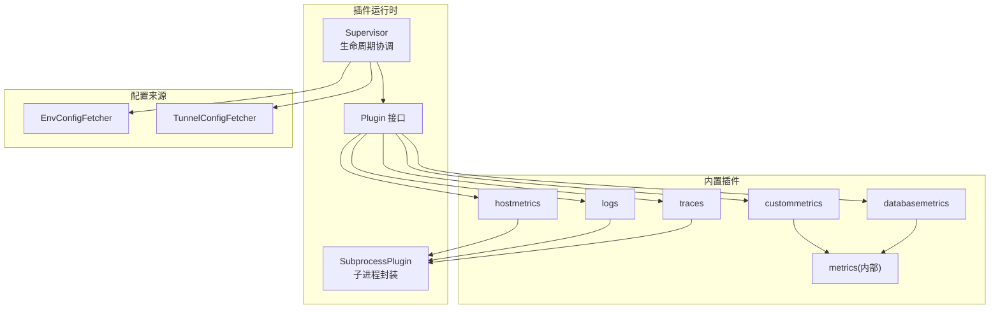

图表来源
- [supervisor.go:12-47](file://internal/edgeagent/plugins/supervisor.go#L12-L47)
- [plugin.go:18-52](file://internal/edgeagent/plugins/plugin.go#L18-L52)
- [subprocess.go:17-51](file://internal/edgeagent/plugins/subprocess.go#L17-L51)
- [config_env.go:10-36](file://internal/edgeagent/plugins/config_env.go#L10-L36)
- [config_tunnel.go:18-55](file://internal/edgeagent/plugins/config_tunnel.go#L18-L55)

章节来源
- [plugin.go:1-135](file://internal/edgeagent/plugins/plugin.go#L1-L135)
- [supervisor.go:1-301](file://internal/edgeagent/plugins/supervisor.go#L1-L301)
- [subprocess.go:1-391](file://internal/edgeagent/plugins/subprocess.go#L1-L391)
- [config_env.go:1-106](file://internal/edgeagent/plugins/config_env.go#L1-L106)
- [config_tunnel.go:1-519](file://internal/edgeagent/plugins/config_tunnel.go#L1-L519)

## 核心组件
- Plugin 接口：定义 Name、Configure、Start、Stop、HealthSnapshot，以及可选的 ReadyPlugin、ConfigApplyReporter。所有插件通过该接口被 Supervisor 统一管理。
- Supervisor：负责从 ConfigFetcher 获取配置快照，按插件名进行 diff 并执行 Configure/Start/Stop；周期性健康上报；支持热重载与优雅关闭。
- SubprocessPlugin：将外部二进制（如 otelcol-contrib、node_exporter、各数据库 exporter）包装为 Plugin，提供配置渲染、原子替换、校验、崩溃指数退避重启、日志捕获等能力。
- ConfigFetcher：抽象配置来源。EnvConfigFetcher 从环境变量读取；TunnelConfigFetcher 从管理器通过隧道拉取，并在 K8s 环境下注入默认值，失败时回退到 Env 配置。

章节来源
- [plugin.go:18-135](file://internal/edgeagent/plugins/plugin.go#L18-L135)
- [supervisor.go:12-110](file://internal/edgeagent/plugins/supervisor.go#L12-L110)
- [subprocess.go:17-135](file://internal/edgeagent/plugins/subprocess.go#L17-L135)
- [config_env.go:10-76](file://internal/edgeagent/plugins/config_env.go#L10-L76)
- [config_tunnel.go:18-186](file://internal/edgeagent/plugins/config_tunnel.go#L18-L186)

## 架构总览
插件系统以 Supervisor 为中心，统一编排多种插件的生命周期。配置由 TunnelConfigFetcher 或 EnvConfigFetcher 提供；子进程类插件通过 SubprocessPlugin 管理；指标类插件通过 metricscommon 与 tunnel 通道推送样本至管理器。

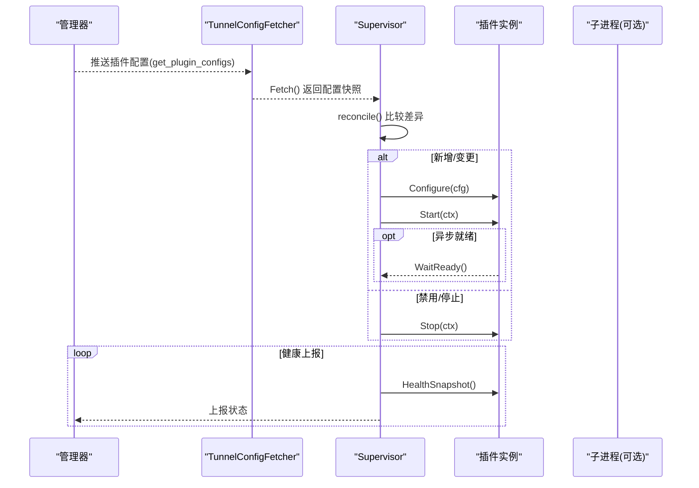

图表来源
- [config_tunnel.go:100-186](file://internal/edgeagent/plugins/config_tunnel.go#L100-L186)
- [supervisor.go:112-243](file://internal/edgeagent/plugins/supervisor.go#L112-L243)
- [subprocess.go:53-84](file://internal/edgeagent/plugins/subprocess.go#L53-L84)

## 详细组件分析

### 插件接口与生命周期
- 生命周期顺序：Configure → Start → (HealthSnapshot)* → Stop
- 幂等性：Start/Stop 需可重复调用；Stop 在已停止时无操作
- 健康状态：stopped/starting/running/crashed，包含错误信息、重启次数、PID、时间戳
- 可选能力：
  - ReadyPlugin：等待子进程稳定就绪后再上报“已应用”
  - ConfigApplyReporter：向管理器确认配置应用结果

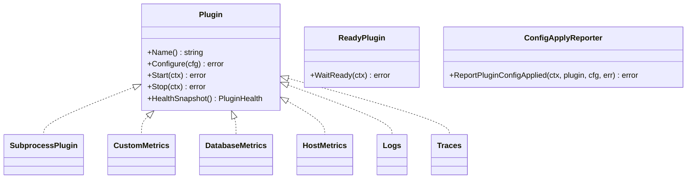

图表来源
- [plugin.go:18-135](file://internal/edgeagent/plugins/plugin.go#L18-L135)
- [subprocess.go:17-135](file://internal/edgeagent/plugins/subprocess.go#L17-L135)

章节来源
- [plugin.go:18-135](file://internal/edgeagent/plugins/plugin.go#L18-L135)

### Supervisor 协调器
- 职责：注册插件、定时/信号触发重新加载、计算期望态与实际态差异、执行 Configure/Start/Stop、健康上报、优雅关闭
- 并发安全：对插件集合、当前配置、运行状态使用互斥保护
- 容错：单个插件失败不影响其他插件；配置拉取失败保持上一份快照

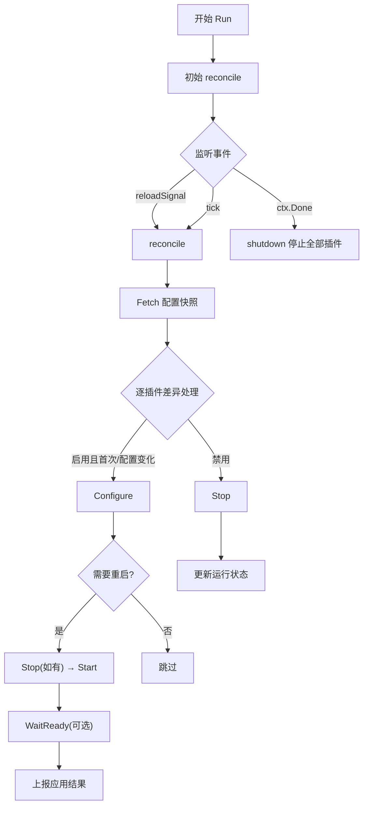

图表来源
- [supervisor.go:112-243](file://internal/edgeagent/plugins/supervisor.go#L112-L243)

章节来源
- [supervisor.go:12-301](file://internal/edgeagent/plugins/supervisor.go#L12-L301)

### 子进程插件封装（SubprocessPlugin）
- 配置渲染与原子替换：写入临时文件 → 可选校验 → 原子重命名
- 进程管理：启动、SIGTERM 优雅退出、超时强制终止、崩溃指数退避重启（1s→...→5min）
- 日志输出：子进程 stdout/stderr 定向到插件专属日志文件
- 健康上报：记录 PID、StartedAt、RestartCount、LastError

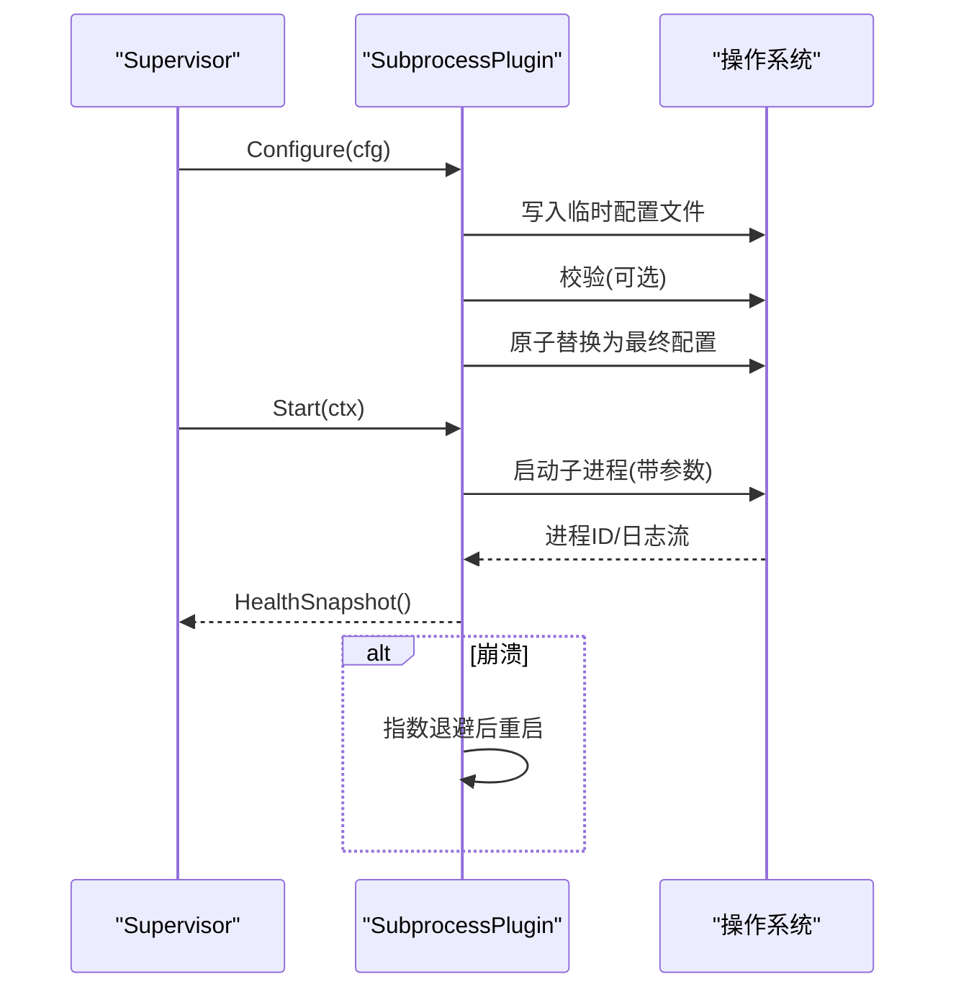

图表来源
- [subprocess.go:140-206](file://internal/edgeagent/plugins/subprocess.go#L140-L206)
- [subprocess.go:208-308](file://internal/edgeagent/plugins/subprocess.go#L208-L308)

章节来源
- [subprocess.go:17-391](file://internal/edgeagent/plugins/subprocess.go#L17-L391)

### 配置来源与默认值注入
- EnvConfigFetcher：从环境变量读取每个插件的配置片段（ENABLED、ENDPOINT、AUTH_USER/PASS、SPEC_JSON），未知插件忽略，JSON 解析失败静默降级
- TunnelConfigFetcher：从管理器拉取配置，填充数据面认证（access_key/secret_key），在 K8s 模式下注入默认值（如 logs/traces/metrics/hostmetrics/procmetrics 的默认 endpoint、collector 参数、路径等）；RPC 失败时回退到 Env 快照

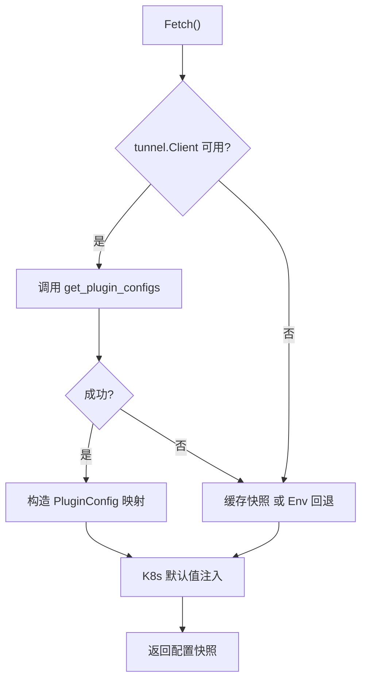

图表来源
- [config_tunnel.go:100-186](file://internal/edgeagent/plugins/config_tunnel.go#L100-L186)
- [config_env.go:45-76](file://internal/edgeagent/plugins/config_env.go#L45-L76)

章节来源
- [config_env.go:1-106](file://internal/edgeagent/plugins/config_env.go#L1-L106)
- [config_tunnel.go:1-519](file://internal/edgeagent/plugins/config_tunnel.go#L1-L519)

### 内置插件：custommetrics
- 功能：根据 spec.targets 列表，周期性 HTTP GET 目标 /metrics，解析 Prometheus 文本格式，附加 up 样本并通过 tunnel 推送
- 健康：维护每个 target 的状态、最近成功时间、样本数、错误信息
- 配置要点：id、target_url、scrape_interval、scrape_timeout、auth、extra_labels、sample_limit、label_drop、resource 分类（database 类型自动打标）

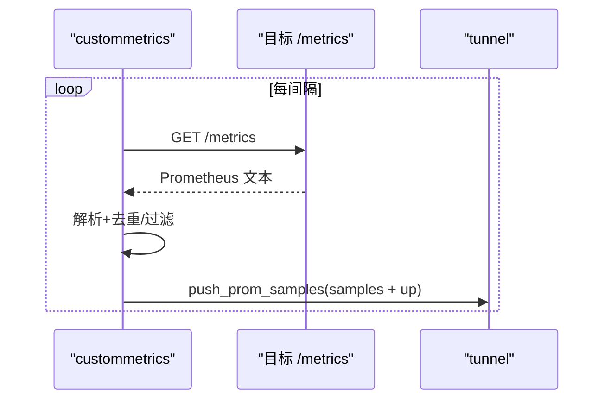

图表来源
- [custommetrics/plugin.go:135-229](file://internal/edgeagent/plugins/custommetrics/plugin.go#L135-L229)
- [custommetrics/spec.go:13-112](file://internal/edgeagent/plugins/custommetrics/spec.go#L13-L112)

章节来源
- [custommetrics/plugin.go:1-291](file://internal/edgeagent/plugins/custommetrics/plugin.go#L1-L291)
- [custommetrics/spec.go:1-295](file://internal/edgeagent/plugins/custommetrics/spec.go#L1-L295)

### 内置插件：databasemetrics
- 功能：为每个数据库源启动对应 exporter 子进程（mysqld_exporter/postgres_exporter/redis_exporter/mongodb_exporter），暴露本地 /metrics，定期抓取并推送
- 安全：连接凭据通过受管 secret 文件读取，严格权限校验（0600 或更严）
- 配置要点：sources[]，db_type、listen_address、connection{type=managed,path}、exporter 白名单字段、TLS、interval/timeout、sample_limit、label_drop

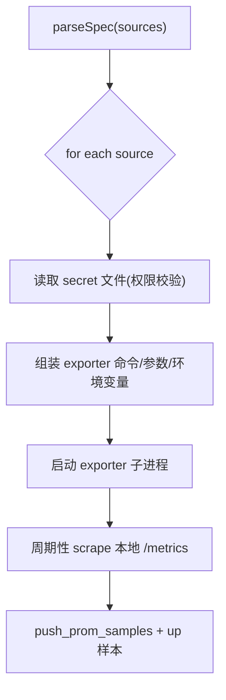

图表来源
- [databasemetrics/plugin.go:178-296](file://internal/edgeagent/plugins/databasemetrics/plugin.go#L178-L296)
- [databasemetrics/spec.go:54-166](file://internal/edgeagent/plugins/databasemetrics/spec.go#L54-L166)
- [databasemetrics/spec.go:168-203](file://internal/edgeagent/plugins/databasemetrics/spec.go#L168-L203)

章节来源
- [databasemetrics/plugin.go:1-403](file://internal/edgeagent/plugins/databasemetrics/plugin.go#L1-L403)
- [databasemetrics/spec.go:1-800](file://internal/edgeagent/plugins/databasemetrics/spec.go#L1-L800)

### 内置插件：hostmetrics
- 功能：运行 node_exporter，暴露主机指标；同时内嵌一个补充指标生产者，周期性写入 textfile 指标（如 nf_conntrack），解决新版内核路径差异导致的缺失问题
- 配置要点：listen_address、collectors_enabled/disabled、extra_args；textfile 目录固定挂载到 node_exporter

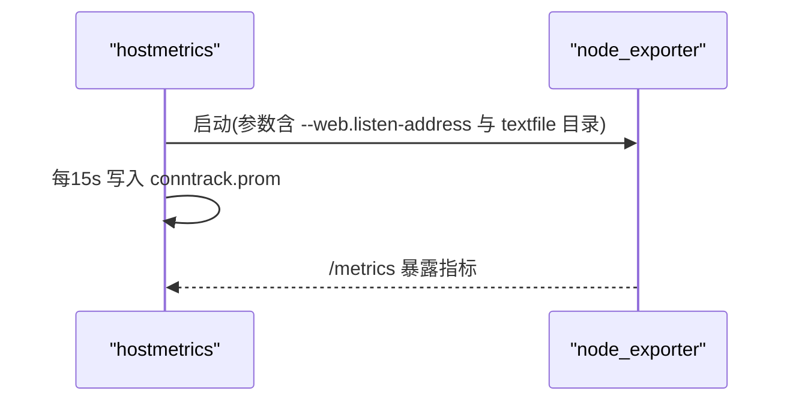

图表来源
- [hostmetrics/plugin.go:62-93](file://internal/edgeagent/plugins/hostmetrics/plugin.go#L62-L93)
- [hostmetrics/plugin.go:150-231](file://internal/edgeagent/plugins/hostmetrics/plugin.go#L150-L231)

章节来源
- [hostmetrics/plugin.go:1-277](file://internal/edgeagent/plugins/hostmetrics/plugin.go#L1-L277)

### 内置插件：logs 与 traces
- 共同点：均基于 otelcol-contrib 子进程，通过渲染配置并传入 --config=... 启动；配置经 OTel 校验器验证；数据直接推送到管理器 nginx 对应端点
- 差异：logs 针对 Loki/Elasticsearch 管道；traces 针对 /v1/traces 端点；K8s 模式下会注入默认 endpoint、集群/节点标签等

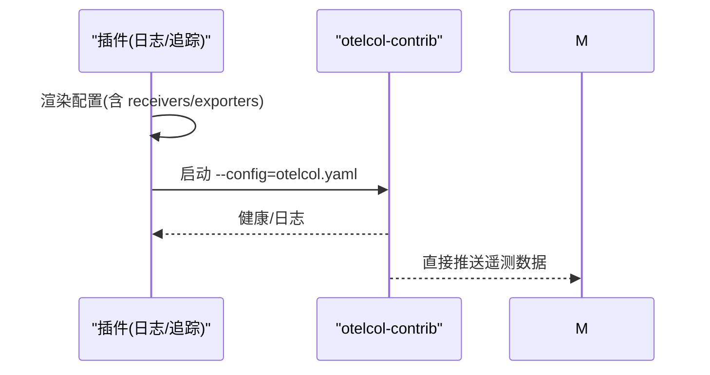

图表来源
- [logs/plugin.go:20-41](file://internal/edgeagent/plugins/logs/plugin.go#L20-L41)
- [traces/plugin.go:24-49](file://internal/edgeagent/plugins/traces/plugin.go#L24-L49)
- [config_tunnel.go:246-363](file://internal/edgeagent/plugins/config_tunnel.go#L246-L363)

章节来源
- [logs/plugin.go:1-42](file://internal/edgeagent/plugins/logs/plugin.go#L1-L42)
- [traces/plugin.go:1-50](file://internal/edgeagent/plugins/traces/plugin.go#L1-L50)
- [config_tunnel.go:246-363](file://internal/edgeagent/plugins/config_tunnel.go#L246-L363)

### 指标抓取与推送（metricscommon 与 metrics）
- 抓取：HTTP GET /metrics，解析 Prometheus 文本格式，扁平化为样本，支持 bearer token、TLS 选项、超时控制
- 去重：文件系统指标按物理设备去重，避免容器/VM 绑定挂载导致的数据膨胀
- 推送：通过 tunnel 的 push_prom_samples 方法上报，附带 edge_id、source_label、样本集

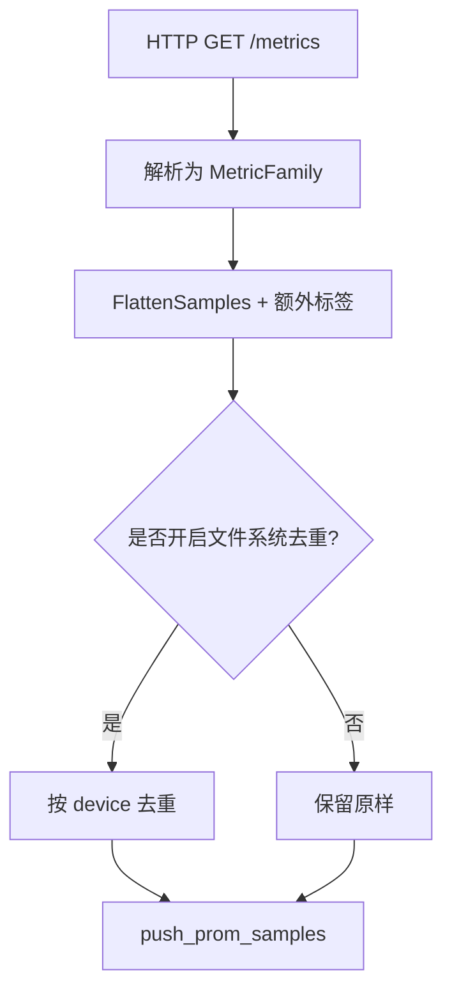

图表来源
- [metrics/scrape.go:149-188](file://internal/edgeagent/plugins/metrics/scrape.go#L149-L188)
- [metrics/scrape.go:190-241](file://internal/edgeagent/plugins/metrics/scrape.go#L190-L241)

章节来源
- [metrics/scrape.go:1-361](file://internal/edgeagent/plugins/metrics/scrape.go#L1-L361)

## 依赖关系分析
- Supervisor 依赖 ConfigFetcher 获取配置，依赖 Plugin 接口驱动生命周期
- SubprocessPlugin 依赖操作系统进程管理与文件系统原子操作
- 各内置插件依赖 metricscommon/tunnel 完成指标采集与上报
- TunnelConfigFetcher 依赖 tunnel.Client 与管理器通信，并具备环境回退能力

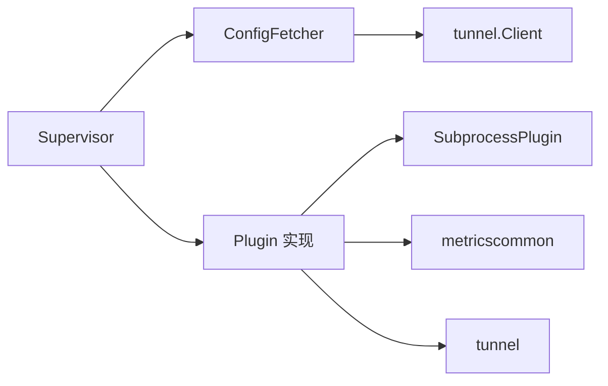

图表来源
- [supervisor.go:12-47](file://internal/edgeagent/plugins/supervisor.go#L12-L47)
- [config_tunnel.go:18-55](file://internal/edgeagent/plugins/config_tunnel.go#L18-L55)
- [subprocess.go:17-51](file://internal/edgeagent/plugins/subprocess.go#L17-L51)

章节来源
- [supervisor.go:12-301](file://internal/edgeagent/plugins/supervisor.go#L12-L301)
- [config_tunnel.go:18-519](file://internal/edgeagent/plugins/config_tunnel.go#L18-L519)
- [subprocess.go:17-391](file://internal/edgeagent/plugins/subprocess.go#L17-L391)

## 性能与资源限制
- 抓取频率与超时：各插件支持 scrape_interval 与 scrape_timeout，默认值避免过度负载；超时不得大于间隔，防止重叠抓取
- 指数退避重启：子进程崩溃后按 1s→2s→...→5min 退避，避免雪崩
- 指标去重：文件系统指标按物理设备去重，减少冗余系列
- 资源隔离：子进程独立工作目录与日志文件；配置写入采用临时文件+原子替换，避免部分写入影响
- 端口冲突防护：databasemetrics 对 listen_address 端口进行冲突检测，避免多个源争用同一端口

章节来源
- [custommetrics/spec.go:60-70](file://internal/edgeagent/plugins/custommetrics/spec.go#L60-L70)
- [databasemetrics/spec.go:79-92](file://internal/edgeagent/plugins/databasemetrics/spec.go#L79-L92)
- [subprocess.go:267-308](file://internal/edgeagent/plugins/subprocess.go#L267-L308)
- [metrics/scrape.go:115-127](file://internal/edgeagent/plugins/metrics/scrape.go#L115-L127)

## 故障排查指南
- 插件未启动：检查 Supervisor 日志中 “starting/stopping plugin” 与 “configure/start failed”；确认配置已正确下发且 enabled=true
- 子进程频繁重启：查看子进程日志文件（workDir/<name>.log），关注崩溃原因；检查配置校验是否通过
- 指标缺失：确认目标 /metrics 可达、鉴权正确；检查 scrape_interval/timeout；查看 TargetHealth 的 last_error 与 last_success_at
- 数据库连接失败：核对 secret 文件路径与权限（0600 或更严）；确认 exporter 二进制存在；检查 TLS 与连接串
- K8s 模式异常：确认 TunnelConfigFetcher 是否正确注入默认值（endpoint、cluster_id、node_name 等）；检查 manager_public_url 与网关开关

章节来源
- [supervisor.go:138-243](file://internal/edgeagent/plugins/supervisor.go#L138-L243)
- [subprocess.go:310-360](file://internal/edgeagent/plugins/subprocess.go#L310-L360)
- [databasemetrics/plugin.go:326-349](file://internal/edgeagent/plugins/databasemetrics/plugin.go#L326-L349)
- [config_tunnel.go:246-363](file://internal/edgeagent/plugins/config_tunnel.go#L246-L363)

## 结论
Ongrid 插件系统通过统一的 Plugin 接口与 Supervisor 协调器，实现了插件的可插拔、可观测与高可用。子进程隔离与配置原子化提升了安全性与稳定性；TunnelConfigFetcher 的环境感知与回退策略保障了在不同部署形态下的可用性。内置插件覆盖了主机、进程、数据库、日志与链路追踪等常见场景，配合严格的配置校验与健康上报，形成完整的遥测采集闭环。

## 附录：插件开发与配置指南

### 插件规范
- 实现 Plugin 接口：Name、Configure、Start、Stop、HealthSnapshot
- 若涉及子进程：优先使用 SubprocessPlugin，仅需提供 binary、workDir、configRender（可选）、configValidator（可选）、Args
- 可选能力：
  - ReadyPlugin：在 Start 后等待稳定就绪
  - ConfigApplyReporter：向管理器报告配置应用结果

章节来源
- [plugin.go:18-135](file://internal/edgeagent/plugins/plugin.go#L18-L135)
- [subprocess.go:86-135](file://internal/edgeagent/plugins/subprocess.go#L86-L135)

### 配置格式
- 全局字段：enabled、edge_id、endpoint、auth_user、auth_pass、spec
- 环境变量（EnvConfigFetcher）：ONGRID_EDGE_PLUGIN_<NAME>_ENABLED/ENDPOINT/AUTH_USER/AUTH_PASS/SPEC_JSON
- 隧道配置（TunnelConfigFetcher）：Manager 下发的 configs 映射，K8s 模式下自动注入默认值

章节来源
- [plugin.go:54-71](file://internal/edgeagent/plugins/plugin.go#L54-L71)
- [config_env.go:10-36](file://internal/edgeagent/plugins/config_env.go#L10-L36)
- [config_tunnel.go:100-186](file://internal/edgeagent/plugins/config_tunnel.go#L100-L186)

### 调试技巧
- 查看 Supervisor 日志：关注 “reconcile snapshot”、“starting/stopping plugin”、“plugin configure/start failed”
- 子进程日志：workDir/<name>.log，定位崩溃与配置错误
- 健康快照：通过 HealthSnapshot 观察 state、last_error、restart_count、targets
- 配置校验：子进程类插件使用 OTel 校验器，提前发现无效配置

章节来源
- [supervisor.go:138-243](file://internal/edgeagent/plugins/supervisor.go#L138-L243)
- [subprocess.go:310-360](file://internal/edgeagent/plugins/subprocess.go#L310-L360)
- [logs/plugin.go:27-41](file://internal/edgeagent/plugins/logs/plugin.go#L27-L41)
- [traces/plugin.go:31-49](file://internal/edgeagent/plugins/traces/plugin.go#L31-L49)

### 安全模型与资源限制
- 子进程隔离：每个子进程拥有独立工作目录与日志文件，崩溃不波及主进程
- 配置安全：配置渲染后先写临时文件，再原子替换；敏感信息仅存在于受控路径
- 凭据安全：数据库插件读取 secret 文件前进行权限校验（0600 或更严）
- 网络限制：抓取目标 URL 需显式配置；默认仅访问 localhost 的 exporter 端点
- 资源限制：通过 scrape_interval/timeout、样本上限、端口冲突检测等手段控制资源占用

章节来源
- [subprocess.go:140-206](file://internal/edgeagent/plugins/subprocess.go#L140-L206)
- [databasemetrics/plugin.go:326-349](file://internal/edgeagent/plugins/databasemetrics/plugin.go#L326-L349)
- [metrics/scrape.go:243-265](file://internal/edgeagent/plugins/metrics/scrape.go#L243-L265)
- [databasemetrics/spec.go:79-92](file://internal/edgeagent/plugins/databasemetrics/spec.go#L79-L92)