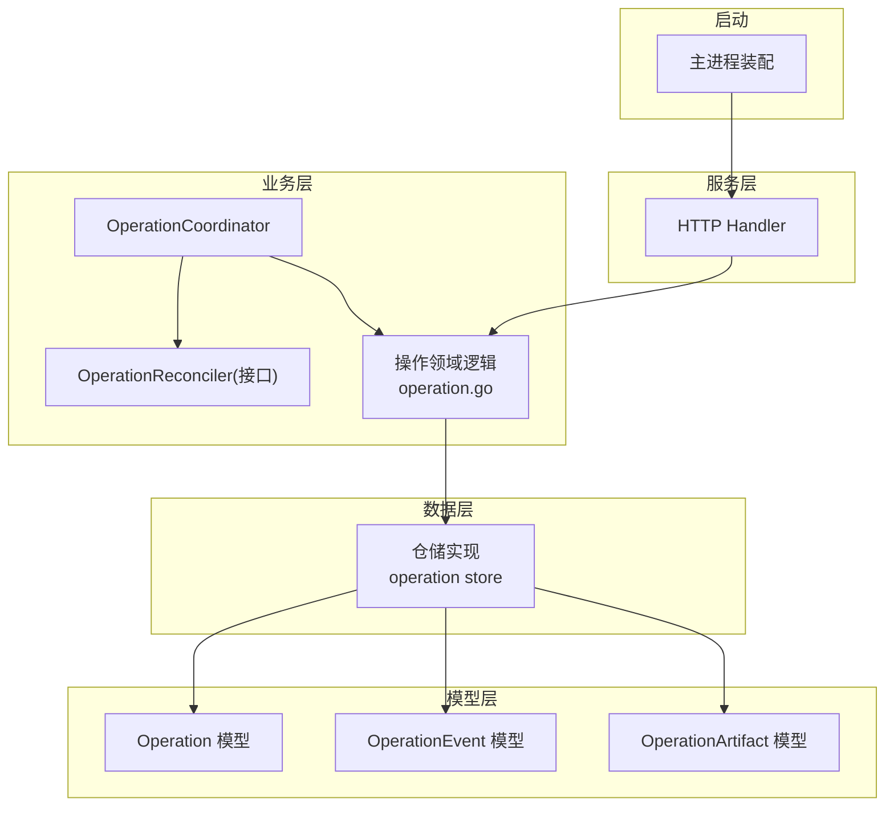
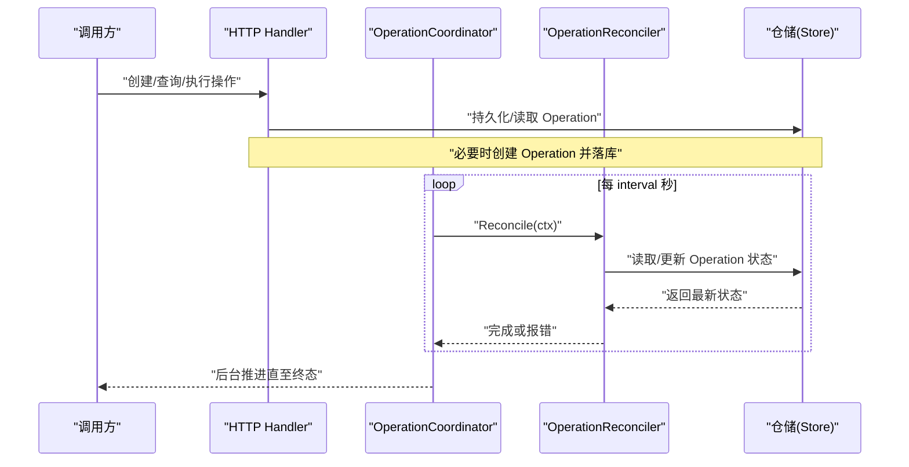
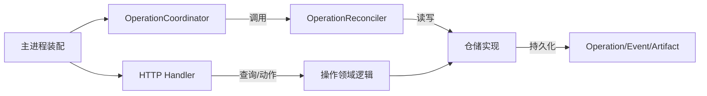
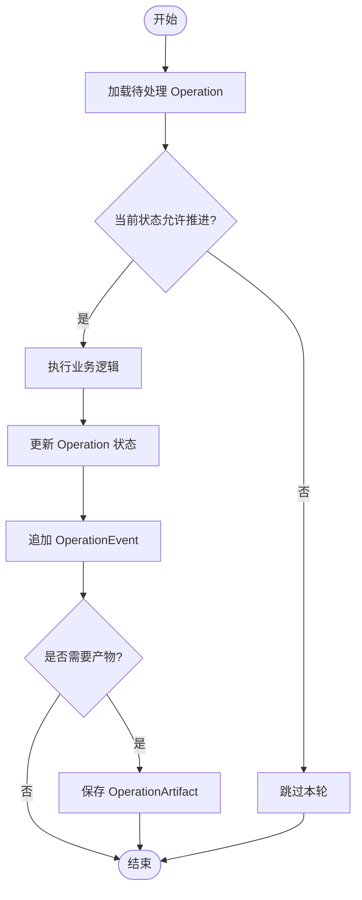
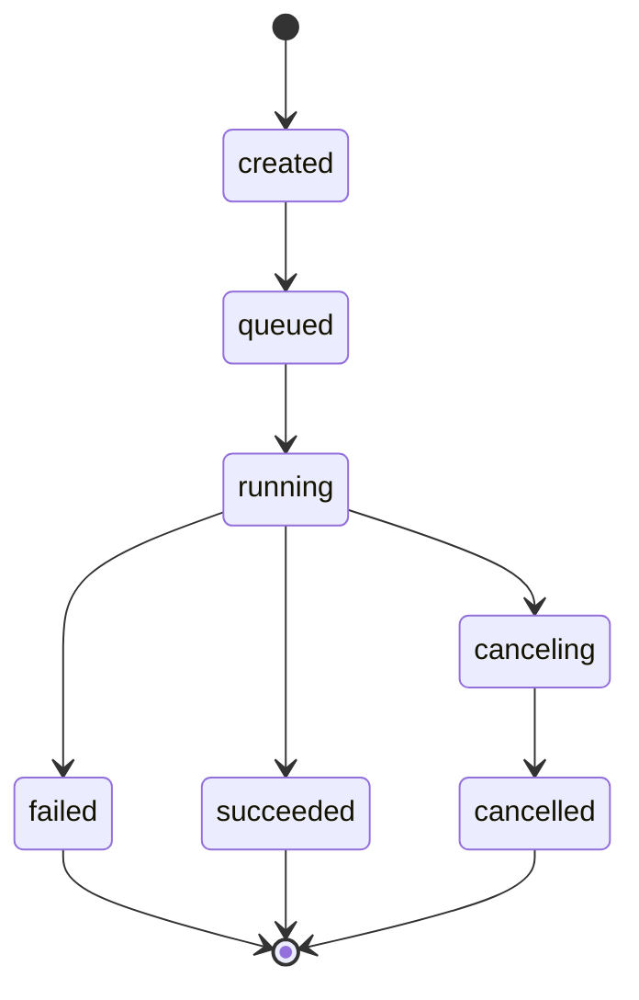

# AI 操作协调

<cite>
**本文引用的文件**
- [operation_coordinator.go](file://internal/manager/biz/aiops/operation_coordinator.go)
- [operation_coordinator_test.go](file://internal/manager/biz/aiops/operation_coordinator_test.go)
- [operation.go](file://internal/manager/biz/aiops/operation.go)
- [operation_model.go](file://internal/manager/model/aiops/operation.go)
- [operation_store.go](file://internal/manager/data/aiops/store/operation.go)
- [http_handler.go](file://internal/manager/server/aiops/http.go)
- [main.go](file://cmd/ongrid/main.go)
</cite>

## 目录
1. [简介](#简介)
2. [项目结构](#项目结构)
3. [核心组件](#核心组件)
4. [架构总览](#架构总览)
5. [详细组件分析](#详细组件分析)
6. [依赖关系分析](#依赖关系分析)
7. [性能考量](#性能考量)
8. [故障排查指南](#故障排查指南)
9. [结论](#结论)
10. [附录：扩展新操作类型示例](#附录：扩展新操作类型示例)

## 简介
本文件围绕 AI 操作协调机制，系统性说明 OperationReconciler 接口设计与 OperationCoordinator 实现，解释周期性任务调度、重启安全机制与错误处理策略；并阐述 AI Agent 操作的注册、调度与生命周期管理，涵盖并发控制、上下文管理与资源清理。文档包含操作协调的流程图与状态转换图，讨论操作冲突解决、重试机制与故障恢复策略，并提供扩展新操作类型的实践指引。

## 项目结构
AI 操作协调相关代码主要分布在以下层次：
- biz/aiops：业务编排层，定义 OperationReconciler 接口与 OperationCoordinator 调度器，以及操作领域模型与仓储接口。
- model/aiops：持久化模型，定义 Operation、OperationEvent、OperationArtifact 等表结构与状态常量。
- data/aiops/store：仓储实现，封装数据库访问与乐观锁更新。
- server/aiops：HTTP 服务层，提供操作查询与动作执行入口。
- cmd/ongrid：应用启动装配，将工具与协调器接入运行时。

图表来源
- [operation_coordinator.go:11-77](file://internal/manager/biz/aiops/operation_coordinator.go#L11-L77)
- [operation_model.go:10-88](file://internal/manager/model/aiops/operation.go#L10-L88)
- [operation_store.go:17-51](file://internal/manager/data/aiops/store/operation.go#L17-L51)
- [http_handler.go:94-115](file://internal/manager/server/aiops/http.go#L94-L115)
- [main.go:1584-1597](file://cmd/ongrid/main.go#L1584-L1597)

章节来源
- [operation_coordinator.go:11-77](file://internal/manager/biz/aiops/operation_coordinator.go#L11-L77)
- [operation_model.go:10-88](file://internal/manager/model/aiops/operation.go#L10-L88)
- [operation_store.go:17-51](file://internal/manager/data/aiops/store/operation.go#L17-L51)
- [http_handler.go:94-115](file://internal/manager/server/aiops/http.go#L94-L115)
- [main.go:1584-1597](file://cmd/ongrid/main.go#L1584-L1597)

## 核心组件
- OperationReconciler 接口：每个“操作种类”（Kind）由一个 Reconciler 负责推进其状态机，对外暴露 Kind() 与 Reconcile(ctx)。
- OperationCoordinator：集中管理多个 Reconciler，按固定周期调用 Reconcile，具备重启安全（进程启动后立即执行一次）、并发安全（读写锁保护注册表）与优雅停止（基于 context）。
- 操作模型与事件：Operation 表示可跨会话持久化的长任务；OperationEvent 为追加型事实；OperationArtifact 为用户可导航的结果产物。
- 仓储接口与实现：提供创建、查询、带状态校验的更新、事件追加幂等写入与产物管理。

章节来源
- [operation_coordinator.go:11-77](file://internal/manager/biz/aiops/operation_coordinator.go#L11-L77)
- [operation.go:14-32](file://internal/manager/biz/aiops/operation.go#L14-L32)
- [operation_model.go:10-88](file://internal/manager/model/aiops/operation.go#L10-L88)
- [operation_store.go:17-51](file://internal/manager/data/aiops/store/operation.go#L17-L51)

## 架构总览
OperationCoordinator 作为统一调度中心，周期性轮询所有已注册的 OperationReconciler，驱动各自维护的 Operation 状态机前进。上层通过 HTTP 接口触发或查询操作，底层仓储保证状态更新的原子性与幂等性。

图表来源
- [operation_coordinator.go:49-77](file://internal/manager/biz/aiops/operation_coordinator.go#L49-L77)
- [operation_store.go:17-51](file://internal/manager/data/aiops/store/operation.go#L17-L51)
- [http_handler.go:94-115](file://internal/manager/server/aiops/http.go#L94-L115)

## 详细组件分析

### OperationReconciler 接口设计
- Kind(): 唯一标识该 Reconciler 所管理的操作种类，用于注册去重与日志追踪。
- Reconcile(ctx): 在给定上下文中推进一种 Operation 的状态机，需支持取消与超时。

设计要点
- 单一职责：每个 Reconciler 只关心一种 Operation 的远程轮询与产物语义。
- 无状态外部化：协调器不持有业务状态，仅负责生命周期与调度。

章节来源
- [operation_coordinator.go:11-17](file://internal/manager/biz/aiops/operation_coordinator.go#L11-L17)

### OperationCoordinator 实现
- 构造：默认间隔 5 秒，默认日志器；interval<=0 时回退到默认值。
- 注册：线程安全地登记 Reconciler，拒绝空 Kind 与重复 Kind。
- 运行：立即执行一次 reconcile，随后按 ticker 周期执行；context 取消即退出。
- 错误处理：对单个 Reconciler 的错误记录警告日志，不影响其他 Reconciler 继续执行。

并发与一致性
- 使用 sync.RWMutex 保护 items 映射，读多写少场景下高效。
- 每次 tick 先拷贝 Reconciler 列表再遍历执行，避免在遍历期间被修改。

重启安全
- Run 会立即执行一次 reconcile，确保进程重启后尽快收敛状态。

章节来源
- [operation_coordinator.go:26-77](file://internal/manager/biz/aiops/operation_coordinator.go#L26-L77)
- [operation_coordinator_test.go:13-30](file://internal/manager/biz/aiops/operation_coordinator_test.go#L13-L30)

### 操作状态机与持久化
- 状态常量：created、queued、running、canceling、succeeded、failed、cancelled。
- Operation：承载会话归属、创建者、操作种类、标题、摘要、输入与动作、详情链接、终止时间等。
- OperationEvent：追加型、幂等的事实表，用于审计与回放。
- OperationArtifact：用户可导航的产物，如报告、页面、文件或外链。

状态流转（概念）
- created → queued → running → {succeeded | failed | cancelled}
- canceling 为过渡态，最终进入 cancelled。

章节来源
- [operation_model.go:10-88](file://internal/manager/model/aiops/operation.go#L10-L88)

### 仓储与冲突解决
- UpdateOperation 支持传入允许的前置状态集合，若当前状态不在允许集合则视为冲突（RowsAffected==0），返回冲突错误。
- AppendOperationEvent 以 operation_id + dedupe_key 做唯一约束，确保幂等追加。
- 失败路径：数据库错误包装为业务错误；未找到记录返回 NotFound。

章节来源
- [operation_store.go:17-51](file://internal/manager/data/aiops/store/operation.go#L17-L51)

### HTTP 集成与操作动作
- Handler 聚合 AIOpsService、模型目录、Agent 列表、操作读取器与操作动作执行器。
- OperationReader 提供按所有者查询与列出产物能力。
- OperationActionExecutor 用于从 HTTP 层触发具体动作（如取消、重试等）。

章节来源
- [http_handler.go:94-115](file://internal/manager/server/aiops/http.go#L94-L115)

### 启动装配与工具链
- 主进程在启动时将协调相关的工具（如 AgentTool、SendMessageTool、TaskStopTool）注入运行时，使 Agent 能够发起/停止操作。
- 同时注册默认 Agent 与能力上限，保障对话式操作的可控性。

章节来源
- [main.go:1584-1597](file://cmd/ongrid/main.go#L1584-L1597)

## 依赖关系分析
- OperationCoordinator 依赖 OperationReconciler 抽象，不耦合具体业务。
- 业务 Reconciler 依赖仓储接口，进而依赖模型与数据库。
- HTTP 层通过 OperationReader 与 OperationActionExecutor 与业务解耦。
- 启动阶段将工具与协调器装配进运行时，形成“对话→工具→操作→持久化→协调器推进”的闭环。

图表来源
- [operation_coordinator.go:19-77](file://internal/manager/biz/aiops/operation_coordinator.go#L19-L77)
- [operation_store.go:17-51](file://internal/manager/data/aiops/store/operation.go#L17-L51)
- [http_handler.go:94-115](file://internal/manager/server/aiops/http.go#L94-L115)
- [main.go:1584-1597](file://cmd/ongrid/main.go#L1584-L1597)

章节来源
- [operation_coordinator.go:19-77](file://internal/manager/biz/aiops/operation_coordinator.go#L19-L77)
- [operation_store.go:17-51](file://internal/manager/data/aiops/store/operation.go#L17-L51)
- [http_handler.go:94-115](file://internal/manager/server/aiops/http.go#L94-L115)
- [main.go:1584-1597](file://cmd/ongrid/main.go#L1584-L1597)

## 性能考量
- 调度粒度：默认 5 秒轮询，可按需调整；对于高吞吐场景建议结合队列或批处理。
- 并发度：协调器串行调用各 Reconciler 的 Reconcile；若 Reconciler 内部有 I/O，应使用 goroutine 并发但注意限流与资源释放。
- 锁竞争：Register 为写锁，Run 内为读锁+拷贝列表，降低热点争用。
- 日志与指标：建议在 Reconcile 中埋点耗时与错误率，便于定位慢操作。

[本节为通用指导，无需源码引用]

## 故障排查指南
常见问题与定位要点
- 重复注册 Kind：Register 会拒绝重复 Kind，检查是否多处实例化同一 Reconciler。
- 状态冲突：UpdateOperation 要求前置状态匹配，若 RowsAffected=0 说明状态已被其他流程改变，应重试或走分支逻辑。
- 上下文取消：Run 遇到 ctx.Done 立即退出；若 Reconcile 长时间阻塞，需响应 ctx 并及时返回。
- 事件幂等：AppendOperationEvent 依赖 dedupe_key，确保业务侧生成稳定键以避免重复。
- 产物不可见：确认 CreateOperationArtifact 成功且 URL 合法，HTTP 层 ListArtifacts 能正确返回。

章节来源
- [operation_coordinator.go:36-47](file://internal/manager/biz/aiops/operation_coordinator.go#L36-L47)
- [operation_store.go:38-51](file://internal/manager/data/aiops/store/operation.go#L38-L51)
- [operation_coordinator_test.go:13-30](file://internal/manager/biz/aiops/operation_coordinator_test.go#L13-L30)

## 结论
OperationReconciler + OperationCoordinator 提供了轻量、可扩展、重启安全的 AI 操作协调基座。通过统一的周期调度、上下文取消与并发安全，配合幂等的仓储与清晰的状态机，使得长生命周期、可中断、可观测的 AI 操作得以稳定运行。HTTP 层与启动装配进一步打通了“对话—工具—操作—持久化—推进”的全链路。

[本节为总结性内容，无需源码引用]

## 附录：扩展新操作类型示例
目标：新增一种名为 “network_probe” 的操作类型，使其能被协调器周期性推进，并在数据库中持久化状态与事件。

步骤概览
1. 定义 Reconciler
   - 实现 OperationReconciler 接口：Kind() 返回 "network_probe"；Reconcile(ctx) 读取待处理的 Operation，执行业务逻辑，更新状态并追加事件。
   - 参考路径：[operation_coordinator.go:11-17](file://internal/manager/biz/aiops/operation_coordinator.go#L11-L17)

2. 注册 Reconciler
   - 在应用启动时创建 OperationCoordinator 并 Register 你的 Reconciler。
   - 参考路径：[operation_coordinator.go:26-47](file://internal/manager/biz/aiops/operation_coordinator.go#L26-L47)

3. 持久化与状态更新
   - 使用仓储接口创建/查询/更新 Operation，遵循前置状态集进行乐观锁更新。
   - 使用 AppendOperationEvent 追加审计事件，确保 dedupe_key 稳定。
   - 参考路径：[operation_store.go:17-51](file://internal/manager/data/aiops/store/operation.go#L17-L51)

4. 产物与详情
   - 如需产出报告或链接，调用 CreateOperationArtifact 并设置 URL/Metadata。
   - 参考路径：[operation_model.go:68-88](file://internal/manager/model/aiops/operation.go#L68-L88)

5. 启动装配
   - 在主进程中装配协调器与工具，确保 Agent 可通过工具触发/停止操作。
   - 参考路径：[main.go:1584-1597](file://cmd/ongrid/main.go#L1584-L1597)

关键流程图（Reconcile 推进）

图表来源
- [operation_store.go:17-51](file://internal/manager/data/aiops/store/operation.go#L17-L51)
- [operation_model.go:10-88](file://internal/manager/model/aiops/operation.go#L10-L88)

状态转换图（Operation）

图表来源
- [operation_model.go:10-18](file://internal/manager/model/aiops/operation.go#L10-L18)

扩展时的注意事项
- 并发与取消：Reconcile 必须响应 ctx，及时释放资源。
- 幂等与重试：对远端调用采用指数退避重试；事件追加使用 dedupe_key 防重。
- 冲突处理：当 UpdateOperation 返回冲突时，重新拉取最新状态并决策下一步。
- 可观测性：记录 Kind、OperationID、耗时与错误码，便于排障。

章节来源
- [operation_coordinator.go:49-77](file://internal/manager/biz/aiops/operation_coordinator.go#L49-L77)
- [operation_store.go:17-51](file://internal/manager/data/aiops/store/operation.go#L17-L51)
- [operation_model.go:10-88](file://internal/manager/model/aiops/operation.go#L10-L88)
- [main.go:1584-1597](file://cmd/ongrid/main.go#L1584-L1597)